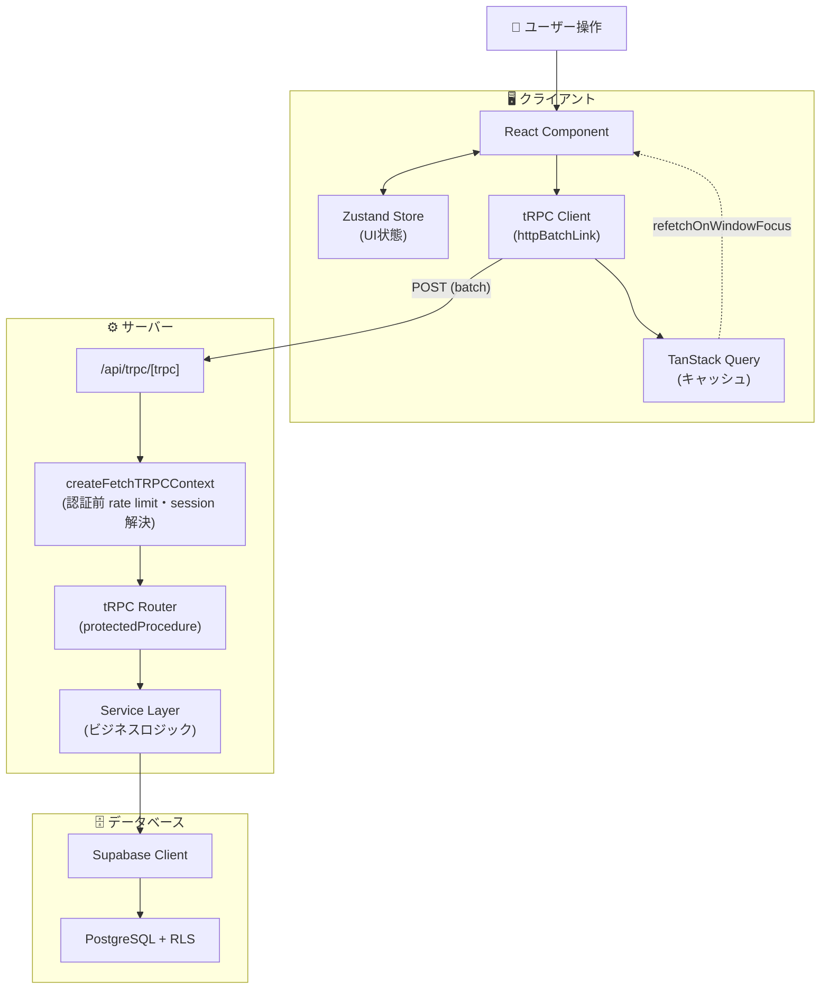
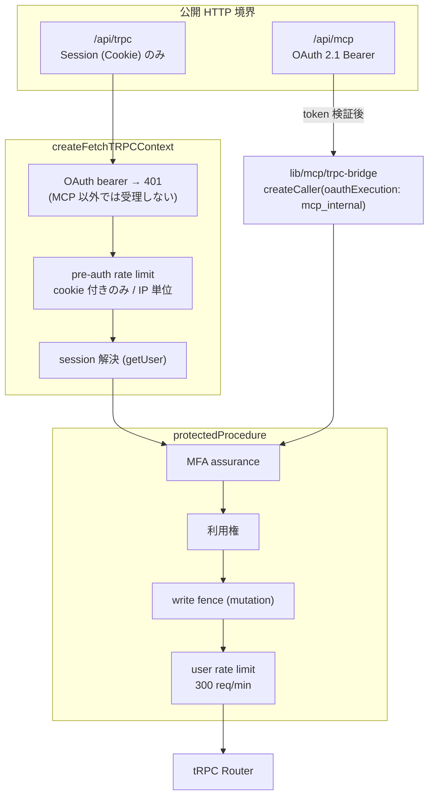
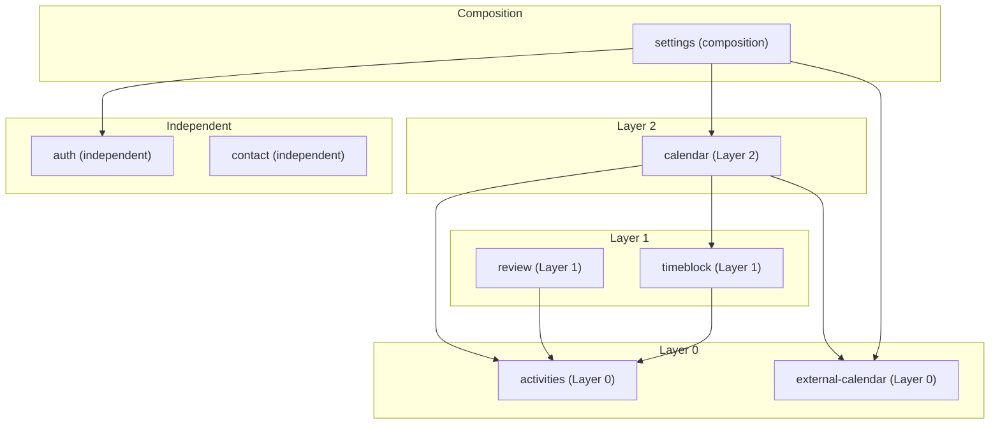
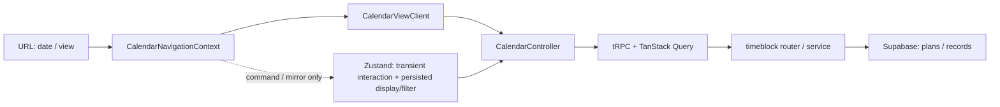
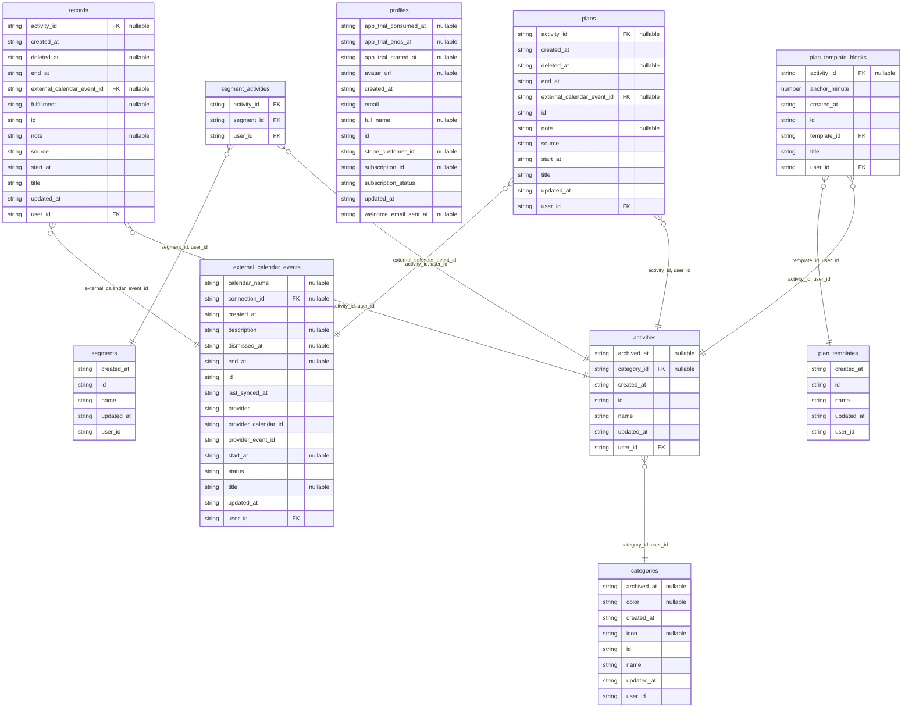

# アーキテクチャ全体像

Dayopt のシステム構成、データフロー、DB スキーマ、技術選定理由、monorepo の package 境界をまとめる。「全体構成の現在地は?」の正。

---

概念から変更候補を調べる入口: [Architecture Inventory](./data/architecture-inventory.md#探索の入口)。Plan / Record / Activity / Calendar surface から DB・API・UI/Story・テスト・docs の実ファイルへ辿れる。[更新と図の表示手順](./data/architecture/README.md)も参照。

## 技術スタック

ここでは役割と採用理由だけを扱う。正確なversionはrootと各workspaceの`package.json`、DB runtimeはSupabase Dashboardを正とする。

### フロントエンド

- **Next.js App Router** — React フレームワーク。ファイルベースルーティング、Server Components / Client Components、`next/image` による画像最適化
- **React** — UI ライブラリ。業界標準、Server Components サポート
- **TypeScript** — 型安全性、IDE 補完、バグ防止
- **Tailwind CSS + shadcn/ui** — ユーティリティファーストのスタイリングと、Radix UI ベースのカスタマイズ可能な UI コンポーネント
- **Zustand** — クライアント状態管理。Redux よりボイラープレートが少なく学習コストが低い
- **TanStack Query** — サーバー状態のキャッシング・自動リフェッチ・楽観的更新

### バックエンド

- **Supabase (PostgreSQL)** — 認証と DB。PostgreSQL（SQL が使える）、RLS によるセキュリティ、オープンソースである点が採用理由。**Realtime は採用していない**（`postgres_changes` 購読ゼロ、publication 0 件。キャッシュ整合は TanStack Query の invalidate で取る）
- **tRPC** — クライアント⇔サーバー間の E2E 型安全な API 通信。スキーマ自動生成不要、型の不整合はコンパイルエラーになる
- **Zod** — バリデーション。型推論と tRPC 統合

### ホスティング・デプロイ

- **Vercel** — Next.js との最適な統合、自動デプロイ、エッジ配信
- **GitHub 連携** — CI/CD

### 技術選定の理由まとめ

| 技術           | 採用理由                             |
| -------------- | ------------------------------------ |
| Next.js        | React の公式推奨、Vercel との親和性  |
| React          | 業界標準、Server Components サポート |
| TypeScript     | 型安全性、IDE 補完、バグ防止         |
| tRPC           | E2E 型安全、コード量削減             |
| Zustand        | シンプル、Redux 不要                 |
| TanStack Query | キャッシング、リフェッチ             |
| Supabase       | 認証、DB、RLS を一体で提供           |
| Tailwind CSS   | ユーティリティファースト             |
| shadcn/ui      | カスタマイズ可能、Radix UI ベース    |
| Zod            | 型推論、tRPC と統合                  |

Zustand と TanStack Query の使い分け:

- **TanStack Query**: サーバーから取得したデータ
- **Zustand**: UI の状態（サイドバー、選択状態など）

---

## データフロー

Dayopt におけるデータの流れ。ユーザー操作から DB までの全レイヤーを図解する。

### 全体像



### 認証フロー

OAuth bearer が tRPC へ到達する経路は **MCP endpoint の内部実行だけ**で、公開 HTTP 境界の
`/api/trpc` へ同じ token を投げても DB を引く前に 401 になる。rate limit は 2 段で、
認証前（cookie 付きのみ、IP 単位）と認証後（user 単位）は別の bucket。



- `service-role`（`X-API-Key`）モードは context に存在するが、全 procedure が `ctx.userId` を
  要求するため公開境界からは到達できない（内部 caller 専用）
- OAuth caller は user rate limit を消費しない（MCP 側の専用 limiter で一度だけ制限する）

### Provider 階層

実体は `app/[locale]/(app)/_providers/_composition/ProvidersComposition.tsx`。**入れ子の順序をここに写さない**
（2026-09-16 に、実装と食い違ったまま残っていた図を撤去した。#2747 で並びが変わっている）。

守る規則だけを書く:

- Context を張るのは `PersistQueryClientProvider` → `api.Provider`（tRPC）→ `ThemeProvider` の 3 つだけ
- 副作用だけの component（`AuthStoreInitializer` / `QueryCacheAuthBoundary` / `SessionMonitorProvider` / `ServiceWorkerProvider`）は children を包まず並列に置く。包むと遅延ロードが描画を止める
- children を包むのは、データを待たせる必要がある `UserSettingsInitializer` と `BillingAccessProvider` だけ

### キャッシュ戦略

既定値は `src/lib/trpc/query-client.ts` が正本（2026-09-16 時点で staleTime 5 分 / gcTime 2 時間、gcTime は
IndexedDB 永続化の上限と同じ値）。hook 側で個別に上書きするものがあるため、**この doc に数値を写さない**。

方針:

- サーバーデータは TanStack Query に置き、Zustand へ複製しない
- 変更が自分の操作でしか起きないものは invalidate で整合を取る（Realtime は使わない）
- 永続化の対象は `should-persist-query.ts` が決める。認証主体が変われば `QueryCacheAuthBoundary` が cache を捨てる

### Feature 間の依存（Composition Layer）

<!-- architecture-map:feature-dag:start — 正本 apps/product/eslint.config.mjs の no-restricted-imports と features/ の実 import / 再生成 pnpm architecture:generate / 検証 pnpm architecture:check。この範囲は手編集しない -->

実際の runtime import（stories / test を除く）を描く。層は依存の最長経路、種別（Layer 0 / independent / composition）は ESLint の規則から取る。



<!-- architecture-map:feature-dag:end -->

依存方向の正はリポジトリルートの [AGENTS.md](../../AGENTS.md) と
`apps/product/eslint.config.mjs`。`settings` は cross-cutting composition、`calendar` はページ全体を合成する hub として扱う。

### Calendar の Plan / Record と UI state

Calendar は Plan（予定）と Record（記録）を別レーンで描画し、時間の重なりと期間集計から比較を導出する。



- 日付と view range は URL と `CalendarNavigationContext` が source of truth。
- 振り返りは `/report` として独立した画面。かつて Calendar shell の右パネル（`panel=review` / `panel=diff`）だったが、
  現在その query は legacy redirect の入口としてだけ残る（`panel-url.ts` / `proxy.ts`。2026-09-16 に記述を更新）。
- Zustand は drag、inline create、clipboard、inspector、shell などの一時 UI state と、表示モード・アクティビティフィルターのユーザー設定だけを担う。URL/Context の値を永続化しない。
- Plan / Record / activity などのサーバーデータは Zustand に複製せず、tRPC / TanStack Query 経由で扱う。

### 各レイヤーの役割

#### 1. React Component

ユーザー操作を受け取り、tRPC mutation を呼び出す。

```typescript
const handleCreatePlan = async (data) => {
  await createPlan.mutateAsync(data);
};
```

#### 2. tRPC Client + TanStack Query

型安全な API 呼び出しとキャッシュ管理。

```typescript
const createPlan = api.planCommands.create.useMutation({
  onSuccess: () => {
    utils.plans.list.invalidate(); // キャッシュ無効化→再取得
  },
});
```

**なぜ tRPC か**: クライアント↔サーバー間の型安全性、自動補完、REST API より少ないコード量。

**なぜ TanStack Query か**: サーバーデータのキャッシング、自動リフェッチ、楽観的更新のサポート。

#### 3. tRPC Router

入力バリデーションと認証チェック。ルーターは薄く保つ。

```typescript
create: protectedProcedure.input(createPlanSchema).mutation(async ({ ctx, input }) => {
  const service = createPlanService(ctx.supabase);
  return service.create({ userId: ctx.userId, ...input });
});
```

#### 4. Service Layer

ビジネスロジックを集約。テストしやすく、再利用可能。

```typescript
class PlanService {
  async create(params) {
    // バリデーション
    // ビジネスロジック
    // DB操作
  }
}
```

**なぜ Service 層を分けるか**: ビジネスロジックの再利用、テストしやすさ、ルーターを薄く保つ。

#### 5. Supabase Client

```typescript
const { data, error } = await this.supabase.from('plans').insert(planData).select().single();
```

#### 6. PostgreSQL + RLS

データベースレベルでのセキュリティ。

```sql
CREATE POLICY "Users can manage own plans"
ON plans FOR ALL
USING (auth.uid() = user_id);
```

**なぜ RLS か**: アプリケーションコードでの漏れを防ぐ、ゼロトラスト原則。

### 状態管理の使い分け

| 状態の種類               | 管理方法       | 例                               |
| ------------------------ | -------------- | -------------------------------- |
| **サーバーデータ**       | TanStack Query | 予定・記録一覧、アクティビティ   |
| **UI状態（グローバル）** | Zustand        | サイドバー開閉、選択中のアイテム |
| **UI状態（ローカル）**   | useState       | フォームの入力値、モーダルの開閉 |
| **URL状態**              | Next.js Router | 現在のページ、クエリパラメータ   |

詳細は [`conventions-frontend.md`](./conventions-frontend.md) の状態管理セクションを参照。

### 楽観的更新のフロー

```
[ユーザー操作]
     ↓
[キャッシュを即座に更新] ← 体感0ms
     ↓
[tRPC mutation送信]
     ├─ 成功 → キャッシュ確定
     └─ 失敗 → キャッシュをロールバック + toast.error()
```

### 相互作用図（ツール間の連携）

```
┌─────────────────────────────────────────────────────────┐
│                    Frontend                             │
├─────────────────────────────────────────────────────────┤
│                                                         │
│  ┌─────────────┐    ┌─────────────┐    ┌─────────────┐ │
│  │  shadcn/ui  │───▶│    React    │◀───│  Tailwind   │ │
│  │  (UI部品)   │    │ (Component) │    │  (Style)    │ │
│  └─────────────┘    └──────┬──────┘    └─────────────┘ │
│                            │                            │
│                            ▼                            │
│  ┌─────────────┐    ┌─────────────┐                    │
│  │   Zustand   │◀──▶│TanStack Query│                   │
│  │  (UI状態)   │    │(サーバー状態)│                   │
│  └─────────────┘    └──────┬──────┘                    │
│                            │                            │
│                            ▼                            │
│                    ┌─────────────┐                      │
│                    │ tRPC Client │                      │
│                    │ (型安全API) │                      │
│                    └──────┬──────┘                      │
└────────────────────────────┼────────────────────────────┘
                             │
                             ▼
┌─────────────────────────────────────────────────────────┐
│                    Backend                              │
├─────────────────────────────────────────────────────────┤
│                    ┌─────────────┐                      │
│                    │ tRPC Router │                      │
│                    │ (+ Zod)     │                      │
│                    └──────┬──────┘                      │
│                            │                            │
│                            ▼                            │
│                    ┌─────────────┐                      │
│                    │   Service   │                      │
│                    │   Layer     │                      │
│                    └──────┬──────┘                      │
│                            │                            │
│                            ▼                            │
│                    ┌─────────────┐                      │
│                    │  Supabase   │                      │
│                    │ (Auth+DB)   │                      │
│                    └─────────────┘                      │
└─────────────────────────────────────────────────────────┘
```

---

## Database Architecture

> **PostgreSQL**: v17。RLS 対象テーブル数・policy 数は [`data/db/rls-snapshot.md`](./data/db/rls-snapshot.md) の集計行を正とする（ここに書くと二重管理になり陳腐化する）

Dayopt は Supabase（PostgreSQL）を使用する。本番は Pro organization の `dayopt` project、PR ごとの検証は ephemeral Preview Branches を使い、永続 Staging project は置かない。
RLS の正確な対象・policy・grant は自動生成の [`data/db/rls-snapshot.md`](./data/db/rls-snapshot.md) を正とする。

実装から自動発見した項目（feature / テーブル / 関数 / router / procedure / MCP tool / store / Story / route / i18n）と用語集の概念との対応は [`data/architecture-inventory.md`](./data/architecture-inventory.md)（生成物）を見る。概念が付いていない項目は「概念を足す候補」と「語彙を持たない層」に分かれており、後者の判定規則は `scripts/lib/architecture-map/vocabulary-scope.ts` が持つ。

外部との接点（HTTP route / 定期実行 / Edge Function）、権限と上限（OAuth scope / procedure builder / rate limit）、DB エラーコード、分析イベント、env 変数、package、および呼び出し関係（MCP tool → procedure、procedure の利用元と未使用、store の利用元、docs → feature、E2E → route、DB 関数の test 被覆）は [`data/system-surface.md`](./data/system-surface.md)（生成物）を見る。

### テーブルの役割（手書き）

一覧・列・FK は下の生成ブロックが正で、ここは役割の説明だけを持つ。ここに無いテーブルは生成ブロックのテーブル一覧で見る。

#### コアビジネス

| テーブル                     | 役割                                                             | 主要カラム                                                                                                               |
| ---------------------------- | ---------------------------------------------------------------- | ------------------------------------------------------------------------------------------------------------------------ |
| **plans**                    | Plan（予定）。これからやる時間の宣言                             | title, activity_id, start_at, end_at, source, external_calendar_event_id                                                 |
| **records**                  | Record（記録）。予定とは独立                                     | title, activity_id, start_at, end_at, source, external_calendar_event_id                                                 |
| **external_calendar_events** | 外部カレンダー同期ミラー（Google の取り込みが稼働中）            | connection_id, provider, provider_calendar_id, provider_event_id, start_at, end_at, status, dismissed_at, last_synced_at |
| **categories**               | 所属の主軸。単一所属（`activities.category_id` 1本で表現）       | name, color, icon, archived_at                                                                                           |
| **activities**               | Plan / Record の分類単位。所属カテゴリーから色・アイコンを継承   | category_id, name, archived_at                                                                                           |
| **segments**                 | 撤去済み（2026-09-15）。UI / tRPC / MCP は無く、table だけが残る | name                                                                                                                     |
| **segment_activities**       | 同上（drop は不可逆なので別変更）                                | segment_id, activity_id                                                                                                  |

#### 外部カレンダー連携

外部カレンダー取り込みで追加。取り込みは `calendar-sync` の定期実行が動いている（間隔は [`data/system-surface.md`](./data/system-surface.md) の定期実行を見る）。

| テーブル                          | 役割                                                              | 主要カラム                                                                                       |
| --------------------------------- | ----------------------------------------------------------------- | ------------------------------------------------------------------------------------------------ |
| **calendar_connections**          | provider アカウント接続。同一 provider の複数アカウントを許容     | provider, provider_account_id, provider_account_email, granted_scopes, refresh_token_enc, status |
| **calendar_connection_calendars** | 取り込み対象として選択されたカレンダーと per-calendar sync cursor | connection_id, provider_calendar_id, calendar_name, sync_token, last_synced_at                   |

`calendar_connections.refresh_token_enc` / `granted_scopes` / `provider_account_id` は authenticated へ GRANT しない（column-scoped SELECT）。詳細は [`data/db/rls-snapshot.md`](./data/db/rls-snapshot.md)。

#### ユーザー設定

| テーブル          | 役割                                    | 主要カラム                                                                                                         |
| ----------------- | --------------------------------------- | ------------------------------------------------------------------------------------------------------------------ |
| **profiles**      | ユーザープロフィール（auth.usersと1:1） | email, username, full_name, avatar_url                                                                             |
| **user_settings** | 表示設定                                | timezone, theme, time format, default duration, business hours。物理スキーマの legacy 列はプロダクト契約に含めない |

#### セキュリティ/監査

| テーブル               | 役割                | 主要カラム                  |
| ---------------------- | ------------------- | --------------------------- |
| **mfa_recovery_codes** | MFAリカバリーコード | code_hash(SHA-256), used_at |

<!-- architecture-map:er:start — 正本 apps/product/src/lib/database/generated/database.types.ts / 再生成 pnpm architecture:generate / 検証 pnpm architecture:check。この範囲は手編集しない -->

### テーブル一覧（public、30 テーブル）

| テーブル                        | 列数 | FK 参照先                                                       |
| ------------------------------- | ---- | --------------------------------------------------------------- |
| `activities`                    | 7    | `categories`                                                    |
| `calendar_connection_calendars` | 9    | `calendar_connections`                                          |
| `calendar_connections`          | 18   | —                                                               |
| `categories`                    | 8    | —                                                               |
| `cron_heartbeats`               | 4    | —                                                               |
| `email_suppressions`            | 5    | —                                                               |
| `external_calendar_events`      | 16   | `calendar_connections`                                          |
| `mcp_environment_identity`      | 6    | —                                                               |
| `mcp_mutation_control`          | 6    | —                                                               |
| `mcp_mutation_receipts`         | 16   | `oauth_connections`                                             |
| `mfa_recovery_codes`            | 5    | —                                                               |
| `oauth_audit_log`               | 6    | `oauth_tokens`                                                  |
| `oauth_authorization_codes`     | 12   | `mcp_environment_identity`, `oauth_connections`                 |
| `oauth_connections`             | 16   | `mcp_environment_identity`                                      |
| `oauth_tokens`                  | 14   | `mcp_environment_identity`, `oauth_connections`, `oauth_tokens` |
| `plan_template_blocks`          | 7    | `activities`, `plan_templates`                                  |
| `plan_templates`                | 5    | —                                                               |
| `plans`                         | 12   | `activities`, `external_calendar_events`                        |
| `product_events`                | 5    | —                                                               |
| `profiles`                      | 13   | —                                                               |
| `records`                       | 13   | `activities`, `external_calendar_events`                        |
| `reports`                       | 8    | —                                                               |
| `segment_activities`            | 3    | `activities`, `segments`                                        |
| `segments`                      | 5    | —                                                               |
| `stripe_webhook_events`         | 6    | —                                                               |
| `undo_receipt_effects`          | 7    | `plans`, `records`, `undo_receipts`                             |
| `undo_receipt_field_changes`    | 5    | `undo_receipt_effects`                                          |
| `undo_receipts`                 | 12   | `oauth_connections`                                             |
| `user_settings`                 | 16   | —                                                               |
| `write_fence_control`           | 3    | —                                                               |

### ER 図: 概念に紐づくテーブル

用語集（`docs/product/glossary.md`）の DB 列が指すテーブルだけを描く。部分集合の外へ向かう FK は全体図で見る。



### ER 図: 全テーブル

```mermaid
erDiagram
  activities {
    string archived_at "nullable"
    string category_id FK "nullable"
    string created_at
    string id
    string name
    string updated_at
    string user_id FK
  }
  calendar_connection_calendars {
    string calendar_name "nullable"
    string connection_id FK
    string created_at
    string id
    string last_synced_at "nullable"
    string provider_calendar_id
    string sync_token "nullable"
    string updated_at
    string user_id FK
  }
  calendar_connections {
    number authority_epoch "nullable"
    string authority_fence_id "nullable"
    number consecutive_failures
    string created_at
    number data_generation
    string_array granted_scopes
    string id
    string last_sync_error "nullable"
    string last_synced_at "nullable"
    string provider
    string provider_account_email "nullable"
    string provider_account_id
    string refresh_token_enc
    string refresh_token_rotation_operation_id "nullable"
    string status
    number sync_sequence
    string updated_at
    string user_id
  }
  categories {
    string archived_at "nullable"
    string color "nullable"
    string created_at
    string icon "nullable"
    string id
    string name
    string updated_at
    string user_id
  }
  cron_heartbeats {
    string job_name
    string last_completed_at "nullable"
    string last_started_at
    json last_summary "nullable"
  }
  email_suppressions {
    string created_at
    string email
    string id
    string reason
    string source_event_id "nullable"
  }
  external_calendar_events {
    string calendar_name "nullable"
    string connection_id FK "nullable"
    string created_at
    string description "nullable"
    string dismissed_at "nullable"
    string end_at "nullable"
    string id
    string last_synced_at
    string provider
    string provider_calendar_id
    string provider_event_id
    string start_at "nullable"
    string status
    string title "nullable"
    string updated_at
    string user_id FK
  }
  mcp_environment_identity {
    string authorization_server_uri
    string environment
    string provisioned_at
    string resource_uri
    boolean singleton_key
    string supabase_project_ref "nullable"
  }
  mcp_mutation_control {
    boolean billing_enforced
    string changed_at
    string_array enabled_client_ids
    number revision
    boolean singleton_key
    boolean writes_enabled
  }
  mcp_mutation_receipts {
    string applied_at
    string client_id
    number data_generation
    number digest_version
    number envelope_version
    string operation_id
    string origin_connection_id FK "nullable"
    string purged_at "nullable"
    number purged_generation "nullable"
    string request_digest
    string resource_deleted_at "nullable"
    string resource_id
    string resource_type
    string resource_version
    string tool_name
    string user_id
  }
  mfa_recovery_codes {
    string code_hash
    string created_at
    string id
    string used_at "nullable"
    string user_id
  }
  oauth_audit_log {
    string called_at
    string client_id
    string id
    string token_id FK "nullable"
    string tool_name
    string user_id
  }
  oauth_authorization_codes {
    string client_id FK
    string code_challenge
    string code_challenge_method
    string code_hash
    string connection_id FK "nullable"
    string consumed_at "nullable"
    string created_at
    string expires_at
    string redirect_uri
    string resource_uri FK "nullable"
    string_array scopes
    string user_id FK
  }
  oauth_connections {
    string authorized_at
    string client_id
    number consent_version
    string created_at
    string id
    string last_refreshed_at "nullable"
    string last_used_at "nullable"
    boolean legacy_read_only
    string reauth_required_at
    string resource_uri FK
    string revoked_at "nullable"
    string revoked_reason "nullable"
    string_array scopes
    string updated_at
    string user_id
    string write_enabled_at "nullable"
  }
  oauth_tokens {
    string client_id FK
    string connection_id FK "nullable"
    string created_at
    string expires_at
    string id
    string last_used_at "nullable"
    string parent_token_id FK "nullable"
    string resource_uri FK "nullable"
    string revoked_at "nullable"
    string rotated_at "nullable"
    string_array scopes
    string token_hash
    string token_type
    string user_id FK
  }
  plan_template_blocks {
    string activity_id FK "nullable"
    number anchor_minute
    string created_at
    string id
    string template_id FK
    string title
    string user_id FK
  }
  plan_templates {
    string created_at
    string id
    string name
    string updated_at
    string user_id
  }
  plans {
    string activity_id FK "nullable"
    string created_at
    string deleted_at "nullable"
    string end_at
    string external_calendar_event_id FK "nullable"
    string id
    string note "nullable"
    string source
    string start_at
    string title
    string updated_at
    string user_id FK
  }
  product_events {
    string created_at
    string event_name
    string id
    json properties
    string user_id
  }
  profiles {
    string app_trial_consumed_at "nullable"
    string app_trial_ends_at "nullable"
    string app_trial_started_at "nullable"
    string avatar_url "nullable"
    string created_at
    string email
    string full_name "nullable"
    string id
    string stripe_customer_id "nullable"
    string subscription_id "nullable"
    string subscription_status
    string updated_at
    string welcome_email_sent_at "nullable"
  }
  records {
    string activity_id FK "nullable"
    string created_at
    string deleted_at "nullable"
    string end_at
    string external_calendar_event_id FK "nullable"
    string fulfillment "nullable"
    string id
    string note "nullable"
    string source
    string start_at
    string title
    string updated_at
    string user_id FK
  }
  reports {
    json content
    string created_at
    string id
    string period_end
    string period_start
    string period_type
    string summary
    string user_id
  }
  segment_activities {
    string activity_id FK
    string segment_id FK
    string user_id FK
  }
  segments {
    string created_at
    string id
    string name
    string updated_at
    string user_id
  }
  stripe_webhook_events {
    string claimed_at
    string event_id
    string event_type
    string id
    string processed_at "nullable"
    string status
  }
  undo_receipt_effects {
    string effect_kind
    string id
    string plan_id FK "nullable"
    string receipt_id FK
    string record_id FK "nullable"
    string resource_type "nullable"
    string user_id FK
  }
  undo_receipt_field_changes {
    json after_value
    json before_value
    string effect_id FK
    string field_name
    string user_id FK
  }
  undo_receipts {
    string command_name
    string created_at
    boolean had_origin_connection
    string id
    string operation_id
    string origin_connection_id FK "nullable"
    string_array origin_scopes_snapshot "nullable"
    number recorded_effect_count
    string undo_expires_at
    string undone_at "nullable"
    string undone_operation_id "nullable"
    string user_id FK
  }
  user_settings {
    string created_at
    number default_duration
    string default_view
    string hour_height_density
    string ical_feed_token "nullable"
    string id
    json personalization "nullable"
    string preferred_locale
    boolean show_week_numbers
    boolean show_weekends
    string theme
    string time_format
    string timezone
    string updated_at
    string user_id
    number week_starts_on
  }
  write_fence_control {
    boolean fence_enabled
    boolean singleton_key
    string updated_at
  }
  activities }o--|| categories : "category_id, user_id"
  calendar_connection_calendars }o--|| calendar_connections : "connection_id, user_id"
  external_calendar_events }o--|| calendar_connections : "connection_id, user_id"
  mcp_mutation_receipts }o--|| oauth_connections : "origin_connection_id"
  oauth_audit_log }o--|| oauth_tokens : "token_id"
  oauth_authorization_codes }o--|| oauth_connections : "connection_id, user_id, client_id, resource_uri"
  oauth_authorization_codes }o--|| mcp_environment_identity : "resource_uri"
  oauth_connections }o--|| mcp_environment_identity : "resource_uri"
  oauth_tokens }o--|| oauth_connections : "connection_id, user_id, client_id, resource_uri"
  oauth_tokens }o--|| mcp_environment_identity : "resource_uri"
  oauth_tokens }o--|| oauth_tokens : "parent_token_id"
  plan_template_blocks }o--|| activities : "activity_id, user_id"
  plan_template_blocks }o--|| plan_templates : "template_id, user_id"
  plans }o--|| activities : "activity_id, user_id"
  plans }o--|| external_calendar_events : "external_calendar_event_id"
  records }o--|| activities : "activity_id, user_id"
  records }o--|| external_calendar_events : "external_calendar_event_id"
  segment_activities }o--|| activities : "activity_id, user_id"
  segment_activities }o--|| segments : "segment_id, user_id"
  undo_receipt_effects }o--|| plans : "plan_id, user_id"
  undo_receipt_effects }o--|| undo_receipts : "receipt_id, user_id"
  undo_receipt_effects }o--|| records : "record_id, user_id"
  undo_receipt_field_changes }o--|| undo_receipt_effects : "effect_id, user_id"
  undo_receipts }o--|| oauth_connections : "origin_connection_id, user_id"
```



<!-- architecture-map:er:end -->

### 設計判断

#### UUID主キー

全テーブルで `gen_random_uuid()` を使用。分散環境でのマージ安全性、URL推測困難性を確保。

#### RLSパターン

```sql
-- 基本パターン: ユーザーは自分のデータのみアクセス可能
(select auth.uid()) = user_id
```

#### Plan / Record 分離（ADR-025）

単一 `entries` テーブル（ADR-011）に予定 range と実績 range を同居させ、実績を read 時に自動導出するモデルは、1予定に対する複数回の記録を表現できない・自動記録が見積もり精度などの KPI を歪める、という限界を抱えていた。ADR-025 でこれを Plan / Record の2独立エンティティへ分割し、記録を自動導出ではなく明示操作に反転した。物理テーブルと公開契約は `plans` / `records` に統一している。

- 状態導出（`upcoming` / `active` / `past`）は Plan / Record それぞれの時間位置から行う
- 保存先は選択 UI ではなく `end_at > now` か否かで一意に決まる（`end_at > now` → Plan、`end_at <= now` → Record）
- 詳細は ADR-025（削除済み、git 履歴参照） 参照

#### カテゴリー / アクティビティの所有者整合

親子階層は持たない（旧タグの `level < 2` 制限を廃止）。`activities.category_id` の 1 列だけで単一所属を表現し、所有者整合は複合外部キー `(category_id, user_id) → categories(id, user_id)` で担保する。トリガーは使わない — 子側の AFTER トリガーは親の `user_id` 変更を観測できず、ロックを取らない存在確認は race するため。

#### トランザクション関数

複数テーブルを跨ぐ操作は DB 関数で原子性を保証:

アプリ（`features/timeblock/server/timeblock-command-client.ts`）が呼ぶのは `*_command_v1` 系。下の旧名は凍結資産で、現在は integration test が互換境界として直接呼ぶだけになっている。

- `soft_delete_plan()` / `restore_plan()` — Plan のソフトデリート / 復元
- `soft_delete_record()` / `restore_record()` — Record のソフトデリート / 復元
- `confirm_day_plans_to_records()` — 指定日の未記録 Plan を一括で Record 化（一括「この日を確定」）

### インデックス監査ランブック

本番 DB で定期的に実行し、未使用インデックスを特定する。

#### 未使用インデックスの検出

```sql
SELECT
  schemaname,
  relname AS table_name,
  indexrelname AS index_name,
  idx_scan AS times_used,
  pg_size_pretty(pg_relation_size(indexrelid)) AS index_size
FROM pg_stat_user_indexes
WHERE schemaname = 'public'
  AND idx_scan = 0
ORDER BY pg_relation_size(indexrelid) DESC;
```

#### 重複インデックスの検出

```sql
SELECT
  a.indexrelid::regclass AS index_a,
  b.indexrelid::regclass AS index_b,
  a.indrelid::regclass AS table_name
FROM pg_index a
JOIN pg_index b ON a.indrelid = b.indrelid
  AND a.indexrelid < b.indexrelid
WHERE a.indkey[0] = b.indkey[0]
  AND a.indrelid::regclass::text NOT LIKE 'pg_%';
```

> **注意**: インデックスの削除は、本番で2-4週間のデータ蓄積後に実施すること。

RLS ポリシーの自動生成スナップショットは [`data/db/rls-snapshot.md`](./data/db/rls-snapshot.md) を参照。

---

## Packages Overview（Monorepo 境界）

Dayopt の monorepo は、アプリを増やすためだけではなく、責務を小さく保つために `packages/*` を使う。
このセクションは「どのコードをどの package に出すか」を決めるための境界メモであり、大規模な移動計画ではない。

### Package Map

- `packages/foundations`（旧 `packages/design`）: design tokens / theme css / CSS variables。React components, domain logic, DB 型は入れない。
- `packages/components`（旧 `packages/ui`）: React UI primitives / reusable components。Supabase, Stripe, feature-specific business rules は入れない。
- `packages/config`: public constants / metadata / URL definitions。secrets, request-scoped values, server-only clients は入れない。
- `packages/i18n`: product / web 共通の next-intl routing / navigation / request locale fallback。message loader や app 固有 Provider は入れない。
- `packages/observability`: product / web 共通のPII sanitizer、技術context型、明示的cancel判定、browser telemetry consent契約。root exportはprovider非依存とし、明示的な`./build-gate` subpathだけにSentry Production buildのcredential / upload失敗policyを置く。Sentry SDK、Next.js、app固有capture経路は入れない。
- `apps/product/src/lib/time`（旧 `packages/domain`）: Dayopt domain model / pure types / helpers。DB row shape, React, Next, Supabase, Zustand は入れない。消費者は product のみのため、workspace package の「2 consumer 以上」基準を満たさず product-local へ統合済み（2026-08、#2168）。
- `apps/product/src/lib/database`（旧 `packages/database`）: Supabase/Postgres boundary。generated types / table names / row helper types を扱う。product 専用のため package ではなく product-local。
- `packages/billing`: Free / Pro plans, subscription status, entitlement, public-safe pricing constants。Stripe secret key, SDK, webhook handlers, checkout / portal 実装は入れない。

### Dependency Direction

`packages/*` は app / feature へ戻る import を作らない。共有 package 同士も、下位の意味を上位に漏らさない。

```txt
apps/product, apps/web, apps/storybook
  -> packages/components
  -> packages/foundations

apps/product, apps/web
  -> packages/i18n
  -> packages/config
  -> packages/billing
  -> packages/observability
```

`packages/components` は `packages/foundations` の token / CSS variables を使えるが、`packages/foundations` は `packages/components` を知らない。
`apps/product/src/lib/time`（旧 `packages/domain`）は DB row shape を知らない。DB の都合を domain model に漏らす場合は `apps/product/src/lib/database` で吸収する。

### Current Phase

`packages/foundations`, `packages/components`, `packages/config`, `packages/observability` は最小の公開面を持つ package として運用中。
`packages/i18n` は `packages/config` の locale 定義を使い、product / web に共通する next-intl adapter の公開面を環境別 subpath に限定して提供する。
`packages/observability` のroot exportはprovider非依存のprivacy / consent契約だけを公開する。Sentryの初期化、DSN値、sampling、upload実行、app固有routeは各appに残し、Production build gateの純粋な検証policyだけを`./build-gate` subpathで共有する。
`apps/product/src/lib/time`（旧 `packages/domain`）は Dayopt の意味を表すpure TypeScriptで、`TimeRange`, `PlanSource`, `ReviewPeriod`, `UserPreference`等の軽い型・定数・helperを持つ。

DB boundary は `apps/product/src/lib/database`（旧 `packages/database`、product-local 化済み）が Supabase generated types と DB row helper を担う。DB access を含む service は product 側に残す。
`packages/billing` は Free / Pro の公開 plan model, subscription status, entitlement map（`entitlementKeys` / `planEntitlements`）, pricing 表示用定数の境界として運用中。Stripe SDK / secret / webhook / checkout / portal は product 側の server-only 境界に残す。
`packages/types`, `packages/server`, `packages/utils` は未使用のまま責務が立たなかったため削除済み。

### Integration Audit

現時点の shared package 統合では、`packages/*` から `apps/*` / product feature / app alias へ戻る依存は作らない。`packages/components` の React / Radix 依存は UI primitive の責務として許容し、`apps/product/src/lib/database` の Stripe 文字列は generated DB type と table name 由来の DB boundary として扱う。

Source of truth:

- URL / domain / contact / public brand constants: `packages/config`
- next-intl routing / navigation / request locale fallback: `packages/i18n`
- Sentry event sanitizer / technical context / explicit cancellation / browser telemetry consent / Production build gate policy: `packages/observability`
- Plan / Record source・time range・time conflict / date-time preference / pure Dayopt concept: `apps/product/src/lib/time`（旧 `packages/domain`）
- Supabase generated type / table name / row helper type: `apps/product/src/lib/database`
- Free / Pro plan / subscription status / entitlement map / public pricing: `packages/billing`

Apps 側に残る legal / i18n / docs / test fixture の URL, email, price 文字列は、ユーザー向け文言・履歴・例示が混ざるため機械的には置換しない。DB access の `.from('plans')` / `.from('records')` / `.from('activities')` / `.from('user_settings')` も Supabase 型推論と呼び出し箇所が多いため、`databaseTables` 適用は段階的な follow-up にする。

### Foundation Readiness

Package foundation は第一段階として運用可能な状態にある。root scripts の `build:packages`, `typecheck:packages`, `check:workspace`, `lint:boundaries`, `build`, `build:web`, `build-storybook` は現在の package 構成を検証対象に含め、CI も `product` job（旧 `packages-build` job）で `pnpm build:packages` を実行する。

品質ゲートは apps と同じ水準に揃っている。tsconfig の共通部分は root `tsconfig.base.json` に集約し、各 package はそこから `extends` して固有オプションだけを持つ。ESLint は root `eslint.config.packages.mjs` を共有 flat config とし、各 package の `eslint.config.mjs` が re-export する。全 package が `lint: eslint src --max-warnings 0` を持つため `turbo run lint`（= `pnpm lint`）と CI の `static` job（旧 lint job）が packages を検証対象に含む。Prettier も root `format:check` が `packages/*/src` の TS/TSX/CSS/MDX を対象にする。packages は Next.js に依存しないため、app 側の `core-web-vitals` ではなく TypeScript ルール + Storybook plugin を base にする。

apps への adoption は完了している。ADR-021（削除済み、git 履歴参照）（2026-06-22）で packages を canonical とし、product / web は shim を介さず直接 import する形に統一した。UI・トークンの app 側重複は解消済みで、i18n も routing / navigation を `@dayopt/i18n/*` から直接 import する。app 側には message loading と next-intl plugin entrypoint を担う `request.ts`、app 固有 Provider だけを残す。残る follow-up は `.from('table')` への `databaseTables` 段階適用など小粒のものに限られる。

### Package Boundaries

#### `packages/foundations`

Dayopt の見た目の source of truth。React component は持たず、tokens と theme（+ token showcase の Story）だけを扱う。
CSS variables は無 prefix（`--background`, `--primary`, `--radius-*` など）が唯一の canonical 体系。旧 `--dayopt-*` prefix は ADR-021 で廃止した。

公開面は `exports` の `./tokens.css` と `./scrollbar.css` の 2 subpath だけ。個別 token CSS（`src/tokens/*.css`, `src/tailwind-theme.css`）は `tokens.css` が相対 import で集約して供給し、直接 import できる subpath としては公開しない。docs やコメントから個別ファイルを指す時は、import 可能な subpath と誤読されないよう `packages/foundations/src/tokens/colors.css` のような repo 相対 path で書く。

Storybook 表示: `Shared/Foundations/*`（Colors / Typography / Spacing / Radius / Elevation / Z-Index / Motion / Icons / Overview）

#### `packages/components`

Domain logic を持たない React UI primitive / 汎用複合 component の置き場。Button, Badge, Card, Logo のように複数 app で使える部品だけを入れる。
ADR-021 以降、product / web の canonical UI として直接 import で全面採用済み。app 固有（i18n 結合が強い confirm dialog 等）だけを app-local（`apps/*/src/components/`）に残す。

知ってよいもの:

- React
- accessibility primitives
- `packages/foundations`
- generic utility

知ってはいけないもの:

- `apps/product/src/features/*`
- Supabase / database row
- Stripe / billing secret
- user session / auth policy
- timeblock/tag/calendar 固有の business rule

#### `packages/config`

Product/web が共有する public constants の置き場。副作用を持たず、Next.js / React / Zod / env / server-only に依存しない。
`apps/product` では low-risk な public brand / domain / URL / contact constants から利用を広げている。
`apps/web` では social links と docs repository links から利用を広げ、legal / i18n / content 本文は copy として残す。

入れてよいもの:

- Dayopt の domain と canonical URL
- support / security / contact email
- brand name / public social URL
- URL join helper

入れないもの:

- env validation
- secrets
- request-scoped value
- Next.js metadata generator 本体
- server-only client

#### `packages/i18n`

product / web が共有する next-intl adapter の置き場。`packages/config` の locale constants を唯一の source of truth とし、実行環境が異なる API は root barrel を作らず `./routing`, `./navigation`, `./request` の subpath から公開する。

入れてよいもの:

- next-intl routing 定義と locale-aware navigation
- request locale の検証と default locale fallback
- app 固有 message loader を受け取る request config factory

入れないもの:

- app alias や `apps/*` への import
- message JSON / namespace discovery /固定 namespace 配列
- app 固有 Provider / plugin entrypoint
- Next.js / React の直接 import

#### `packages/observability`

Product / Webが同じprivacy boundaryとbrowser telemetry同意判定を使うためのprovider非依存契約。Sentry protocol IDを保持しながら、任意content、secret、URL queryをdrop-by-defaultで除去する。

入れてよいもの:

- pure TypeScriptのevent / transaction / span / breadcrumb sanitizer
- 技術contextのallowlist型と正規化
- 明示的なuser cancellation判定
- 既存`dayopt_cookie_consent`形式を読むbrowser telemetry consent helper
- explicitな`./build-gate` subpathに置く、secret値を保持しないProduction build-time policy helper

入れないもの:

- `@sentry/*` SDK、DSN値、sampling rate、release / source map uploadの実行
- Next.js instrumentation / route handler / error boundary
- app固有のfeature、logger、capture経路
- operator smokeやapp固有runtime Production env

#### `apps/product/src/lib/time`（旧 `packages/domain`）

Dayopt の「意味」を pure TypeScript の型・定数・helper にする。DB に保存する形ではなく、アプリが考える概念を置く。
consumer が product のみで「2 consumer 以上」基準（#2100 Phase 3-1）を満たさないため、workspace package から product-local へ統合済み（2026-08、#2168）。

入れてよいもの:

- pure TypeScript types
- enum 相当の union type / const arrays
- Date と primitive だけを使う pure helper
- DB/UI に依存しない business concept

入れないもの:

- Supabase generated types
- DB row shape
- React component / props
- Zustand store state
- Next.js route / server-only helper
- CSS / UI token

#### `apps/product/src/lib/database`（旧 `packages/database`）

Supabase/Postgres 上の形を扱う境界。generated types, table names, row helper types を公開する。
product 専用（web・他 package から参照なし）のため package ではなく product-local（`@/lib/database`）に置く。
`types:generate` の出力先も `apps/product/src/lib/database/generated/database.types.ts`。

例:

- `Database`
- `Row<typeof databaseTables.records>` / `Insert<'activities'>`
- `databaseTables`

入れないもの:

- Supabase client instance
- service role secret
- route handler / server action
- React / Zustand / UI component

#### `packages/billing`

公開してよい plan / subscription / entitlement 定義を置く境界。client import できる public-safe な billing model だけを扱う。
`apps/product` では billing / settings の表示判定で利用を広げている。Stripe runtime は product-local のままにする。

例:

- Free / Pro plan id と plan name
- Free `$0`, Pro `$5/month` の公開価格表示用定数
- `free | active | past_due | canceled | trialing` の subscription status
- entitlement map（`entitlementKeys` / `planEntitlements`）と pure helper

入れないもの:

- Stripe secret key / webhook secret
- Stripe SDK client
- webhook handler
- checkout / customer portal 実装
- env validation / server action / route handler

### Extraction Rules

抽出は「共通化したいから」ではなく、責務境界が明確になった時だけ行う。

- UI だけで成立し、domain を知らない: `packages/components`
- 見た目の token / CSS variable / theme: `packages/foundations`
- URL / metadata / public constants: `packages/config`
- locale-aware routing / navigation / request fallback: `packages/i18n`
- DB なしで説明できる Dayopt の business definition（product 専用）: `apps/product/src/lib/time`（旧 `packages/domain`、product-local）
- Supabase row / generated type / domain converter: `apps/product/src/lib/database`（product-local）
- plan / subscription / entitlement の公開定義: `packages/billing`
- Dayopt に依存しない pure helper: 再利用先が明確になるまでは利用する app 内に置く
- secret, admin, webhook, service-role を使う共通処理: product の server-only 境界に置く

### Storybook Policy

Storybook は `packages/foundations` と `packages/components` の公開面を確認する場所にする。

- `packages/foundations`: token の一覧、意味、使用禁止例を `Shared/Foundations/*` で可視化する。
- `packages/components`: props と状態を `Shared/Components/*` で可視化する。
- `apps/product/src/lib/time`（旧 `packages/domain`）, `packages/billing`, `apps/product/src/lib/database`: UI カタログではなく docs と decision table で境界を説明する。
- `apps/product` 固有の feature component は `Product/*` に残し、汎用化できたものだけ `packages/components` に移す。

`apps/storybook` が `@dayopt/product` に加えて `@dayopt/foundations` / `@dayopt/components` を直接 dependencies に持つのは意図的で、product 経由の二重経路ではない。`.storybook/main.ts` の `stories` glob が両 package の `src` を直接読み込み、`packages/components/src/*.stories.tsx` は `@dayopt/components` を package 名で self-import する。直接依存は Storybook build の実入力を宣言している。

### Ownership And Operations

Storybook の story title top-level は所有境界（package / app）で分ける（ADR-023（削除済み、git 履歴参照））。第二階層以下は責務ベース（ADR-022（削除済み、git 履歴参照））。`scripts/tasks/check-story-taxonomy.ts` が物理位置と title prefix の一致を CI で強制する。

| title prefix           | Source of truth                                                                                                |
| ---------------------- | -------------------------------------------------------------------------------------------------------------- |
| `Shared/Foundations/*` | `packages/foundations`                                                                                         |
| `Shared/Components/*`  | `packages/components`                                                                                          |
| `Shared/Patterns/*`    | `apps/storybook/.storybook/stories/patterns`（`@dayopt/components` のみに依存する pattern）                    |
| `Product/Components/*` | `apps/product/src/components/**`（app 固有 component。`apps/product/src/features/**` の straggler も一部含む） |
| `Product/Features/*`   | `apps/product/src/features/**`                                                                                 |
| `Product/Patterns/*`   | `apps/storybook/.storybook/stories/patterns`（`@/`＝product 内部に依存する pattern）                           |
| `Product/Emails/*`     | `apps/product/src/emails`                                                                                      |
| `Web/*`                | `apps/web/src/*`                                                                                               |

operations / engineering の散文 docs は Storybook ではなく repo 直下 `docs/` が正（`docs/operations/`, `docs/engineering/`）。

### Before Auth Package

`packages/auth` はまだ作らない。auth / permission は現時点では product-only で、admin app や同じ permission model を使う second runtime がまだないため、まず product-local auth domain として `apps/product` 内で境界を整える。

Current placement:

- Pure product auth model / access policy: `apps/product/src/lib/auth/domain`
- Product auth runtime: `apps/product/src/lib/supabase`, `apps/product/src/proxy.ts`, auth routes, server actions

Future extraction:

- `databaseTables`（`apps/product/src/lib/database`）を DB access call site に少しずつ適用できるか確認する。
- billing / legal / pricing 文言は i18n の表示責務と `packages/billing` の public constants の境界を分けて扱う。
- admin app または別 runtime が同じ permission model を必要とした時点で、product auth domain を `packages/auth` の pure model として昇格する。
- 昇格後も Supabase client, cookie, middleware, session refresh, route handler は product 側に残す。
