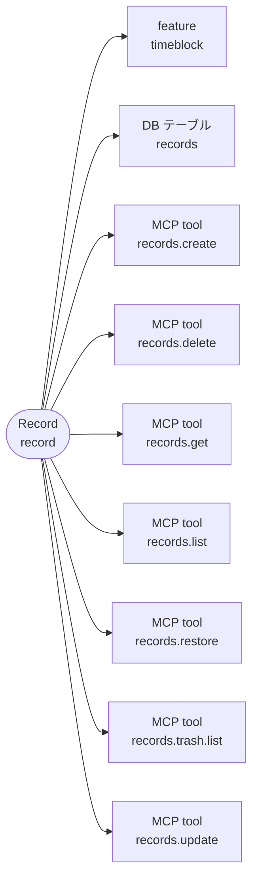
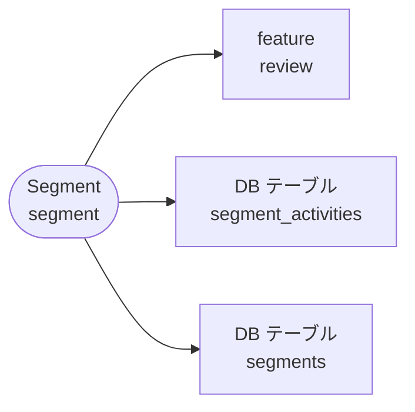
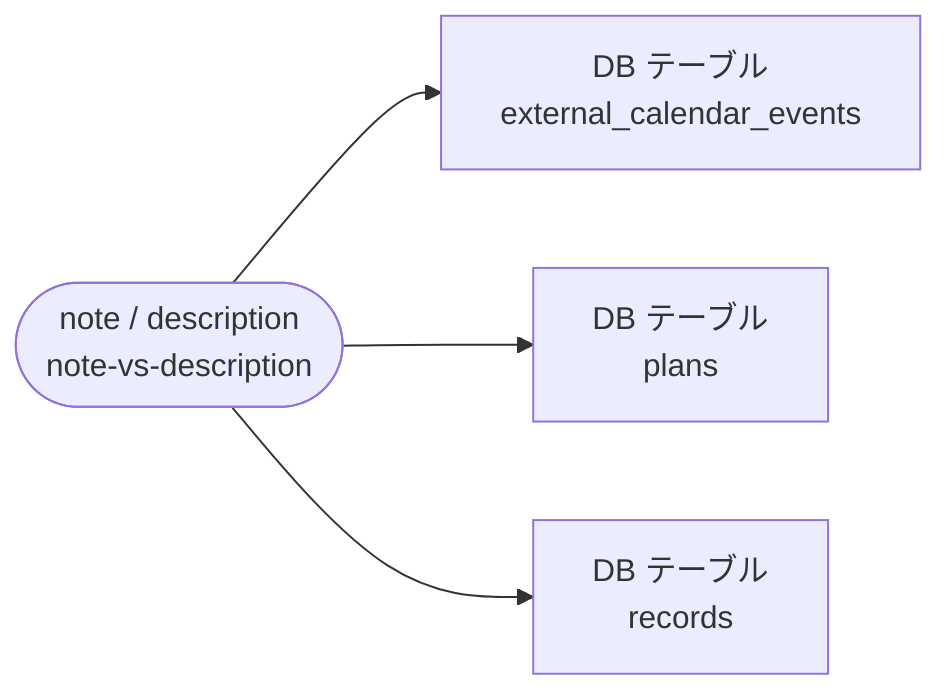
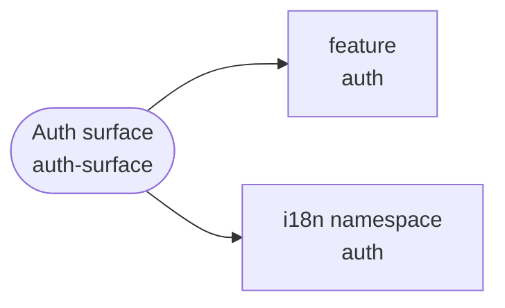

# Architecture Inventory（自動生成）

> **生成元**: `scripts/tasks/generate-architecture-map.ts`（`pnpm architecture:generate`）。
> 実装（`apps/product/src` / `supabase`）から自動発見した項目に、`scripts/lib/glossary/terms.ts` の対応を重ねた snapshot。
> **手で編集しない**。drift は `pnpm architecture:check`（docs-guard からも常時実行）が検出する。

実装から自動発見した項目（事実）と、用語集（`scripts/lib/glossary/terms.ts`）が与える意味の対応。
どの概念からも辿れない項目は 2 つに分かれる。**概念を足す候補**（用語集へ 1 行足すか実装を消すかを人間が判断する）と、
**語彙を持たない層**（SQL 内部・認証の定型画面・共通 UI など、概念が付かないことが正しいもの）。

## 概要

| 種別           | 件数 | 概念へ直接 | feature 経由のみ | 語彙を持たない層 | 概念を足す候補 |
| -------------- | ---- | ---------- | ---------------- | ---------------- | -------------- |
| feature        | 8    | 8          | 0                | 0                | 0              |
| DB テーブル    | 30   | 10         | 6                | 14               | 0              |
| DB 関数        | 139  | 1          | 64               | 74               | 0              |
| tRPC router    | 15   | 0          | 15               | 0                | 0              |
| tRPC procedure | 71   | 0          | 71               | 0                | 0              |
| MCP tool       | 19   | 19         | 0                | 0                | 0              |
| Zustand store  | 14   | 0          | 13               | 0                | 1              |
| Story          | 113  | 0          | 89               | 24               | 0              |
| route          | 16   | 0          | 6                | 10               | 0              |
| i18n namespace | 15   | 7          | 0                | 8                | 0              |

## 探索の入口

関連候補の索引です。feature 経由は同じ所属から広く拾っており、変更の影響やテストの十分性を保証しません。
Story のリンクは実 Story のソースです。UI の実状態は既存 Storybook でその title を開いて確認します。
DB のリンクは migration から生成された型定義です。Production の実測ではありません。

- [Timeblock](#concept-timeblock)
- [Plan](#concept-plan)
- [Record](#concept-record)
- [Activity](#concept-activity)
- [Category](#concept-category)
- [Segment](#concept-segment)
- [Plan template](#concept-plan-template)
- [Review](#concept-review)
- [Inspector](#concept-inspector)
- [Archive](#concept-archive)
- [Trash](#concept-trash)
- [Confirm day](#concept-confirm-day)
- [Fulfillment](#concept-fulfillment)
- [External calendar event](#concept-external-event)
- [Source](#concept-plan-source)
- [note / description](#concept-note-vs-description)
- [Subscription status](#concept-subscription-status)
- [Calendar surface](#concept-calendar-surface)
- [Settings surface](#concept-settings-surface)
- [Auth surface](#concept-auth-surface)
- [Contact surface](#concept-contact-surface)

## 概念 → 実装

用語集の順。直接対応する項目を図に、feature 経由を含む全項目を表に出す。

<a id="concept-timeblock"></a>

### Timeblock（`timeblock`）

カレンダー上の時間ブロック。予定 / 記録の総称

依存先の概念（実 import に基づく。DB・API 等は各概念から辿る）: [Activity](#concept-activity)


<!-- prettier-ignore -->
| 種別 | 項目 | 経路 |
| --- | --- | --- |
| feature | [timeblock](<../../../apps/product/src/features/timeblock>) | 直接 |
| DB テーブル | [activities](<../../../apps/product/src/lib/database/generated/database.types.ts>) | feature 経由 |
| DB テーブル | [plan_template_blocks](<../../../apps/product/src/lib/database/generated/database.types.ts>) | feature 経由 |
| DB テーブル | [plan_templates](<../../../apps/product/src/lib/database/generated/database.types.ts>) | feature 経由 |
| DB テーブル | [plans](<../../../apps/product/src/lib/database/generated/database.types.ts>) | feature 経由 |
| DB テーブル | [records](<../../../apps/product/src/lib/database/generated/database.types.ts>) | feature 経由 |
| DB テーブル | [user_settings](<../../../apps/product/src/lib/database/generated/database.types.ts>) | feature 経由 |
| DB 関数 | [apply_mcp_plan_create_v1](<../../../apps/product/src/lib/database/generated/database.types.ts>) | feature 経由 |
| DB 関数 | [apply_mcp_plan_delete_v1](<../../../apps/product/src/lib/database/generated/database.types.ts>) | feature 経由 |
| DB 関数 | [apply_mcp_plan_restore_v1](<../../../apps/product/src/lib/database/generated/database.types.ts>) | feature 経由 |
| DB 関数 | [apply_mcp_plan_update_v1](<../../../apps/product/src/lib/database/generated/database.types.ts>) | feature 経由 |
| DB 関数 | [apply_mcp_record_create_v1](<../../../apps/product/src/lib/database/generated/database.types.ts>) | feature 経由 |
| DB 関数 | [apply_mcp_record_delete_v1](<../../../apps/product/src/lib/database/generated/database.types.ts>) | feature 経由 |
| DB 関数 | [apply_mcp_record_restore_v1](<../../../apps/product/src/lib/database/generated/database.types.ts>) | feature 経由 |
| DB 関数 | [apply_mcp_record_update_v1](<../../../apps/product/src/lib/database/generated/database.types.ts>) | feature 経由 |
| DB 関数 | [confirm_day_plans_command_v1](<../../../apps/product/src/lib/database/generated/database.types.ts>) | feature 経由 |
| DB 関数 | [create_plan_command_v1](<../../../apps/product/src/lib/database/generated/database.types.ts>) | feature 経由 |
| DB 関数 | [create_plans_bulk_command_v1](<../../../apps/product/src/lib/database/generated/database.types.ts>) | feature 経由 |
| DB 関数 | [create_record_command_v1](<../../../apps/product/src/lib/database/generated/database.types.ts>) | feature 経由 |
| DB 関数 | [delete_plan_command_v1](<../../../apps/product/src/lib/database/generated/database.types.ts>) | feature 経由 |
| DB 関数 | [delete_record_command_v1](<../../../apps/product/src/lib/database/generated/database.types.ts>) | feature 経由 |
| DB 関数 | [get_timeblock_context_marker_v1](<../../../apps/product/src/lib/database/generated/database.types.ts>) | feature 経由 |
| DB 関数 | [record_plan_command_v1](<../../../apps/product/src/lib/database/generated/database.types.ts>) | feature 経由 |
| DB 関数 | [restore_plan_command_v1](<../../../apps/product/src/lib/database/generated/database.types.ts>) | feature 経由 |
| DB 関数 | [restore_record_command_v1](<../../../apps/product/src/lib/database/generated/database.types.ts>) | feature 経由 |
| DB 関数 | [update_plan_command_v1](<../../../apps/product/src/lib/database/generated/database.types.ts>) | feature 経由 |
| DB 関数 | [update_record_command_v1](<../../../apps/product/src/lib/database/generated/database.types.ts>) | feature 経由 |
| tRPC router | [planCommands](<../../../apps/product/src/features/timeblock/server/plan-commands-router.ts>) | feature 経由 |
| tRPC router | [plans](<../../../apps/product/src/features/timeblock/server/plans-router.ts>) | feature 経由 |
| tRPC router | [planTemplates](<../../../apps/product/src/features/timeblock/server/plan-templates-router.ts>) | feature 経由 |
| tRPC router | [recordCommands](<../../../apps/product/src/features/timeblock/server/record-commands-router.ts>) | feature 経由 |
| tRPC router | [records](<../../../apps/product/src/features/timeblock/server/records-router.ts>) | feature 経由 |
| tRPC router | [statistics](<../../../apps/product/src/features/timeblock/server/router-index.ts>) | feature 経由 |
| tRPC router | [timeblockContext](<../../../apps/product/src/features/timeblock/server/timeblock-context-router.ts>) | feature 経由 |
| tRPC procedure | [planCommands.confirmDay](<../../../apps/product/src/features/timeblock/server/plan-commands-router.ts>) | feature 経由 |
| tRPC procedure | [planCommands.create](<../../../apps/product/src/features/timeblock/server/plan-commands-router.ts>) | feature 経由 |
| tRPC procedure | [planCommands.delete](<../../../apps/product/src/features/timeblock/server/plan-commands-router.ts>) | feature 経由 |
| tRPC procedure | [planCommands.record](<../../../apps/product/src/features/timeblock/server/plan-commands-router.ts>) | feature 経由 |
| tRPC procedure | [planCommands.restore](<../../../apps/product/src/features/timeblock/server/plan-commands-router.ts>) | feature 経由 |
| tRPC procedure | [planCommands.update](<../../../apps/product/src/features/timeblock/server/plan-commands-router.ts>) | feature 経由 |
| tRPC procedure | [plans.getById](<../../../apps/product/src/features/timeblock/server/plans-router.ts>) | feature 経由 |
| tRPC procedure | [plans.list](<../../../apps/product/src/features/timeblock/server/plans-router.ts>) | feature 経由 |
| tRPC procedure | [planTemplates.applyToDay](<../../../apps/product/src/features/timeblock/server/plan-templates-router.ts>) | feature 経由 |
| tRPC procedure | [planTemplates.create](<../../../apps/product/src/features/timeblock/server/plan-templates-router.ts>) | feature 経由 |
| tRPC procedure | [planTemplates.delete](<../../../apps/product/src/features/timeblock/server/plan-templates-router.ts>) | feature 経由 |
| tRPC procedure | [planTemplates.list](<../../../apps/product/src/features/timeblock/server/plan-templates-router.ts>) | feature 経由 |
| tRPC procedure | [planTemplates.rename](<../../../apps/product/src/features/timeblock/server/plan-templates-router.ts>) | feature 経由 |
| tRPC procedure | [recordCommands.create](<../../../apps/product/src/features/timeblock/server/record-commands-router.ts>) | feature 経由 |
| tRPC procedure | [recordCommands.delete](<../../../apps/product/src/features/timeblock/server/record-commands-router.ts>) | feature 経由 |
| tRPC procedure | [recordCommands.restore](<../../../apps/product/src/features/timeblock/server/record-commands-router.ts>) | feature 経由 |
| tRPC procedure | [recordCommands.update](<../../../apps/product/src/features/timeblock/server/record-commands-router.ts>) | feature 経由 |
| tRPC procedure | [records.getById](<../../../apps/product/src/features/timeblock/server/records-router.ts>) | feature 経由 |
| tRPC procedure | [records.list](<../../../apps/product/src/features/timeblock/server/records-router.ts>) | feature 経由 |
| tRPC procedure | [statistics.getActivityEstimationFactors](<../../../apps/product/src/features/timeblock/server/statistics-kpi-router.ts>) | feature 経由 |
| tRPC procedure | [statistics.getActivityStats](<../../../apps/product/src/features/timeblock/server/statistics-general-router.ts>) | feature 経由 |
| tRPC procedure | [statistics.getMcpReview](<../../../apps/product/src/features/timeblock/server/statistics-summary-router.ts>) | feature 経由 |
| tRPC procedure | [statistics.getTagEstimationFactors](<../../../apps/product/src/features/timeblock/server/statistics-kpi-router.ts>) | feature 経由 |
| tRPC procedure | [timeblockContext.getConstraints](<../../../apps/product/src/features/timeblock/server/timeblock-context-router.ts>) | feature 経由 |
| MCP tool | [constraints.get](<../../../apps/product/src/app/api/mcp/_tools/registry.ts>) | 直接 |
| MCP tool | [entries.list](<../../../apps/product/src/app/api/mcp/_tools/registry.ts>) | 直接 |
| Zustand store | [useTimeblockInspectorStore](<../../../apps/product/src/features/timeblock/stores/useTimeblockInspectorStore.ts>) | feature 経由 |
| Story | [Product/Features/Timeblock/ClockTimePicker](<../../../apps/product/src/features/timeblock/components/inspector/fields/ClockTimePicker.stories.tsx>) | feature 経由 |
| Story | [Product/Features/Timeblock/EstimationFeedforward](<../../../apps/product/src/features/timeblock/components/editor/EstimationFeedforward.stories.tsx>) | feature 経由 |
| Story | [Product/Features/Timeblock/Inspector/ActivityFieldRow](<../../../apps/product/src/features/timeblock/components/inspector/fields/ActivityFieldRow.stories.tsx>) | feature 経由 |
| Story | [Product/Features/Timeblock/Inspector/DateRow](<../../../apps/product/src/features/timeblock/components/inspector/fields/DateRow.stories.tsx>) | feature 経由 |
| Story | [Product/Features/Timeblock/Inspector/InspectorHeaderActions](<../../../apps/product/src/features/timeblock/components/inspector/fields/InspectorHeaderActions.stories.tsx>) | feature 経由 |
| Story | [Product/Features/Timeblock/Inspector/NoteSection](<../../../apps/product/src/features/timeblock/components/inspector/fields/NoteSection.stories.tsx>) | feature 経由 |
| Story | [Product/Features/Timeblock/Inspector/RecordFulfillmentRow](<../../../apps/product/src/features/timeblock/components/inspector/fields/RecordFulfillmentRow.stories.tsx>) | feature 経由 |
| Story | [Product/Features/Timeblock/Inspector/TimeConflictAlert](<../../../apps/product/src/features/timeblock/components/inspector/fields/TimeConflictAlert.stories.tsx>) | feature 経由 |
| Story | [Product/Features/Timeblock/Inspector/TimeRow](<../../../apps/product/src/features/timeblock/components/inspector/fields/TimeRow.stories.tsx>) | feature 経由 |
| Story | [Product/Features/Timeblock/TimeblockEditor](<../../../apps/product/src/features/timeblock/components/editor/TimeblockEditor.stories.tsx>) | feature 経由 |
| Story | [Product/Features/Timeblock/TimeblockRecordActions](<../../../apps/product/src/features/timeblock/components/editor/TimeblockRecordActions.stories.tsx>) | feature 経由 |
| Story | [Product/Features/Timeblock/TimeblockRelationshipSection](<../../../apps/product/src/features/timeblock/components/editor/TimeblockRelationshipSection.stories.tsx>) | feature 経由 |
| route | [/\[locale\]/calendar](<../../../apps/product/src/app/[locale]/(app)/(workspace)/calendar/page.tsx>) | feature 経由 |
| i18n namespace | [timeblock](<../../../apps/product/messages/en/timeblock.json>) | 直接 |

<details>
<summary>UI の候補（18）</summary>

<!-- prettier-ignore -->
| ファイル | 対応の根拠 |
| --- | --- |
| [apps/product/src/features/timeblock/components/editor/EstimationFeedforward.tsx](<../../../apps/product/src/features/timeblock/components/editor/EstimationFeedforward.tsx>) | feature: timeblock |
| [apps/product/src/features/timeblock/components/editor/TimeblockEditor.tsx](<../../../apps/product/src/features/timeblock/components/editor/TimeblockEditor.tsx>) | feature: timeblock |
| [apps/product/src/features/timeblock/components/editor/TimeblockInspector.tsx](<../../../apps/product/src/features/timeblock/components/editor/TimeblockInspector.tsx>) | feature: timeblock |
| [apps/product/src/features/timeblock/components/editor/TimeblockInspectorForm.tsx](<../../../apps/product/src/features/timeblock/components/editor/TimeblockInspectorForm.tsx>) | feature: timeblock |
| [apps/product/src/features/timeblock/components/editor/TimeblockRecordActions.tsx](<../../../apps/product/src/features/timeblock/components/editor/TimeblockRecordActions.tsx>) | feature: timeblock |
| [apps/product/src/features/timeblock/components/editor/TimeblockRelationshipSection.tsx](<../../../apps/product/src/features/timeblock/components/editor/TimeblockRelationshipSection.tsx>) | feature: timeblock |
| [apps/product/src/features/timeblock/components/inspector/DockedInspectorPanel.tsx](<../../../apps/product/src/features/timeblock/components/inspector/DockedInspectorPanel.tsx>) | feature: timeblock |
| [apps/product/src/features/timeblock/components/inspector/fields/ActivityFieldRow.tsx](<../../../apps/product/src/features/timeblock/components/inspector/fields/ActivityFieldRow.tsx>) | feature: timeblock |
| [apps/product/src/features/timeblock/components/inspector/fields/ClockTimePicker.tsx](<../../../apps/product/src/features/timeblock/components/inspector/fields/ClockTimePicker.tsx>) | feature: timeblock |
| [apps/product/src/features/timeblock/components/inspector/fields/DatePickerPopover.tsx](<../../../apps/product/src/features/timeblock/components/inspector/fields/DatePickerPopover.tsx>) | feature: timeblock |
| [apps/product/src/features/timeblock/components/inspector/fields/DateRow.tsx](<../../../apps/product/src/features/timeblock/components/inspector/fields/DateRow.tsx>) | feature: timeblock |
| [apps/product/src/features/timeblock/components/inspector/fields/DateTimeSection.tsx](<../../../apps/product/src/features/timeblock/components/inspector/fields/DateTimeSection.tsx>) | feature: timeblock |
| [apps/product/src/features/timeblock/components/inspector/fields/InspectorHeaderActions.tsx](<../../../apps/product/src/features/timeblock/components/inspector/fields/InspectorHeaderActions.tsx>) | feature: timeblock |
| [apps/product/src/features/timeblock/components/inspector/fields/NoteSection.tsx](<../../../apps/product/src/features/timeblock/components/inspector/fields/NoteSection.tsx>) | feature: timeblock |
| [apps/product/src/features/timeblock/components/inspector/fields/RecordFulfillmentRow.tsx](<../../../apps/product/src/features/timeblock/components/inspector/fields/RecordFulfillmentRow.tsx>) | feature: timeblock |
| [apps/product/src/features/timeblock/components/inspector/fields/TimeConflictAlert.tsx](<../../../apps/product/src/features/timeblock/components/inspector/fields/TimeConflictAlert.tsx>) | feature: timeblock |
| [apps/product/src/features/timeblock/components/inspector/fields/TimeInput.tsx](<../../../apps/product/src/features/timeblock/components/inspector/fields/TimeInput.tsx>) | feature: timeblock |
| [apps/product/src/features/timeblock/components/inspector/fields/TimeRow.tsx](<../../../apps/product/src/features/timeblock/components/inspector/fields/TimeRow.tsx>) | feature: timeblock |

</details>

<details>
<summary>test の候補（77）</summary>

<!-- prettier-ignore -->
| ファイル | 対応の根拠 |
| --- | --- |
| [apps/product/src/features/timeblock/components/editor/EstimationFeedforward.test.tsx](<../../../apps/product/src/features/timeblock/components/editor/EstimationFeedforward.test.tsx>) | feature: timeblock |
| [apps/product/src/features/timeblock/components/editor/TimeblockEditor.test.tsx](<../../../apps/product/src/features/timeblock/components/editor/TimeblockEditor.test.tsx>) | feature: timeblock |
| [apps/product/src/features/timeblock/components/editor/TimeblockInspector.test.tsx](<../../../apps/product/src/features/timeblock/components/editor/TimeblockInspector.test.tsx>) | feature: timeblock |
| [apps/product/src/features/timeblock/components/editor/TimeblockInspectorForm.test.tsx](<../../../apps/product/src/features/timeblock/components/editor/TimeblockInspectorForm.test.tsx>) | feature: timeblock |
| [apps/product/src/features/timeblock/components/editor/TimeblockRecordActions.test.ts](<../../../apps/product/src/features/timeblock/components/editor/TimeblockRecordActions.test.ts>) | feature: timeblock |
| [apps/product/src/features/timeblock/components/editor/TimeblockRelationshipSection.test.tsx](<../../../apps/product/src/features/timeblock/components/editor/TimeblockRelationshipSection.test.tsx>) | feature: timeblock |
| [apps/product/src/features/timeblock/components/inspector/DockedInspectorPanel.test.tsx](<../../../apps/product/src/features/timeblock/components/inspector/DockedInspectorPanel.test.tsx>) | feature: timeblock |
| [apps/product/src/features/timeblock/components/inspector/fields/ClockTimePicker.test.tsx](<../../../apps/product/src/features/timeblock/components/inspector/fields/ClockTimePicker.test.tsx>) | feature: timeblock |
| [apps/product/src/features/timeblock/components/inspector/fields/note-html-to-text.test.ts](<../../../apps/product/src/features/timeblock/components/inspector/fields/note-html-to-text.test.ts>) | feature: timeblock |
| [apps/product/src/features/timeblock/components/inspector/fields/TimeInput.test.tsx](<../../../apps/product/src/features/timeblock/components/inspector/fields/TimeInput.test.tsx>) | feature: timeblock |
| [apps/product/src/features/timeblock/domain/activity-axis-aggregation.test.ts](<../../../apps/product/src/features/timeblock/domain/activity-axis-aggregation.test.ts>) | feature: timeblock |
| [apps/product/src/features/timeblock/domain/activity-estimation-factor.test.ts](<../../../apps/product/src/features/timeblock/domain/activity-estimation-factor.test.ts>) | feature: timeblock |
| [apps/product/src/features/timeblock/domain/activity-stats.test.ts](<../../../apps/product/src/features/timeblock/domain/activity-stats.test.ts>) | feature: timeblock |
| [apps/product/src/features/timeblock/domain/derived-model.test.ts](<../../../apps/product/src/features/timeblock/domain/derived-model.test.ts>) | feature: timeblock |
| [apps/product/src/features/timeblock/domain/plan-template-anchor.test.ts](<../../../apps/product/src/features/timeblock/domain/plan-template-anchor.test.ts>) | feature: timeblock |
| [apps/product/src/features/timeblock/domain/plan-template-compose.test.ts](<../../../apps/product/src/features/timeblock/domain/plan-template-compose.test.ts>) | feature: timeblock |
| [apps/product/src/features/timeblock/domain/plan-template-duration.test.ts](<../../../apps/product/src/features/timeblock/domain/plan-template-duration.test.ts>) | feature: timeblock |
| [apps/product/src/features/timeblock/domain/plan-template-materialize.test.ts](<../../../apps/product/src/features/timeblock/domain/plan-template-materialize.test.ts>) | feature: timeblock |
| [apps/product/src/features/timeblock/domain/time-pl-review.test.ts](<../../../apps/product/src/features/timeblock/domain/time-pl-review.test.ts>) | feature: timeblock |
| [apps/product/src/features/timeblock/domain/timeblock-destination.test.ts](<../../../apps/product/src/features/timeblock/domain/timeblock-destination.test.ts>) | feature: timeblock |
| [apps/product/src/features/timeblock/hooks/useCoalescedTimeblockSave.test.tsx](<../../../apps/product/src/features/timeblock/hooks/useCoalescedTimeblockSave.test.tsx>) | feature: timeblock |
| [apps/product/src/features/timeblock/hooks/useInspectorKeyboard.test.tsx](<../../../apps/product/src/features/timeblock/hooks/useInspectorKeyboard.test.tsx>) | feature: timeblock |
| [apps/product/src/features/timeblock/hooks/useInspectorURLSync.test.tsx](<../../../apps/product/src/features/timeblock/hooks/useInspectorURLSync.test.tsx>) | feature: timeblock |
| [apps/product/src/features/timeblock/hooks/usePlanTemplateMutations.test.tsx](<../../../apps/product/src/features/timeblock/hooks/usePlanTemplateMutations.test.tsx>) | feature: timeblock |
| [apps/product/src/features/timeblock/hooks/useTimeblockDeleteUndo.test.ts](<../../../apps/product/src/features/timeblock/hooks/useTimeblockDeleteUndo.test.ts>) | feature: timeblock |
| [apps/product/src/features/timeblock/hooks/useTimeblockRecordMutations.test.tsx](<../../../apps/product/src/features/timeblock/hooks/useTimeblockRecordMutations.test.tsx>) | feature: timeblock |
| [apps/product/src/features/timeblock/hooks/useTimeblockWriteMutations.inline-error.test.tsx](<../../../apps/product/src/features/timeblock/hooks/useTimeblockWriteMutations.inline-error.test.tsx>) | feature: timeblock |
| [apps/product/src/features/timeblock/hooks/useTimeblockWriteMutations.test.ts](<../../../apps/product/src/features/timeblock/hooks/useTimeblockWriteMutations.test.ts>) | feature: timeblock |
| [apps/product/src/features/timeblock/lib/datetime.test.ts](<../../../apps/product/src/features/timeblock/lib/datetime.test.ts>) | feature: timeblock |
| [apps/product/src/features/timeblock/lib/inspector-url.test.ts](<../../../apps/product/src/features/timeblock/lib/inspector-url.test.ts>) | feature: timeblock |
| [apps/product/src/features/timeblock/lib/plan-to-ical.test.ts](<../../../apps/product/src/features/timeblock/lib/plan-to-ical.test.ts>) | feature: timeblock |
| [apps/product/src/features/timeblock/lib/time-diff.test.ts](<../../../apps/product/src/features/timeblock/lib/time-diff.test.ts>) | feature: timeblock |
| [apps/product/src/features/timeblock/lib/timeblock-clipboard.test.ts](<../../../apps/product/src/features/timeblock/lib/timeblock-clipboard.test.ts>) | feature: timeblock |
| [apps/product/src/features/timeblock/lib/timeblock-duplicate.test.ts](<../../../apps/product/src/features/timeblock/lib/timeblock-duplicate.test.ts>) | feature: timeblock |
| [apps/product/src/features/timeblock/lib/timeblock-lane-conflict.test.ts](<../../../apps/product/src/features/timeblock/lib/timeblock-lane-conflict.test.ts>) | feature: timeblock |
| [apps/product/src/features/timeblock/lib/timeblock-menu-items.test.ts](<../../../apps/product/src/features/timeblock/lib/timeblock-menu-items.test.ts>) | feature: timeblock |
| [apps/product/src/features/timeblock/schemas/timeblock.test.ts](<../../../apps/product/src/features/timeblock/schemas/timeblock.test.ts>) | feature: timeblock |
| [apps/product/src/features/timeblock/server/mcp-mutation-client.test.ts](<../../../apps/product/src/features/timeblock/server/mcp-mutation-client.test.ts>) | feature: timeblock |
| [apps/product/src/features/timeblock/server/plan-record-service.test.ts](<../../../apps/product/src/features/timeblock/server/plan-record-service.test.ts>) | feature: timeblock |
| [apps/product/src/features/timeblock/server/plan-template-service.test.ts](<../../../apps/product/src/features/timeblock/server/plan-template-service.test.ts>) | feature: timeblock |
| [apps/product/src/features/timeblock/server/plan-templates-router.test.ts](<../../../apps/product/src/features/timeblock/server/plan-templates-router.test.ts>) | feature: timeblock |
| [apps/product/src/features/timeblock/server/private-search-boundary-contract.test.ts](<../../../apps/product/src/features/timeblock/server/private-search-boundary-contract.test.ts>) | feature: timeblock |
| [apps/product/src/features/timeblock/server/private-timeblock-search-query.test.ts](<../../../apps/product/src/features/timeblock/server/private-timeblock-search-query.test.ts>) | feature: timeblock |
| [apps/product/src/features/timeblock/server/statistics-error-observability.test.ts](<../../../apps/product/src/features/timeblock/server/statistics-error-observability.test.ts>) | feature: timeblock |
| [apps/product/src/features/timeblock/server/statistics-feedforward-service.test.ts](<../../../apps/product/src/features/timeblock/server/statistics-feedforward-service.test.ts>) | feature: timeblock |
| [apps/product/src/features/timeblock/server/statistics-router.test.ts](<../../../apps/product/src/features/timeblock/server/statistics-router.test.ts>) | feature: timeblock |
| [apps/product/src/features/timeblock/server/statistics-service.test.ts](<../../../apps/product/src/features/timeblock/server/statistics-service.test.ts>) | feature: timeblock |
| [apps/product/src/features/timeblock/server/statistics-shared.test.ts](<../../../apps/product/src/features/timeblock/server/statistics-shared.test.ts>) | feature: timeblock |
| [apps/product/src/features/timeblock/server/timeblock-command-client.test.ts](<../../../apps/product/src/features/timeblock/server/timeblock-command-client.test.ts>) | feature: timeblock |
| [apps/product/src/features/timeblock/server/timeblock-command-router.test.ts](<../../../apps/product/src/features/timeblock/server/timeblock-command-router.test.ts>) | feature: timeblock |
| [apps/product/src/features/timeblock/server/timeblock-command-service.test.ts](<../../../apps/product/src/features/timeblock/server/timeblock-command-service.test.ts>) | feature: timeblock |
| [apps/product/src/features/timeblock/server/timeblock-review-client.test.ts](<../../../apps/product/src/features/timeblock/server/timeblock-review-client.test.ts>) | feature: timeblock |
| [apps/product/src/features/timeblock/server/timeblock-search-query.test.ts](<../../../apps/product/src/features/timeblock/server/timeblock-search-query.test.ts>) | feature: timeblock |
| [apps/product/src/features/timeblock/stores/useTimeblockInspectorStore.test.ts](<../../../apps/product/src/features/timeblock/stores/useTimeblockInspectorStore.test.ts>) | feature: timeblock |
| [apps/product/src/lib/test/e2e/account-deletion.spec.ts](<../../../apps/product/src/lib/test/e2e/account-deletion.spec.ts>) | 画面: /[locale]/calendar |
| [apps/product/src/lib/test/e2e/calendar-initial-load.spec.ts](<../../../apps/product/src/lib/test/e2e/calendar-initial-load.spec.ts>) | 画面: /[locale]/calendar |
| [apps/product/src/lib/test/e2e/calendar-navigation.spec.ts](<../../../apps/product/src/lib/test/e2e/calendar-navigation.spec.ts>) | 画面: /[locale]/calendar |
| [apps/product/src/lib/test/e2e/deep-link.spec.ts](<../../../apps/product/src/lib/test/e2e/deep-link.spec.ts>) | 画面: /[locale]/calendar |
| [apps/product/src/lib/test/e2e/derived-plan-record-flow.spec.ts](<../../../apps/product/src/lib/test/e2e/derived-plan-record-flow.spec.ts>) | 画面: /[locale]/calendar |
| [apps/product/src/lib/test/e2e/http-csrf.spec.ts](<../../../apps/product/src/lib/test/e2e/http-csrf.spec.ts>) | 画面: /[locale]/calendar |
| [apps/product/src/lib/test/e2e/mobile-navigation.spec.ts](<../../../apps/product/src/lib/test/e2e/mobile-navigation.spec.ts>) | 画面: /[locale]/calendar |
| [apps/product/src/lib/test/e2e/plan-record-timeblock.spec.ts](<../../../apps/product/src/lib/test/e2e/plan-record-timeblock.spec.ts>) | 画面: /[locale]/calendar |
| [apps/product/src/lib/test/e2e/timeblock-conflict.spec.ts](<../../../apps/product/src/lib/test/e2e/timeblock-conflict.spec.ts>) | 画面: /[locale]/calendar |
| [apps/product/src/lib/test/e2e/timeblock-drag-move.spec.ts](<../../../apps/product/src/lib/test/e2e/timeblock-drag-move.spec.ts>) | 画面: /[locale]/calendar |
| [apps/product/src/lib/test/e2e/timeblock-inspector-toggle.spec.ts](<../../../apps/product/src/lib/test/e2e/timeblock-inspector-toggle.spec.ts>) | 画面: /[locale]/calendar |
| [apps/product/src/lib/test/integration/activity-assignment-guards.integration.test.ts](<../../../apps/product/src/lib/test/integration/activity-assignment-guards.integration.test.ts>) | DB 関数: create_plan_command_v1 / DB 関数: record_plan_command_v1 / DB 関数: update_plan_command_v1 |
| [apps/product/src/lib/test/integration/mcp-mutation-foundation.integration.test.ts](<../../../apps/product/src/lib/test/integration/mcp-mutation-foundation.integration.test.ts>) | DB 関数: apply_mcp_plan_create_v1 |
| [apps/product/src/lib/test/integration/mcp-plan-create-apply.integration.test.ts](<../../../apps/product/src/lib/test/integration/mcp-plan-create-apply.integration.test.ts>) | DB 関数: apply_mcp_plan_create_v1 / DB 関数: create_plan_command_v1 / DB 関数: delete_plan_command_v1 |
| [apps/product/src/lib/test/integration/mcp-plan-mutations-apply.integration.test.ts](<../../../apps/product/src/lib/test/integration/mcp-plan-mutations-apply.integration.test.ts>) | DB 関数: apply_mcp_plan_create_v1 / DB 関数: apply_mcp_plan_delete_v1 / DB 関数: apply_mcp_plan_restore_v1 / DB 関数: apply_mcp_plan_update_v1 / DB 関数: create_plan_command_v1 / DB 関数: delete_plan_command_v1 / DB 関数: restore_plan_command_v1 / DB 関数: update_plan_command_v1 |
| [apps/product/src/lib/test/integration/mcp-read-tenant-isolation.integration.test.ts](<../../../apps/product/src/lib/test/integration/mcp-read-tenant-isolation.integration.test.ts>) | DB 関数: create_plan_command_v1 / DB 関数: create_record_command_v1 / DB 関数: delete_plan_command_v1 / DB 関数: delete_record_command_v1 |
| [apps/product/src/lib/test/integration/mcp-record-mutations-apply.integration.test.ts](<../../../apps/product/src/lib/test/integration/mcp-record-mutations-apply.integration.test.ts>) | DB 関数: apply_mcp_record_create_v1 / DB 関数: apply_mcp_record_delete_v1 / DB 関数: apply_mcp_record_restore_v1 / DB 関数: apply_mcp_record_update_v1 / DB 関数: create_plan_command_v1 / DB 関数: create_record_command_v1 / DB 関数: delete_record_command_v1 / DB 関数: restore_record_command_v1 / DB 関数: update_record_command_v1 |
| [apps/product/src/lib/test/integration/mcp-stage1-rollout-compat.integration.test.ts](<../../../apps/product/src/lib/test/integration/mcp-stage1-rollout-compat.integration.test.ts>) | DB 関数: record_plan_command_v1 |
| [apps/product/src/lib/test/integration/plan-template-schema.integration.test.ts](<../../../apps/product/src/lib/test/integration/plan-template-schema.integration.test.ts>) | DB 関数: create_plans_bulk_command_v1 |
| [apps/product/src/lib/test/integration/record-fulfillment.integration.test.ts](<../../../apps/product/src/lib/test/integration/record-fulfillment.integration.test.ts>) | DB 関数: create_record_command_v1 / DB 関数: update_record_command_v1 |
| [apps/product/src/lib/test/integration/timeblock-atomic-commands.integration.test.ts](<../../../apps/product/src/lib/test/integration/timeblock-atomic-commands.integration.test.ts>) | DB 関数: confirm_day_plans_command_v1 / DB 関数: create_plan_command_v1 / DB 関数: create_record_command_v1 / DB 関数: delete_plan_command_v1 / DB 関数: delete_record_command_v1 / DB 関数: record_plan_command_v1 / DB 関数: restore_plan_command_v1 / DB 関数: restore_record_command_v1 / DB 関数: update_plan_command_v1 / DB 関数: update_record_command_v1 |
| [supabase/tests/mcp-create-digest.sql](<../../../supabase/tests/mcp-create-digest.sql>) | DB 関数: apply_mcp_plan_create_v1 / DB 関数: apply_mcp_record_create_v1 |
| [supabase/tests/single-plan-mcp-access.sql](<../../../supabase/tests/single-plan-mcp-access.sql>) | DB 関数: apply_mcp_plan_create_v1 |

</details>

<details>
<summary>docs の候補（2）</summary>

<!-- prettier-ignore -->
| ファイル | 対応の根拠 |
| --- | --- |
| [docs/operations/posthog-analytics.md](<../../operations/posthog-analytics.md>) | frontmatter code: timeblock |
| [docs/product/specs/plan-record.md](<../../product/specs/plan-record.md>) | frontmatter code: timeblock |

</details>

<a id="concept-plan"></a>

### Plan（`plan`）

これからやる時間の宣言。時間軸のどこにでも置ける独立エンティティ

依存先の概念（実 import に基づく。DB・API 等は各概念から辿る）: [Activity](#concept-activity)


<!-- prettier-ignore -->
| 種別 | 項目 | 経路 |
| --- | --- | --- |
| feature | [timeblock](<../../../apps/product/src/features/timeblock>) | 直接 |
| DB テーブル | [plans](<../../../apps/product/src/lib/database/generated/database.types.ts>) | 直接 |
| DB テーブル | [activities](<../../../apps/product/src/lib/database/generated/database.types.ts>) | feature 経由 |
| DB テーブル | [plan_template_blocks](<../../../apps/product/src/lib/database/generated/database.types.ts>) | feature 経由 |
| DB テーブル | [plan_templates](<../../../apps/product/src/lib/database/generated/database.types.ts>) | feature 経由 |
| DB テーブル | [records](<../../../apps/product/src/lib/database/generated/database.types.ts>) | feature 経由 |
| DB テーブル | [user_settings](<../../../apps/product/src/lib/database/generated/database.types.ts>) | feature 経由 |
| DB 関数 | [apply_mcp_plan_create_v1](<../../../apps/product/src/lib/database/generated/database.types.ts>) | feature 経由 |
| DB 関数 | [apply_mcp_plan_delete_v1](<../../../apps/product/src/lib/database/generated/database.types.ts>) | feature 経由 |
| DB 関数 | [apply_mcp_plan_restore_v1](<../../../apps/product/src/lib/database/generated/database.types.ts>) | feature 経由 |
| DB 関数 | [apply_mcp_plan_update_v1](<../../../apps/product/src/lib/database/generated/database.types.ts>) | feature 経由 |
| DB 関数 | [apply_mcp_record_create_v1](<../../../apps/product/src/lib/database/generated/database.types.ts>) | feature 経由 |
| DB 関数 | [apply_mcp_record_delete_v1](<../../../apps/product/src/lib/database/generated/database.types.ts>) | feature 経由 |
| DB 関数 | [apply_mcp_record_restore_v1](<../../../apps/product/src/lib/database/generated/database.types.ts>) | feature 経由 |
| DB 関数 | [apply_mcp_record_update_v1](<../../../apps/product/src/lib/database/generated/database.types.ts>) | feature 経由 |
| DB 関数 | [confirm_day_plans_command_v1](<../../../apps/product/src/lib/database/generated/database.types.ts>) | feature 経由 |
| DB 関数 | [create_plan_command_v1](<../../../apps/product/src/lib/database/generated/database.types.ts>) | feature 経由 |
| DB 関数 | [create_plans_bulk_command_v1](<../../../apps/product/src/lib/database/generated/database.types.ts>) | feature 経由 |
| DB 関数 | [create_record_command_v1](<../../../apps/product/src/lib/database/generated/database.types.ts>) | feature 経由 |
| DB 関数 | [delete_plan_command_v1](<../../../apps/product/src/lib/database/generated/database.types.ts>) | feature 経由 |
| DB 関数 | [delete_record_command_v1](<../../../apps/product/src/lib/database/generated/database.types.ts>) | feature 経由 |
| DB 関数 | [get_timeblock_context_marker_v1](<../../../apps/product/src/lib/database/generated/database.types.ts>) | feature 経由 |
| DB 関数 | [record_plan_command_v1](<../../../apps/product/src/lib/database/generated/database.types.ts>) | feature 経由 |
| DB 関数 | [restore_plan_command_v1](<../../../apps/product/src/lib/database/generated/database.types.ts>) | feature 経由 |
| DB 関数 | [restore_record_command_v1](<../../../apps/product/src/lib/database/generated/database.types.ts>) | feature 経由 |
| DB 関数 | [update_plan_command_v1](<../../../apps/product/src/lib/database/generated/database.types.ts>) | feature 経由 |
| DB 関数 | [update_record_command_v1](<../../../apps/product/src/lib/database/generated/database.types.ts>) | feature 経由 |
| tRPC router | [planCommands](<../../../apps/product/src/features/timeblock/server/plan-commands-router.ts>) | feature 経由 |
| tRPC router | [plans](<../../../apps/product/src/features/timeblock/server/plans-router.ts>) | feature 経由 |
| tRPC router | [planTemplates](<../../../apps/product/src/features/timeblock/server/plan-templates-router.ts>) | feature 経由 |
| tRPC router | [recordCommands](<../../../apps/product/src/features/timeblock/server/record-commands-router.ts>) | feature 経由 |
| tRPC router | [records](<../../../apps/product/src/features/timeblock/server/records-router.ts>) | feature 経由 |
| tRPC router | [statistics](<../../../apps/product/src/features/timeblock/server/router-index.ts>) | feature 経由 |
| tRPC router | [timeblockContext](<../../../apps/product/src/features/timeblock/server/timeblock-context-router.ts>) | feature 経由 |
| tRPC procedure | [planCommands.confirmDay](<../../../apps/product/src/features/timeblock/server/plan-commands-router.ts>) | feature 経由 |
| tRPC procedure | [planCommands.create](<../../../apps/product/src/features/timeblock/server/plan-commands-router.ts>) | feature 経由 |
| tRPC procedure | [planCommands.delete](<../../../apps/product/src/features/timeblock/server/plan-commands-router.ts>) | feature 経由 |
| tRPC procedure | [planCommands.record](<../../../apps/product/src/features/timeblock/server/plan-commands-router.ts>) | feature 経由 |
| tRPC procedure | [planCommands.restore](<../../../apps/product/src/features/timeblock/server/plan-commands-router.ts>) | feature 経由 |
| tRPC procedure | [planCommands.update](<../../../apps/product/src/features/timeblock/server/plan-commands-router.ts>) | feature 経由 |
| tRPC procedure | [plans.getById](<../../../apps/product/src/features/timeblock/server/plans-router.ts>) | feature 経由 |
| tRPC procedure | [plans.list](<../../../apps/product/src/features/timeblock/server/plans-router.ts>) | feature 経由 |
| tRPC procedure | [planTemplates.applyToDay](<../../../apps/product/src/features/timeblock/server/plan-templates-router.ts>) | feature 経由 |
| tRPC procedure | [planTemplates.create](<../../../apps/product/src/features/timeblock/server/plan-templates-router.ts>) | feature 経由 |
| tRPC procedure | [planTemplates.delete](<../../../apps/product/src/features/timeblock/server/plan-templates-router.ts>) | feature 経由 |
| tRPC procedure | [planTemplates.list](<../../../apps/product/src/features/timeblock/server/plan-templates-router.ts>) | feature 経由 |
| tRPC procedure | [planTemplates.rename](<../../../apps/product/src/features/timeblock/server/plan-templates-router.ts>) | feature 経由 |
| tRPC procedure | [recordCommands.create](<../../../apps/product/src/features/timeblock/server/record-commands-router.ts>) | feature 経由 |
| tRPC procedure | [recordCommands.delete](<../../../apps/product/src/features/timeblock/server/record-commands-router.ts>) | feature 経由 |
| tRPC procedure | [recordCommands.restore](<../../../apps/product/src/features/timeblock/server/record-commands-router.ts>) | feature 経由 |
| tRPC procedure | [recordCommands.update](<../../../apps/product/src/features/timeblock/server/record-commands-router.ts>) | feature 経由 |
| tRPC procedure | [records.getById](<../../../apps/product/src/features/timeblock/server/records-router.ts>) | feature 経由 |
| tRPC procedure | [records.list](<../../../apps/product/src/features/timeblock/server/records-router.ts>) | feature 経由 |
| tRPC procedure | [statistics.getActivityEstimationFactors](<../../../apps/product/src/features/timeblock/server/statistics-kpi-router.ts>) | feature 経由 |
| tRPC procedure | [statistics.getActivityStats](<../../../apps/product/src/features/timeblock/server/statistics-general-router.ts>) | feature 経由 |
| tRPC procedure | [statistics.getMcpReview](<../../../apps/product/src/features/timeblock/server/statistics-summary-router.ts>) | feature 経由 |
| tRPC procedure | [statistics.getTagEstimationFactors](<../../../apps/product/src/features/timeblock/server/statistics-kpi-router.ts>) | feature 経由 |
| tRPC procedure | [timeblockContext.getConstraints](<../../../apps/product/src/features/timeblock/server/timeblock-context-router.ts>) | feature 経由 |
| MCP tool | [plans.create](<../../../apps/product/src/app/api/mcp/_tools/registry.ts>) | 直接 |
| MCP tool | [plans.delete](<../../../apps/product/src/app/api/mcp/_tools/registry.ts>) | 直接 |
| MCP tool | [plans.get](<../../../apps/product/src/app/api/mcp/_tools/registry.ts>) | 直接 |
| MCP tool | [plans.list](<../../../apps/product/src/app/api/mcp/_tools/registry.ts>) | 直接 |
| MCP tool | [plans.restore](<../../../apps/product/src/app/api/mcp/_tools/registry.ts>) | 直接 |
| MCP tool | [plans.trash.list](<../../../apps/product/src/app/api/mcp/_tools/registry.ts>) | 直接 |
| MCP tool | [plans.update](<../../../apps/product/src/app/api/mcp/_tools/registry.ts>) | 直接 |
| Zustand store | [useTimeblockInspectorStore](<../../../apps/product/src/features/timeblock/stores/useTimeblockInspectorStore.ts>) | feature 経由 |
| Story | [Product/Features/Timeblock/ClockTimePicker](<../../../apps/product/src/features/timeblock/components/inspector/fields/ClockTimePicker.stories.tsx>) | feature 経由 |
| Story | [Product/Features/Timeblock/EstimationFeedforward](<../../../apps/product/src/features/timeblock/components/editor/EstimationFeedforward.stories.tsx>) | feature 経由 |
| Story | [Product/Features/Timeblock/Inspector/ActivityFieldRow](<../../../apps/product/src/features/timeblock/components/inspector/fields/ActivityFieldRow.stories.tsx>) | feature 経由 |
| Story | [Product/Features/Timeblock/Inspector/DateRow](<../../../apps/product/src/features/timeblock/components/inspector/fields/DateRow.stories.tsx>) | feature 経由 |
| Story | [Product/Features/Timeblock/Inspector/InspectorHeaderActions](<../../../apps/product/src/features/timeblock/components/inspector/fields/InspectorHeaderActions.stories.tsx>) | feature 経由 |
| Story | [Product/Features/Timeblock/Inspector/NoteSection](<../../../apps/product/src/features/timeblock/components/inspector/fields/NoteSection.stories.tsx>) | feature 経由 |
| Story | [Product/Features/Timeblock/Inspector/RecordFulfillmentRow](<../../../apps/product/src/features/timeblock/components/inspector/fields/RecordFulfillmentRow.stories.tsx>) | feature 経由 |
| Story | [Product/Features/Timeblock/Inspector/TimeConflictAlert](<../../../apps/product/src/features/timeblock/components/inspector/fields/TimeConflictAlert.stories.tsx>) | feature 経由 |
| Story | [Product/Features/Timeblock/Inspector/TimeRow](<../../../apps/product/src/features/timeblock/components/inspector/fields/TimeRow.stories.tsx>) | feature 経由 |
| Story | [Product/Features/Timeblock/TimeblockEditor](<../../../apps/product/src/features/timeblock/components/editor/TimeblockEditor.stories.tsx>) | feature 経由 |
| Story | [Product/Features/Timeblock/TimeblockRecordActions](<../../../apps/product/src/features/timeblock/components/editor/TimeblockRecordActions.stories.tsx>) | feature 経由 |
| Story | [Product/Features/Timeblock/TimeblockRelationshipSection](<../../../apps/product/src/features/timeblock/components/editor/TimeblockRelationshipSection.stories.tsx>) | feature 経由 |
| route | [/\[locale\]/calendar](<../../../apps/product/src/app/[locale]/(app)/(workspace)/calendar/page.tsx>) | feature 経由 |

<details>
<summary>UI の候補（18）</summary>

<!-- prettier-ignore -->
| ファイル | 対応の根拠 |
| --- | --- |
| [apps/product/src/features/timeblock/components/editor/EstimationFeedforward.tsx](<../../../apps/product/src/features/timeblock/components/editor/EstimationFeedforward.tsx>) | feature: timeblock |
| [apps/product/src/features/timeblock/components/editor/TimeblockEditor.tsx](<../../../apps/product/src/features/timeblock/components/editor/TimeblockEditor.tsx>) | feature: timeblock |
| [apps/product/src/features/timeblock/components/editor/TimeblockInspector.tsx](<../../../apps/product/src/features/timeblock/components/editor/TimeblockInspector.tsx>) | feature: timeblock |
| [apps/product/src/features/timeblock/components/editor/TimeblockInspectorForm.tsx](<../../../apps/product/src/features/timeblock/components/editor/TimeblockInspectorForm.tsx>) | feature: timeblock |
| [apps/product/src/features/timeblock/components/editor/TimeblockRecordActions.tsx](<../../../apps/product/src/features/timeblock/components/editor/TimeblockRecordActions.tsx>) | feature: timeblock |
| [apps/product/src/features/timeblock/components/editor/TimeblockRelationshipSection.tsx](<../../../apps/product/src/features/timeblock/components/editor/TimeblockRelationshipSection.tsx>) | feature: timeblock |
| [apps/product/src/features/timeblock/components/inspector/DockedInspectorPanel.tsx](<../../../apps/product/src/features/timeblock/components/inspector/DockedInspectorPanel.tsx>) | feature: timeblock |
| [apps/product/src/features/timeblock/components/inspector/fields/ActivityFieldRow.tsx](<../../../apps/product/src/features/timeblock/components/inspector/fields/ActivityFieldRow.tsx>) | feature: timeblock |
| [apps/product/src/features/timeblock/components/inspector/fields/ClockTimePicker.tsx](<../../../apps/product/src/features/timeblock/components/inspector/fields/ClockTimePicker.tsx>) | feature: timeblock |
| [apps/product/src/features/timeblock/components/inspector/fields/DatePickerPopover.tsx](<../../../apps/product/src/features/timeblock/components/inspector/fields/DatePickerPopover.tsx>) | feature: timeblock |
| [apps/product/src/features/timeblock/components/inspector/fields/DateRow.tsx](<../../../apps/product/src/features/timeblock/components/inspector/fields/DateRow.tsx>) | feature: timeblock |
| [apps/product/src/features/timeblock/components/inspector/fields/DateTimeSection.tsx](<../../../apps/product/src/features/timeblock/components/inspector/fields/DateTimeSection.tsx>) | feature: timeblock |
| [apps/product/src/features/timeblock/components/inspector/fields/InspectorHeaderActions.tsx](<../../../apps/product/src/features/timeblock/components/inspector/fields/InspectorHeaderActions.tsx>) | feature: timeblock |
| [apps/product/src/features/timeblock/components/inspector/fields/NoteSection.tsx](<../../../apps/product/src/features/timeblock/components/inspector/fields/NoteSection.tsx>) | feature: timeblock |
| [apps/product/src/features/timeblock/components/inspector/fields/RecordFulfillmentRow.tsx](<../../../apps/product/src/features/timeblock/components/inspector/fields/RecordFulfillmentRow.tsx>) | feature: timeblock |
| [apps/product/src/features/timeblock/components/inspector/fields/TimeConflictAlert.tsx](<../../../apps/product/src/features/timeblock/components/inspector/fields/TimeConflictAlert.tsx>) | feature: timeblock |
| [apps/product/src/features/timeblock/components/inspector/fields/TimeInput.tsx](<../../../apps/product/src/features/timeblock/components/inspector/fields/TimeInput.tsx>) | feature: timeblock |
| [apps/product/src/features/timeblock/components/inspector/fields/TimeRow.tsx](<../../../apps/product/src/features/timeblock/components/inspector/fields/TimeRow.tsx>) | feature: timeblock |

</details>

<details>
<summary>test の候補（77）</summary>

<!-- prettier-ignore -->
| ファイル | 対応の根拠 |
| --- | --- |
| [apps/product/src/features/timeblock/components/editor/EstimationFeedforward.test.tsx](<../../../apps/product/src/features/timeblock/components/editor/EstimationFeedforward.test.tsx>) | feature: timeblock |
| [apps/product/src/features/timeblock/components/editor/TimeblockEditor.test.tsx](<../../../apps/product/src/features/timeblock/components/editor/TimeblockEditor.test.tsx>) | feature: timeblock |
| [apps/product/src/features/timeblock/components/editor/TimeblockInspector.test.tsx](<../../../apps/product/src/features/timeblock/components/editor/TimeblockInspector.test.tsx>) | feature: timeblock |
| [apps/product/src/features/timeblock/components/editor/TimeblockInspectorForm.test.tsx](<../../../apps/product/src/features/timeblock/components/editor/TimeblockInspectorForm.test.tsx>) | feature: timeblock |
| [apps/product/src/features/timeblock/components/editor/TimeblockRecordActions.test.ts](<../../../apps/product/src/features/timeblock/components/editor/TimeblockRecordActions.test.ts>) | feature: timeblock |
| [apps/product/src/features/timeblock/components/editor/TimeblockRelationshipSection.test.tsx](<../../../apps/product/src/features/timeblock/components/editor/TimeblockRelationshipSection.test.tsx>) | feature: timeblock |
| [apps/product/src/features/timeblock/components/inspector/DockedInspectorPanel.test.tsx](<../../../apps/product/src/features/timeblock/components/inspector/DockedInspectorPanel.test.tsx>) | feature: timeblock |
| [apps/product/src/features/timeblock/components/inspector/fields/ClockTimePicker.test.tsx](<../../../apps/product/src/features/timeblock/components/inspector/fields/ClockTimePicker.test.tsx>) | feature: timeblock |
| [apps/product/src/features/timeblock/components/inspector/fields/note-html-to-text.test.ts](<../../../apps/product/src/features/timeblock/components/inspector/fields/note-html-to-text.test.ts>) | feature: timeblock |
| [apps/product/src/features/timeblock/components/inspector/fields/TimeInput.test.tsx](<../../../apps/product/src/features/timeblock/components/inspector/fields/TimeInput.test.tsx>) | feature: timeblock |
| [apps/product/src/features/timeblock/domain/activity-axis-aggregation.test.ts](<../../../apps/product/src/features/timeblock/domain/activity-axis-aggregation.test.ts>) | feature: timeblock |
| [apps/product/src/features/timeblock/domain/activity-estimation-factor.test.ts](<../../../apps/product/src/features/timeblock/domain/activity-estimation-factor.test.ts>) | feature: timeblock |
| [apps/product/src/features/timeblock/domain/activity-stats.test.ts](<../../../apps/product/src/features/timeblock/domain/activity-stats.test.ts>) | feature: timeblock |
| [apps/product/src/features/timeblock/domain/derived-model.test.ts](<../../../apps/product/src/features/timeblock/domain/derived-model.test.ts>) | feature: timeblock |
| [apps/product/src/features/timeblock/domain/plan-template-anchor.test.ts](<../../../apps/product/src/features/timeblock/domain/plan-template-anchor.test.ts>) | feature: timeblock |
| [apps/product/src/features/timeblock/domain/plan-template-compose.test.ts](<../../../apps/product/src/features/timeblock/domain/plan-template-compose.test.ts>) | feature: timeblock |
| [apps/product/src/features/timeblock/domain/plan-template-duration.test.ts](<../../../apps/product/src/features/timeblock/domain/plan-template-duration.test.ts>) | feature: timeblock |
| [apps/product/src/features/timeblock/domain/plan-template-materialize.test.ts](<../../../apps/product/src/features/timeblock/domain/plan-template-materialize.test.ts>) | feature: timeblock |
| [apps/product/src/features/timeblock/domain/time-pl-review.test.ts](<../../../apps/product/src/features/timeblock/domain/time-pl-review.test.ts>) | feature: timeblock |
| [apps/product/src/features/timeblock/domain/timeblock-destination.test.ts](<../../../apps/product/src/features/timeblock/domain/timeblock-destination.test.ts>) | feature: timeblock |
| [apps/product/src/features/timeblock/hooks/useCoalescedTimeblockSave.test.tsx](<../../../apps/product/src/features/timeblock/hooks/useCoalescedTimeblockSave.test.tsx>) | feature: timeblock |
| [apps/product/src/features/timeblock/hooks/useInspectorKeyboard.test.tsx](<../../../apps/product/src/features/timeblock/hooks/useInspectorKeyboard.test.tsx>) | feature: timeblock |
| [apps/product/src/features/timeblock/hooks/useInspectorURLSync.test.tsx](<../../../apps/product/src/features/timeblock/hooks/useInspectorURLSync.test.tsx>) | feature: timeblock |
| [apps/product/src/features/timeblock/hooks/usePlanTemplateMutations.test.tsx](<../../../apps/product/src/features/timeblock/hooks/usePlanTemplateMutations.test.tsx>) | feature: timeblock |
| [apps/product/src/features/timeblock/hooks/useTimeblockDeleteUndo.test.ts](<../../../apps/product/src/features/timeblock/hooks/useTimeblockDeleteUndo.test.ts>) | feature: timeblock |
| [apps/product/src/features/timeblock/hooks/useTimeblockRecordMutations.test.tsx](<../../../apps/product/src/features/timeblock/hooks/useTimeblockRecordMutations.test.tsx>) | feature: timeblock |
| [apps/product/src/features/timeblock/hooks/useTimeblockWriteMutations.inline-error.test.tsx](<../../../apps/product/src/features/timeblock/hooks/useTimeblockWriteMutations.inline-error.test.tsx>) | feature: timeblock |
| [apps/product/src/features/timeblock/hooks/useTimeblockWriteMutations.test.ts](<../../../apps/product/src/features/timeblock/hooks/useTimeblockWriteMutations.test.ts>) | feature: timeblock |
| [apps/product/src/features/timeblock/lib/datetime.test.ts](<../../../apps/product/src/features/timeblock/lib/datetime.test.ts>) | feature: timeblock |
| [apps/product/src/features/timeblock/lib/inspector-url.test.ts](<../../../apps/product/src/features/timeblock/lib/inspector-url.test.ts>) | feature: timeblock |
| [apps/product/src/features/timeblock/lib/plan-to-ical.test.ts](<../../../apps/product/src/features/timeblock/lib/plan-to-ical.test.ts>) | feature: timeblock |
| [apps/product/src/features/timeblock/lib/time-diff.test.ts](<../../../apps/product/src/features/timeblock/lib/time-diff.test.ts>) | feature: timeblock |
| [apps/product/src/features/timeblock/lib/timeblock-clipboard.test.ts](<../../../apps/product/src/features/timeblock/lib/timeblock-clipboard.test.ts>) | feature: timeblock |
| [apps/product/src/features/timeblock/lib/timeblock-duplicate.test.ts](<../../../apps/product/src/features/timeblock/lib/timeblock-duplicate.test.ts>) | feature: timeblock |
| [apps/product/src/features/timeblock/lib/timeblock-lane-conflict.test.ts](<../../../apps/product/src/features/timeblock/lib/timeblock-lane-conflict.test.ts>) | feature: timeblock |
| [apps/product/src/features/timeblock/lib/timeblock-menu-items.test.ts](<../../../apps/product/src/features/timeblock/lib/timeblock-menu-items.test.ts>) | feature: timeblock |
| [apps/product/src/features/timeblock/schemas/timeblock.test.ts](<../../../apps/product/src/features/timeblock/schemas/timeblock.test.ts>) | feature: timeblock |
| [apps/product/src/features/timeblock/server/mcp-mutation-client.test.ts](<../../../apps/product/src/features/timeblock/server/mcp-mutation-client.test.ts>) | feature: timeblock |
| [apps/product/src/features/timeblock/server/plan-record-service.test.ts](<../../../apps/product/src/features/timeblock/server/plan-record-service.test.ts>) | feature: timeblock |
| [apps/product/src/features/timeblock/server/plan-template-service.test.ts](<../../../apps/product/src/features/timeblock/server/plan-template-service.test.ts>) | feature: timeblock |
| [apps/product/src/features/timeblock/server/plan-templates-router.test.ts](<../../../apps/product/src/features/timeblock/server/plan-templates-router.test.ts>) | feature: timeblock |
| [apps/product/src/features/timeblock/server/private-search-boundary-contract.test.ts](<../../../apps/product/src/features/timeblock/server/private-search-boundary-contract.test.ts>) | feature: timeblock |
| [apps/product/src/features/timeblock/server/private-timeblock-search-query.test.ts](<../../../apps/product/src/features/timeblock/server/private-timeblock-search-query.test.ts>) | feature: timeblock |
| [apps/product/src/features/timeblock/server/statistics-error-observability.test.ts](<../../../apps/product/src/features/timeblock/server/statistics-error-observability.test.ts>) | feature: timeblock |
| [apps/product/src/features/timeblock/server/statistics-feedforward-service.test.ts](<../../../apps/product/src/features/timeblock/server/statistics-feedforward-service.test.ts>) | feature: timeblock |
| [apps/product/src/features/timeblock/server/statistics-router.test.ts](<../../../apps/product/src/features/timeblock/server/statistics-router.test.ts>) | feature: timeblock |
| [apps/product/src/features/timeblock/server/statistics-service.test.ts](<../../../apps/product/src/features/timeblock/server/statistics-service.test.ts>) | feature: timeblock |
| [apps/product/src/features/timeblock/server/statistics-shared.test.ts](<../../../apps/product/src/features/timeblock/server/statistics-shared.test.ts>) | feature: timeblock |
| [apps/product/src/features/timeblock/server/timeblock-command-client.test.ts](<../../../apps/product/src/features/timeblock/server/timeblock-command-client.test.ts>) | feature: timeblock |
| [apps/product/src/features/timeblock/server/timeblock-command-router.test.ts](<../../../apps/product/src/features/timeblock/server/timeblock-command-router.test.ts>) | feature: timeblock |
| [apps/product/src/features/timeblock/server/timeblock-command-service.test.ts](<../../../apps/product/src/features/timeblock/server/timeblock-command-service.test.ts>) | feature: timeblock |
| [apps/product/src/features/timeblock/server/timeblock-review-client.test.ts](<../../../apps/product/src/features/timeblock/server/timeblock-review-client.test.ts>) | feature: timeblock |
| [apps/product/src/features/timeblock/server/timeblock-search-query.test.ts](<../../../apps/product/src/features/timeblock/server/timeblock-search-query.test.ts>) | feature: timeblock |
| [apps/product/src/features/timeblock/stores/useTimeblockInspectorStore.test.ts](<../../../apps/product/src/features/timeblock/stores/useTimeblockInspectorStore.test.ts>) | feature: timeblock |
| [apps/product/src/lib/test/e2e/account-deletion.spec.ts](<../../../apps/product/src/lib/test/e2e/account-deletion.spec.ts>) | 画面: /[locale]/calendar |
| [apps/product/src/lib/test/e2e/calendar-initial-load.spec.ts](<../../../apps/product/src/lib/test/e2e/calendar-initial-load.spec.ts>) | 画面: /[locale]/calendar |
| [apps/product/src/lib/test/e2e/calendar-navigation.spec.ts](<../../../apps/product/src/lib/test/e2e/calendar-navigation.spec.ts>) | 画面: /[locale]/calendar |
| [apps/product/src/lib/test/e2e/deep-link.spec.ts](<../../../apps/product/src/lib/test/e2e/deep-link.spec.ts>) | 画面: /[locale]/calendar |
| [apps/product/src/lib/test/e2e/derived-plan-record-flow.spec.ts](<../../../apps/product/src/lib/test/e2e/derived-plan-record-flow.spec.ts>) | 画面: /[locale]/calendar |
| [apps/product/src/lib/test/e2e/http-csrf.spec.ts](<../../../apps/product/src/lib/test/e2e/http-csrf.spec.ts>) | 画面: /[locale]/calendar |
| [apps/product/src/lib/test/e2e/mobile-navigation.spec.ts](<../../../apps/product/src/lib/test/e2e/mobile-navigation.spec.ts>) | 画面: /[locale]/calendar |
| [apps/product/src/lib/test/e2e/plan-record-timeblock.spec.ts](<../../../apps/product/src/lib/test/e2e/plan-record-timeblock.spec.ts>) | 画面: /[locale]/calendar |
| [apps/product/src/lib/test/e2e/timeblock-conflict.spec.ts](<../../../apps/product/src/lib/test/e2e/timeblock-conflict.spec.ts>) | 画面: /[locale]/calendar |
| [apps/product/src/lib/test/e2e/timeblock-drag-move.spec.ts](<../../../apps/product/src/lib/test/e2e/timeblock-drag-move.spec.ts>) | 画面: /[locale]/calendar |
| [apps/product/src/lib/test/e2e/timeblock-inspector-toggle.spec.ts](<../../../apps/product/src/lib/test/e2e/timeblock-inspector-toggle.spec.ts>) | 画面: /[locale]/calendar |
| [apps/product/src/lib/test/integration/activity-assignment-guards.integration.test.ts](<../../../apps/product/src/lib/test/integration/activity-assignment-guards.integration.test.ts>) | DB 関数: create_plan_command_v1 / DB 関数: record_plan_command_v1 / DB 関数: update_plan_command_v1 |
| [apps/product/src/lib/test/integration/mcp-mutation-foundation.integration.test.ts](<../../../apps/product/src/lib/test/integration/mcp-mutation-foundation.integration.test.ts>) | DB 関数: apply_mcp_plan_create_v1 |
| [apps/product/src/lib/test/integration/mcp-plan-create-apply.integration.test.ts](<../../../apps/product/src/lib/test/integration/mcp-plan-create-apply.integration.test.ts>) | DB 関数: apply_mcp_plan_create_v1 / DB 関数: create_plan_command_v1 / DB 関数: delete_plan_command_v1 |
| [apps/product/src/lib/test/integration/mcp-plan-mutations-apply.integration.test.ts](<../../../apps/product/src/lib/test/integration/mcp-plan-mutations-apply.integration.test.ts>) | DB 関数: apply_mcp_plan_create_v1 / DB 関数: apply_mcp_plan_delete_v1 / DB 関数: apply_mcp_plan_restore_v1 / DB 関数: apply_mcp_plan_update_v1 / DB 関数: create_plan_command_v1 / DB 関数: delete_plan_command_v1 / DB 関数: restore_plan_command_v1 / DB 関数: update_plan_command_v1 |
| [apps/product/src/lib/test/integration/mcp-read-tenant-isolation.integration.test.ts](<../../../apps/product/src/lib/test/integration/mcp-read-tenant-isolation.integration.test.ts>) | DB 関数: create_plan_command_v1 / DB 関数: create_record_command_v1 / DB 関数: delete_plan_command_v1 / DB 関数: delete_record_command_v1 |
| [apps/product/src/lib/test/integration/mcp-record-mutations-apply.integration.test.ts](<../../../apps/product/src/lib/test/integration/mcp-record-mutations-apply.integration.test.ts>) | DB 関数: apply_mcp_record_create_v1 / DB 関数: apply_mcp_record_delete_v1 / DB 関数: apply_mcp_record_restore_v1 / DB 関数: apply_mcp_record_update_v1 / DB 関数: create_plan_command_v1 / DB 関数: create_record_command_v1 / DB 関数: delete_record_command_v1 / DB 関数: restore_record_command_v1 / DB 関数: update_record_command_v1 |
| [apps/product/src/lib/test/integration/mcp-stage1-rollout-compat.integration.test.ts](<../../../apps/product/src/lib/test/integration/mcp-stage1-rollout-compat.integration.test.ts>) | DB 関数: record_plan_command_v1 |
| [apps/product/src/lib/test/integration/plan-template-schema.integration.test.ts](<../../../apps/product/src/lib/test/integration/plan-template-schema.integration.test.ts>) | DB 関数: create_plans_bulk_command_v1 |
| [apps/product/src/lib/test/integration/record-fulfillment.integration.test.ts](<../../../apps/product/src/lib/test/integration/record-fulfillment.integration.test.ts>) | DB 関数: create_record_command_v1 / DB 関数: update_record_command_v1 |
| [apps/product/src/lib/test/integration/timeblock-atomic-commands.integration.test.ts](<../../../apps/product/src/lib/test/integration/timeblock-atomic-commands.integration.test.ts>) | DB 関数: confirm_day_plans_command_v1 / DB 関数: create_plan_command_v1 / DB 関数: create_record_command_v1 / DB 関数: delete_plan_command_v1 / DB 関数: delete_record_command_v1 / DB 関数: record_plan_command_v1 / DB 関数: restore_plan_command_v1 / DB 関数: restore_record_command_v1 / DB 関数: update_plan_command_v1 / DB 関数: update_record_command_v1 |
| [supabase/tests/mcp-create-digest.sql](<../../../supabase/tests/mcp-create-digest.sql>) | DB 関数: apply_mcp_plan_create_v1 / DB 関数: apply_mcp_record_create_v1 |
| [supabase/tests/single-plan-mcp-access.sql](<../../../supabase/tests/single-plan-mcp-access.sql>) | DB 関数: apply_mcp_plan_create_v1 |

</details>

<details>
<summary>docs の候補（2）</summary>

<!-- prettier-ignore -->
| ファイル | 対応の根拠 |
| --- | --- |
| [docs/operations/posthog-analytics.md](<../../operations/posthog-analytics.md>) | frontmatter code: timeblock |
| [docs/product/specs/plan-record.md](<../../product/specs/plan-record.md>) | frontmatter code: timeblock |

</details>

<a id="concept-record"></a>

### Record（`record`）

実際に使った時間。予定とは独立して保存し、未来には終われない

依存先の概念（実 import に基づく。DB・API 等は各概念から辿る）: [Activity](#concept-activity)



<!-- prettier-ignore -->
| 種別 | 項目 | 経路 |
| --- | --- | --- |
| feature | [timeblock](<../../../apps/product/src/features/timeblock>) | 直接 |
| DB テーブル | [records](<../../../apps/product/src/lib/database/generated/database.types.ts>) | 直接 |
| DB テーブル | [activities](<../../../apps/product/src/lib/database/generated/database.types.ts>) | feature 経由 |
| DB テーブル | [plan_template_blocks](<../../../apps/product/src/lib/database/generated/database.types.ts>) | feature 経由 |
| DB テーブル | [plan_templates](<../../../apps/product/src/lib/database/generated/database.types.ts>) | feature 経由 |
| DB テーブル | [plans](<../../../apps/product/src/lib/database/generated/database.types.ts>) | feature 経由 |
| DB テーブル | [user_settings](<../../../apps/product/src/lib/database/generated/database.types.ts>) | feature 経由 |
| DB 関数 | [apply_mcp_plan_create_v1](<../../../apps/product/src/lib/database/generated/database.types.ts>) | feature 経由 |
| DB 関数 | [apply_mcp_plan_delete_v1](<../../../apps/product/src/lib/database/generated/database.types.ts>) | feature 経由 |
| DB 関数 | [apply_mcp_plan_restore_v1](<../../../apps/product/src/lib/database/generated/database.types.ts>) | feature 経由 |
| DB 関数 | [apply_mcp_plan_update_v1](<../../../apps/product/src/lib/database/generated/database.types.ts>) | feature 経由 |
| DB 関数 | [apply_mcp_record_create_v1](<../../../apps/product/src/lib/database/generated/database.types.ts>) | feature 経由 |
| DB 関数 | [apply_mcp_record_delete_v1](<../../../apps/product/src/lib/database/generated/database.types.ts>) | feature 経由 |
| DB 関数 | [apply_mcp_record_restore_v1](<../../../apps/product/src/lib/database/generated/database.types.ts>) | feature 経由 |
| DB 関数 | [apply_mcp_record_update_v1](<../../../apps/product/src/lib/database/generated/database.types.ts>) | feature 経由 |
| DB 関数 | [confirm_day_plans_command_v1](<../../../apps/product/src/lib/database/generated/database.types.ts>) | feature 経由 |
| DB 関数 | [create_plan_command_v1](<../../../apps/product/src/lib/database/generated/database.types.ts>) | feature 経由 |
| DB 関数 | [create_plans_bulk_command_v1](<../../../apps/product/src/lib/database/generated/database.types.ts>) | feature 経由 |
| DB 関数 | [create_record_command_v1](<../../../apps/product/src/lib/database/generated/database.types.ts>) | feature 経由 |
| DB 関数 | [delete_plan_command_v1](<../../../apps/product/src/lib/database/generated/database.types.ts>) | feature 経由 |
| DB 関数 | [delete_record_command_v1](<../../../apps/product/src/lib/database/generated/database.types.ts>) | feature 経由 |
| DB 関数 | [get_timeblock_context_marker_v1](<../../../apps/product/src/lib/database/generated/database.types.ts>) | feature 経由 |
| DB 関数 | [record_plan_command_v1](<../../../apps/product/src/lib/database/generated/database.types.ts>) | feature 経由 |
| DB 関数 | [restore_plan_command_v1](<../../../apps/product/src/lib/database/generated/database.types.ts>) | feature 経由 |
| DB 関数 | [restore_record_command_v1](<../../../apps/product/src/lib/database/generated/database.types.ts>) | feature 経由 |
| DB 関数 | [update_plan_command_v1](<../../../apps/product/src/lib/database/generated/database.types.ts>) | feature 経由 |
| DB 関数 | [update_record_command_v1](<../../../apps/product/src/lib/database/generated/database.types.ts>) | feature 経由 |
| tRPC router | [planCommands](<../../../apps/product/src/features/timeblock/server/plan-commands-router.ts>) | feature 経由 |
| tRPC router | [plans](<../../../apps/product/src/features/timeblock/server/plans-router.ts>) | feature 経由 |
| tRPC router | [planTemplates](<../../../apps/product/src/features/timeblock/server/plan-templates-router.ts>) | feature 経由 |
| tRPC router | [recordCommands](<../../../apps/product/src/features/timeblock/server/record-commands-router.ts>) | feature 経由 |
| tRPC router | [records](<../../../apps/product/src/features/timeblock/server/records-router.ts>) | feature 経由 |
| tRPC router | [statistics](<../../../apps/product/src/features/timeblock/server/router-index.ts>) | feature 経由 |
| tRPC router | [timeblockContext](<../../../apps/product/src/features/timeblock/server/timeblock-context-router.ts>) | feature 経由 |
| tRPC procedure | [planCommands.confirmDay](<../../../apps/product/src/features/timeblock/server/plan-commands-router.ts>) | feature 経由 |
| tRPC procedure | [planCommands.create](<../../../apps/product/src/features/timeblock/server/plan-commands-router.ts>) | feature 経由 |
| tRPC procedure | [planCommands.delete](<../../../apps/product/src/features/timeblock/server/plan-commands-router.ts>) | feature 経由 |
| tRPC procedure | [planCommands.record](<../../../apps/product/src/features/timeblock/server/plan-commands-router.ts>) | feature 経由 |
| tRPC procedure | [planCommands.restore](<../../../apps/product/src/features/timeblock/server/plan-commands-router.ts>) | feature 経由 |
| tRPC procedure | [planCommands.update](<../../../apps/product/src/features/timeblock/server/plan-commands-router.ts>) | feature 経由 |
| tRPC procedure | [plans.getById](<../../../apps/product/src/features/timeblock/server/plans-router.ts>) | feature 経由 |
| tRPC procedure | [plans.list](<../../../apps/product/src/features/timeblock/server/plans-router.ts>) | feature 経由 |
| tRPC procedure | [planTemplates.applyToDay](<../../../apps/product/src/features/timeblock/server/plan-templates-router.ts>) | feature 経由 |
| tRPC procedure | [planTemplates.create](<../../../apps/product/src/features/timeblock/server/plan-templates-router.ts>) | feature 経由 |
| tRPC procedure | [planTemplates.delete](<../../../apps/product/src/features/timeblock/server/plan-templates-router.ts>) | feature 経由 |
| tRPC procedure | [planTemplates.list](<../../../apps/product/src/features/timeblock/server/plan-templates-router.ts>) | feature 経由 |
| tRPC procedure | [planTemplates.rename](<../../../apps/product/src/features/timeblock/server/plan-templates-router.ts>) | feature 経由 |
| tRPC procedure | [recordCommands.create](<../../../apps/product/src/features/timeblock/server/record-commands-router.ts>) | feature 経由 |
| tRPC procedure | [recordCommands.delete](<../../../apps/product/src/features/timeblock/server/record-commands-router.ts>) | feature 経由 |
| tRPC procedure | [recordCommands.restore](<../../../apps/product/src/features/timeblock/server/record-commands-router.ts>) | feature 経由 |
| tRPC procedure | [recordCommands.update](<../../../apps/product/src/features/timeblock/server/record-commands-router.ts>) | feature 経由 |
| tRPC procedure | [records.getById](<../../../apps/product/src/features/timeblock/server/records-router.ts>) | feature 経由 |
| tRPC procedure | [records.list](<../../../apps/product/src/features/timeblock/server/records-router.ts>) | feature 経由 |
| tRPC procedure | [statistics.getActivityEstimationFactors](<../../../apps/product/src/features/timeblock/server/statistics-kpi-router.ts>) | feature 経由 |
| tRPC procedure | [statistics.getActivityStats](<../../../apps/product/src/features/timeblock/server/statistics-general-router.ts>) | feature 経由 |
| tRPC procedure | [statistics.getMcpReview](<../../../apps/product/src/features/timeblock/server/statistics-summary-router.ts>) | feature 経由 |
| tRPC procedure | [statistics.getTagEstimationFactors](<../../../apps/product/src/features/timeblock/server/statistics-kpi-router.ts>) | feature 経由 |
| tRPC procedure | [timeblockContext.getConstraints](<../../../apps/product/src/features/timeblock/server/timeblock-context-router.ts>) | feature 経由 |
| MCP tool | [records.create](<../../../apps/product/src/app/api/mcp/_tools/registry.ts>) | 直接 |
| MCP tool | [records.delete](<../../../apps/product/src/app/api/mcp/_tools/registry.ts>) | 直接 |
| MCP tool | [records.get](<../../../apps/product/src/app/api/mcp/_tools/registry.ts>) | 直接 |
| MCP tool | [records.list](<../../../apps/product/src/app/api/mcp/_tools/registry.ts>) | 直接 |
| MCP tool | [records.restore](<../../../apps/product/src/app/api/mcp/_tools/registry.ts>) | 直接 |
| MCP tool | [records.trash.list](<../../../apps/product/src/app/api/mcp/_tools/registry.ts>) | 直接 |
| MCP tool | [records.update](<../../../apps/product/src/app/api/mcp/_tools/registry.ts>) | 直接 |
| Zustand store | [useTimeblockInspectorStore](<../../../apps/product/src/features/timeblock/stores/useTimeblockInspectorStore.ts>) | feature 経由 |
| Story | [Product/Features/Timeblock/ClockTimePicker](<../../../apps/product/src/features/timeblock/components/inspector/fields/ClockTimePicker.stories.tsx>) | feature 経由 |
| Story | [Product/Features/Timeblock/EstimationFeedforward](<../../../apps/product/src/features/timeblock/components/editor/EstimationFeedforward.stories.tsx>) | feature 経由 |
| Story | [Product/Features/Timeblock/Inspector/ActivityFieldRow](<../../../apps/product/src/features/timeblock/components/inspector/fields/ActivityFieldRow.stories.tsx>) | feature 経由 |
| Story | [Product/Features/Timeblock/Inspector/DateRow](<../../../apps/product/src/features/timeblock/components/inspector/fields/DateRow.stories.tsx>) | feature 経由 |
| Story | [Product/Features/Timeblock/Inspector/InspectorHeaderActions](<../../../apps/product/src/features/timeblock/components/inspector/fields/InspectorHeaderActions.stories.tsx>) | feature 経由 |
| Story | [Product/Features/Timeblock/Inspector/NoteSection](<../../../apps/product/src/features/timeblock/components/inspector/fields/NoteSection.stories.tsx>) | feature 経由 |
| Story | [Product/Features/Timeblock/Inspector/RecordFulfillmentRow](<../../../apps/product/src/features/timeblock/components/inspector/fields/RecordFulfillmentRow.stories.tsx>) | feature 経由 |
| Story | [Product/Features/Timeblock/Inspector/TimeConflictAlert](<../../../apps/product/src/features/timeblock/components/inspector/fields/TimeConflictAlert.stories.tsx>) | feature 経由 |
| Story | [Product/Features/Timeblock/Inspector/TimeRow](<../../../apps/product/src/features/timeblock/components/inspector/fields/TimeRow.stories.tsx>) | feature 経由 |
| Story | [Product/Features/Timeblock/TimeblockEditor](<../../../apps/product/src/features/timeblock/components/editor/TimeblockEditor.stories.tsx>) | feature 経由 |
| Story | [Product/Features/Timeblock/TimeblockRecordActions](<../../../apps/product/src/features/timeblock/components/editor/TimeblockRecordActions.stories.tsx>) | feature 経由 |
| Story | [Product/Features/Timeblock/TimeblockRelationshipSection](<../../../apps/product/src/features/timeblock/components/editor/TimeblockRelationshipSection.stories.tsx>) | feature 経由 |
| route | [/\[locale\]/calendar](<../../../apps/product/src/app/[locale]/(app)/(workspace)/calendar/page.tsx>) | feature 経由 |

<details>
<summary>UI の候補（18）</summary>

<!-- prettier-ignore -->
| ファイル | 対応の根拠 |
| --- | --- |
| [apps/product/src/features/timeblock/components/editor/EstimationFeedforward.tsx](<../../../apps/product/src/features/timeblock/components/editor/EstimationFeedforward.tsx>) | feature: timeblock |
| [apps/product/src/features/timeblock/components/editor/TimeblockEditor.tsx](<../../../apps/product/src/features/timeblock/components/editor/TimeblockEditor.tsx>) | feature: timeblock |
| [apps/product/src/features/timeblock/components/editor/TimeblockInspector.tsx](<../../../apps/product/src/features/timeblock/components/editor/TimeblockInspector.tsx>) | feature: timeblock |
| [apps/product/src/features/timeblock/components/editor/TimeblockInspectorForm.tsx](<../../../apps/product/src/features/timeblock/components/editor/TimeblockInspectorForm.tsx>) | feature: timeblock |
| [apps/product/src/features/timeblock/components/editor/TimeblockRecordActions.tsx](<../../../apps/product/src/features/timeblock/components/editor/TimeblockRecordActions.tsx>) | feature: timeblock |
| [apps/product/src/features/timeblock/components/editor/TimeblockRelationshipSection.tsx](<../../../apps/product/src/features/timeblock/components/editor/TimeblockRelationshipSection.tsx>) | feature: timeblock |
| [apps/product/src/features/timeblock/components/inspector/DockedInspectorPanel.tsx](<../../../apps/product/src/features/timeblock/components/inspector/DockedInspectorPanel.tsx>) | feature: timeblock |
| [apps/product/src/features/timeblock/components/inspector/fields/ActivityFieldRow.tsx](<../../../apps/product/src/features/timeblock/components/inspector/fields/ActivityFieldRow.tsx>) | feature: timeblock |
| [apps/product/src/features/timeblock/components/inspector/fields/ClockTimePicker.tsx](<../../../apps/product/src/features/timeblock/components/inspector/fields/ClockTimePicker.tsx>) | feature: timeblock |
| [apps/product/src/features/timeblock/components/inspector/fields/DatePickerPopover.tsx](<../../../apps/product/src/features/timeblock/components/inspector/fields/DatePickerPopover.tsx>) | feature: timeblock |
| [apps/product/src/features/timeblock/components/inspector/fields/DateRow.tsx](<../../../apps/product/src/features/timeblock/components/inspector/fields/DateRow.tsx>) | feature: timeblock |
| [apps/product/src/features/timeblock/components/inspector/fields/DateTimeSection.tsx](<../../../apps/product/src/features/timeblock/components/inspector/fields/DateTimeSection.tsx>) | feature: timeblock |
| [apps/product/src/features/timeblock/components/inspector/fields/InspectorHeaderActions.tsx](<../../../apps/product/src/features/timeblock/components/inspector/fields/InspectorHeaderActions.tsx>) | feature: timeblock |
| [apps/product/src/features/timeblock/components/inspector/fields/NoteSection.tsx](<../../../apps/product/src/features/timeblock/components/inspector/fields/NoteSection.tsx>) | feature: timeblock |
| [apps/product/src/features/timeblock/components/inspector/fields/RecordFulfillmentRow.tsx](<../../../apps/product/src/features/timeblock/components/inspector/fields/RecordFulfillmentRow.tsx>) | feature: timeblock |
| [apps/product/src/features/timeblock/components/inspector/fields/TimeConflictAlert.tsx](<../../../apps/product/src/features/timeblock/components/inspector/fields/TimeConflictAlert.tsx>) | feature: timeblock |
| [apps/product/src/features/timeblock/components/inspector/fields/TimeInput.tsx](<../../../apps/product/src/features/timeblock/components/inspector/fields/TimeInput.tsx>) | feature: timeblock |
| [apps/product/src/features/timeblock/components/inspector/fields/TimeRow.tsx](<../../../apps/product/src/features/timeblock/components/inspector/fields/TimeRow.tsx>) | feature: timeblock |

</details>

<details>
<summary>test の候補（77）</summary>

<!-- prettier-ignore -->
| ファイル | 対応の根拠 |
| --- | --- |
| [apps/product/src/features/timeblock/components/editor/EstimationFeedforward.test.tsx](<../../../apps/product/src/features/timeblock/components/editor/EstimationFeedforward.test.tsx>) | feature: timeblock |
| [apps/product/src/features/timeblock/components/editor/TimeblockEditor.test.tsx](<../../../apps/product/src/features/timeblock/components/editor/TimeblockEditor.test.tsx>) | feature: timeblock |
| [apps/product/src/features/timeblock/components/editor/TimeblockInspector.test.tsx](<../../../apps/product/src/features/timeblock/components/editor/TimeblockInspector.test.tsx>) | feature: timeblock |
| [apps/product/src/features/timeblock/components/editor/TimeblockInspectorForm.test.tsx](<../../../apps/product/src/features/timeblock/components/editor/TimeblockInspectorForm.test.tsx>) | feature: timeblock |
| [apps/product/src/features/timeblock/components/editor/TimeblockRecordActions.test.ts](<../../../apps/product/src/features/timeblock/components/editor/TimeblockRecordActions.test.ts>) | feature: timeblock |
| [apps/product/src/features/timeblock/components/editor/TimeblockRelationshipSection.test.tsx](<../../../apps/product/src/features/timeblock/components/editor/TimeblockRelationshipSection.test.tsx>) | feature: timeblock |
| [apps/product/src/features/timeblock/components/inspector/DockedInspectorPanel.test.tsx](<../../../apps/product/src/features/timeblock/components/inspector/DockedInspectorPanel.test.tsx>) | feature: timeblock |
| [apps/product/src/features/timeblock/components/inspector/fields/ClockTimePicker.test.tsx](<../../../apps/product/src/features/timeblock/components/inspector/fields/ClockTimePicker.test.tsx>) | feature: timeblock |
| [apps/product/src/features/timeblock/components/inspector/fields/note-html-to-text.test.ts](<../../../apps/product/src/features/timeblock/components/inspector/fields/note-html-to-text.test.ts>) | feature: timeblock |
| [apps/product/src/features/timeblock/components/inspector/fields/TimeInput.test.tsx](<../../../apps/product/src/features/timeblock/components/inspector/fields/TimeInput.test.tsx>) | feature: timeblock |
| [apps/product/src/features/timeblock/domain/activity-axis-aggregation.test.ts](<../../../apps/product/src/features/timeblock/domain/activity-axis-aggregation.test.ts>) | feature: timeblock |
| [apps/product/src/features/timeblock/domain/activity-estimation-factor.test.ts](<../../../apps/product/src/features/timeblock/domain/activity-estimation-factor.test.ts>) | feature: timeblock |
| [apps/product/src/features/timeblock/domain/activity-stats.test.ts](<../../../apps/product/src/features/timeblock/domain/activity-stats.test.ts>) | feature: timeblock |
| [apps/product/src/features/timeblock/domain/derived-model.test.ts](<../../../apps/product/src/features/timeblock/domain/derived-model.test.ts>) | feature: timeblock |
| [apps/product/src/features/timeblock/domain/plan-template-anchor.test.ts](<../../../apps/product/src/features/timeblock/domain/plan-template-anchor.test.ts>) | feature: timeblock |
| [apps/product/src/features/timeblock/domain/plan-template-compose.test.ts](<../../../apps/product/src/features/timeblock/domain/plan-template-compose.test.ts>) | feature: timeblock |
| [apps/product/src/features/timeblock/domain/plan-template-duration.test.ts](<../../../apps/product/src/features/timeblock/domain/plan-template-duration.test.ts>) | feature: timeblock |
| [apps/product/src/features/timeblock/domain/plan-template-materialize.test.ts](<../../../apps/product/src/features/timeblock/domain/plan-template-materialize.test.ts>) | feature: timeblock |
| [apps/product/src/features/timeblock/domain/time-pl-review.test.ts](<../../../apps/product/src/features/timeblock/domain/time-pl-review.test.ts>) | feature: timeblock |
| [apps/product/src/features/timeblock/domain/timeblock-destination.test.ts](<../../../apps/product/src/features/timeblock/domain/timeblock-destination.test.ts>) | feature: timeblock |
| [apps/product/src/features/timeblock/hooks/useCoalescedTimeblockSave.test.tsx](<../../../apps/product/src/features/timeblock/hooks/useCoalescedTimeblockSave.test.tsx>) | feature: timeblock |
| [apps/product/src/features/timeblock/hooks/useInspectorKeyboard.test.tsx](<../../../apps/product/src/features/timeblock/hooks/useInspectorKeyboard.test.tsx>) | feature: timeblock |
| [apps/product/src/features/timeblock/hooks/useInspectorURLSync.test.tsx](<../../../apps/product/src/features/timeblock/hooks/useInspectorURLSync.test.tsx>) | feature: timeblock |
| [apps/product/src/features/timeblock/hooks/usePlanTemplateMutations.test.tsx](<../../../apps/product/src/features/timeblock/hooks/usePlanTemplateMutations.test.tsx>) | feature: timeblock |
| [apps/product/src/features/timeblock/hooks/useTimeblockDeleteUndo.test.ts](<../../../apps/product/src/features/timeblock/hooks/useTimeblockDeleteUndo.test.ts>) | feature: timeblock |
| [apps/product/src/features/timeblock/hooks/useTimeblockRecordMutations.test.tsx](<../../../apps/product/src/features/timeblock/hooks/useTimeblockRecordMutations.test.tsx>) | feature: timeblock |
| [apps/product/src/features/timeblock/hooks/useTimeblockWriteMutations.inline-error.test.tsx](<../../../apps/product/src/features/timeblock/hooks/useTimeblockWriteMutations.inline-error.test.tsx>) | feature: timeblock |
| [apps/product/src/features/timeblock/hooks/useTimeblockWriteMutations.test.ts](<../../../apps/product/src/features/timeblock/hooks/useTimeblockWriteMutations.test.ts>) | feature: timeblock |
| [apps/product/src/features/timeblock/lib/datetime.test.ts](<../../../apps/product/src/features/timeblock/lib/datetime.test.ts>) | feature: timeblock |
| [apps/product/src/features/timeblock/lib/inspector-url.test.ts](<../../../apps/product/src/features/timeblock/lib/inspector-url.test.ts>) | feature: timeblock |
| [apps/product/src/features/timeblock/lib/plan-to-ical.test.ts](<../../../apps/product/src/features/timeblock/lib/plan-to-ical.test.ts>) | feature: timeblock |
| [apps/product/src/features/timeblock/lib/time-diff.test.ts](<../../../apps/product/src/features/timeblock/lib/time-diff.test.ts>) | feature: timeblock |
| [apps/product/src/features/timeblock/lib/timeblock-clipboard.test.ts](<../../../apps/product/src/features/timeblock/lib/timeblock-clipboard.test.ts>) | feature: timeblock |
| [apps/product/src/features/timeblock/lib/timeblock-duplicate.test.ts](<../../../apps/product/src/features/timeblock/lib/timeblock-duplicate.test.ts>) | feature: timeblock |
| [apps/product/src/features/timeblock/lib/timeblock-lane-conflict.test.ts](<../../../apps/product/src/features/timeblock/lib/timeblock-lane-conflict.test.ts>) | feature: timeblock |
| [apps/product/src/features/timeblock/lib/timeblock-menu-items.test.ts](<../../../apps/product/src/features/timeblock/lib/timeblock-menu-items.test.ts>) | feature: timeblock |
| [apps/product/src/features/timeblock/schemas/timeblock.test.ts](<../../../apps/product/src/features/timeblock/schemas/timeblock.test.ts>) | feature: timeblock |
| [apps/product/src/features/timeblock/server/mcp-mutation-client.test.ts](<../../../apps/product/src/features/timeblock/server/mcp-mutation-client.test.ts>) | feature: timeblock |
| [apps/product/src/features/timeblock/server/plan-record-service.test.ts](<../../../apps/product/src/features/timeblock/server/plan-record-service.test.ts>) | feature: timeblock |
| [apps/product/src/features/timeblock/server/plan-template-service.test.ts](<../../../apps/product/src/features/timeblock/server/plan-template-service.test.ts>) | feature: timeblock |
| [apps/product/src/features/timeblock/server/plan-templates-router.test.ts](<../../../apps/product/src/features/timeblock/server/plan-templates-router.test.ts>) | feature: timeblock |
| [apps/product/src/features/timeblock/server/private-search-boundary-contract.test.ts](<../../../apps/product/src/features/timeblock/server/private-search-boundary-contract.test.ts>) | feature: timeblock |
| [apps/product/src/features/timeblock/server/private-timeblock-search-query.test.ts](<../../../apps/product/src/features/timeblock/server/private-timeblock-search-query.test.ts>) | feature: timeblock |
| [apps/product/src/features/timeblock/server/statistics-error-observability.test.ts](<../../../apps/product/src/features/timeblock/server/statistics-error-observability.test.ts>) | feature: timeblock |
| [apps/product/src/features/timeblock/server/statistics-feedforward-service.test.ts](<../../../apps/product/src/features/timeblock/server/statistics-feedforward-service.test.ts>) | feature: timeblock |
| [apps/product/src/features/timeblock/server/statistics-router.test.ts](<../../../apps/product/src/features/timeblock/server/statistics-router.test.ts>) | feature: timeblock |
| [apps/product/src/features/timeblock/server/statistics-service.test.ts](<../../../apps/product/src/features/timeblock/server/statistics-service.test.ts>) | feature: timeblock |
| [apps/product/src/features/timeblock/server/statistics-shared.test.ts](<../../../apps/product/src/features/timeblock/server/statistics-shared.test.ts>) | feature: timeblock |
| [apps/product/src/features/timeblock/server/timeblock-command-client.test.ts](<../../../apps/product/src/features/timeblock/server/timeblock-command-client.test.ts>) | feature: timeblock |
| [apps/product/src/features/timeblock/server/timeblock-command-router.test.ts](<../../../apps/product/src/features/timeblock/server/timeblock-command-router.test.ts>) | feature: timeblock |
| [apps/product/src/features/timeblock/server/timeblock-command-service.test.ts](<../../../apps/product/src/features/timeblock/server/timeblock-command-service.test.ts>) | feature: timeblock |
| [apps/product/src/features/timeblock/server/timeblock-review-client.test.ts](<../../../apps/product/src/features/timeblock/server/timeblock-review-client.test.ts>) | feature: timeblock |
| [apps/product/src/features/timeblock/server/timeblock-search-query.test.ts](<../../../apps/product/src/features/timeblock/server/timeblock-search-query.test.ts>) | feature: timeblock |
| [apps/product/src/features/timeblock/stores/useTimeblockInspectorStore.test.ts](<../../../apps/product/src/features/timeblock/stores/useTimeblockInspectorStore.test.ts>) | feature: timeblock |
| [apps/product/src/lib/test/e2e/account-deletion.spec.ts](<../../../apps/product/src/lib/test/e2e/account-deletion.spec.ts>) | 画面: /[locale]/calendar |
| [apps/product/src/lib/test/e2e/calendar-initial-load.spec.ts](<../../../apps/product/src/lib/test/e2e/calendar-initial-load.spec.ts>) | 画面: /[locale]/calendar |
| [apps/product/src/lib/test/e2e/calendar-navigation.spec.ts](<../../../apps/product/src/lib/test/e2e/calendar-navigation.spec.ts>) | 画面: /[locale]/calendar |
| [apps/product/src/lib/test/e2e/deep-link.spec.ts](<../../../apps/product/src/lib/test/e2e/deep-link.spec.ts>) | 画面: /[locale]/calendar |
| [apps/product/src/lib/test/e2e/derived-plan-record-flow.spec.ts](<../../../apps/product/src/lib/test/e2e/derived-plan-record-flow.spec.ts>) | 画面: /[locale]/calendar |
| [apps/product/src/lib/test/e2e/http-csrf.spec.ts](<../../../apps/product/src/lib/test/e2e/http-csrf.spec.ts>) | 画面: /[locale]/calendar |
| [apps/product/src/lib/test/e2e/mobile-navigation.spec.ts](<../../../apps/product/src/lib/test/e2e/mobile-navigation.spec.ts>) | 画面: /[locale]/calendar |
| [apps/product/src/lib/test/e2e/plan-record-timeblock.spec.ts](<../../../apps/product/src/lib/test/e2e/plan-record-timeblock.spec.ts>) | 画面: /[locale]/calendar |
| [apps/product/src/lib/test/e2e/timeblock-conflict.spec.ts](<../../../apps/product/src/lib/test/e2e/timeblock-conflict.spec.ts>) | 画面: /[locale]/calendar |
| [apps/product/src/lib/test/e2e/timeblock-drag-move.spec.ts](<../../../apps/product/src/lib/test/e2e/timeblock-drag-move.spec.ts>) | 画面: /[locale]/calendar |
| [apps/product/src/lib/test/e2e/timeblock-inspector-toggle.spec.ts](<../../../apps/product/src/lib/test/e2e/timeblock-inspector-toggle.spec.ts>) | 画面: /[locale]/calendar |
| [apps/product/src/lib/test/integration/activity-assignment-guards.integration.test.ts](<../../../apps/product/src/lib/test/integration/activity-assignment-guards.integration.test.ts>) | DB 関数: create_plan_command_v1 / DB 関数: record_plan_command_v1 / DB 関数: update_plan_command_v1 |
| [apps/product/src/lib/test/integration/mcp-mutation-foundation.integration.test.ts](<../../../apps/product/src/lib/test/integration/mcp-mutation-foundation.integration.test.ts>) | DB 関数: apply_mcp_plan_create_v1 |
| [apps/product/src/lib/test/integration/mcp-plan-create-apply.integration.test.ts](<../../../apps/product/src/lib/test/integration/mcp-plan-create-apply.integration.test.ts>) | DB 関数: apply_mcp_plan_create_v1 / DB 関数: create_plan_command_v1 / DB 関数: delete_plan_command_v1 |
| [apps/product/src/lib/test/integration/mcp-plan-mutations-apply.integration.test.ts](<../../../apps/product/src/lib/test/integration/mcp-plan-mutations-apply.integration.test.ts>) | DB 関数: apply_mcp_plan_create_v1 / DB 関数: apply_mcp_plan_delete_v1 / DB 関数: apply_mcp_plan_restore_v1 / DB 関数: apply_mcp_plan_update_v1 / DB 関数: create_plan_command_v1 / DB 関数: delete_plan_command_v1 / DB 関数: restore_plan_command_v1 / DB 関数: update_plan_command_v1 |
| [apps/product/src/lib/test/integration/mcp-read-tenant-isolation.integration.test.ts](<../../../apps/product/src/lib/test/integration/mcp-read-tenant-isolation.integration.test.ts>) | DB 関数: create_plan_command_v1 / DB 関数: create_record_command_v1 / DB 関数: delete_plan_command_v1 / DB 関数: delete_record_command_v1 |
| [apps/product/src/lib/test/integration/mcp-record-mutations-apply.integration.test.ts](<../../../apps/product/src/lib/test/integration/mcp-record-mutations-apply.integration.test.ts>) | DB 関数: apply_mcp_record_create_v1 / DB 関数: apply_mcp_record_delete_v1 / DB 関数: apply_mcp_record_restore_v1 / DB 関数: apply_mcp_record_update_v1 / DB 関数: create_plan_command_v1 / DB 関数: create_record_command_v1 / DB 関数: delete_record_command_v1 / DB 関数: restore_record_command_v1 / DB 関数: update_record_command_v1 |
| [apps/product/src/lib/test/integration/mcp-stage1-rollout-compat.integration.test.ts](<../../../apps/product/src/lib/test/integration/mcp-stage1-rollout-compat.integration.test.ts>) | DB 関数: record_plan_command_v1 |
| [apps/product/src/lib/test/integration/plan-template-schema.integration.test.ts](<../../../apps/product/src/lib/test/integration/plan-template-schema.integration.test.ts>) | DB 関数: create_plans_bulk_command_v1 |
| [apps/product/src/lib/test/integration/record-fulfillment.integration.test.ts](<../../../apps/product/src/lib/test/integration/record-fulfillment.integration.test.ts>) | DB 関数: create_record_command_v1 / DB 関数: update_record_command_v1 |
| [apps/product/src/lib/test/integration/timeblock-atomic-commands.integration.test.ts](<../../../apps/product/src/lib/test/integration/timeblock-atomic-commands.integration.test.ts>) | DB 関数: confirm_day_plans_command_v1 / DB 関数: create_plan_command_v1 / DB 関数: create_record_command_v1 / DB 関数: delete_plan_command_v1 / DB 関数: delete_record_command_v1 / DB 関数: record_plan_command_v1 / DB 関数: restore_plan_command_v1 / DB 関数: restore_record_command_v1 / DB 関数: update_plan_command_v1 / DB 関数: update_record_command_v1 |
| [supabase/tests/mcp-create-digest.sql](<../../../supabase/tests/mcp-create-digest.sql>) | DB 関数: apply_mcp_plan_create_v1 / DB 関数: apply_mcp_record_create_v1 |
| [supabase/tests/single-plan-mcp-access.sql](<../../../supabase/tests/single-plan-mcp-access.sql>) | DB 関数: apply_mcp_plan_create_v1 |

</details>

<details>
<summary>docs の候補（2）</summary>

<!-- prettier-ignore -->
| ファイル | 対応の根拠 |
| --- | --- |
| [docs/operations/posthog-analytics.md](<../../operations/posthog-analytics.md>) | frontmatter code: timeblock |
| [docs/product/specs/plan-record.md](<../../product/specs/plan-record.md>) | frontmatter code: timeblock |

</details>

<a id="concept-activity"></a>

### Activity（`activity`）

予定と記録の単位。最も具体的な分類で、無限に増えてよい


<!-- prettier-ignore -->
| 種別 | 項目 | 経路 |
| --- | --- | --- |
| feature | [activities](<../../../apps/product/src/features/activities>) | 直接 |
| DB テーブル | [activities](<../../../apps/product/src/lib/database/generated/database.types.ts>) | 直接 |
| DB テーブル | [categories](<../../../apps/product/src/lib/database/generated/database.types.ts>) | feature 経由 |
| tRPC router | [activities](<../../../apps/product/src/features/activities/server/router.ts>) | feature 経由 |
| tRPC procedure | [activities.archiveActivity](<../../../apps/product/src/features/activities/server/router.ts>) | feature 経由 |
| tRPC procedure | [activities.archiveCategory](<../../../apps/product/src/features/activities/server/router.ts>) | feature 経由 |
| tRPC procedure | [activities.createActivity](<../../../apps/product/src/features/activities/server/router.ts>) | feature 経由 |
| tRPC procedure | [activities.createCategory](<../../../apps/product/src/features/activities/server/router.ts>) | feature 経由 |
| tRPC procedure | [activities.deleteActivity](<../../../apps/product/src/features/activities/server/router.ts>) | feature 経由 |
| tRPC procedure | [activities.deleteCategory](<../../../apps/product/src/features/activities/server/router.ts>) | feature 経由 |
| tRPC procedure | [activities.listActivities](<../../../apps/product/src/features/activities/server/router.ts>) | feature 経由 |
| tRPC procedure | [activities.listCategories](<../../../apps/product/src/features/activities/server/router.ts>) | feature 経由 |
| tRPC procedure | [activities.listTree](<../../../apps/product/src/features/activities/server/router.ts>) | feature 経由 |
| tRPC procedure | [activities.restoreActivity](<../../../apps/product/src/features/activities/server/router.ts>) | feature 経由 |
| tRPC procedure | [activities.restoreCategory](<../../../apps/product/src/features/activities/server/router.ts>) | feature 経由 |
| tRPC procedure | [activities.updateActivity](<../../../apps/product/src/features/activities/server/router.ts>) | feature 経由 |
| tRPC procedure | [activities.updateCategory](<../../../apps/product/src/features/activities/server/router.ts>) | feature 経由 |
| MCP tool | [activities.list](<../../../apps/product/src/app/api/mcp/_tools/registry.ts>) | 直接 |
| Story | [Product/Features/Activities/ActivityCreateModal](<../../../apps/product/src/features/activities/components/ActivityCreateModal.stories.tsx>) | feature 経由 |
| Story | [Product/Features/Activities/ActivityQuickSelector](<../../../apps/product/src/features/activities/components/ActivityQuickSelector.stories.tsx>) | feature 経由 |
| Story | [Product/Features/Activities/CategoryAppearancePickerRow](<../../../apps/product/src/features/activities/components/CategoryAppearanceMenuItems.stories.tsx>) | feature 経由 |
| route | [/\[locale\]/calendar](<../../../apps/product/src/app/[locale]/(app)/(workspace)/calendar/page.tsx>) | feature 経由 |
| route | [/\[locale\]/report](<../../../apps/product/src/app/[locale]/(app)/(workspace)/report/page.tsx>) | feature 経由 |
| i18n namespace | [activities](<../../../apps/product/messages/en/activities.json>) | 直接 |

<details>
<summary>UI の候補（11）</summary>

<!-- prettier-ignore -->
| ファイル | 対応の根拠 |
| --- | --- |
| [apps/product/src/features/activities/components/ActivityCategoryPickerRow.tsx](<../../../apps/product/src/features/activities/components/ActivityCategoryPickerRow.tsx>) | feature: activities |
| [apps/product/src/features/activities/components/ActivityCreateModal.tsx](<../../../apps/product/src/features/activities/components/ActivityCreateModal.tsx>) | feature: activities |
| [apps/product/src/features/activities/components/ActivityDeleteConfirmDialog.tsx](<../../../apps/product/src/features/activities/components/ActivityDeleteConfirmDialog.tsx>) | feature: activities |
| [apps/product/src/features/activities/components/ActivityIcon.tsx](<../../../apps/product/src/features/activities/components/ActivityIcon.tsx>) | feature: activities |
| [apps/product/src/features/activities/components/ActivityQuickSelector.tsx](<../../../apps/product/src/features/activities/components/ActivityQuickSelector.tsx>) | feature: activities |
| [apps/product/src/features/activities/components/ActivityRenameModal.tsx](<../../../apps/product/src/features/activities/components/ActivityRenameModal.tsx>) | feature: activities |
| [apps/product/src/features/activities/components/CategoryAppearanceMenuItems.tsx](<../../../apps/product/src/features/activities/components/CategoryAppearanceMenuItems.tsx>) | feature: activities |
| [apps/product/src/features/activities/components/CategoryRenameModal.tsx](<../../../apps/product/src/features/activities/components/CategoryRenameModal.tsx>) | feature: activities |
| [apps/product/src/features/activities/components/GlobalActivityCreateModal.tsx](<../../../apps/product/src/features/activities/components/GlobalActivityCreateModal.tsx>) | feature: activities |
| [apps/product/src/features/activities/components/GlobalActivityRenameModal.tsx](<../../../apps/product/src/features/activities/components/GlobalActivityRenameModal.tsx>) | feature: activities |
| [apps/product/src/features/activities/components/GlobalCategoryRenameModal.tsx](<../../../apps/product/src/features/activities/components/GlobalCategoryRenameModal.tsx>) | feature: activities |

</details>

<details>
<summary>test の候補（16）</summary>

<!-- prettier-ignore -->
| ファイル | 対応の根拠 |
| --- | --- |
| [apps/product/src/features/activities/components/ActivityQuickSelector.test.tsx](<../../../apps/product/src/features/activities/components/ActivityQuickSelector.test.tsx>) | feature: activities |
| [apps/product/src/features/activities/domain/activity-tree-cache.test.ts](<../../../apps/product/src/features/activities/domain/activity-tree-cache.test.ts>) | feature: activities |
| [apps/product/src/features/activities/server/activities-query-service.test.ts](<../../../apps/product/src/features/activities/server/activities-query-service.test.ts>) | feature: activities |
| [apps/product/src/lib/test/e2e/a11y.spec.ts](<../../../apps/product/src/lib/test/e2e/a11y.spec.ts>) | 画面: /[locale]/report |
| [apps/product/src/lib/test/e2e/account-deletion.spec.ts](<../../../apps/product/src/lib/test/e2e/account-deletion.spec.ts>) | 画面: /[locale]/calendar |
| [apps/product/src/lib/test/e2e/calendar-initial-load.spec.ts](<../../../apps/product/src/lib/test/e2e/calendar-initial-load.spec.ts>) | 画面: /[locale]/calendar |
| [apps/product/src/lib/test/e2e/calendar-navigation.spec.ts](<../../../apps/product/src/lib/test/e2e/calendar-navigation.spec.ts>) | 画面: /[locale]/calendar |
| [apps/product/src/lib/test/e2e/critical-path.spec.ts](<../../../apps/product/src/lib/test/e2e/critical-path.spec.ts>) | 画面: /[locale]/report |
| [apps/product/src/lib/test/e2e/deep-link.spec.ts](<../../../apps/product/src/lib/test/e2e/deep-link.spec.ts>) | 画面: /[locale]/calendar |
| [apps/product/src/lib/test/e2e/derived-plan-record-flow.spec.ts](<../../../apps/product/src/lib/test/e2e/derived-plan-record-flow.spec.ts>) | 画面: /[locale]/calendar / 画面: /[locale]/report |
| [apps/product/src/lib/test/e2e/http-csrf.spec.ts](<../../../apps/product/src/lib/test/e2e/http-csrf.spec.ts>) | 画面: /[locale]/calendar |
| [apps/product/src/lib/test/e2e/mobile-navigation.spec.ts](<../../../apps/product/src/lib/test/e2e/mobile-navigation.spec.ts>) | 画面: /[locale]/calendar |
| [apps/product/src/lib/test/e2e/plan-record-timeblock.spec.ts](<../../../apps/product/src/lib/test/e2e/plan-record-timeblock.spec.ts>) | 画面: /[locale]/calendar |
| [apps/product/src/lib/test/e2e/timeblock-conflict.spec.ts](<../../../apps/product/src/lib/test/e2e/timeblock-conflict.spec.ts>) | 画面: /[locale]/calendar |
| [apps/product/src/lib/test/e2e/timeblock-drag-move.spec.ts](<../../../apps/product/src/lib/test/e2e/timeblock-drag-move.spec.ts>) | 画面: /[locale]/calendar |
| [apps/product/src/lib/test/e2e/timeblock-inspector-toggle.spec.ts](<../../../apps/product/src/lib/test/e2e/timeblock-inspector-toggle.spec.ts>) | 画面: /[locale]/calendar |

</details>

<details>
<summary>docs の候補（1）</summary>

<!-- prettier-ignore -->
| ファイル | 対応の根拠 |
| --- | --- |
| [docs/product/specs/activities.md](<../../product/specs/activities.md>) | frontmatter code: activities |

</details>

<a id="concept-category"></a>

### Category（`category`）

所属の主軸。1 アクティビティは最大 1 カテゴリー。色とアイコンを持つ


<!-- prettier-ignore -->
| 種別 | 項目 | 経路 |
| --- | --- | --- |
| DB テーブル | [categories](<../../../apps/product/src/lib/database/generated/database.types.ts>) | 直接 |
| MCP tool | [categories.list](<../../../apps/product/src/app/api/mcp/_tools/registry.ts>) | 直接 |

<details>
<summary>UI の候補（0）</summary>

既存の対応情報からは候補を発見できませんでした。未使用・検証不要という意味ではありません。

</details>

<details>
<summary>test の候補（0）</summary>

既存の対応情報からは候補を発見できませんでした。未使用・検証不要という意味ではありません。

</details>

<details>
<summary>docs の候補（0）</summary>

既存の対応情報からは候補を発見できませんでした。未使用・検証不要という意味ではありません。

</details>

<a id="concept-segment"></a>

### Segment（`segment`）

旧: 分析用の保存されたクエリ。2026-09-15 に UI / tRPC / MCP から撤去し、/report のアクティビティ単位フィルタへ置き換えた。DB テーブルだけが残る

依存先の概念（実 import に基づく。DB・API 等は各概念から辿る）: [Activity](#concept-activity)



<!-- prettier-ignore -->
| 種別 | 項目 | 経路 |
| --- | --- | --- |
| feature | [review](<../../../apps/product/src/features/review>) | 直接 |
| DB テーブル | [segment_activities](<../../../apps/product/src/lib/database/generated/database.types.ts>) | 直接 |
| DB テーブル | [segments](<../../../apps/product/src/lib/database/generated/database.types.ts>) | 直接 |
| DB テーブル | [activities](<../../../apps/product/src/lib/database/generated/database.types.ts>) | feature 経由 |
| DB テーブル | [categories](<../../../apps/product/src/lib/database/generated/database.types.ts>) | feature 経由 |
| DB テーブル | [plans](<../../../apps/product/src/lib/database/generated/database.types.ts>) | feature 経由 |
| DB テーブル | [records](<../../../apps/product/src/lib/database/generated/database.types.ts>) | feature 経由 |
| tRPC router | [review](<../../../apps/product/src/features/review/server/router.ts>) | feature 経由 |
| tRPC procedure | [review.getReportActivityDetail](<../../../apps/product/src/features/review/server/router.ts>) | feature 経由 |
| tRPC procedure | [review.getReportPeriod](<../../../apps/product/src/features/review/server/router.ts>) | feature 経由 |
| tRPC procedure | [review.trackOpened](<../../../apps/product/src/features/review/server/router.ts>) | feature 経由 |
| Zustand store | [useReportDetailStore](<../../../apps/product/src/features/review/stores/useReportDetailStore.ts>) | feature 経由 |
| Zustand store | [useReportViewStore](<../../../apps/product/src/features/review/stores/useReportViewStore.ts>) | feature 経由 |
| Story | [Product/Features/Review/Chapters/Allocation](<../../../apps/product/src/features/review/components/report/chapters/AllocationChapter.stories.tsx>) | feature 経由 |
| Story | [Product/Features/Review/Chapters/CompassScatter](<../../../apps/product/src/features/review/components/report/chapters/CompassScatter.stories.tsx>) | feature 経由 |
| Story | [Product/Features/Review/Chapters/Execution](<../../../apps/product/src/features/review/components/report/chapters/ExecutionChapter.stories.tsx>) | feature 経由 |
| Story | [Product/Features/Review/Chapters/MirrorRows](<../../../apps/product/src/features/review/components/report/chapters/MirrorRows.stories.tsx>) | feature 経由 |
| Story | [Product/Features/Review/Chapters/Quality](<../../../apps/product/src/features/review/components/report/chapters/QualityChapter.stories.tsx>) | feature 経由 |
| Story | [Product/Features/Review/Chapters/WaitingList](<../../../apps/product/src/features/review/components/report/chapters/WaitingList.stories.tsx>) | feature 経由 |
| Story | [Product/Features/Review/Detail/ReportDetailPanel](<../../../apps/product/src/features/review/components/detail/ReportDetailPanel.stories.tsx>) | feature 経由 |
| Story | [Product/Features/Review/Detail/ReportDetailSheet](<../../../apps/product/src/features/review/components/detail/ReportDetailSheet.stories.tsx>) | feature 経由 |
| Story | [Product/Features/Review/Layout/ReportGranularitySwitcher](<../../../apps/product/src/features/review/components/layout/ReportGranularitySwitcher.stories.tsx>) | feature 経由 |
| Story | [Product/Features/Review/Layout/ReportHeader](<../../../apps/product/src/features/review/components/layout/ReportHeader.stories.tsx>) | feature 経由 |
| Story | [Product/Features/Review/Layout/ReportMobileHeader](<../../../apps/product/src/features/review/components/layout/ReportMobileHeader.stories.tsx>) | feature 経由 |
| Story | [Product/Features/Review/Layout/ReportTabs](<../../../apps/product/src/features/review/components/layout/ReportTabs.stories.tsx>) | feature 経由 |
| Story | [Product/Features/Review/Sidebar/ReportFilterDrawer](<../../../apps/product/src/features/review/components/sidebar/ReportFilterDrawer.stories.tsx>) | feature 経由 |
| Story | [Product/Features/Review/Sidebar/ReportFilterList](<../../../apps/product/src/features/review/components/sidebar/ReportFilterList.stories.tsx>) | feature 経由 |
| route | [/\[locale\]/report](<../../../apps/product/src/app/[locale]/(app)/(workspace)/report/page.tsx>) | feature 経由 |

<details>
<summary>UI の候補（19）</summary>

<!-- prettier-ignore -->
| ファイル | 対応の根拠 |
| --- | --- |
| [apps/product/src/features/review/components/detail/ConnectedReportDetailPanel.tsx](<../../../apps/product/src/features/review/components/detail/ConnectedReportDetailPanel.tsx>) | feature: review |
| [apps/product/src/features/review/components/detail/DurationStrip.tsx](<../../../apps/product/src/features/review/components/detail/DurationStrip.tsx>) | feature: review |
| [apps/product/src/features/review/components/detail/ReportDetailBody.tsx](<../../../apps/product/src/features/review/components/detail/ReportDetailBody.tsx>) | feature: review |
| [apps/product/src/features/review/components/detail/ReportDetailPanel.tsx](<../../../apps/product/src/features/review/components/detail/ReportDetailPanel.tsx>) | feature: review |
| [apps/product/src/features/review/components/detail/ReportDetailResizeHandle.tsx](<../../../apps/product/src/features/review/components/detail/ReportDetailResizeHandle.tsx>) | feature: review |
| [apps/product/src/features/review/components/detail/ReportDetailSheet.tsx](<../../../apps/product/src/features/review/components/detail/ReportDetailSheet.tsx>) | feature: review |
| [apps/product/src/features/review/components/layout/ReportGranularitySwitcher.tsx](<../../../apps/product/src/features/review/components/layout/ReportGranularitySwitcher.tsx>) | feature: review |
| [apps/product/src/features/review/components/layout/ReportHeader.tsx](<../../../apps/product/src/features/review/components/layout/ReportHeader.tsx>) | feature: review |
| [apps/product/src/features/review/components/layout/ReportMobileHeader.tsx](<../../../apps/product/src/features/review/components/layout/ReportMobileHeader.tsx>) | feature: review |
| [apps/product/src/features/review/components/layout/ReportTabs.tsx](<../../../apps/product/src/features/review/components/layout/ReportTabs.tsx>) | feature: review |
| [apps/product/src/features/review/components/report/chapters/AllocationChapter.tsx](<../../../apps/product/src/features/review/components/report/chapters/AllocationChapter.tsx>) | feature: review |
| [apps/product/src/features/review/components/report/chapters/CompassScatter.tsx](<../../../apps/product/src/features/review/components/report/chapters/CompassScatter.tsx>) | feature: review |
| [apps/product/src/features/review/components/report/chapters/ExecutionChapter.tsx](<../../../apps/product/src/features/review/components/report/chapters/ExecutionChapter.tsx>) | feature: review |
| [apps/product/src/features/review/components/report/chapters/MirrorRows.tsx](<../../../apps/product/src/features/review/components/report/chapters/MirrorRows.tsx>) | feature: review |
| [apps/product/src/features/review/components/report/chapters/QualityChapter.tsx](<../../../apps/product/src/features/review/components/report/chapters/QualityChapter.tsx>) | feature: review |
| [apps/product/src/features/review/components/report/chapters/WaitingList.tsx](<../../../apps/product/src/features/review/components/report/chapters/WaitingList.tsx>) | feature: review |
| [apps/product/src/features/review/components/report/ReportBody.tsx](<../../../apps/product/src/features/review/components/report/ReportBody.tsx>) | feature: review |
| [apps/product/src/features/review/components/sidebar/ReportFilterDrawer.tsx](<../../../apps/product/src/features/review/components/sidebar/ReportFilterDrawer.tsx>) | feature: review |
| [apps/product/src/features/review/components/sidebar/ReportFilterList.tsx](<../../../apps/product/src/features/review/components/sidebar/ReportFilterList.tsx>) | feature: review |

</details>

<details>
<summary>test の候補（25）</summary>

<!-- prettier-ignore -->
| ファイル | 対応の根拠 |
| --- | --- |
| [apps/product/src/features/review/components/detail/ConnectedReportDetailPanel.test.tsx](<../../../apps/product/src/features/review/components/detail/ConnectedReportDetailPanel.test.tsx>) | feature: review |
| [apps/product/src/features/review/components/detail/ReportDetailPanel.test.tsx](<../../../apps/product/src/features/review/components/detail/ReportDetailPanel.test.tsx>) | feature: review |
| [apps/product/src/features/review/components/layout/ReportHeader.test.tsx](<../../../apps/product/src/features/review/components/layout/ReportHeader.test.tsx>) | feature: review |
| [apps/product/src/features/review/components/layout/ReportMobileHeader.test.tsx](<../../../apps/product/src/features/review/components/layout/ReportMobileHeader.test.tsx>) | feature: review |
| [apps/product/src/features/review/components/report/chapters/ExecutionChapter.test.tsx](<../../../apps/product/src/features/review/components/report/chapters/ExecutionChapter.test.tsx>) | feature: review |
| [apps/product/src/features/review/components/report/chapters/QualityChapter.test.tsx](<../../../apps/product/src/features/review/components/report/chapters/QualityChapter.test.tsx>) | feature: review |
| [apps/product/src/features/review/components/report/ReportBody.test.tsx](<../../../apps/product/src/features/review/components/report/ReportBody.test.tsx>) | feature: review |
| [apps/product/src/features/review/components/sidebar/ReportFilterDrawer.test.tsx](<../../../apps/product/src/features/review/components/sidebar/ReportFilterDrawer.test.tsx>) | feature: review |
| [apps/product/src/features/review/components/sidebar/ReportFilterList.test.tsx](<../../../apps/product/src/features/review/components/sidebar/ReportFilterList.test.tsx>) | feature: review |
| [apps/product/src/features/review/domain/report/duration-distribution.test.ts](<../../../apps/product/src/features/review/domain/report/duration-distribution.test.ts>) | feature: review |
| [apps/product/src/features/review/domain/report/format-duration.test.ts](<../../../apps/product/src/features/review/domain/report/format-duration.test.ts>) | feature: review |
| [apps/product/src/features/review/domain/report/report-view-model.test.ts](<../../../apps/product/src/features/review/domain/report/report-view-model.test.ts>) | feature: review |
| [apps/product/src/features/review/hooks/useReviewOpenedTracking.test.tsx](<../../../apps/product/src/features/review/hooks/useReviewOpenedTracking.test.tsx>) | feature: review |
| [apps/product/src/features/review/lib/report-mobile-period-label.test.ts](<../../../apps/product/src/features/review/lib/report-mobile-period-label.test.ts>) | feature: review |
| [apps/product/src/features/review/lib/report-period-time-of-day.test.ts](<../../../apps/product/src/features/review/lib/report-period-time-of-day.test.ts>) | feature: review |
| [apps/product/src/features/review/lib/report-period.test.ts](<../../../apps/product/src/features/review/lib/report-period.test.ts>) | feature: review |
| [apps/product/src/features/review/lib/report-tab.test.ts](<../../../apps/product/src/features/review/lib/report-tab.test.ts>) | feature: review |
| [apps/product/src/features/review/server/report-aggregation-service.test.ts](<../../../apps/product/src/features/review/server/report-aggregation-service.test.ts>) | feature: review |
| [apps/product/src/features/review/server/report-detail-service.test.ts](<../../../apps/product/src/features/review/server/report-detail-service.test.ts>) | feature: review |
| [apps/product/src/features/review/server/router.test.ts](<../../../apps/product/src/features/review/server/router.test.ts>) | feature: review |
| [apps/product/src/features/review/stores/useReportDetailStore.test.ts](<../../../apps/product/src/features/review/stores/useReportDetailStore.test.ts>) | feature: review |
| [apps/product/src/features/review/stores/useReportViewStore.test.ts](<../../../apps/product/src/features/review/stores/useReportViewStore.test.ts>) | feature: review |
| [apps/product/src/lib/test/e2e/a11y.spec.ts](<../../../apps/product/src/lib/test/e2e/a11y.spec.ts>) | 画面: /[locale]/report |
| [apps/product/src/lib/test/e2e/critical-path.spec.ts](<../../../apps/product/src/lib/test/e2e/critical-path.spec.ts>) | 画面: /[locale]/report |
| [apps/product/src/lib/test/e2e/derived-plan-record-flow.spec.ts](<../../../apps/product/src/lib/test/e2e/derived-plan-record-flow.spec.ts>) | 画面: /[locale]/report |

</details>

<details>
<summary>docs の候補（1）</summary>

<!-- prettier-ignore -->
| ファイル | 対応の根拠 |
| --- | --- |
| [docs/product/specs/review.md](<../../product/specs/review.md>) | frontmatter code: review |

</details>

<a id="concept-plan-template"></a>

### Plan template（`plan-template`）

1 日の予定の並びを保存して別の日へ適用する仕組み

依存先の概念（実 import に基づく。DB・API 等は各概念から辿る）: [Activity](#concept-activity)


<!-- prettier-ignore -->
| 種別 | 項目 | 経路 |
| --- | --- | --- |
| feature | [timeblock](<../../../apps/product/src/features/timeblock>) | 直接 |
| DB テーブル | [plan_template_blocks](<../../../apps/product/src/lib/database/generated/database.types.ts>) | 直接 |
| DB テーブル | [plan_templates](<../../../apps/product/src/lib/database/generated/database.types.ts>) | 直接 |
| DB テーブル | [activities](<../../../apps/product/src/lib/database/generated/database.types.ts>) | feature 経由 |
| DB テーブル | [plans](<../../../apps/product/src/lib/database/generated/database.types.ts>) | feature 経由 |
| DB テーブル | [records](<../../../apps/product/src/lib/database/generated/database.types.ts>) | feature 経由 |
| DB テーブル | [user_settings](<../../../apps/product/src/lib/database/generated/database.types.ts>) | feature 経由 |
| DB 関数 | [apply_mcp_plan_create_v1](<../../../apps/product/src/lib/database/generated/database.types.ts>) | feature 経由 |
| DB 関数 | [apply_mcp_plan_delete_v1](<../../../apps/product/src/lib/database/generated/database.types.ts>) | feature 経由 |
| DB 関数 | [apply_mcp_plan_restore_v1](<../../../apps/product/src/lib/database/generated/database.types.ts>) | feature 経由 |
| DB 関数 | [apply_mcp_plan_update_v1](<../../../apps/product/src/lib/database/generated/database.types.ts>) | feature 経由 |
| DB 関数 | [apply_mcp_record_create_v1](<../../../apps/product/src/lib/database/generated/database.types.ts>) | feature 経由 |
| DB 関数 | [apply_mcp_record_delete_v1](<../../../apps/product/src/lib/database/generated/database.types.ts>) | feature 経由 |
| DB 関数 | [apply_mcp_record_restore_v1](<../../../apps/product/src/lib/database/generated/database.types.ts>) | feature 経由 |
| DB 関数 | [apply_mcp_record_update_v1](<../../../apps/product/src/lib/database/generated/database.types.ts>) | feature 経由 |
| DB 関数 | [confirm_day_plans_command_v1](<../../../apps/product/src/lib/database/generated/database.types.ts>) | feature 経由 |
| DB 関数 | [create_plan_command_v1](<../../../apps/product/src/lib/database/generated/database.types.ts>) | feature 経由 |
| DB 関数 | [create_plans_bulk_command_v1](<../../../apps/product/src/lib/database/generated/database.types.ts>) | feature 経由 |
| DB 関数 | [create_record_command_v1](<../../../apps/product/src/lib/database/generated/database.types.ts>) | feature 経由 |
| DB 関数 | [delete_plan_command_v1](<../../../apps/product/src/lib/database/generated/database.types.ts>) | feature 経由 |
| DB 関数 | [delete_record_command_v1](<../../../apps/product/src/lib/database/generated/database.types.ts>) | feature 経由 |
| DB 関数 | [get_timeblock_context_marker_v1](<../../../apps/product/src/lib/database/generated/database.types.ts>) | feature 経由 |
| DB 関数 | [record_plan_command_v1](<../../../apps/product/src/lib/database/generated/database.types.ts>) | feature 経由 |
| DB 関数 | [restore_plan_command_v1](<../../../apps/product/src/lib/database/generated/database.types.ts>) | feature 経由 |
| DB 関数 | [restore_record_command_v1](<../../../apps/product/src/lib/database/generated/database.types.ts>) | feature 経由 |
| DB 関数 | [update_plan_command_v1](<../../../apps/product/src/lib/database/generated/database.types.ts>) | feature 経由 |
| DB 関数 | [update_record_command_v1](<../../../apps/product/src/lib/database/generated/database.types.ts>) | feature 経由 |
| tRPC router | [planCommands](<../../../apps/product/src/features/timeblock/server/plan-commands-router.ts>) | feature 経由 |
| tRPC router | [plans](<../../../apps/product/src/features/timeblock/server/plans-router.ts>) | feature 経由 |
| tRPC router | [planTemplates](<../../../apps/product/src/features/timeblock/server/plan-templates-router.ts>) | feature 経由 |
| tRPC router | [recordCommands](<../../../apps/product/src/features/timeblock/server/record-commands-router.ts>) | feature 経由 |
| tRPC router | [records](<../../../apps/product/src/features/timeblock/server/records-router.ts>) | feature 経由 |
| tRPC router | [statistics](<../../../apps/product/src/features/timeblock/server/router-index.ts>) | feature 経由 |
| tRPC router | [timeblockContext](<../../../apps/product/src/features/timeblock/server/timeblock-context-router.ts>) | feature 経由 |
| tRPC procedure | [planCommands.confirmDay](<../../../apps/product/src/features/timeblock/server/plan-commands-router.ts>) | feature 経由 |
| tRPC procedure | [planCommands.create](<../../../apps/product/src/features/timeblock/server/plan-commands-router.ts>) | feature 経由 |
| tRPC procedure | [planCommands.delete](<../../../apps/product/src/features/timeblock/server/plan-commands-router.ts>) | feature 経由 |
| tRPC procedure | [planCommands.record](<../../../apps/product/src/features/timeblock/server/plan-commands-router.ts>) | feature 経由 |
| tRPC procedure | [planCommands.restore](<../../../apps/product/src/features/timeblock/server/plan-commands-router.ts>) | feature 経由 |
| tRPC procedure | [planCommands.update](<../../../apps/product/src/features/timeblock/server/plan-commands-router.ts>) | feature 経由 |
| tRPC procedure | [plans.getById](<../../../apps/product/src/features/timeblock/server/plans-router.ts>) | feature 経由 |
| tRPC procedure | [plans.list](<../../../apps/product/src/features/timeblock/server/plans-router.ts>) | feature 経由 |
| tRPC procedure | [planTemplates.applyToDay](<../../../apps/product/src/features/timeblock/server/plan-templates-router.ts>) | feature 経由 |
| tRPC procedure | [planTemplates.create](<../../../apps/product/src/features/timeblock/server/plan-templates-router.ts>) | feature 経由 |
| tRPC procedure | [planTemplates.delete](<../../../apps/product/src/features/timeblock/server/plan-templates-router.ts>) | feature 経由 |
| tRPC procedure | [planTemplates.list](<../../../apps/product/src/features/timeblock/server/plan-templates-router.ts>) | feature 経由 |
| tRPC procedure | [planTemplates.rename](<../../../apps/product/src/features/timeblock/server/plan-templates-router.ts>) | feature 経由 |
| tRPC procedure | [recordCommands.create](<../../../apps/product/src/features/timeblock/server/record-commands-router.ts>) | feature 経由 |
| tRPC procedure | [recordCommands.delete](<../../../apps/product/src/features/timeblock/server/record-commands-router.ts>) | feature 経由 |
| tRPC procedure | [recordCommands.restore](<../../../apps/product/src/features/timeblock/server/record-commands-router.ts>) | feature 経由 |
| tRPC procedure | [recordCommands.update](<../../../apps/product/src/features/timeblock/server/record-commands-router.ts>) | feature 経由 |
| tRPC procedure | [records.getById](<../../../apps/product/src/features/timeblock/server/records-router.ts>) | feature 経由 |
| tRPC procedure | [records.list](<../../../apps/product/src/features/timeblock/server/records-router.ts>) | feature 経由 |
| tRPC procedure | [statistics.getActivityEstimationFactors](<../../../apps/product/src/features/timeblock/server/statistics-kpi-router.ts>) | feature 経由 |
| tRPC procedure | [statistics.getActivityStats](<../../../apps/product/src/features/timeblock/server/statistics-general-router.ts>) | feature 経由 |
| tRPC procedure | [statistics.getMcpReview](<../../../apps/product/src/features/timeblock/server/statistics-summary-router.ts>) | feature 経由 |
| tRPC procedure | [statistics.getTagEstimationFactors](<../../../apps/product/src/features/timeblock/server/statistics-kpi-router.ts>) | feature 経由 |
| tRPC procedure | [timeblockContext.getConstraints](<../../../apps/product/src/features/timeblock/server/timeblock-context-router.ts>) | feature 経由 |
| Zustand store | [useTimeblockInspectorStore](<../../../apps/product/src/features/timeblock/stores/useTimeblockInspectorStore.ts>) | feature 経由 |
| Story | [Product/Features/Timeblock/ClockTimePicker](<../../../apps/product/src/features/timeblock/components/inspector/fields/ClockTimePicker.stories.tsx>) | feature 経由 |
| Story | [Product/Features/Timeblock/EstimationFeedforward](<../../../apps/product/src/features/timeblock/components/editor/EstimationFeedforward.stories.tsx>) | feature 経由 |
| Story | [Product/Features/Timeblock/Inspector/ActivityFieldRow](<../../../apps/product/src/features/timeblock/components/inspector/fields/ActivityFieldRow.stories.tsx>) | feature 経由 |
| Story | [Product/Features/Timeblock/Inspector/DateRow](<../../../apps/product/src/features/timeblock/components/inspector/fields/DateRow.stories.tsx>) | feature 経由 |
| Story | [Product/Features/Timeblock/Inspector/InspectorHeaderActions](<../../../apps/product/src/features/timeblock/components/inspector/fields/InspectorHeaderActions.stories.tsx>) | feature 経由 |
| Story | [Product/Features/Timeblock/Inspector/NoteSection](<../../../apps/product/src/features/timeblock/components/inspector/fields/NoteSection.stories.tsx>) | feature 経由 |
| Story | [Product/Features/Timeblock/Inspector/RecordFulfillmentRow](<../../../apps/product/src/features/timeblock/components/inspector/fields/RecordFulfillmentRow.stories.tsx>) | feature 経由 |
| Story | [Product/Features/Timeblock/Inspector/TimeConflictAlert](<../../../apps/product/src/features/timeblock/components/inspector/fields/TimeConflictAlert.stories.tsx>) | feature 経由 |
| Story | [Product/Features/Timeblock/Inspector/TimeRow](<../../../apps/product/src/features/timeblock/components/inspector/fields/TimeRow.stories.tsx>) | feature 経由 |
| Story | [Product/Features/Timeblock/TimeblockEditor](<../../../apps/product/src/features/timeblock/components/editor/TimeblockEditor.stories.tsx>) | feature 経由 |
| Story | [Product/Features/Timeblock/TimeblockRecordActions](<../../../apps/product/src/features/timeblock/components/editor/TimeblockRecordActions.stories.tsx>) | feature 経由 |
| Story | [Product/Features/Timeblock/TimeblockRelationshipSection](<../../../apps/product/src/features/timeblock/components/editor/TimeblockRelationshipSection.stories.tsx>) | feature 経由 |
| route | [/\[locale\]/calendar](<../../../apps/product/src/app/[locale]/(app)/(workspace)/calendar/page.tsx>) | feature 経由 |

<details>
<summary>UI の候補（18）</summary>

<!-- prettier-ignore -->
| ファイル | 対応の根拠 |
| --- | --- |
| [apps/product/src/features/timeblock/components/editor/EstimationFeedforward.tsx](<../../../apps/product/src/features/timeblock/components/editor/EstimationFeedforward.tsx>) | feature: timeblock |
| [apps/product/src/features/timeblock/components/editor/TimeblockEditor.tsx](<../../../apps/product/src/features/timeblock/components/editor/TimeblockEditor.tsx>) | feature: timeblock |
| [apps/product/src/features/timeblock/components/editor/TimeblockInspector.tsx](<../../../apps/product/src/features/timeblock/components/editor/TimeblockInspector.tsx>) | feature: timeblock |
| [apps/product/src/features/timeblock/components/editor/TimeblockInspectorForm.tsx](<../../../apps/product/src/features/timeblock/components/editor/TimeblockInspectorForm.tsx>) | feature: timeblock |
| [apps/product/src/features/timeblock/components/editor/TimeblockRecordActions.tsx](<../../../apps/product/src/features/timeblock/components/editor/TimeblockRecordActions.tsx>) | feature: timeblock |
| [apps/product/src/features/timeblock/components/editor/TimeblockRelationshipSection.tsx](<../../../apps/product/src/features/timeblock/components/editor/TimeblockRelationshipSection.tsx>) | feature: timeblock |
| [apps/product/src/features/timeblock/components/inspector/DockedInspectorPanel.tsx](<../../../apps/product/src/features/timeblock/components/inspector/DockedInspectorPanel.tsx>) | feature: timeblock |
| [apps/product/src/features/timeblock/components/inspector/fields/ActivityFieldRow.tsx](<../../../apps/product/src/features/timeblock/components/inspector/fields/ActivityFieldRow.tsx>) | feature: timeblock |
| [apps/product/src/features/timeblock/components/inspector/fields/ClockTimePicker.tsx](<../../../apps/product/src/features/timeblock/components/inspector/fields/ClockTimePicker.tsx>) | feature: timeblock |
| [apps/product/src/features/timeblock/components/inspector/fields/DatePickerPopover.tsx](<../../../apps/product/src/features/timeblock/components/inspector/fields/DatePickerPopover.tsx>) | feature: timeblock |
| [apps/product/src/features/timeblock/components/inspector/fields/DateRow.tsx](<../../../apps/product/src/features/timeblock/components/inspector/fields/DateRow.tsx>) | feature: timeblock |
| [apps/product/src/features/timeblock/components/inspector/fields/DateTimeSection.tsx](<../../../apps/product/src/features/timeblock/components/inspector/fields/DateTimeSection.tsx>) | feature: timeblock |
| [apps/product/src/features/timeblock/components/inspector/fields/InspectorHeaderActions.tsx](<../../../apps/product/src/features/timeblock/components/inspector/fields/InspectorHeaderActions.tsx>) | feature: timeblock |
| [apps/product/src/features/timeblock/components/inspector/fields/NoteSection.tsx](<../../../apps/product/src/features/timeblock/components/inspector/fields/NoteSection.tsx>) | feature: timeblock |
| [apps/product/src/features/timeblock/components/inspector/fields/RecordFulfillmentRow.tsx](<../../../apps/product/src/features/timeblock/components/inspector/fields/RecordFulfillmentRow.tsx>) | feature: timeblock |
| [apps/product/src/features/timeblock/components/inspector/fields/TimeConflictAlert.tsx](<../../../apps/product/src/features/timeblock/components/inspector/fields/TimeConflictAlert.tsx>) | feature: timeblock |
| [apps/product/src/features/timeblock/components/inspector/fields/TimeInput.tsx](<../../../apps/product/src/features/timeblock/components/inspector/fields/TimeInput.tsx>) | feature: timeblock |
| [apps/product/src/features/timeblock/components/inspector/fields/TimeRow.tsx](<../../../apps/product/src/features/timeblock/components/inspector/fields/TimeRow.tsx>) | feature: timeblock |

</details>

<details>
<summary>test の候補（77）</summary>

<!-- prettier-ignore -->
| ファイル | 対応の根拠 |
| --- | --- |
| [apps/product/src/features/timeblock/components/editor/EstimationFeedforward.test.tsx](<../../../apps/product/src/features/timeblock/components/editor/EstimationFeedforward.test.tsx>) | feature: timeblock |
| [apps/product/src/features/timeblock/components/editor/TimeblockEditor.test.tsx](<../../../apps/product/src/features/timeblock/components/editor/TimeblockEditor.test.tsx>) | feature: timeblock |
| [apps/product/src/features/timeblock/components/editor/TimeblockInspector.test.tsx](<../../../apps/product/src/features/timeblock/components/editor/TimeblockInspector.test.tsx>) | feature: timeblock |
| [apps/product/src/features/timeblock/components/editor/TimeblockInspectorForm.test.tsx](<../../../apps/product/src/features/timeblock/components/editor/TimeblockInspectorForm.test.tsx>) | feature: timeblock |
| [apps/product/src/features/timeblock/components/editor/TimeblockRecordActions.test.ts](<../../../apps/product/src/features/timeblock/components/editor/TimeblockRecordActions.test.ts>) | feature: timeblock |
| [apps/product/src/features/timeblock/components/editor/TimeblockRelationshipSection.test.tsx](<../../../apps/product/src/features/timeblock/components/editor/TimeblockRelationshipSection.test.tsx>) | feature: timeblock |
| [apps/product/src/features/timeblock/components/inspector/DockedInspectorPanel.test.tsx](<../../../apps/product/src/features/timeblock/components/inspector/DockedInspectorPanel.test.tsx>) | feature: timeblock |
| [apps/product/src/features/timeblock/components/inspector/fields/ClockTimePicker.test.tsx](<../../../apps/product/src/features/timeblock/components/inspector/fields/ClockTimePicker.test.tsx>) | feature: timeblock |
| [apps/product/src/features/timeblock/components/inspector/fields/note-html-to-text.test.ts](<../../../apps/product/src/features/timeblock/components/inspector/fields/note-html-to-text.test.ts>) | feature: timeblock |
| [apps/product/src/features/timeblock/components/inspector/fields/TimeInput.test.tsx](<../../../apps/product/src/features/timeblock/components/inspector/fields/TimeInput.test.tsx>) | feature: timeblock |
| [apps/product/src/features/timeblock/domain/activity-axis-aggregation.test.ts](<../../../apps/product/src/features/timeblock/domain/activity-axis-aggregation.test.ts>) | feature: timeblock |
| [apps/product/src/features/timeblock/domain/activity-estimation-factor.test.ts](<../../../apps/product/src/features/timeblock/domain/activity-estimation-factor.test.ts>) | feature: timeblock |
| [apps/product/src/features/timeblock/domain/activity-stats.test.ts](<../../../apps/product/src/features/timeblock/domain/activity-stats.test.ts>) | feature: timeblock |
| [apps/product/src/features/timeblock/domain/derived-model.test.ts](<../../../apps/product/src/features/timeblock/domain/derived-model.test.ts>) | feature: timeblock |
| [apps/product/src/features/timeblock/domain/plan-template-anchor.test.ts](<../../../apps/product/src/features/timeblock/domain/plan-template-anchor.test.ts>) | feature: timeblock |
| [apps/product/src/features/timeblock/domain/plan-template-compose.test.ts](<../../../apps/product/src/features/timeblock/domain/plan-template-compose.test.ts>) | feature: timeblock |
| [apps/product/src/features/timeblock/domain/plan-template-duration.test.ts](<../../../apps/product/src/features/timeblock/domain/plan-template-duration.test.ts>) | feature: timeblock |
| [apps/product/src/features/timeblock/domain/plan-template-materialize.test.ts](<../../../apps/product/src/features/timeblock/domain/plan-template-materialize.test.ts>) | feature: timeblock |
| [apps/product/src/features/timeblock/domain/time-pl-review.test.ts](<../../../apps/product/src/features/timeblock/domain/time-pl-review.test.ts>) | feature: timeblock |
| [apps/product/src/features/timeblock/domain/timeblock-destination.test.ts](<../../../apps/product/src/features/timeblock/domain/timeblock-destination.test.ts>) | feature: timeblock |
| [apps/product/src/features/timeblock/hooks/useCoalescedTimeblockSave.test.tsx](<../../../apps/product/src/features/timeblock/hooks/useCoalescedTimeblockSave.test.tsx>) | feature: timeblock |
| [apps/product/src/features/timeblock/hooks/useInspectorKeyboard.test.tsx](<../../../apps/product/src/features/timeblock/hooks/useInspectorKeyboard.test.tsx>) | feature: timeblock |
| [apps/product/src/features/timeblock/hooks/useInspectorURLSync.test.tsx](<../../../apps/product/src/features/timeblock/hooks/useInspectorURLSync.test.tsx>) | feature: timeblock |
| [apps/product/src/features/timeblock/hooks/usePlanTemplateMutations.test.tsx](<../../../apps/product/src/features/timeblock/hooks/usePlanTemplateMutations.test.tsx>) | feature: timeblock |
| [apps/product/src/features/timeblock/hooks/useTimeblockDeleteUndo.test.ts](<../../../apps/product/src/features/timeblock/hooks/useTimeblockDeleteUndo.test.ts>) | feature: timeblock |
| [apps/product/src/features/timeblock/hooks/useTimeblockRecordMutations.test.tsx](<../../../apps/product/src/features/timeblock/hooks/useTimeblockRecordMutations.test.tsx>) | feature: timeblock |
| [apps/product/src/features/timeblock/hooks/useTimeblockWriteMutations.inline-error.test.tsx](<../../../apps/product/src/features/timeblock/hooks/useTimeblockWriteMutations.inline-error.test.tsx>) | feature: timeblock |
| [apps/product/src/features/timeblock/hooks/useTimeblockWriteMutations.test.ts](<../../../apps/product/src/features/timeblock/hooks/useTimeblockWriteMutations.test.ts>) | feature: timeblock |
| [apps/product/src/features/timeblock/lib/datetime.test.ts](<../../../apps/product/src/features/timeblock/lib/datetime.test.ts>) | feature: timeblock |
| [apps/product/src/features/timeblock/lib/inspector-url.test.ts](<../../../apps/product/src/features/timeblock/lib/inspector-url.test.ts>) | feature: timeblock |
| [apps/product/src/features/timeblock/lib/plan-to-ical.test.ts](<../../../apps/product/src/features/timeblock/lib/plan-to-ical.test.ts>) | feature: timeblock |
| [apps/product/src/features/timeblock/lib/time-diff.test.ts](<../../../apps/product/src/features/timeblock/lib/time-diff.test.ts>) | feature: timeblock |
| [apps/product/src/features/timeblock/lib/timeblock-clipboard.test.ts](<../../../apps/product/src/features/timeblock/lib/timeblock-clipboard.test.ts>) | feature: timeblock |
| [apps/product/src/features/timeblock/lib/timeblock-duplicate.test.ts](<../../../apps/product/src/features/timeblock/lib/timeblock-duplicate.test.ts>) | feature: timeblock |
| [apps/product/src/features/timeblock/lib/timeblock-lane-conflict.test.ts](<../../../apps/product/src/features/timeblock/lib/timeblock-lane-conflict.test.ts>) | feature: timeblock |
| [apps/product/src/features/timeblock/lib/timeblock-menu-items.test.ts](<../../../apps/product/src/features/timeblock/lib/timeblock-menu-items.test.ts>) | feature: timeblock |
| [apps/product/src/features/timeblock/schemas/timeblock.test.ts](<../../../apps/product/src/features/timeblock/schemas/timeblock.test.ts>) | feature: timeblock |
| [apps/product/src/features/timeblock/server/mcp-mutation-client.test.ts](<../../../apps/product/src/features/timeblock/server/mcp-mutation-client.test.ts>) | feature: timeblock |
| [apps/product/src/features/timeblock/server/plan-record-service.test.ts](<../../../apps/product/src/features/timeblock/server/plan-record-service.test.ts>) | feature: timeblock |
| [apps/product/src/features/timeblock/server/plan-template-service.test.ts](<../../../apps/product/src/features/timeblock/server/plan-template-service.test.ts>) | feature: timeblock |
| [apps/product/src/features/timeblock/server/plan-templates-router.test.ts](<../../../apps/product/src/features/timeblock/server/plan-templates-router.test.ts>) | feature: timeblock |
| [apps/product/src/features/timeblock/server/private-search-boundary-contract.test.ts](<../../../apps/product/src/features/timeblock/server/private-search-boundary-contract.test.ts>) | feature: timeblock |
| [apps/product/src/features/timeblock/server/private-timeblock-search-query.test.ts](<../../../apps/product/src/features/timeblock/server/private-timeblock-search-query.test.ts>) | feature: timeblock |
| [apps/product/src/features/timeblock/server/statistics-error-observability.test.ts](<../../../apps/product/src/features/timeblock/server/statistics-error-observability.test.ts>) | feature: timeblock |
| [apps/product/src/features/timeblock/server/statistics-feedforward-service.test.ts](<../../../apps/product/src/features/timeblock/server/statistics-feedforward-service.test.ts>) | feature: timeblock |
| [apps/product/src/features/timeblock/server/statistics-router.test.ts](<../../../apps/product/src/features/timeblock/server/statistics-router.test.ts>) | feature: timeblock |
| [apps/product/src/features/timeblock/server/statistics-service.test.ts](<../../../apps/product/src/features/timeblock/server/statistics-service.test.ts>) | feature: timeblock |
| [apps/product/src/features/timeblock/server/statistics-shared.test.ts](<../../../apps/product/src/features/timeblock/server/statistics-shared.test.ts>) | feature: timeblock |
| [apps/product/src/features/timeblock/server/timeblock-command-client.test.ts](<../../../apps/product/src/features/timeblock/server/timeblock-command-client.test.ts>) | feature: timeblock |
| [apps/product/src/features/timeblock/server/timeblock-command-router.test.ts](<../../../apps/product/src/features/timeblock/server/timeblock-command-router.test.ts>) | feature: timeblock |
| [apps/product/src/features/timeblock/server/timeblock-command-service.test.ts](<../../../apps/product/src/features/timeblock/server/timeblock-command-service.test.ts>) | feature: timeblock |
| [apps/product/src/features/timeblock/server/timeblock-review-client.test.ts](<../../../apps/product/src/features/timeblock/server/timeblock-review-client.test.ts>) | feature: timeblock |
| [apps/product/src/features/timeblock/server/timeblock-search-query.test.ts](<../../../apps/product/src/features/timeblock/server/timeblock-search-query.test.ts>) | feature: timeblock |
| [apps/product/src/features/timeblock/stores/useTimeblockInspectorStore.test.ts](<../../../apps/product/src/features/timeblock/stores/useTimeblockInspectorStore.test.ts>) | feature: timeblock |
| [apps/product/src/lib/test/e2e/account-deletion.spec.ts](<../../../apps/product/src/lib/test/e2e/account-deletion.spec.ts>) | 画面: /[locale]/calendar |
| [apps/product/src/lib/test/e2e/calendar-initial-load.spec.ts](<../../../apps/product/src/lib/test/e2e/calendar-initial-load.spec.ts>) | 画面: /[locale]/calendar |
| [apps/product/src/lib/test/e2e/calendar-navigation.spec.ts](<../../../apps/product/src/lib/test/e2e/calendar-navigation.spec.ts>) | 画面: /[locale]/calendar |
| [apps/product/src/lib/test/e2e/deep-link.spec.ts](<../../../apps/product/src/lib/test/e2e/deep-link.spec.ts>) | 画面: /[locale]/calendar |
| [apps/product/src/lib/test/e2e/derived-plan-record-flow.spec.ts](<../../../apps/product/src/lib/test/e2e/derived-plan-record-flow.spec.ts>) | 画面: /[locale]/calendar |
| [apps/product/src/lib/test/e2e/http-csrf.spec.ts](<../../../apps/product/src/lib/test/e2e/http-csrf.spec.ts>) | 画面: /[locale]/calendar |
| [apps/product/src/lib/test/e2e/mobile-navigation.spec.ts](<../../../apps/product/src/lib/test/e2e/mobile-navigation.spec.ts>) | 画面: /[locale]/calendar |
| [apps/product/src/lib/test/e2e/plan-record-timeblock.spec.ts](<../../../apps/product/src/lib/test/e2e/plan-record-timeblock.spec.ts>) | 画面: /[locale]/calendar |
| [apps/product/src/lib/test/e2e/timeblock-conflict.spec.ts](<../../../apps/product/src/lib/test/e2e/timeblock-conflict.spec.ts>) | 画面: /[locale]/calendar |
| [apps/product/src/lib/test/e2e/timeblock-drag-move.spec.ts](<../../../apps/product/src/lib/test/e2e/timeblock-drag-move.spec.ts>) | 画面: /[locale]/calendar |
| [apps/product/src/lib/test/e2e/timeblock-inspector-toggle.spec.ts](<../../../apps/product/src/lib/test/e2e/timeblock-inspector-toggle.spec.ts>) | 画面: /[locale]/calendar |
| [apps/product/src/lib/test/integration/activity-assignment-guards.integration.test.ts](<../../../apps/product/src/lib/test/integration/activity-assignment-guards.integration.test.ts>) | DB 関数: create_plan_command_v1 / DB 関数: record_plan_command_v1 / DB 関数: update_plan_command_v1 |
| [apps/product/src/lib/test/integration/mcp-mutation-foundation.integration.test.ts](<../../../apps/product/src/lib/test/integration/mcp-mutation-foundation.integration.test.ts>) | DB 関数: apply_mcp_plan_create_v1 |
| [apps/product/src/lib/test/integration/mcp-plan-create-apply.integration.test.ts](<../../../apps/product/src/lib/test/integration/mcp-plan-create-apply.integration.test.ts>) | DB 関数: apply_mcp_plan_create_v1 / DB 関数: create_plan_command_v1 / DB 関数: delete_plan_command_v1 |
| [apps/product/src/lib/test/integration/mcp-plan-mutations-apply.integration.test.ts](<../../../apps/product/src/lib/test/integration/mcp-plan-mutations-apply.integration.test.ts>) | DB 関数: apply_mcp_plan_create_v1 / DB 関数: apply_mcp_plan_delete_v1 / DB 関数: apply_mcp_plan_restore_v1 / DB 関数: apply_mcp_plan_update_v1 / DB 関数: create_plan_command_v1 / DB 関数: delete_plan_command_v1 / DB 関数: restore_plan_command_v1 / DB 関数: update_plan_command_v1 |
| [apps/product/src/lib/test/integration/mcp-read-tenant-isolation.integration.test.ts](<../../../apps/product/src/lib/test/integration/mcp-read-tenant-isolation.integration.test.ts>) | DB 関数: create_plan_command_v1 / DB 関数: create_record_command_v1 / DB 関数: delete_plan_command_v1 / DB 関数: delete_record_command_v1 |
| [apps/product/src/lib/test/integration/mcp-record-mutations-apply.integration.test.ts](<../../../apps/product/src/lib/test/integration/mcp-record-mutations-apply.integration.test.ts>) | DB 関数: apply_mcp_record_create_v1 / DB 関数: apply_mcp_record_delete_v1 / DB 関数: apply_mcp_record_restore_v1 / DB 関数: apply_mcp_record_update_v1 / DB 関数: create_plan_command_v1 / DB 関数: create_record_command_v1 / DB 関数: delete_record_command_v1 / DB 関数: restore_record_command_v1 / DB 関数: update_record_command_v1 |
| [apps/product/src/lib/test/integration/mcp-stage1-rollout-compat.integration.test.ts](<../../../apps/product/src/lib/test/integration/mcp-stage1-rollout-compat.integration.test.ts>) | DB 関数: record_plan_command_v1 |
| [apps/product/src/lib/test/integration/plan-template-schema.integration.test.ts](<../../../apps/product/src/lib/test/integration/plan-template-schema.integration.test.ts>) | DB 関数: create_plans_bulk_command_v1 |
| [apps/product/src/lib/test/integration/record-fulfillment.integration.test.ts](<../../../apps/product/src/lib/test/integration/record-fulfillment.integration.test.ts>) | DB 関数: create_record_command_v1 / DB 関数: update_record_command_v1 |
| [apps/product/src/lib/test/integration/timeblock-atomic-commands.integration.test.ts](<../../../apps/product/src/lib/test/integration/timeblock-atomic-commands.integration.test.ts>) | DB 関数: confirm_day_plans_command_v1 / DB 関数: create_plan_command_v1 / DB 関数: create_record_command_v1 / DB 関数: delete_plan_command_v1 / DB 関数: delete_record_command_v1 / DB 関数: record_plan_command_v1 / DB 関数: restore_plan_command_v1 / DB 関数: restore_record_command_v1 / DB 関数: update_plan_command_v1 / DB 関数: update_record_command_v1 |
| [supabase/tests/mcp-create-digest.sql](<../../../supabase/tests/mcp-create-digest.sql>) | DB 関数: apply_mcp_plan_create_v1 / DB 関数: apply_mcp_record_create_v1 |
| [supabase/tests/single-plan-mcp-access.sql](<../../../supabase/tests/single-plan-mcp-access.sql>) | DB 関数: apply_mcp_plan_create_v1 |

</details>

<details>
<summary>docs の候補（2）</summary>

<!-- prettier-ignore -->
| ファイル | 対応の根拠 |
| --- | --- |
| [docs/operations/posthog-analytics.md](<../../operations/posthog-analytics.md>) | frontmatter code: timeblock |
| [docs/product/specs/plan-record.md](<../../product/specs/plan-record.md>) | frontmatter code: timeblock |

</details>

<a id="concept-review"></a>

### Review（`review`）

ページ名・機能名。route は /report、i18n namespace も report

依存先の概念（実 import に基づく。DB・API 等は各概念から辿る）: [Activity](#concept-activity)


<!-- prettier-ignore -->
| 種別 | 項目 | 経路 |
| --- | --- | --- |
| feature | [review](<../../../apps/product/src/features/review>) | 直接 |
| DB テーブル | [activities](<../../../apps/product/src/lib/database/generated/database.types.ts>) | feature 経由 |
| DB テーブル | [categories](<../../../apps/product/src/lib/database/generated/database.types.ts>) | feature 経由 |
| DB テーブル | [plans](<../../../apps/product/src/lib/database/generated/database.types.ts>) | feature 経由 |
| DB テーブル | [records](<../../../apps/product/src/lib/database/generated/database.types.ts>) | feature 経由 |
| tRPC router | [review](<../../../apps/product/src/features/review/server/router.ts>) | feature 経由 |
| tRPC procedure | [review.getReportActivityDetail](<../../../apps/product/src/features/review/server/router.ts>) | feature 経由 |
| tRPC procedure | [review.getReportPeriod](<../../../apps/product/src/features/review/server/router.ts>) | feature 経由 |
| tRPC procedure | [review.trackOpened](<../../../apps/product/src/features/review/server/router.ts>) | feature 経由 |
| MCP tool | [review.get](<../../../apps/product/src/app/api/mcp/_tools/registry.ts>) | 直接 |
| Zustand store | [useReportDetailStore](<../../../apps/product/src/features/review/stores/useReportDetailStore.ts>) | feature 経由 |
| Zustand store | [useReportViewStore](<../../../apps/product/src/features/review/stores/useReportViewStore.ts>) | feature 経由 |
| Story | [Product/Features/Review/Chapters/Allocation](<../../../apps/product/src/features/review/components/report/chapters/AllocationChapter.stories.tsx>) | feature 経由 |
| Story | [Product/Features/Review/Chapters/CompassScatter](<../../../apps/product/src/features/review/components/report/chapters/CompassScatter.stories.tsx>) | feature 経由 |
| Story | [Product/Features/Review/Chapters/Execution](<../../../apps/product/src/features/review/components/report/chapters/ExecutionChapter.stories.tsx>) | feature 経由 |
| Story | [Product/Features/Review/Chapters/MirrorRows](<../../../apps/product/src/features/review/components/report/chapters/MirrorRows.stories.tsx>) | feature 経由 |
| Story | [Product/Features/Review/Chapters/Quality](<../../../apps/product/src/features/review/components/report/chapters/QualityChapter.stories.tsx>) | feature 経由 |
| Story | [Product/Features/Review/Chapters/WaitingList](<../../../apps/product/src/features/review/components/report/chapters/WaitingList.stories.tsx>) | feature 経由 |
| Story | [Product/Features/Review/Detail/ReportDetailPanel](<../../../apps/product/src/features/review/components/detail/ReportDetailPanel.stories.tsx>) | feature 経由 |
| Story | [Product/Features/Review/Detail/ReportDetailSheet](<../../../apps/product/src/features/review/components/detail/ReportDetailSheet.stories.tsx>) | feature 経由 |
| Story | [Product/Features/Review/Layout/ReportGranularitySwitcher](<../../../apps/product/src/features/review/components/layout/ReportGranularitySwitcher.stories.tsx>) | feature 経由 |
| Story | [Product/Features/Review/Layout/ReportHeader](<../../../apps/product/src/features/review/components/layout/ReportHeader.stories.tsx>) | feature 経由 |
| Story | [Product/Features/Review/Layout/ReportMobileHeader](<../../../apps/product/src/features/review/components/layout/ReportMobileHeader.stories.tsx>) | feature 経由 |
| Story | [Product/Features/Review/Layout/ReportTabs](<../../../apps/product/src/features/review/components/layout/ReportTabs.stories.tsx>) | feature 経由 |
| Story | [Product/Features/Review/Sidebar/ReportFilterDrawer](<../../../apps/product/src/features/review/components/sidebar/ReportFilterDrawer.stories.tsx>) | feature 経由 |
| Story | [Product/Features/Review/Sidebar/ReportFilterList](<../../../apps/product/src/features/review/components/sidebar/ReportFilterList.stories.tsx>) | feature 経由 |
| route | [/\[locale\]/report](<../../../apps/product/src/app/[locale]/(app)/(workspace)/report/page.tsx>) | feature 経由 |
| i18n namespace | [report](<../../../apps/product/messages/en/report.json>) | 直接 |

<details>
<summary>UI の候補（19）</summary>

<!-- prettier-ignore -->
| ファイル | 対応の根拠 |
| --- | --- |
| [apps/product/src/features/review/components/detail/ConnectedReportDetailPanel.tsx](<../../../apps/product/src/features/review/components/detail/ConnectedReportDetailPanel.tsx>) | feature: review |
| [apps/product/src/features/review/components/detail/DurationStrip.tsx](<../../../apps/product/src/features/review/components/detail/DurationStrip.tsx>) | feature: review |
| [apps/product/src/features/review/components/detail/ReportDetailBody.tsx](<../../../apps/product/src/features/review/components/detail/ReportDetailBody.tsx>) | feature: review |
| [apps/product/src/features/review/components/detail/ReportDetailPanel.tsx](<../../../apps/product/src/features/review/components/detail/ReportDetailPanel.tsx>) | feature: review |
| [apps/product/src/features/review/components/detail/ReportDetailResizeHandle.tsx](<../../../apps/product/src/features/review/components/detail/ReportDetailResizeHandle.tsx>) | feature: review |
| [apps/product/src/features/review/components/detail/ReportDetailSheet.tsx](<../../../apps/product/src/features/review/components/detail/ReportDetailSheet.tsx>) | feature: review |
| [apps/product/src/features/review/components/layout/ReportGranularitySwitcher.tsx](<../../../apps/product/src/features/review/components/layout/ReportGranularitySwitcher.tsx>) | feature: review |
| [apps/product/src/features/review/components/layout/ReportHeader.tsx](<../../../apps/product/src/features/review/components/layout/ReportHeader.tsx>) | feature: review |
| [apps/product/src/features/review/components/layout/ReportMobileHeader.tsx](<../../../apps/product/src/features/review/components/layout/ReportMobileHeader.tsx>) | feature: review |
| [apps/product/src/features/review/components/layout/ReportTabs.tsx](<../../../apps/product/src/features/review/components/layout/ReportTabs.tsx>) | feature: review |
| [apps/product/src/features/review/components/report/chapters/AllocationChapter.tsx](<../../../apps/product/src/features/review/components/report/chapters/AllocationChapter.tsx>) | feature: review |
| [apps/product/src/features/review/components/report/chapters/CompassScatter.tsx](<../../../apps/product/src/features/review/components/report/chapters/CompassScatter.tsx>) | feature: review |
| [apps/product/src/features/review/components/report/chapters/ExecutionChapter.tsx](<../../../apps/product/src/features/review/components/report/chapters/ExecutionChapter.tsx>) | feature: review |
| [apps/product/src/features/review/components/report/chapters/MirrorRows.tsx](<../../../apps/product/src/features/review/components/report/chapters/MirrorRows.tsx>) | feature: review |
| [apps/product/src/features/review/components/report/chapters/QualityChapter.tsx](<../../../apps/product/src/features/review/components/report/chapters/QualityChapter.tsx>) | feature: review |
| [apps/product/src/features/review/components/report/chapters/WaitingList.tsx](<../../../apps/product/src/features/review/components/report/chapters/WaitingList.tsx>) | feature: review |
| [apps/product/src/features/review/components/report/ReportBody.tsx](<../../../apps/product/src/features/review/components/report/ReportBody.tsx>) | feature: review |
| [apps/product/src/features/review/components/sidebar/ReportFilterDrawer.tsx](<../../../apps/product/src/features/review/components/sidebar/ReportFilterDrawer.tsx>) | feature: review |
| [apps/product/src/features/review/components/sidebar/ReportFilterList.tsx](<../../../apps/product/src/features/review/components/sidebar/ReportFilterList.tsx>) | feature: review |

</details>

<details>
<summary>test の候補（25）</summary>

<!-- prettier-ignore -->
| ファイル | 対応の根拠 |
| --- | --- |
| [apps/product/src/features/review/components/detail/ConnectedReportDetailPanel.test.tsx](<../../../apps/product/src/features/review/components/detail/ConnectedReportDetailPanel.test.tsx>) | feature: review |
| [apps/product/src/features/review/components/detail/ReportDetailPanel.test.tsx](<../../../apps/product/src/features/review/components/detail/ReportDetailPanel.test.tsx>) | feature: review |
| [apps/product/src/features/review/components/layout/ReportHeader.test.tsx](<../../../apps/product/src/features/review/components/layout/ReportHeader.test.tsx>) | feature: review |
| [apps/product/src/features/review/components/layout/ReportMobileHeader.test.tsx](<../../../apps/product/src/features/review/components/layout/ReportMobileHeader.test.tsx>) | feature: review |
| [apps/product/src/features/review/components/report/chapters/ExecutionChapter.test.tsx](<../../../apps/product/src/features/review/components/report/chapters/ExecutionChapter.test.tsx>) | feature: review |
| [apps/product/src/features/review/components/report/chapters/QualityChapter.test.tsx](<../../../apps/product/src/features/review/components/report/chapters/QualityChapter.test.tsx>) | feature: review |
| [apps/product/src/features/review/components/report/ReportBody.test.tsx](<../../../apps/product/src/features/review/components/report/ReportBody.test.tsx>) | feature: review |
| [apps/product/src/features/review/components/sidebar/ReportFilterDrawer.test.tsx](<../../../apps/product/src/features/review/components/sidebar/ReportFilterDrawer.test.tsx>) | feature: review |
| [apps/product/src/features/review/components/sidebar/ReportFilterList.test.tsx](<../../../apps/product/src/features/review/components/sidebar/ReportFilterList.test.tsx>) | feature: review |
| [apps/product/src/features/review/domain/report/duration-distribution.test.ts](<../../../apps/product/src/features/review/domain/report/duration-distribution.test.ts>) | feature: review |
| [apps/product/src/features/review/domain/report/format-duration.test.ts](<../../../apps/product/src/features/review/domain/report/format-duration.test.ts>) | feature: review |
| [apps/product/src/features/review/domain/report/report-view-model.test.ts](<../../../apps/product/src/features/review/domain/report/report-view-model.test.ts>) | feature: review |
| [apps/product/src/features/review/hooks/useReviewOpenedTracking.test.tsx](<../../../apps/product/src/features/review/hooks/useReviewOpenedTracking.test.tsx>) | feature: review |
| [apps/product/src/features/review/lib/report-mobile-period-label.test.ts](<../../../apps/product/src/features/review/lib/report-mobile-period-label.test.ts>) | feature: review |
| [apps/product/src/features/review/lib/report-period-time-of-day.test.ts](<../../../apps/product/src/features/review/lib/report-period-time-of-day.test.ts>) | feature: review |
| [apps/product/src/features/review/lib/report-period.test.ts](<../../../apps/product/src/features/review/lib/report-period.test.ts>) | feature: review |
| [apps/product/src/features/review/lib/report-tab.test.ts](<../../../apps/product/src/features/review/lib/report-tab.test.ts>) | feature: review |
| [apps/product/src/features/review/server/report-aggregation-service.test.ts](<../../../apps/product/src/features/review/server/report-aggregation-service.test.ts>) | feature: review |
| [apps/product/src/features/review/server/report-detail-service.test.ts](<../../../apps/product/src/features/review/server/report-detail-service.test.ts>) | feature: review |
| [apps/product/src/features/review/server/router.test.ts](<../../../apps/product/src/features/review/server/router.test.ts>) | feature: review |
| [apps/product/src/features/review/stores/useReportDetailStore.test.ts](<../../../apps/product/src/features/review/stores/useReportDetailStore.test.ts>) | feature: review |
| [apps/product/src/features/review/stores/useReportViewStore.test.ts](<../../../apps/product/src/features/review/stores/useReportViewStore.test.ts>) | feature: review |
| [apps/product/src/lib/test/e2e/a11y.spec.ts](<../../../apps/product/src/lib/test/e2e/a11y.spec.ts>) | 画面: /[locale]/report |
| [apps/product/src/lib/test/e2e/critical-path.spec.ts](<../../../apps/product/src/lib/test/e2e/critical-path.spec.ts>) | 画面: /[locale]/report |
| [apps/product/src/lib/test/e2e/derived-plan-record-flow.spec.ts](<../../../apps/product/src/lib/test/e2e/derived-plan-record-flow.spec.ts>) | 画面: /[locale]/report |

</details>

<details>
<summary>docs の候補（1）</summary>

<!-- prettier-ignore -->
| ファイル | 対応の根拠 |
| --- | --- |
| [docs/product/specs/review.md](<../../product/specs/review.md>) | frontmatter code: review |

</details>

<a id="concept-inspector"></a>

### Inspector（`inspector`）

タイムブロックをクリックした時に開く詳細パネル

依存先の概念（実 import に基づく。DB・API 等は各概念から辿る）: [Activity](#concept-activity)


<!-- prettier-ignore -->
| 種別 | 項目 | 経路 |
| --- | --- | --- |
| feature | [timeblock](<../../../apps/product/src/features/timeblock>) | 直接 |
| DB テーブル | [activities](<../../../apps/product/src/lib/database/generated/database.types.ts>) | feature 経由 |
| DB テーブル | [plan_template_blocks](<../../../apps/product/src/lib/database/generated/database.types.ts>) | feature 経由 |
| DB テーブル | [plan_templates](<../../../apps/product/src/lib/database/generated/database.types.ts>) | feature 経由 |
| DB テーブル | [plans](<../../../apps/product/src/lib/database/generated/database.types.ts>) | feature 経由 |
| DB テーブル | [records](<../../../apps/product/src/lib/database/generated/database.types.ts>) | feature 経由 |
| DB テーブル | [user_settings](<../../../apps/product/src/lib/database/generated/database.types.ts>) | feature 経由 |
| DB 関数 | [apply_mcp_plan_create_v1](<../../../apps/product/src/lib/database/generated/database.types.ts>) | feature 経由 |
| DB 関数 | [apply_mcp_plan_delete_v1](<../../../apps/product/src/lib/database/generated/database.types.ts>) | feature 経由 |
| DB 関数 | [apply_mcp_plan_restore_v1](<../../../apps/product/src/lib/database/generated/database.types.ts>) | feature 経由 |
| DB 関数 | [apply_mcp_plan_update_v1](<../../../apps/product/src/lib/database/generated/database.types.ts>) | feature 経由 |
| DB 関数 | [apply_mcp_record_create_v1](<../../../apps/product/src/lib/database/generated/database.types.ts>) | feature 経由 |
| DB 関数 | [apply_mcp_record_delete_v1](<../../../apps/product/src/lib/database/generated/database.types.ts>) | feature 経由 |
| DB 関数 | [apply_mcp_record_restore_v1](<../../../apps/product/src/lib/database/generated/database.types.ts>) | feature 経由 |
| DB 関数 | [apply_mcp_record_update_v1](<../../../apps/product/src/lib/database/generated/database.types.ts>) | feature 経由 |
| DB 関数 | [confirm_day_plans_command_v1](<../../../apps/product/src/lib/database/generated/database.types.ts>) | feature 経由 |
| DB 関数 | [create_plan_command_v1](<../../../apps/product/src/lib/database/generated/database.types.ts>) | feature 経由 |
| DB 関数 | [create_plans_bulk_command_v1](<../../../apps/product/src/lib/database/generated/database.types.ts>) | feature 経由 |
| DB 関数 | [create_record_command_v1](<../../../apps/product/src/lib/database/generated/database.types.ts>) | feature 経由 |
| DB 関数 | [delete_plan_command_v1](<../../../apps/product/src/lib/database/generated/database.types.ts>) | feature 経由 |
| DB 関数 | [delete_record_command_v1](<../../../apps/product/src/lib/database/generated/database.types.ts>) | feature 経由 |
| DB 関数 | [get_timeblock_context_marker_v1](<../../../apps/product/src/lib/database/generated/database.types.ts>) | feature 経由 |
| DB 関数 | [record_plan_command_v1](<../../../apps/product/src/lib/database/generated/database.types.ts>) | feature 経由 |
| DB 関数 | [restore_plan_command_v1](<../../../apps/product/src/lib/database/generated/database.types.ts>) | feature 経由 |
| DB 関数 | [restore_record_command_v1](<../../../apps/product/src/lib/database/generated/database.types.ts>) | feature 経由 |
| DB 関数 | [update_plan_command_v1](<../../../apps/product/src/lib/database/generated/database.types.ts>) | feature 経由 |
| DB 関数 | [update_record_command_v1](<../../../apps/product/src/lib/database/generated/database.types.ts>) | feature 経由 |
| tRPC router | [planCommands](<../../../apps/product/src/features/timeblock/server/plan-commands-router.ts>) | feature 経由 |
| tRPC router | [plans](<../../../apps/product/src/features/timeblock/server/plans-router.ts>) | feature 経由 |
| tRPC router | [planTemplates](<../../../apps/product/src/features/timeblock/server/plan-templates-router.ts>) | feature 経由 |
| tRPC router | [recordCommands](<../../../apps/product/src/features/timeblock/server/record-commands-router.ts>) | feature 経由 |
| tRPC router | [records](<../../../apps/product/src/features/timeblock/server/records-router.ts>) | feature 経由 |
| tRPC router | [statistics](<../../../apps/product/src/features/timeblock/server/router-index.ts>) | feature 経由 |
| tRPC router | [timeblockContext](<../../../apps/product/src/features/timeblock/server/timeblock-context-router.ts>) | feature 経由 |
| tRPC procedure | [planCommands.confirmDay](<../../../apps/product/src/features/timeblock/server/plan-commands-router.ts>) | feature 経由 |
| tRPC procedure | [planCommands.create](<../../../apps/product/src/features/timeblock/server/plan-commands-router.ts>) | feature 経由 |
| tRPC procedure | [planCommands.delete](<../../../apps/product/src/features/timeblock/server/plan-commands-router.ts>) | feature 経由 |
| tRPC procedure | [planCommands.record](<../../../apps/product/src/features/timeblock/server/plan-commands-router.ts>) | feature 経由 |
| tRPC procedure | [planCommands.restore](<../../../apps/product/src/features/timeblock/server/plan-commands-router.ts>) | feature 経由 |
| tRPC procedure | [planCommands.update](<../../../apps/product/src/features/timeblock/server/plan-commands-router.ts>) | feature 経由 |
| tRPC procedure | [plans.getById](<../../../apps/product/src/features/timeblock/server/plans-router.ts>) | feature 経由 |
| tRPC procedure | [plans.list](<../../../apps/product/src/features/timeblock/server/plans-router.ts>) | feature 経由 |
| tRPC procedure | [planTemplates.applyToDay](<../../../apps/product/src/features/timeblock/server/plan-templates-router.ts>) | feature 経由 |
| tRPC procedure | [planTemplates.create](<../../../apps/product/src/features/timeblock/server/plan-templates-router.ts>) | feature 経由 |
| tRPC procedure | [planTemplates.delete](<../../../apps/product/src/features/timeblock/server/plan-templates-router.ts>) | feature 経由 |
| tRPC procedure | [planTemplates.list](<../../../apps/product/src/features/timeblock/server/plan-templates-router.ts>) | feature 経由 |
| tRPC procedure | [planTemplates.rename](<../../../apps/product/src/features/timeblock/server/plan-templates-router.ts>) | feature 経由 |
| tRPC procedure | [recordCommands.create](<../../../apps/product/src/features/timeblock/server/record-commands-router.ts>) | feature 経由 |
| tRPC procedure | [recordCommands.delete](<../../../apps/product/src/features/timeblock/server/record-commands-router.ts>) | feature 経由 |
| tRPC procedure | [recordCommands.restore](<../../../apps/product/src/features/timeblock/server/record-commands-router.ts>) | feature 経由 |
| tRPC procedure | [recordCommands.update](<../../../apps/product/src/features/timeblock/server/record-commands-router.ts>) | feature 経由 |
| tRPC procedure | [records.getById](<../../../apps/product/src/features/timeblock/server/records-router.ts>) | feature 経由 |
| tRPC procedure | [records.list](<../../../apps/product/src/features/timeblock/server/records-router.ts>) | feature 経由 |
| tRPC procedure | [statistics.getActivityEstimationFactors](<../../../apps/product/src/features/timeblock/server/statistics-kpi-router.ts>) | feature 経由 |
| tRPC procedure | [statistics.getActivityStats](<../../../apps/product/src/features/timeblock/server/statistics-general-router.ts>) | feature 経由 |
| tRPC procedure | [statistics.getMcpReview](<../../../apps/product/src/features/timeblock/server/statistics-summary-router.ts>) | feature 経由 |
| tRPC procedure | [statistics.getTagEstimationFactors](<../../../apps/product/src/features/timeblock/server/statistics-kpi-router.ts>) | feature 経由 |
| tRPC procedure | [timeblockContext.getConstraints](<../../../apps/product/src/features/timeblock/server/timeblock-context-router.ts>) | feature 経由 |
| Zustand store | [useTimeblockInspectorStore](<../../../apps/product/src/features/timeblock/stores/useTimeblockInspectorStore.ts>) | feature 経由 |
| Story | [Product/Features/Timeblock/ClockTimePicker](<../../../apps/product/src/features/timeblock/components/inspector/fields/ClockTimePicker.stories.tsx>) | feature 経由 |
| Story | [Product/Features/Timeblock/EstimationFeedforward](<../../../apps/product/src/features/timeblock/components/editor/EstimationFeedforward.stories.tsx>) | feature 経由 |
| Story | [Product/Features/Timeblock/Inspector/ActivityFieldRow](<../../../apps/product/src/features/timeblock/components/inspector/fields/ActivityFieldRow.stories.tsx>) | feature 経由 |
| Story | [Product/Features/Timeblock/Inspector/DateRow](<../../../apps/product/src/features/timeblock/components/inspector/fields/DateRow.stories.tsx>) | feature 経由 |
| Story | [Product/Features/Timeblock/Inspector/InspectorHeaderActions](<../../../apps/product/src/features/timeblock/components/inspector/fields/InspectorHeaderActions.stories.tsx>) | feature 経由 |
| Story | [Product/Features/Timeblock/Inspector/NoteSection](<../../../apps/product/src/features/timeblock/components/inspector/fields/NoteSection.stories.tsx>) | feature 経由 |
| Story | [Product/Features/Timeblock/Inspector/RecordFulfillmentRow](<../../../apps/product/src/features/timeblock/components/inspector/fields/RecordFulfillmentRow.stories.tsx>) | feature 経由 |
| Story | [Product/Features/Timeblock/Inspector/TimeConflictAlert](<../../../apps/product/src/features/timeblock/components/inspector/fields/TimeConflictAlert.stories.tsx>) | feature 経由 |
| Story | [Product/Features/Timeblock/Inspector/TimeRow](<../../../apps/product/src/features/timeblock/components/inspector/fields/TimeRow.stories.tsx>) | feature 経由 |
| Story | [Product/Features/Timeblock/TimeblockEditor](<../../../apps/product/src/features/timeblock/components/editor/TimeblockEditor.stories.tsx>) | feature 経由 |
| Story | [Product/Features/Timeblock/TimeblockRecordActions](<../../../apps/product/src/features/timeblock/components/editor/TimeblockRecordActions.stories.tsx>) | feature 経由 |
| Story | [Product/Features/Timeblock/TimeblockRelationshipSection](<../../../apps/product/src/features/timeblock/components/editor/TimeblockRelationshipSection.stories.tsx>) | feature 経由 |
| route | [/\[locale\]/calendar](<../../../apps/product/src/app/[locale]/(app)/(workspace)/calendar/page.tsx>) | feature 経由 |

<details>
<summary>UI の候補（18）</summary>

<!-- prettier-ignore -->
| ファイル | 対応の根拠 |
| --- | --- |
| [apps/product/src/features/timeblock/components/editor/EstimationFeedforward.tsx](<../../../apps/product/src/features/timeblock/components/editor/EstimationFeedforward.tsx>) | feature: timeblock |
| [apps/product/src/features/timeblock/components/editor/TimeblockEditor.tsx](<../../../apps/product/src/features/timeblock/components/editor/TimeblockEditor.tsx>) | feature: timeblock |
| [apps/product/src/features/timeblock/components/editor/TimeblockInspector.tsx](<../../../apps/product/src/features/timeblock/components/editor/TimeblockInspector.tsx>) | feature: timeblock |
| [apps/product/src/features/timeblock/components/editor/TimeblockInspectorForm.tsx](<../../../apps/product/src/features/timeblock/components/editor/TimeblockInspectorForm.tsx>) | feature: timeblock |
| [apps/product/src/features/timeblock/components/editor/TimeblockRecordActions.tsx](<../../../apps/product/src/features/timeblock/components/editor/TimeblockRecordActions.tsx>) | feature: timeblock |
| [apps/product/src/features/timeblock/components/editor/TimeblockRelationshipSection.tsx](<../../../apps/product/src/features/timeblock/components/editor/TimeblockRelationshipSection.tsx>) | feature: timeblock |
| [apps/product/src/features/timeblock/components/inspector/DockedInspectorPanel.tsx](<../../../apps/product/src/features/timeblock/components/inspector/DockedInspectorPanel.tsx>) | feature: timeblock |
| [apps/product/src/features/timeblock/components/inspector/fields/ActivityFieldRow.tsx](<../../../apps/product/src/features/timeblock/components/inspector/fields/ActivityFieldRow.tsx>) | feature: timeblock |
| [apps/product/src/features/timeblock/components/inspector/fields/ClockTimePicker.tsx](<../../../apps/product/src/features/timeblock/components/inspector/fields/ClockTimePicker.tsx>) | feature: timeblock |
| [apps/product/src/features/timeblock/components/inspector/fields/DatePickerPopover.tsx](<../../../apps/product/src/features/timeblock/components/inspector/fields/DatePickerPopover.tsx>) | feature: timeblock |
| [apps/product/src/features/timeblock/components/inspector/fields/DateRow.tsx](<../../../apps/product/src/features/timeblock/components/inspector/fields/DateRow.tsx>) | feature: timeblock |
| [apps/product/src/features/timeblock/components/inspector/fields/DateTimeSection.tsx](<../../../apps/product/src/features/timeblock/components/inspector/fields/DateTimeSection.tsx>) | feature: timeblock |
| [apps/product/src/features/timeblock/components/inspector/fields/InspectorHeaderActions.tsx](<../../../apps/product/src/features/timeblock/components/inspector/fields/InspectorHeaderActions.tsx>) | feature: timeblock |
| [apps/product/src/features/timeblock/components/inspector/fields/NoteSection.tsx](<../../../apps/product/src/features/timeblock/components/inspector/fields/NoteSection.tsx>) | feature: timeblock |
| [apps/product/src/features/timeblock/components/inspector/fields/RecordFulfillmentRow.tsx](<../../../apps/product/src/features/timeblock/components/inspector/fields/RecordFulfillmentRow.tsx>) | feature: timeblock |
| [apps/product/src/features/timeblock/components/inspector/fields/TimeConflictAlert.tsx](<../../../apps/product/src/features/timeblock/components/inspector/fields/TimeConflictAlert.tsx>) | feature: timeblock |
| [apps/product/src/features/timeblock/components/inspector/fields/TimeInput.tsx](<../../../apps/product/src/features/timeblock/components/inspector/fields/TimeInput.tsx>) | feature: timeblock |
| [apps/product/src/features/timeblock/components/inspector/fields/TimeRow.tsx](<../../../apps/product/src/features/timeblock/components/inspector/fields/TimeRow.tsx>) | feature: timeblock |

</details>

<details>
<summary>test の候補（77）</summary>

<!-- prettier-ignore -->
| ファイル | 対応の根拠 |
| --- | --- |
| [apps/product/src/features/timeblock/components/editor/EstimationFeedforward.test.tsx](<../../../apps/product/src/features/timeblock/components/editor/EstimationFeedforward.test.tsx>) | feature: timeblock |
| [apps/product/src/features/timeblock/components/editor/TimeblockEditor.test.tsx](<../../../apps/product/src/features/timeblock/components/editor/TimeblockEditor.test.tsx>) | feature: timeblock |
| [apps/product/src/features/timeblock/components/editor/TimeblockInspector.test.tsx](<../../../apps/product/src/features/timeblock/components/editor/TimeblockInspector.test.tsx>) | feature: timeblock |
| [apps/product/src/features/timeblock/components/editor/TimeblockInspectorForm.test.tsx](<../../../apps/product/src/features/timeblock/components/editor/TimeblockInspectorForm.test.tsx>) | feature: timeblock |
| [apps/product/src/features/timeblock/components/editor/TimeblockRecordActions.test.ts](<../../../apps/product/src/features/timeblock/components/editor/TimeblockRecordActions.test.ts>) | feature: timeblock |
| [apps/product/src/features/timeblock/components/editor/TimeblockRelationshipSection.test.tsx](<../../../apps/product/src/features/timeblock/components/editor/TimeblockRelationshipSection.test.tsx>) | feature: timeblock |
| [apps/product/src/features/timeblock/components/inspector/DockedInspectorPanel.test.tsx](<../../../apps/product/src/features/timeblock/components/inspector/DockedInspectorPanel.test.tsx>) | feature: timeblock |
| [apps/product/src/features/timeblock/components/inspector/fields/ClockTimePicker.test.tsx](<../../../apps/product/src/features/timeblock/components/inspector/fields/ClockTimePicker.test.tsx>) | feature: timeblock |
| [apps/product/src/features/timeblock/components/inspector/fields/note-html-to-text.test.ts](<../../../apps/product/src/features/timeblock/components/inspector/fields/note-html-to-text.test.ts>) | feature: timeblock |
| [apps/product/src/features/timeblock/components/inspector/fields/TimeInput.test.tsx](<../../../apps/product/src/features/timeblock/components/inspector/fields/TimeInput.test.tsx>) | feature: timeblock |
| [apps/product/src/features/timeblock/domain/activity-axis-aggregation.test.ts](<../../../apps/product/src/features/timeblock/domain/activity-axis-aggregation.test.ts>) | feature: timeblock |
| [apps/product/src/features/timeblock/domain/activity-estimation-factor.test.ts](<../../../apps/product/src/features/timeblock/domain/activity-estimation-factor.test.ts>) | feature: timeblock |
| [apps/product/src/features/timeblock/domain/activity-stats.test.ts](<../../../apps/product/src/features/timeblock/domain/activity-stats.test.ts>) | feature: timeblock |
| [apps/product/src/features/timeblock/domain/derived-model.test.ts](<../../../apps/product/src/features/timeblock/domain/derived-model.test.ts>) | feature: timeblock |
| [apps/product/src/features/timeblock/domain/plan-template-anchor.test.ts](<../../../apps/product/src/features/timeblock/domain/plan-template-anchor.test.ts>) | feature: timeblock |
| [apps/product/src/features/timeblock/domain/plan-template-compose.test.ts](<../../../apps/product/src/features/timeblock/domain/plan-template-compose.test.ts>) | feature: timeblock |
| [apps/product/src/features/timeblock/domain/plan-template-duration.test.ts](<../../../apps/product/src/features/timeblock/domain/plan-template-duration.test.ts>) | feature: timeblock |
| [apps/product/src/features/timeblock/domain/plan-template-materialize.test.ts](<../../../apps/product/src/features/timeblock/domain/plan-template-materialize.test.ts>) | feature: timeblock |
| [apps/product/src/features/timeblock/domain/time-pl-review.test.ts](<../../../apps/product/src/features/timeblock/domain/time-pl-review.test.ts>) | feature: timeblock |
| [apps/product/src/features/timeblock/domain/timeblock-destination.test.ts](<../../../apps/product/src/features/timeblock/domain/timeblock-destination.test.ts>) | feature: timeblock |
| [apps/product/src/features/timeblock/hooks/useCoalescedTimeblockSave.test.tsx](<../../../apps/product/src/features/timeblock/hooks/useCoalescedTimeblockSave.test.tsx>) | feature: timeblock |
| [apps/product/src/features/timeblock/hooks/useInspectorKeyboard.test.tsx](<../../../apps/product/src/features/timeblock/hooks/useInspectorKeyboard.test.tsx>) | feature: timeblock |
| [apps/product/src/features/timeblock/hooks/useInspectorURLSync.test.tsx](<../../../apps/product/src/features/timeblock/hooks/useInspectorURLSync.test.tsx>) | feature: timeblock |
| [apps/product/src/features/timeblock/hooks/usePlanTemplateMutations.test.tsx](<../../../apps/product/src/features/timeblock/hooks/usePlanTemplateMutations.test.tsx>) | feature: timeblock |
| [apps/product/src/features/timeblock/hooks/useTimeblockDeleteUndo.test.ts](<../../../apps/product/src/features/timeblock/hooks/useTimeblockDeleteUndo.test.ts>) | feature: timeblock |
| [apps/product/src/features/timeblock/hooks/useTimeblockRecordMutations.test.tsx](<../../../apps/product/src/features/timeblock/hooks/useTimeblockRecordMutations.test.tsx>) | feature: timeblock |
| [apps/product/src/features/timeblock/hooks/useTimeblockWriteMutations.inline-error.test.tsx](<../../../apps/product/src/features/timeblock/hooks/useTimeblockWriteMutations.inline-error.test.tsx>) | feature: timeblock |
| [apps/product/src/features/timeblock/hooks/useTimeblockWriteMutations.test.ts](<../../../apps/product/src/features/timeblock/hooks/useTimeblockWriteMutations.test.ts>) | feature: timeblock |
| [apps/product/src/features/timeblock/lib/datetime.test.ts](<../../../apps/product/src/features/timeblock/lib/datetime.test.ts>) | feature: timeblock |
| [apps/product/src/features/timeblock/lib/inspector-url.test.ts](<../../../apps/product/src/features/timeblock/lib/inspector-url.test.ts>) | feature: timeblock |
| [apps/product/src/features/timeblock/lib/plan-to-ical.test.ts](<../../../apps/product/src/features/timeblock/lib/plan-to-ical.test.ts>) | feature: timeblock |
| [apps/product/src/features/timeblock/lib/time-diff.test.ts](<../../../apps/product/src/features/timeblock/lib/time-diff.test.ts>) | feature: timeblock |
| [apps/product/src/features/timeblock/lib/timeblock-clipboard.test.ts](<../../../apps/product/src/features/timeblock/lib/timeblock-clipboard.test.ts>) | feature: timeblock |
| [apps/product/src/features/timeblock/lib/timeblock-duplicate.test.ts](<../../../apps/product/src/features/timeblock/lib/timeblock-duplicate.test.ts>) | feature: timeblock |
| [apps/product/src/features/timeblock/lib/timeblock-lane-conflict.test.ts](<../../../apps/product/src/features/timeblock/lib/timeblock-lane-conflict.test.ts>) | feature: timeblock |
| [apps/product/src/features/timeblock/lib/timeblock-menu-items.test.ts](<../../../apps/product/src/features/timeblock/lib/timeblock-menu-items.test.ts>) | feature: timeblock |
| [apps/product/src/features/timeblock/schemas/timeblock.test.ts](<../../../apps/product/src/features/timeblock/schemas/timeblock.test.ts>) | feature: timeblock |
| [apps/product/src/features/timeblock/server/mcp-mutation-client.test.ts](<../../../apps/product/src/features/timeblock/server/mcp-mutation-client.test.ts>) | feature: timeblock |
| [apps/product/src/features/timeblock/server/plan-record-service.test.ts](<../../../apps/product/src/features/timeblock/server/plan-record-service.test.ts>) | feature: timeblock |
| [apps/product/src/features/timeblock/server/plan-template-service.test.ts](<../../../apps/product/src/features/timeblock/server/plan-template-service.test.ts>) | feature: timeblock |
| [apps/product/src/features/timeblock/server/plan-templates-router.test.ts](<../../../apps/product/src/features/timeblock/server/plan-templates-router.test.ts>) | feature: timeblock |
| [apps/product/src/features/timeblock/server/private-search-boundary-contract.test.ts](<../../../apps/product/src/features/timeblock/server/private-search-boundary-contract.test.ts>) | feature: timeblock |
| [apps/product/src/features/timeblock/server/private-timeblock-search-query.test.ts](<../../../apps/product/src/features/timeblock/server/private-timeblock-search-query.test.ts>) | feature: timeblock |
| [apps/product/src/features/timeblock/server/statistics-error-observability.test.ts](<../../../apps/product/src/features/timeblock/server/statistics-error-observability.test.ts>) | feature: timeblock |
| [apps/product/src/features/timeblock/server/statistics-feedforward-service.test.ts](<../../../apps/product/src/features/timeblock/server/statistics-feedforward-service.test.ts>) | feature: timeblock |
| [apps/product/src/features/timeblock/server/statistics-router.test.ts](<../../../apps/product/src/features/timeblock/server/statistics-router.test.ts>) | feature: timeblock |
| [apps/product/src/features/timeblock/server/statistics-service.test.ts](<../../../apps/product/src/features/timeblock/server/statistics-service.test.ts>) | feature: timeblock |
| [apps/product/src/features/timeblock/server/statistics-shared.test.ts](<../../../apps/product/src/features/timeblock/server/statistics-shared.test.ts>) | feature: timeblock |
| [apps/product/src/features/timeblock/server/timeblock-command-client.test.ts](<../../../apps/product/src/features/timeblock/server/timeblock-command-client.test.ts>) | feature: timeblock |
| [apps/product/src/features/timeblock/server/timeblock-command-router.test.ts](<../../../apps/product/src/features/timeblock/server/timeblock-command-router.test.ts>) | feature: timeblock |
| [apps/product/src/features/timeblock/server/timeblock-command-service.test.ts](<../../../apps/product/src/features/timeblock/server/timeblock-command-service.test.ts>) | feature: timeblock |
| [apps/product/src/features/timeblock/server/timeblock-review-client.test.ts](<../../../apps/product/src/features/timeblock/server/timeblock-review-client.test.ts>) | feature: timeblock |
| [apps/product/src/features/timeblock/server/timeblock-search-query.test.ts](<../../../apps/product/src/features/timeblock/server/timeblock-search-query.test.ts>) | feature: timeblock |
| [apps/product/src/features/timeblock/stores/useTimeblockInspectorStore.test.ts](<../../../apps/product/src/features/timeblock/stores/useTimeblockInspectorStore.test.ts>) | feature: timeblock |
| [apps/product/src/lib/test/e2e/account-deletion.spec.ts](<../../../apps/product/src/lib/test/e2e/account-deletion.spec.ts>) | 画面: /[locale]/calendar |
| [apps/product/src/lib/test/e2e/calendar-initial-load.spec.ts](<../../../apps/product/src/lib/test/e2e/calendar-initial-load.spec.ts>) | 画面: /[locale]/calendar |
| [apps/product/src/lib/test/e2e/calendar-navigation.spec.ts](<../../../apps/product/src/lib/test/e2e/calendar-navigation.spec.ts>) | 画面: /[locale]/calendar |
| [apps/product/src/lib/test/e2e/deep-link.spec.ts](<../../../apps/product/src/lib/test/e2e/deep-link.spec.ts>) | 画面: /[locale]/calendar |
| [apps/product/src/lib/test/e2e/derived-plan-record-flow.spec.ts](<../../../apps/product/src/lib/test/e2e/derived-plan-record-flow.spec.ts>) | 画面: /[locale]/calendar |
| [apps/product/src/lib/test/e2e/http-csrf.spec.ts](<../../../apps/product/src/lib/test/e2e/http-csrf.spec.ts>) | 画面: /[locale]/calendar |
| [apps/product/src/lib/test/e2e/mobile-navigation.spec.ts](<../../../apps/product/src/lib/test/e2e/mobile-navigation.spec.ts>) | 画面: /[locale]/calendar |
| [apps/product/src/lib/test/e2e/plan-record-timeblock.spec.ts](<../../../apps/product/src/lib/test/e2e/plan-record-timeblock.spec.ts>) | 画面: /[locale]/calendar |
| [apps/product/src/lib/test/e2e/timeblock-conflict.spec.ts](<../../../apps/product/src/lib/test/e2e/timeblock-conflict.spec.ts>) | 画面: /[locale]/calendar |
| [apps/product/src/lib/test/e2e/timeblock-drag-move.spec.ts](<../../../apps/product/src/lib/test/e2e/timeblock-drag-move.spec.ts>) | 画面: /[locale]/calendar |
| [apps/product/src/lib/test/e2e/timeblock-inspector-toggle.spec.ts](<../../../apps/product/src/lib/test/e2e/timeblock-inspector-toggle.spec.ts>) | 画面: /[locale]/calendar |
| [apps/product/src/lib/test/integration/activity-assignment-guards.integration.test.ts](<../../../apps/product/src/lib/test/integration/activity-assignment-guards.integration.test.ts>) | DB 関数: create_plan_command_v1 / DB 関数: record_plan_command_v1 / DB 関数: update_plan_command_v1 |
| [apps/product/src/lib/test/integration/mcp-mutation-foundation.integration.test.ts](<../../../apps/product/src/lib/test/integration/mcp-mutation-foundation.integration.test.ts>) | DB 関数: apply_mcp_plan_create_v1 |
| [apps/product/src/lib/test/integration/mcp-plan-create-apply.integration.test.ts](<../../../apps/product/src/lib/test/integration/mcp-plan-create-apply.integration.test.ts>) | DB 関数: apply_mcp_plan_create_v1 / DB 関数: create_plan_command_v1 / DB 関数: delete_plan_command_v1 |
| [apps/product/src/lib/test/integration/mcp-plan-mutations-apply.integration.test.ts](<../../../apps/product/src/lib/test/integration/mcp-plan-mutations-apply.integration.test.ts>) | DB 関数: apply_mcp_plan_create_v1 / DB 関数: apply_mcp_plan_delete_v1 / DB 関数: apply_mcp_plan_restore_v1 / DB 関数: apply_mcp_plan_update_v1 / DB 関数: create_plan_command_v1 / DB 関数: delete_plan_command_v1 / DB 関数: restore_plan_command_v1 / DB 関数: update_plan_command_v1 |
| [apps/product/src/lib/test/integration/mcp-read-tenant-isolation.integration.test.ts](<../../../apps/product/src/lib/test/integration/mcp-read-tenant-isolation.integration.test.ts>) | DB 関数: create_plan_command_v1 / DB 関数: create_record_command_v1 / DB 関数: delete_plan_command_v1 / DB 関数: delete_record_command_v1 |
| [apps/product/src/lib/test/integration/mcp-record-mutations-apply.integration.test.ts](<../../../apps/product/src/lib/test/integration/mcp-record-mutations-apply.integration.test.ts>) | DB 関数: apply_mcp_record_create_v1 / DB 関数: apply_mcp_record_delete_v1 / DB 関数: apply_mcp_record_restore_v1 / DB 関数: apply_mcp_record_update_v1 / DB 関数: create_plan_command_v1 / DB 関数: create_record_command_v1 / DB 関数: delete_record_command_v1 / DB 関数: restore_record_command_v1 / DB 関数: update_record_command_v1 |
| [apps/product/src/lib/test/integration/mcp-stage1-rollout-compat.integration.test.ts](<../../../apps/product/src/lib/test/integration/mcp-stage1-rollout-compat.integration.test.ts>) | DB 関数: record_plan_command_v1 |
| [apps/product/src/lib/test/integration/plan-template-schema.integration.test.ts](<../../../apps/product/src/lib/test/integration/plan-template-schema.integration.test.ts>) | DB 関数: create_plans_bulk_command_v1 |
| [apps/product/src/lib/test/integration/record-fulfillment.integration.test.ts](<../../../apps/product/src/lib/test/integration/record-fulfillment.integration.test.ts>) | DB 関数: create_record_command_v1 / DB 関数: update_record_command_v1 |
| [apps/product/src/lib/test/integration/timeblock-atomic-commands.integration.test.ts](<../../../apps/product/src/lib/test/integration/timeblock-atomic-commands.integration.test.ts>) | DB 関数: confirm_day_plans_command_v1 / DB 関数: create_plan_command_v1 / DB 関数: create_record_command_v1 / DB 関数: delete_plan_command_v1 / DB 関数: delete_record_command_v1 / DB 関数: record_plan_command_v1 / DB 関数: restore_plan_command_v1 / DB 関数: restore_record_command_v1 / DB 関数: update_plan_command_v1 / DB 関数: update_record_command_v1 |
| [supabase/tests/mcp-create-digest.sql](<../../../supabase/tests/mcp-create-digest.sql>) | DB 関数: apply_mcp_plan_create_v1 / DB 関数: apply_mcp_record_create_v1 |
| [supabase/tests/single-plan-mcp-access.sql](<../../../supabase/tests/single-plan-mcp-access.sql>) | DB 関数: apply_mcp_plan_create_v1 |

</details>

<details>
<summary>docs の候補（2）</summary>

<!-- prettier-ignore -->
| ファイル | 対応の根拠 |
| --- | --- |
| [docs/operations/posthog-analytics.md](<../../operations/posthog-analytics.md>) | frontmatter code: timeblock |
| [docs/product/specs/plan-record.md](<../../product/specs/plan-record.md>) | frontmatter code: timeblock |

</details>

<a id="concept-archive"></a>

### Archive（`archive`）

アクティビティ / カテゴリーを一覧から隠す。過去の記録は残る（削除ではない）


<!-- prettier-ignore -->
| 種別 | 項目 | 経路 |
| --- | --- | --- |
| DB テーブル | [activities](<../../../apps/product/src/lib/database/generated/database.types.ts>) | 直接 |
| DB テーブル | [categories](<../../../apps/product/src/lib/database/generated/database.types.ts>) | 直接 |

<details>
<summary>UI の候補（0）</summary>

既存の対応情報からは候補を発見できませんでした。未使用・検証不要という意味ではありません。

</details>

<details>
<summary>test の候補（0）</summary>

既存の対応情報からは候補を発見できませんでした。未使用・検証不要という意味ではありません。

</details>

<details>
<summary>docs の候補（0）</summary>

既存の対応情報からは候補を発見できませんでした。未使用・検証不要という意味ではありません。

</details>

<a id="concept-trash"></a>

### Trash（`trash`）

削除したタイムブロックの soft delete 置き場。復元できる


<!-- prettier-ignore -->
| 種別 | 項目 | 経路 |
| --- | --- | --- |
| DB テーブル | [plans](<../../../apps/product/src/lib/database/generated/database.types.ts>) | 直接 |
| DB テーブル | [records](<../../../apps/product/src/lib/database/generated/database.types.ts>) | 直接 |

<details>
<summary>UI の候補（0）</summary>

既存の対応情報からは候補を発見できませんでした。未使用・検証不要という意味ではありません。

</details>

<details>
<summary>test の候補（0）</summary>

既存の対応情報からは候補を発見できませんでした。未使用・検証不要という意味ではありません。

</details>

<details>
<summary>docs の候補（0）</summary>

既存の対応情報からは候補を発見できませんでした。未使用・検証不要という意味ではありません。

</details>

<a id="concept-confirm-day"></a>

### Confirm day（`confirm-day`）

過去の予定をまとめて記録へ変換する操作


<!-- prettier-ignore -->
| 種別 | 項目 | 経路 |
| --- | --- | --- |
| DB 関数 | [confirm_day_plans_command_v1](<../../../apps/product/src/lib/database/generated/database.types.ts>) | 直接 |

<details>
<summary>UI の候補（0）</summary>

既存の対応情報からは候補を発見できませんでした。未使用・検証不要という意味ではありません。

</details>

<details>
<summary>test の候補（1）</summary>

<!-- prettier-ignore -->
| ファイル | 対応の根拠 |
| --- | --- |
| [apps/product/src/lib/test/integration/timeblock-atomic-commands.integration.test.ts](<../../../apps/product/src/lib/test/integration/timeblock-atomic-commands.integration.test.ts>) | DB 関数: confirm_day_plans_command_v1 |

</details>

<details>
<summary>docs の候補（0）</summary>

既存の対応情報からは候補を発見できませんでした。未使用・検証不要という意味ではありません。

</details>

<a id="concept-fulfillment"></a>

### Fulfillment（`fulfillment`）

記録に付ける 3 値。low = 消耗 / medium = 普通 / high = 充実


<!-- prettier-ignore -->
| 種別 | 項目 | 経路 |
| --- | --- | --- |
| DB テーブル | [records](<../../../apps/product/src/lib/database/generated/database.types.ts>) | 直接 |

<details>
<summary>UI の候補（0）</summary>

既存の対応情報からは候補を発見できませんでした。未使用・検証不要という意味ではありません。

</details>

<details>
<summary>test の候補（0）</summary>

既存の対応情報からは候補を発見できませんでした。未使用・検証不要という意味ではありません。

</details>

<details>
<summary>docs の候補（0）</summary>

既存の対応情報からは候補を発見できませんでした。未使用・検証不要という意味ではありません。

</details>

<a id="concept-external-event"></a>

### External calendar event（`external-event`）

Google Calendar 等から同期した予定。未変換のものはゴーストとして薄く出す


<!-- prettier-ignore -->
| 種別 | 項目 | 経路 |
| --- | --- | --- |
| feature | [external-calendar](<../../../apps/product/src/features/external-calendar>) | 直接 |
| DB テーブル | [external_calendar_events](<../../../apps/product/src/lib/database/generated/database.types.ts>) | 直接 |
| DB テーブル | [calendar_connection_calendars](<../../../apps/product/src/lib/database/generated/database.types.ts>) | feature 経由 |
| DB テーブル | [calendar_connections](<../../../apps/product/src/lib/database/generated/database.types.ts>) | feature 経由 |
| DB 関数 | [abandon_calendar_account_delete_revoke_v1](<../../../apps/product/src/lib/database/generated/database.types.ts>) | feature 経由 |
| DB 関数 | [begin_calendar_account_deletion_v1](<../../../apps/product/src/lib/database/generated/database.types.ts>) | feature 経由 |
| DB 関数 | [begin_calendar_oauth_attempt_v1](<../../../apps/product/src/lib/database/generated/database.types.ts>) | feature 経由 |
| DB 関数 | [begin_calendar_sync_run_v1](<../../../apps/product/src/lib/database/generated/database.types.ts>) | feature 経由 |
| DB 関数 | [claim_calendar_oauth_attempt_v1](<../../../apps/product/src/lib/database/generated/database.types.ts>) | feature 経由 |
| DB 関数 | [claim_calendar_revoke_outbox_v1](<../../../apps/product/src/lib/database/generated/database.types.ts>) | feature 経由 |
| DB 関数 | [clear_calendar_sync_cursor_command_v1](<../../../apps/product/src/lib/database/generated/database.types.ts>) | feature 経由 |
| DB 関数 | [complete_calendar_revoke_outbox_v1](<../../../apps/product/src/lib/database/generated/database.types.ts>) | feature 経由 |
| DB 関数 | [delete_all_user_data_command_v5](<../../../apps/product/src/lib/database/generated/database.types.ts>) | feature 経由 |
| DB 関数 | [expire_calendar_revoke_outbox_v1](<../../../apps/product/src/lib/database/generated/database.types.ts>) | feature 経由 |
| DB 関数 | [finalize_calendar_account_delete_revoke_v1](<../../../apps/product/src/lib/database/generated/database.types.ts>) | feature 経由 |
| DB 関数 | [finish_calendar_sync_run_v1](<../../../apps/product/src/lib/database/generated/database.types.ts>) | feature 経由 |
| DB 関数 | [get_calendar_authority_readiness_v1](<../../../apps/product/src/lib/database/generated/database.types.ts>) | feature 経由 |
| DB 関数 | [get_external_lifecycle_app_version_v2](<../../../apps/product/src/lib/database/generated/database.types.ts>) | feature 経由 |
| DB 関数 | [mark_calendar_connection_reauth_command_v2](<../../../apps/product/src/lib/database/generated/database.types.ts>) | feature 経由 |
| DB 関数 | [persist_calendar_sync_result_command_v1](<../../../apps/product/src/lib/database/generated/database.types.ts>) | feature 経由 |
| DB 関数 | [prepare_calendar_account_delete_revoke_v1](<../../../apps/product/src/lib/database/generated/database.types.ts>) | feature 経由 |
| DB 関数 | [prepare_calendar_token_rotation_recovery_command_v1](<../../../apps/product/src/lib/database/generated/database.types.ts>) | feature 経由 |
| DB 関数 | [prepare_user_data_purge_v1](<../../../apps/product/src/lib/database/generated/database.types.ts>) | feature 経由 |
| DB 関数 | [reconnect_calendar_connection_command_v1](<../../../apps/product/src/lib/database/generated/database.types.ts>) | feature 経由 |
| DB 関数 | [replace_selected_calendars_command_v1](<../../../apps/product/src/lib/database/generated/database.types.ts>) | feature 経由 |
| DB 関数 | [retry_calendar_revoke_outbox_v1](<../../../apps/product/src/lib/database/generated/database.types.ts>) | feature 経由 |
| DB 関数 | [rotate_or_enqueue_calendar_refresh_token_command_v2](<../../../apps/product/src/lib/database/generated/database.types.ts>) | feature 経由 |
| DB 関数 | [save_calendar_connection_command_v2](<../../../apps/product/src/lib/database/generated/database.types.ts>) | feature 経由 |
| DB 関数 | [seal_calendar_account_deletion_v1](<../../../apps/product/src/lib/database/generated/database.types.ts>) | feature 経由 |
| DB 関数 | [start_calendar_account_delete_provider_attempt_v1](<../../../apps/product/src/lib/database/generated/database.types.ts>) | feature 経由 |
| tRPC router | [externalCalendar](<../../../apps/product/src/features/external-calendar/server/router.ts>) | feature 経由 |
| tRPC procedure | [externalCalendar.disconnect](<../../../apps/product/src/features/external-calendar/server/router.ts>) | feature 経由 |
| tRPC procedure | [externalCalendar.dismissEvent](<../../../apps/product/src/features/external-calendar/server/router.ts>) | feature 経由 |
| tRPC procedure | [externalCalendar.getConnectionAvailability](<../../../apps/product/src/features/external-calendar/server/router.ts>) | feature 経由 |
| tRPC procedure | [externalCalendar.getSyncStatus](<../../../apps/product/src/features/external-calendar/server/router.ts>) | feature 経由 |
| tRPC procedure | [externalCalendar.listConnections](<../../../apps/product/src/features/external-calendar/server/router.ts>) | feature 経由 |
| tRPC procedure | [externalCalendar.listEvents](<../../../apps/product/src/features/external-calendar/server/router.ts>) | feature 経由 |
| tRPC procedure | [externalCalendar.listProviderCalendars](<../../../apps/product/src/features/external-calendar/server/router.ts>) | feature 経由 |
| tRPC procedure | [externalCalendar.syncNow](<../../../apps/product/src/features/external-calendar/server/router.ts>) | feature 経由 |
| tRPC procedure | [externalCalendar.updateSelectedCalendars](<../../../apps/product/src/features/external-calendar/server/router.ts>) | feature 経由 |
| Story | [Product/Features/ExternalCalendar/GoogleCalendarSettings](<../../../apps/product/src/features/external-calendar/components/GoogleCalendarSettingsView.stories.tsx>) | feature 経由 |
| route | [/\[locale\]/calendar](<../../../apps/product/src/app/[locale]/(app)/(workspace)/calendar/page.tsx>) | feature 経由 |
| route | [/\[locale\]/settings/\[category\]](<../../../apps/product/src/app/[locale]/(app)/settings/[category]/page.tsx>) | feature 経由 |

<details>
<summary>UI の候補（2）</summary>

<!-- prettier-ignore -->
| ファイル | 対応の根拠 |
| --- | --- |
| [apps/product/src/features/external-calendar/components/GoogleCalendarSettings.tsx](<../../../apps/product/src/features/external-calendar/components/GoogleCalendarSettings.tsx>) | feature: external-calendar |
| [apps/product/src/features/external-calendar/components/GoogleCalendarSettingsView.tsx](<../../../apps/product/src/features/external-calendar/components/GoogleCalendarSettingsView.tsx>) | feature: external-calendar |

</details>

<details>
<summary>test の候補（37）</summary>

<!-- prettier-ignore -->
| ファイル | 対応の根拠 |
| --- | --- |
| [apps/product/src/features/external-calendar/components/GoogleCalendarSettings.test.tsx](<../../../apps/product/src/features/external-calendar/components/GoogleCalendarSettings.test.tsx>) | feature: external-calendar |
| [apps/product/src/features/external-calendar/components/GoogleCalendarSettingsView.test.tsx](<../../../apps/product/src/features/external-calendar/components/GoogleCalendarSettingsView.test.tsx>) | feature: external-calendar |
| [apps/product/src/features/external-calendar/hooks/useExternalCalendarEvents.test.ts](<../../../apps/product/src/features/external-calendar/hooks/useExternalCalendarEvents.test.ts>) | feature: external-calendar |
| [apps/product/src/features/external-calendar/lib/calendar-callback-result.test.ts](<../../../apps/product/src/features/external-calendar/lib/calendar-callback-result.test.ts>) | feature: external-calendar |
| [apps/product/src/features/external-calendar/schemas/google.test.ts](<../../../apps/product/src/features/external-calendar/schemas/google.test.ts>) | feature: external-calendar |
| [apps/product/src/features/external-calendar/server/account-deletion.test.ts](<../../../apps/product/src/features/external-calendar/server/account-deletion.test.ts>) | feature: external-calendar |
| [apps/product/src/features/external-calendar/server/authority-config.test.ts](<../../../apps/product/src/features/external-calendar/server/authority-config.test.ts>) | feature: external-calendar |
| [apps/product/src/features/external-calendar/server/connection-service.test.ts](<../../../apps/product/src/features/external-calendar/server/connection-service.test.ts>) | feature: external-calendar |
| [apps/product/src/features/external-calendar/server/event-pruning.test.ts](<../../../apps/product/src/features/external-calendar/server/event-pruning.test.ts>) | feature: external-calendar |
| [apps/product/src/features/external-calendar/server/event-query-service.test.ts](<../../../apps/product/src/features/external-calendar/server/event-query-service.test.ts>) | feature: external-calendar |
| [apps/product/src/features/external-calendar/server/fenced-sync-writer.test.ts](<../../../apps/product/src/features/external-calendar/server/fenced-sync-writer.test.ts>) | feature: external-calendar |
| [apps/product/src/features/external-calendar/server/google-provider.test.ts](<../../../apps/product/src/features/external-calendar/server/google-provider.test.ts>) | feature: external-calendar |
| [apps/product/src/features/external-calendar/server/revoke-outbox.test.ts](<../../../apps/product/src/features/external-calendar/server/revoke-outbox.test.ts>) | feature: external-calendar |
| [apps/product/src/features/external-calendar/server/router.test.ts](<../../../apps/product/src/features/external-calendar/server/router.test.ts>) | feature: external-calendar |
| [apps/product/src/features/external-calendar/server/sync-dispatcher.test.ts](<../../../apps/product/src/features/external-calendar/server/sync-dispatcher.test.ts>) | feature: external-calendar |
| [apps/product/src/features/external-calendar/server/sync-schedule.test.ts](<../../../apps/product/src/features/external-calendar/server/sync-schedule.test.ts>) | feature: external-calendar |
| [apps/product/src/features/external-calendar/server/sync-service.test.ts](<../../../apps/product/src/features/external-calendar/server/sync-service.test.ts>) | feature: external-calendar |
| [apps/product/src/features/external-calendar/server/token-crypto.test.ts](<../../../apps/product/src/features/external-calendar/server/token-crypto.test.ts>) | feature: external-calendar |
| [apps/product/src/features/external-calendar/server/token-rotation.test.ts](<../../../apps/product/src/features/external-calendar/server/token-rotation.test.ts>) | feature: external-calendar |
| [apps/product/src/lib/test/e2e/a11y.spec.ts](<../../../apps/product/src/lib/test/e2e/a11y.spec.ts>) | 画面: /[locale]/settings/[category] |
| [apps/product/src/lib/test/e2e/account-deletion.spec.ts](<../../../apps/product/src/lib/test/e2e/account-deletion.spec.ts>) | 画面: /[locale]/calendar / 画面: /[locale]/settings/[category] |
| [apps/product/src/lib/test/e2e/billing.spec.ts](<../../../apps/product/src/lib/test/e2e/billing.spec.ts>) | 画面: /[locale]/settings/[category] |
| [apps/product/src/lib/test/e2e/calendar-initial-load.spec.ts](<../../../apps/product/src/lib/test/e2e/calendar-initial-load.spec.ts>) | 画面: /[locale]/calendar |
| [apps/product/src/lib/test/e2e/calendar-navigation.spec.ts](<../../../apps/product/src/lib/test/e2e/calendar-navigation.spec.ts>) | 画面: /[locale]/calendar |
| [apps/product/src/lib/test/e2e/deep-link.spec.ts](<../../../apps/product/src/lib/test/e2e/deep-link.spec.ts>) | 画面: /[locale]/calendar |
| [apps/product/src/lib/test/e2e/derived-plan-record-flow.spec.ts](<../../../apps/product/src/lib/test/e2e/derived-plan-record-flow.spec.ts>) | 画面: /[locale]/calendar |
| [apps/product/src/lib/test/e2e/http-csrf.spec.ts](<../../../apps/product/src/lib/test/e2e/http-csrf.spec.ts>) | 画面: /[locale]/calendar |
| [apps/product/src/lib/test/e2e/mobile-navigation.spec.ts](<../../../apps/product/src/lib/test/e2e/mobile-navigation.spec.ts>) | 画面: /[locale]/calendar |
| [apps/product/src/lib/test/e2e/plan-record-timeblock.spec.ts](<../../../apps/product/src/lib/test/e2e/plan-record-timeblock.spec.ts>) | 画面: /[locale]/calendar |
| [apps/product/src/lib/test/e2e/timeblock-conflict.spec.ts](<../../../apps/product/src/lib/test/e2e/timeblock-conflict.spec.ts>) | 画面: /[locale]/calendar |
| [apps/product/src/lib/test/e2e/timeblock-drag-move.spec.ts](<../../../apps/product/src/lib/test/e2e/timeblock-drag-move.spec.ts>) | 画面: /[locale]/calendar |
| [apps/product/src/lib/test/e2e/timeblock-inspector-toggle.spec.ts](<../../../apps/product/src/lib/test/e2e/timeblock-inspector-toggle.spec.ts>) | 画面: /[locale]/calendar |
| [apps/product/src/lib/test/integration/calendar-revoke-authority.integration.test.ts](<../../../apps/product/src/lib/test/integration/calendar-revoke-authority.integration.test.ts>) | DB 関数: get_calendar_authority_readiness_v1 |
| [apps/product/src/lib/test/integration/calendar-sync-writer.integration.test.ts](<../../../apps/product/src/lib/test/integration/calendar-sync-writer.integration.test.ts>) | DB 関数: begin_calendar_sync_run_v1 / DB 関数: finish_calendar_sync_run_v1 / DB 関数: persist_calendar_sync_result_command_v1 |
| [apps/product/src/lib/test/integration/external-authority-maintenance.integration.test.ts](<../../../apps/product/src/lib/test/integration/external-authority-maintenance.integration.test.ts>) | DB 関数: claim_calendar_revoke_outbox_v1 / DB 関数: complete_calendar_revoke_outbox_v1 / DB 関数: expire_calendar_revoke_outbox_v1 / DB 関数: get_external_lifecycle_app_version_v2 / DB 関数: retry_calendar_revoke_outbox_v1 |
| [apps/product/src/lib/test/integration/user-data-purge-generation.integration.test.ts](<../../../apps/product/src/lib/test/integration/user-data-purge-generation.integration.test.ts>) | DB 関数: mark_calendar_connection_reauth_command_v2 / DB 関数: prepare_calendar_token_rotation_recovery_command_v1 / DB 関数: rotate_or_enqueue_calendar_refresh_token_command_v2 |
| [supabase/tests/fenced-calendar-reconnect.sql](<../../../supabase/tests/fenced-calendar-reconnect.sql>) | DB 関数: begin_calendar_oauth_attempt_v1 / DB 関数: claim_calendar_oauth_attempt_v1 / DB 関数: reconnect_calendar_connection_command_v1 |

</details>

<details>
<summary>docs の候補（3）</summary>

<!-- prettier-ignore -->
| ファイル | 対応の根拠 |
| --- | --- |
| [docs/operations/google-oauth-verification.md](<../../operations/google-oauth-verification.md>) | frontmatter code: external-calendar |
| [docs/product/specs/auth.md](<../../product/specs/auth.md>) | frontmatter code: external-calendar |
| [docs/product/specs/external-calendar.md](<../../product/specs/external-calendar.md>) | frontmatter code: external-calendar |

</details>

<a id="concept-plan-source"></a>

### Source（`plan-source`）

作成時に確定する不変の provenance。plans は manual / external_calendar / api、records はそれに from_plan / auto_migrated を加えた 5 値


<!-- prettier-ignore -->
| 種別 | 項目 | 経路 |
| --- | --- | --- |
| DB テーブル | [plans](<../../../apps/product/src/lib/database/generated/database.types.ts>) | 直接 |
| DB テーブル | [records](<../../../apps/product/src/lib/database/generated/database.types.ts>) | 直接 |

<details>
<summary>UI の候補（0）</summary>

既存の対応情報からは候補を発見できませんでした。未使用・検証不要という意味ではありません。

</details>

<details>
<summary>test の候補（0）</summary>

既存の対応情報からは候補を発見できませんでした。未使用・検証不要という意味ではありません。

</details>

<details>
<summary>docs の候補（0）</summary>

既存の対応情報からは候補を発見できませんでした。未使用・検証不要という意味ではありません。

</details>

<a id="concept-note-vs-description"></a>

### note / description（`note-vs-description`）

Dayopt 自身のメモは note。description は外部カレンダー由来の本文と、MCP / メタタグの説明文にだけ使う



<!-- prettier-ignore -->
| 種別 | 項目 | 経路 |
| --- | --- | --- |
| DB テーブル | [external_calendar_events](<../../../apps/product/src/lib/database/generated/database.types.ts>) | 直接 |
| DB テーブル | [plans](<../../../apps/product/src/lib/database/generated/database.types.ts>) | 直接 |
| DB テーブル | [records](<../../../apps/product/src/lib/database/generated/database.types.ts>) | 直接 |

<details>
<summary>UI の候補（0）</summary>

既存の対応情報からは候補を発見できませんでした。未使用・検証不要という意味ではありません。

</details>

<details>
<summary>test の候補（0）</summary>

既存の対応情報からは候補を発見できませんでした。未使用・検証不要という意味ではありません。

</details>

<details>
<summary>docs の候補（0）</summary>

既存の対応情報からは候補を発見できませんでした。未使用・検証不要という意味ではありません。

</details>

<a id="concept-subscription-status"></a>

### Subscription status（`subscription-status`）

free / trialing / active / past_due / canceled。値の意味は docs/product/specs/billing.md


<!-- prettier-ignore -->
| 種別 | 項目 | 経路 |
| --- | --- | --- |
| DB テーブル | [profiles](<../../../apps/product/src/lib/database/generated/database.types.ts>) | 直接 |

<details>
<summary>UI の候補（0）</summary>

既存の対応情報からは候補を発見できませんでした。未使用・検証不要という意味ではありません。

</details>

<details>
<summary>test の候補（0）</summary>

既存の対応情報からは候補を発見できませんでした。未使用・検証不要という意味ではありません。

</details>

<details>
<summary>docs の候補（0）</summary>

既存の対応情報からは候補を発見できませんでした。未使用・検証不要という意味ではありません。

</details>

<a id="concept-calendar-surface"></a>

### Calendar surface（`calendar-surface`）

カレンダー画面そのものを組み立てる区画。表示モード・ナビゲーション・絞り込み・DnD・作成 UI を持ち、時間の中身は timeblock feature が持つ

依存先の概念（実 import に基づく。DB・API 等は各概念から辿る）: [Timeblock](#concept-timeblock) / [Plan](#concept-plan) / [Record](#concept-record) / [Activity](#concept-activity) / [Plan template](#concept-plan-template) / [Inspector](#concept-inspector) / [External calendar event](#concept-external-event)


<!-- prettier-ignore -->
| 種別 | 項目 | 経路 |
| --- | --- | --- |
| feature | [calendar](<../../../apps/product/src/features/calendar>) | 直接 |
| Zustand store | [useActivitySortStore](<../../../apps/product/src/features/calendar/stores/useActivitySortStore.ts>) | feature 経由 |
| Zustand store | [useCalendarDisplayModeStore](<../../../apps/product/src/features/calendar/stores/useCalendarDisplayModeStore.ts>) | feature 経由 |
| Zustand store | [useCalendarDragStore](<../../../apps/product/src/features/calendar/stores/useCalendarDragStore.ts>) | feature 経由 |
| Zustand store | [useCalendarFilterStore](<../../../apps/product/src/features/calendar/stores/useCalendarFilterStore.ts>) | feature 経由 |
| Zustand store | [useCalendarNavigationStore](<../../../apps/product/src/features/calendar/stores/useCalendarNavigationStore.ts>) | feature 経由 |
| Zustand store | [useInlineCreateStore](<../../../apps/product/src/features/calendar/stores/useInlineCreateStore.ts>) | feature 経由 |
| Zustand store | [useTemplateSaveStore](<../../../apps/product/src/features/calendar/stores/useTemplateSaveStore.ts>) | feature 経由 |
| Zustand store | [useTimeblockClipboardStore](<../../../apps/product/src/features/calendar/stores/useTimeblockClipboardStore.ts>) | feature 経由 |
| Story | [Product/Features/Activities/ActivityFilterList](<../../../apps/product/src/features/calendar/components/activity-filter/ActivityFilterList.stories.tsx>) | feature 経由 |
| Story | [Product/Features/Activities/ActivityRowMenu](<../../../apps/product/src/features/calendar/components/activity-filter/components/ActivityRowMenu.stories.tsx>) | feature 経由 |
| Story | [Product/Features/Activities/CategoryCreateDialog](<../../../apps/product/src/features/calendar/components/activity-filter/components/CategoryCreateDialog.stories.tsx>) | feature 経由 |
| Story | [Product/Features/Activities/CategoryHeader](<../../../apps/product/src/features/calendar/components/activity-filter/components/CategoryHeader.stories.tsx>) | feature 経由 |
| Story | [Product/Features/Calendar/Create/InlineCreatePanel](<../../../apps/product/src/features/calendar/components/create/InlineCreatePanel.stories.tsx>) | feature 経由 |
| Story | [Product/Features/Calendar/Feedback/ViewSkeleton](<../../../apps/product/src/features/calendar/components/controller/components/CalendarViewSkeleton.stories.tsx>) | feature 経由 |
| Story | [Product/Features/Calendar/Grid/CurrentTimeLine](<../../../apps/product/src/features/calendar/components/views/shared/grid/CurrentTimeLine/CurrentTimeLine.stories.tsx>) | feature 経由 |
| Story | [Product/Features/Calendar/Grid/TimeColumn](<../../../apps/product/src/features/calendar/components/views/shared/grid/TimeColumn/TimeColumn.stories.tsx>) | feature 経由 |
| Story | [Product/Features/Calendar/Grid/TimezoneOffset](<../../../apps/product/src/features/calendar/components/views/shared/components/TimezoneOffset/TimezoneOffset.stories.tsx>) | feature 経由 |
| Story | [Product/Features/Calendar/Header](<../../../apps/product/src/features/calendar/components/layout/Header/Header.stories.tsx>) | feature 経由 |
| Story | [Product/Features/Calendar/Header/DateRangeDisplay](<../../../apps/product/src/features/calendar/components/layout/Header/DateRangeDisplay.stories.tsx>) | feature 経由 |
| Story | [Product/Features/Calendar/Header/MobileCalendarHeader](<../../../apps/product/src/features/calendar/components/layout/Header/MobileCalendarHeader.stories.tsx>) | feature 経由 |
| Story | [Product/Features/Calendar/Header/ViewSwitcher](<../../../apps/product/src/features/calendar/components/layout/Header/ViewSwitcher.stories.tsx>) | feature 経由 |
| Story | [Product/Features/Calendar/Interaction/ConflictOverlay](<../../../apps/product/src/features/calendar/components/views/shared/components/ConflictOverlay.stories.tsx>) | feature 経由 |
| Story | [Product/Features/Calendar/Interaction/DragSelectionHighlight](<../../../apps/product/src/features/calendar/components/views/shared/components/DragSelectionHighlight/DragSelectionHighlight.stories.tsx>) | feature 経由 |
| Story | [Product/Features/Calendar/Interaction/DragSelectionPreview](<../../../apps/product/src/features/calendar/components/views/shared/components/DragSelectionPreview.stories.tsx>) | feature 経由 |
| Story | [Product/Features/Calendar/Interaction/MobileTouchHint](<../../../apps/product/src/features/calendar/components/views/shared/components/CalendarDragSelection/MobileTouchHint.stories.tsx>) | feature 経由 |
| Story | [Product/Features/Calendar/Interaction/TimeblockContextMenu](<../../../apps/product/src/features/calendar/components/views/shared/components/TimeblockContextMenu.stories.tsx>) | feature 経由 |
| Story | [Product/Features/Calendar/Search/TimeblockSearchDialog](<../../../apps/product/src/features/calendar/components/search/TimeblockSearchDialog.stories.tsx>) | feature 経由 |
| Story | [Product/Features/Calendar/Sidebar/ActivityChipRow](<../../../apps/product/src/features/calendar/components/activity-filter/components/ActivityChipRow/ActivityChipRow.stories.tsx>) | feature 経由 |
| Story | [Product/Features/Calendar/Templates/MiniDayPreview](<../../../apps/product/src/features/calendar/components/templates/MiniDayPreview.stories.tsx>) | feature 経由 |
| Story | [Product/Features/Calendar/Templates/SaveAsTemplateEntry](<../../../apps/product/src/features/calendar/components/templates/SaveAsTemplateEntry.stories.tsx>) | feature 経由 |
| Story | [Product/Features/Calendar/Templates/TemplateContextMenu](<../../../apps/product/src/features/calendar/components/templates/TemplateContextMenu.stories.tsx>) | feature 経由 |
| Story | [Product/Features/Calendar/Templates/TemplateDayEditor](<../../../apps/product/src/features/calendar/components/templates/TemplateDayEditor.stories.tsx>) | feature 経由 |
| Story | [Product/Features/Calendar/Templates/TemplateList](<../../../apps/product/src/features/calendar/components/templates/TemplateList.stories.tsx>) | feature 経由 |
| Story | [Product/Features/Calendar/Templates/TemplateRow](<../../../apps/product/src/features/calendar/components/templates/TemplateRow.stories.tsx>) | feature 経由 |
| Story | [Product/Features/Calendar/TwoLane/ExternalEventCard](<../../../apps/product/src/features/calendar/components/views/shared/components/TwoLane/ExternalEventCard.stories.tsx>) | feature 経由 |
| Story | [Product/Features/Calendar/TwoLane/PlanLaneCard](<../../../apps/product/src/features/calendar/components/views/shared/components/TwoLane/PlanLaneCard.stories.tsx>) | feature 経由 |
| Story | [Product/Features/Calendar/TwoLane/RecordLaneCard](<../../../apps/product/src/features/calendar/components/views/shared/components/TwoLane/RecordLaneCard.stories.tsx>) | feature 経由 |
| Story | [Product/Features/Calendar/Views/DateDisplay](<../../../apps/product/src/features/calendar/components/views/shared/DateDisplay/DateDisplay.stories.tsx>) | feature 経由 |
| Story | [Product/Features/Calendar/Views/DayView](<../../../apps/product/src/features/calendar/components/views/DayView/DayView.stories.tsx>) | feature 経由 |
| Story | [Product/Features/Calendar/Views/WeekView](<../../../apps/product/src/features/calendar/components/views/WeekView/WeekView.stories.tsx>) | feature 経由 |
| Story | [Product/Features/Calendar/Views/WeekView/MobileWeekLaneSwitcher](<../../../apps/product/src/features/calendar/components/views/WeekView/components/MobileWeekLaneSwitcher.stories.tsx>) | feature 経由 |
| i18n namespace | [calendar](<../../../apps/product/messages/en/calendar.json>) | 直接 |

<details>
<summary>UI の候補（59）</summary>

<!-- prettier-ignore -->
| ファイル | 対応の根拠 |
| --- | --- |
| [apps/product/src/features/calendar/components/activity-filter/ActivityDragContext.tsx](<../../../apps/product/src/features/calendar/components/activity-filter/ActivityDragContext.tsx>) | feature: calendar |
| [apps/product/src/features/calendar/components/activity-filter/ActivityFilterList.tsx](<../../../apps/product/src/features/calendar/components/activity-filter/ActivityFilterList.tsx>) | feature: calendar |
| [apps/product/src/features/calendar/components/activity-filter/components/ActivityChipRow/ActivityChipRow.tsx](<../../../apps/product/src/features/calendar/components/activity-filter/components/ActivityChipRow/ActivityChipRow.tsx>) | feature: calendar |
| [apps/product/src/features/calendar/components/activity-filter/components/ActivityRow.tsx](<../../../apps/product/src/features/calendar/components/activity-filter/components/ActivityRow.tsx>) | feature: calendar |
| [apps/product/src/features/calendar/components/activity-filter/components/ActivityRowMenu.tsx](<../../../apps/product/src/features/calendar/components/activity-filter/components/ActivityRowMenu.tsx>) | feature: calendar |
| [apps/product/src/features/calendar/components/activity-filter/components/ArchivedActivityList.tsx](<../../../apps/product/src/features/calendar/components/activity-filter/components/ArchivedActivityList.tsx>) | feature: calendar |
| [apps/product/src/features/calendar/components/activity-filter/components/CategoryCreateDialog.tsx](<../../../apps/product/src/features/calendar/components/activity-filter/components/CategoryCreateDialog.tsx>) | feature: calendar |
| [apps/product/src/features/calendar/components/activity-filter/components/CategoryGroup.tsx](<../../../apps/product/src/features/calendar/components/activity-filter/components/CategoryGroup.tsx>) | feature: calendar |
| [apps/product/src/features/calendar/components/activity-filter/components/CategoryHeader.tsx](<../../../apps/product/src/features/calendar/components/activity-filter/components/CategoryHeader.tsx>) | feature: calendar |
| [apps/product/src/features/calendar/components/activity-filter/components/UncategorizedDropZone.tsx](<../../../apps/product/src/features/calendar/components/activity-filter/components/UncategorizedDropZone.tsx>) | feature: calendar |
| [apps/product/src/features/calendar/components/animations/components/ViewAnimationStubs.tsx](<../../../apps/product/src/features/calendar/components/animations/components/ViewAnimationStubs.tsx>) | feature: calendar |
| [apps/product/src/features/calendar/components/animations/ViewTransition.tsx](<../../../apps/product/src/features/calendar/components/animations/ViewTransition.tsx>) | feature: calendar |
| [apps/product/src/features/calendar/components/CalendarController.tsx](<../../../apps/product/src/features/calendar/components/CalendarController.tsx>) | feature: calendar |
| [apps/product/src/features/calendar/components/controller/components/CalendarViewRenderer.tsx](<../../../apps/product/src/features/calendar/components/controller/components/CalendarViewRenderer.tsx>) | feature: calendar |
| [apps/product/src/features/calendar/components/controller/components/CalendarViewSkeleton.tsx](<../../../apps/product/src/features/calendar/components/controller/components/CalendarViewSkeleton.tsx>) | feature: calendar |
| [apps/product/src/features/calendar/components/create/InlineCreatePanel.tsx](<../../../apps/product/src/features/calendar/components/create/InlineCreatePanel.tsx>) | feature: calendar |
| [apps/product/src/features/calendar/components/layout/CalendarLayout.tsx](<../../../apps/product/src/features/calendar/components/layout/CalendarLayout.tsx>) | feature: calendar |
| [apps/product/src/features/calendar/components/layout/Header/DateRangeDisplay.tsx](<../../../apps/product/src/features/calendar/components/layout/Header/DateRangeDisplay.tsx>) | feature: calendar |
| [apps/product/src/features/calendar/components/layout/Header/MobileCalendarHeader.tsx](<../../../apps/product/src/features/calendar/components/layout/Header/MobileCalendarHeader.tsx>) | feature: calendar |
| [apps/product/src/features/calendar/components/layout/Header/ViewSwitcher.tsx](<../../../apps/product/src/features/calendar/components/layout/Header/ViewSwitcher.tsx>) | feature: calendar |
| [apps/product/src/features/calendar/components/layout/Header/ViewSwitcherList.tsx](<../../../apps/product/src/features/calendar/components/layout/Header/ViewSwitcherList.tsx>) | feature: calendar |
| [apps/product/src/features/calendar/components/search/TimeblockSearchDialog.tsx](<../../../apps/product/src/features/calendar/components/search/TimeblockSearchDialog.tsx>) | feature: calendar |
| [apps/product/src/features/calendar/components/templates/MiniDayPreview.tsx](<../../../apps/product/src/features/calendar/components/templates/MiniDayPreview.tsx>) | feature: calendar |
| [apps/product/src/features/calendar/components/templates/SaveAsTemplateEntry.tsx](<../../../apps/product/src/features/calendar/components/templates/SaveAsTemplateEntry.tsx>) | feature: calendar |
| [apps/product/src/features/calendar/components/templates/SaveAsTemplateHeader.tsx](<../../../apps/product/src/features/calendar/components/templates/SaveAsTemplateHeader.tsx>) | feature: calendar |
| [apps/product/src/features/calendar/components/templates/TemplateContextMenu.tsx](<../../../apps/product/src/features/calendar/components/templates/TemplateContextMenu.tsx>) | feature: calendar |
| [apps/product/src/features/calendar/components/templates/TemplateDayEditor.tsx](<../../../apps/product/src/features/calendar/components/templates/TemplateDayEditor.tsx>) | feature: calendar |
| [apps/product/src/features/calendar/components/templates/TemplateList.tsx](<../../../apps/product/src/features/calendar/components/templates/TemplateList.tsx>) | feature: calendar |
| [apps/product/src/features/calendar/components/templates/TemplateRow.tsx](<../../../apps/product/src/features/calendar/components/templates/TemplateRow.tsx>) | feature: calendar |
| [apps/product/src/features/calendar/components/views/DayView/DayView.tsx](<../../../apps/product/src/features/calendar/components/views/DayView/DayView.tsx>) | feature: calendar |
| [apps/product/src/features/calendar/components/views/DayView/index.tsx](<../../../apps/product/src/features/calendar/components/views/DayView/index.tsx>) | feature: calendar |
| [apps/product/src/features/calendar/components/views/MultiDayView/index.tsx](<../../../apps/product/src/features/calendar/components/views/MultiDayView/index.tsx>) | feature: calendar |
| [apps/product/src/features/calendar/components/views/MultiDayView/MultiDayView.tsx](<../../../apps/product/src/features/calendar/components/views/MultiDayView/MultiDayView.tsx>) | feature: calendar |
| [apps/product/src/features/calendar/components/views/shared/components/CalendarDragSelection/CalendarDragSelection.tsx](<../../../apps/product/src/features/calendar/components/views/shared/components/CalendarDragSelection/CalendarDragSelection.tsx>) | feature: calendar |
| [apps/product/src/features/calendar/components/views/shared/components/CalendarDragSelection/DragSelectionPreview.tsx](<../../../apps/product/src/features/calendar/components/views/shared/components/CalendarDragSelection/DragSelectionPreview.tsx>) | feature: calendar |
| [apps/product/src/features/calendar/components/views/shared/components/CalendarDragSelection/MobileTouchHint.tsx](<../../../apps/product/src/features/calendar/components/views/shared/components/CalendarDragSelection/MobileTouchHint.tsx>) | feature: calendar |
| [apps/product/src/features/calendar/components/views/shared/components/CalendarDropZone/CalendarDropZone.tsx](<../../../apps/product/src/features/calendar/components/views/shared/components/CalendarDropZone/CalendarDropZone.tsx>) | feature: calendar |
| [apps/product/src/features/calendar/components/views/shared/components/CalendarGridContent.tsx](<../../../apps/product/src/features/calendar/components/views/shared/components/CalendarGridContent.tsx>) | feature: calendar |
| [apps/product/src/features/calendar/components/views/shared/components/ConflictOverlay.tsx](<../../../apps/product/src/features/calendar/components/views/shared/components/ConflictOverlay.tsx>) | feature: calendar |
| [apps/product/src/features/calendar/components/views/shared/components/DragSelectionHighlight/DragSelectionHighlight.tsx](<../../../apps/product/src/features/calendar/components/views/shared/components/DragSelectionHighlight/DragSelectionHighlight.tsx>) | feature: calendar |
| [apps/product/src/features/calendar/components/views/shared/components/ScrollableCalendarLayout.tsx](<../../../apps/product/src/features/calendar/components/views/shared/components/ScrollableCalendarLayout.tsx>) | feature: calendar |
| [apps/product/src/features/calendar/components/views/shared/components/TimeblockContextMenu.tsx](<../../../apps/product/src/features/calendar/components/views/shared/components/TimeblockContextMenu.tsx>) | feature: calendar |
| [apps/product/src/features/calendar/components/views/shared/components/TimezoneOffset/index.tsx](<../../../apps/product/src/features/calendar/components/views/shared/components/TimezoneOffset/index.tsx>) | feature: calendar |
| [apps/product/src/features/calendar/components/views/shared/components/TimezoneOffset/TimezoneOffset.tsx](<../../../apps/product/src/features/calendar/components/views/shared/components/TimezoneOffset/TimezoneOffset.tsx>) | feature: calendar |
| [apps/product/src/features/calendar/components/views/shared/components/TwoLane/DayDiffMarker.tsx](<../../../apps/product/src/features/calendar/components/views/shared/components/TwoLane/DayDiffMarker.tsx>) | feature: calendar |
| [apps/product/src/features/calendar/components/views/shared/components/TwoLane/DiffBadge.tsx](<../../../apps/product/src/features/calendar/components/views/shared/components/TwoLane/DiffBadge.tsx>) | feature: calendar |
| [apps/product/src/features/calendar/components/views/shared/components/TwoLane/ExternalEventCard.tsx](<../../../apps/product/src/features/calendar/components/views/shared/components/TwoLane/ExternalEventCard.tsx>) | feature: calendar |
| [apps/product/src/features/calendar/components/views/shared/components/TwoLane/PlanLaneCard.tsx](<../../../apps/product/src/features/calendar/components/views/shared/components/TwoLane/PlanLaneCard.tsx>) | feature: calendar |
| [apps/product/src/features/calendar/components/views/shared/components/TwoLane/RecordLaneCard.tsx](<../../../apps/product/src/features/calendar/components/views/shared/components/TwoLane/RecordLaneCard.tsx>) | feature: calendar |
| [apps/product/src/features/calendar/components/views/shared/components/TwoLaneTimeblockRenderer.tsx](<../../../apps/product/src/features/calendar/components/views/shared/components/TwoLaneTimeblockRenderer.tsx>) | feature: calendar |
| [apps/product/src/features/calendar/components/views/shared/DateDisplay/DateDisplay.tsx](<../../../apps/product/src/features/calendar/components/views/shared/DateDisplay/DateDisplay.tsx>) | feature: calendar |
| [apps/product/src/features/calendar/components/views/shared/DateDisplay/index.tsx](<../../../apps/product/src/features/calendar/components/views/shared/DateDisplay/index.tsx>) | feature: calendar |
| [apps/product/src/features/calendar/components/views/shared/grid/CurrentTimeLine/CurrentTimeLine.tsx](<../../../apps/product/src/features/calendar/components/views/shared/grid/CurrentTimeLine/CurrentTimeLine.tsx>) | feature: calendar |
| [apps/product/src/features/calendar/components/views/shared/grid/CurrentTimeLine/index.tsx](<../../../apps/product/src/features/calendar/components/views/shared/grid/CurrentTimeLine/index.tsx>) | feature: calendar |
| [apps/product/src/features/calendar/components/views/shared/grid/TimeColumn/TimeColumn.tsx](<../../../apps/product/src/features/calendar/components/views/shared/grid/TimeColumn/TimeColumn.tsx>) | feature: calendar |
| [apps/product/src/features/calendar/components/views/WeekView/components/MobileWeekLaneSwitcher.tsx](<../../../apps/product/src/features/calendar/components/views/WeekView/components/MobileWeekLaneSwitcher.tsx>) | feature: calendar |
| [apps/product/src/features/calendar/components/views/WeekView/components/WeekGrid.tsx](<../../../apps/product/src/features/calendar/components/views/WeekView/components/WeekGrid.tsx>) | feature: calendar |
| [apps/product/src/features/calendar/components/views/WeekView/index.tsx](<../../../apps/product/src/features/calendar/components/views/WeekView/index.tsx>) | feature: calendar |
| [apps/product/src/features/calendar/components/views/WeekView/WeekView.tsx](<../../../apps/product/src/features/calendar/components/views/WeekView/WeekView.tsx>) | feature: calendar |

</details>

<details>
<summary>test の候補（97）</summary>

<!-- prettier-ignore -->
| ファイル | 対応の根拠 |
| --- | --- |
| [apps/product/src/features/calendar/components/activity-filter/activity-delete-counts.test.ts](<../../../apps/product/src/features/calendar/components/activity-filter/activity-delete-counts.test.ts>) | feature: calendar |
| [apps/product/src/features/calendar/components/activity-filter/activity-drag.test.tsx](<../../../apps/product/src/features/calendar/components/activity-filter/activity-drag.test.tsx>) | feature: calendar |
| [apps/product/src/features/calendar/components/activity-filter/activity-drop-target.test.ts](<../../../apps/product/src/features/calendar/components/activity-filter/activity-drop-target.test.ts>) | feature: calendar |
| [apps/product/src/features/calendar/components/activity-filter/components/CategoryCreateDialog.test.tsx](<../../../apps/product/src/features/calendar/components/activity-filter/components/CategoryCreateDialog.test.tsx>) | feature: calendar |
| [apps/product/src/features/calendar/components/activity-filter/hooks/useActivityQuickCreate.test.ts](<../../../apps/product/src/features/calendar/components/activity-filter/hooks/useActivityQuickCreate.test.ts>) | feature: calendar |
| [apps/product/src/features/calendar/components/activity-filter/sort-activities.test.ts](<../../../apps/product/src/features/calendar/components/activity-filter/sort-activities.test.ts>) | feature: calendar |
| [apps/product/src/features/calendar/components/CalendarController.test.tsx](<../../../apps/product/src/features/calendar/components/CalendarController.test.tsx>) | feature: calendar |
| [apps/product/src/features/calendar/components/controller/components/CalendarViewRenderer.test.ts](<../../../apps/product/src/features/calendar/components/controller/components/CalendarViewRenderer.test.ts>) | feature: calendar |
| [apps/product/src/features/calendar/components/controller/hooks/useCalendarHandlers.test.ts](<../../../apps/product/src/features/calendar/components/controller/hooks/useCalendarHandlers.test.ts>) | feature: calendar |
| [apps/product/src/features/calendar/components/controller/hooks/useCalendarNavigationHandlers.test.tsx](<../../../apps/product/src/features/calendar/components/controller/hooks/useCalendarNavigationHandlers.test.tsx>) | feature: calendar |
| [apps/product/src/features/calendar/components/create/InlineCreatePanel.test.tsx](<../../../apps/product/src/features/calendar/components/create/InlineCreatePanel.test.tsx>) | feature: calendar |
| [apps/product/src/features/calendar/components/layout/CalendarLayout.test.tsx](<../../../apps/product/src/features/calendar/components/layout/CalendarLayout.test.tsx>) | feature: calendar |
| [apps/product/src/features/calendar/components/layout/Header/MobileCalendarHeader.test.tsx](<../../../apps/product/src/features/calendar/components/layout/Header/MobileCalendarHeader.test.tsx>) | feature: calendar |
| [apps/product/src/features/calendar/components/layout/Header/ViewSwitcher.test.tsx](<../../../apps/product/src/features/calendar/components/layout/Header/ViewSwitcher.test.tsx>) | feature: calendar |
| [apps/product/src/features/calendar/components/layout/Header/ViewSwitcherList.test.tsx](<../../../apps/product/src/features/calendar/components/layout/Header/ViewSwitcherList.test.tsx>) | feature: calendar |
| [apps/product/src/features/calendar/components/search/TimeblockSearchDialog.test.tsx](<../../../apps/product/src/features/calendar/components/search/TimeblockSearchDialog.test.tsx>) | feature: calendar |
| [apps/product/src/features/calendar/components/templates/TemplateList.test.tsx](<../../../apps/product/src/features/calendar/components/templates/TemplateList.test.tsx>) | feature: calendar |
| [apps/product/src/features/calendar/components/templates/TemplateRow.test.tsx](<../../../apps/product/src/features/calendar/components/templates/TemplateRow.test.tsx>) | feature: calendar |
| [apps/product/src/features/calendar/components/views/DayView/useDayView.test.ts](<../../../apps/product/src/features/calendar/components/views/DayView/useDayView.test.ts>) | feature: calendar |
| [apps/product/src/features/calendar/components/views/shared/components/CalendarDragSelection/DragSelectionPreview.test.tsx](<../../../apps/product/src/features/calendar/components/views/shared/components/CalendarDragSelection/DragSelectionPreview.test.tsx>) | feature: calendar |
| [apps/product/src/features/calendar/components/views/shared/components/CalendarDragSelection/selection-move.test.ts](<../../../apps/product/src/features/calendar/components/views/shared/components/CalendarDragSelection/selection-move.test.ts>) | feature: calendar |
| [apps/product/src/features/calendar/components/views/shared/components/CalendarDragSelection/selection-reducer.test.ts](<../../../apps/product/src/features/calendar/components/views/shared/components/CalendarDragSelection/selection-reducer.test.ts>) | feature: calendar |
| [apps/product/src/features/calendar/components/views/shared/components/CalendarGridContent.test.tsx](<../../../apps/product/src/features/calendar/components/views/shared/components/CalendarGridContent.test.tsx>) | feature: calendar |
| [apps/product/src/features/calendar/components/views/shared/components/ConflictOverlay.test.tsx](<../../../apps/product/src/features/calendar/components/views/shared/components/ConflictOverlay.test.tsx>) | feature: calendar |
| [apps/product/src/features/calendar/components/views/shared/components/DragSelectionHighlight/DragSelectionHighlight.test.tsx](<../../../apps/product/src/features/calendar/components/views/shared/components/DragSelectionHighlight/DragSelectionHighlight.test.tsx>) | feature: calendar |
| [apps/product/src/features/calendar/components/views/shared/components/TimeblockContextMenu.test.tsx](<../../../apps/product/src/features/calendar/components/views/shared/components/TimeblockContextMenu.test.tsx>) | feature: calendar |
| [apps/product/src/features/calendar/components/views/shared/components/TwoLane/DiffBadge.test.tsx](<../../../apps/product/src/features/calendar/components/views/shared/components/TwoLane/DiffBadge.test.tsx>) | feature: calendar |
| [apps/product/src/features/calendar/components/views/shared/components/TwoLane/ExternalEventCard.test.tsx](<../../../apps/product/src/features/calendar/components/views/shared/components/TwoLane/ExternalEventCard.test.tsx>) | feature: calendar |
| [apps/product/src/features/calendar/components/views/shared/components/TwoLane/LaneCardClickDelivery.test.tsx](<../../../apps/product/src/features/calendar/components/views/shared/components/TwoLane/LaneCardClickDelivery.test.tsx>) | feature: calendar |
| [apps/product/src/features/calendar/components/views/shared/components/TwoLane/LaneCards.test.tsx](<../../../apps/product/src/features/calendar/components/views/shared/components/TwoLane/LaneCards.test.tsx>) | feature: calendar |
| [apps/product/src/features/calendar/components/views/shared/components/TwoLane/LaneCardTimeFormat.test.tsx](<../../../apps/product/src/features/calendar/components/views/shared/components/TwoLane/LaneCardTimeFormat.test.tsx>) | feature: calendar |
| [apps/product/src/features/calendar/components/views/shared/grid/TimeColumn/TimeColumn.test.ts](<../../../apps/product/src/features/calendar/components/views/shared/grid/TimeColumn/TimeColumn.test.ts>) | feature: calendar |
| [apps/product/src/features/calendar/components/views/shared/hooks/useContainerHeight.test.ts](<../../../apps/product/src/features/calendar/components/views/shared/hooks/useContainerHeight.test.ts>) | feature: calendar |
| [apps/product/src/features/calendar/components/views/shared/hooks/useCurrentTime.test.ts](<../../../apps/product/src/features/calendar/components/views/shared/hooks/useCurrentTime.test.ts>) | feature: calendar |
| [apps/product/src/features/calendar/components/views/shared/hooks/useCurrentTimeLine.test.ts](<../../../apps/product/src/features/calendar/components/views/shared/hooks/useCurrentTimeLine.test.ts>) | feature: calendar |
| [apps/product/src/features/calendar/components/views/shared/hooks/useResponsiveHourHeight.test.ts](<../../../apps/product/src/features/calendar/components/views/shared/hooks/useResponsiveHourHeight.test.ts>) | feature: calendar |
| [apps/product/src/features/calendar/components/views/shared/hooks/useScrollableCalendar.test.ts](<../../../apps/product/src/features/calendar/components/views/shared/hooks/useScrollableCalendar.test.ts>) | feature: calendar |
| [apps/product/src/features/calendar/components/views/shared/hooks/useScrollTimeblockIntoView.test.tsx](<../../../apps/product/src/features/calendar/components/views/shared/hooks/useScrollTimeblockIntoView.test.tsx>) | feature: calendar |
| [apps/product/src/features/calendar/components/views/shared/utils/dateHelpers.test.ts](<../../../apps/product/src/features/calendar/components/views/shared/utils/dateHelpers.test.ts>) | feature: calendar |
| [apps/product/src/features/calendar/components/views/shared/utils/getTodayIndex.test.ts](<../../../apps/product/src/features/calendar/components/views/shared/utils/getTodayIndex.test.ts>) | feature: calendar |
| [apps/product/src/features/calendar/components/views/shared/utils/interactionHelpers.test.ts](<../../../apps/product/src/features/calendar/components/views/shared/utils/interactionHelpers.test.ts>) | feature: calendar |
| [apps/product/src/features/calendar/components/views/shared/utils/timeblockSorting.test.ts](<../../../apps/product/src/features/calendar/components/views/shared/utils/timeblockSorting.test.ts>) | feature: calendar |
| [apps/product/src/features/calendar/components/views/WeekView/components/MobileWeekLaneSwitcher.test.tsx](<../../../apps/product/src/features/calendar/components/views/WeekView/components/MobileWeekLaneSwitcher.test.tsx>) | feature: calendar |
| [apps/product/src/features/calendar/components/views/WeekView/components/WeekGrid.test.tsx](<../../../apps/product/src/features/calendar/components/views/WeekView/components/WeekGrid.test.tsx>) | feature: calendar |
| [apps/product/src/features/calendar/components/views/WeekView/useWeekTimeblocks.test.ts](<../../../apps/product/src/features/calendar/components/views/WeekView/useWeekTimeblocks.test.ts>) | feature: calendar |
| [apps/product/src/features/calendar/components/views/WeekView/utils/weekTimeblockPosition.test.ts](<../../../apps/product/src/features/calendar/components/views/WeekView/utils/weekTimeblockPosition.test.ts>) | feature: calendar |
| [apps/product/src/features/calendar/domain/activity-visibility.test.ts](<../../../apps/product/src/features/calendar/domain/activity-visibility.test.ts>) | feature: calendar |
| [apps/product/src/features/calendar/domain/calendar-query-input.test.ts](<../../../apps/product/src/features/calendar/domain/calendar-query-input.test.ts>) | feature: calendar |
| [apps/product/src/features/calendar/domain/interaction/machine-drag-initiation.test.ts](<../../../apps/product/src/features/calendar/domain/interaction/machine-drag-initiation.test.ts>) | feature: calendar |
| [apps/product/src/features/calendar/domain/interaction/machine-dragging.test.ts](<../../../apps/product/src/features/calendar/domain/interaction/machine-dragging.test.ts>) | feature: calendar |
| [apps/product/src/features/calendar/domain/interaction/machine-lifecycle.test.ts](<../../../apps/product/src/features/calendar/domain/interaction/machine-lifecycle.test.ts>) | feature: calendar |
| [apps/product/src/features/calendar/domain/interaction/machine-precision.test.ts](<../../../apps/product/src/features/calendar/domain/interaction/machine-precision.test.ts>) | feature: calendar |
| [apps/product/src/features/calendar/domain/interaction/machine-resize.test.ts](<../../../apps/product/src/features/calendar/domain/interaction/machine-resize.test.ts>) | feature: calendar |
| [apps/product/src/features/calendar/domain/interaction/machine-selection.test.ts](<../../../apps/product/src/features/calendar/domain/interaction/machine-selection.test.ts>) | feature: calendar |
| [apps/product/src/features/calendar/domain/interaction/pointer-tracker.test.ts](<../../../apps/product/src/features/calendar/domain/interaction/pointer-tracker.test.ts>) | feature: calendar |
| [apps/product/src/features/calendar/domain/interaction/selection-rules.test.ts](<../../../apps/product/src/features/calendar/domain/interaction/selection-rules.test.ts>) | feature: calendar |
| [apps/product/src/features/calendar/domain/interaction/time-math.test.ts](<../../../apps/product/src/features/calendar/domain/interaction/time-math.test.ts>) | feature: calendar |
| [apps/product/src/features/calendar/domain/precision.test.ts](<../../../apps/product/src/features/calendar/domain/precision.test.ts>) | feature: calendar |
| [apps/product/src/features/calendar/domain/view-range.test.ts](<../../../apps/product/src/features/calendar/domain/view-range.test.ts>) | feature: calendar |
| [apps/product/src/features/calendar/hooks/accessibility/useHapticFeedback.test.ts](<../../../apps/product/src/features/calendar/hooks/accessibility/useHapticFeedback.test.ts>) | feature: calendar |
| [apps/product/src/features/calendar/hooks/accessibility/useReducedMotion.test.ts](<../../../apps/product/src/features/calendar/hooks/accessibility/useReducedMotion.test.ts>) | feature: calendar |
| [apps/product/src/features/calendar/hooks/keyboard/useCalendarKeyboard.test.tsx](<../../../apps/product/src/features/calendar/hooks/keyboard/useCalendarKeyboard.test.tsx>) | feature: calendar |
| [apps/product/src/features/calendar/hooks/keyboard/useCalendarTimeblockKeyboard.test.tsx](<../../../apps/product/src/features/calendar/hooks/keyboard/useCalendarTimeblockKeyboard.test.tsx>) | feature: calendar |
| [apps/product/src/features/calendar/hooks/keyboard/useShortcutRegistry.test.tsx](<../../../apps/product/src/features/calendar/hooks/keyboard/useShortcutRegistry.test.tsx>) | feature: calendar |
| [apps/product/src/features/calendar/hooks/keyboard/useTimeblockSearchShortcut.test.ts](<../../../apps/product/src/features/calendar/hooks/keyboard/useTimeblockSearchShortcut.test.ts>) | feature: calendar |
| [apps/product/src/features/calendar/hooks/navigation/CalendarNavigationContext.test.tsx](<../../../apps/product/src/features/calendar/hooks/navigation/CalendarNavigationContext.test.tsx>) | feature: calendar |
| [apps/product/src/features/calendar/hooks/operations/useConvertGhostEvent.test.ts](<../../../apps/product/src/features/calendar/hooks/operations/useConvertGhostEvent.test.ts>) | feature: calendar |
| [apps/product/src/features/calendar/hooks/operations/useTimeblockContextActions.test.tsx](<../../../apps/product/src/features/calendar/hooks/operations/useTimeblockContextActions.test.tsx>) | feature: calendar |
| [apps/product/src/features/calendar/hooks/operations/useTimeblockOperations.test.tsx](<../../../apps/product/src/features/calendar/hooks/operations/useTimeblockOperations.test.tsx>) | feature: calendar |
| [apps/product/src/features/calendar/hooks/useCalendarSettings.test.ts](<../../../apps/product/src/features/calendar/hooks/useCalendarSettings.test.ts>) | feature: calendar |
| [apps/product/src/features/calendar/interaction/useInteraction.test.ts](<../../../apps/product/src/features/calendar/interaction/useInteraction.test.ts>) | feature: calendar |
| [apps/product/src/features/calendar/lib/calendar-event-to-lane-event.test.ts](<../../../apps/product/src/features/calendar/lib/calendar-event-to-lane-event.test.ts>) | feature: calendar |
| [apps/product/src/features/calendar/lib/date-param.test.ts](<../../../apps/product/src/features/calendar/lib/date-param.test.ts>) | feature: calendar |
| [apps/product/src/features/calendar/lib/day-diff.test.ts](<../../../apps/product/src/features/calendar/lib/day-diff.test.ts>) | feature: calendar |
| [apps/product/src/features/calendar/lib/external-event-day-selection.test.ts](<../../../apps/product/src/features/calendar/lib/external-event-day-selection.test.ts>) | feature: calendar |
| [apps/product/src/features/calendar/lib/external-event-layout.test.ts](<../../../apps/product/src/features/calendar/lib/external-event-layout.test.ts>) | feature: calendar |
| [apps/product/src/features/calendar/lib/grid.test.ts](<../../../apps/product/src/features/calendar/lib/grid.test.ts>) | feature: calendar |
| [apps/product/src/features/calendar/lib/layout.test.ts](<../../../apps/product/src/features/calendar/lib/layout.test.ts>) | feature: calendar |
| [apps/product/src/features/calendar/lib/overlap.test.ts](<../../../apps/product/src/features/calendar/lib/overlap.test.ts>) | feature: calendar |
| [apps/product/src/features/calendar/lib/panel-url.test.ts](<../../../apps/product/src/features/calendar/lib/panel-url.test.ts>) | feature: calendar |
| [apps/product/src/features/calendar/lib/plan-data-adapter.test.ts](<../../../apps/product/src/features/calendar/lib/plan-data-adapter.test.ts>) | feature: calendar |
| [apps/product/src/features/calendar/lib/plan-record-drop.test.ts](<../../../apps/product/src/features/calendar/lib/plan-record-drop.test.ts>) | feature: calendar |
| [apps/product/src/features/calendar/lib/record-event-adapter.test.ts](<../../../apps/product/src/features/calendar/lib/record-event-adapter.test.ts>) | feature: calendar |
| [apps/product/src/features/calendar/lib/remaining-day-minutes.test.ts](<../../../apps/product/src/features/calendar/lib/remaining-day-minutes.test.ts>) | feature: calendar |
| [apps/product/src/features/calendar/lib/route-utils.test.ts](<../../../apps/product/src/features/calendar/lib/route-utils.test.ts>) | feature: calendar |
| [apps/product/src/features/calendar/lib/timeblock-clipboard-paste.test.ts](<../../../apps/product/src/features/calendar/lib/timeblock-clipboard-paste.test.ts>) | feature: calendar |
| [apps/product/src/features/calendar/lib/timeblock-search-path.test.ts](<../../../apps/product/src/features/calendar/lib/timeblock-search-path.test.ts>) | feature: calendar |
| [apps/product/src/features/calendar/lib/timeblock-search-results.test.ts](<../../../apps/product/src/features/calendar/lib/timeblock-search-results.test.ts>) | feature: calendar |
| [apps/product/src/features/calendar/lib/timezone-edge-cases.test.ts](<../../../apps/product/src/features/calendar/lib/timezone-edge-cases.test.ts>) | feature: calendar |
| [apps/product/src/features/calendar/lib/two-lane-layout.test.ts](<../../../apps/product/src/features/calendar/lib/two-lane-layout.test.ts>) | feature: calendar |
| [apps/product/src/features/calendar/stores/calendarScrollStore.test.ts](<../../../apps/product/src/features/calendar/stores/calendarScrollStore.test.ts>) | feature: calendar |
| [apps/product/src/features/calendar/stores/useCalendarDisplayModeStore.test.ts](<../../../apps/product/src/features/calendar/stores/useCalendarDisplayModeStore.test.ts>) | feature: calendar |
| [apps/product/src/features/calendar/stores/useCalendarDragStore.test.ts](<../../../apps/product/src/features/calendar/stores/useCalendarDragStore.test.ts>) | feature: calendar |
| [apps/product/src/features/calendar/stores/useCalendarFilterStore.test.ts](<../../../apps/product/src/features/calendar/stores/useCalendarFilterStore.test.ts>) | feature: calendar |
| [apps/product/src/features/calendar/stores/useInlineCreateStore.test.ts](<../../../apps/product/src/features/calendar/stores/useInlineCreateStore.test.ts>) | feature: calendar |
| [apps/product/src/features/calendar/stores/useTemplateSaveStore.test.ts](<../../../apps/product/src/features/calendar/stores/useTemplateSaveStore.test.ts>) | feature: calendar |
| [apps/product/src/features/calendar/stores/useTimeblockClipboardStore.test.ts](<../../../apps/product/src/features/calendar/stores/useTimeblockClipboardStore.test.ts>) | feature: calendar |

</details>

<details>
<summary>docs の候補（1）</summary>

<!-- prettier-ignore -->
| ファイル | 対応の根拠 |
| --- | --- |
| [docs/product/specs/calendar.md](<../../product/specs/calendar.md>) | frontmatter code: calendar |

</details>

<a id="concept-settings-surface"></a>

### Settings surface（`settings-surface`）

設定画面の区画。アカウント / 表示 / データ / 課金 / 外部カレンダー / MCP 接続をまとめる composition で、他 feature を import してよい唯一の区画

依存先の概念（実 import に基づく。DB・API 等は各概念から辿る）: [External calendar event](#concept-external-event) / [Calendar surface](#concept-calendar-surface) / [Auth surface](#concept-auth-surface)


<!-- prettier-ignore -->
| 種別 | 項目 | 経路 |
| --- | --- | --- |
| feature | [settings](<../../../apps/product/src/features/settings>) | 直接 |
| DB テーブル | [oauth_connections](<../../../apps/product/src/lib/database/generated/database.types.ts>) | feature 経由 |
| DB テーブル | [profiles](<../../../apps/product/src/lib/database/generated/database.types.ts>) | feature 経由 |
| DB テーブル | [stripe_webhook_events](<../../../apps/product/src/lib/database/generated/database.types.ts>) | feature 経由 |
| DB テーブル | [user_settings](<../../../apps/product/src/lib/database/generated/database.types.ts>) | feature 経由 |
| DB 関数 | [abandon_billing_customer_provisioning_v2](<../../../apps/product/src/lib/database/generated/database.types.ts>) | feature 経由 |
| DB 関数 | [claim_billing_customer_provisioning_v2](<../../../apps/product/src/lib/database/generated/database.types.ts>) | feature 経由 |
| DB 関数 | [claim_billing_mutation_v3](<../../../apps/product/src/lib/database/generated/database.types.ts>) | feature 経由 |
| DB 関数 | [claim_posthog_signup_v1](<../../../apps/product/src/lib/database/generated/database.types.ts>) | feature 経由 |
| DB 関数 | [classify_billing_customer_event_v1](<../../../apps/product/src/lib/database/generated/database.types.ts>) | feature 経由 |
| DB 関数 | [cleanup_billing_account_deletion_terminal_receipts_v2](<../../../apps/product/src/lib/database/generated/database.types.ts>) | feature 経由 |
| DB 関数 | [cleanup_billing_mutation_claims_v2](<../../../apps/product/src/lib/database/generated/database.types.ts>) | feature 経由 |
| DB 関数 | [complete_billing_customer_provisioning_v2](<../../../apps/product/src/lib/database/generated/database.types.ts>) | feature 経由 |
| DB 関数 | [count_unused_recovery_codes](<../../../apps/product/src/lib/database/generated/database.types.ts>) | feature 経由 |
| DB 関数 | [get_account_deletion_customer_recovery_v1](<../../../apps/product/src/lib/database/generated/database.types.ts>) | feature 経由 |
| DB 関数 | [get_account_deletion_readiness_v1](<../../../apps/product/src/lib/database/generated/database.types.ts>) | feature 経由 |
| DB 関数 | [reconcile_billing_mutation_v4](<../../../apps/product/src/lib/database/generated/database.types.ts>) | feature 経由 |
| DB 関数 | [replace_mfa_recovery_codes_v1](<../../../apps/product/src/lib/database/generated/database.types.ts>) | feature 経由 |
| DB 関数 | [revoke_oauth_connection](<../../../apps/product/src/lib/database/generated/database.types.ts>) | feature 経由 |
| DB 関数 | [start_billing_customer_provisioning_v2](<../../../apps/product/src/lib/database/generated/database.types.ts>) | feature 経由 |
| DB 関数 | [start_billing_mutation_v2](<../../../apps/product/src/lib/database/generated/database.types.ts>) | feature 経由 |
| DB 関数 | [sync_billing_subscription_deleted_v1](<../../../apps/product/src/lib/database/generated/database.types.ts>) | feature 経由 |
| DB 関数 | [update_personalization](<../../../apps/product/src/lib/database/generated/database.types.ts>) | feature 経由 |
| tRPC router | [billing](<../../../apps/product/src/features/settings/server/billing-router.ts>) | feature 経由 |
| tRPC router | [mcpConnections](<../../../apps/product/src/features/settings/server/mcp-connections-router.ts>) | feature 経由 |
| tRPC router | [userSettings](<../../../apps/product/src/features/settings/server/router.ts>) | feature 経由 |
| tRPC procedure | [billing.createCheckoutSession](<../../../apps/product/src/features/settings/server/billing-router.ts>) | feature 経由 |
| tRPC procedure | [billing.createPortalSession](<../../../apps/product/src/features/settings/server/billing-router.ts>) | feature 経由 |
| tRPC procedure | [billing.getAccess](<../../../apps/product/src/features/settings/server/billing-router.ts>) | feature 経由 |
| tRPC procedure | [billing.getOverview](<../../../apps/product/src/features/settings/server/billing-router.ts>) | feature 経由 |
| tRPC procedure | [billing.startTrial](<../../../apps/product/src/features/settings/server/billing-router.ts>) | feature 経由 |
| tRPC procedure | [mcpConnections.list](<../../../apps/product/src/features/settings/server/mcp-connections-router.ts>) | feature 経由 |
| tRPC procedure | [mcpConnections.revoke](<../../../apps/product/src/features/settings/server/mcp-connections-router.ts>) | feature 経由 |
| tRPC procedure | [userSettings.claimSignupCompletion](<../../../apps/product/src/features/settings/server/router.ts>) | feature 経由 |
| tRPC procedure | [userSettings.get](<../../../apps/product/src/features/settings/server/router.ts>) | feature 経由 |
| tRPC procedure | [userSettings.getAnalyticsConsent](<../../../apps/product/src/features/settings/server/router.ts>) | feature 経由 |
| tRPC procedure | [userSettings.getICalToken](<../../../apps/product/src/features/settings/server/router.ts>) | feature 経由 |
| tRPC procedure | [userSettings.regenerateICalToken](<../../../apps/product/src/features/settings/server/router.ts>) | feature 経由 |
| tRPC procedure | [userSettings.setAnalyticsConsent](<../../../apps/product/src/features/settings/server/router.ts>) | feature 経由 |
| tRPC procedure | [userSettings.update](<../../../apps/product/src/features/settings/server/router.ts>) | feature 経由 |
| tRPC procedure | [userSettings.updateProfile](<../../../apps/product/src/features/settings/server/router.ts>) | feature 経由 |
| Zustand store | [useBillingPollStore](<../../../apps/product/src/features/settings/stores/useBillingPollStore.ts>) | feature 経由 |
| Story | [Product/Components/Overlays/PaymentErrorDialog](<../../../apps/product/src/features/settings/components/PaymentErrorDialog.stories.tsx>) | feature 経由 |
| Story | [Product/Components/Overlays/TrialEndedDialog](<../../../apps/product/src/features/settings/components/TrialEndedDialog.stories.tsx>) | feature 経由 |
| Story | [Product/Features/Settings/AccountDeletionDialog](<../../../apps/product/src/features/settings/components/AccountDeletionDialog.stories.tsx>) | feature 経由 |
| Story | [Product/Features/Settings/AccountSettings](<../../../apps/product/src/features/settings/components/AccountSettings.stories.tsx>) | feature 経由 |
| Story | [Product/Features/Settings/AvatarChangeDialog](<../../../apps/product/src/features/settings/components/AvatarChangeDialog.stories.tsx>) | feature 経由 |
| Story | [Product/Features/Settings/BillingSettings](<../../../apps/product/src/features/settings/components/BillingSettings.stories.tsx>) | feature 経由 |
| Story | [Product/Features/Settings/DataSettings](<../../../apps/product/src/features/settings/components/DataSettings.stories.tsx>) | feature 経由 |
| Story | [Product/Features/Settings/DisplayNameDialog](<../../../apps/product/src/features/settings/components/DisplayNameDialog.stories.tsx>) | feature 経由 |
| Story | [Product/Features/Settings/DisplaySettings](<../../../apps/product/src/features/settings/components/DisplaySettings.stories.tsx>) | feature 経由 |
| Story | [Product/Features/Settings/DisplaySettingsPatterns](<../../../apps/product/src/features/settings/components/DisplaySettingsPatterns.stories.tsx>) | feature 経由 |
| Story | [Product/Features/Settings/EmailChangeDialog](<../../../apps/product/src/features/settings/components/EmailChangeDialog.stories.tsx>) | feature 経由 |
| Story | [Product/Features/Settings/ICalFeedSettings](<../../../apps/product/src/features/settings/components/ICalFeedSettings.stories.tsx>) | feature 経由 |
| Story | [Product/Features/Settings/InfoBox](<../../../apps/product/src/features/settings/components/InfoBox.stories.tsx>) | feature 経由 |
| Story | [Product/Features/Settings/McpConnectionsSettings](<../../../apps/product/src/features/settings/components/McpConnectionsSettingsView.stories.tsx>) | feature 経由 |
| Story | [Product/Features/Settings/MFASection](<../../../apps/product/src/features/settings/components/sections/MFASection.stories.tsx>) | feature 経由 |
| Story | [Product/Features/Settings/PasswordChangeDialog](<../../../apps/product/src/features/settings/components/PasswordChangeDialog.stories.tsx>) | feature 経由 |
| Story | [Product/Features/Settings/SettingsDialog](<../../../apps/product/src/features/settings/components/SettingsDialog.stories.tsx>) | feature 経由 |
| Story | [Product/Features/Settings/SettingsSidebar](<../../../apps/product/src/features/settings/components/SettingsSidebar.stories.tsx>) | feature 経由 |
| route | [/\[locale\]/calendar](<../../../apps/product/src/app/[locale]/(app)/(workspace)/calendar/page.tsx>) | feature 経由 |
| route | [/\[locale\]/report](<../../../apps/product/src/app/[locale]/(app)/(workspace)/report/page.tsx>) | feature 経由 |
| route | [/\[locale\]/settings](<../../../apps/product/src/app/[locale]/(app)/settings/page.tsx>) | feature 経由 |
| route | [/\[locale\]/settings/\[category\]](<../../../apps/product/src/app/[locale]/(app)/settings/[category]/page.tsx>) | feature 経由 |
| i18n namespace | [settings](<../../../apps/product/messages/en/settings.json>) | 直接 |

<details>
<summary>UI の候補（22）</summary>

<!-- prettier-ignore -->
| ファイル | 対応の根拠 |
| --- | --- |
| [apps/product/src/features/settings/components/AccountDeletionDialog.tsx](<../../../apps/product/src/features/settings/components/AccountDeletionDialog.tsx>) | feature: settings |
| [apps/product/src/features/settings/components/AccountSettings.tsx](<../../../apps/product/src/features/settings/components/AccountSettings.tsx>) | feature: settings |
| [apps/product/src/features/settings/components/AvatarChangeDialog.tsx](<../../../apps/product/src/features/settings/components/AvatarChangeDialog.tsx>) | feature: settings |
| [apps/product/src/features/settings/components/BillingSettings.tsx](<../../../apps/product/src/features/settings/components/BillingSettings.tsx>) | feature: settings |
| [apps/product/src/features/settings/components/DataSettings.tsx](<../../../apps/product/src/features/settings/components/DataSettings.tsx>) | feature: settings |
| [apps/product/src/features/settings/components/DisplayNameDialog.tsx](<../../../apps/product/src/features/settings/components/DisplayNameDialog.tsx>) | feature: settings |
| [apps/product/src/features/settings/components/DisplaySettings.tsx](<../../../apps/product/src/features/settings/components/DisplaySettings.tsx>) | feature: settings |
| [apps/product/src/features/settings/components/EmailChangeDialog.tsx](<../../../apps/product/src/features/settings/components/EmailChangeDialog.tsx>) | feature: settings |
| [apps/product/src/features/settings/components/ICalFeedSettings.tsx](<../../../apps/product/src/features/settings/components/ICalFeedSettings.tsx>) | feature: settings |
| [apps/product/src/features/settings/components/InfoBox.tsx](<../../../apps/product/src/features/settings/components/InfoBox.tsx>) | feature: settings |
| [apps/product/src/features/settings/components/IntegrationsSettings.tsx](<../../../apps/product/src/features/settings/components/IntegrationsSettings.tsx>) | feature: settings |
| [apps/product/src/features/settings/components/McpConnectionsSettings.tsx](<../../../apps/product/src/features/settings/components/McpConnectionsSettings.tsx>) | feature: settings |
| [apps/product/src/features/settings/components/McpConnectionsSettingsView.tsx](<../../../apps/product/src/features/settings/components/McpConnectionsSettingsView.tsx>) | feature: settings |
| [apps/product/src/features/settings/components/MobileAccountOverview.tsx](<../../../apps/product/src/features/settings/components/MobileAccountOverview.tsx>) | feature: settings |
| [apps/product/src/features/settings/components/PasswordChangeDialog.tsx](<../../../apps/product/src/features/settings/components/PasswordChangeDialog.tsx>) | feature: settings |
| [apps/product/src/features/settings/components/PaymentErrorDialog.tsx](<../../../apps/product/src/features/settings/components/PaymentErrorDialog.tsx>) | feature: settings |
| [apps/product/src/features/settings/components/sections/MFASection.tsx](<../../../apps/product/src/features/settings/components/sections/MFASection.tsx>) | feature: settings |
| [apps/product/src/features/settings/components/SettingsContent.tsx](<../../../apps/product/src/features/settings/components/SettingsContent.tsx>) | feature: settings |
| [apps/product/src/features/settings/components/SettingsDialog.tsx](<../../../apps/product/src/features/settings/components/SettingsDialog.tsx>) | feature: settings |
| [apps/product/src/features/settings/components/SettingsSidebar.tsx](<../../../apps/product/src/features/settings/components/SettingsSidebar.tsx>) | feature: settings |
| [apps/product/src/features/settings/components/TrialEndedDialog.tsx](<../../../apps/product/src/features/settings/components/TrialEndedDialog.tsx>) | feature: settings |
| [apps/product/src/features/settings/components/UserSettingsInitializer.tsx](<../../../apps/product/src/features/settings/components/UserSettingsInitializer.tsx>) | feature: settings |

</details>

<details>
<summary>test の候補（60）</summary>

<!-- prettier-ignore -->
| ファイル | 対応の根拠 |
| --- | --- |
| [apps/product/src/features/settings/components/AccountDeletionDialog.retry.test.tsx](<../../../apps/product/src/features/settings/components/AccountDeletionDialog.retry.test.tsx>) | feature: settings |
| [apps/product/src/features/settings/components/BillingSettings.billing-operation.test.tsx](<../../../apps/product/src/features/settings/components/BillingSettings.billing-operation.test.tsx>) | feature: settings |
| [apps/product/src/features/settings/components/DataSettings.analytics-consent.test.tsx](<../../../apps/product/src/features/settings/components/DataSettings.analytics-consent.test.tsx>) | feature: settings |
| [apps/product/src/features/settings/components/DataSettings.csv-export.test.tsx](<../../../apps/product/src/features/settings/components/DataSettings.csv-export.test.tsx>) | feature: settings |
| [apps/product/src/features/settings/components/DataSettings.mcp-url.test.tsx](<../../../apps/product/src/features/settings/components/DataSettings.mcp-url.test.tsx>) | feature: settings |
| [apps/product/src/features/settings/components/DisplaySettings.test.tsx](<../../../apps/product/src/features/settings/components/DisplaySettings.test.tsx>) | feature: settings |
| [apps/product/src/features/settings/components/EmailChangeDialog.retry.test.tsx](<../../../apps/product/src/features/settings/components/EmailChangeDialog.retry.test.tsx>) | feature: settings |
| [apps/product/src/features/settings/components/EmailChangeDialog.test.tsx](<../../../apps/product/src/features/settings/components/EmailChangeDialog.test.tsx>) | feature: settings |
| [apps/product/src/features/settings/components/ICalFeedSettings.test.tsx](<../../../apps/product/src/features/settings/components/ICalFeedSettings.test.tsx>) | feature: settings |
| [apps/product/src/features/settings/components/McpConnectionsSettings.dialog-close-label.test.tsx](<../../../apps/product/src/features/settings/components/McpConnectionsSettings.dialog-close-label.test.tsx>) | feature: settings |
| [apps/product/src/features/settings/components/McpConnectionsSettings.pagination.test.tsx](<../../../apps/product/src/features/settings/components/McpConnectionsSettings.pagination.test.tsx>) | feature: settings |
| [apps/product/src/features/settings/components/McpConnectionsSettings.test.tsx](<../../../apps/product/src/features/settings/components/McpConnectionsSettings.test.tsx>) | feature: settings |
| [apps/product/src/features/settings/components/PasswordChangeDialog.test.tsx](<../../../apps/product/src/features/settings/components/PasswordChangeDialog.test.tsx>) | feature: settings |
| [apps/product/src/features/settings/components/PaymentErrorDialog.billing-operation.test.tsx](<../../../apps/product/src/features/settings/components/PaymentErrorDialog.billing-operation.test.tsx>) | feature: settings |
| [apps/product/src/features/settings/components/sections/MFASection.test.tsx](<../../../apps/product/src/features/settings/components/sections/MFASection.test.tsx>) | feature: settings |
| [apps/product/src/features/settings/components/UserSettingsInitializer.test.tsx](<../../../apps/product/src/features/settings/components/UserSettingsInitializer.test.tsx>) | feature: settings |
| [apps/product/src/features/settings/hooks/useDateFormat.test.ts](<../../../apps/product/src/features/settings/hooks/useDateFormat.test.ts>) | feature: settings |
| [apps/product/src/features/settings/hooks/useMFA.test.ts](<../../../apps/product/src/features/settings/hooks/useMFA.test.ts>) | feature: settings |
| [apps/product/src/features/settings/hooks/useStableBillingOperation.test.ts](<../../../apps/product/src/features/settings/hooks/useStableBillingOperation.test.ts>) | feature: settings |
| [apps/product/src/features/settings/hooks/useUserSettings.test.ts](<../../../apps/product/src/features/settings/hooks/useUserSettings.test.ts>) | feature: settings |
| [apps/product/src/features/settings/lib/billing-operation.test.ts](<../../../apps/product/src/features/settings/lib/billing-operation.test.ts>) | feature: settings |
| [apps/product/src/features/settings/lib/billing-poll-observability.test.ts](<../../../apps/product/src/features/settings/lib/billing-poll-observability.test.ts>) | feature: settings |
| [apps/product/src/features/settings/lib/billing-poll.test.ts](<../../../apps/product/src/features/settings/lib/billing-poll.test.ts>) | feature: settings |
| [apps/product/src/features/settings/lib/timeblock-csv-export.test.ts](<../../../apps/product/src/features/settings/lib/timeblock-csv-export.test.ts>) | feature: settings |
| [apps/product/src/features/settings/server/account-deletion-legacy.test.ts](<../../../apps/product/src/features/settings/server/account-deletion-legacy.test.ts>) | feature: settings |
| [apps/product/src/features/settings/server/account-deletion.test.ts](<../../../apps/product/src/features/settings/server/account-deletion.test.ts>) | feature: settings |
| [apps/product/src/features/settings/server/analytics-consent-service.test.ts](<../../../apps/product/src/features/settings/server/analytics-consent-service.test.ts>) | feature: settings |
| [apps/product/src/features/settings/server/analytics-signup-router.test.ts](<../../../apps/product/src/features/settings/server/analytics-signup-router.test.ts>) | feature: settings |
| [apps/product/src/features/settings/server/billing-lifecycle-mode.test.ts](<../../../apps/product/src/features/settings/server/billing-lifecycle-mode.test.ts>) | feature: settings |
| [apps/product/src/features/settings/server/billing-mutation-cleanup.test.ts](<../../../apps/product/src/features/settings/server/billing-mutation-cleanup.test.ts>) | feature: settings |
| [apps/product/src/features/settings/server/billing-mutation-service.test.ts](<../../../apps/product/src/features/settings/server/billing-mutation-service.test.ts>) | feature: settings |
| [apps/product/src/features/settings/server/billing-router.test.ts](<../../../apps/product/src/features/settings/server/billing-router.test.ts>) | feature: settings |
| [apps/product/src/features/settings/server/billing-service-compatibility.test.ts](<../../../apps/product/src/features/settings/server/billing-service-compatibility.test.ts>) | feature: settings |
| [apps/product/src/features/settings/server/billing-service.test.ts](<../../../apps/product/src/features/settings/server/billing-service.test.ts>) | feature: settings |
| [apps/product/src/features/settings/server/billing-webhook-reconciliation.test.ts](<../../../apps/product/src/features/settings/server/billing-webhook-reconciliation.test.ts>) | feature: settings |
| [apps/product/src/features/settings/server/mcp-connections-service.test.ts](<../../../apps/product/src/features/settings/server/mcp-connections-service.test.ts>) | feature: settings |
| [apps/product/src/features/settings/server/recovery-code-actions.test.ts](<../../../apps/product/src/features/settings/server/recovery-code-actions.test.ts>) | feature: settings |
| [apps/product/src/features/settings/server/settings-service.test.ts](<../../../apps/product/src/features/settings/server/settings-service.test.ts>) | feature: settings |
| [apps/product/src/features/settings/server/signup-analytics-claim-service.test.ts](<../../../apps/product/src/features/settings/server/signup-analytics-claim-service.test.ts>) | feature: settings |
| [apps/product/src/lib/test/e2e/a11y.spec.ts](<../../../apps/product/src/lib/test/e2e/a11y.spec.ts>) | 画面: /[locale]/report / 画面: /[locale]/settings/[category] |
| [apps/product/src/lib/test/e2e/account-deletion.spec.ts](<../../../apps/product/src/lib/test/e2e/account-deletion.spec.ts>) | 画面: /[locale]/calendar / 画面: /[locale]/settings/[category] |
| [apps/product/src/lib/test/e2e/billing.spec.ts](<../../../apps/product/src/lib/test/e2e/billing.spec.ts>) | 画面: /[locale]/settings/[category] |
| [apps/product/src/lib/test/e2e/calendar-initial-load.spec.ts](<../../../apps/product/src/lib/test/e2e/calendar-initial-load.spec.ts>) | 画面: /[locale]/calendar |
| [apps/product/src/lib/test/e2e/calendar-navigation.spec.ts](<../../../apps/product/src/lib/test/e2e/calendar-navigation.spec.ts>) | 画面: /[locale]/calendar |
| [apps/product/src/lib/test/e2e/critical-path.spec.ts](<../../../apps/product/src/lib/test/e2e/critical-path.spec.ts>) | 画面: /[locale]/report |
| [apps/product/src/lib/test/e2e/deep-link.spec.ts](<../../../apps/product/src/lib/test/e2e/deep-link.spec.ts>) | 画面: /[locale]/calendar |
| [apps/product/src/lib/test/e2e/derived-plan-record-flow.spec.ts](<../../../apps/product/src/lib/test/e2e/derived-plan-record-flow.spec.ts>) | 画面: /[locale]/calendar / 画面: /[locale]/report |
| [apps/product/src/lib/test/e2e/http-csrf.spec.ts](<../../../apps/product/src/lib/test/e2e/http-csrf.spec.ts>) | 画面: /[locale]/calendar |
| [apps/product/src/lib/test/e2e/mobile-navigation.spec.ts](<../../../apps/product/src/lib/test/e2e/mobile-navigation.spec.ts>) | 画面: /[locale]/calendar / 画面: /[locale]/settings |
| [apps/product/src/lib/test/e2e/plan-record-timeblock.spec.ts](<../../../apps/product/src/lib/test/e2e/plan-record-timeblock.spec.ts>) | 画面: /[locale]/calendar |
| [apps/product/src/lib/test/e2e/timeblock-conflict.spec.ts](<../../../apps/product/src/lib/test/e2e/timeblock-conflict.spec.ts>) | 画面: /[locale]/calendar |
| [apps/product/src/lib/test/e2e/timeblock-drag-move.spec.ts](<../../../apps/product/src/lib/test/e2e/timeblock-drag-move.spec.ts>) | 画面: /[locale]/calendar |
| [apps/product/src/lib/test/e2e/timeblock-inspector-toggle.spec.ts](<../../../apps/product/src/lib/test/e2e/timeblock-inspector-toggle.spec.ts>) | 画面: /[locale]/calendar |
| [apps/product/src/lib/test/integration/account-deletion-gate-concurrency.integration.test.ts](<../../../apps/product/src/lib/test/integration/account-deletion-gate-concurrency.integration.test.ts>) | DB 関数: claim_billing_customer_provisioning_v2 / DB 関数: claim_billing_mutation_v3 / DB 関数: cleanup_billing_account_deletion_terminal_receipts_v2 / DB 関数: start_billing_customer_provisioning_v2 |
| [apps/product/src/lib/test/integration/account-deletion-gate.integration.test.ts](<../../../apps/product/src/lib/test/integration/account-deletion-gate.integration.test.ts>) | DB 関数: abandon_billing_customer_provisioning_v2 / DB 関数: claim_billing_customer_provisioning_v2 / DB 関数: claim_billing_mutation_v3 / DB 関数: cleanup_billing_account_deletion_terminal_receipts_v2 / DB 関数: cleanup_billing_mutation_claims_v2 / DB 関数: complete_billing_customer_provisioning_v2 / DB 関数: get_account_deletion_customer_recovery_v1 / DB 関数: get_account_deletion_readiness_v1 / DB 関数: reconcile_billing_mutation_v4 / DB 関数: start_billing_customer_provisioning_v2 / DB 関数: start_billing_mutation_v2 / DB 関数: sync_billing_subscription_deleted_v1 |
| [apps/product/src/lib/test/integration/billing-customer-event-classification.integration.test.ts](<../../../apps/product/src/lib/test/integration/billing-customer-event-classification.integration.test.ts>) | DB 関数: classify_billing_customer_event_v1 |
| [apps/product/src/lib/test/integration/mcp-connections-revoke.integration.test.ts](<../../../apps/product/src/lib/test/integration/mcp-connections-revoke.integration.test.ts>) | DB 関数: revoke_oauth_connection |
| [apps/product/src/lib/test/integration/mcp-plan-create-apply.integration.test.ts](<../../../apps/product/src/lib/test/integration/mcp-plan-create-apply.integration.test.ts>) | DB 関数: revoke_oauth_connection |
| [apps/product/src/lib/test/integration/mfa-recovery-codes-lockdown.integration.test.ts](<../../../apps/product/src/lib/test/integration/mfa-recovery-codes-lockdown.integration.test.ts>) | DB 関数: count_unused_recovery_codes / DB 関数: replace_mfa_recovery_codes_v1 |
| [apps/product/src/lib/test/integration/rls-access.integration.test.ts](<../../../apps/product/src/lib/test/integration/rls-access.integration.test.ts>) | DB 関数: count_unused_recovery_codes / DB 関数: update_personalization |

</details>

<details>
<summary>docs の候補（3）</summary>

<!-- prettier-ignore -->
| ファイル | 対応の根拠 |
| --- | --- |
| [docs/operations/posthog-analytics.md](<../../operations/posthog-analytics.md>) | frontmatter code: settings |
| [docs/product/specs/auth.md](<../../product/specs/auth.md>) | frontmatter code: settings |
| [docs/product/specs/settings.md](<../../product/specs/settings.md>) | frontmatter code: settings |

</details>

<a id="concept-auth-surface"></a>

### Auth surface（`auth-surface`）

サインイン / サインアップ / MFA / リカバリコード / アカウント削除の区画。他 feature に依存しない independent



<!-- prettier-ignore -->
| 種別 | 項目 | 経路 |
| --- | --- | --- |
| feature | [auth](<../../../apps/product/src/features/auth>) | 直接 |
| DB テーブル | [activities](<../../../apps/product/src/lib/database/generated/database.types.ts>) | feature 経由 |
| DB テーブル | [categories](<../../../apps/product/src/lib/database/generated/database.types.ts>) | feature 経由 |
| DB テーブル | [mfa_recovery_codes](<../../../apps/product/src/lib/database/generated/database.types.ts>) | feature 経由 |
| DB テーブル | [plans](<../../../apps/product/src/lib/database/generated/database.types.ts>) | feature 経由 |
| DB テーブル | [profiles](<../../../apps/product/src/lib/database/generated/database.types.ts>) | feature 経由 |
| DB テーブル | [records](<../../../apps/product/src/lib/database/generated/database.types.ts>) | feature 経由 |
| DB テーブル | [user_settings](<../../../apps/product/src/lib/database/generated/database.types.ts>) | feature 経由 |
| DB 関数 | [count_unused_recovery_codes](<../../../apps/product/src/lib/database/generated/database.types.ts>) | feature 経由 |
| DB 関数 | [use_recovery_code](<../../../apps/product/src/lib/database/generated/database.types.ts>) | feature 経由 |
| tRPC router | [user](<../../../apps/product/src/features/auth/server/router.ts>) | feature 経由 |
| tRPC procedure | [user.deleteAccount](<../../../apps/product/src/features/auth/server/router.ts>) | feature 経由 |
| tRPC procedure | [user.deleteAllData](<../../../apps/product/src/features/auth/server/router.ts>) | feature 経由 |
| tRPC procedure | [user.deleteBlocks](<../../../apps/product/src/features/auth/server/router.ts>) | feature 経由 |
| tRPC procedure | [user.exportData](<../../../apps/product/src/features/auth/server/router.ts>) | feature 経由 |
| tRPC procedure | [user.requestEmailChange](<../../../apps/product/src/features/auth/server/router.ts>) | feature 経由 |
| tRPC procedure | [user.verifyRecoveryCode](<../../../apps/product/src/features/auth/server/router.ts>) | feature 経由 |
| Zustand store | [useAuthStore](<../../../apps/product/src/features/auth/stores/useAuthStore.ts>) | feature 経由 |
| Story | [Product/Features/Auth/AuthLayout](<../../../apps/product/src/features/auth/components/AuthLayout.stories.tsx>) | feature 経由 |
| Story | [Product/Features/Auth/LoginForm](<../../../apps/product/src/features/auth/components/LoginForm.stories.tsx>) | feature 経由 |
| Story | [Product/Features/Auth/MFAVerifyForm](<../../../apps/product/src/features/auth/components/MFAVerifyForm.stories.tsx>) | feature 経由 |
| Story | [Product/Features/Auth/PasswordResetForm](<../../../apps/product/src/features/auth/components/PasswordResetForm.stories.tsx>) | feature 経由 |
| Story | [Product/Features/Auth/ResetPasswordForm](<../../../apps/product/src/features/auth/components/ResetPasswordForm.stories.tsx>) | feature 経由 |
| Story | [Product/Features/Auth/SessionTimeoutDialog](<../../../apps/product/src/features/auth/components/SessionTimeoutDialog.stories.tsx>) | feature 経由 |
| Story | [Product/Features/Auth/SignupForm](<../../../apps/product/src/features/auth/components/SignupForm.stories.tsx>) | feature 経由 |
| route | [/\[locale\]/auth/mfa-verify](<../../../apps/product/src/app/[locale]/(auth)/auth/mfa-verify/page.tsx>) | feature 経由 |
| route | [/\[locale\]/auth/reset-password](<../../../apps/product/src/app/[locale]/(auth)/auth/reset-password/page.tsx>) | feature 経由 |
| i18n namespace | [auth](<../../../apps/product/messages/en/auth.json>) | 直接 |

<details>
<summary>UI の候補（8）</summary>

<!-- prettier-ignore -->
| ファイル | 対応の根拠 |
| --- | --- |
| [apps/product/src/features/auth/components/AuthLayout.tsx](<../../../apps/product/src/features/auth/components/AuthLayout.tsx>) | feature: auth |
| [apps/product/src/features/auth/components/LoginForm.tsx](<../../../apps/product/src/features/auth/components/LoginForm.tsx>) | feature: auth |
| [apps/product/src/features/auth/components/MFAVerifyForm.tsx](<../../../apps/product/src/features/auth/components/MFAVerifyForm.tsx>) | feature: auth |
| [apps/product/src/features/auth/components/PasswordResetForm.tsx](<../../../apps/product/src/features/auth/components/PasswordResetForm.tsx>) | feature: auth |
| [apps/product/src/features/auth/components/ResetPasswordForm.tsx](<../../../apps/product/src/features/auth/components/ResetPasswordForm.tsx>) | feature: auth |
| [apps/product/src/features/auth/components/SessionMonitorProvider.tsx](<../../../apps/product/src/features/auth/components/SessionMonitorProvider.tsx>) | feature: auth |
| [apps/product/src/features/auth/components/SessionTimeoutDialog.tsx](<../../../apps/product/src/features/auth/components/SessionTimeoutDialog.tsx>) | feature: auth |
| [apps/product/src/features/auth/components/SignupForm.tsx](<../../../apps/product/src/features/auth/components/SignupForm.tsx>) | feature: auth |

</details>

<details>
<summary>test の候補（17）</summary>

<!-- prettier-ignore -->
| ファイル | 対応の根拠 |
| --- | --- |
| [apps/product/src/features/auth/components/LoginForm.test.tsx](<../../../apps/product/src/features/auth/components/LoginForm.test.tsx>) | feature: auth |
| [apps/product/src/features/auth/components/MFAVerifyForm.test.tsx](<../../../apps/product/src/features/auth/components/MFAVerifyForm.test.tsx>) | feature: auth |
| [apps/product/src/features/auth/components/PasswordResetForm.test.tsx](<../../../apps/product/src/features/auth/components/PasswordResetForm.test.tsx>) | feature: auth |
| [apps/product/src/features/auth/components/ResetPasswordForm.test.tsx](<../../../apps/product/src/features/auth/components/ResetPasswordForm.test.tsx>) | feature: auth |
| [apps/product/src/features/auth/components/SignupForm.test.tsx](<../../../apps/product/src/features/auth/components/SignupForm.test.tsx>) | feature: auth |
| [apps/product/src/features/auth/hooks/useSessionMonitor.test.ts](<../../../apps/product/src/features/auth/hooks/useSessionMonitor.test.ts>) | feature: auth |
| [apps/product/src/features/auth/lib/sanitize-auth-error.test.ts](<../../../apps/product/src/features/auth/lib/sanitize-auth-error.test.ts>) | feature: auth |
| [apps/product/src/features/auth/server/password-reauthentication.test.ts](<../../../apps/product/src/features/auth/server/password-reauthentication.test.ts>) | feature: auth |
| [apps/product/src/features/auth/server/recovery-service.test.ts](<../../../apps/product/src/features/auth/server/recovery-service.test.ts>) | feature: auth |
| [apps/product/src/features/auth/server/service-role-auth-usage.test.ts](<../../../apps/product/src/features/auth/server/service-role-auth-usage.test.ts>) | feature: auth |
| [apps/product/src/features/auth/server/user-service.test.ts](<../../../apps/product/src/features/auth/server/user-service.test.ts>) | feature: auth |
| [apps/product/src/features/auth/server/welcome-email.test.ts](<../../../apps/product/src/features/auth/server/welcome-email.test.ts>) | feature: auth |
| [apps/product/src/features/auth/stores/resolve-user-id.test.ts](<../../../apps/product/src/features/auth/stores/resolve-user-id.test.ts>) | feature: auth |
| [apps/product/src/features/auth/stores/useAuthStore.sessionExpired.test.ts](<../../../apps/product/src/features/auth/stores/useAuthStore.sessionExpired.test.ts>) | feature: auth |
| [apps/product/src/features/auth/stores/useAuthStore.updatePassword.test.ts](<../../../apps/product/src/features/auth/stores/useAuthStore.updatePassword.test.ts>) | feature: auth |
| [apps/product/src/lib/test/integration/mfa-recovery-codes-lockdown.integration.test.ts](<../../../apps/product/src/lib/test/integration/mfa-recovery-codes-lockdown.integration.test.ts>) | DB 関数: count_unused_recovery_codes |
| [apps/product/src/lib/test/integration/rls-access.integration.test.ts](<../../../apps/product/src/lib/test/integration/rls-access.integration.test.ts>) | DB 関数: count_unused_recovery_codes / DB 関数: use_recovery_code |

</details>

<details>
<summary>docs の候補（1）</summary>

<!-- prettier-ignore -->
| ファイル | 対応の根拠 |
| --- | --- |
| [docs/product/specs/auth.md](<../../product/specs/auth.md>) | frontmatter code: auth |

</details>

<a id="concept-contact-surface"></a>

### Contact surface（`contact-surface`）

問い合わせフォームの区画。他 feature に依存しない independent

```mermaid
graph LR
  concept(["Contact surface<br/>contact-surface"])
  feature_contact["feature<br/>contact"]
  concept --> feature_contact
  i18n_namespace_contact["i18n namespace<br/>contact"]
  concept --> i18n_namespace_contact
```

<!-- prettier-ignore -->
| 種別 | 項目 | 経路 |
| --- | --- | --- |
| feature | [contact](<../../../apps/product/src/features/contact>) | 直接 |
| tRPC router | [contact](<../../../apps/product/src/features/contact/server/router.ts>) | feature 経由 |
| tRPC procedure | [contact.submit](<../../../apps/product/src/features/contact/server/router.ts>) | feature 経由 |
| Story | [Product/Features/Contact/ContactDialogContent](<../../../apps/product/src/features/contact/components/ContactDialogContent.stories.tsx>) | feature 経由 |
| i18n namespace | [contact](<../../../apps/product/messages/en/contact.json>) | 直接 |

<details>
<summary>UI の候補（2）</summary>

<!-- prettier-ignore -->
| ファイル | 対応の根拠 |
| --- | --- |
| [apps/product/src/features/contact/components/ContactDialog.tsx](<../../../apps/product/src/features/contact/components/ContactDialog.tsx>) | feature: contact |
| [apps/product/src/features/contact/components/ContactDialogContent.tsx](<../../../apps/product/src/features/contact/components/ContactDialogContent.tsx>) | feature: contact |

</details>

<details>
<summary>test の候補（6）</summary>

<!-- prettier-ignore -->
| ファイル | 対応の根拠 |
| --- | --- |
| [apps/product/src/features/contact/components/ContactDialog.test.tsx](<../../../apps/product/src/features/contact/components/ContactDialog.test.tsx>) | feature: contact |
| [apps/product/src/features/contact/components/ContactDialogContent.test.tsx](<../../../apps/product/src/features/contact/components/ContactDialogContent.test.tsx>) | feature: contact |
| [apps/product/src/features/contact/lib/collect-environment.test.ts](<../../../apps/product/src/features/contact/lib/collect-environment.test.ts>) | feature: contact |
| [apps/product/src/features/contact/schemas.test.ts](<../../../apps/product/src/features/contact/schemas.test.ts>) | feature: contact |
| [apps/product/src/features/contact/server/contact-service.test.ts](<../../../apps/product/src/features/contact/server/contact-service.test.ts>) | feature: contact |
| [apps/product/src/features/contact/server/router.test.ts](<../../../apps/product/src/features/contact/server/router.test.ts>) | feature: contact |

</details>

<details>
<summary>docs の候補（2）</summary>

<!-- prettier-ignore -->
| ファイル | 対応の根拠 |
| --- | --- |
| [docs/operations/contact-email.md](<../../operations/contact-email.md>) | frontmatter code: contact |
| [docs/product/specs/contact.md](<../../product/specs/contact.md>) | frontmatter code: contact |

</details>

## 概念を足す候補

どの概念からも辿れず、かつ「語彙を持たない層」にも当たらない項目。
用語集へ 1 行足すか、実装を消すかを人間が判断する。

| 種別          | 項目            | 発見元                                         | 補足 |
| ------------- | --------------- | ---------------------------------------------- | ---- |
| Zustand store | `useShellStore` | `apps/product/src/lib/stores/useShellStore.ts` | —    |

## 語彙を持たない層（意図的）

概念が付かないことが正しい項目。判定規則は `scripts/lib/architecture-map/vocabulary-scope.ts` が持つ。
ここに落ちるのが誤りだと思ったら、規則の方を直す（表を手で編集しない）。

| 理由                                                                           | 種別           | 件数 | 項目                                                                                                                                                                                                                                                                                                                                                                                                                                                                                                                                                                                                                                                                                                                                                                                                                                                                                                                                                                                                                                                                                                                                                                                                                                                                                                                                                                                                                                                                                                                                                                                                                                                                                                                                                                                                                                                                                                                                                                                                                                                                      |
| ------------------------------------------------------------------------------ | -------------- | ---- | ------------------------------------------------------------------------------------------------------------------------------------------------------------------------------------------------------------------------------------------------------------------------------------------------------------------------------------------------------------------------------------------------------------------------------------------------------------------------------------------------------------------------------------------------------------------------------------------------------------------------------------------------------------------------------------------------------------------------------------------------------------------------------------------------------------------------------------------------------------------------------------------------------------------------------------------------------------------------------------------------------------------------------------------------------------------------------------------------------------------------------------------------------------------------------------------------------------------------------------------------------------------------------------------------------------------------------------------------------------------------------------------------------------------------------------------------------------------------------------------------------------------------------------------------------------------------------------------------------------------------------------------------------------------------------------------------------------------------------------------------------------------------------------------------------------------------------------------------------------------------------------------------------------------------------------------------------------------------------------------------------------------------------------------------------------------------- |
| feature 横断の基盤（lib 層）。特定の概念には属さない                           | DB テーブル    | 5    | `cron_heartbeats`, `mcp_mutation_control`, `oauth_tokens`, `product_events`, `write_fence_control`                                                                                                                                                                                                                                                                                                                                                                                                                                                                                                                                                                                                                                                                                                                                                                                                                                                                                                                                                                                                                                                                                                                                                                                                                                                                                                                                                                                                                                                                                                                                                                                                                                                                                                                                                                                                                                                                                                                                                                        |
| feature 横断の基盤（lib 層）。特定の概念には属さない                           | DB 関数        | 4    | `claim_posthog_first_paid_invoice_v1`, `exchange_oauth_authorization_code_v2`, `get_external_lifecycle_app_version_v3`, `rotate_oauth_refresh_token_v2`                                                                                                                                                                                                                                                                                                                                                                                                                                                                                                                                                                                                                                                                                                                                                                                                                                                                                                                                                                                                                                                                                                                                                                                                                                                                                                                                                                                                                                                                                                                                                                                                                                                                                                                                                                                                                                                                                                                   |
| feature 横断の基盤（app / lib 層）。特定の概念には属さない                     | DB テーブル    | 1    | `email_suppressions`                                                                                                                                                                                                                                                                                                                                                                                                                                                                                                                                                                                                                                                                                                                                                                                                                                                                                                                                                                                                                                                                                                                                                                                                                                                                                                                                                                                                                                                                                                                                                                                                                                                                                                                                                                                                                                                                                                                                                                                                                                                      |
| feature 横断の基盤（app / lib 層）。特定の概念には属さない                     | DB 関数        | 1    | `get_mcp_environment_identity_v1`                                                                                                                                                                                                                                                                                                                                                                                                                                                                                                                                                                                                                                                                                                                                                                                                                                                                                                                                                                                                                                                                                                                                                                                                                                                                                                                                                                                                                                                                                                                                                                                                                                                                                                                                                                                                                                                                                                                                                                                                                                         |
| app から直接読み書きしない（SQL 関数の内部と RLS のためだけに存在する）        | DB テーブル    | 8    | `mcp_environment_identity`, `mcp_mutation_receipts`, `oauth_audit_log`, `oauth_authorization_codes`, `reports`, `undo_receipt_effects`, `undo_receipt_field_changes`, `undo_receipts`                                                                                                                                                                                                                                                                                                                                                                                                                                                                                                                                                                                                                                                                                                                                                                                                                                                                                                                                                                                                                                                                                                                                                                                                                                                                                                                                                                                                                                                                                                                                                                                                                                                                                                                                                                                                                                                                                     |
| SQL 内部でのみ使う（trigger / cron / 他の SQL 関数）。app からの呼び出しが無い | DB 関数        | 57   | `abandon_billing_customer_provisioning_v1`, `apply_undo_receipt_v1`, `assert_active_timeblock_activity_v1`, `assert_timeblock_content_v1`, `assert_timeblock_external_event_v1`, `authorize_owned_storage_read_v1`, `authorize_owned_storage_write_v1`, `cancel_calendar_account_deletion_v1`, `claim_billing_customer_provisioning_v1`, `claim_billing_mutation_v2`, `claim_calendar_revoke_direct_attempt_v1`, `claim_calendar_revoke_outbox_v2`, `cleanup_billing_mutation_claims_v1`, `cleanup_calendar_authority_retention_v1`, `cleanup_calendar_revoke_operations_v1`, `cleanup_integration_security_events_v1`, `cleanup_mcp_mutation_receipts_v1`, `cleanup_oauth_access_tokens_v1`, `cleanup_oauth_authorization_codes_v1`, `cleanup_oauth_connections_v1`, `cleanup_oauth_refresh_tokens_v1`, `complete_billing_customer_provisioning_v1`, `confirm_day_plans_to_records`, `custom_access_token_hook`, `delete_all_user_data_command_v3`, `delete_all_user_data_command_v4`, `disconnect_calendar_connection_command_v1`, `expire_calendar_revoke_authority_v2`, `expire_calendar_revoke_authority_v3`, `finalize_calendar_revoke_attempt_v2`, `finalize_calendar_revoke_guards_v1`, `get_external_lifecycle_app_version_v1`, `get_user_data_generation_v1`, `get_user_timezone`, `issue_oauth_token_pair`, `list_undoable_receipts_v1`, `lock_recordable_plan_v1`, `mark_calendar_connection_reauth_command_v3`, `prepare_calendar_token_rotation_recovery_command_v2`, `provision_calendar_authority_project_v1`, `provision_mcp_preview_environment_identity_v1`, `reconcile_billing_mutation_v2`, `reconcile_billing_mutation_v3`, `record_undo_receipt_v1`, `restore_plan`, `restore_record`, `rotate_or_enqueue_calendar_refresh_token_command_v3`, `save_calendar_connection_command_v1`, `set_mcp_billing_enforcement_v1`, `set_mcp_client_write_control_v1`, `set_mcp_mutation_control_v1`, `set_plan_skipped_command_v1`, `soft_delete_plan`, `soft_delete_record`, `start_billing_customer_provisioning_v1`, `trunc_week_tz`, `vault_secret_exists` |
| feature 横断の基盤（app 層）。特定の概念には属さない                           | DB 関数        | 12   | `begin_account_deletion_v1`, `bind_billing_account_deletion_v1`, `bind_calendar_account_deletion_v1`, `claim_account_deletion_step_v1`, `claim_stripe_webhook_event`, `complete_account_deletion_step_v1`, `create_oauth_authorization_grant_v2`, `get_external_authority_maintenance_status_v1`, `list_expired_calendar_account_deletion_intents_v1`, `normalize_calendar_account_deletion_intent_v1`, `seal_account_deletion_v1`, `seal_billing_account_deletion_v1`                                                                                                                                                                                                                                                                                                                                                                                                                                                                                                                                                                                                                                                                                                                                                                                                                                                                                                                                                                                                                                                                                                                                                                                                                                                                                                                                                                                                                                                                                                                                                                                                    |
| feature に属さない共通 UI（`components` / `app` / `emails`）の Story           | Story          | 24   | `Product/Components/Display/LabeledRow`, `Product/Components/Display/SectionCard`, `Product/Components/Feedback/EmptyState`, `Product/Components/Feedback/ErrorBoundary`, `Product/Components/Feedback/ErrorState`, `Product/Components/Feedback/Toast`, `Product/Components/Inputs/AvatarUpload`, `Product/Components/Inputs/MiniCalendar`, `Product/Components/Navigation/DateNavigator`, `Product/Components/Overlays/ConfirmDialog`, `Product/Components/Overlays/DestructiveFormDialog`, `Product/Components/Overlays/ShortcutCheatSheetDialog`, `Product/Components/Shell/AnimatedWidthPanel`, `Product/Components/Shell/AppHeader`, `Product/Components/Shell/CookieConsentBanner`, `Product/Components/Shell/InstallBanner`, `Product/Components/Shell/IOSInstallGuide`, `Product/Components/Shell/MobileAccountButton`, `Product/Components/Shell/Sidebar/Container`, `Product/Components/Shell/Sidebar/IconButton`, `Product/Components/Shell/Sidebar/Section`, `Product/Components/Shell/Sidebar/UserMenu`, `Product/Components/Shell/WorkspaceTabs`, `Product/Emails`                                                                                                                                                                                                                                                                                                                                                                                                                                                                                                                                                                                                                                                                                                                                                                                                                                                                                                                                                                                         |
| 認証 / OAuth の定型フローと shell。製品語彙ではなく手続きの画面                | route          | 10   | `/[locale]`, `/[locale]/auth`, `/[locale]/auth/confirmed`, `/[locale]/auth/login`, `/[locale]/auth/password`, `/[locale]/auth/session-error`, `/[locale]/auth/signup`, `/[locale]/oauth/authorize`, `/[locale]/oauth/consent`, `/offline`                                                                                                                                                                                                                                                                                                                                                                                                                                                                                                                                                                                                                                                                                                                                                                                                                                                                                                                                                                                                                                                                                                                                                                                                                                                                                                                                                                                                                                                                                                                                                                                                                                                                                                                                                                                                                                 |
| 画面横断の定型文言。特定の概念には属さない                                     | i18n namespace | 8    | `common`, `email`, `error`, `legal`, `navigation`, `oauth`, `shortcuts`, `sidebar`                                                                                                                                                                                                                                                                                                                                                                                                                                                                                                                                                                                                                                                                                                                                                                                                                                                                                                                                                                                                                                                                                                                                                                                                                                                                                                                                                                                                                                                                                                                                                                                                                                                                                                                                                                                                                                                                                                                                                                                        |
