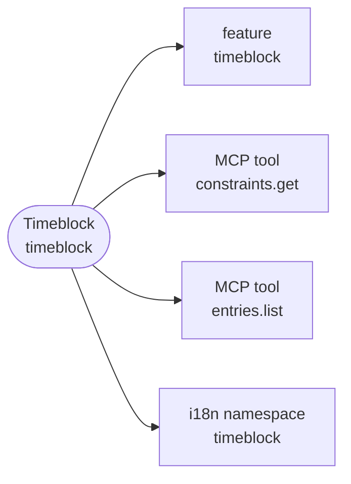
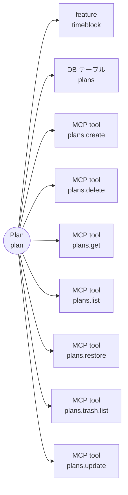
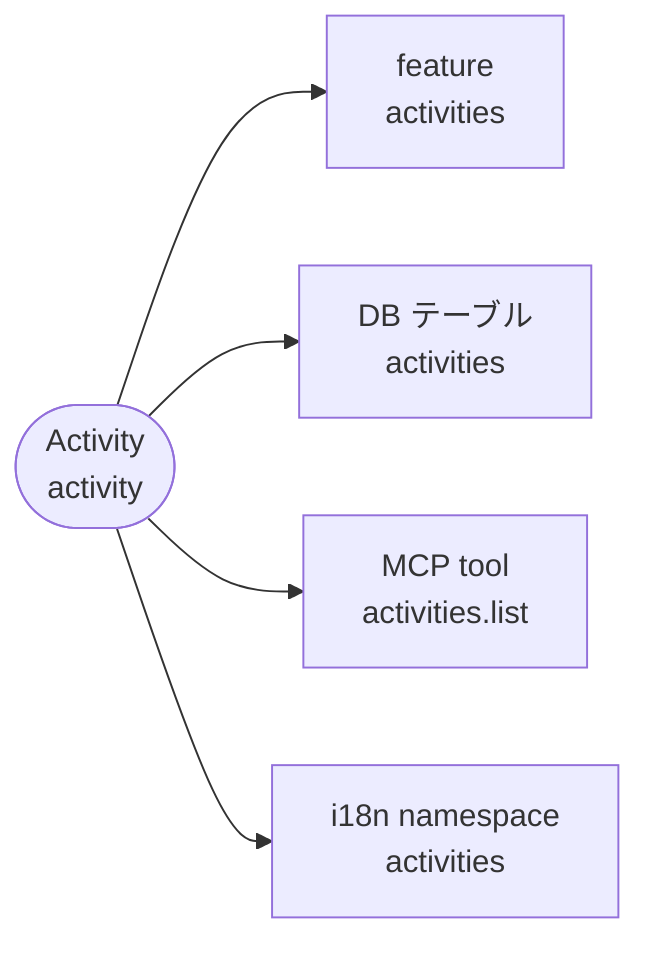
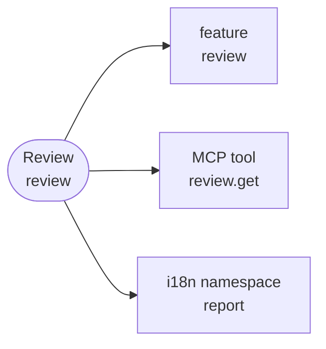
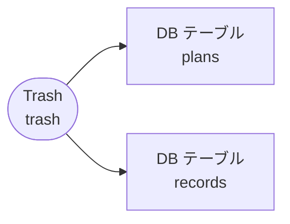
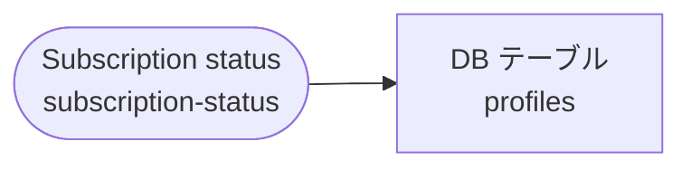
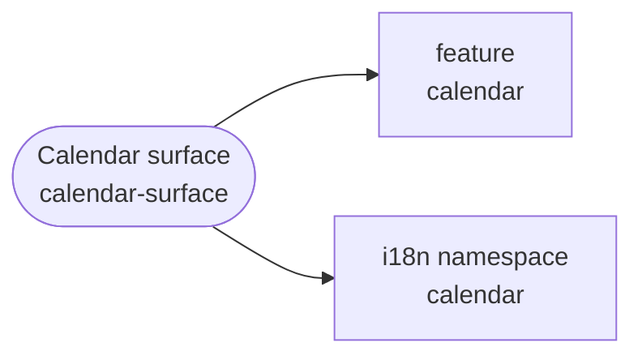
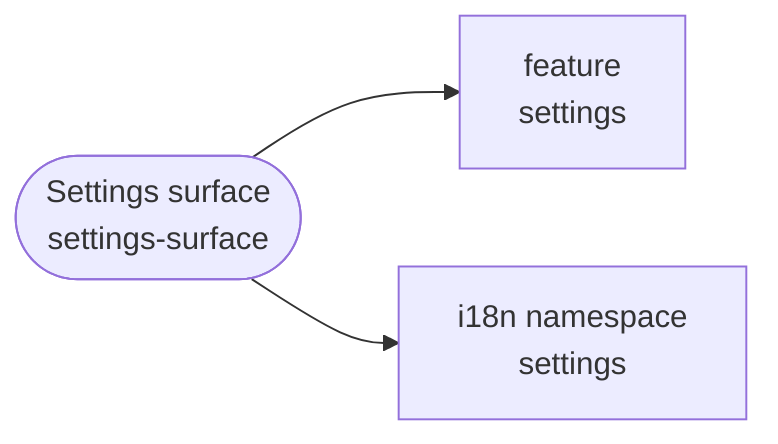

# Architecture Inventory（自動生成）

> **生成元**: `scripts/tasks/generate-architecture-map.ts`（`pnpm architecture:generate`）。
> 実装（`apps/product/src` / `supabase`）から自動発見した項目に、`scripts/lib/glossary/terms.ts` の対応を重ねた snapshot。
> **手で編集しない**。drift は `pnpm architecture:check`（docs-guard からも常時実行）が検出する。

実装から自動発見した項目（事実）と、用語集（`scripts/lib/glossary/terms.ts`）が与える意味の対応。
どの概念からも辿れない項目は 2 つに分かれる。**概念を足す候補**（用語集へ 1 行足すか実装を消すかを人間が判断する）と、
**語彙を持たない層**（SQL 内部・認証の定型画面・共通 UI など、概念が付かないことが正しいもの）。

## 概要

| 種別           | 件数 | 概念へ直接 | feature 経由のみ | 語彙を持たない層 | 概念を足す候補 |
| -------------- | ---- | ---------- | ---------------- | ---------------- | -------------- |
| feature        | 8    | 8          | 0                | 0                | 0              |
| DB テーブル    | 30   | 10         | 6                | 14               | 0              |
| DB 関数        | 138  | 1          | 59               | 78               | 0              |
| tRPC router    | 16   | 0          | 15               | 0                | 1              |
| tRPC procedure | 72   | 0          | 68               | 0                | 4              |
| MCP tool       | 19   | 19         | 0                | 0                | 0              |
| Zustand store  | 14   | 0          | 13               | 0                | 1              |
| Story          | 114  | 0          | 90               | 24               | 0              |
| route          | 16   | 0          | 6                | 10               | 0              |
| i18n namespace | 15   | 7          | 0                | 8                | 0              |

## 概念 → 実装

用語集の順。直接対応する項目を図に、feature 経由を含む全項目を表に出す。

### Timeblock（`timeblock`）

カレンダー上の時間ブロック。予定 / 記録の総称



| 種別           | 項目                                                                                                                                                                                                                                                                                                                                                                                                                                                                                                                                                                                                                                                              | 経路         |
| -------------- | ----------------------------------------------------------------------------------------------------------------------------------------------------------------------------------------------------------------------------------------------------------------------------------------------------------------------------------------------------------------------------------------------------------------------------------------------------------------------------------------------------------------------------------------------------------------------------------------------------------------------------------------------------------------- | ------------ |
| feature        | `timeblock`                                                                                                                                                                                                                                                                                                                                                                                                                                                                                                                                                                                                                                                       | 直接         |
| DB テーブル    | `activities`, `plan_template_blocks`, `plan_templates`, `plans`, `records`, `user_settings`                                                                                                                                                                                                                                                                                                                                                                                                                                                                                                                                                                       | feature 経由 |
| DB 関数        | `apply_mcp_plan_create_v1`, `apply_mcp_plan_delete_v1`, `apply_mcp_plan_restore_v1`, `apply_mcp_plan_update_v1`, `apply_mcp_record_create_v1`, `apply_mcp_record_delete_v1`, `apply_mcp_record_restore_v1`, `apply_mcp_record_update_v1`, `confirm_day_plans_command_v1`, `create_plan_command_v1`, `create_plans_bulk_command_v1`, `create_record_command_v1`, `delete_plan_command_v1`, `delete_record_command_v1`, `get_timeblock_context_marker_v1`, `record_plan_command_v1`, `restore_plan_command_v1`, `restore_record_command_v1`, `update_plan_command_v1`, `update_record_command_v1`                                                                   | feature 経由 |
| tRPC router    | `planCommands`, `plans`, `planTemplates`, `recordCommands`, `records`, `statistics`, `timeblockContext`                                                                                                                                                                                                                                                                                                                                                                                                                                                                                                                                                           | feature 経由 |
| tRPC procedure | `planCommands.confirmDay`, `planCommands.create`, `planCommands.delete`, `planCommands.record`, `planCommands.restore`, `planCommands.update`, `plans.getById`, `plans.list`, `planTemplates.applyToDay`, `planTemplates.create`, `planTemplates.delete`, `planTemplates.list`, `planTemplates.rename`, `recordCommands.create`, `recordCommands.delete`, `recordCommands.restore`, `recordCommands.update`, `records.getById`, `records.list`, `statistics.getActivityEstimationFactors`, `statistics.getActivityStats`, `statistics.getMcpReview`, `statistics.getTagEstimationFactors`, `timeblockContext.getConstraints`                                      | feature 経由 |
| MCP tool       | `constraints.get`, `entries.list`                                                                                                                                                                                                                                                                                                                                                                                                                                                                                                                                                                                                                                 | 直接         |
| Zustand store  | `useTimeblockInspectorStore`                                                                                                                                                                                                                                                                                                                                                                                                                                                                                                                                                                                                                                      | feature 経由 |
| Story          | `Product/Features/Timeblock/ClockTimePicker`, `Product/Features/Timeblock/EstimationFeedforward`, `Product/Features/Timeblock/Inspector/ActivityFieldRow`, `Product/Features/Timeblock/Inspector/DateRow`, `Product/Features/Timeblock/Inspector/InspectorHeaderActions`, `Product/Features/Timeblock/Inspector/NoteSection`, `Product/Features/Timeblock/Inspector/RecordFulfillmentRow`, `Product/Features/Timeblock/Inspector/TimeConflictAlert`, `Product/Features/Timeblock/Inspector/TimeRow`, `Product/Features/Timeblock/TimeblockEditor`, `Product/Features/Timeblock/TimeblockRecordActions`, `Product/Features/Timeblock/TimeblockRelationshipSection` | feature 経由 |
| route          | `/[locale]/calendar`                                                                                                                                                                                                                                                                                                                                                                                                                                                                                                                                                                                                                                              | feature 経由 |
| i18n namespace | `timeblock`                                                                                                                                                                                                                                                                                                                                                                                                                                                                                                                                                                                                                                                       | 直接         |

### Plan（`plan`）

これからやる時間の宣言。時間軸のどこにでも置ける独立エンティティ



| 種別           | 項目                                                                                                                                                                                                                                                                                                                                                                                                                                                                                                                                                                                                                                                              | 経路         |
| -------------- | ----------------------------------------------------------------------------------------------------------------------------------------------------------------------------------------------------------------------------------------------------------------------------------------------------------------------------------------------------------------------------------------------------------------------------------------------------------------------------------------------------------------------------------------------------------------------------------------------------------------------------------------------------------------- | ------------ |
| feature        | `timeblock`                                                                                                                                                                                                                                                                                                                                                                                                                                                                                                                                                                                                                                                       | 直接         |
| DB テーブル    | `plans`                                                                                                                                                                                                                                                                                                                                                                                                                                                                                                                                                                                                                                                           | 直接         |
| DB テーブル    | `activities`, `plan_template_blocks`, `plan_templates`, `records`, `user_settings`                                                                                                                                                                                                                                                                                                                                                                                                                                                                                                                                                                                | feature 経由 |
| DB 関数        | `apply_mcp_plan_create_v1`, `apply_mcp_plan_delete_v1`, `apply_mcp_plan_restore_v1`, `apply_mcp_plan_update_v1`, `apply_mcp_record_create_v1`, `apply_mcp_record_delete_v1`, `apply_mcp_record_restore_v1`, `apply_mcp_record_update_v1`, `confirm_day_plans_command_v1`, `create_plan_command_v1`, `create_plans_bulk_command_v1`, `create_record_command_v1`, `delete_plan_command_v1`, `delete_record_command_v1`, `get_timeblock_context_marker_v1`, `record_plan_command_v1`, `restore_plan_command_v1`, `restore_record_command_v1`, `update_plan_command_v1`, `update_record_command_v1`                                                                   | feature 経由 |
| tRPC router    | `planCommands`, `plans`, `planTemplates`, `recordCommands`, `records`, `statistics`, `timeblockContext`                                                                                                                                                                                                                                                                                                                                                                                                                                                                                                                                                           | feature 経由 |
| tRPC procedure | `planCommands.confirmDay`, `planCommands.create`, `planCommands.delete`, `planCommands.record`, `planCommands.restore`, `planCommands.update`, `plans.getById`, `plans.list`, `planTemplates.applyToDay`, `planTemplates.create`, `planTemplates.delete`, `planTemplates.list`, `planTemplates.rename`, `recordCommands.create`, `recordCommands.delete`, `recordCommands.restore`, `recordCommands.update`, `records.getById`, `records.list`, `statistics.getActivityEstimationFactors`, `statistics.getActivityStats`, `statistics.getMcpReview`, `statistics.getTagEstimationFactors`, `timeblockContext.getConstraints`                                      | feature 経由 |
| MCP tool       | `plans.create`, `plans.delete`, `plans.get`, `plans.list`, `plans.restore`, `plans.trash.list`, `plans.update`                                                                                                                                                                                                                                                                                                                                                                                                                                                                                                                                                    | 直接         |
| Zustand store  | `useTimeblockInspectorStore`                                                                                                                                                                                                                                                                                                                                                                                                                                                                                                                                                                                                                                      | feature 経由 |
| Story          | `Product/Features/Timeblock/ClockTimePicker`, `Product/Features/Timeblock/EstimationFeedforward`, `Product/Features/Timeblock/Inspector/ActivityFieldRow`, `Product/Features/Timeblock/Inspector/DateRow`, `Product/Features/Timeblock/Inspector/InspectorHeaderActions`, `Product/Features/Timeblock/Inspector/NoteSection`, `Product/Features/Timeblock/Inspector/RecordFulfillmentRow`, `Product/Features/Timeblock/Inspector/TimeConflictAlert`, `Product/Features/Timeblock/Inspector/TimeRow`, `Product/Features/Timeblock/TimeblockEditor`, `Product/Features/Timeblock/TimeblockRecordActions`, `Product/Features/Timeblock/TimeblockRelationshipSection` | feature 経由 |
| route          | `/[locale]/calendar`                                                                                                                                                                                                                                                                                                                                                                                                                                                                                                                                                                                                                                              | feature 経由 |

### Record（`record`）

実際に使った時間。予定とは独立して保存し、未来には終われない


| 種別           | 項目                                                                                                                                                                                                                                                                                                                                                                                                                                                                                                                                                                                                                                                              | 経路         |
| -------------- | ----------------------------------------------------------------------------------------------------------------------------------------------------------------------------------------------------------------------------------------------------------------------------------------------------------------------------------------------------------------------------------------------------------------------------------------------------------------------------------------------------------------------------------------------------------------------------------------------------------------------------------------------------------------- | ------------ |
| feature        | `timeblock`                                                                                                                                                                                                                                                                                                                                                                                                                                                                                                                                                                                                                                                       | 直接         |
| DB テーブル    | `records`                                                                                                                                                                                                                                                                                                                                                                                                                                                                                                                                                                                                                                                         | 直接         |
| DB テーブル    | `activities`, `plan_template_blocks`, `plan_templates`, `plans`, `user_settings`                                                                                                                                                                                                                                                                                                                                                                                                                                                                                                                                                                                  | feature 経由 |
| DB 関数        | `apply_mcp_plan_create_v1`, `apply_mcp_plan_delete_v1`, `apply_mcp_plan_restore_v1`, `apply_mcp_plan_update_v1`, `apply_mcp_record_create_v1`, `apply_mcp_record_delete_v1`, `apply_mcp_record_restore_v1`, `apply_mcp_record_update_v1`, `confirm_day_plans_command_v1`, `create_plan_command_v1`, `create_plans_bulk_command_v1`, `create_record_command_v1`, `delete_plan_command_v1`, `delete_record_command_v1`, `get_timeblock_context_marker_v1`, `record_plan_command_v1`, `restore_plan_command_v1`, `restore_record_command_v1`, `update_plan_command_v1`, `update_record_command_v1`                                                                   | feature 経由 |
| tRPC router    | `planCommands`, `plans`, `planTemplates`, `recordCommands`, `records`, `statistics`, `timeblockContext`                                                                                                                                                                                                                                                                                                                                                                                                                                                                                                                                                           | feature 経由 |
| tRPC procedure | `planCommands.confirmDay`, `planCommands.create`, `planCommands.delete`, `planCommands.record`, `planCommands.restore`, `planCommands.update`, `plans.getById`, `plans.list`, `planTemplates.applyToDay`, `planTemplates.create`, `planTemplates.delete`, `planTemplates.list`, `planTemplates.rename`, `recordCommands.create`, `recordCommands.delete`, `recordCommands.restore`, `recordCommands.update`, `records.getById`, `records.list`, `statistics.getActivityEstimationFactors`, `statistics.getActivityStats`, `statistics.getMcpReview`, `statistics.getTagEstimationFactors`, `timeblockContext.getConstraints`                                      | feature 経由 |
| MCP tool       | `records.create`, `records.delete`, `records.get`, `records.list`, `records.restore`, `records.trash.list`, `records.update`                                                                                                                                                                                                                                                                                                                                                                                                                                                                                                                                      | 直接         |
| Zustand store  | `useTimeblockInspectorStore`                                                                                                                                                                                                                                                                                                                                                                                                                                                                                                                                                                                                                                      | feature 経由 |
| Story          | `Product/Features/Timeblock/ClockTimePicker`, `Product/Features/Timeblock/EstimationFeedforward`, `Product/Features/Timeblock/Inspector/ActivityFieldRow`, `Product/Features/Timeblock/Inspector/DateRow`, `Product/Features/Timeblock/Inspector/InspectorHeaderActions`, `Product/Features/Timeblock/Inspector/NoteSection`, `Product/Features/Timeblock/Inspector/RecordFulfillmentRow`, `Product/Features/Timeblock/Inspector/TimeConflictAlert`, `Product/Features/Timeblock/Inspector/TimeRow`, `Product/Features/Timeblock/TimeblockEditor`, `Product/Features/Timeblock/TimeblockRecordActions`, `Product/Features/Timeblock/TimeblockRelationshipSection` | feature 経由 |
| route          | `/[locale]/calendar`                                                                                                                                                                                                                                                                                                                                                                                                                                                                                                                                                                                                                                              | feature 経由 |

### Activity（`activity`）

予定と記録の単位。最も具体的な分類で、無限に増えてよい



| 種別           | 項目                                                                                                                                                                                                                                                                                                                                                                                  | 経路         |
| -------------- | ------------------------------------------------------------------------------------------------------------------------------------------------------------------------------------------------------------------------------------------------------------------------------------------------------------------------------------------------------------------------------------- | ------------ |
| feature        | `activities`                                                                                                                                                                                                                                                                                                                                                                          | 直接         |
| DB テーブル    | `activities`                                                                                                                                                                                                                                                                                                                                                                          | 直接         |
| DB テーブル    | `categories`                                                                                                                                                                                                                                                                                                                                                                          | feature 経由 |
| tRPC router    | `activities`                                                                                                                                                                                                                                                                                                                                                                          | feature 経由 |
| tRPC procedure | `activities.archiveActivity`, `activities.archiveCategory`, `activities.createActivity`, `activities.createCategory`, `activities.deleteActivity`, `activities.deleteCategory`, `activities.listActivities`, `activities.listCategories`, `activities.listTree`, `activities.restoreActivity`, `activities.restoreCategory`, `activities.updateActivity`, `activities.updateCategory` | feature 経由 |
| MCP tool       | `activities.list`                                                                                                                                                                                                                                                                                                                                                                     | 直接         |
| Story          | `Product/Features/Activities/ActivityCreateModal`, `Product/Features/Activities/ActivityQuickSelector`, `Product/Features/Activities/CategoryAppearancePickerRow`                                                                                                                                                                                                                     | feature 経由 |
| route          | `/[locale]/calendar`, `/[locale]/report`                                                                                                                                                                                                                                                                                                                                              | feature 経由 |
| i18n namespace | `activities`                                                                                                                                                                                                                                                                                                                                                                          | 直接         |

### Category（`category`）

所属の主軸。1 アクティビティは最大 1 カテゴリー。色とアイコンを持つ


| 種別        | 項目              | 経路 |
| ----------- | ----------------- | ---- |
| DB テーブル | `categories`      | 直接 |
| MCP tool    | `categories.list` | 直接 |

### Segment（`segment`）

旧: 分析用の保存されたクエリ。2026-09-15 に UI / tRPC / MCP から撤去し、/report のアクティビティ単位フィルタへ置き換えた。DB テーブルだけが残る


| 種別           | 項目                                                                                                                                                                                                                                                                                                                                                                                                                                                                                                                                                                                                                                                                                                                     | 経路         |
| -------------- | ------------------------------------------------------------------------------------------------------------------------------------------------------------------------------------------------------------------------------------------------------------------------------------------------------------------------------------------------------------------------------------------------------------------------------------------------------------------------------------------------------------------------------------------------------------------------------------------------------------------------------------------------------------------------------------------------------------------------ | ------------ |
| feature        | `review`                                                                                                                                                                                                                                                                                                                                                                                                                                                                                                                                                                                                                                                                                                                 | 直接         |
| DB テーブル    | `segment_activities`, `segments`                                                                                                                                                                                                                                                                                                                                                                                                                                                                                                                                                                                                                                                                                         | 直接         |
| DB テーブル    | `activities`, `categories`, `plans`, `records`                                                                                                                                                                                                                                                                                                                                                                                                                                                                                                                                                                                                                                                                           | feature 経由 |
| tRPC router    | `review`                                                                                                                                                                                                                                                                                                                                                                                                                                                                                                                                                                                                                                                                                                                 | feature 経由 |
| tRPC procedure | `review.getReportActivityDetail`, `review.getReportPeriod`, `review.trackOpened`                                                                                                                                                                                                                                                                                                                                                                                                                                                                                                                                                                                                                                         | feature 経由 |
| Zustand store  | `useReportDetailStore`, `useReportViewStore`                                                                                                                                                                                                                                                                                                                                                                                                                                                                                                                                                                                                                                                                             | feature 経由 |
| Story          | `Product/Features/Review/Chapters/Allocation`, `Product/Features/Review/Chapters/CompassScatter`, `Product/Features/Review/Chapters/Execution`, `Product/Features/Review/Chapters/MirrorRows`, `Product/Features/Review/Chapters/Quality`, `Product/Features/Review/Chapters/WaitingList`, `Product/Features/Review/Detail/ReportDetailPanel`, `Product/Features/Review/Detail/ReportDetailSheet`, `Product/Features/Review/Layout/ReportGranularitySwitcher`, `Product/Features/Review/Layout/ReportHeader`, `Product/Features/Review/Layout/ReportMobileHeader`, `Product/Features/Review/Layout/ReportTabs`, `Product/Features/Review/Sidebar/ReportFilterDrawer`, `Product/Features/Review/Sidebar/ReportFilterList` | feature 経由 |
| route          | `/[locale]/report`                                                                                                                                                                                                                                                                                                                                                                                                                                                                                                                                                                                                                                                                                                       | feature 経由 |

### Plan template（`plan-template`）

1 日の予定の並びを保存して別の日へ適用する仕組み


| 種別           | 項目                                                                                                                                                                                                                                                                                                                                                                                                                                                                                                                                                                                                                                                              | 経路         |
| -------------- | ----------------------------------------------------------------------------------------------------------------------------------------------------------------------------------------------------------------------------------------------------------------------------------------------------------------------------------------------------------------------------------------------------------------------------------------------------------------------------------------------------------------------------------------------------------------------------------------------------------------------------------------------------------------- | ------------ |
| feature        | `timeblock`                                                                                                                                                                                                                                                                                                                                                                                                                                                                                                                                                                                                                                                       | 直接         |
| DB テーブル    | `plan_template_blocks`, `plan_templates`                                                                                                                                                                                                                                                                                                                                                                                                                                                                                                                                                                                                                          | 直接         |
| DB テーブル    | `activities`, `plans`, `records`, `user_settings`                                                                                                                                                                                                                                                                                                                                                                                                                                                                                                                                                                                                                 | feature 経由 |
| DB 関数        | `apply_mcp_plan_create_v1`, `apply_mcp_plan_delete_v1`, `apply_mcp_plan_restore_v1`, `apply_mcp_plan_update_v1`, `apply_mcp_record_create_v1`, `apply_mcp_record_delete_v1`, `apply_mcp_record_restore_v1`, `apply_mcp_record_update_v1`, `confirm_day_plans_command_v1`, `create_plan_command_v1`, `create_plans_bulk_command_v1`, `create_record_command_v1`, `delete_plan_command_v1`, `delete_record_command_v1`, `get_timeblock_context_marker_v1`, `record_plan_command_v1`, `restore_plan_command_v1`, `restore_record_command_v1`, `update_plan_command_v1`, `update_record_command_v1`                                                                   | feature 経由 |
| tRPC router    | `planCommands`, `plans`, `planTemplates`, `recordCommands`, `records`, `statistics`, `timeblockContext`                                                                                                                                                                                                                                                                                                                                                                                                                                                                                                                                                           | feature 経由 |
| tRPC procedure | `planCommands.confirmDay`, `planCommands.create`, `planCommands.delete`, `planCommands.record`, `planCommands.restore`, `planCommands.update`, `plans.getById`, `plans.list`, `planTemplates.applyToDay`, `planTemplates.create`, `planTemplates.delete`, `planTemplates.list`, `planTemplates.rename`, `recordCommands.create`, `recordCommands.delete`, `recordCommands.restore`, `recordCommands.update`, `records.getById`, `records.list`, `statistics.getActivityEstimationFactors`, `statistics.getActivityStats`, `statistics.getMcpReview`, `statistics.getTagEstimationFactors`, `timeblockContext.getConstraints`                                      | feature 経由 |
| Zustand store  | `useTimeblockInspectorStore`                                                                                                                                                                                                                                                                                                                                                                                                                                                                                                                                                                                                                                      | feature 経由 |
| Story          | `Product/Features/Timeblock/ClockTimePicker`, `Product/Features/Timeblock/EstimationFeedforward`, `Product/Features/Timeblock/Inspector/ActivityFieldRow`, `Product/Features/Timeblock/Inspector/DateRow`, `Product/Features/Timeblock/Inspector/InspectorHeaderActions`, `Product/Features/Timeblock/Inspector/NoteSection`, `Product/Features/Timeblock/Inspector/RecordFulfillmentRow`, `Product/Features/Timeblock/Inspector/TimeConflictAlert`, `Product/Features/Timeblock/Inspector/TimeRow`, `Product/Features/Timeblock/TimeblockEditor`, `Product/Features/Timeblock/TimeblockRecordActions`, `Product/Features/Timeblock/TimeblockRelationshipSection` | feature 経由 |
| route          | `/[locale]/calendar`                                                                                                                                                                                                                                                                                                                                                                                                                                                                                                                                                                                                                                              | feature 経由 |

### Review（`review`）

ページ名・機能名。route は /report、i18n namespace も report



| 種別           | 項目                                                                                                                                                                                                                                                                                                                                                                                                                                                                                                                                                                                                                                                                                                                     | 経路         |
| -------------- | ------------------------------------------------------------------------------------------------------------------------------------------------------------------------------------------------------------------------------------------------------------------------------------------------------------------------------------------------------------------------------------------------------------------------------------------------------------------------------------------------------------------------------------------------------------------------------------------------------------------------------------------------------------------------------------------------------------------------ | ------------ |
| feature        | `review`                                                                                                                                                                                                                                                                                                                                                                                                                                                                                                                                                                                                                                                                                                                 | 直接         |
| DB テーブル    | `activities`, `categories`, `plans`, `records`                                                                                                                                                                                                                                                                                                                                                                                                                                                                                                                                                                                                                                                                           | feature 経由 |
| tRPC router    | `review`                                                                                                                                                                                                                                                                                                                                                                                                                                                                                                                                                                                                                                                                                                                 | feature 経由 |
| tRPC procedure | `review.getReportActivityDetail`, `review.getReportPeriod`, `review.trackOpened`                                                                                                                                                                                                                                                                                                                                                                                                                                                                                                                                                                                                                                         | feature 経由 |
| MCP tool       | `review.get`                                                                                                                                                                                                                                                                                                                                                                                                                                                                                                                                                                                                                                                                                                             | 直接         |
| Zustand store  | `useReportDetailStore`, `useReportViewStore`                                                                                                                                                                                                                                                                                                                                                                                                                                                                                                                                                                                                                                                                             | feature 経由 |
| Story          | `Product/Features/Review/Chapters/Allocation`, `Product/Features/Review/Chapters/CompassScatter`, `Product/Features/Review/Chapters/Execution`, `Product/Features/Review/Chapters/MirrorRows`, `Product/Features/Review/Chapters/Quality`, `Product/Features/Review/Chapters/WaitingList`, `Product/Features/Review/Detail/ReportDetailPanel`, `Product/Features/Review/Detail/ReportDetailSheet`, `Product/Features/Review/Layout/ReportGranularitySwitcher`, `Product/Features/Review/Layout/ReportHeader`, `Product/Features/Review/Layout/ReportMobileHeader`, `Product/Features/Review/Layout/ReportTabs`, `Product/Features/Review/Sidebar/ReportFilterDrawer`, `Product/Features/Review/Sidebar/ReportFilterList` | feature 経由 |
| route          | `/[locale]/report`                                                                                                                                                                                                                                                                                                                                                                                                                                                                                                                                                                                                                                                                                                       | feature 経由 |
| i18n namespace | `report`                                                                                                                                                                                                                                                                                                                                                                                                                                                                                                                                                                                                                                                                                                                 | 直接         |

### Inspector（`inspector`）

タイムブロックをクリックした時に開く詳細パネル


| 種別           | 項目                                                                                                                                                                                                                                                                                                                                                                                                                                                                                                                                                                                                                                                              | 経路         |
| -------------- | ----------------------------------------------------------------------------------------------------------------------------------------------------------------------------------------------------------------------------------------------------------------------------------------------------------------------------------------------------------------------------------------------------------------------------------------------------------------------------------------------------------------------------------------------------------------------------------------------------------------------------------------------------------------- | ------------ |
| feature        | `timeblock`                                                                                                                                                                                                                                                                                                                                                                                                                                                                                                                                                                                                                                                       | 直接         |
| DB テーブル    | `activities`, `plan_template_blocks`, `plan_templates`, `plans`, `records`, `user_settings`                                                                                                                                                                                                                                                                                                                                                                                                                                                                                                                                                                       | feature 経由 |
| DB 関数        | `apply_mcp_plan_create_v1`, `apply_mcp_plan_delete_v1`, `apply_mcp_plan_restore_v1`, `apply_mcp_plan_update_v1`, `apply_mcp_record_create_v1`, `apply_mcp_record_delete_v1`, `apply_mcp_record_restore_v1`, `apply_mcp_record_update_v1`, `confirm_day_plans_command_v1`, `create_plan_command_v1`, `create_plans_bulk_command_v1`, `create_record_command_v1`, `delete_plan_command_v1`, `delete_record_command_v1`, `get_timeblock_context_marker_v1`, `record_plan_command_v1`, `restore_plan_command_v1`, `restore_record_command_v1`, `update_plan_command_v1`, `update_record_command_v1`                                                                   | feature 経由 |
| tRPC router    | `planCommands`, `plans`, `planTemplates`, `recordCommands`, `records`, `statistics`, `timeblockContext`                                                                                                                                                                                                                                                                                                                                                                                                                                                                                                                                                           | feature 経由 |
| tRPC procedure | `planCommands.confirmDay`, `planCommands.create`, `planCommands.delete`, `planCommands.record`, `planCommands.restore`, `planCommands.update`, `plans.getById`, `plans.list`, `planTemplates.applyToDay`, `planTemplates.create`, `planTemplates.delete`, `planTemplates.list`, `planTemplates.rename`, `recordCommands.create`, `recordCommands.delete`, `recordCommands.restore`, `recordCommands.update`, `records.getById`, `records.list`, `statistics.getActivityEstimationFactors`, `statistics.getActivityStats`, `statistics.getMcpReview`, `statistics.getTagEstimationFactors`, `timeblockContext.getConstraints`                                      | feature 経由 |
| Zustand store  | `useTimeblockInspectorStore`                                                                                                                                                                                                                                                                                                                                                                                                                                                                                                                                                                                                                                      | feature 経由 |
| Story          | `Product/Features/Timeblock/ClockTimePicker`, `Product/Features/Timeblock/EstimationFeedforward`, `Product/Features/Timeblock/Inspector/ActivityFieldRow`, `Product/Features/Timeblock/Inspector/DateRow`, `Product/Features/Timeblock/Inspector/InspectorHeaderActions`, `Product/Features/Timeblock/Inspector/NoteSection`, `Product/Features/Timeblock/Inspector/RecordFulfillmentRow`, `Product/Features/Timeblock/Inspector/TimeConflictAlert`, `Product/Features/Timeblock/Inspector/TimeRow`, `Product/Features/Timeblock/TimeblockEditor`, `Product/Features/Timeblock/TimeblockRecordActions`, `Product/Features/Timeblock/TimeblockRelationshipSection` | feature 経由 |
| route          | `/[locale]/calendar`                                                                                                                                                                                                                                                                                                                                                                                                                                                                                                                                                                                                                                              | feature 経由 |

### Archive（`archive`）

アクティビティ / カテゴリーを一覧から隠す。過去の記録は残る（削除ではない）


| 種別        | 項目                       | 経路 |
| ----------- | -------------------------- | ---- |
| DB テーブル | `activities`, `categories` | 直接 |

### Trash（`trash`）

削除したタイムブロックの soft delete 置き場。復元できる



| 種別        | 項目               | 経路 |
| ----------- | ------------------ | ---- |
| DB テーブル | `plans`, `records` | 直接 |

### Confirm day（`confirm-day`）

過去の予定をまとめて記録へ変換する操作


| 種別    | 項目                           | 経路 |
| ------- | ------------------------------ | ---- |
| DB 関数 | `confirm_day_plans_command_v1` | 直接 |

### Fulfillment（`fulfillment`）

記録に付ける 3 値。low = 消耗 / medium = 普通 / high = 充実


| 種別        | 項目      | 経路 |
| ----------- | --------- | ---- |
| DB テーブル | `records` | 直接 |

### External calendar event（`external-event`）

Google Calendar 等から同期した予定。未変換のものはゴーストとして薄く出す


| 種別           | 項目                                                                                                                                                                                                                                                                                                                                                                                                                                                                                                                                                                                                                                                                                                                                                                                                                                                                                                                          | 経路         |
| -------------- | ----------------------------------------------------------------------------------------------------------------------------------------------------------------------------------------------------------------------------------------------------------------------------------------------------------------------------------------------------------------------------------------------------------------------------------------------------------------------------------------------------------------------------------------------------------------------------------------------------------------------------------------------------------------------------------------------------------------------------------------------------------------------------------------------------------------------------------------------------------------------------------------------------------------------------- | ------------ |
| feature        | `external-calendar`                                                                                                                                                                                                                                                                                                                                                                                                                                                                                                                                                                                                                                                                                                                                                                                                                                                                                                           | 直接         |
| DB テーブル    | `external_calendar_events`                                                                                                                                                                                                                                                                                                                                                                                                                                                                                                                                                                                                                                                                                                                                                                                                                                                                                                    | 直接         |
| DB テーブル    | `calendar_connection_calendars`, `calendar_connections`                                                                                                                                                                                                                                                                                                                                                                                                                                                                                                                                                                                                                                                                                                                                                                                                                                                                       | feature 経由 |
| DB 関数        | `abandon_calendar_account_delete_revoke_v1`, `begin_calendar_account_deletion_v1`, `begin_calendar_sync_run_v1`, `claim_calendar_revoke_outbox_v1`, `clear_calendar_sync_cursor_command_v1`, `complete_calendar_revoke_outbox_v1`, `delete_all_user_data_command_v5`, `expire_calendar_revoke_outbox_v1`, `finalize_calendar_account_delete_revoke_v1`, `finish_calendar_sync_run_v1`, `get_calendar_authority_readiness_v1`, `get_external_lifecycle_app_version_v2`, `mark_calendar_connection_reauth_command_v2`, `persist_calendar_sync_result_command_v1`, `prepare_calendar_account_delete_revoke_v1`, `prepare_calendar_token_rotation_recovery_command_v1`, `prepare_user_data_purge_v1`, `replace_selected_calendars_command_v1`, `retry_calendar_revoke_outbox_v1`, `rotate_or_enqueue_calendar_refresh_token_command_v2`, `seal_calendar_account_deletion_v1`, `start_calendar_account_delete_provider_attempt_v1` | feature 経由 |
| tRPC router    | `externalCalendar`                                                                                                                                                                                                                                                                                                                                                                                                                                                                                                                                                                                                                                                                                                                                                                                                                                                                                                            | feature 経由 |
| tRPC procedure | `externalCalendar.disconnect`, `externalCalendar.dismissEvent`, `externalCalendar.getConnectionAvailability`, `externalCalendar.getSyncStatus`, `externalCalendar.listConnections`, `externalCalendar.listEvents`, `externalCalendar.listProviderCalendars`, `externalCalendar.syncNow`, `externalCalendar.updateSelectedCalendars`                                                                                                                                                                                                                                                                                                                                                                                                                                                                                                                                                                                           | feature 経由 |
| Story          | `Product/Features/ExternalCalendar/GoogleCalendarSettings`                                                                                                                                                                                                                                                                                                                                                                                                                                                                                                                                                                                                                                                                                                                                                                                                                                                                    | feature 経由 |
| route          | `/[locale]/calendar`, `/[locale]/settings/[category]`                                                                                                                                                                                                                                                                                                                                                                                                                                                                                                                                                                                                                                                                                                                                                                                                                                                                         | feature 経由 |

### Source（`plan-source`）

作成時に確定する不変の provenance。plans は manual / external_calendar / api、records はそれに from_plan / auto_migrated を加えた 5 値


| 種別        | 項目               | 経路 |
| ----------- | ------------------ | ---- |
| DB テーブル | `plans`, `records` | 直接 |

### note / description（`note-vs-description`）

Dayopt 自身のメモは note。description は外部カレンダー由来の本文と、MCP / メタタグの説明文にだけ使う


| 種別        | 項目                                           | 経路 |
| ----------- | ---------------------------------------------- | ---- |
| DB テーブル | `external_calendar_events`, `plans`, `records` | 直接 |

### Subscription status（`subscription-status`）

free / trialing / active / past_due / canceled。値の意味は docs/product/specs/billing.md



| 種別        | 項目       | 経路 |
| ----------- | ---------- | ---- |
| DB テーブル | `profiles` | 直接 |

### Calendar surface（`calendar-surface`）

カレンダー画面そのものを組み立てる区画。表示モード・ナビゲーション・絞り込み・DnD・作成 UI を持ち、時間の中身は timeblock feature が持つ



| 種別           | 項目                                                                                                                                                                                                                                                                                                                                                                                                                                                                                                                                                                                                                                                                                                                                                                                                                                                                                                                                                                                                                                                                                                                                                                                                                                                                                                                                                                                                                                                                                                                                                                                                                                                                                                                                                                                                                                                               | 経路         |
| -------------- | ------------------------------------------------------------------------------------------------------------------------------------------------------------------------------------------------------------------------------------------------------------------------------------------------------------------------------------------------------------------------------------------------------------------------------------------------------------------------------------------------------------------------------------------------------------------------------------------------------------------------------------------------------------------------------------------------------------------------------------------------------------------------------------------------------------------------------------------------------------------------------------------------------------------------------------------------------------------------------------------------------------------------------------------------------------------------------------------------------------------------------------------------------------------------------------------------------------------------------------------------------------------------------------------------------------------------------------------------------------------------------------------------------------------------------------------------------------------------------------------------------------------------------------------------------------------------------------------------------------------------------------------------------------------------------------------------------------------------------------------------------------------------------------------------------------------------------------------------------------------ | ------------ |
| feature        | `calendar`                                                                                                                                                                                                                                                                                                                                                                                                                                                                                                                                                                                                                                                                                                                                                                                                                                                                                                                                                                                                                                                                                                                                                                                                                                                                                                                                                                                                                                                                                                                                                                                                                                                                                                                                                                                                                                                         | 直接         |
| Zustand store  | `useActivitySortStore`, `useCalendarDisplayModeStore`, `useCalendarDragStore`, `useCalendarFilterStore`, `useCalendarNavigationStore`, `useInlineCreateStore`, `useTemplateSaveStore`, `useTimeblockClipboardStore`                                                                                                                                                                                                                                                                                                                                                                                                                                                                                                                                                                                                                                                                                                                                                                                                                                                                                                                                                                                                                                                                                                                                                                                                                                                                                                                                                                                                                                                                                                                                                                                                                                                | feature 経由 |
| Story          | `Product/Features/Activities/ActivityFilterList`, `Product/Features/Activities/ActivityRowMenu`, `Product/Features/Activities/CategoryCreateDialog`, `Product/Features/Activities/CategoryHeader`, `Product/Features/Calendar/Create/InlineCreatePanel`, `Product/Features/Calendar/Feedback/ViewSkeleton`, `Product/Features/Calendar/Grid/CurrentTimeLine`, `Product/Features/Calendar/Grid/TimeColumn`, `Product/Features/Calendar/Grid/TimezoneOffset`, `Product/Features/Calendar/Header`, `Product/Features/Calendar/Header/DateRangeDisplay`, `Product/Features/Calendar/Header/MobileCalendarHeader`, `Product/Features/Calendar/Header/ViewSwitcher`, `Product/Features/Calendar/Interaction/ConflictOverlay`, `Product/Features/Calendar/Interaction/DragSelectionHighlight`, `Product/Features/Calendar/Interaction/DragSelectionPreview`, `Product/Features/Calendar/Interaction/MobileTouchHint`, `Product/Features/Calendar/Interaction/TimeblockContextMenu`, `Product/Features/Calendar/Search/TimeblockSearchDialog`, `Product/Features/Calendar/Sidebar/ActivityChipRow`, `Product/Features/Calendar/Templates/MiniDayPreview`, `Product/Features/Calendar/Templates/SaveAsTemplateEntry`, `Product/Features/Calendar/Templates/TemplateContextMenu`, `Product/Features/Calendar/Templates/TemplateDayEditor`, `Product/Features/Calendar/Templates/TemplateList`, `Product/Features/Calendar/Templates/TemplateRow`, `Product/Features/Calendar/TwoLane/ExternalEventCard`, `Product/Features/Calendar/TwoLane/PlanLaneCard`, `Product/Features/Calendar/TwoLane/RecordLaneCard`, `Product/Features/Calendar/TwoLane/TwoLaneDayColumn`, `Product/Features/Calendar/Views/DateDisplay`, `Product/Features/Calendar/Views/DayView`, `Product/Features/Calendar/Views/WeekView`, `Product/Features/Calendar/Views/WeekView/MobileWeekLaneSwitcher` | feature 経由 |
| i18n namespace | `calendar`                                                                                                                                                                                                                                                                                                                                                                                                                                                                                                                                                                                                                                                                                                                                                                                                                                                                                                                                                                                                                                                                                                                                                                                                                                                                                                                                                                                                                                                                                                                                                                                                                                                                                                                                                                                                                                                         | 直接         |

### Settings surface（`settings-surface`）

設定画面の区画。アカウント / 表示 / データ / 課金 / 外部カレンダー / MCP 接続をまとめる composition で、他 feature を import してよい唯一の区画



| 種別           | 項目                                                                                                                                                                                                                                                                                                                                                                                                                                                                                                                                                                                                                                                                                                                                                                                                                                                              | 経路         |
| -------------- | ----------------------------------------------------------------------------------------------------------------------------------------------------------------------------------------------------------------------------------------------------------------------------------------------------------------------------------------------------------------------------------------------------------------------------------------------------------------------------------------------------------------------------------------------------------------------------------------------------------------------------------------------------------------------------------------------------------------------------------------------------------------------------------------------------------------------------------------------------------------- | ------------ |
| feature        | `settings`                                                                                                                                                                                                                                                                                                                                                                                                                                                                                                                                                                                                                                                                                                                                                                                                                                                        | 直接         |
| DB テーブル    | `oauth_connections`, `profiles`, `stripe_webhook_events`, `user_settings`                                                                                                                                                                                                                                                                                                                                                                                                                                                                                                                                                                                                                                                                                                                                                                                         | feature 経由 |
| DB 関数        | `abandon_billing_customer_provisioning_v2`, `claim_billing_customer_provisioning_v2`, `claim_billing_mutation_v3`, `classify_billing_customer_event_v1`, `cleanup_billing_account_deletion_terminal_receipts_v2`, `cleanup_billing_mutation_claims_v2`, `complete_billing_customer_provisioning_v2`, `count_unused_recovery_codes`, `get_account_deletion_customer_recovery_v1`, `get_account_deletion_readiness_v1`, `reconcile_billing_mutation_v4`, `replace_mfa_recovery_codes_v1`, `revoke_oauth_connection`, `start_billing_customer_provisioning_v2`, `start_billing_mutation_v2`, `sync_billing_subscription_deleted_v1`, `update_personalization`                                                                                                                                                                                                        | feature 経由 |
| tRPC router    | `billing`, `mcpConnections`, `userSettings`                                                                                                                                                                                                                                                                                                                                                                                                                                                                                                                                                                                                                                                                                                                                                                                                                       | feature 経由 |
| tRPC procedure | `billing.createCheckoutSession`, `billing.createPortalSession`, `billing.getAccess`, `billing.getOverview`, `billing.startTrial`, `mcpConnections.list`, `mcpConnections.revoke`, `userSettings.get`, `userSettings.getICalToken`, `userSettings.regenerateICalToken`, `userSettings.update`, `userSettings.updateProfile`                                                                                                                                                                                                                                                                                                                                                                                                                                                                                                                                        | feature 経由 |
| Zustand store  | `useBillingPollStore`                                                                                                                                                                                                                                                                                                                                                                                                                                                                                                                                                                                                                                                                                                                                                                                                                                             | feature 経由 |
| Story          | `Product/Components/Overlays/PaymentErrorDialog`, `Product/Components/Overlays/TrialEndedDialog`, `Product/Features/Settings/AccountDeletionDialog`, `Product/Features/Settings/AccountSettings`, `Product/Features/Settings/AvatarChangeDialog`, `Product/Features/Settings/BillingSettings`, `Product/Features/Settings/DataSettings`, `Product/Features/Settings/DisplayNameDialog`, `Product/Features/Settings/DisplaySettings`, `Product/Features/Settings/DisplaySettingsPatterns`, `Product/Features/Settings/EmailChangeDialog`, `Product/Features/Settings/ICalFeedSettings`, `Product/Features/Settings/InfoBox`, `Product/Features/Settings/McpConnectionsSettings`, `Product/Features/Settings/MFASection`, `Product/Features/Settings/PasswordChangeDialog`, `Product/Features/Settings/SettingsDialog`, `Product/Features/Settings/SettingsSidebar` | feature 経由 |
| route          | `/[locale]/calendar`, `/[locale]/report`, `/[locale]/settings`, `/[locale]/settings/[category]`                                                                                                                                                                                                                                                                                                                                                                                                                                                                                                                                                                                                                                                                                                                                                                   | feature 経由 |
| i18n namespace | `settings`                                                                                                                                                                                                                                                                                                                                                                                                                                                                                                                                                                                                                                                                                                                                                                                                                                                        | 直接         |

### Auth surface（`auth-surface`）

サインイン / サインアップ / MFA / リカバリコード / アカウント削除の区画。他 feature に依存しない independent


| 種別           | 項目                                                                                                                                                                                                                                                                                 | 経路         |
| -------------- | ------------------------------------------------------------------------------------------------------------------------------------------------------------------------------------------------------------------------------------------------------------------------------------ | ------------ |
| feature        | `auth`                                                                                                                                                                                                                                                                               | 直接         |
| DB テーブル    | `activities`, `categories`, `mfa_recovery_codes`, `plans`, `profiles`, `records`, `user_settings`                                                                                                                                                                                    | feature 経由 |
| DB 関数        | `count_unused_recovery_codes`, `use_recovery_code`                                                                                                                                                                                                                                   | feature 経由 |
| tRPC router    | `user`                                                                                                                                                                                                                                                                               | feature 経由 |
| tRPC procedure | `user.deleteAccount`, `user.deleteAllData`, `user.deleteBlocks`, `user.exportData`, `user.requestEmailChange`, `user.verifyRecoveryCode`                                                                                                                                             | feature 経由 |
| Zustand store  | `useAuthStore`                                                                                                                                                                                                                                                                       | feature 経由 |
| Story          | `Product/Features/Auth/AuthLayout`, `Product/Features/Auth/LoginForm`, `Product/Features/Auth/MFAVerifyForm`, `Product/Features/Auth/PasswordResetForm`, `Product/Features/Auth/ResetPasswordForm`, `Product/Features/Auth/SessionTimeoutDialog`, `Product/Features/Auth/SignupForm` | feature 経由 |
| route          | `/[locale]/auth/mfa-verify`, `/[locale]/auth/reset-password`                                                                                                                                                                                                                         | feature 経由 |
| i18n namespace | `auth`                                                                                                                                                                                                                                                                               | 直接         |

### Contact surface（`contact-surface`）

問い合わせフォームの区画。他 feature に依存しない independent

```mermaid
graph LR
  concept(["Contact surface<br/>contact-surface"])
  feature_contact["feature<br/>contact"]
  concept --> feature_contact
  i18n_namespace_contact["i18n namespace<br/>contact"]
  concept --> i18n_namespace_contact
```

| 種別           | 項目                                            | 経路         |
| -------------- | ----------------------------------------------- | ------------ |
| feature        | `contact`                                       | 直接         |
| tRPC router    | `contact`                                       | feature 経由 |
| tRPC procedure | `contact.submit`                                | feature 経由 |
| Story          | `Product/Features/Contact/ContactDialogContent` | feature 経由 |
| i18n namespace | `contact`                                       | 直接         |

## 概念を足す候補

どの概念からも辿れず、かつ「語彙を持たない層」にも当たらない項目。
用語集へ 1 行足すか、実装を消すかを人間が判断する。

| 種別           | 項目                        | 発見元                                         | 補足               |
| -------------- | --------------------------- | ---------------------------------------------- | ------------------ |
| tRPC router    | `email`                     | `apps/product/src/lib/email/router.ts`         | emailRouter        |
| tRPC procedure | `email.sendPasswordChanged` | `apps/product/src/lib/email/router.ts`         | protectedProcedure |
| tRPC procedure | `email.sendTrialExpired`    | `apps/product/src/lib/email/router.ts`         | protectedProcedure |
| tRPC procedure | `email.sendTrialExpiring`   | `apps/product/src/lib/email/router.ts`         | protectedProcedure |
| tRPC procedure | `email.sendWelcome`         | `apps/product/src/lib/email/router.ts`         | protectedProcedure |
| Zustand store  | `useShellStore`             | `apps/product/src/lib/stores/useShellStore.ts` | —                  |

## 語彙を持たない層（意図的）

概念が付かないことが正しい項目。判定規則は `scripts/lib/architecture-map/vocabulary-scope.ts` が持つ。
ここに落ちるのが誤りだと思ったら、規則の方を直す（表を手で編集しない）。

| 理由                                                                           | 種別           | 件数 | 項目                                                                                                                                                                                                                                                                                                                                                                                                                                                                                                                                                                                                                                                                                                                                                                                                                                                                                                                                                                                                                                                                                                                                                                                                                                                                                                                                                                                                                                                                                                                                                                                                                                                                                                                                                                                                                                                                                                                                                                                                                                                                                                                                                                                                                               |
| ------------------------------------------------------------------------------ | -------------- | ---- | ---------------------------------------------------------------------------------------------------------------------------------------------------------------------------------------------------------------------------------------------------------------------------------------------------------------------------------------------------------------------------------------------------------------------------------------------------------------------------------------------------------------------------------------------------------------------------------------------------------------------------------------------------------------------------------------------------------------------------------------------------------------------------------------------------------------------------------------------------------------------------------------------------------------------------------------------------------------------------------------------------------------------------------------------------------------------------------------------------------------------------------------------------------------------------------------------------------------------------------------------------------------------------------------------------------------------------------------------------------------------------------------------------------------------------------------------------------------------------------------------------------------------------------------------------------------------------------------------------------------------------------------------------------------------------------------------------------------------------------------------------------------------------------------------------------------------------------------------------------------------------------------------------------------------------------------------------------------------------------------------------------------------------------------------------------------------------------------------------------------------------------------------------------------------------------------------------------------------------------- |
| feature 横断の基盤（lib 層）。特定の概念には属さない                           | DB テーブル    | 5    | `cron_heartbeats`, `mcp_mutation_control`, `oauth_tokens`, `product_events`, `write_fence_control`                                                                                                                                                                                                                                                                                                                                                                                                                                                                                                                                                                                                                                                                                                                                                                                                                                                                                                                                                                                                                                                                                                                                                                                                                                                                                                                                                                                                                                                                                                                                                                                                                                                                                                                                                                                                                                                                                                                                                                                                                                                                                                                                 |
| feature 横断の基盤（lib 層）。特定の概念には属さない                           | DB 関数        | 3    | `exchange_oauth_authorization_code_v2`, `get_external_lifecycle_app_version_v3`, `rotate_oauth_refresh_token_v2`                                                                                                                                                                                                                                                                                                                                                                                                                                                                                                                                                                                                                                                                                                                                                                                                                                                                                                                                                                                                                                                                                                                                                                                                                                                                                                                                                                                                                                                                                                                                                                                                                                                                                                                                                                                                                                                                                                                                                                                                                                                                                                                   |
| feature 横断の基盤（app / lib 層）。特定の概念には属さない                     | DB テーブル    | 1    | `email_suppressions`                                                                                                                                                                                                                                                                                                                                                                                                                                                                                                                                                                                                                                                                                                                                                                                                                                                                                                                                                                                                                                                                                                                                                                                                                                                                                                                                                                                                                                                                                                                                                                                                                                                                                                                                                                                                                                                                                                                                                                                                                                                                                                                                                                                                               |
| feature 横断の基盤（app / lib 層）。特定の概念には属さない                     | DB 関数        | 1    | `get_mcp_environment_identity_v1`                                                                                                                                                                                                                                                                                                                                                                                                                                                                                                                                                                                                                                                                                                                                                                                                                                                                                                                                                                                                                                                                                                                                                                                                                                                                                                                                                                                                                                                                                                                                                                                                                                                                                                                                                                                                                                                                                                                                                                                                                                                                                                                                                                                                  |
| app から直接読み書きしない（SQL 関数の内部と RLS のためだけに存在する）        | DB テーブル    | 8    | `mcp_environment_identity`, `mcp_mutation_receipts`, `oauth_audit_log`, `oauth_authorization_codes`, `reports`, `undo_receipt_effects`, `undo_receipt_field_changes`, `undo_receipts`                                                                                                                                                                                                                                                                                                                                                                                                                                                                                                                                                                                                                                                                                                                                                                                                                                                                                                                                                                                                                                                                                                                                                                                                                                                                                                                                                                                                                                                                                                                                                                                                                                                                                                                                                                                                                                                                                                                                                                                                                                              |
| SQL 内部でのみ使う（trigger / cron / 他の SQL 関数）。app からの呼び出しが無い | DB 関数        | 62   | `abandon_billing_customer_provisioning_v1`, `apply_undo_receipt_v1`, `assert_active_timeblock_activity_v1`, `assert_timeblock_content_v1`, `assert_timeblock_external_event_v1`, `authorize_owned_storage_read_v1`, `authorize_owned_storage_write_v1`, `begin_calendar_oauth_attempt_v1`, `cancel_calendar_account_deletion_v1`, `claim_billing_customer_provisioning_v1`, `claim_billing_mutation_v2`, `claim_calendar_oauth_attempt_v1`, `claim_calendar_revoke_direct_attempt_v1`, `claim_calendar_revoke_outbox_v2`, `cleanup_billing_mutation_claims_v1`, `cleanup_calendar_authority_retention_v1`, `cleanup_calendar_revoke_operations_v1`, `cleanup_integration_security_events_v1`, `cleanup_mcp_mutation_receipts_v1`, `cleanup_oauth_access_tokens_v1`, `cleanup_oauth_authorization_codes_v1`, `cleanup_oauth_connections_v1`, `cleanup_oauth_refresh_tokens_v1`, `complete_billing_customer_provisioning_v1`, `confirm_day_plans_to_records`, `custom_access_token_hook`, `delete_all_user_data_command_v3`, `delete_all_user_data_command_v4`, `disconnect_calendar_connection_command_v1`, `expire_calendar_revoke_authority_v2`, `expire_calendar_revoke_authority_v3`, `finalize_calendar_revoke_attempt_v2`, `finalize_calendar_revoke_guards_v1`, `get_external_lifecycle_app_version_v1`, `get_user_data_generation_v1`, `get_user_timezone`, `get_vault_secret`, `invoke_edge_function`, `issue_oauth_token_pair`, `list_undoable_receipts_v1`, `lock_recordable_plan_v1`, `mark_calendar_connection_reauth_command_v3`, `prepare_calendar_token_rotation_recovery_command_v2`, `provision_calendar_authority_project_v1`, `provision_mcp_preview_environment_identity_v1`, `reconcile_billing_mutation_v2`, `reconcile_billing_mutation_v3`, `record_undo_receipt_v1`, `restore_plan`, `restore_record`, `rotate_or_enqueue_calendar_refresh_token_command_v3`, `save_calendar_connection_command_v1`, `save_calendar_connection_command_v2`, `set_mcp_billing_enforcement_v1`, `set_mcp_client_write_control_v1`, `set_mcp_mutation_control_v1`, `set_plan_skipped_command_v1`, `soft_delete_plan`, `soft_delete_record`, `start_billing_customer_provisioning_v1`, `trunc_week_tz`, `vault_secret_exists` |
| feature 横断の基盤（app 層）。特定の概念には属さない                           | DB 関数        | 12   | `begin_account_deletion_v1`, `bind_billing_account_deletion_v1`, `bind_calendar_account_deletion_v1`, `claim_account_deletion_step_v1`, `claim_stripe_webhook_event`, `complete_account_deletion_step_v1`, `create_oauth_authorization_grant_v2`, `get_external_authority_maintenance_status_v1`, `list_expired_calendar_account_deletion_intents_v1`, `normalize_calendar_account_deletion_intent_v1`, `seal_account_deletion_v1`, `seal_billing_account_deletion_v1`                                                                                                                                                                                                                                                                                                                                                                                                                                                                                                                                                                                                                                                                                                                                                                                                                                                                                                                                                                                                                                                                                                                                                                                                                                                                                                                                                                                                                                                                                                                                                                                                                                                                                                                                                             |
| feature に属さない共通 UI（`components` / `app` / `emails`）の Story           | Story          | 24   | `Product/Components/Display/LabeledRow`, `Product/Components/Display/SectionCard`, `Product/Components/Feedback/EmptyState`, `Product/Components/Feedback/ErrorBoundary`, `Product/Components/Feedback/ErrorState`, `Product/Components/Feedback/Toast`, `Product/Components/Inputs/AvatarUpload`, `Product/Components/Inputs/MiniCalendar`, `Product/Components/Navigation/DateNavigator`, `Product/Components/Overlays/ConfirmDialog`, `Product/Components/Overlays/DestructiveFormDialog`, `Product/Components/Overlays/ShortcutCheatSheetDialog`, `Product/Components/Shell/AnimatedWidthPanel`, `Product/Components/Shell/AppHeader`, `Product/Components/Shell/CookieConsentBanner`, `Product/Components/Shell/InstallBanner`, `Product/Components/Shell/IOSInstallGuide`, `Product/Components/Shell/MobileAccountButton`, `Product/Components/Shell/Sidebar/Container`, `Product/Components/Shell/Sidebar/IconButton`, `Product/Components/Shell/Sidebar/Section`, `Product/Components/Shell/Sidebar/UserMenu`, `Product/Components/Shell/WorkspaceTabs`, `Product/Emails`                                                                                                                                                                                                                                                                                                                                                                                                                                                                                                                                                                                                                                                                                                                                                                                                                                                                                                                                                                                                                                                                                                                                                  |
| 認証 / OAuth の定型フローと shell。製品語彙ではなく手続きの画面                | route          | 10   | `/[locale]`, `/[locale]/auth`, `/[locale]/auth/confirmed`, `/[locale]/auth/login`, `/[locale]/auth/password`, `/[locale]/auth/session-error`, `/[locale]/auth/signup`, `/[locale]/oauth/authorize`, `/[locale]/oauth/consent`, `/offline`                                                                                                                                                                                                                                                                                                                                                                                                                                                                                                                                                                                                                                                                                                                                                                                                                                                                                                                                                                                                                                                                                                                                                                                                                                                                                                                                                                                                                                                                                                                                                                                                                                                                                                                                                                                                                                                                                                                                                                                          |
| 画面横断の定型文言。特定の概念には属さない                                     | i18n namespace | 8    | `common`, `email`, `error`, `legal`, `navigation`, `oauth`, `shortcuts`, `sidebar`                                                                                                                                                                                                                                                                                                                                                                                                                                                                                                                                                                                                                                                                                                                                                                                                                                                                                                                                                                                                                                                                                                                                                                                                                                                                                                                                                                                                                                                                                                                                                                                                                                                                                                                                                                                                                                                                                                                                                                                                                                                                                                                                                 |
