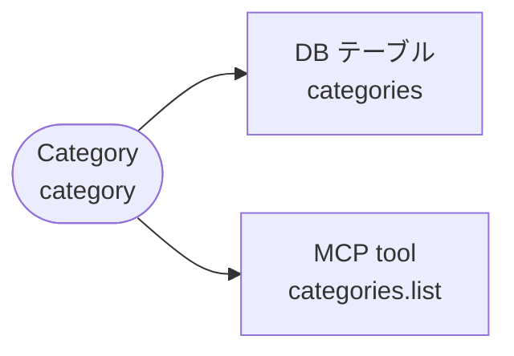
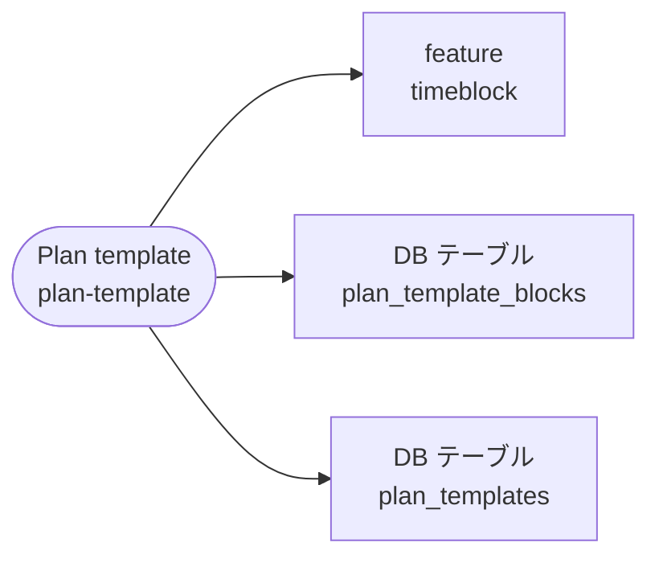
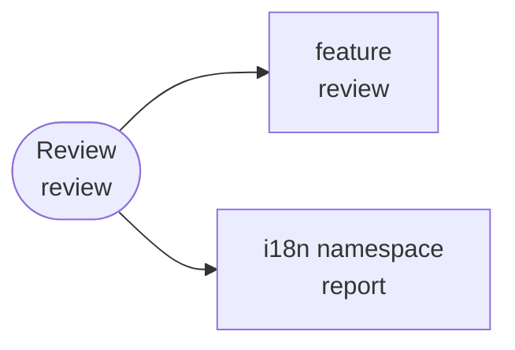
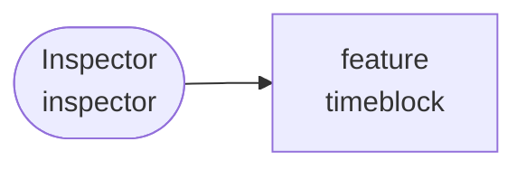
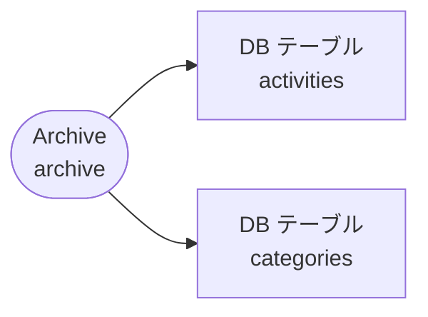
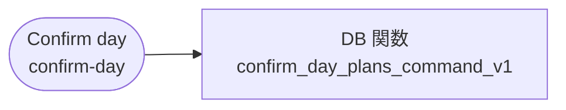
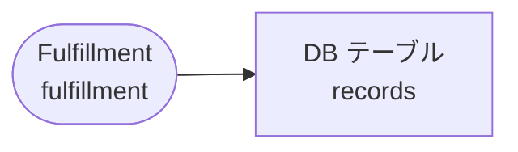
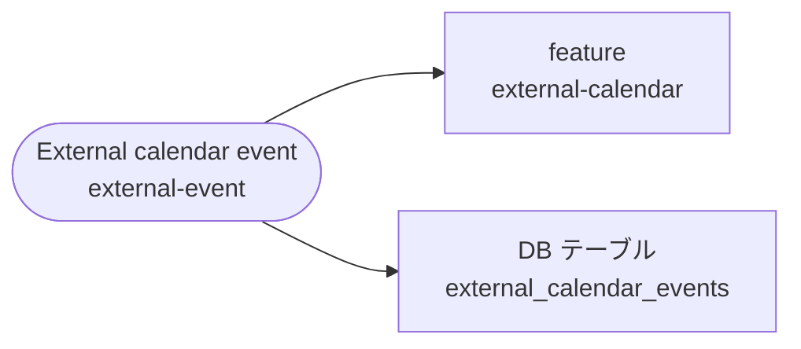
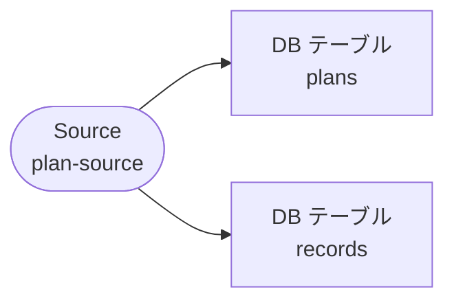

# Architecture Inventory（自動生成）

> **生成元**: `scripts/tasks/generate-architecture-map.ts`（`pnpm architecture:generate`）。
> 実装（`apps/product/src` / `supabase`）から自動発見した項目に、`scripts/lib/glossary/terms.ts` の対応を重ねた snapshot。
> **手で編集しない**。drift は `pnpm architecture:check`（docs-guard からも常時実行）が検出する。

実装から自動発見した項目（事実）と、用語集（`scripts/lib/glossary/terms.ts`）が与える意味の対応。
「未マッピング」は、どの概念からも辿れない項目。用語集へ 1 行足すか、実装を消すかを人間が判断する。

## 概要

| 種別           | 件数 | 概念へ直接 | feature 経由のみ | 未マッピング |
| -------------- | ---- | ---------- | ---------------- | ------------ |
| feature        | 8    | 4          | 0                | 4            |
| DB テーブル    | 30   | 10         | 0                | 20           |
| DB 関数        | 138  | 1          | 28               | 109          |
| tRPC router    | 16   | 0          | 10               | 6            |
| tRPC procedure | 75   | 0          | 48               | 27           |
| MCP tool       | 19   | 18         | 0                | 1            |
| Zustand store  | 14   | 0          | 3                | 11           |
| Story          | 114  | 0          | 30               | 84           |
| route          | 16   | 0          | 0                | 16           |
| i18n namespace | 15   | 3          | 0                | 12           |

## 概念 → 実装

用語集の順。直接対応する項目を図に、feature 経由を含む全項目を表に出す。

### Timeblock（`timeblock`）

カレンダー上の時間ブロック。予定 / 記録の総称

| 種別           | 項目                                                                                                                                                                                                                                                                                                                                                                                                                                                                                                                                                                                                                                                              | 経路         |
| -------------- | ----------------------------------------------------------------------------------------------------------------------------------------------------------------------------------------------------------------------------------------------------------------------------------------------------------------------------------------------------------------------------------------------------------------------------------------------------------------------------------------------------------------------------------------------------------------------------------------------------------------------------------------------------------------- | ------------ |
| feature        | `timeblock`                                                                                                                                                                                                                                                                                                                                                                                                                                                                                                                                                                                                                                                       | 直接         |
| DB 関数        | `apply_mcp_plan_create_v1`, `apply_mcp_plan_delete_v1`, `apply_mcp_plan_restore_v1`, `apply_mcp_plan_update_v1`, `apply_mcp_record_create_v1`, `apply_mcp_record_delete_v1`, `apply_mcp_record_restore_v1`, `apply_mcp_record_update_v1`, `confirm_day_plans_command_v1`, `create_plan_command_v1`, `create_plans_bulk_command_v1`, `create_record_command_v1`, `delete_plan_command_v1`, `delete_record_command_v1`, `get_timeblock_context_marker_v1`, `record_plan_command_v1`, `restore_plan_command_v1`, `restore_record_command_v1`, `update_plan_command_v1`, `update_record_command_v1`                                                                   | feature 経由 |
| tRPC router    | `planCommands`, `plans`, `planTemplates`, `recordCommands`, `records`, `statistics`, `timeblockContext`                                                                                                                                                                                                                                                                                                                                                                                                                                                                                                                                                           | feature 経由 |
| tRPC procedure | `planCommands.confirmDay`, `planCommands.create`, `planCommands.delete`, `planCommands.record`, `planCommands.restore`, `planCommands.update`, `plans.getById`, `plans.list`, `planTemplates.applyToDay`, `planTemplates.create`, `planTemplates.delete`, `planTemplates.list`, `planTemplates.rename`, `recordCommands.create`, `recordCommands.delete`, `recordCommands.restore`, `recordCommands.update`, `records.getById`, `records.list`, `statistics-general-router.getActivityStats`, `statistics-summary-router.getMcpReview`, `timeblockContext.getConstraints`, `timeblockContext.getRevision`                                                         | feature 経由 |
| MCP tool       | `constraints.get`, `entries.list`                                                                                                                                                                                                                                                                                                                                                                                                                                                                                                                                                                                                                                 | 直接         |
| Zustand store  | `useTimeblockInspectorStore`                                                                                                                                                                                                                                                                                                                                                                                                                                                                                                                                                                                                                                      | feature 経由 |
| Story          | `Product/Features/Timeblock/ClockTimePicker`, `Product/Features/Timeblock/EstimationFeedforward`, `Product/Features/Timeblock/Inspector/ActivityFieldRow`, `Product/Features/Timeblock/Inspector/DateRow`, `Product/Features/Timeblock/Inspector/InspectorHeaderActions`, `Product/Features/Timeblock/Inspector/NoteSection`, `Product/Features/Timeblock/Inspector/RecordFulfillmentRow`, `Product/Features/Timeblock/Inspector/TimeConflictAlert`, `Product/Features/Timeblock/Inspector/TimeRow`, `Product/Features/Timeblock/TimeblockEditor`, `Product/Features/Timeblock/TimeblockRecordActions`, `Product/Features/Timeblock/TimeblockRelationshipSection` | feature 経由 |
| i18n namespace | `timeblock`                                                                                                                                                                                                                                                                                                                                                                                                                                                                                                                                                                                                                                                       | 直接         |

### Plan（`plan`）

これからやる時間の宣言。時間軸のどこにでも置ける独立エンティティ

| 種別           | 項目                                                                                                                                                                                                                                                                                                                                                                                                                                                                                                                                                                                                                                                              | 経路         |
| -------------- | ----------------------------------------------------------------------------------------------------------------------------------------------------------------------------------------------------------------------------------------------------------------------------------------------------------------------------------------------------------------------------------------------------------------------------------------------------------------------------------------------------------------------------------------------------------------------------------------------------------------------------------------------------------------- | ------------ |
| feature        | `timeblock`                                                                                                                                                                                                                                                                                                                                                                                                                                                                                                                                                                                                                                                       | 直接         |
| DB テーブル    | `plans`                                                                                                                                                                                                                                                                                                                                                                                                                                                                                                                                                                                                                                                           | 直接         |
| DB 関数        | `apply_mcp_plan_create_v1`, `apply_mcp_plan_delete_v1`, `apply_mcp_plan_restore_v1`, `apply_mcp_plan_update_v1`, `apply_mcp_record_create_v1`, `apply_mcp_record_delete_v1`, `apply_mcp_record_restore_v1`, `apply_mcp_record_update_v1`, `confirm_day_plans_command_v1`, `create_plan_command_v1`, `create_plans_bulk_command_v1`, `create_record_command_v1`, `delete_plan_command_v1`, `delete_record_command_v1`, `get_timeblock_context_marker_v1`, `record_plan_command_v1`, `restore_plan_command_v1`, `restore_record_command_v1`, `update_plan_command_v1`, `update_record_command_v1`                                                                   | feature 経由 |
| tRPC router    | `planCommands`, `plans`, `planTemplates`, `recordCommands`, `records`, `statistics`, `timeblockContext`                                                                                                                                                                                                                                                                                                                                                                                                                                                                                                                                                           | feature 経由 |
| tRPC procedure | `planCommands.confirmDay`, `planCommands.create`, `planCommands.delete`, `planCommands.record`, `planCommands.restore`, `planCommands.update`, `plans.getById`, `plans.list`, `planTemplates.applyToDay`, `planTemplates.create`, `planTemplates.delete`, `planTemplates.list`, `planTemplates.rename`, `recordCommands.create`, `recordCommands.delete`, `recordCommands.restore`, `recordCommands.update`, `records.getById`, `records.list`, `statistics-general-router.getActivityStats`, `statistics-summary-router.getMcpReview`, `timeblockContext.getConstraints`, `timeblockContext.getRevision`                                                         | feature 経由 |
| MCP tool       | `plans.create`, `plans.delete`, `plans.get`, `plans.list`, `plans.restore`, `plans.trash.list`, `plans.update`                                                                                                                                                                                                                                                                                                                                                                                                                                                                                                                                                    | 直接         |
| Zustand store  | `useTimeblockInspectorStore`                                                                                                                                                                                                                                                                                                                                                                                                                                                                                                                                                                                                                                      | feature 経由 |
| Story          | `Product/Features/Timeblock/ClockTimePicker`, `Product/Features/Timeblock/EstimationFeedforward`, `Product/Features/Timeblock/Inspector/ActivityFieldRow`, `Product/Features/Timeblock/Inspector/DateRow`, `Product/Features/Timeblock/Inspector/InspectorHeaderActions`, `Product/Features/Timeblock/Inspector/NoteSection`, `Product/Features/Timeblock/Inspector/RecordFulfillmentRow`, `Product/Features/Timeblock/Inspector/TimeConflictAlert`, `Product/Features/Timeblock/Inspector/TimeRow`, `Product/Features/Timeblock/TimeblockEditor`, `Product/Features/Timeblock/TimeblockRecordActions`, `Product/Features/Timeblock/TimeblockRelationshipSection` | feature 経由 |

### Record（`record`）

実際に使った時間。予定とは独立して保存し、未来には終われない

| 種別           | 項目                                                                                                                                                                                                                                                                                                                                                                                                                                                                                                                                                                                                                                                              | 経路         |
| -------------- | ----------------------------------------------------------------------------------------------------------------------------------------------------------------------------------------------------------------------------------------------------------------------------------------------------------------------------------------------------------------------------------------------------------------------------------------------------------------------------------------------------------------------------------------------------------------------------------------------------------------------------------------------------------------- | ------------ |
| feature        | `timeblock`                                                                                                                                                                                                                                                                                                                                                                                                                                                                                                                                                                                                                                                       | 直接         |
| DB テーブル    | `records`                                                                                                                                                                                                                                                                                                                                                                                                                                                                                                                                                                                                                                                         | 直接         |
| DB 関数        | `apply_mcp_plan_create_v1`, `apply_mcp_plan_delete_v1`, `apply_mcp_plan_restore_v1`, `apply_mcp_plan_update_v1`, `apply_mcp_record_create_v1`, `apply_mcp_record_delete_v1`, `apply_mcp_record_restore_v1`, `apply_mcp_record_update_v1`, `confirm_day_plans_command_v1`, `create_plan_command_v1`, `create_plans_bulk_command_v1`, `create_record_command_v1`, `delete_plan_command_v1`, `delete_record_command_v1`, `get_timeblock_context_marker_v1`, `record_plan_command_v1`, `restore_plan_command_v1`, `restore_record_command_v1`, `update_plan_command_v1`, `update_record_command_v1`                                                                   | feature 経由 |
| tRPC router    | `planCommands`, `plans`, `planTemplates`, `recordCommands`, `records`, `statistics`, `timeblockContext`                                                                                                                                                                                                                                                                                                                                                                                                                                                                                                                                                           | feature 経由 |
| tRPC procedure | `planCommands.confirmDay`, `planCommands.create`, `planCommands.delete`, `planCommands.record`, `planCommands.restore`, `planCommands.update`, `plans.getById`, `plans.list`, `planTemplates.applyToDay`, `planTemplates.create`, `planTemplates.delete`, `planTemplates.list`, `planTemplates.rename`, `recordCommands.create`, `recordCommands.delete`, `recordCommands.restore`, `recordCommands.update`, `records.getById`, `records.list`, `statistics-general-router.getActivityStats`, `statistics-summary-router.getMcpReview`, `timeblockContext.getConstraints`, `timeblockContext.getRevision`                                                         | feature 経由 |
| MCP tool       | `records.create`, `records.delete`, `records.get`, `records.list`, `records.restore`, `records.trash.list`, `records.update`                                                                                                                                                                                                                                                                                                                                                                                                                                                                                                                                      | 直接         |
| Zustand store  | `useTimeblockInspectorStore`                                                                                                                                                                                                                                                                                                                                                                                                                                                                                                                                                                                                                                      | feature 経由 |
| Story          | `Product/Features/Timeblock/ClockTimePicker`, `Product/Features/Timeblock/EstimationFeedforward`, `Product/Features/Timeblock/Inspector/ActivityFieldRow`, `Product/Features/Timeblock/Inspector/DateRow`, `Product/Features/Timeblock/Inspector/InspectorHeaderActions`, `Product/Features/Timeblock/Inspector/NoteSection`, `Product/Features/Timeblock/Inspector/RecordFulfillmentRow`, `Product/Features/Timeblock/Inspector/TimeConflictAlert`, `Product/Features/Timeblock/Inspector/TimeRow`, `Product/Features/Timeblock/TimeblockEditor`, `Product/Features/Timeblock/TimeblockRecordActions`, `Product/Features/Timeblock/TimeblockRelationshipSection` | feature 経由 |

### Activity（`activity`）

予定と記録の単位。最も具体的な分類で、無限に増えてよい

| 種別           | 項目                                                                                                                                                                                                                                                                                                                                                                                  | 経路         |
| -------------- | ------------------------------------------------------------------------------------------------------------------------------------------------------------------------------------------------------------------------------------------------------------------------------------------------------------------------------------------------------------------------------------- | ------------ |
| feature        | `activities`                                                                                                                                                                                                                                                                                                                                                                          | 直接         |
| DB テーブル    | `activities`                                                                                                                                                                                                                                                                                                                                                                          | 直接         |
| tRPC router    | `activities`                                                                                                                                                                                                                                                                                                                                                                          | feature 経由 |
| tRPC procedure | `activities.archiveActivity`, `activities.archiveCategory`, `activities.createActivity`, `activities.createCategory`, `activities.deleteActivity`, `activities.deleteCategory`, `activities.listActivities`, `activities.listCategories`, `activities.listTree`, `activities.restoreActivity`, `activities.restoreCategory`, `activities.updateActivity`, `activities.updateCategory` | feature 経由 |
| MCP tool       | `activities.list`                                                                                                                                                                                                                                                                                                                                                                     | 直接         |
| Story          | `Product/Features/Activities/ActivityCreateModal`, `Product/Features/Activities/ActivityQuickSelector`, `Product/Features/Activities/CategoryAppearancePickerRow`                                                                                                                                                                                                                     | feature 経由 |
| i18n namespace | `activities`                                                                                                                                                                                                                                                                                                                                                                          | 直接         |

### Category（`category`）

所属の主軸。1 アクティビティは最大 1 カテゴリー。色とアイコンを持つ

| 種別        | 項目              | 経路 |
| ----------- | ----------------- | ---- |
| DB テーブル | `categories`      | 直接 |
| MCP tool    | `categories.list` | 直接 |

### Segment（`segment`）

旧: 分析用の保存されたクエリ。2026-09-15 に UI / tRPC / MCP から撤去し、/report のアクティビティ単位フィルタへ置き換えた。DB テーブルだけが残る

| 種別           | 項目                                                                                                                                                                                                                                                                                                                                                                                                                                                                                                                                                                                                                                                                                                                     | 経路         |
| -------------- | ------------------------------------------------------------------------------------------------------------------------------------------------------------------------------------------------------------------------------------------------------------------------------------------------------------------------------------------------------------------------------------------------------------------------------------------------------------------------------------------------------------------------------------------------------------------------------------------------------------------------------------------------------------------------------------------------------------------------ | ------------ |
| feature        | `review`                                                                                                                                                                                                                                                                                                                                                                                                                                                                                                                                                                                                                                                                                                                 | 直接         |
| DB テーブル    | `segment_activities`, `segments`                                                                                                                                                                                                                                                                                                                                                                                                                                                                                                                                                                                                                                                                                         | 直接         |
| tRPC router    | `review`                                                                                                                                                                                                                                                                                                                                                                                                                                                                                                                                                                                                                                                                                                                 | feature 経由 |
| tRPC procedure | `review.getReportActivityDetail`, `review.getReportPeriod`, `review.trackOpened`                                                                                                                                                                                                                                                                                                                                                                                                                                                                                                                                                                                                                                         | feature 経由 |
| Zustand store  | `useReportDetailStore`, `useReportViewStore`                                                                                                                                                                                                                                                                                                                                                                                                                                                                                                                                                                                                                                                                             | feature 経由 |
| Story          | `Product/Features/Review/Chapters/Allocation`, `Product/Features/Review/Chapters/CompassScatter`, `Product/Features/Review/Chapters/Execution`, `Product/Features/Review/Chapters/MirrorRows`, `Product/Features/Review/Chapters/Quality`, `Product/Features/Review/Chapters/WaitingList`, `Product/Features/Review/Detail/ReportDetailPanel`, `Product/Features/Review/Detail/ReportDetailSheet`, `Product/Features/Review/Layout/ReportGranularitySwitcher`, `Product/Features/Review/Layout/ReportHeader`, `Product/Features/Review/Layout/ReportMobileHeader`, `Product/Features/Review/Layout/ReportTabs`, `Product/Features/Review/Sidebar/ReportFilterDrawer`, `Product/Features/Review/Sidebar/ReportFilterList` | feature 経由 |

### Plan template（`plan-template`）

1 日の予定の並びを保存して別の日へ適用する仕組み

| 種別           | 項目                                                                                                                                                                                                                                                                                                                                                                                                                                                                                                                                                                                                                                                              | 経路         |
| -------------- | ----------------------------------------------------------------------------------------------------------------------------------------------------------------------------------------------------------------------------------------------------------------------------------------------------------------------------------------------------------------------------------------------------------------------------------------------------------------------------------------------------------------------------------------------------------------------------------------------------------------------------------------------------------------- | ------------ |
| feature        | `timeblock`                                                                                                                                                                                                                                                                                                                                                                                                                                                                                                                                                                                                                                                       | 直接         |
| DB テーブル    | `plan_template_blocks`, `plan_templates`                                                                                                                                                                                                                                                                                                                                                                                                                                                                                                                                                                                                                          | 直接         |
| DB 関数        | `apply_mcp_plan_create_v1`, `apply_mcp_plan_delete_v1`, `apply_mcp_plan_restore_v1`, `apply_mcp_plan_update_v1`, `apply_mcp_record_create_v1`, `apply_mcp_record_delete_v1`, `apply_mcp_record_restore_v1`, `apply_mcp_record_update_v1`, `confirm_day_plans_command_v1`, `create_plan_command_v1`, `create_plans_bulk_command_v1`, `create_record_command_v1`, `delete_plan_command_v1`, `delete_record_command_v1`, `get_timeblock_context_marker_v1`, `record_plan_command_v1`, `restore_plan_command_v1`, `restore_record_command_v1`, `update_plan_command_v1`, `update_record_command_v1`                                                                   | feature 経由 |
| tRPC router    | `planCommands`, `plans`, `planTemplates`, `recordCommands`, `records`, `statistics`, `timeblockContext`                                                                                                                                                                                                                                                                                                                                                                                                                                                                                                                                                           | feature 経由 |
| tRPC procedure | `planCommands.confirmDay`, `planCommands.create`, `planCommands.delete`, `planCommands.record`, `planCommands.restore`, `planCommands.update`, `plans.getById`, `plans.list`, `planTemplates.applyToDay`, `planTemplates.create`, `planTemplates.delete`, `planTemplates.list`, `planTemplates.rename`, `recordCommands.create`, `recordCommands.delete`, `recordCommands.restore`, `recordCommands.update`, `records.getById`, `records.list`, `statistics-general-router.getActivityStats`, `statistics-summary-router.getMcpReview`, `timeblockContext.getConstraints`, `timeblockContext.getRevision`                                                         | feature 経由 |
| Zustand store  | `useTimeblockInspectorStore`                                                                                                                                                                                                                                                                                                                                                                                                                                                                                                                                                                                                                                      | feature 経由 |
| Story          | `Product/Features/Timeblock/ClockTimePicker`, `Product/Features/Timeblock/EstimationFeedforward`, `Product/Features/Timeblock/Inspector/ActivityFieldRow`, `Product/Features/Timeblock/Inspector/DateRow`, `Product/Features/Timeblock/Inspector/InspectorHeaderActions`, `Product/Features/Timeblock/Inspector/NoteSection`, `Product/Features/Timeblock/Inspector/RecordFulfillmentRow`, `Product/Features/Timeblock/Inspector/TimeConflictAlert`, `Product/Features/Timeblock/Inspector/TimeRow`, `Product/Features/Timeblock/TimeblockEditor`, `Product/Features/Timeblock/TimeblockRecordActions`, `Product/Features/Timeblock/TimeblockRelationshipSection` | feature 経由 |

### Review（`review`）

ページ名・機能名。route は /report、i18n namespace も report

| 種別           | 項目                                                                                                                                                                                                                                                                                                                                                                                                                                                                                                                                                                                                                                                                                                                     | 経路         |
| -------------- | ------------------------------------------------------------------------------------------------------------------------------------------------------------------------------------------------------------------------------------------------------------------------------------------------------------------------------------------------------------------------------------------------------------------------------------------------------------------------------------------------------------------------------------------------------------------------------------------------------------------------------------------------------------------------------------------------------------------------ | ------------ |
| feature        | `review`                                                                                                                                                                                                                                                                                                                                                                                                                                                                                                                                                                                                                                                                                                                 | 直接         |
| tRPC router    | `review`                                                                                                                                                                                                                                                                                                                                                                                                                                                                                                                                                                                                                                                                                                                 | feature 経由 |
| tRPC procedure | `review.getReportActivityDetail`, `review.getReportPeriod`, `review.trackOpened`                                                                                                                                                                                                                                                                                                                                                                                                                                                                                                                                                                                                                                         | feature 経由 |
| Zustand store  | `useReportDetailStore`, `useReportViewStore`                                                                                                                                                                                                                                                                                                                                                                                                                                                                                                                                                                                                                                                                             | feature 経由 |
| Story          | `Product/Features/Review/Chapters/Allocation`, `Product/Features/Review/Chapters/CompassScatter`, `Product/Features/Review/Chapters/Execution`, `Product/Features/Review/Chapters/MirrorRows`, `Product/Features/Review/Chapters/Quality`, `Product/Features/Review/Chapters/WaitingList`, `Product/Features/Review/Detail/ReportDetailPanel`, `Product/Features/Review/Detail/ReportDetailSheet`, `Product/Features/Review/Layout/ReportGranularitySwitcher`, `Product/Features/Review/Layout/ReportHeader`, `Product/Features/Review/Layout/ReportMobileHeader`, `Product/Features/Review/Layout/ReportTabs`, `Product/Features/Review/Sidebar/ReportFilterDrawer`, `Product/Features/Review/Sidebar/ReportFilterList` | feature 経由 |
| i18n namespace | `report`                                                                                                                                                                                                                                                                                                                                                                                                                                                                                                                                                                                                                                                                                                                 | 直接         |

### Inspector（`inspector`）

タイムブロックをクリックした時に開く詳細パネル

| 種別           | 項目                                                                                                                                                                                                                                                                                                                                                                                                                                                                                                                                                                                                                                                              | 経路         |
| -------------- | ----------------------------------------------------------------------------------------------------------------------------------------------------------------------------------------------------------------------------------------------------------------------------------------------------------------------------------------------------------------------------------------------------------------------------------------------------------------------------------------------------------------------------------------------------------------------------------------------------------------------------------------------------------------- | ------------ |
| feature        | `timeblock`                                                                                                                                                                                                                                                                                                                                                                                                                                                                                                                                                                                                                                                       | 直接         |
| DB 関数        | `apply_mcp_plan_create_v1`, `apply_mcp_plan_delete_v1`, `apply_mcp_plan_restore_v1`, `apply_mcp_plan_update_v1`, `apply_mcp_record_create_v1`, `apply_mcp_record_delete_v1`, `apply_mcp_record_restore_v1`, `apply_mcp_record_update_v1`, `confirm_day_plans_command_v1`, `create_plan_command_v1`, `create_plans_bulk_command_v1`, `create_record_command_v1`, `delete_plan_command_v1`, `delete_record_command_v1`, `get_timeblock_context_marker_v1`, `record_plan_command_v1`, `restore_plan_command_v1`, `restore_record_command_v1`, `update_plan_command_v1`, `update_record_command_v1`                                                                   | feature 経由 |
| tRPC router    | `planCommands`, `plans`, `planTemplates`, `recordCommands`, `records`, `statistics`, `timeblockContext`                                                                                                                                                                                                                                                                                                                                                                                                                                                                                                                                                           | feature 経由 |
| tRPC procedure | `planCommands.confirmDay`, `planCommands.create`, `planCommands.delete`, `planCommands.record`, `planCommands.restore`, `planCommands.update`, `plans.getById`, `plans.list`, `planTemplates.applyToDay`, `planTemplates.create`, `planTemplates.delete`, `planTemplates.list`, `planTemplates.rename`, `recordCommands.create`, `recordCommands.delete`, `recordCommands.restore`, `recordCommands.update`, `records.getById`, `records.list`, `statistics-general-router.getActivityStats`, `statistics-summary-router.getMcpReview`, `timeblockContext.getConstraints`, `timeblockContext.getRevision`                                                         | feature 経由 |
| Zustand store  | `useTimeblockInspectorStore`                                                                                                                                                                                                                                                                                                                                                                                                                                                                                                                                                                                                                                      | feature 経由 |
| Story          | `Product/Features/Timeblock/ClockTimePicker`, `Product/Features/Timeblock/EstimationFeedforward`, `Product/Features/Timeblock/Inspector/ActivityFieldRow`, `Product/Features/Timeblock/Inspector/DateRow`, `Product/Features/Timeblock/Inspector/InspectorHeaderActions`, `Product/Features/Timeblock/Inspector/NoteSection`, `Product/Features/Timeblock/Inspector/RecordFulfillmentRow`, `Product/Features/Timeblock/Inspector/TimeConflictAlert`, `Product/Features/Timeblock/Inspector/TimeRow`, `Product/Features/Timeblock/TimeblockEditor`, `Product/Features/Timeblock/TimeblockRecordActions`, `Product/Features/Timeblock/TimeblockRelationshipSection` | feature 経由 |

### Archive（`archive`）

アクティビティ / カテゴリーを一覧から隠す。過去の記録は残る（削除ではない）

| 種別        | 項目                       | 経路 |
| ----------- | -------------------------- | ---- |
| DB テーブル | `activities`, `categories` | 直接 |

### Trash（`trash`）

削除したタイムブロックの soft delete 置き場。復元できる

| 種別        | 項目               | 経路 |
| ----------- | ------------------ | ---- |
| DB テーブル | `plans`, `records` | 直接 |

### Confirm day（`confirm-day`）

過去の予定をまとめて記録へ変換する操作

| 種別    | 項目                           | 経路 |
| ------- | ------------------------------ | ---- |
| DB 関数 | `confirm_day_plans_command_v1` | 直接 |

### Fulfillment（`fulfillment`）

記録に付ける 3 値。low = 消耗 / medium = 普通 / high = 充実

| 種別        | 項目      | 経路 |
| ----------- | --------- | ---- |
| DB テーブル | `records` | 直接 |

### External calendar event（`external-event`）

Google Calendar 等から同期した予定。未変換のものはゴーストとして薄く出す

| 種別           | 項目                                                                                                                                                                                                                                                                                                                                     | 経路         |
| -------------- | ---------------------------------------------------------------------------------------------------------------------------------------------------------------------------------------------------------------------------------------------------------------------------------------------------------------------------------------- | ------------ |
| feature        | `external-calendar`                                                                                                                                                                                                                                                                                                                      | 直接         |
| DB テーブル    | `external_calendar_events`                                                                                                                                                                                                                                                                                                               | 直接         |
| DB 関数        | `begin_calendar_sync_run_v1`, `claim_calendar_revoke_outbox_v1`, `clear_calendar_sync_cursor_command_v1`, `complete_calendar_revoke_outbox_v1`, `expire_calendar_revoke_outbox_v1`, `finish_calendar_sync_run_v1`, `persist_calendar_sync_result_command_v1`, `replace_selected_calendars_command_v1`, `retry_calendar_revoke_outbox_v1` | feature 経由 |
| tRPC router    | `externalCalendar`                                                                                                                                                                                                                                                                                                                       | feature 経由 |
| tRPC procedure | `externalCalendar.disconnect`, `externalCalendar.dismissEvent`, `externalCalendar.getConnectionAvailability`, `externalCalendar.getSyncStatus`, `externalCalendar.listConnections`, `externalCalendar.listEvents`, `externalCalendar.listProviderCalendars`, `externalCalendar.syncNow`, `externalCalendar.updateSelectedCalendars`      | feature 経由 |
| Story          | `Product/Features/ExternalCalendar/GoogleCalendarSettings`                                                                                                                                                                                                                                                                               | feature 経由 |

### Source（`plan-source`）

作成時に確定する不変の provenance。plans は manual / external_calendar / api、records はそれに from_plan / auto_migrated を加えた 5 値

| 種別        | 項目               | 経路 |
| ----------- | ------------------ | ---- |
| DB テーブル | `plans`, `records` | 直接 |

### note / description（`note-vs-description`）

Dayopt 自身のメモは note。description は外部カレンダー由来の本文と、MCP / メタタグの説明文にだけ使う

| 種別        | 項目                                           | 経路 |
| ----------- | ---------------------------------------------- | ---- |
| DB テーブル | `external_calendar_events`, `plans`, `records` | 直接 |

### Subscription status（`subscription-status`）

free / trialing / active / past_due / canceled。値の意味は docs/product/specs/billing.md

| 種別        | 項目       | 経路 |
| ----------- | ---------- | ---- |
| DB テーブル | `profiles` | 直接 |

## 未マッピング

| 種別           | 項目                                                              | 発見元                                                                                                                            | 補足                         |
| -------------- | ----------------------------------------------------------------- | --------------------------------------------------------------------------------------------------------------------------------- | ---------------------------- |
| feature        | `auth`                                                            | `apps/product/src/features/auth`                                                                                                  | —                            |
| feature        | `calendar`                                                        | `apps/product/src/features/calendar`                                                                                              | —                            |
| feature        | `contact`                                                         | `apps/product/src/features/contact`                                                                                               | —                            |
| feature        | `settings`                                                        | `apps/product/src/features/settings`                                                                                              | —                            |
| DB テーブル    | `calendar_connection_calendars`                                   | `supabase/migrations`                                                                                                             | —                            |
| DB テーブル    | `calendar_connections`                                            | `supabase/migrations`                                                                                                             | —                            |
| DB テーブル    | `cron_heartbeats`                                                 | `supabase/migrations`                                                                                                             | —                            |
| DB テーブル    | `email_suppressions`                                              | `supabase/migrations`                                                                                                             | —                            |
| DB テーブル    | `mcp_environment_identity`                                        | `supabase/migrations`                                                                                                             | —                            |
| DB テーブル    | `mcp_mutation_control`                                            | `supabase/migrations`                                                                                                             | —                            |
| DB テーブル    | `mcp_mutation_receipts`                                           | `supabase/migrations`                                                                                                             | —                            |
| DB テーブル    | `mfa_recovery_codes`                                              | `supabase/migrations`                                                                                                             | —                            |
| DB テーブル    | `oauth_audit_log`                                                 | `supabase/migrations`                                                                                                             | —                            |
| DB テーブル    | `oauth_authorization_codes`                                       | `supabase/migrations`                                                                                                             | —                            |
| DB テーブル    | `oauth_connections`                                               | `supabase/migrations`                                                                                                             | —                            |
| DB テーブル    | `oauth_tokens`                                                    | `supabase/migrations`                                                                                                             | —                            |
| DB テーブル    | `product_events`                                                  | `supabase/migrations`                                                                                                             | —                            |
| DB テーブル    | `reports`                                                         | `supabase/migrations`                                                                                                             | —                            |
| DB テーブル    | `stripe_webhook_events`                                           | `supabase/migrations`                                                                                                             | —                            |
| DB テーブル    | `undo_receipt_effects`                                            | `supabase/migrations`                                                                                                             | —                            |
| DB テーブル    | `undo_receipt_field_changes`                                      | `supabase/migrations`                                                                                                             | —                            |
| DB テーブル    | `undo_receipts`                                                   | `supabase/migrations`                                                                                                             | —                            |
| DB テーブル    | `user_settings`                                                   | `supabase/migrations`                                                                                                             | —                            |
| DB テーブル    | `write_fence_control`                                             | `supabase/migrations`                                                                                                             | —                            |
| DB 関数        | `abandon_billing_customer_provisioning_v1`                        | `supabase/migrations`                                                                                                             | app からの .rpc 呼び出しなし |
| DB 関数        | `abandon_billing_customer_provisioning_v2`                        | `supabase/migrations`                                                                                                             | used by settings             |
| DB 関数        | `abandon_calendar_account_delete_revoke_v1`                       | `supabase/migrations`                                                                                                             | app からの .rpc 呼び出しなし |
| DB 関数        | `apply_undo_receipt_v1`                                           | `supabase/migrations`                                                                                                             | app からの .rpc 呼び出しなし |
| DB 関数        | `assert_active_timeblock_activity_v1`                             | `supabase/migrations`                                                                                                             | app からの .rpc 呼び出しなし |
| DB 関数        | `assert_timeblock_content_v1`                                     | `supabase/migrations`                                                                                                             | app からの .rpc 呼び出しなし |
| DB 関数        | `assert_timeblock_external_event_v1`                              | `supabase/migrations`                                                                                                             | app からの .rpc 呼び出しなし |
| DB 関数        | `authorize_owned_storage_read_v1`                                 | `supabase/migrations`                                                                                                             | app からの .rpc 呼び出しなし |
| DB 関数        | `authorize_owned_storage_write_v1`                                | `supabase/migrations`                                                                                                             | app からの .rpc 呼び出しなし |
| DB 関数        | `begin_account_deletion_v1`                                       | `supabase/migrations`                                                                                                             | app からの .rpc 呼び出しなし |
| DB 関数        | `begin_calendar_account_deletion_v1`                              | `supabase/migrations`                                                                                                             | app からの .rpc 呼び出しなし |
| DB 関数        | `begin_calendar_oauth_attempt_v1`                                 | `supabase/migrations`                                                                                                             | app からの .rpc 呼び出しなし |
| DB 関数        | `bind_billing_account_deletion_v1`                                | `supabase/migrations`                                                                                                             | app からの .rpc 呼び出しなし |
| DB 関数        | `bind_calendar_account_deletion_v1`                               | `supabase/migrations`                                                                                                             | app からの .rpc 呼び出しなし |
| DB 関数        | `cancel_calendar_account_deletion_v1`                             | `supabase/migrations`                                                                                                             | app からの .rpc 呼び出しなし |
| DB 関数        | `claim_account_deletion_step_v1`                                  | `supabase/migrations`                                                                                                             | app からの .rpc 呼び出しなし |
| DB 関数        | `claim_billing_customer_provisioning_v1`                          | `supabase/migrations`                                                                                                             | app からの .rpc 呼び出しなし |
| DB 関数        | `claim_billing_customer_provisioning_v2`                          | `supabase/migrations`                                                                                                             | used by settings             |
| DB 関数        | `claim_billing_mutation_v2`                                       | `supabase/migrations`                                                                                                             | app からの .rpc 呼び出しなし |
| DB 関数        | `claim_billing_mutation_v3`                                       | `supabase/migrations`                                                                                                             | used by settings             |
| DB 関数        | `claim_calendar_oauth_attempt_v1`                                 | `supabase/migrations`                                                                                                             | app からの .rpc 呼び出しなし |
| DB 関数        | `claim_calendar_revoke_direct_attempt_v1`                         | `supabase/migrations`                                                                                                             | app からの .rpc 呼び出しなし |
| DB 関数        | `claim_calendar_revoke_outbox_v2`                                 | `supabase/migrations`                                                                                                             | app からの .rpc 呼び出しなし |
| DB 関数        | `claim_stripe_webhook_event`                                      | `supabase/migrations`                                                                                                             | used by app                  |
| DB 関数        | `classify_billing_customer_event_v1`                              | `supabase/migrations`                                                                                                             | used by settings             |
| DB 関数        | `cleanup_billing_account_deletion_terminal_receipts_v2`           | `supabase/migrations`                                                                                                             | app からの .rpc 呼び出しなし |
| DB 関数        | `cleanup_billing_mutation_claims_v1`                              | `supabase/migrations`                                                                                                             | app からの .rpc 呼び出しなし |
| DB 関数        | `cleanup_billing_mutation_claims_v2`                              | `supabase/migrations`                                                                                                             | used by settings             |
| DB 関数        | `cleanup_calendar_authority_retention_v1`                         | `supabase/migrations`                                                                                                             | app からの .rpc 呼び出しなし |
| DB 関数        | `cleanup_calendar_revoke_operations_v1`                           | `supabase/migrations`                                                                                                             | app からの .rpc 呼び出しなし |
| DB 関数        | `cleanup_integration_security_events_v1`                          | `supabase/migrations`                                                                                                             | app からの .rpc 呼び出しなし |
| DB 関数        | `cleanup_mcp_mutation_receipts_v1`                                | `supabase/migrations`                                                                                                             | app からの .rpc 呼び出しなし |
| DB 関数        | `cleanup_oauth_access_tokens_v1`                                  | `supabase/migrations`                                                                                                             | app からの .rpc 呼び出しなし |
| DB 関数        | `cleanup_oauth_authorization_codes_v1`                            | `supabase/migrations`                                                                                                             | app からの .rpc 呼び出しなし |
| DB 関数        | `cleanup_oauth_connections_v1`                                    | `supabase/migrations`                                                                                                             | app からの .rpc 呼び出しなし |
| DB 関数        | `cleanup_oauth_refresh_tokens_v1`                                 | `supabase/migrations`                                                                                                             | app からの .rpc 呼び出しなし |
| DB 関数        | `complete_account_deletion_step_v1`                               | `supabase/migrations`                                                                                                             | app からの .rpc 呼び出しなし |
| DB 関数        | `complete_billing_customer_provisioning_v1`                       | `supabase/migrations`                                                                                                             | app からの .rpc 呼び出しなし |
| DB 関数        | `complete_billing_customer_provisioning_v2`                       | `supabase/migrations`                                                                                                             | used by settings             |
| DB 関数        | `confirm_day_plans_to_records`                                    | `supabase/migrations`                                                                                                             | app からの .rpc 呼び出しなし |
| DB 関数        | `count_unused_recovery_codes`                                     | `supabase/migrations`                                                                                                             | used by auth, settings       |
| DB 関数        | `create_oauth_authorization_grant_v2`                             | `supabase/migrations`                                                                                                             | used by app                  |
| DB 関数        | `custom_access_token_hook`                                        | `supabase/migrations`                                                                                                             | app からの .rpc 呼び出しなし |
| DB 関数        | `delete_all_user_data_command_v3`                                 | `supabase/migrations`                                                                                                             | app からの .rpc 呼び出しなし |
| DB 関数        | `delete_all_user_data_command_v4`                                 | `supabase/migrations`                                                                                                             | app からの .rpc 呼び出しなし |
| DB 関数        | `delete_all_user_data_command_v5`                                 | `supabase/migrations`                                                                                                             | app からの .rpc 呼び出しなし |
| DB 関数        | `disconnect_calendar_connection_command_v1`                       | `supabase/migrations`                                                                                                             | app からの .rpc 呼び出しなし |
| DB 関数        | `exchange_oauth_authorization_code_v2`                            | `supabase/migrations`                                                                                                             | used by lib                  |
| DB 関数        | `expire_calendar_revoke_authority_v2`                             | `supabase/migrations`                                                                                                             | app からの .rpc 呼び出しなし |
| DB 関数        | `expire_calendar_revoke_authority_v3`                             | `supabase/migrations`                                                                                                             | app からの .rpc 呼び出しなし |
| DB 関数        | `finalize_calendar_account_delete_revoke_v1`                      | `supabase/migrations`                                                                                                             | app からの .rpc 呼び出しなし |
| DB 関数        | `finalize_calendar_revoke_attempt_v2`                             | `supabase/migrations`                                                                                                             | app からの .rpc 呼び出しなし |
| DB 関数        | `finalize_calendar_revoke_guards_v1`                              | `supabase/migrations`                                                                                                             | app からの .rpc 呼び出しなし |
| DB 関数        | `get_account_deletion_customer_recovery_v1`                       | `supabase/migrations`                                                                                                             | app からの .rpc 呼び出しなし |
| DB 関数        | `get_account_deletion_readiness_v1`                               | `supabase/migrations`                                                                                                             | used by app, settings        |
| DB 関数        | `get_calendar_authority_readiness_v1`                             | `supabase/migrations`                                                                                                             | app からの .rpc 呼び出しなし |
| DB 関数        | `get_external_authority_maintenance_status_v1`                    | `supabase/migrations`                                                                                                             | used by app                  |
| DB 関数        | `get_external_lifecycle_app_version_v1`                           | `supabase/migrations`                                                                                                             | app からの .rpc 呼び出しなし |
| DB 関数        | `get_external_lifecycle_app_version_v2`                           | `supabase/migrations`                                                                                                             | used by lib                  |
| DB 関数        | `get_external_lifecycle_app_version_v3`                           | `supabase/migrations`                                                                                                             | used by lib                  |
| DB 関数        | `get_mcp_environment_identity_v1`                                 | `supabase/migrations`                                                                                                             | used by app, lib             |
| DB 関数        | `get_user_data_generation_v1`                                     | `supabase/migrations`                                                                                                             | app からの .rpc 呼び出しなし |
| DB 関数        | `get_user_timezone`                                               | `supabase/migrations`                                                                                                             | app からの .rpc 呼び出しなし |
| DB 関数        | `get_vault_secret`                                                | `supabase/migrations`                                                                                                             | app からの .rpc 呼び出しなし |
| DB 関数        | `invoke_edge_function`                                            | `supabase/migrations`                                                                                                             | app からの .rpc 呼び出しなし |
| DB 関数        | `issue_oauth_token_pair`                                          | `supabase/migrations`                                                                                                             | app からの .rpc 呼び出しなし |
| DB 関数        | `list_expired_calendar_account_deletion_intents_v1`               | `supabase/migrations`                                                                                                             | used by app                  |
| DB 関数        | `list_undoable_receipts_v1`                                       | `supabase/migrations`                                                                                                             | app からの .rpc 呼び出しなし |
| DB 関数        | `lock_recordable_plan_v1`                                         | `supabase/migrations`                                                                                                             | app からの .rpc 呼び出しなし |
| DB 関数        | `mark_calendar_connection_reauth_command_v2`                      | `supabase/migrations`                                                                                                             | app からの .rpc 呼び出しなし |
| DB 関数        | `mark_calendar_connection_reauth_command_v3`                      | `supabase/migrations`                                                                                                             | app からの .rpc 呼び出しなし |
| DB 関数        | `normalize_calendar_account_deletion_intent_v1`                   | `supabase/migrations`                                                                                                             | used by app                  |
| DB 関数        | `prepare_calendar_account_delete_revoke_v1`                       | `supabase/migrations`                                                                                                             | app からの .rpc 呼び出しなし |
| DB 関数        | `prepare_calendar_token_rotation_recovery_command_v1`             | `supabase/migrations`                                                                                                             | app からの .rpc 呼び出しなし |
| DB 関数        | `prepare_calendar_token_rotation_recovery_command_v2`             | `supabase/migrations`                                                                                                             | app からの .rpc 呼び出しなし |
| DB 関数        | `prepare_user_data_purge_v1`                                      | `supabase/migrations`                                                                                                             | app からの .rpc 呼び出しなし |
| DB 関数        | `provision_calendar_authority_project_v1`                         | `supabase/migrations`                                                                                                             | app からの .rpc 呼び出しなし |
| DB 関数        | `provision_mcp_preview_environment_identity_v1`                   | `supabase/migrations`                                                                                                             | app からの .rpc 呼び出しなし |
| DB 関数        | `reconcile_billing_mutation_v2`                                   | `supabase/migrations`                                                                                                             | app からの .rpc 呼び出しなし |
| DB 関数        | `reconcile_billing_mutation_v3`                                   | `supabase/migrations`                                                                                                             | app からの .rpc 呼び出しなし |
| DB 関数        | `reconcile_billing_mutation_v4`                                   | `supabase/migrations`                                                                                                             | used by settings             |
| DB 関数        | `record_undo_receipt_v1`                                          | `supabase/migrations`                                                                                                             | app からの .rpc 呼び出しなし |
| DB 関数        | `replace_mfa_recovery_codes_v1`                                   | `supabase/migrations`                                                                                                             | used by settings             |
| DB 関数        | `restore_plan`                                                    | `supabase/migrations`                                                                                                             | app からの .rpc 呼び出しなし |
| DB 関数        | `restore_record`                                                  | `supabase/migrations`                                                                                                             | app からの .rpc 呼び出しなし |
| DB 関数        | `revoke_oauth_connection`                                         | `supabase/migrations`                                                                                                             | used by settings             |
| DB 関数        | `rotate_oauth_refresh_token_v2`                                   | `supabase/migrations`                                                                                                             | used by lib                  |
| DB 関数        | `rotate_or_enqueue_calendar_refresh_token_command_v2`             | `supabase/migrations`                                                                                                             | app からの .rpc 呼び出しなし |
| DB 関数        | `rotate_or_enqueue_calendar_refresh_token_command_v3`             | `supabase/migrations`                                                                                                             | app からの .rpc 呼び出しなし |
| DB 関数        | `save_calendar_connection_command_v1`                             | `supabase/migrations`                                                                                                             | app からの .rpc 呼び出しなし |
| DB 関数        | `save_calendar_connection_command_v2`                             | `supabase/migrations`                                                                                                             | app からの .rpc 呼び出しなし |
| DB 関数        | `seal_account_deletion_v1`                                        | `supabase/migrations`                                                                                                             | app からの .rpc 呼び出しなし |
| DB 関数        | `seal_billing_account_deletion_v1`                                | `supabase/migrations`                                                                                                             | app からの .rpc 呼び出しなし |
| DB 関数        | `seal_calendar_account_deletion_v1`                               | `supabase/migrations`                                                                                                             | app からの .rpc 呼び出しなし |
| DB 関数        | `set_mcp_billing_enforcement_v1`                                  | `supabase/migrations`                                                                                                             | app からの .rpc 呼び出しなし |
| DB 関数        | `set_mcp_client_write_control_v1`                                 | `supabase/migrations`                                                                                                             | app からの .rpc 呼び出しなし |
| DB 関数        | `set_mcp_mutation_control_v1`                                     | `supabase/migrations`                                                                                                             | app からの .rpc 呼び出しなし |
| DB 関数        | `set_plan_skipped_command_v1`                                     | `supabase/migrations`                                                                                                             | app からの .rpc 呼び出しなし |
| DB 関数        | `soft_delete_plan`                                                | `supabase/migrations`                                                                                                             | app からの .rpc 呼び出しなし |
| DB 関数        | `soft_delete_record`                                              | `supabase/migrations`                                                                                                             | app からの .rpc 呼び出しなし |
| DB 関数        | `start_billing_customer_provisioning_v1`                          | `supabase/migrations`                                                                                                             | app からの .rpc 呼び出しなし |
| DB 関数        | `start_billing_customer_provisioning_v2`                          | `supabase/migrations`                                                                                                             | used by settings             |
| DB 関数        | `start_billing_mutation_v2`                                       | `supabase/migrations`                                                                                                             | used by settings             |
| DB 関数        | `start_calendar_account_delete_provider_attempt_v1`               | `supabase/migrations`                                                                                                             | app からの .rpc 呼び出しなし |
| DB 関数        | `sync_billing_subscription_deleted_v1`                            | `supabase/migrations`                                                                                                             | used by settings             |
| DB 関数        | `trunc_week_tz`                                                   | `supabase/migrations`                                                                                                             | app からの .rpc 呼び出しなし |
| DB 関数        | `update_personalization`                                          | `supabase/migrations`                                                                                                             | used by settings             |
| DB 関数        | `use_recovery_code`                                               | `supabase/migrations`                                                                                                             | used by auth                 |
| DB 関数        | `vault_secret_exists`                                             | `supabase/migrations`                                                                                                             | app からの .rpc 呼び出しなし |
| tRPC router    | `billing`                                                         | `apps/product/src/features/settings/server/billing-router.ts`                                                                     | billingRouter                |
| tRPC router    | `contact`                                                         | `apps/product/src/features/contact/server/router.ts`                                                                              | contactRouter                |
| tRPC router    | `email`                                                           | `apps/product/src/lib/email/router.ts`                                                                                            | emailRouter                  |
| tRPC router    | `mcpConnections`                                                  | `apps/product/src/features/settings/server/mcp-connections-router.ts`                                                             | mcpConnectionsRouter         |
| tRPC router    | `user`                                                            | `apps/product/src/features/auth/server/router.ts`                                                                                 | userRouter                   |
| tRPC router    | `userSettings`                                                    | `apps/product/src/features/settings/server/router.ts`                                                                             | userSettingsRouter           |
| tRPC procedure | `billing.createCheckoutSession`                                   | `apps/product/src/features/settings/server/billing-router.ts`                                                                     | protectedProcedure           |
| tRPC procedure | `billing.createPortalSession`                                     | `apps/product/src/features/settings/server/billing-router.ts`                                                                     | protectedProcedure           |
| tRPC procedure | `billing.getAccess`                                               | `apps/product/src/features/settings/server/billing-router.ts`                                                                     | protectedProcedure           |
| tRPC procedure | `billing.getInfo`                                                 | `apps/product/src/features/settings/server/billing-router.ts`                                                                     | protectedProcedure           |
| tRPC procedure | `billing.getInvoices`                                             | `apps/product/src/features/settings/server/billing-router.ts`                                                                     | protectedProcedure           |
| tRPC procedure | `billing.getOverview`                                             | `apps/product/src/features/settings/server/billing-router.ts`                                                                     | protectedProcedure           |
| tRPC procedure | `billing.getPaymentMethod`                                        | `apps/product/src/features/settings/server/billing-router.ts`                                                                     | protectedProcedure           |
| tRPC procedure | `billing.startTrial`                                              | `apps/product/src/features/settings/server/billing-router.ts`                                                                     | protectedProcedure           |
| tRPC procedure | `contact.submit`                                                  | `apps/product/src/features/contact/server/router.ts`                                                                              | protectedProcedure           |
| tRPC procedure | `email.sendAccountDeletion`                                       | `apps/product/src/lib/email/router.ts`                                                                                            | protectedProcedure           |
| tRPC procedure | `email.sendCancellationConfirm`                                   | `apps/product/src/lib/email/router.ts`                                                                                            | protectedProcedure           |
| tRPC procedure | `email.sendPasswordChanged`                                       | `apps/product/src/lib/email/router.ts`                                                                                            | protectedProcedure           |
| tRPC procedure | `email.sendPaymentFailed`                                         | `apps/product/src/lib/email/router.ts`                                                                                            | protectedProcedure           |
| tRPC procedure | `email.sendPaymentRecovered`                                      | `apps/product/src/lib/email/router.ts`                                                                                            | protectedProcedure           |
| tRPC procedure | `email.sendProStart`                                              | `apps/product/src/lib/email/router.ts`                                                                                            | protectedProcedure           |
| tRPC procedure | `email.sendTest`                                                  | `apps/product/src/lib/email/router.ts`                                                                                            | protectedProcedure           |
| tRPC procedure | `email.sendTrialExpired`                                          | `apps/product/src/lib/email/router.ts`                                                                                            | protectedProcedure           |
| tRPC procedure | `email.sendTrialExpiring`                                         | `apps/product/src/lib/email/router.ts`                                                                                            | protectedProcedure           |
| tRPC procedure | `email.sendTrialStart`                                            | `apps/product/src/lib/email/router.ts`                                                                                            | protectedProcedure           |
| tRPC procedure | `email.sendWelcome`                                               | `apps/product/src/lib/email/router.ts`                                                                                            | protectedProcedure           |
| tRPC procedure | `mcpConnections.list`                                             | `apps/product/src/features/settings/server/mcp-connections-router.ts`                                                             | protectedProcedure           |
| tRPC procedure | `mcpConnections.revoke`                                           | `apps/product/src/features/settings/server/mcp-connections-router.ts`                                                             | protectedProcedure           |
| tRPC procedure | `userSettings.get`                                                | `apps/product/src/features/settings/server/router.ts`                                                                             | protectedProcedure           |
| tRPC procedure | `userSettings.getICalToken`                                       | `apps/product/src/features/settings/server/router.ts`                                                                             | protectedProcedure           |
| tRPC procedure | `userSettings.regenerateICalToken`                                | `apps/product/src/features/settings/server/router.ts`                                                                             | protectedProcedure           |
| tRPC procedure | `userSettings.update`                                             | `apps/product/src/features/settings/server/router.ts`                                                                             | protectedProcedure           |
| tRPC procedure | `userSettings.updateProfile`                                      | `apps/product/src/features/settings/server/router.ts`                                                                             | protectedProcedure           |
| MCP tool       | `review.get`                                                      | `apps/product/src/app/api/mcp/_tools/registry.ts`                                                                                 | read:stats                   |
| Zustand store  | `useActivitySortStore`                                            | `apps/product/src/features/calendar/stores/useActivitySortStore.ts`                                                               | —                            |
| Zustand store  | `useAuthStore`                                                    | `apps/product/src/features/auth/stores/useAuthStore.ts`                                                                           | —                            |
| Zustand store  | `useBillingPollStore`                                             | `apps/product/src/features/settings/stores/useBillingPollStore.ts`                                                                | —                            |
| Zustand store  | `useCalendarDisplayModeStore`                                     | `apps/product/src/features/calendar/stores/useCalendarDisplayModeStore.ts`                                                        | —                            |
| Zustand store  | `useCalendarDragStore`                                            | `apps/product/src/features/calendar/stores/useCalendarDragStore.ts`                                                               | —                            |
| Zustand store  | `useCalendarFilterStore`                                          | `apps/product/src/features/calendar/stores/useCalendarFilterStore.ts`                                                             | —                            |
| Zustand store  | `useCalendarNavigationStore`                                      | `apps/product/src/features/calendar/stores/useCalendarNavigationStore.ts`                                                         | —                            |
| Zustand store  | `useInlineCreateStore`                                            | `apps/product/src/features/calendar/stores/useInlineCreateStore.ts`                                                               | —                            |
| Zustand store  | `useShellStore`                                                   | `apps/product/src/lib/stores/useShellStore.ts`                                                                                    | —                            |
| Zustand store  | `useTemplateSaveStore`                                            | `apps/product/src/features/calendar/stores/useTemplateSaveStore.ts`                                                               | —                            |
| Zustand store  | `useTimeblockClipboardStore`                                      | `apps/product/src/features/calendar/stores/useTimeblockClipboardStore.ts`                                                         | —                            |
| Story          | `Product/Components/Display/LabeledRow`                           | `apps/product/src/components/ui/display/LabeledRow.stories.tsx`                                                                   | —                            |
| Story          | `Product/Components/Display/SectionCard`                          | `apps/product/src/components/ui/display/SectionCard.stories.tsx`                                                                  | —                            |
| Story          | `Product/Components/Feedback/EmptyState`                          | `apps/product/src/components/ui/feedback/EmptyState.stories.tsx`                                                                  | —                            |
| Story          | `Product/Components/Feedback/ErrorBoundary`                       | `apps/product/src/components/ui/feedback/error-boundary.stories.tsx`                                                              | —                            |
| Story          | `Product/Components/Feedback/ErrorState`                          | `apps/product/src/components/ui/feedback/ErrorState.stories.tsx`                                                                  | —                            |
| Story          | `Product/Components/Feedback/Toast`                               | `apps/product/src/components/ui/feedback/toast.stories.tsx`                                                                       | —                            |
| Story          | `Product/Components/Inputs/AvatarUpload`                          | `apps/product/src/components/ui/inputs/avatar-upload.stories.tsx`                                                                 | —                            |
| Story          | `Product/Components/Inputs/MiniCalendar`                          | `apps/product/src/components/ui/inputs/mini-calendar.stories.tsx`                                                                 | —                            |
| Story          | `Product/Components/Navigation/DateNavigator`                     | `apps/product/src/components/ui/navigation/DateNavigator.stories.tsx`                                                             | —                            |
| Story          | `Product/Components/Overlays/ConfirmDialog`                       | `apps/product/src/components/ui/overlays/confirm-dialog.stories.tsx`                                                              | —                            |
| Story          | `Product/Components/Overlays/DestructiveFormDialog`               | `apps/product/src/components/ui/overlays/destructive-form-dialog.stories.tsx`                                                     | —                            |
| Story          | `Product/Components/Overlays/PaymentErrorDialog`                  | `apps/product/src/features/settings/components/PaymentErrorDialog.stories.tsx`                                                    | —                            |
| Story          | `Product/Components/Overlays/ShortcutCheatSheetDialog`            | `apps/product/src/components/ui/overlays/shortcut-cheat-sheet-dialog.stories.tsx`                                                 | —                            |
| Story          | `Product/Components/Overlays/TrialEndedDialog`                    | `apps/product/src/features/settings/components/TrialEndedDialog.stories.tsx`                                                      | —                            |
| Story          | `Product/Components/Shell/AnimatedWidthPanel`                     | `apps/product/src/components/shell/AnimatedWidthPanel.stories.tsx`                                                                | —                            |
| Story          | `Product/Components/Shell/AppHeader`                              | `apps/product/src/components/shell/AppHeader.stories.tsx`                                                                         | —                            |
| Story          | `Product/Components/Shell/CookieConsentBanner`                    | `apps/product/src/components/shell/CookieConsentBanner.stories.tsx`                                                               | —                            |
| Story          | `Product/Components/Shell/InstallBanner`                          | `apps/product/src/components/shell/InstallBanner.stories.tsx`                                                                     | —                            |
| Story          | `Product/Components/Shell/IOSInstallGuide`                        | `apps/product/src/components/shell/IOSInstallGuide.stories.tsx`                                                                   | —                            |
| Story          | `Product/Components/Shell/MobileAccountButton`                    | `apps/product/src/app/[locale]/(app)/_shell/MobileAccountButton.stories.tsx`                                                      | —                            |
| Story          | `Product/Components/Shell/Sidebar/Container`                      | `apps/product/src/components/shell/sidebar/Sidebar.stories.tsx`                                                                   | —                            |
| Story          | `Product/Components/Shell/Sidebar/IconButton`                     | `apps/product/src/components/shell/sidebar/SidebarIconButton.stories.tsx`                                                         | —                            |
| Story          | `Product/Components/Shell/Sidebar/Section`                        | `apps/product/src/components/shell/sidebar/SidebarSection.stories.tsx`                                                            | —                            |
| Story          | `Product/Components/Shell/Sidebar/UserMenu`                       | `apps/product/src/components/shell/sidebar/UserMenu.stories.tsx`                                                                  | —                            |
| Story          | `Product/Components/Shell/WorkspaceTabs`                          | `apps/product/src/app/[locale]/(app)/_shell/WorkspaceTabs.stories.tsx`                                                            | —                            |
| Story          | `Product/Emails`                                                  | `apps/product/src/emails/EmailTemplates.stories.tsx`                                                                              | —                            |
| Story          | `Product/Features/Activities/ActivityFilterList`                  | `apps/product/src/features/calendar/components/activity-filter/ActivityFilterList.stories.tsx`                                    | —                            |
| Story          | `Product/Features/Activities/ActivityRowMenu`                     | `apps/product/src/features/calendar/components/activity-filter/components/ActivityRowMenu.stories.tsx`                            | —                            |
| Story          | `Product/Features/Activities/CategoryCreateDialog`                | `apps/product/src/features/calendar/components/activity-filter/components/CategoryCreateDialog.stories.tsx`                       | —                            |
| Story          | `Product/Features/Activities/CategoryHeader`                      | `apps/product/src/features/calendar/components/activity-filter/components/CategoryHeader.stories.tsx`                             | —                            |
| Story          | `Product/Features/Auth/AuthLayout`                                | `apps/product/src/features/auth/components/AuthLayout.stories.tsx`                                                                | —                            |
| Story          | `Product/Features/Auth/LoginForm`                                 | `apps/product/src/features/auth/components/LoginForm.stories.tsx`                                                                 | —                            |
| Story          | `Product/Features/Auth/MFAVerifyForm`                             | `apps/product/src/features/auth/components/MFAVerifyForm.stories.tsx`                                                             | —                            |
| Story          | `Product/Features/Auth/PasswordResetForm`                         | `apps/product/src/features/auth/components/PasswordResetForm.stories.tsx`                                                         | —                            |
| Story          | `Product/Features/Auth/ResetPasswordForm`                         | `apps/product/src/features/auth/components/ResetPasswordForm.stories.tsx`                                                         | —                            |
| Story          | `Product/Features/Auth/SessionTimeoutDialog`                      | `apps/product/src/features/auth/components/SessionTimeoutDialog.stories.tsx`                                                      | —                            |
| Story          | `Product/Features/Auth/SignupForm`                                | `apps/product/src/features/auth/components/SignupForm.stories.tsx`                                                                | —                            |
| Story          | `Product/Features/Calendar/Create/InlineCreatePanel`              | `apps/product/src/features/calendar/components/create/InlineCreatePanel.stories.tsx`                                              | —                            |
| Story          | `Product/Features/Calendar/Feedback/ViewSkeleton`                 | `apps/product/src/features/calendar/components/controller/components/CalendarViewSkeleton.stories.tsx`                            | —                            |
| Story          | `Product/Features/Calendar/Grid/CurrentTimeLine`                  | `apps/product/src/features/calendar/components/views/shared/grid/CurrentTimeLine/CurrentTimeLine.stories.tsx`                     | —                            |
| Story          | `Product/Features/Calendar/Grid/TimeColumn`                       | `apps/product/src/features/calendar/components/views/shared/grid/TimeColumn/TimeColumn.stories.tsx`                               | —                            |
| Story          | `Product/Features/Calendar/Grid/TimezoneOffset`                   | `apps/product/src/features/calendar/components/views/shared/components/TimezoneOffset/TimezoneOffset.stories.tsx`                 | —                            |
| Story          | `Product/Features/Calendar/Header`                                | `apps/product/src/features/calendar/components/layout/Header/Header.stories.tsx`                                                  | —                            |
| Story          | `Product/Features/Calendar/Header/DateRangeDisplay`               | `apps/product/src/features/calendar/components/layout/Header/DateRangeDisplay.stories.tsx`                                        | —                            |
| Story          | `Product/Features/Calendar/Header/MobileCalendarHeader`           | `apps/product/src/features/calendar/components/layout/Header/MobileCalendarHeader.stories.tsx`                                    | —                            |
| Story          | `Product/Features/Calendar/Header/ViewSwitcher`                   | `apps/product/src/features/calendar/components/layout/Header/ViewSwitcher.stories.tsx`                                            | —                            |
| Story          | `Product/Features/Calendar/Interaction/ConflictOverlay`           | `apps/product/src/features/calendar/components/views/shared/components/ConflictOverlay.stories.tsx`                               | —                            |
| Story          | `Product/Features/Calendar/Interaction/DragSelectionHighlight`    | `apps/product/src/features/calendar/components/views/shared/components/DragSelectionHighlight/DragSelectionHighlight.stories.tsx` | —                            |
| Story          | `Product/Features/Calendar/Interaction/DragSelectionPreview`      | `apps/product/src/features/calendar/components/views/shared/components/DragSelectionPreview.stories.tsx`                          | —                            |
| Story          | `Product/Features/Calendar/Interaction/MobileTouchHint`           | `apps/product/src/features/calendar/components/views/shared/components/CalendarDragSelection/MobileTouchHint.stories.tsx`         | —                            |
| Story          | `Product/Features/Calendar/Interaction/TimeblockContextMenu`      | `apps/product/src/features/calendar/components/views/shared/components/TimeblockContextMenu.stories.tsx`                          | —                            |
| Story          | `Product/Features/Calendar/Search/TimeblockSearchDialog`          | `apps/product/src/features/calendar/components/search/TimeblockSearchDialog.stories.tsx`                                          | —                            |
| Story          | `Product/Features/Calendar/Sidebar/ActivityChipRow`               | `apps/product/src/features/calendar/components/activity-filter/components/ActivityChipRow/ActivityChipRow.stories.tsx`            | —                            |
| Story          | `Product/Features/Calendar/Templates/MiniDayPreview`              | `apps/product/src/features/calendar/components/templates/MiniDayPreview.stories.tsx`                                              | —                            |
| Story          | `Product/Features/Calendar/Templates/SaveAsTemplateEntry`         | `apps/product/src/features/calendar/components/templates/SaveAsTemplateEntry.stories.tsx`                                         | —                            |
| Story          | `Product/Features/Calendar/Templates/TemplateContextMenu`         | `apps/product/src/features/calendar/components/templates/TemplateContextMenu.stories.tsx`                                         | —                            |
| Story          | `Product/Features/Calendar/Templates/TemplateDayEditor`           | `apps/product/src/features/calendar/components/templates/TemplateDayEditor.stories.tsx`                                           | —                            |
| Story          | `Product/Features/Calendar/Templates/TemplateList`                | `apps/product/src/features/calendar/components/templates/TemplateList.stories.tsx`                                                | —                            |
| Story          | `Product/Features/Calendar/Templates/TemplateRow`                 | `apps/product/src/features/calendar/components/templates/TemplateRow.stories.tsx`                                                 | —                            |
| Story          | `Product/Features/Calendar/TwoLane/ExternalEventCard`             | `apps/product/src/features/calendar/components/views/shared/components/TwoLane/ExternalEventCard.stories.tsx`                     | —                            |
| Story          | `Product/Features/Calendar/TwoLane/PlanLaneCard`                  | `apps/product/src/features/calendar/components/views/shared/components/TwoLane/PlanLaneCard.stories.tsx`                          | —                            |
| Story          | `Product/Features/Calendar/TwoLane/RecordLaneCard`                | `apps/product/src/features/calendar/components/views/shared/components/TwoLane/RecordLaneCard.stories.tsx`                        | —                            |
| Story          | `Product/Features/Calendar/TwoLane/TwoLaneDayColumn`              | `apps/product/src/features/calendar/components/views/shared/components/TwoLane/TwoLaneDayColumn.stories.tsx`                      | —                            |
| Story          | `Product/Features/Calendar/Views/DateDisplay`                     | `apps/product/src/features/calendar/components/views/shared/DateDisplay/DateDisplay.stories.tsx`                                  | —                            |
| Story          | `Product/Features/Calendar/Views/DayView`                         | `apps/product/src/features/calendar/components/views/DayView/DayView.stories.tsx`                                                 | —                            |
| Story          | `Product/Features/Calendar/Views/WeekView`                        | `apps/product/src/features/calendar/components/views/WeekView/WeekView.stories.tsx`                                               | —                            |
| Story          | `Product/Features/Calendar/Views/WeekView/MobileWeekLaneSwitcher` | `apps/product/src/features/calendar/components/views/WeekView/components/MobileWeekLaneSwitcher.stories.tsx`                      | —                            |
| Story          | `Product/Features/Contact/ContactDialogContent`                   | `apps/product/src/features/contact/components/ContactDialogContent.stories.tsx`                                                   | —                            |
| Story          | `Product/Features/Settings/AccountDeletionDialog`                 | `apps/product/src/features/settings/components/AccountDeletionDialog.stories.tsx`                                                 | —                            |
| Story          | `Product/Features/Settings/AccountSettings`                       | `apps/product/src/features/settings/components/AccountSettings.stories.tsx`                                                       | —                            |
| Story          | `Product/Features/Settings/AvatarChangeDialog`                    | `apps/product/src/features/settings/components/AvatarChangeDialog.stories.tsx`                                                    | —                            |
| Story          | `Product/Features/Settings/BillingSettings`                       | `apps/product/src/features/settings/components/BillingSettings.stories.tsx`                                                       | —                            |
| Story          | `Product/Features/Settings/DataSettings`                          | `apps/product/src/features/settings/components/DataSettings.stories.tsx`                                                          | —                            |
| Story          | `Product/Features/Settings/DisplayNameDialog`                     | `apps/product/src/features/settings/components/DisplayNameDialog.stories.tsx`                                                     | —                            |
| Story          | `Product/Features/Settings/DisplaySettings`                       | `apps/product/src/features/settings/components/DisplaySettings.stories.tsx`                                                       | —                            |
| Story          | `Product/Features/Settings/DisplaySettingsPatterns`               | `apps/product/src/features/settings/components/DisplaySettingsPatterns.stories.tsx`                                               | —                            |
| Story          | `Product/Features/Settings/EmailChangeDialog`                     | `apps/product/src/features/settings/components/EmailChangeDialog.stories.tsx`                                                     | —                            |
| Story          | `Product/Features/Settings/ICalFeedSettings`                      | `apps/product/src/features/settings/components/ICalFeedSettings.stories.tsx`                                                      | —                            |
| Story          | `Product/Features/Settings/InfoBox`                               | `apps/product/src/features/settings/components/InfoBox.stories.tsx`                                                               | —                            |
| Story          | `Product/Features/Settings/McpConnectionsSettings`                | `apps/product/src/features/settings/components/McpConnectionsSettingsView.stories.tsx`                                            | —                            |
| Story          | `Product/Features/Settings/MFASection`                            | `apps/product/src/features/settings/components/sections/MFASection.stories.tsx`                                                   | —                            |
| Story          | `Product/Features/Settings/PasswordChangeDialog`                  | `apps/product/src/features/settings/components/PasswordChangeDialog.stories.tsx`                                                  | —                            |
| Story          | `Product/Features/Settings/SettingsDialog`                        | `apps/product/src/features/settings/components/SettingsDialog.stories.tsx`                                                        | —                            |
| Story          | `Product/Features/Settings/SettingsSidebar`                       | `apps/product/src/features/settings/components/SettingsSidebar.stories.tsx`                                                       | —                            |
| route          | `/[locale]`                                                       | `apps/product/src/app/[locale]/page.tsx`                                                                                          | —                            |
| route          | `/[locale]/auth`                                                  | `apps/product/src/app/[locale]/(auth)/auth/page.tsx`                                                                              | —                            |
| route          | `/[locale]/auth/confirmed`                                        | `apps/product/src/app/[locale]/(auth)/auth/confirmed/page.tsx`                                                                    | —                            |
| route          | `/[locale]/auth/login`                                            | `apps/product/src/app/[locale]/(auth)/auth/login/page.tsx`                                                                        | —                            |
| route          | `/[locale]/auth/mfa-verify`                                       | `apps/product/src/app/[locale]/(auth)/auth/mfa-verify/page.tsx`                                                                   | —                            |
| route          | `/[locale]/auth/password`                                         | `apps/product/src/app/[locale]/(auth)/auth/password/page.tsx`                                                                     | —                            |
| route          | `/[locale]/auth/reset-password`                                   | `apps/product/src/app/[locale]/(auth)/auth/reset-password/page.tsx`                                                               | —                            |
| route          | `/[locale]/auth/session-error`                                    | `apps/product/src/app/[locale]/(auth)/auth/session-error/page.tsx`                                                                | —                            |
| route          | `/[locale]/auth/signup`                                           | `apps/product/src/app/[locale]/(auth)/auth/signup/page.tsx`                                                                       | —                            |
| route          | `/[locale]/calendar`                                              | `apps/product/src/app/[locale]/(app)/(workspace)/calendar/page.tsx`                                                               | —                            |
| route          | `/[locale]/oauth/authorize`                                       | `apps/product/src/app/[locale]/oauth/authorize/page.tsx`                                                                          | —                            |
| route          | `/[locale]/oauth/consent`                                         | `apps/product/src/app/[locale]/oauth/consent/page.tsx`                                                                            | —                            |
| route          | `/[locale]/report`                                                | `apps/product/src/app/[locale]/(app)/(workspace)/report/page.tsx`                                                                 | —                            |
| route          | `/[locale]/settings`                                              | `apps/product/src/app/[locale]/(app)/settings/page.tsx`                                                                           | —                            |
| route          | `/[locale]/settings/[category]`                                   | `apps/product/src/app/[locale]/(app)/settings/[category]/page.tsx`                                                                | —                            |
| route          | `/offline`                                                        | `apps/product/src/app/offline/page.tsx`                                                                                           | —                            |
| i18n namespace | `auth`                                                            | `apps/product/messages/en/auth.json`                                                                                              | —                            |
| i18n namespace | `calendar`                                                        | `apps/product/messages/en/calendar.json`                                                                                          | —                            |
| i18n namespace | `common`                                                          | `apps/product/messages/en/common.json`                                                                                            | —                            |
| i18n namespace | `contact`                                                         | `apps/product/messages/en/contact.json`                                                                                           | —                            |
| i18n namespace | `email`                                                           | `apps/product/messages/en/email.json`                                                                                             | —                            |
| i18n namespace | `error`                                                           | `apps/product/messages/en/error.json`                                                                                             | —                            |
| i18n namespace | `legal`                                                           | `apps/product/messages/en/legal.json`                                                                                             | —                            |
| i18n namespace | `navigation`                                                      | `apps/product/messages/en/navigation.json`                                                                                        | —                            |
| i18n namespace | `oauth`                                                           | `apps/product/messages/en/oauth.json`                                                                                             | —                            |
| i18n namespace | `settings`                                                        | `apps/product/messages/en/settings.json`                                                                                          | —                            |
| i18n namespace | `shortcuts`                                                       | `apps/product/messages/en/shortcuts.json`                                                                                         | —                            |
| i18n namespace | `sidebar`                                                         | `apps/product/messages/en/sidebar.json`                                                                                           | —                            |
