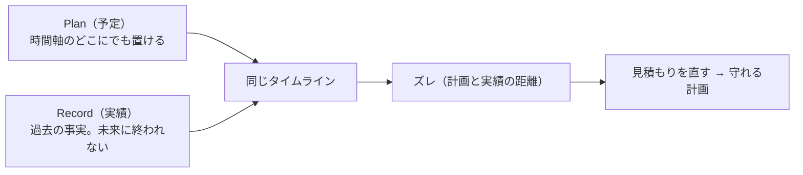

# 0. Dayopt とは・なぜこの設計か

## この章で答えられるようになる問い

- Dayopt は何の問題を解くために、何を**作らない**と決めているか
- なぜ Plan と Record を別のものとして持つのか
- 設計で迷った時、何に戻って判断するか

## 概念

Dayopt のジョブは「**計画を守れるようにする**」こと。手段は、予定（Plan）と実績（Record）を 1 つのタイムラインに重ねて、ズレから学べるようにすること。ズレを見せること自体は売り物ではなく、欲しいのは「立てた計画がその通りに進む日」。

この一文が、以降のほぼすべての設計判断の出発点になる。

## Dayopt ではどうなっているか

**作らないもの（変えないもの）**が設計を強く縛っている。

- **Todo エンジンを作らない**。子の Todo・優先度・期限・ボードは作らない（一度作って捨てた）。だからデータの中心は Todo ではなく**アクティビティ**（`開発` の下の `API` など）
- **AI は外にいる**。アプリの中に AI 機能を持たず、MCP で Claude / ChatGPT から読み書きさせる → [経路: AI クライアントから Plan を作る](journeys/mcp.md)
- **自動生成はゴーストまで、確定は人間のワンタップ**（原則）。Google の予定は実際にこの形で、未確定として薄く現れ、人が押して初めて Plan / Record になる → [経路: Google Calendar 連携](journeys/google-calendar.md) の最後の段。**ただし現行の MCP は原則と違い、Plan / Record を直接作る**（AI の書き込みをゴースト経由にするかは `docs/product/principles.md` の未決事項）→ [経路: MCP](journeys/mcp.md)
- **軽い・早い・少ない**。保存ボタンを置かず、アクティビティを選んだ瞬間に作る → [経路: Plan を保存](journeys/save-plan.md)

**時間の規則は 2 本だけ**。「終了は開始より後」と「Record は未来に終われない」。これ以外で過去・未来の操作を出し分けない（2026-09-04 に特別扱いを撤去した）。強制するのは DB の trigger で、UI の確認はその写しにすぎない → [経路: Record を作る・Plan を記録する](journeys/record-plan.md)

**判断に迷った時の順序**は `AGENTS.md` のシンプルルール 5 箇条が持つ。

| #   | ルール                                         | 使い方                                                |
| --- | ---------------------------------------------- | ----------------------------------------------------- |
| 1   | 個人の 1 日が良くならないなら、作らない        | 機能を足す前の門                                      |
| 2   | 迷ったら、計画と実績の距離を縮める方を選ぶ     | 優先順位                                              |
| 3   | Google Calendar / Toggl より一手少なく         | UI の手数                                             |
| 4   | 不可逆だけ遅く、可逆は速く                     | 作業のテンポ（アカウント削除や migration だけ慎重に） |
| 5   | 2 週間、自分が触らなかった機能は削除候補にする | 止める判断                                            |

## 正本

- [docs/strategy.md](../strategy.md) — 憲法。ジョブ・原則・変えないもの
- [docs/product/principles.md](../product/principles.md) — 原則を画面と操作へ翻訳したもの
- [AGENTS.md](../../AGENTS.md) — シンプルルールと時間の不変条件
- [docs/engineering/invariants.md](../engineering/invariants.md) — 時刻の規則と、その写しの一覧

## 自分で確かめる問い

1. 「過去の Plan はドラッグできない」ようにしたいと言われたら、どの原則とぶつかるか

時間の規則は 2 本だけ、という決定（strategy §4-5、AGENTS.md）。過去の Plan も移動・リサイズ・編集できるのが現行の仕様で、特別扱いは 2026-09-04 に撤去している。入れるなら規則そのものを変える判断になり、DB trigger・service・UI の写しを 1 変更で揃える必要がある。

2. 「AI が自動で Record を作る」機能はどこで止まるべきか

原則は「自動生成はゴーストまで、確定は人間のワンタップ」「記録の確定は人間の儀式」（strategy §4-3, 4-4）。ただし現行の MCP は Plan / Record を直接作れるので、原則どおりにするなら MCP の書き込みをゴースト経由にする変更が要る（principles.md の未決事項）。**原則と現状は別物**として確かめる。

3. Todo 管理の機能（子の Todo）を足す提案が来たら

「Todo エンジンを作らない」（strategy §5-2）で止まる。詳細は他ツールの領土で、Dayopt はリンクで参照する（§4-1）。

