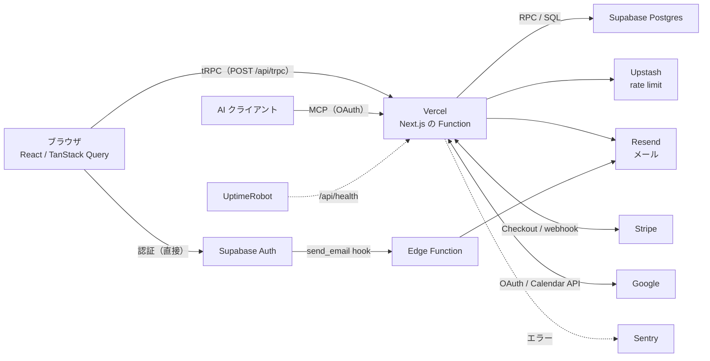

# 1. 全体アーキテクチャ

## この章で答えられるようになる問い

- 利用者の 1 操作が、どのサービスを通るか
- 各サービスが Dayopt の中で何を担っているか
- コードの中で、機能（feature）どうしはどちら向きにだけ依存してよいか

## 概念

Dayopt は「ブラウザ → Vercel 上の Next.js → Supabase（Postgres / Auth）」を背骨に、メール（Resend）・課金（Stripe）・外部カレンダー（Google）・監視（Sentry / UptimeRobot）・レート制限（Upstash）・ボット対策（Turnstile）が枝として付く。

## Dayopt ではどうなっているか

**サービスごとの役割と、止まった時の影響**は [外部サービスと停止マップ](system/services.md) にまとめてある（`pnpm learn` の「サービス停止マップ」タブで、押すと止まる機能が赤く光る）。

**画面の地図**は [画面マップ](system/screens.md)。サインインの前後・アプリ・外部の 3 列で、画面どうしの移り方と条件を持つ。

**コードの中の境界**は 2 つ覚えれば足りる。

1. **依存は一方向**: `features/ → lib/`。feature どうしは barrel（`index.ts`）経由のみで、層は `activities` → `timeblock` / `external-calendar` → `calendar` / `review`。`pnpm lint:boundaries` が機械で止める。実際の import から描いた図は [architecture.md の Feature 間の依存](../engineering/architecture.md) にある
2. **新しい API は tRPC**（Router → Service → Supabase の 3 層、feature の中に置く）。REST は webhook・cron・OAuth・MCP・health など決まった入口だけ

## 関連する経路

- [Plan を保存](journeys/save-plan.md) — 背骨を端から端まで通る基本の経路
- [merge → 本番公開](journeys/deploy.md) — コードがどう本番に届くか

## 正本

- [docs/engineering/architecture.md](../engineering/architecture.md) — データフロー・DB・package 境界
- [docs/engineering/infra.md](../engineering/infra.md) — 環境・デプロイ・出口コスト台帳（どのサービスがどれだけ深く刺さっているか）
- [docs/engineering/conventions.md](../engineering/conventions.md) — feature 配置の判断

## 自分で確かめる問い

1. ログインの通信は tRPC を通るか

通らない。ブラウザから Supabase Auth を直接呼ぶ（`supabase.auth.signInWithPassword`）。tRPC を通るのはログイン後のデータ操作。→ [経路: ログイン](journeys/login.md)

2. 確認メールを送っているのは Vercel か

違う。Supabase Auth の send_email hook が Supabase の Edge Function（`send-auth-email`）を呼び、そこから Resend で送る。アプリの deploy とは別にデプロイされる。→ [経路: サインアップ](journeys/signup.md)

3. `calendar` feature から `review` feature の内部ファイルを直接 import してよいか

よくない。feature 間は barrel 経由のみで、deep import は `pnpm lint:boundaries` が止める。層としても `calendar` と `review` は同じ層で、互いに依存しない。

