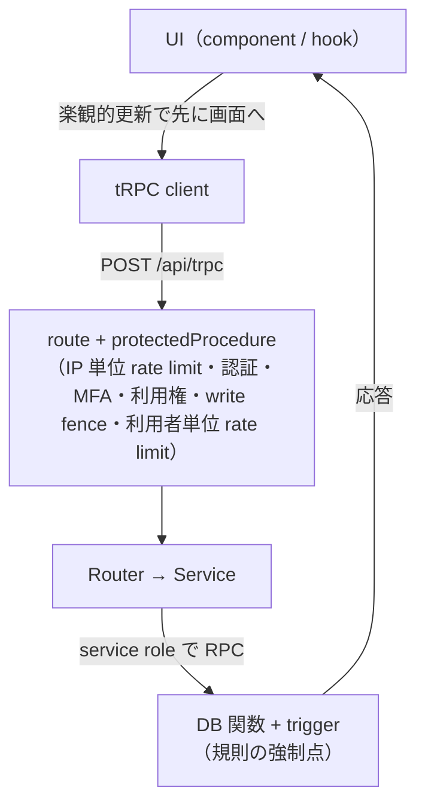

# 2. UI → DB（1 操作を端から端まで）

## この章で答えられるようになる問い

- 「Plan を保存」を押してから DB に行が入るまで、何段を通るか
- 画面に先に出す（楽観的更新）とは何で、失敗したら何が起きるか
- どの段が規則を**強制**していて、どの段は**写し**にすぎないか

## 概念

1 つの書き込み操作は、だいたい次の 5 層を通る。



**楽観的更新**: サーバーの返事を待たずに画面を変え、失敗したら変える前の状態（snapshot）へ戻す。Dayopt の書き込み mutation は原則これを持つ（AGENTS.md の規則。不可逆な操作は除く）。ただし先に描かない例外もある: Plan を記録する時と、削除を取り消す時は snapshot だけ取り、返事を待ってから描く。

**規則の強制点と写し**: 「Record は未来に終われない」を実際に止めるのは DB の trigger（`DT005`）。UI の「未来の枠では記録タブを押せない」はその写しで、往復を減らすための先回り。写しだけを変えても規則は変わらず、DB だけを緩めると「押せるのに保存されない」になる。

## Dayopt ではどうなっているか

[経路: Plan を保存](journeys/save-plan.md) を開いて、`pnpm learn` の ▶ で流してみる。押さえる点は 3 つ。

1. **再試行しない書き込み**: timeblock の mutation は `retry: false`。通信が途中で切れると、画面は元に戻るが、DB では保存済みだったこともある。その場合は一覧の取り直しで Plan が再び現れる。ここで押し直すと、同じ時間帯なら排他制約で弾かれるが、サイドバーからの作成は次の空き時間に置くので、時間をずらした 2 つ目ができる（[lab: 通信を壊す](labs/break-network.md) で実測）
2. **関門の順序**: IP 単位の rate limit（context。cookie がある時だけ）→ 認証 → MFA → 利用権 → write fence（mutation だけ）→ 利用者単位の rate limit。write fence を rate limit より先に見るのは、止めている間の依頼で自分の枠を使い切らないため
3. **書き込みは 1 つの DB 関数**: `create_plan_command_v1` を service role で呼び、user_id は引数で渡す。途中で壊れた状態を残さない

同じ型の経路:

- [Plan / Record を動かす・直す](journeys/edit-timeblock.md) — 他の場所で先に変わっていたら（`DT002`）どうなるか
- [Record を作る・Plan を記録する](journeys/record-plan.md)
- [削除と取り消し](journeys/delete-undo.md) — 取り消しに使う version の罠
- [レポートを開く](journeys/report.md) — 読み取りの経路。集計は SQL ではなく TypeScript

## 手を動かして確かめる

- [Lab: 1 つの依頼を端から端まで追う](labs/trace-request.md)
- [Lab: 通信を壊す](labs/break-network.md) — 届く前に切れた時と、返事だけ失われた時で、結果が逆になる
- [Lab: UI を迂回して規則を破る](labs/break-rules.md)

## 正本

- [docs/engineering/architecture.md](../engineering/architecture.md) の「楽観的更新のフロー」
- [docs/engineering/invariants.md](../engineering/invariants.md) の「時刻」（規則の写しの一覧）

## 自分で確かめる問い

<details>
<summary>1. 保存中に回線が切れた。画面から Plan が消えたが、DB には入っているか</summary>

どちらもありうる。届く前に切れたなら入っていない。DB で確定した後に返事だけ失われたなら入っている。成功・失敗どちらでも一覧を取り直す（`onSettled`）ので、入っていれば Plan は再び現れる。

</details>

<details>
<summary>2. UI の「未来の枠では記録を選べない」を消したら、未来の Record を作れるようになるか</summary>

ならない。DB trigger が `DT005` で拒否し、利用者には「記録は未来へ移動できません」系の文言が出る。規則を変えるなら DB が先。

</details>

<details>
<summary>3. 新しい集計画面を足した。Plan を保存しても数字が変わらない。どこを見るか</summary>

保存後に取り直す対象（`onSettled` の invalidate）に、その画面の query が入っているか。入っていないと古い数字が残る。

</details>

## 参照（検査用）

このページの本文が名指ししているコード。`pnpm docs:check` が、ファイルが在り `find` の文字列を含むことを検査する。本文を書き換えたらここも直す。

```json learn:refs
[
  {
    "path": "apps/product/src/features/timeblock/hooks/useTimeblockWriteMutations.ts",
    "find": "retry: false"
  },
  {
    "path": "apps/product/src/features/timeblock/hooks/useTimeblockWriteMutations.ts",
    "find": "onSettled: invalidate"
  },
  {
    "path": "apps/product/src/lib/trpc/context.ts",
    "find": "isPreAuthRateLimited"
  },
  {
    "path": "apps/product/src/lib/trpc/procedures.ts",
    "find": "isWriteFenceEnabled"
  },
  {
    "path": "apps/product/src/features/timeblock/server/timeblock-command-client.ts",
    "find": "create_plan_command_v1"
  },
  {
    "path": "supabase/migrations/20260708232500_add_time_model_tables.sql",
    "find": "ADD CONSTRAINT plans_no_overlap"
  }
]
```
