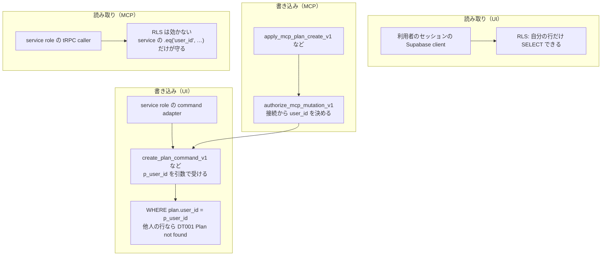

# 3. DB / Auth / RLS（データは誰のものか）

## この章で答えられるようになる問い

- 別のユーザーの Plan が見えない・書けないのは、どこが保証しているか
- 「読み取り」と「書き込み」で守り方が違うのはなぜか
- アプリのコードに穴があっても、最後まで残る境界はどれか

## 概念

**RLS（Row Level Security）**: Postgres が行ごとに「この利用者に見せてよいか」を判定する仕組み。Dayopt の標準形は「自分の行だけ読める（`auth.uid() = user_id`）」+「service role は全部」。

**service role**: RLS を越えて全行に触れる強い鍵。サーバーの中だけで使い、どこで使うかを絞る。

**複合 FK**: 他の行を参照する時、ID だけでなく `(id, user_id)` の組で縛る。ID だけだと「その ID が存在する」しか証明できず、他人の行に紐付けられてしまう。

## Dayopt ではどうなっているか

Plan / Record は**読み取りと書き込みで守り方が違う**。



- **書き込み（UI）**: 利用者のセッションからは `plans` / `records` を直接 INSERT / UPDATE できない（`authenticated` には SELECT だけ許可）。書き込みは必ず型付きの DB 関数を通り、関数の中で `user_id` を照合する。他人の Plan を指定しても `DT001 Plan not found` になり、**存在するかどうかも漏らさない**
- **書き込み（MCP）**: アプリは user_id を渡さず、DB 関数 `authorize_mcp_mutation_v1` が接続（oauth_connections）から決める。最後は UI と同じ command 関数に入る
- **読み取り（UI）**: 利用者のセッションで読むので RLS が効く
- **読み取り（MCP）**: service role で tRPC を呼ぶので RLS が効かない。テナント分離は各 service の `user_id` の絞り込みだけが持つ。だから MCP 用の分離テストが別にある
- **認証そのもの**は Supabase Auth。セッションは cookie で、保護された画面へのリクエストは `proxy.ts` が確かめる → [経路: ログイン](journeys/login.md)

**アプリのコードに穴があっても残る境界**は、DB の GRANT（直接書けない）・command 関数の `user_id` 照合・複合 FK の 3 つ。逆に、MCP の読み取りと service role を使う箇所は、アプリのコードが唯一の守りになる。

## 関連する経路

- [Plan を保存](journeys/save-plan.md) の 8〜9 段（command adapter と DB）
- [AI クライアントから Plan を作る](journeys/mcp.md) — 同じ書き込みの別の入口
- [アカウントを削除する](journeys/account-deletion.md) — 利用者のデータを消し切る側の境界

## 手を動かして確かめる

- [Lab: 別の利用者のデータへ手を伸ばす](labs/break-isolation.md)

## この境界を守るテスト

- `apps/product/src/lib/test/integration/rls-access.integration.test.ts` — 「authenticatedはown Plan / Recordをreadできるが直接writeできない」ほか
- `apps/product/src/lib/test/integration/mcp-read-tenant-isolation.integration.test.ts` — MCP の読み取りが他人の行を返さないこと
- どちらも local Supabase が要る integration test（`pnpm test:integration`）

## 正本

- [docs/engineering/invariants.md](../engineering/invariants.md) の「データ分離（RLS）」「MCP の DB 書き込み境界」
- [docs/engineering/data/db/rls-snapshot.md](../engineering/data/db/rls-snapshot.md) — 生成された RLS の一覧（`pnpm rls:snapshot`）
- `supabase/migrations/20260730090300_revoke_authenticated_timeblock_dml.sql` — 直接書き込みを閉じた migration

## 自分で確かめる問い

<details>
<summary>1. Alice のセッションで Bob の Plan ID を指定して更新を送ったら、何が返るか</summary>

`update_plan_command_v1` の `WHERE plan.user_id = p_user_id` に当たらず `DT001 Plan not found`。更新はアプリが DT001 を `STALE_TARGET`（tRPC の CONFLICT）に訳す。削除済み・版ずれと同じ応答なので、Bob の Plan が存在することは漏れない。

</details>

<details>
<summary>2. 新しい table を足した。RLS を付け忘れると、どの経路が危ないか</summary>

利用者のセッションで読む経路（UI の読み取り）。加えて、そのテーブルに user_id があるなら、アカウント削除・全データ削除で消す対象に入っているかを `user-data-purge-enumeration.integration.test.ts` が検査する（invariants.md のデータ分離の節）。

</details>

<details>
<summary>3. MCP の読み取り service で `.eq('user_id', …)` を消したら何が起きるか</summary>

service role なので RLS は助けてくれず、他人の行を返しうる。`mcp-read-tenant-isolation.integration.test.ts` が落ちるはず。

</details>

## 参照（検査用）

このページの本文が名指ししているコード。`pnpm docs:check` が、ファイルが在り `find` の文字列を含むことを検査する。本文を書き換えたらここも直す。

```json learn:refs
[
  {
    "path": "supabase/migrations/20260730090300_revoke_authenticated_timeblock_dml.sql",
    "find": "GRANT SELECT ON TABLE public.plans TO authenticated;"
  },
  {
    "path": "supabase/migrations/20260708232500_add_time_model_tables.sql",
    "find": "Users can view own plans"
  },
  {
    "path": "supabase/migrations/20260729062435_timeblock_atomic_commands.sql",
    "find": "RAISE EXCEPTION 'Plan not found' USING ERRCODE = 'DT001';"
  },
  {
    "path": "apps/product/src/features/timeblock/server/timeblock-command-client.ts",
    "find": "VERSIONED_TARGET_OPERATIONS.has(operation) ? 'STALE_TARGET' : 'NOT_FOUND'"
  },
  {
    "path": "apps/product/src/lib/trpc/error-code-map.ts",
    "find": "STALE_TARGET: 'CONFLICT'"
  },
  {
    "path": "supabase/migrations/20260908022927_add_mcp_billing_access_switch.sql",
    "find": "authorize_mcp_mutation_v1"
  },
  {
    "path": "docs/engineering/invariants.md",
    "find": "MCP の読み取りは service-role client で tRPC を呼ぶため RLS が効かず"
  },
  {
    "path": "apps/product/src/lib/test/integration/rls-access.integration.test.ts",
    "find": "it('authenticatedはown Plan / Recordをreadできるが直接writeできない'"
  },
  {
    "path": "apps/product/src/lib/test/integration/mcp-read-tenant-isolation.integration.test.ts",
    "find": "it('keeps plans and records in the caller lane for list reads'"
  }
]
```
