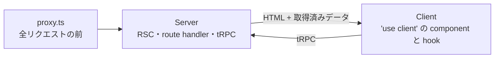

# 4. Server / Client（Next.js のどこで動くか）

## この章で答えられるようになる問い

- あるコードが、ブラウザで動くのか、Vercel の Function で動くのかを見分けられるか
- カレンダーを開いた瞬間に何が server で先に取られるか
- 強い鍵（service role）がブラウザへ漏れないのは何が保証しているか

## 概念

Next.js App Router では、同じ repo のコードが 3 か所で動く。

- **proxy.ts**（Next.js 16 の middleware）: 画面へのリクエストごとにセッションを更新し、未ログイン・MFA 未完了を振り分ける
- **Server**: React Server Components（`page.tsx` など）、`app/api/**/route.ts`、tRPC の procedure
- **Client**: `'use client'` を付けた component と hook。楽観的更新や操作はここ

## Dayopt ではどうなっているか

- **カレンダーは server で先に取る**: `calendar/page.tsx` が `prefetchCalendarData` で Plan・Record・Google の予定・統計を取り、`HydrationBoundary` でブラウザの TanStack Query へ渡す。ブラウザは取り直さずに描ける。`export const dynamic = 'force-dynamic'` なので毎回 server で描く
- **レポートは client で取る**: `/report` は server で先に取らず、ブラウザの hook が tRPC で取る → [経路: レポートを開く](journeys/report.md)
- **書き込みの hook は client**: `useTimeblockWriteMutations.ts` などは `'use client'`
- **route handler は Node.js runtime**: `app/api/trpc/[trpc]/route.ts` などは `export const runtime = 'nodejs'` を明示している
- **強い鍵の封じ込め**: service role の client を作る `lib/supabase/oauth.ts` と、セッションの server client `lib/supabase/server.ts` は先頭で `import 'server-only'` する。client component から import すると build が失敗するので、ブラウザの bundle に入らない。加えて Vercel の build の中で `check-client-bundle-secrets` が client の bundle に secret の値が混ざっていないかを検査する（実 env がある build なので、本物の値の漏れも捕まる）

**判断のしかた**: ファイル先頭の `'use client'`、置き場所（`app/api/**`・`server/`）、`import 'server-only'` の 3 つを見る。

## 関連する経路

- [ログイン](journeys/login.md) の proxy の段
- [merge → 本番公開](journeys/deploy.md) の最後の段（開いているタブが新しい版に気づく）

## 正本

- [docs/engineering/architecture.md](../engineering/architecture.md) の「各レイヤーの役割」「Provider 階層」「キャッシュ戦略」
- [docs/engineering/conventions-frontend.md](../engineering/conventions-frontend.md)
- [docs/engineering/pwa.md](../engineering/pwa.md) — Service Worker とオフライン

## 自分で確かめる問い

1. client component から `createServiceRoleClient` を import したら何が起きるか

`lib/supabase/oauth.ts` が `import 'server-only'` しているので build が失敗する。

2. カレンダーの初回表示が遅い。まずどこを見るか

server 側の `prefetchCalendarData`（Plan・Record・Google の予定・統計を取る）。取るものを増やすと初回表示がそのぶん遅れる。性能の判断は `react-performance` skill の手順に従う。

3. 新しい画面で取るデータを、server で先に取るか client で取るか

最初の表示に必須で、URL から決まるなら server で先に取る（カレンダーの型）。操作して初めて要るもの・重いものは client で遅らせる（レポートの詳細パネルの型）。

