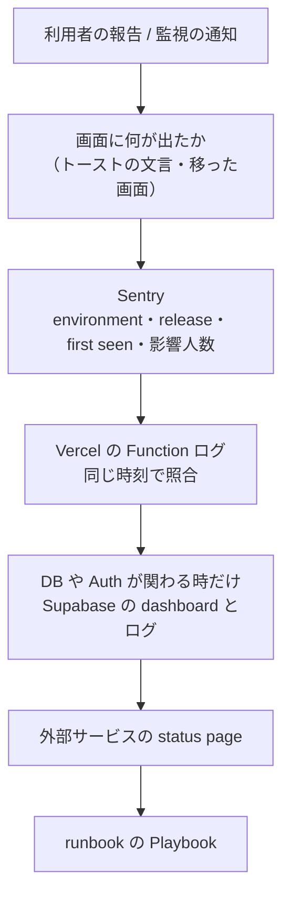

# 7. 障害（壊れた場所を切り分ける）

## この章で答えられるようになる問い

- 「保存できない」と言われた時、どの順で何を見るか
- どの失敗は Sentry に残り、どの失敗は残らないか
- 書き込みだけを止める（write fence）のは、いつ・どう使うか

## 概念

**痕跡の残り方で失敗を分ける。** Dayopt は「想定内の失敗」（規則違反・認証切れ・rate limit・write fence）を Sentry に送らない。送るのは想定外の失敗だけ。だから「Sentry に何も無い」は「何も起きていない」ではない。

## Dayopt ではどうなっているか

- **文言から逆引きする**: 画面の文言は `apps/product/messages/ja/*.json` にある。キーを検索すれば、それを出しているコードに辿れる。各経路の「⚡ 失敗」は、どの文言がどの失敗から出るかを段ごとに持っている
- **想定内として Sentry に送らないもの**: tRPC の BAD_REQUEST / UNAUTHORIZED / FORBIDDEN / NOT_FOUND / CONFLICT / TOO_MANY_REQUESTS など（`lib/trpc/errors.ts` の `EXPECTED_TRPC_CODES`）、write fence による停止、パスワード違いなど想定内の認証エラー
- **Sentry が見えない場所**: `/api/health` の transaction は inbound filter で捨てている。ブラウザの Sentry は分析の同意がある時だけ動く。Sentry 自体は Production 以外では動かない
- **write fence**: 運用で書き込みだけを止めるスイッチ。読み取りは動く。止めている間の失敗は Sentry に送らない（障害の観測中に Sentry を埋めないため）。**MCP の書き込みは write fence で止まらない**（別のスイッチ `mcp_mutation_control`）
- **cron**: 取りこぼした回を埋め直さない。止まったことは完了記録（heartbeat）が古くなることで気づく

## 関連する経路

どの経路でも「⚡ ここで失敗させる」を押すと、画面・データ・再試行・痕跡・最初に見る場所が出る。特に:

- [Plan を保存](journeys/save-plan.md) — 通信断・Supabase 停止・write fence・想定外の DB エラー
- [サインアップ → ウェルカムメール](journeys/signup.md) — 黙って欠落する失敗（利用者は気づかない）
- [merge → 本番公開](journeys/deploy.md) — 本番に届かない失敗

## 手を動かして確かめる

- [Lab: 通信を壊す](labs/break-network.md) — 同じトーストでも、DB に入っている場合と入っていない場合がある

## 正本

- [docs/operations/runbook.md](../operations/runbook.md) — 共通初動、write fence、Playbook 1〜5
- [docs/operations/monitoring.md](../operations/monitoring.md) — 監視面、Incident triage、Alert policy
- [docs/engineering/diagnostics.md](../engineering/diagnostics.md) — 不可解な失敗の切り分け手順（誤診断を防ぐ）
- `diagnosing-bugs` skill — 原因不明の不具合の再現と切り分け

## 自分で確かめる問い

1. 「保存できませんでした」が複数の人から来た。Sentry には何も無い。次に何を見るか

想定内の失敗の可能性を先に潰す: write fence が ON ではないか、rate limit ではないか（どちらも Sentry に出ない）。次に Vercel の Function ログを同じ時刻で見る。ブラウザ側の通信失敗なら同意の無い利用者の分は Sentry に出ない。

2. UptimeRobot が DOWN を通知した。アプリは本当に止まっているか

`/api/health` は DB と Redis を確かめて 503 を返す。Upstash だけが落ちていても DOWN になるが、保存は通っている。どの依存が error かを health の応答で見る。

3. 本番の書き込みを一時的に止めたい。何を使い、何は止まらないか

write fence（runbook の「Write Fence 有効化」）。tRPC の mutation と cron・callback の書き込みが止まる。読み取りと、MCP の書き込み gate（別スイッチ）は対象外。

