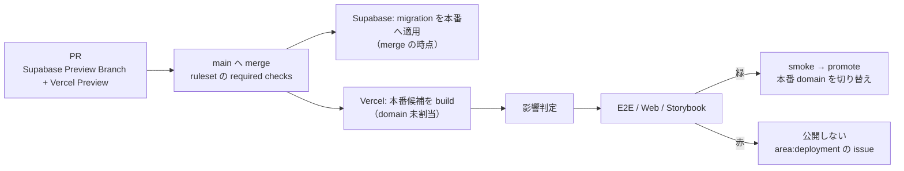

# 9. デプロイ（commit から本番まで）

## この章で答えられるようになる問い

- merge したコードが本番の利用者に届くまで、何が起きるか
- merge したのに本番が変わらない時、どこを見るか
- Preview と Production は何が違うか

## 概念

Dayopt は **merge と本番公開を分けている**。main への merge は本番候補を作るだけで、本番 domain を切り替えるのは Production Release workflow（`promote.yml`）だけ。

**migration は先に入る**。merge の時点で本番 DB に適用され、コードの公開は E2E の後。その間は「新しい DB + 古いコード」が動くので、migration は古いコードでも壊れない形で書く。

## Dayopt ではどうなっているか

[経路: merge → 本番公開](journeys/deploy.md) を ▶ で流し、各段の失敗を見る。

**Preview と Production の違い**:

| 項目                          | Preview（PR ごと）                                        | Production                           |
| ----------------------------- | --------------------------------------------------------- | ------------------------------------ |
| DB                            | PR ごとの Supabase Preview Branch（本番 DB を参照しない） | 本番 Supabase                        |
| Sentry                        | 動かない（`IS_SENTRY_PRODUCTION` が偽）                   | 動く                                 |
| Resend・Stripe・Google の env | 揃っていなくてよい                                        | 組で揃っていることを `env.ts` が要求 |
| 公開                          | Preview の URL                                            | promote が domain を切り替えた時だけ |

**開いているタブ**は、戻った時に `/api/health/version` で版を比べ、編集中でない瞬間に黙って再読み込みする。通知は出ない。API の入力を必須にする変更は、古いタブからの呼び出しを壊す。

## 正本

- [docs/engineering/infra.md](../engineering/infra.md) の「デプロイフロー」「merge と Production 公開の分離」「merge gate の required checks」
- [docs/operations/runbook.md](../operations/runbook.md) の「Playbook 2: Vercelデプロイ失敗（P1）」
- `.github/workflows/promote.yml`
- `releasing` skill — リリース作業（明示依頼時のみ）

## 自分で確かめる問い

1. merge して 30 分経っても本番が変わらない。最初に何を見るか

`area:deployment` の issue と、Actions の Production Release の run。E2E が赤なら promote されていない。docs だけの merge でも build は作られ、影響判定で project ごとに要否が決まる。

2. 列を削除する migration を入れたい。何が危ないか

migration は merge の時点で本番に入り、古いコードが E2E 完走まで動き続ける。古いコードがその列を読んでいれば壊れる。先に読まないコードを出し、次の変更で列を消す。

3. Preview では確認メールが届いた。本番でも届くか

Preview と本番は別の Supabase・別の env。本番の Resend の設定（`RESEND_*`、送信元ドメイン）と Supabase の Auth hook を見る必要がある。Preview での成功は本番の証明にならない。

