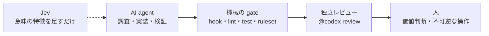

# 11. Jev / Agent（AI が何を見て、どう判断しているか）

## この章で答えられるようになる問い

- Dayopt の開発で AI（Claude Code / Codex / Jev）はどこまで任されていて、どこで止まるか
- AI の判断が間違っても、何が最後の砦になっているか
- AI の作業を人が検証する時、何を見ればよいか

## 概念

Dayopt は 1 人で開発し、実装の多くを AI が行う。だから「AI に何を任せ、何を**機械**（決定的なコード）に持たせ、何を**人**が決めるか」の線引きが設計の一部になっている。



## Dayopt ではどうなっているか

**AI への指示の正本**は `AGENTS.md`（provider を問わず共通）。作業の手順は `.agents/skills/*/SKILL.md`。判断のテンポは 3 段階: 可逆なら承認なしで進める、顧客挙動・公開契約・権限に関わるなら止まって問う、不可逆（本番の変更・データ削除・課金・リリース）は明示の指示・独立レビュー・dry-run か backup が揃うまで実行しない。

**機械の gate**（AI が間違えても止まる場所）:

- `scripts/hooks/pre-tool-guard.sh` — Claude Code のツール実行の前に危険なコマンドを止める（Codex は `codex-pre-tool-guard.sh` が同じ規則で止める）
- `.husky/pre-push` — push の前の確認（DO-CONFIRM）と、影響範囲の typecheck / lint
- main の repository ruleset — required checks と review thread の解決が揃わないと merge できない。bypass できる人はいない
- `scripts/ci/protected-path-gate.mjs` — 外部契約・不可逆の path に触った変更を、レビューで重点的に読む範囲として示す（`pnpm branch:finish` が merge の直前に表示する）。merge は止めない
- `pnpm branch:finish` — merge と後片付けの入口。監査の契約（`auditContract`）に触れた PR でも、Production Config Audit の「この head に監査結果が無い」は参考扱いにして失敗数から外す。止めるのは Vercel の env が契約と実際に食い違った時（drift）と、結果を判定できない時だけ。ただし契約を変えた PR では drift も「監査結果なし」に隠れるので、drift の検出は main への push・夜間・promote の監査が担う
- `pnpm docs:check` — この教材の参照切れもここで止まる

**Jev** は Vercel AI Gateway 経由の小さな評価モデル。**最終意思決定者ではない**。権限・必須レビュー・test の結果・path の policy は決定的なコードが持ち、Jev は非構造の文章から意味の特徴を足すだけ。予算と停止条件（残高が下限を下回ると送らない、`JEV_DISABLED=1` で止まる）が先に決めてある。

**AI の仕事を検証する時に見るもの**: diff、検証コマンドとその出力、実際の画面や API の動き。「passed」という申告だけで完了にしない（AGENTS.md の委任・報告の作法）。

## 正本

- [AI まわりの仕組みの地図](system/agents.md) — 指示書・skill 24 個・guard / hook・memory の置き場所と効くタイミング
- [AGENTS.md](../../AGENTS.md) — レビュー規則、シンプルルール、Non-Negotiables、委任・報告の作法
- [docs/operations/jev.md](../operations/jev.md) — Jev の境界・予算・pack
- [docs/engineering/infra.md](../engineering/infra.md) の「merge gate の required checks」
- `routing` skill / `audit-ai-config` skill

## 自分で確かめる問い

<details>
<summary>1. AI が「テストは通りました」と報告した。何を確かめるか</summary>

実行したコマンドと出力の要点。skip された test が緑に見えていないか、変更前から通るテストではないか（TEST-1。[6 章](06-testing.md)）。

</details>

<details>
<summary>2. Jev が「この PR は低リスク」と判定した。レビューを省いてよいか</summary>

よくない。Jev の判定で既存の権限・必須レビュー・security の下限を下げない（jev.md の境界）。

</details>

<details>
<summary>3. AI に本番の DB を直接直させたい</summary>

不可逆な操作なので EXPLICIT AUTHORITY の段。明示の指示・独立レビュー・dry-run か backup が揃うまで実行しない。揃わなければ実行せずに報告させる。

</details>

## 参照（検査用）

このページの本文が名指ししているコード。`pnpm docs:check` が、ファイルが在り `find` の文字列を含むことを検査する。本文を書き換えたらここも直す。

```json learn:refs
[
  {
    "path": "scripts/tasks/finish-branch.sh",
    "find": "# ── audit contract guard も advisory として扱う"
  },
  {
    "path": "docs/operations/jev.md",
    "find": "**Jev は最終意思決定者ではない。**"
  },
  {
    "path": "scripts/tasks/finish-branch.sh",
    "find": "merge は止めません。手で確認したい場合のみ"
  },
  {
    "path": "scripts/tasks/finish-branch.sh",
    "find": "**境界（この checkpoint が担保しないこと）**"
  },
  {
    "path": ".husky/pre-push",
    "find": "pause point"
  },
  {
    "path": "scripts/hooks/pre-tool-guard.sh",
    "find": "pre-tool-guard.mjs"
  }
]
```
