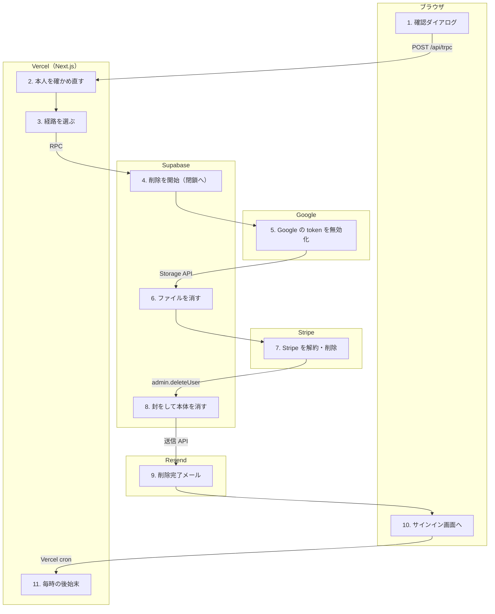

# アカウントを削除する（不可逆）

<!-- learn:generated:start — 正本 このファイルの learn:journey の JSON / 再生成 pnpm learn:generate / 検証 pnpm docs:check。この範囲は手編集しない -->

設定からアカウントを削除する。DB の行は auth.users の削除で CASCADE して一度に消えるが、Google の token・Storage のファイル・Stripe の顧客は DB の外にあり、トランザクションで一緒に巻き戻せない。そこで外側の後始末を Calendar → Storage → Billing の段に分け、段ごとに「済み」の受領を DB に残してから、最後に auth.users を消す。途中で落ちても、もう一度押せば済んだ段を飛ばして続きから進む。取り消しの道は無い。



通るサービス: ブラウザ / Vercel（Next.js） / Stripe / Google / Supabase / Resend。段 11・失敗 13 種。

#### この経路を守るテスト

- 経路全体を通しで守るテストは紐付いていない（段ごとのテストを見る）

### 1. 確認ダイアログで DELETE と再認証を入れる（ブラウザ）

設定のアカウントから確認ダイアログを開き、「DELETE」を正確に入れる。パスワードを持つ人はパスワード、Google だけで登録して MFA が有効な人は認証アプリのコードを入れる。user.deleteAccount の mutation を 1 回だけ送る（retry: false）。楽観的更新はしない。

- **なぜ必要か**: 不可逆なので、押し間違いでは届かない手数（確認テキスト + 本人確認）を足している。自動の再試行は、rate limit で詰まっている最中にもう 1 発撃って共有の枠を二重に使い、不可逆な依頼を重ねて送ることになるので切っている。
- **入力 → 出力**: confirmText = DELETE、password または totpCode → POST /api/trpc の user.deleteAccount
- **ここを変えると**: どの再認証手段を出すかは画面の推定（hasPasswordIdentity）。実際に何を求めるかはサーバーが user の identity から決め直すので、画面だけ変えても再認証は緩まない。
- **コード**:
  - [`apps/product/src/features/settings/components/AccountDeletionDialog.tsx`](../../../apps/product/src/features/settings/components/AccountDeletionDialog.tsx) で `const deleteAccountMutation = api.user.deleteAccount.useMutation({` を探す
  - [`apps/product/src/features/settings/components/AccountDeletionDialog.tsx`](../../../apps/product/src/features/settings/components/AccountDeletionDialog.tsx) で `if (confirmText !== 'DELETE') {` を探す
- **この段を守るテスト**:
  - [`apps/product/src/features/settings/components/AccountDeletionDialog.retry.test.tsx`](../../../apps/product/src/features/settings/components/AccountDeletionDialog.retry.test.tsx) で `自動リトライしない（共有レート制限の二重消費と不可逆操作の再送を防ぐ）` を探す

<details>
<summary>⚡ Google だけの人に MFA のコードが要る — 画面: エラー表示 / データ: 変化なし / 再試行: 利用者がやり直す / 痕跡: ログだけ</summary>

- 画面: 「認証アプリのコードを入力してください。」のトーストが出て、コードの入力欄が現れる。
- データ: 変化なし。
- 再試行: しない。利用者がコードを入れて押し直す。
- 痕跡: logger.error だけ。
- **最初に見る場所**: 不要（session に MFA の情報が載っていない時の仕様どおりの挙動）。
- 根拠:
  - [`apps/product/src/features/settings/components/AccountDeletionDialog.tsx`](../../../apps/product/src/features/settings/components/AccountDeletionDialog.tsx) で `if (error.message.includes('Verification code is required')) {` を探す

</details>

### 2. サーバーで本人を確かめ直す（Vercel（Next.js））

user.deleteAccount（protectedProcedure）が getUser で本人を引き、パスワードの identity を持つかをサーバー側で決める。パスワードなら、専用の rate limit を通してから service role で signInWithPassword を呼んで照合する。Google だけの人は MFA があれば TOTP を検証し、無ければ確認テキストだけで通す。

- **なぜ必要か**: 公開 Auth endpoint を利用者の session で叩くと、Bot Protection の captcha を要求されて必ず失敗する（#1917 と同じ故障）。削除には GoTrue 側の current_password に当たる仕組みが無いので、service role 経由で captcha を免除して照合する。免除の代わりに rate limit を用途ごとに持つ。
- **入力 → 出力**: session の userId・email、password / totpCode → verified / invalid_password / unavailable
- **ここを変えると**: captcha を免除している経路なので、呼び出し元を増やす前に password-reauthentication.ts の契約と docs/product/specs/auth.md の保証境界を読む。検証用の session は scope: 'local' で消す（既定の global だと全端末がログアウトする）。
- **コード**:
  - [`apps/product/src/features/auth/server/router.ts`](../../../apps/product/src/features/auth/server/router.ts) で `requiresPassword: hasPasswordIdentity(user),` を探す
  - [`apps/product/src/features/auth/server/user-service.ts`](../../../apps/product/src/features/auth/server/user-service.ts) で `await enforceReauthRateLimit(userId, 'account_deletion');` を探す
  - [`apps/product/src/features/auth/server/password-reauthentication.ts`](../../../apps/product/src/features/auth/server/password-reauthentication.ts) で `export async function verifyPasswordWithCaptchaBypass({` を探す
- **この段を守るテスト**:
  - [`apps/product/src/features/auth/server/user-service.test.ts`](../../../apps/product/src/features/auth/server/user-service.test.ts) で `verifyPasswordWithCaptchaBypassの直前にaccount_deletion contextでrate limitを強制する` を探す
  - [`apps/product/src/features/auth/server/user-service.test.ts`](../../../apps/product/src/features/auth/server/user-service.test.ts) で `再認証手段が使えなければREAUTH_UNAVAILABLEを投げて削除しない` を探す

<details>
<summary>⚡ パスワードが違う — 画面: エラー表示 / データ: 変化なし / 再試行: 利用者がやり直す / 痕跡: ログだけ</summary>

- 画面: 「パスワードが正しくありません」のトースト。
- データ: 変化なし。何も始まっていない。
- 再試行: しない。利用者が入れ直す。rate limit の枠は消費する。
- 痕跡: logger.error だけ。
- **最初に見る場所**: 不要。
- 根拠:
  - [`apps/product/src/features/auth/server/user-service.ts`](../../../apps/product/src/features/auth/server/user-service.ts) で `throw new UserServiceError('INVALID_PASSWORD', 'Invalid password');` を探す

</details>

<details>
<summary>⚡ 照合の手段そのものが使えない（captcha 免除の故障・rate limit・Upstash 障害） — 画面: エラー表示 / データ: 変化なし / 再試行: 利用者がやり直す / 痕跡: Sentry</summary>

- 画面: 「アカウントを削除できませんでした。繰り返す場合は support@dayopt.app にご連絡ください。こちらで削除します」のトースト。
- データ: 変化なし。削除は通さない（fail closed）。
- 再試行: しない。時間をおいて利用者が押し直す。
- 痕跡: 構成の故障（captcha_failed など）なら Sentry（account_deletion_reauthenticate）。rate limit は想定内として鳴らさない。
- **最初に見る場所**: Sentry → SUPABASE_SECRET_KEY が gateway で service role として扱われているか。
- 根拠:
  - [`apps/product/src/features/auth/server/password-reauthentication.ts`](../../../apps/product/src/features/auth/server/password-reauthentication.ts) で `source: 'captcha_bypass',` を探す
  - [`apps/product/src/features/auth/server/user-service.ts`](../../../apps/product/src/features/auth/server/user-service.ts) で `throw new UserServiceError('REAUTH_UNAVAILABLE', 'Reauthentication unavailable');` を探す

</details>

### 3. gate の状態で、段つきの経路か旧経路かを選ぶ（Vercel（Next.js））

削除の後で使う locale を先に引いておき（user_settings も CASCADE で消えるため）、DB の gate を読む。gate が有効なら段つきの経路（coordinator）、無効で処理中の削除も無ければ旧経路（avatars の削除と Stripe の解約・顧客削除を順に呼ぶだけ）へ進む。読めない・食い違う時はどちらにも進まず止める。

- **なぜ必要か**: 段つきの経路は DB 側の新しい関数と trigger が揃って初めて安全に動く。古い app と新しい DB が混ざる間も壊れないよう、切り替えは DB の gate を 1 か所で持つ。旧経路は受領を残さないので、途中で落ちると何が済んだかを DB から辿れない。
- **入力 → 出力**: userId → completed / contention、または例外
- **ここを変えると**: gate を有効にする migration は repo に無く、運用で切り替える前提。production で今どちらの経路が動いているかは未確認。旧経路は「古い instance が捌け切ったら消す」一時的な分岐。
- **コード**:
  - [`apps/product/src/app/api/trpc/_server/_composition/account-deletion-selector.ts`](../../../apps/product/src/app/api/trpc/_server/_composition/account-deletion-selector.ts) で `export async function prepareAccountDeletionWithCompatibility(input: {` を探す
  - [`apps/product/src/features/auth/server/user-service.ts`](../../../apps/product/src/features/auth/server/user-service.ts) で `emailLocale = await getUserLocale(supabase, userId);` を探す
  - [`supabase/migrations/20260730090023_account_deletion_gate_foundation.sql`](../../../supabase/migrations/20260730090023_account_deletion_gate_foundation.sql) で `CREATE TABLE private.account_deletion_control (` を探す
- **この段を守るテスト**:
  - [`apps/product/src/app/api/trpc/_server/_composition/account-deletion-selector.test.ts`](../../../apps/product/src/app/api/trpc/_server/_composition/account-deletion-selector.test.ts) で `gateがactiveならdurable coordinatorだけを使う` を探す
  - [`apps/product/src/app/api/trpc/_server/_composition/account-deletion-selector.test.ts`](../../../apps/product/src/app/api/trpc/_server/_composition/account-deletion-selector.test.ts) で `未知のreadiness failureを現行経路へ落とさない` を探す

<details>
<summary>⚡ gate の状態が読めない・食い違う — 画面: エラー表示 / データ: 変化なし / 再試行: 利用者がやり直す / 痕跡: Sentry</summary>

- 画面: 「アカウントを削除できませんでした。…こちらで削除します」のトースト。
- データ: 変化なし。どちらの経路にも入らない。
- 再試行: しない。利用者が押し直す。
- 痕跡: Sentry（account_deletion / prepare_identity_deletion）。
- **最初に見る場所**: Supabase の Postgres ログで get_account_deletion_readiness_v1。
- 根拠:
  - [`apps/product/src/features/auth/server/user-service.ts`](../../../apps/product/src/features/auth/server/user-service.ts) で `operation: 'prepare_identity_deletion',` を探す

</details>

### 4. 削除を始める（または前回の続きを取り出す）（Supabase）

begin_account_deletion_v1 が、この人の削除を 1 件だけ作る。すでにあればそれを返す。同時に Calendar と Stripe の対象を snapshot し、3 つの段（calendar / storage / billing）の状態を返す。続けて bind_billing で、進行中の Checkout などの課金操作が収まるのを待ってから Stripe の顧客を固定し、開いている Checkout を止める。

- **なぜ必要か**: ここからアカウントは「閉鎖中」になり、新しい Calendar 接続・課金・Storage への書き込みは DB が拒む。後始末の途中で新しいファイルや顧客が生まれると、消し漏れが出るから。この状態に期限は無く、取り消す手段も無い。
- **入力 → 出力**: userId → deletion_id と 3 段の状態（pending / in_progress / completed）
- **ここを変えると**: DB の RPC は失敗 code が 40P01 / 55P03 / 57014（deadlock・lock 待ち・timeout）なら 3 回まで呼び直す。それでも取れなければ contention として利用者に押し直してもらう。
- **コード**:
  - [`apps/product/src/app/api/trpc/_server/_composition/account-deletion-coordinator.ts`](../../../apps/product/src/app/api/trpc/_server/_composition/account-deletion-coordinator.ts) で `const BEGIN_RPC = 'begin_account_deletion_v1' as const;` を探す
  - [`supabase/migrations/20260730090024_account_deletion_gate_commands.sql`](../../../supabase/migrations/20260730090024_account_deletion_gate_commands.sql) で `'Begins or resumes one non-expiring generic account deletion and atomically snapshots Calendar and Stripe targets; service role only.';` を探す
  - [`supabase/migrations/20260730090031_bind_billing_account_deletion.sql`](../../../supabase/migrations/20260730090031_bind_billing_account_deletion.sql) で `'Binds the exact current Stripe Customer to one generic account deletion after all in-flight billing mutations settle.';` を探す
- **この段を守るテスト**:
  - [`apps/product/src/app/api/trpc/_server/_composition/account-deletion-coordinator.test.ts`](../../../apps/product/src/app/api/trpc/_server/_composition/account-deletion-coordinator.test.ts) で `live billing mutationとのAD019競合をretryable resultへ変換する` を探す
  - [`apps/product/src/lib/test/integration/account-deletion-gate.integration.test.ts`](../../../apps/product/src/lib/test/integration/account-deletion-gate.integration.test.ts) で `blocks new Calendar, billing, and Storage writes once closing starts` を探す

<details>
<summary>⚡ 課金の操作や別の削除とぶつかる（contention） — 画面: エラー表示 / データ: DB だけ新しい / 再試行: 利用者がやり直す / 痕跡: ログだけ</summary>

- 画面: 「アカウントを削除できませんでした。…」のトースト。
- データ: 閉鎖中の印が付いたまま残りうる。済んだ段はそのまま。
- 再試行: 自動ではしない。利用者が押し直すと、同じ削除の続きから進む。
- 痕跡: logger だけ（CONFLICT は想定内）。
- **最初に見る場所**: 直前に Checkout や Portal を開いていないか。
- 根拠:
  - [`apps/product/src/features/auth/server/user-service.ts`](../../../apps/product/src/features/auth/server/user-service.ts) で `throw new UserServiceError('CONFLICT', 'Account deletion is busy. Try again.');` を探す

</details>

### 5. 段 1: Calendar — Google の token を無効化する（Google）

claim で 5 分の lease を取り、この段の担当を 1 人に絞る。接続中の token と、以前の切断で無効化を待っている token（revoke outbox）を 1 件ずつ取り出し、DB に「呼ぶ」印を付けてから Google の revoke を 1 回だけ呼ぶ。結果（確認できた / できなかった）を記録し、全件そろったら Calendar の受領を閉じて段を完了にする。

- **なぜ必要か**: Google への呼び出しは DB と一緒に巻き戻せない。先に印を付けておくことで、落ちて再開した時に「呼んだかもしれない」ものを 2 回呼ばない。lease は、処理中に落ちた担当が永遠に段を握ったままにならないため。
- **入力 → 出力**: deletion_id、Calendar の snapshot → token ごとの受領（revoked / expired / not_attempted / unconfirmed など）と段の完了
- **ここを変えると**: Google Calendar を繋いでいない人は、この段は空で完了する。token の復号に失敗した時は Google を呼ばず not_attempted として記録する（Google 側では token の期限切れを待つことになる）。
- **コード**:
  - [`apps/product/src/app/api/trpc/_server/_composition/account-deletion-coordinator.ts`](../../../apps/product/src/app/api/trpc/_server/_composition/account-deletion-coordinator.ts) で `const CLAIM_STEP_RPC = 'claim_account_deletion_step_v1' as const;` を探す
  - [`apps/product/src/features/external-calendar/server/account-deletion.ts`](../../../apps/product/src/features/external-calendar/server/account-deletion.ts) で `if (await runtime.provider.revoke(refreshToken)) outcome = 'confirmed';` を探す
  - [`supabase/migrations/20260730090024_account_deletion_gate_commands.sql`](../../../supabase/migrations/20260730090024_account_deletion_gate_commands.sql) で `lease_expires_at = v_now + INTERVAL '5 minutes',` を探す
- **この段を守るテスト**:
  - [`apps/product/src/features/external-calendar/server/account-deletion.test.ts`](../../../apps/product/src/features/external-calendar/server/account-deletion.test.ts) で `DB start marker後だけproviderを1回呼びcanonical operationをfinalizeする` を探す
  - [`apps/product/src/features/external-calendar/server/account-deletion.test.ts`](../../../apps/product/src/features/external-calendar/server/account-deletion.test.ts) で `start response loss後のalready_startedではproviderを再実行しない` を探す
  - [`apps/product/src/app/api/trpc/_server/_composition/account-deletion-coordinator.test.ts`](../../../apps/product/src/app/api/trpc/_server/_composition/account-deletion-coordinator.test.ts) で `外部処理後にleaseが失効したら再claimしてterminal stateを再確認する` を探す

<details>
<summary>⚡ Google の revoke が失敗する・結果が分からない — 画面: 何も起きない / データ: 保存される / 再試行: しない / 痕跡: Sentry</summary>

- 画面: 何も起きない。削除は続く。
- データ: unconfirmed として記録して進む。Google 側で token がまだ生きている可能性は残る。
- 再試行: しない。token の暗号文は呼ぶ時点で DB から消費済みなので、呼び直す材料が無い。
- 痕跡: Sentry（Calendar account deletion provider outcome is unknown）。
- **最初に見る場所**: Sentry → Google の status。
- 根拠:
  - [`apps/product/src/features/external-calendar/server/account-deletion.ts`](../../../apps/product/src/features/external-calendar/server/account-deletion.ts) で `'Calendar account deletion provider outcome is unknown'` を探す

</details>

<details>
<summary>⚡ Google を呼んだ直後に Function が落ちる — 画面: エラー表示 / データ: DB だけ新しい / 再試行: 次の機会に / 痕跡: ログだけ</summary>

- 画面: 「アカウントを削除できませんでした。…」のトースト（応答が返らなければ通信エラー）。
- データ: 段は途中。「呼んだ」印だけが残り、結果は記録されていない。
- 再試行: 利用者が押し直しても、印のある token は in_flight として Google を呼び直さず止まる。期限を過ぎた intent は毎時の settle cron が確定させ（呼んだ分は unconfirmed）、その後の押し直しで先へ進める。cron が in_flight のまま数えて残す場合の条件は未確認。
- 痕跡: Vercel の Function ログ。cron の実行記録（heartbeat）。
- **最初に見る場所**: calendar-account-deletion-settle の実行結果（normalized / inFlight の件数）。
- 根拠:
  - [`apps/product/src/features/external-calendar/server/account-deletion.ts`](../../../apps/product/src/features/external-calendar/server/account-deletion.ts) で `if (startResult === 'already_started') throw deletionFailure('start_in_flight');` を探す

</details>

### 6. 段 2: Storage — アバターなどのファイルを消す（Supabase）

avatars と attachments の 2 つの bucket で、userId 配下を再帰的に列挙し、100 件ずつ消す。消したあと列挙し直して空であることを確かめ、段を完了にする。

- **なぜ必要か**: Storage のファイルは auth.users の CASCADE では消えない。列挙の応答が null の時に「空」と見なすと消し漏れを完了と記録してしまうので、失敗として止める。
- **入力 → 出力**: userId → 空になった 2 bucket と段の完了
- **ここを変えると**: 段の順番は DB が強制する（Calendar が済むまで Storage の claim は通らない）。bucket を増やしたら STORAGE_BUCKETS に足す。最後の auth.users 削除の trigger も bucket に残りが無いかを独立に確かめる。
- **コード**:
  - [`apps/product/src/app/api/trpc/_server/_composition/account-deletion-coordinator.ts`](../../../apps/product/src/app/api/trpc/_server/_composition/account-deletion-coordinator.ts) で `const STORAGE_BUCKETS = ['avatars', 'attachments'] as const;` を探す
  - [`apps/product/src/app/api/trpc/_server/_composition/account-deletion-coordinator.ts`](../../../apps/product/src/app/api/trpc/_server/_composition/account-deletion-coordinator.ts) で `if (remaining.length > 0) throw coordinatorFailure('storage_verification');` を探す
  - [`supabase/migrations/20260730090027_fence_account_storage.sql`](../../../supabase/migrations/20260730090027_fence_account_storage.sql) で `-- verify that neither account-owned bucket retains metadata.` を探す
- **この段を守るテスト**:
  - [`apps/product/src/app/api/trpc/_server/_composition/account-deletion-coordinator.test.ts`](../../../apps/product/src/app/api/trpc/_server/_composition/account-deletion-coordinator.test.ts) で `avatarsとattachmentsを再帰列挙し100件単位で削除後に空を確認する` を探す
  - [`apps/product/src/app/api/trpc/_server/_composition/account-deletion-coordinator.test.ts`](../../../apps/product/src/app/api/trpc/_server/_composition/account-deletion-coordinator.test.ts) で `Storage listのnull responseを空扱いせずfail closedにする` を探す

<details>
<summary>⚡ Storage の列挙・削除が失敗する — 画面: エラー表示 / データ: DB だけ新しい / 再試行: 利用者がやり直す / 痕跡: Sentry</summary>

- 画面: 「アカウントを削除できませんでした。…」のトースト。
- データ: Calendar の段は完了のまま、Storage は途中。一部のファイルだけ消えていることがある。
- 再試行: 利用者が押し直すと、Calendar を飛ばして Storage からやり直す（消すのは何度やっても同じ結果）。
- 痕跡: Sentry（prepare_identity_deletion）。
- **最初に見る場所**: Supabase の Storage ログ。
- 根拠:
  - [`apps/product/src/app/api/trpc/_server/_composition/account-deletion-coordinator.ts`](../../../apps/product/src/app/api/trpc/_server/_composition/account-deletion-coordinator.ts) で `if (error) throw coordinatorFailure('storage_remove', error);` を探す

</details>

### 7. 段 3: Billing — Stripe の契約を止め、顧客を消す（Stripe）

まず Stripe の account ID と本番 / テストの別が env と一致するかを確かめる。固定した顧客を取り出して metadata の userId と照合し、開いている Checkout を失効させ、active / trialing / past_due などのサブスクリプションを即時解約し、顧客を削除する。削除できたことを取り直して確かめ、結果（deleted / not_present）を DB に封じてから段を完了にする。

- **なぜ必要か**: Stripe への操作はすべて userId と対象 ID から作った idempotency key を付ける。途中で落ちて押し直しても、同じ解約・削除が 2 回走らない。顧客の照合は、別アカウントや別モードの顧客を誤って消さないため。
- **入力 → 出力**: 固定した stripe_customer_id → providerOutcome（deleted / not_present）の受領と段の完了
- **ここを変えると**: 解約すると Stripe から customer.subscription.deleted の webhook が別に届く。それが削除より先に処理されて解約確認メールが出るかどうかは、到着の順番次第で未確認。返金の扱いはこのコードには無い。
- **コード**:
  - [`apps/product/src/features/settings/server/account-deletion.ts`](../../../apps/product/src/features/settings/server/account-deletion.ts) で `const CANCELLABLE_SUBSCRIPTION_STATUSES = new Set([` を探す
  - [`apps/product/src/features/settings/server/account-deletion.ts`](../../../apps/product/src/features/settings/server/account-deletion.ts) で `idempotencyKey: idempotencyKey(input.userId, 'customer', customerId),` を探す
  - [`apps/product/src/app/api/trpc/_server/_composition/account-deletion-coordinator.ts`](../../../apps/product/src/app/api/trpc/_server/_composition/account-deletion-coordinator.ts) で `const SEAL_BILLING_RPC = 'seal_billing_account_deletion_v1' as const;` を探す
- **この段を守るテスト**:
  - [`apps/product/src/features/settings/server/account-deletion.test.ts`](../../../apps/product/src/features/settings/server/account-deletion.test.ts) で `全pageのopen Checkoutとcancellable subscriptionを閉じてCustomerを検証する` を探す
  - [`apps/product/src/features/settings/server/account-deletion.test.ts`](../../../apps/product/src/features/settings/server/account-deletion.test.ts) で `Customer deleteの応答消失後にDeletedCustomerを確認して完了する` を探す
  - [`apps/product/src/app/api/trpc/_server/_composition/account-deletion-coordinator.test.ts`](../../../apps/product/src/app/api/trpc/_server/_composition/account-deletion-coordinator.test.ts) で `Stripe identity照合に失敗したらCalendar、Storage、Billing receiptへ進まない` を探す

<details>
<summary>⚡ Stripe が応答しない・エラーを返す — 画面: エラー表示 / データ: DB だけ新しい / 再試行: 利用者がやり直す / 痕跡: Sentry</summary>

- 画面: 「アカウントを削除できませんでした。…」のトースト。
- データ: Calendar と Storage は完了のまま。サブスクリプションは解約済みで顧客だけ残る、という途中の状態がありうる。
- 再試行: 利用者が押し直すと Billing の段だけやり直す。idempotency key が同じなので二重には解約しない。
- 痕跡: Sentry（prepare_identity_deletion、原因は BillingAccountDeletionError の code）。
- **最初に見る場所**: Stripe の status とダッシュボードの該当顧客。
- 根拠:
  - [`apps/product/src/features/settings/server/account-deletion.ts`](../../../apps/product/src/features/settings/server/account-deletion.ts) で `throw deletionFailure('provider', error);` を探す

</details>

<details>
<summary>⚡ 顧客の metadata や Stripe の account が一致しない — 画面: エラー表示 / データ: DB だけ新しい / 再試行: しない / 痕跡: Sentry</summary>

- 画面: 「アカウントを削除できませんでした。…こちらで削除します」のトースト。
- データ: Stripe には触らない。閉鎖中のまま止まる。
- 再試行: 押し直しても同じ所で止まる。手作業での対応になる。
- 痕跡: Sentry（customer_ownership / provider_identity などの code）。
- **最初に見る場所**: STRIPE_ACCOUNT_ID・STRIPE_LIVEMODE の env と、Stripe 上の顧客の metadata。
- 根拠:
  - [`apps/product/src/features/settings/server/account-deletion.ts`](../../../apps/product/src/features/settings/server/account-deletion.ts) で `throw deletionFailure('provider_identity');` を探す

</details>

### 8. 3 段の受領に封をして、auth.users を消す（Supabase）

seal_account_deletion_v1 で 3 段がすべて済んだことを封じる。そのあと service role で auth.admin.deleteUser を呼ぶ。auth.users の BEFORE DELETE trigger が、封じた削除があるか・3 段すべて完了か・課金の操作が残っていないか・Stripe の顧客が snapshot から変わっていないかを確かめ直し、通れば CASCADE で Plan / Record / アクティビティなど、この人の行がすべて消える。

- **なぜ必要か**: app の手順を飛ばして auth.users を直接消す経路（管理画面など）があっても、外側の後始末が済んでいなければ DB が拒む。守りを app ではなく DB に置くのはそのため。
- **入力 → 出力**: deletion_id、userId → auth.users の削除と CASCADE
- **ここを変えると**: auth.users から ON DELETE CASCADE で届かないテーブルは、ここでは消えない。email_suppressions は削除後も残す扱いで未裁定（invariants.md）。この trigger は gate が有効な時だけ働く。
- **コード**:
  - [`apps/product/src/features/auth/server/user-service.ts`](../../../apps/product/src/features/auth/server/user-service.ts) で `() => adminClient.auth.admin.deleteUser(userId),` を探す
  - [`supabase/migrations/20260730090026_enforce_generic_account_deletion_gate.sql`](../../../supabase/migrations/20260730090026_enforce_generic_account_deletion_gate.sql) で `CREATE TRIGGER enforce_account_deletion_boundary` を探す
  - [`docs/engineering/invariants.md`](../../engineering/invariants.md) で `` `auth.users` から `ON DELETE CASCADE` で到達できるもの `` を探す
- **この段を守るテスト**:
  - [`apps/product/src/app/api/trpc/_server/_composition/account-deletion-coordinator.test.ts`](../../../apps/product/src/app/api/trpc/_server/_composition/account-deletion-coordinator.test.ts) で `active gateではCalendar、Storage、Billingを順に完了してgeneric receiptをsealする` を探す
  - [`apps/product/src/lib/test/integration/account-deletion-gate.integration.test.ts`](../../../apps/product/src/lib/test/integration/account-deletion-gate.integration.test.ts) で `replays one bounded lifecycle and checks residual Storage at final delete` を探す
  - [`apps/product/src/features/auth/server/user-service.test.ts`](../../../apps/product/src/features/auth/server/user-service.test.ts) で `外部データの準備を完了してからauth userを削除する` を探す

<details>
<summary>⚡ deleteUser が失敗する（trigger の拒否を含む） — 画面: エラー表示 / データ: DB だけ新しい / 再試行: 利用者がやり直す / 痕跡: Sentry</summary>

- 画面: 「アカウントを削除できませんでした。…」のトースト。
- データ: 外側の後始末は全部済み、DB の行は残っている。閉鎖中のまま。
- 再試行: 利用者が押し直すと、済んだ段を飛ばしてここだけやり直す。
- 痕跡: Sentry（delete_account_admin_delete_user）。
- **最初に見る場所**: Supabase の Postgres ログで AD019 / AD014。
- 根拠:
  - [`apps/product/src/features/auth/server/user-service.ts`](../../../apps/product/src/features/auth/server/user-service.ts) で `throw new UserServiceError('DELETE_FAILED', 'Failed to delete account', {` を探す

</details>

### 9. 削除が確定してから、完了のメールを送る（Resend）

sendAccountDeletionEmail が先に引いておいた locale で AccountDeletionEmail を組み立て、共通窓口（sendTransactionalEmail）から Resend で送る。suppression の確認もここを通る。

- **なぜ必要か**: 本文は「削除されました」と完了を伝えるので、送るのは確定のあと。送信に失敗しても削除は取り消せないので、記録だけ残して成功を返す（削除の要求を優先する）。
- **入力 → 出力**: 削除前に控えた email・表示名・locale → 件名「アカウントが削除されました」のメール
- **ここを変えると**: 削除のあとは user_settings も profiles も無い。メールに要る値はすべて削除の前に控えておく。
- **コード**:
  - [`apps/product/src/lib/email/notifications.ts`](../../../apps/product/src/lib/email/notifications.ts) で `export async function sendAccountDeletionEmail({` を探す
  - [`apps/product/src/features/auth/server/user-service.ts`](../../../apps/product/src/features/auth/server/user-service.ts) で `operation: 'send_deletion_email',` を探す
- **この段を守るテスト**:
  - [`apps/product/src/features/auth/server/user-service.test.ts`](../../../apps/product/src/features/auth/server/user-service.test.ts) で `削除が確定してから通知メールを送る` を探す
  - [`apps/product/src/features/auth/server/user-service.test.ts`](../../../apps/product/src/features/auth/server/user-service.test.ts) で `通知メールの送信失敗では削除を止めない（削除要求を優先する）` を探す

<details>
<summary>⚡ 完了メールが送れない — 画面: 何も起きない / データ: 欠落する / 再試行: しない / 痕跡: Sentry</summary>

- 画面: 何も起きない。削除は成功として返る。
- データ: アカウントは消えている。メールだけ届かない。
- 再試行: しない。宛先の情報はもう DB に無い。
- 痕跡: Sentry（account_deletion / send_deletion_email）。
- **最初に見る場所**: Resend のダッシュボード。
- 根拠:
  - [`apps/product/src/features/auth/server/user-service.ts`](../../../apps/product/src/features/auth/server/user-service.ts) で `source: 'resend',` を探す

</details>

### 10. 画面の状態を捨ててサインイン画面へ（ブラウザ）

成功のトースト「アカウントを削除しました。」を出し、ダイアログを閉じて signOut を呼ぶ（auth.users が消えているので失敗しても無視する）。そのあと window.location.href で /auth/login へハードに移り、tRPC の cache と auth の状態をまとめて捨てる。

- **なぜ必要か**: 画面遷移（router.push）では、消えたユーザーの cache がメモリに残る。ページごと読み直して確実に消す。
- **入力 → 出力**: { success: true } → /auth/login の画面
- **ここを変えると**: 同じメールアドレスで入り直そうとしても、ユーザーはもういないのでサインインできない（E2E が確かめている）。
- **コード**:
  - [`apps/product/src/features/settings/components/AccountDeletionDialog.tsx`](../../../apps/product/src/features/settings/components/AccountDeletionDialog.tsx) で `window.location.href = '/auth/login';` を探す
- **この段を守るテスト**:
  - [`apps/product/src/lib/test/e2e/account-deletion.spec.ts`](../../../apps/product/src/lib/test/e2e/account-deletion.spec.ts) で `パスワード確認 + DELETE 入力でアカウントを削除し、セッション失効と再ログイン拒否を確認する` を探す

### 11. （裏で）毎時の cron が、止まった Calendar の段を確定させる（Vercel（Next.js））

Vercel cron が毎時 5 分に /api/cron/calendar-account-deletion-settle を CRON_SECRET 付きで叩く。期限を過ぎても「準備中」のまま残った Calendar の削除を最大 5 件取り出し、1 件ずつ別のトランザクションで確定させる。Google を呼んだ印のあるものは、もう呼ばずに unconfirmed として閉じる。

- **なぜ必要か**: 削除の途中で Function が落ちると、Calendar の段は「呼んだかもしれない」状態で止まる。もう一度呼べば二重、呼ばなければ永遠に途中のまま。期限で区切って「結果不明」と確定させ、押し直しで先へ進めるようにする。
- **入力 → 出力**: 期限切れの account_delete intent → normalized / inFlight / other の件数（userId は返さない）
- **ここを変えると**: 時間の予算は 50 秒（1 回あたり最大 5 件）。write fence 中は 503 で何もしない。本番では cron の heartbeat を監査し、最終完了から 180 分を超えると異常として扱う。
- **コード**:
  - [`apps/product/vercel.json`](../../../apps/product/vercel.json) で `"path": "/api/cron/calendar-account-deletion-settle",` を探す
  - [`apps/product/src/app/api/cron/calendar-account-deletion-settle/_composition/settle-dispatcher.ts`](../../../apps/product/src/app/api/cron/calendar-account-deletion-settle/_composition/settle-dispatcher.ts) で `const ACCOUNT_DELETION_SETTLE_MAX = 5;` を探す
  - [`supabase/migrations/20260730090016_calendar_account_deletion_fence.sql`](../../../supabase/migrations/20260730090016_calendar_account_deletion_fence.sql) で `'Closes an expired or explicitly cancelled account-delete boundary: dispatched items become unconfirmed without another provider call, never-started wrappers settle, and source data remains only for never-started work.';` を探す
  - [`docs/operations/monitoring.md`](../../operations/monitoring.md) で `| calendar-account-deletion-settle` を探す
- **この段を守るテスト**:
  - [`apps/product/src/app/api/cron/calendar-account-deletion-settle/route.test.ts`](../../../apps/product/src/app/api/cron/calendar-account-deletion-settle/route.test.ts) で `cron の時間予算に SETTLE_WORST_CASE_MS を余裕を持って収める` を探す
  - [`apps/product/src/app/api/cron/calendar-account-deletion-settle/route.test.ts`](../../../apps/product/src/app/api/cron/calendar-account-deletion-settle/route.test.ts) で `in_flight / other が残る時は warn を出す` を探す

<details>
<summary>⚡ cron が止まる（secret 未設定・dispatch の失敗） — 画面: 何も起きない / データ: DB だけ新しい / 再試行: 次の機会に / 痕跡: 監視が拾う</summary>

- 画面: 利用者には見えない。途中で止まった削除を押し直しても、Calendar の段で止まり続ける。
- データ: 閉鎖中のアカウントが残る。
- 再試行: 次の毎時の実行を待つ。
- 痕跡: dispatch の失敗は Sentry（cron_dispatch）。止まったことは heartbeat の監査が拾う。
- **最初に見る場所**: Vercel の cron 実行ログ → CRON_SECRET → Sentry の errorCode。
- 根拠:
  - [`apps/product/src/app/api/cron/calendar-account-deletion-settle/route.ts`](../../../apps/product/src/app/api/cron/calendar-account-deletion-settle/route.ts) で `captureUnexpectedError(new Error('Calendar account deletion settle dispatch failed'), {` を探す

</details>

<!-- learn:generated:end -->

## データ（正本）

この JSON がこのページの正本。上の説明と図、`pnpm learn` の対話画面はここから生成する。参照（`path` + `find`）は `pnpm docs:check` が実在を検査する。

```json learn:journey
{
  "id": "account-deletion",
  "title": "アカウントを削除する（不可逆）",
  "order": 110,
  "group": "account",
  "intro": "設定からアカウントを削除する。DB の行は auth.users の削除で CASCADE して一度に消えるが、Google の token・Storage のファイル・Stripe の顧客は DB の外にあり、トランザクションで一緒に巻き戻せない。そこで外側の後始末を Calendar → Storage → Billing の段に分け、段ごとに「済み」の受領を DB に残してから、最後に auth.users を消す。途中で落ちても、もう一度押せば済んだ段を飛ばして続きから進む。取り消しの道は無い。",
  "play": "▶ 削除を実行",
  "hops": [
    {
      "id": "deletion-dialog",
      "svc": "browser",
      "short": "確認ダイアログ",
      "title": "確認ダイアログで DELETE と再認証を入れる",
      "what": "設定のアカウントから確認ダイアログを開き、「DELETE」を正確に入れる。パスワードを持つ人はパスワード、Google だけで登録して MFA が有効な人は認証アプリのコードを入れる。user.deleteAccount の mutation を 1 回だけ送る（retry: false）。楽観的更新はしない。",
      "why": "不可逆なので、押し間違いでは届かない手数（確認テキスト + 本人確認）を足している。自動の再試行は、rate limit で詰まっている最中にもう 1 発撃って共有の枠を二重に使い、不可逆な依頼を重ねて送ることになるので切っている。",
      "io": {
        "in": "confirmText = DELETE、password または totpCode",
        "out": "POST /api/trpc の user.deleteAccount"
      },
      "change": "どの再認証手段を出すかは画面の推定（hasPasswordIdentity）。実際に何を求めるかはサーバーが user の identity から決め直すので、画面だけ変えても再認証は緩まない。",
      "refs": [
        {
          "path": "apps/product/src/features/settings/components/AccountDeletionDialog.tsx",
          "find": "const deleteAccountMutation = api.user.deleteAccount.useMutation({"
        },
        {
          "path": "apps/product/src/features/settings/components/AccountDeletionDialog.tsx",
          "find": "if (confirmText !== 'DELETE') {"
        }
      ],
      "tests": [
        {
          "path": "apps/product/src/features/settings/components/AccountDeletionDialog.retry.test.tsx",
          "find": "自動リトライしない（共有レート制限の二重消費と不可逆操作の再送を防ぐ）"
        }
      ],
      "fails": [
        {
          "id": "totp-required",
          "label": "Google だけの人に MFA のコードが要る",
          "screen": "「認証アプリのコードを入力してください。」のトーストが出て、コードの入力欄が現れる。",
          "data": "変化なし。",
          "retry": "しない。利用者がコードを入れて押し直す。",
          "trace": "logger.error だけ。",
          "look": "不要（session に MFA の情報が載っていない時の仕様どおりの挙動）。",
          "refs": [
            {
              "path": "apps/product/src/features/settings/components/AccountDeletionDialog.tsx",
              "find": "if (error.message.includes('Verification code is required')) {"
            }
          ],
          "tags": {
            "screen": "toast",
            "data": "unchanged",
            "retry": "user",
            "trace": "log"
          },
          "screenAfter": {
            "t": "form",
            "title": "アカウント削除の確認",
            "url": "/ja/settings/account",
            "fields": [
              ["認証アプリのコード", "000000"],
              ["確認のため「DELETE」と入力", "DELETE"]
            ],
            "button": "削除を実行",
            "alt": "キャンセル",
            "toast": "認証アプリのコードを入力してください。",
            "toastTone": "bad"
          }
        }
      ],
      "screen": {
        "t": "form",
        "title": "アカウント削除の確認",
        "url": "/ja/settings/account",
        "banner": "本当にアカウントを削除しますか？この操作は取り消せません。",
        "bannerTone": "bad",
        "fields": [
          ["パスワードで確認", "••••••••"],
          ["確認のため「DELETE」と入力", "DELETE"]
        ],
        "button": "削除を実行",
        "alt": "キャンセル"
      }
    },
    {
      "id": "reauth",
      "svc": "vercel",
      "short": "本人を確かめ直す",
      "via": "POST /api/trpc",
      "title": "サーバーで本人を確かめ直す",
      "what": "user.deleteAccount（protectedProcedure）が getUser で本人を引き、パスワードの identity を持つかをサーバー側で決める。パスワードなら、専用の rate limit を通してから service role で signInWithPassword を呼んで照合する。Google だけの人は MFA があれば TOTP を検証し、無ければ確認テキストだけで通す。",
      "why": "公開 Auth endpoint を利用者の session で叩くと、Bot Protection の captcha を要求されて必ず失敗する（#1917 と同じ故障）。削除には GoTrue 側の current_password に当たる仕組みが無いので、service role 経由で captcha を免除して照合する。免除の代わりに rate limit を用途ごとに持つ。",
      "io": {
        "in": "session の userId・email、password / totpCode",
        "out": "verified / invalid_password / unavailable"
      },
      "change": "captcha を免除している経路なので、呼び出し元を増やす前に password-reauthentication.ts の契約と docs/product/specs/auth.md の保証境界を読む。検証用の session は scope: 'local' で消す（既定の global だと全端末がログアウトする）。",
      "refs": [
        {
          "path": "apps/product/src/features/auth/server/router.ts",
          "find": "requiresPassword: hasPasswordIdentity(user),"
        },
        {
          "path": "apps/product/src/features/auth/server/user-service.ts",
          "find": "await enforceReauthRateLimit(userId, 'account_deletion');"
        },
        {
          "path": "apps/product/src/features/auth/server/password-reauthentication.ts",
          "find": "export async function verifyPasswordWithCaptchaBypass({"
        }
      ],
      "tests": [
        {
          "path": "apps/product/src/features/auth/server/user-service.test.ts",
          "find": "verifyPasswordWithCaptchaBypassの直前にaccount_deletion contextでrate limitを強制する"
        },
        {
          "path": "apps/product/src/features/auth/server/user-service.test.ts",
          "find": "再認証手段が使えなければREAUTH_UNAVAILABLEを投げて削除しない"
        }
      ],
      "fails": [
        {
          "id": "wrong-password",
          "label": "パスワードが違う",
          "screen": "「パスワードが正しくありません」のトースト。",
          "data": "変化なし。何も始まっていない。",
          "retry": "しない。利用者が入れ直す。rate limit の枠は消費する。",
          "trace": "logger.error だけ。",
          "look": "不要。",
          "refs": [
            {
              "path": "apps/product/src/features/auth/server/user-service.ts",
              "find": "throw new UserServiceError('INVALID_PASSWORD', 'Invalid password');"
            }
          ],
          "tags": {
            "screen": "toast",
            "data": "unchanged",
            "retry": "user",
            "trace": "log"
          },
          "to": "deletion-dialog",
          "back": "トースト",
          "screenAfter": {
            "t": "form",
            "title": "アカウント削除の確認",
            "url": "/ja/settings/account",
            "fields": [
              ["パスワードで確認", "••••••••"],
              ["確認のため「DELETE」と入力", "DELETE"]
            ],
            "button": "削除を実行",
            "toast": "パスワードが正しくありません",
            "toastTone": "bad"
          }
        },
        {
          "id": "reauth-unavailable",
          "label": "照合の手段そのものが使えない（captcha 免除の故障・rate limit・Upstash 障害）",
          "screen": "「アカウントを削除できませんでした。繰り返す場合は support@dayopt.app にご連絡ください。こちらで削除します」のトースト。",
          "data": "変化なし。削除は通さない（fail closed）。",
          "retry": "しない。時間をおいて利用者が押し直す。",
          "trace": "構成の故障（captcha_failed など）なら Sentry（account_deletion_reauthenticate）。rate limit は想定内として鳴らさない。",
          "look": "Sentry → SUPABASE_SECRET_KEY が gateway で service role として扱われているか。",
          "refs": [
            {
              "path": "apps/product/src/features/auth/server/password-reauthentication.ts",
              "find": "source: 'captcha_bypass',"
            },
            {
              "path": "apps/product/src/features/auth/server/user-service.ts",
              "find": "throw new UserServiceError('REAUTH_UNAVAILABLE', 'Reauthentication unavailable');"
            }
          ],
          "tags": {
            "screen": "toast",
            "data": "unchanged",
            "retry": "user",
            "trace": "sentry"
          },
          "to": "deletion-dialog",
          "back": "トースト",
          "screenAfter": {
            "t": "form",
            "title": "アカウント削除の確認",
            "url": "/ja/settings/account",
            "fields": [
              ["パスワードで確認", "••••••••"],
              ["確認のため「DELETE」と入力", "DELETE"]
            ],
            "button": "削除を実行",
            "toast": "アカウントを削除できませんでした。繰り返す場合は support@dayopt.app にご連絡ください。こちらで削除します",
            "toastTone": "bad"
          }
        }
      ]
    },
    {
      "id": "choose-path",
      "svc": "vercel",
      "short": "経路を選ぶ",
      "title": "gate の状態で、段つきの経路か旧経路かを選ぶ",
      "what": "削除の後で使う locale を先に引いておき（user_settings も CASCADE で消えるため）、DB の gate を読む。gate が有効なら段つきの経路（coordinator）、無効で処理中の削除も無ければ旧経路（avatars の削除と Stripe の解約・顧客削除を順に呼ぶだけ）へ進む。読めない・食い違う時はどちらにも進まず止める。",
      "why": "段つきの経路は DB 側の新しい関数と trigger が揃って初めて安全に動く。古い app と新しい DB が混ざる間も壊れないよう、切り替えは DB の gate を 1 か所で持つ。旧経路は受領を残さないので、途中で落ちると何が済んだかを DB から辿れない。",
      "io": {
        "in": "userId",
        "out": "completed / contention、または例外"
      },
      "change": "gate を有効にする migration は repo に無く、運用で切り替える前提。production で今どちらの経路が動いているかは未確認。旧経路は「古い instance が捌け切ったら消す」一時的な分岐。",
      "refs": [
        {
          "path": "apps/product/src/app/api/trpc/_server/_composition/account-deletion-selector.ts",
          "find": "export async function prepareAccountDeletionWithCompatibility(input: {"
        },
        {
          "path": "apps/product/src/features/auth/server/user-service.ts",
          "find": "emailLocale = await getUserLocale(supabase, userId);"
        },
        {
          "path": "supabase/migrations/20260730090023_account_deletion_gate_foundation.sql",
          "find": "CREATE TABLE private.account_deletion_control ("
        }
      ],
      "tests": [
        {
          "path": "apps/product/src/app/api/trpc/_server/_composition/account-deletion-selector.test.ts",
          "find": "gateがactiveならdurable coordinatorだけを使う"
        },
        {
          "path": "apps/product/src/app/api/trpc/_server/_composition/account-deletion-selector.test.ts",
          "find": "未知のreadiness failureを現行経路へ落とさない"
        }
      ],
      "fails": [
        {
          "id": "readiness-unreadable",
          "label": "gate の状態が読めない・食い違う",
          "screen": "「アカウントを削除できませんでした。…こちらで削除します」のトースト。",
          "data": "変化なし。どちらの経路にも入らない。",
          "retry": "しない。利用者が押し直す。",
          "trace": "Sentry（account_deletion / prepare_identity_deletion）。",
          "look": "Supabase の Postgres ログで get_account_deletion_readiness_v1。",
          "refs": [
            {
              "path": "apps/product/src/features/auth/server/user-service.ts",
              "find": "operation: 'prepare_identity_deletion',"
            }
          ],
          "tags": {
            "screen": "toast",
            "data": "unchanged",
            "retry": "user",
            "trace": "sentry"
          },
          "to": "deletion-dialog",
          "back": "トースト"
        }
      ]
    },
    {
      "id": "begin",
      "svc": "supabase",
      "short": "削除を開始（閉鎖へ）",
      "via": "RPC",
      "title": "削除を始める（または前回の続きを取り出す）",
      "what": "begin_account_deletion_v1 が、この人の削除を 1 件だけ作る。すでにあればそれを返す。同時に Calendar と Stripe の対象を snapshot し、3 つの段（calendar / storage / billing）の状態を返す。続けて bind_billing で、進行中の Checkout などの課金操作が収まるのを待ってから Stripe の顧客を固定し、開いている Checkout を止める。",
      "why": "ここからアカウントは「閉鎖中」になり、新しい Calendar 接続・課金・Storage への書き込みは DB が拒む。後始末の途中で新しいファイルや顧客が生まれると、消し漏れが出るから。この状態に期限は無く、取り消す手段も無い。",
      "io": {
        "in": "userId",
        "out": "deletion_id と 3 段の状態（pending / in_progress / completed）"
      },
      "change": "DB の RPC は失敗 code が 40P01 / 55P03 / 57014（deadlock・lock 待ち・timeout）なら 3 回まで呼び直す。それでも取れなければ contention として利用者に押し直してもらう。",
      "refs": [
        {
          "path": "apps/product/src/app/api/trpc/_server/_composition/account-deletion-coordinator.ts",
          "find": "const BEGIN_RPC = 'begin_account_deletion_v1' as const;"
        },
        {
          "path": "supabase/migrations/20260730090024_account_deletion_gate_commands.sql",
          "find": "'Begins or resumes one non-expiring generic account deletion and atomically snapshots Calendar and Stripe targets; service role only.';"
        },
        {
          "path": "supabase/migrations/20260730090031_bind_billing_account_deletion.sql",
          "find": "'Binds the exact current Stripe Customer to one generic account deletion after all in-flight billing mutations settle.';"
        }
      ],
      "tests": [
        {
          "path": "apps/product/src/app/api/trpc/_server/_composition/account-deletion-coordinator.test.ts",
          "find": "live billing mutationとのAD019競合をretryable resultへ変換する"
        },
        {
          "path": "apps/product/src/lib/test/integration/account-deletion-gate.integration.test.ts",
          "find": "blocks new Calendar, billing, and Storage writes once closing starts"
        }
      ],
      "fails": [
        {
          "id": "busy",
          "label": "課金の操作や別の削除とぶつかる（contention）",
          "screen": "「アカウントを削除できませんでした。…」のトースト。",
          "data": "閉鎖中の印が付いたまま残りうる。済んだ段はそのまま。",
          "retry": "自動ではしない。利用者が押し直すと、同じ削除の続きから進む。",
          "trace": "logger だけ（CONFLICT は想定内）。",
          "look": "直前に Checkout や Portal を開いていないか。",
          "refs": [
            {
              "path": "apps/product/src/features/auth/server/user-service.ts",
              "find": "throw new UserServiceError('CONFLICT', 'Account deletion is busy. Try again.');"
            }
          ],
          "tags": {
            "screen": "toast",
            "data": "mixed",
            "retry": "user",
            "trace": "log"
          },
          "to": "deletion-dialog",
          "back": "トースト"
        }
      ]
    },
    {
      "id": "calendar-step",
      "svc": "google",
      "short": "Google の token を無効化",
      "title": "段 1: Calendar — Google の token を無効化する",
      "what": "claim で 5 分の lease を取り、この段の担当を 1 人に絞る。接続中の token と、以前の切断で無効化を待っている token（revoke outbox）を 1 件ずつ取り出し、DB に「呼ぶ」印を付けてから Google の revoke を 1 回だけ呼ぶ。結果（確認できた / できなかった）を記録し、全件そろったら Calendar の受領を閉じて段を完了にする。",
      "why": "Google への呼び出しは DB と一緒に巻き戻せない。先に印を付けておくことで、落ちて再開した時に「呼んだかもしれない」ものを 2 回呼ばない。lease は、処理中に落ちた担当が永遠に段を握ったままにならないため。",
      "io": {
        "in": "deletion_id、Calendar の snapshot",
        "out": "token ごとの受領（revoked / expired / not_attempted / unconfirmed など）と段の完了"
      },
      "change": "Google Calendar を繋いでいない人は、この段は空で完了する。token の復号に失敗した時は Google を呼ばず not_attempted として記録する（Google 側では token の期限切れを待つことになる）。",
      "refs": [
        {
          "path": "apps/product/src/app/api/trpc/_server/_composition/account-deletion-coordinator.ts",
          "find": "const CLAIM_STEP_RPC = 'claim_account_deletion_step_v1' as const;"
        },
        {
          "path": "apps/product/src/features/external-calendar/server/account-deletion.ts",
          "find": "if (await runtime.provider.revoke(refreshToken)) outcome = 'confirmed';"
        },
        {
          "path": "supabase/migrations/20260730090024_account_deletion_gate_commands.sql",
          "find": "lease_expires_at = v_now + INTERVAL '5 minutes',"
        }
      ],
      "tests": [
        {
          "path": "apps/product/src/features/external-calendar/server/account-deletion.test.ts",
          "find": "DB start marker後だけproviderを1回呼びcanonical operationをfinalizeする"
        },
        {
          "path": "apps/product/src/features/external-calendar/server/account-deletion.test.ts",
          "find": "start response loss後のalready_startedではproviderを再実行しない"
        },
        {
          "path": "apps/product/src/app/api/trpc/_server/_composition/account-deletion-coordinator.test.ts",
          "find": "外部処理後にleaseが失効したら再claimしてterminal stateを再確認する"
        }
      ],
      "fails": [
        {
          "id": "google-revoke-unknown",
          "label": "Google の revoke が失敗する・結果が分からない",
          "screen": "何も起きない。削除は続く。",
          "data": "unconfirmed として記録して進む。Google 側で token がまだ生きている可能性は残る。",
          "retry": "しない。token の暗号文は呼ぶ時点で DB から消費済みなので、呼び直す材料が無い。",
          "trace": "Sentry（Calendar account deletion provider outcome is unknown）。",
          "look": "Sentry → Google の status。",
          "refs": [
            {
              "path": "apps/product/src/features/external-calendar/server/account-deletion.ts",
              "find": "'Calendar account deletion provider outcome is unknown'"
            }
          ],
          "tags": {
            "screen": "none",
            "data": "saved",
            "retry": "none",
            "trace": "sentry"
          },
          "continues": true
        },
        {
          "id": "crash-mid-revoke",
          "label": "Google を呼んだ直後に Function が落ちる",
          "screen": "「アカウントを削除できませんでした。…」のトースト（応答が返らなければ通信エラー）。",
          "data": "段は途中。「呼んだ」印だけが残り、結果は記録されていない。",
          "retry": "利用者が押し直しても、印のある token は in_flight として Google を呼び直さず止まる。期限を過ぎた intent は毎時の settle cron が確定させ（呼んだ分は unconfirmed）、その後の押し直しで先へ進める。cron が in_flight のまま数えて残す場合の条件は未確認。",
          "trace": "Vercel の Function ログ。cron の実行記録（heartbeat）。",
          "look": "calendar-account-deletion-settle の実行結果（normalized / inFlight の件数）。",
          "refs": [
            {
              "path": "apps/product/src/features/external-calendar/server/account-deletion.ts",
              "find": "if (startResult === 'already_started') throw deletionFailure('start_in_flight');"
            }
          ],
          "tags": {
            "screen": "toast",
            "data": "mixed",
            "retry": "next",
            "trace": "log"
          },
          "to": "settle-cron",
          "back": "毎時の cron が確定させる"
        }
      ]
    },
    {
      "id": "storage-step",
      "svc": "supabase",
      "short": "ファイルを消す",
      "via": "Storage API",
      "title": "段 2: Storage — アバターなどのファイルを消す",
      "what": "avatars と attachments の 2 つの bucket で、userId 配下を再帰的に列挙し、100 件ずつ消す。消したあと列挙し直して空であることを確かめ、段を完了にする。",
      "why": "Storage のファイルは auth.users の CASCADE では消えない。列挙の応答が null の時に「空」と見なすと消し漏れを完了と記録してしまうので、失敗として止める。",
      "io": {
        "in": "userId",
        "out": "空になった 2 bucket と段の完了"
      },
      "change": "段の順番は DB が強制する（Calendar が済むまで Storage の claim は通らない）。bucket を増やしたら STORAGE_BUCKETS に足す。最後の auth.users 削除の trigger も bucket に残りが無いかを独立に確かめる。",
      "refs": [
        {
          "path": "apps/product/src/app/api/trpc/_server/_composition/account-deletion-coordinator.ts",
          "find": "const STORAGE_BUCKETS = ['avatars', 'attachments'] as const;"
        },
        {
          "path": "apps/product/src/app/api/trpc/_server/_composition/account-deletion-coordinator.ts",
          "find": "if (remaining.length > 0) throw coordinatorFailure('storage_verification');"
        },
        {
          "path": "supabase/migrations/20260730090027_fence_account_storage.sql",
          "find": "-- verify that neither account-owned bucket retains metadata."
        }
      ],
      "tests": [
        {
          "path": "apps/product/src/app/api/trpc/_server/_composition/account-deletion-coordinator.test.ts",
          "find": "avatarsとattachmentsを再帰列挙し100件単位で削除後に空を確認する"
        },
        {
          "path": "apps/product/src/app/api/trpc/_server/_composition/account-deletion-coordinator.test.ts",
          "find": "Storage listのnull responseを空扱いせずfail closedにする"
        }
      ],
      "fails": [
        {
          "id": "storage-fail",
          "label": "Storage の列挙・削除が失敗する",
          "screen": "「アカウントを削除できませんでした。…」のトースト。",
          "data": "Calendar の段は完了のまま、Storage は途中。一部のファイルだけ消えていることがある。",
          "retry": "利用者が押し直すと、Calendar を飛ばして Storage からやり直す（消すのは何度やっても同じ結果）。",
          "trace": "Sentry（prepare_identity_deletion）。",
          "look": "Supabase の Storage ログ。",
          "refs": [
            {
              "path": "apps/product/src/app/api/trpc/_server/_composition/account-deletion-coordinator.ts",
              "find": "if (error) throw coordinatorFailure('storage_remove', error);"
            }
          ],
          "tags": {
            "screen": "toast",
            "data": "mixed",
            "retry": "user",
            "trace": "sentry"
          },
          "to": "deletion-dialog",
          "back": "トースト"
        }
      ]
    },
    {
      "id": "billing-step",
      "svc": "stripe",
      "short": "Stripe を解約・削除",
      "title": "段 3: Billing — Stripe の契約を止め、顧客を消す",
      "what": "まず Stripe の account ID と本番 / テストの別が env と一致するかを確かめる。固定した顧客を取り出して metadata の userId と照合し、開いている Checkout を失効させ、active / trialing / past_due などのサブスクリプションを即時解約し、顧客を削除する。削除できたことを取り直して確かめ、結果（deleted / not_present）を DB に封じてから段を完了にする。",
      "why": "Stripe への操作はすべて userId と対象 ID から作った idempotency key を付ける。途中で落ちて押し直しても、同じ解約・削除が 2 回走らない。顧客の照合は、別アカウントや別モードの顧客を誤って消さないため。",
      "io": {
        "in": "固定した stripe_customer_id",
        "out": "providerOutcome（deleted / not_present）の受領と段の完了"
      },
      "change": "解約すると Stripe から customer.subscription.deleted の webhook が別に届く。それが削除より先に処理されて解約確認メールが出るかどうかは、到着の順番次第で未確認。返金の扱いはこのコードには無い。",
      "refs": [
        {
          "path": "apps/product/src/features/settings/server/account-deletion.ts",
          "find": "const CANCELLABLE_SUBSCRIPTION_STATUSES = new Set(["
        },
        {
          "path": "apps/product/src/features/settings/server/account-deletion.ts",
          "find": "idempotencyKey: idempotencyKey(input.userId, 'customer', customerId),"
        },
        {
          "path": "apps/product/src/app/api/trpc/_server/_composition/account-deletion-coordinator.ts",
          "find": "const SEAL_BILLING_RPC = 'seal_billing_account_deletion_v1' as const;"
        }
      ],
      "tests": [
        {
          "path": "apps/product/src/features/settings/server/account-deletion.test.ts",
          "find": "全pageのopen Checkoutとcancellable subscriptionを閉じてCustomerを検証する"
        },
        {
          "path": "apps/product/src/features/settings/server/account-deletion.test.ts",
          "find": "Customer deleteの応答消失後にDeletedCustomerを確認して完了する"
        },
        {
          "path": "apps/product/src/app/api/trpc/_server/_composition/account-deletion-coordinator.test.ts",
          "find": "Stripe identity照合に失敗したらCalendar、Storage、Billing receiptへ進まない"
        }
      ],
      "fails": [
        {
          "id": "stripe-down",
          "label": "Stripe が応答しない・エラーを返す",
          "screen": "「アカウントを削除できませんでした。…」のトースト。",
          "data": "Calendar と Storage は完了のまま。サブスクリプションは解約済みで顧客だけ残る、という途中の状態がありうる。",
          "retry": "利用者が押し直すと Billing の段だけやり直す。idempotency key が同じなので二重には解約しない。",
          "trace": "Sentry（prepare_identity_deletion、原因は BillingAccountDeletionError の code）。",
          "look": "Stripe の status とダッシュボードの該当顧客。",
          "refs": [
            {
              "path": "apps/product/src/features/settings/server/account-deletion.ts",
              "find": "throw deletionFailure('provider', error);"
            }
          ],
          "tags": {
            "screen": "toast",
            "data": "mixed",
            "retry": "user",
            "trace": "sentry"
          },
          "to": "deletion-dialog",
          "back": "トースト"
        },
        {
          "id": "customer-mismatch",
          "label": "顧客の metadata や Stripe の account が一致しない",
          "screen": "「アカウントを削除できませんでした。…こちらで削除します」のトースト。",
          "data": "Stripe には触らない。閉鎖中のまま止まる。",
          "retry": "押し直しても同じ所で止まる。手作業での対応になる。",
          "trace": "Sentry（customer_ownership / provider_identity などの code）。",
          "look": "STRIPE_ACCOUNT_ID・STRIPE_LIVEMODE の env と、Stripe 上の顧客の metadata。",
          "refs": [
            {
              "path": "apps/product/src/features/settings/server/account-deletion.ts",
              "find": "throw deletionFailure('provider_identity');"
            }
          ],
          "tags": {
            "screen": "toast",
            "data": "mixed",
            "retry": "none",
            "trace": "sentry"
          },
          "to": "deletion-dialog",
          "back": "トースト"
        }
      ]
    },
    {
      "id": "seal-and-delete",
      "svc": "supabase",
      "short": "封をして本体を消す",
      "via": "admin.deleteUser",
      "title": "3 段の受領に封をして、auth.users を消す",
      "what": "seal_account_deletion_v1 で 3 段がすべて済んだことを封じる。そのあと service role で auth.admin.deleteUser を呼ぶ。auth.users の BEFORE DELETE trigger が、封じた削除があるか・3 段すべて完了か・課金の操作が残っていないか・Stripe の顧客が snapshot から変わっていないかを確かめ直し、通れば CASCADE で Plan / Record / アクティビティなど、この人の行がすべて消える。",
      "why": "app の手順を飛ばして auth.users を直接消す経路（管理画面など）があっても、外側の後始末が済んでいなければ DB が拒む。守りを app ではなく DB に置くのはそのため。",
      "io": {
        "in": "deletion_id、userId",
        "out": "auth.users の削除と CASCADE"
      },
      "change": "auth.users から ON DELETE CASCADE で届かないテーブルは、ここでは消えない。email_suppressions は削除後も残す扱いで未裁定（invariants.md）。この trigger は gate が有効な時だけ働く。",
      "refs": [
        {
          "path": "apps/product/src/features/auth/server/user-service.ts",
          "find": "() => adminClient.auth.admin.deleteUser(userId),"
        },
        {
          "path": "supabase/migrations/20260730090026_enforce_generic_account_deletion_gate.sql",
          "find": "CREATE TRIGGER enforce_account_deletion_boundary"
        },
        {
          "path": "docs/engineering/invariants.md",
          "find": "`auth.users` から `ON DELETE CASCADE` で到達できるもの"
        }
      ],
      "tests": [
        {
          "path": "apps/product/src/app/api/trpc/_server/_composition/account-deletion-coordinator.test.ts",
          "find": "active gateではCalendar、Storage、Billingを順に完了してgeneric receiptをsealする"
        },
        {
          "path": "apps/product/src/lib/test/integration/account-deletion-gate.integration.test.ts",
          "find": "replays one bounded lifecycle and checks residual Storage at final delete"
        },
        {
          "path": "apps/product/src/features/auth/server/user-service.test.ts",
          "find": "外部データの準備を完了してからauth userを削除する"
        }
      ],
      "fails": [
        {
          "id": "delete-user-rejected",
          "label": "deleteUser が失敗する（trigger の拒否を含む）",
          "screen": "「アカウントを削除できませんでした。…」のトースト。",
          "data": "外側の後始末は全部済み、DB の行は残っている。閉鎖中のまま。",
          "retry": "利用者が押し直すと、済んだ段を飛ばしてここだけやり直す。",
          "trace": "Sentry（delete_account_admin_delete_user）。",
          "look": "Supabase の Postgres ログで AD019 / AD014。",
          "refs": [
            {
              "path": "apps/product/src/features/auth/server/user-service.ts",
              "find": "throw new UserServiceError('DELETE_FAILED', 'Failed to delete account', {"
            }
          ],
          "tags": {
            "screen": "toast",
            "data": "mixed",
            "retry": "user",
            "trace": "sentry"
          },
          "to": "deletion-dialog",
          "back": "トースト"
        }
      ]
    },
    {
      "id": "deletion-email",
      "svc": "resend",
      "short": "削除完了メール",
      "via": "送信 API",
      "title": "削除が確定してから、完了のメールを送る",
      "what": "sendAccountDeletionEmail が先に引いておいた locale で AccountDeletionEmail を組み立て、共通窓口（sendTransactionalEmail）から Resend で送る。suppression の確認もここを通る。",
      "why": "本文は「削除されました」と完了を伝えるので、送るのは確定のあと。送信に失敗しても削除は取り消せないので、記録だけ残して成功を返す（削除の要求を優先する）。",
      "io": {
        "in": "削除前に控えた email・表示名・locale",
        "out": "件名「アカウントが削除されました」のメール"
      },
      "change": "削除のあとは user_settings も profiles も無い。メールに要る値はすべて削除の前に控えておく。",
      "refs": [
        {
          "path": "apps/product/src/lib/email/notifications.ts",
          "find": "export async function sendAccountDeletionEmail({"
        },
        {
          "path": "apps/product/src/features/auth/server/user-service.ts",
          "find": "operation: 'send_deletion_email',"
        }
      ],
      "tests": [
        {
          "path": "apps/product/src/features/auth/server/user-service.test.ts",
          "find": "削除が確定してから通知メールを送る"
        },
        {
          "path": "apps/product/src/features/auth/server/user-service.test.ts",
          "find": "通知メールの送信失敗では削除を止めない（削除要求を優先する）"
        }
      ],
      "fails": [
        {
          "id": "deletion-email-fail",
          "label": "完了メールが送れない",
          "screen": "何も起きない。削除は成功として返る。",
          "data": "アカウントは消えている。メールだけ届かない。",
          "retry": "しない。宛先の情報はもう DB に無い。",
          "trace": "Sentry（account_deletion / send_deletion_email）。",
          "look": "Resend のダッシュボード。",
          "refs": [
            {
              "path": "apps/product/src/features/auth/server/user-service.ts",
              "find": "source: 'resend',"
            }
          ],
          "tags": {
            "screen": "none",
            "data": "lost",
            "retry": "none",
            "trace": "sentry"
          },
          "continues": true,
          "screenAfter": {
            "t": "inbox",
            "host": "メール",
            "url": "",
            "mails": [
              {
                "subject": "アカウントが削除されました",
                "state": "missing"
              }
            ]
          }
        }
      ],
      "screen": {
        "t": "inbox",
        "host": "メール",
        "url": "",
        "mails": [
          {
            "subject": "アカウントが削除されました",
            "state": "new"
          }
        ]
      }
    },
    {
      "id": "sign-out",
      "svc": "browser",
      "short": "サインイン画面へ",
      "title": "画面の状態を捨ててサインイン画面へ",
      "what": "成功のトースト「アカウントを削除しました。」を出し、ダイアログを閉じて signOut を呼ぶ（auth.users が消えているので失敗しても無視する）。そのあと window.location.href で /auth/login へハードに移り、tRPC の cache と auth の状態をまとめて捨てる。",
      "why": "画面遷移（router.push）では、消えたユーザーの cache がメモリに残る。ページごと読み直して確実に消す。",
      "io": {
        "in": "{ success: true }",
        "out": "/auth/login の画面"
      },
      "change": "同じメールアドレスで入り直そうとしても、ユーザーはもういないのでサインインできない（E2E が確かめている）。",
      "refs": [
        {
          "path": "apps/product/src/features/settings/components/AccountDeletionDialog.tsx",
          "find": "window.location.href = '/auth/login';"
        }
      ],
      "tests": [
        {
          "path": "apps/product/src/lib/test/e2e/account-deletion.spec.ts",
          "find": "パスワード確認 + DELETE 入力でアカウントを削除し、セッション失効と再ログイン拒否を確認する"
        }
      ],
      "fails": [],
      "screen": {
        "t": "form",
        "title": "サインイン",
        "url": "/ja/auth/login",
        "fields": [
          ["メールアドレス", ""],
          ["パスワード", ""]
        ],
        "button": "サインイン",
        "toast": "アカウントを削除しました。",
        "toastTone": ""
      }
    },
    {
      "id": "settle-cron",
      "svc": "vercel",
      "short": "毎時の後始末",
      "via": "Vercel cron",
      "title": "（裏で）毎時の cron が、止まった Calendar の段を確定させる",
      "what": "Vercel cron が毎時 5 分に /api/cron/calendar-account-deletion-settle を CRON_SECRET 付きで叩く。期限を過ぎても「準備中」のまま残った Calendar の削除を最大 5 件取り出し、1 件ずつ別のトランザクションで確定させる。Google を呼んだ印のあるものは、もう呼ばずに unconfirmed として閉じる。",
      "why": "削除の途中で Function が落ちると、Calendar の段は「呼んだかもしれない」状態で止まる。もう一度呼べば二重、呼ばなければ永遠に途中のまま。期限で区切って「結果不明」と確定させ、押し直しで先へ進めるようにする。",
      "io": {
        "in": "期限切れの account_delete intent",
        "out": "normalized / inFlight / other の件数（userId は返さない）"
      },
      "change": "時間の予算は 50 秒（1 回あたり最大 5 件）。write fence 中は 503 で何もしない。本番では cron の heartbeat を監査し、最終完了から 180 分を超えると異常として扱う。",
      "refs": [
        {
          "path": "apps/product/vercel.json",
          "find": "\"path\": \"/api/cron/calendar-account-deletion-settle\","
        },
        {
          "path": "apps/product/src/app/api/cron/calendar-account-deletion-settle/_composition/settle-dispatcher.ts",
          "find": "const ACCOUNT_DELETION_SETTLE_MAX = 5;"
        },
        {
          "path": "supabase/migrations/20260730090016_calendar_account_deletion_fence.sql",
          "find": "'Closes an expired or explicitly cancelled account-delete boundary: dispatched items become unconfirmed without another provider call, never-started wrappers settle, and source data remains only for never-started work.';"
        },
        {
          "path": "docs/operations/monitoring.md",
          "find": "| calendar-account-deletion-settle"
        }
      ],
      "tests": [
        {
          "path": "apps/product/src/app/api/cron/calendar-account-deletion-settle/route.test.ts",
          "find": "cron の時間予算に SETTLE_WORST_CASE_MS を余裕を持って収める"
        },
        {
          "path": "apps/product/src/app/api/cron/calendar-account-deletion-settle/route.test.ts",
          "find": "in_flight / other が残る時は warn を出す"
        }
      ],
      "fails": [
        {
          "id": "cron-stopped",
          "label": "cron が止まる（secret 未設定・dispatch の失敗）",
          "screen": "利用者には見えない。途中で止まった削除を押し直しても、Calendar の段で止まり続ける。",
          "data": "閉鎖中のアカウントが残る。",
          "retry": "次の毎時の実行を待つ。",
          "trace": "dispatch の失敗は Sentry（cron_dispatch）。止まったことは heartbeat の監査が拾う。",
          "look": "Vercel の cron 実行ログ → CRON_SECRET → Sentry の errorCode。",
          "refs": [
            {
              "path": "apps/product/src/app/api/cron/calendar-account-deletion-settle/route.ts",
              "find": "captureUnexpectedError(new Error('Calendar account deletion settle dispatch failed'), {"
            }
          ],
          "tags": {
            "screen": "none",
            "data": "mixed",
            "retry": "next",
            "trace": "monitor"
          }
        }
      ]
    }
  ],
  "lanes": ["browser", "vercel", "stripe", "google", "supabase", "resend"]
}
```
