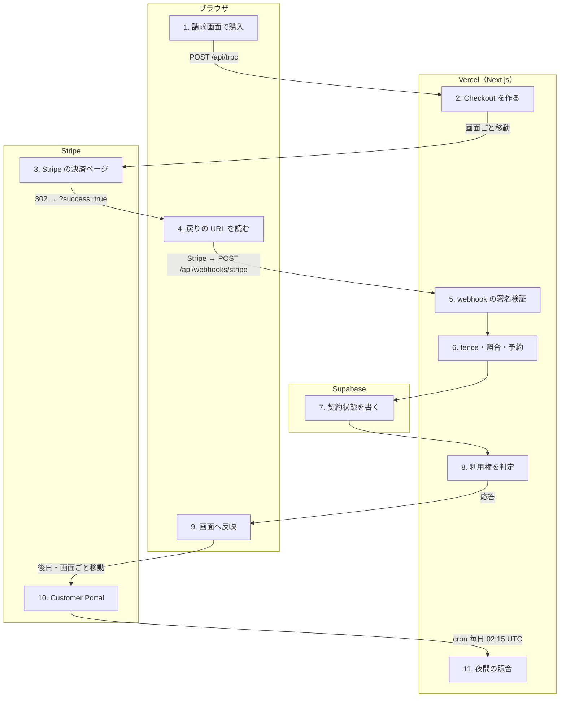

# Pro を契約する（課金）

<!-- learn:generated:start — 正本 このファイルの learn:journey の JSON / 再生成 pnpm learn:generate / 検証 pnpm docs:check。この範囲は手編集しない -->

設定の「請求」で購入ボタンを押すと、Stripe の決済ページ（Checkout）へ移り、戻ってくる。契約状態を確定させるのは戻りの URL ではなく、Stripe が別経路で送ってくる webhook。課金の強制（BILLING_ENFORCED）は既定で無効で、無効の間は画面（tRPC）では契約の有無にかかわらず全員が全機能を使える。ただし MCP からの書き込みだけは、DB 側の既定で契約中（active / trialing / past_due）の人に限られる。



通るサービス: ブラウザ / Vercel（Next.js） / Stripe / Supabase。段 11・失敗 15 種。

#### この経路を守るテスト

- [`apps/product/src/lib/test/e2e/billing.spec.ts`](../../../apps/product/src/lib/test/e2e/billing.spec.ts) で `アップグレード操作で Stripe Checkout へ遷移しようとする` を探す（Stripe 自体は叩かず、tRPC の応答を差し替えて遷移と復帰の toast だけを見る）

### 1. 設定の「請求」で購入ボタンを押す（ブラウザ）

未契約なら「月 $5 で利用する」が出る。押すと操作 ID（operationId）を 1 つ発行して createCheckoutSession を呼ぶ。同じ操作の二重押しは操作 ID のロックで止める。Stripe の Price ID（NEXT_PUBLIC_STRIPE_PRO_PRICE_ID）がビルドに入っていなければボタンは押せない。

- **なぜ必要か**: 操作 ID をブラウザで決めるのは、通信が切れて再送しても Stripe 側で同じ Checkout を指すようにするため（下の段の idempotency key になる）。
- **入力 → 出力**: ボタン押下 → billing.createCheckoutSession({ operationId })
- **ここを変えると**: 課金を強制していない間も、この購入ボタンは出る（説明文だけ「現在、全機能を無料で利用できます。」に変わる）。表示条件は契約状態（subscription_status）で、利用権（access）ではない。失敗時の文言と再試行の可否は billing-operation.ts の対応表に集約してあり、消費側 4 箇所が共有する。
- **コード**:
  - [`apps/product/src/features/settings/components/BillingSettings.tsx`](../../../apps/product/src/features/settings/components/BillingSettings.tsx) で `const createCheckout = api.billing.createCheckoutSession.useMutation({` を探す
  - [`apps/product/src/features/settings/components/BillingSettings.tsx`](../../../apps/product/src/features/settings/components/BillingSettings.tsx) で `t('settings.subscription.singlePlan.disabled')` を探す
  - [`apps/product/src/features/settings/lib/billing-operation.ts`](../../../apps/product/src/features/settings/lib/billing-operation.ts) で `const BILLING_OPERATION_MESSAGE_KEYS = {` を探す
- **この段を守るテスト**:
  - [`apps/product/src/lib/test/e2e/billing.spec.ts`](../../../apps/product/src/lib/test/e2e/billing.spec.ts) で `アップグレード操作で Stripe Checkout へ遷移しようとする` を探す

<details>
<summary>⚡ Price ID がビルドに入っていない — 画面: 押せない / データ: 変化なし / 再試行: しない / 痕跡: 残らない</summary>

- 画面: 購入ボタンが押せない。
- データ: 変化なし。
- 再試行: しない。env を直して再ビルドするまで続く。
- 痕跡: 何も残らない。
- **最初に見る場所**: Vercel の NEXT_PUBLIC_STRIPE_PRO_PRICE_ID。NEXT_PUBLIC_ なのでビルド時に埋め込まれ、env を変えただけでは反映されない。
- 根拠:
  - [`apps/product/src/features/settings/components/BillingSettings.tsx`](../../../apps/product/src/features/settings/components/BillingSettings.tsx) で `const isStripeConfigured = STRIPE_PRICE_ID !== '';` を探す

</details>

### 2. サーバーが Stripe Checkout Session を作る（Vercel（Next.js））

Router が本人のメールを取り直し、service role で Service を呼ぶ。Service は DB の状態から legacy / durable のどちらの経路かを決め、Stripe Customer を用意して checkout.sessions.create を呼ぶ。戻り先は success_url が /settings/billing?success=true、cancel_url が ?canceled=true。返した URL へブラウザが画面ごと移動する。

- **なぜ必要か**: durable 経路は操作 ID ごとの予約を DB に持ち、同じ操作の再送には保存済みの URL を返す。Stripe へも操作 ID 由来の idempotency key を渡すので、再送しても Checkout や Customer が二重にできない。
- **入力 → 出力**: operationId、本人のメール（サーバーで取得） → { url: Stripe Checkout の URL }
- **ここを変えると**: 外部契約。success_url / cancel_url の query を変えると、復帰を解釈する parseBillingReturn と E2E が同時に壊れる。idempotency key の接頭辞を変えると、切り替えをまたいだ再送で Checkout が二重に作られうる。課金を強制していない間は、試用歴が無ければ Stripe 側に 7 日の trial（dayoptProTrialDays）を付け、強制時はカード決済のみで trial を付けない。
- **コード**:
  - [`apps/product/src/features/settings/server/billing-router.ts`](../../../apps/product/src/features/settings/server/billing-router.ts) で `createCheckoutSession: protectedProcedure` を探す
  - [`apps/product/src/features/settings/server/billing-service.ts`](../../../apps/product/src/features/settings/server/billing-service.ts) で `const lifecycleMode = await resolveBillingLifecycleMode(supabase);` を探す
  - [`apps/product/src/features/settings/server/billing-mutation-service.ts`](../../../apps/product/src/features/settings/server/billing-mutation-service.ts) で ``success_url: `${input.appUrl}/settings/billing?success=true`,`` を探す
  - [`apps/product/src/features/settings/server/billing-mutation-service.ts`](../../../apps/product/src/features/settings/server/billing-mutation-service.ts) で `...(!isBillingEnforced() && !input.hasTrialHistory` を探す
- **この段を守るテスト**:
  - [`apps/product/src/features/settings/server/billing-router.test.ts`](../../../apps/product/src/features/settings/server/billing-router.test.ts) で `it('service role経路へoperationIdとserver-owned emailを渡す'` を探す
  - [`apps/product/src/features/settings/server/billing-mutation-service.test.ts`](../../../apps/product/src/features/settings/server/billing-mutation-service.test.ts) で `it('does not create Checkout for a Customer with an existing live subscription'` を探す

<details>
<summary>⚡ すでに Stripe に契約がある（durable 経路） — 画面: エラー表示 / データ: 変化なし / 再試行: 利用者がやり直す / 痕跡: 残らない</summary>

- 画面: 「すでにサブスクリプションがあります。サブスクリプション管理から変更してください。」の toast に「サブスクリプション管理」の action が付く。
- データ: 変化なし。Checkout は作らない。
- 再試行: しない（同じ操作は必ず同じ失敗）。action から Customer Portal へ進む。
- 痕跡: 想定内の拒否。
- **最初に見る場所**: Stripe の Customer の subscription。profiles 上は free でも Stripe で unpaid / paused のまま残っている時に起きる。
- 根拠:
  - [`apps/product/src/features/settings/server/billing-mutation-service.ts`](../../../apps/product/src/features/settings/server/billing-mutation-service.ts) で `BILLING_OPERATION_SERVICE_CODES.checkoutNotAvailable,` を探す
  - [`apps/product/src/features/settings/components/BillingSettings.tsx`](../../../apps/product/src/features/settings/components/BillingSettings.tsx) で `if (needsBillingPortal) {` を探す

</details>

<details>
<summary>⚡ Stripe API が落ちている・遅い — 画面: エラー表示 / データ: 変化なし / 再試行: 利用者がやり直す / 痕跡: Sentry</summary>

- 画面: 「支払いページを開けませんでした。もう一度お試しください。」の toast。
- データ: durable 経路では操作 ID の予約が残り、同じ操作 ID で押し直すと続きから処理する。
- 再試行: 利用者が押し直す（serviceCode の無い失敗は再試行可として扱う）。
- 痕跡: Sentry（tRPC adapter）。
- **最初に見る場所**: Stripe status page と Sentry。Stripe の Account ID が設定と食い違う時もここで止まる（durable）。
- 根拠:
  - [`apps/product/src/features/settings/lib/billing-operation.ts`](../../../apps/product/src/features/settings/lib/billing-operation.ts) で `if (serviceCode === null) return 'retryable';` を探す

</details>

<details>
<summary>⚡ STRIPE_SECRET_KEY が無い — 画面: エラー表示 / データ: 変化なし / 再試行: しない / 痕跡: Sentry</summary>

- 画面: 再試行の toast が出るが、何度押しても同じ。
- データ: 変化なし。
- 再試行: 押し直しても直らない。
- 痕跡: Sentry（tRPC adapter）。
- **最初に見る場所**: Vercel の STRIPE_SECRET_KEY。getStripe は未設定で null を返し、requireStripe がそこで throw する。
- 根拠:
  - [`apps/product/src/lib/stripe/client.ts`](../../../apps/product/src/lib/stripe/client.ts) で `throw new Error('Stripe is not configured. Set STRIPE_SECRET_KEY environment variable.');` を探す

</details>

### 3. Stripe の決済ページでカードを入れる（Stripe）

Stripe がホストする Checkout ページ。カード情報は Dayopt を通らない。支払いが済むと Stripe は 2 つのことを別々に行う: ブラウザを success_url へ戻すことと、webhook（checkout.session.completed など）を Dayopt へ送ること。

- **なぜ必要か**: カード情報を自前で扱わない（PCI の範囲を Stripe に閉じる）ため。
- **入力 → 出力**: Checkout URL → ブラウザの復帰（success_url / cancel_url）と、別経路の webhook
- **ここを変えると**: Checkout の見た目・支払い方法は Stripe Dashboard と sessions.create の引数で決まる。支払い方法を増やす（非同期決済など）なら、入金前の active を利用権と分ける設計が先（rollout 手順の前提）。
- **コード**:
  - [`docs/operations/billing-single-plan-rollout.md`](../../operations/billing-single-plan-rollout.md) で `非同期決済を追加する場合は入金前のactive状態を利用権と分離する設計を先に行う` を探す

<details>
<summary>⚡ 利用者が戻るを押す — 画面: エラー表示 / データ: 変化なし / 再試行: 利用者がやり直す / 痕跡: 残らない</summary>

- 画面: 請求画面に戻り「チェックアウトがキャンセルされました。いつでもアップグレードできます。」の toast。
- データ: 変化なし。
- 再試行: 利用者がもう一度押す。
- 痕跡: 想定内。
- **最初に見る場所**: 不要。
- 根拠:
  - [`apps/product/src/features/settings/server/billing-mutation-service.ts`](../../../apps/product/src/features/settings/server/billing-mutation-service.ts) で ``cancel_url: `${input.appUrl}/settings/billing?canceled=true`,`` を探す

</details>

### 4. 戻りの URL で toast を出し、数十秒だけ取り直す（ブラウザ）

設定画面が ?success=true / ?canceled=true / ?portal_return=true を parseBillingReturn で読み、toast を出して課金概要のキャッシュを捨てる。成功時だけ 2.5 秒ごとに最大 30 秒、getOverview を取り直して webhook の反映を待つ。その間は「お支払いの反映を確認しています…」を出す。

- **なぜ必要か**: 戻りの URL は契約の正本ではない。ブラウザを閉じれば届かないし、URL は誰でも手で打てる。契約状態を書くのは webhook だけで、ここは「反映を待つ」ための表示にすぎない。webhook はふつう戻りより遅れて着くので、取り直さないと Free のまま見える（#1887）。
- **入力 → 出力**: URL の query → toast、キャッシュの破棄、有限ポーリングの開始
- **ここを変えると**: 成功の toast は URL だけを根拠に出る（webhook 到達前でも「契約が有効になりました」と出る）。文言や判定をいじる時は、ここが確定情報ではないことを前提にする。query は PC では設定モーダルを開いて消すので、BillingSettings 側では読めない。
- **コード**:
  - [`apps/product/src/app/[locale]/(app)/settings/_utils/billing-return.ts`](<../../../apps/product/src/app/[locale]/(app)/settings/_utils/billing-return.ts>) で `export function parseBillingReturn(params: URLSearchParams): BillingReturnKind | null {` を探す
  - [`apps/product/src/app/[locale]/(app)/settings/[category]/page.tsx`](<../../../apps/product/src/app/[locale]/(app)/settings/[category]/page.tsx>) で `useBillingPollStore.getState().start();` を探す
  - [`apps/product/src/features/settings/lib/billing-poll.ts`](../../../apps/product/src/features/settings/lib/billing-poll.ts) で `export const BILLING_POLL_MAX_DURATION_MS = 30_000;` を探す
- **この段を守るテスト**:
  - [`apps/product/src/app/[locale]/(app)/settings/_utils/billing-return.test.ts`](<../../../apps/product/src/app/[locale]/(app)/settings/_utils/billing-return.test.ts>) で `describe('parseBillingReturn'` を探す
  - [`apps/product/src/features/settings/lib/billing-poll.test.ts`](../../../apps/product/src/features/settings/lib/billing-poll.test.ts) で `describe('shouldContinueBillingPoll'` を探す
  - [`apps/product/src/lib/test/e2e/billing.spec.ts`](../../../apps/product/src/lib/test/e2e/billing.spec.ts) で `Checkout 成功復帰（?success=true）で成功 toast が表示される` を探す

<details>
<summary>⚡ 30 秒待っても webhook が反映されない — 画面: エラー表示 / データ: DB だけ新しい / 再試行: 相手が再送 / 痕跡: Sentry</summary>

- 画面: 「契約状態をまだ確認できません。しばらくしてから課金情報を再読み込みしてください。変わらない場合はサポートへご連絡ください。」の toast。
- データ: Stripe では支払い済み、DB の profiles はまだ free。webhook が後で届けば直る。
- 再試行: Stripe が webhook を再送する。画面は再読み込みか 60 秒ごとの利用権の取り直しで追いつく。
- 痕跡: Sentry（operation: billing_return_poll_timeout）。
- **最初に見る場所**: Stripe Dashboard の webhook 配信履歴と runbook Playbook 3。原因は下の webhook の段にある。
- 根拠:
  - [`apps/product/src/features/settings/lib/billing-poll-observability.ts`](../../../apps/product/src/features/settings/lib/billing-poll-observability.ts) で `operation: 'billing_return_poll_timeout',` を探す
  - [`docs/operations/runbook.md`](../../operations/runbook.md) で `## Playbook 3: Stripe Webhook停止（P1）` を探す

</details>

### 5. Stripe からの webhook を署名で確かめる（Vercel（Next.js））

戻りとは別に、Stripe がサーバーへ直接 POST する。生の body と stripe-signature ヘッダを STRIPE_WEBHOOK_SECRET で constructEvent に通す。secret や Stripe の設定が無ければ 500、署名が無い・合わなければ 401 で、業務処理へは進まない。

- **なぜ必要か**: この URL は公開されているので、署名が合うものだけを Stripe 発と認める。契約状態を変えてよい入口はここだけ。
- **入力 → 出力**: Stripe の event（生の body と署名ヘッダ） → 検証済みの Stripe.Event
- **ここを変えると**: 外部契約。URL（/api/webhooks/stripe）は Stripe Dashboard に登録してあり、動かすと全 event が届かなくなる。secret を回したら Vercel の env を同時に更新して再デプロイする（runbook ケースA）。
- **コード**:
  - [`apps/product/src/app/api/webhooks/stripe/route.ts`](../../../apps/product/src/app/api/webhooks/stripe/route.ts) で `event = stripe.webhooks.constructEvent(payload, signature, webhookSecret);` を探す
  - [`apps/product/src/app/api/webhooks/stripe/route.ts`](../../../apps/product/src/app/api/webhooks/stripe/route.ts) で `captureWebhookSignatureFailure({` を探す
- **この段を守るテスト**:
  - [`apps/product/src/app/api/webhooks/stripe/route.test.ts`](../../../apps/product/src/app/api/webhooks/stripe/route.test.ts) で `describe('Stripe webhook 署名検証'` を探す

<details>
<summary>⚡ 署名が合わない（secret の食い違い） — 画面: 何も起きない / データ: DB だけ新しい / 再試行: 相手が再送 / 痕跡: Sentry</summary>

- 画面: 利用者には何も出ない。戻り直後の取り直しが 30 秒で打ち切られる。
- データ: profiles は更新されない。Stripe では支払い済み。
- 再試行: Stripe が再送するが、secret を直すまで 401 が続く。
- 痕跡: Sentry（operation: signature_verification、同一送信元は 60 秒に 1 件へ集約）。
- **最初に見る場所**: Stripe Dashboard の webhook の失敗表示と STRIPE_WEBHOOK_SECRET。runbook Playbook 3 ケースA。
- 根拠:
  - [`docs/operations/runbook.md`](../../operations/runbook.md) で `#### ケースA: STRIPE_WEBHOOK_SECRET 不一致` を探す

</details>

### 6. write fence、送信元の照合、重複の予約（Vercel（Next.js））

順に確かめる。(1) write fence が ON なら 503 と Retry-After: 30。(2) durable 経路なら、event の livemode / account を STRIPE_ACCOUNT_ID / STRIPE_LIVEMODE と照合し、Stripe API から同じ event を取り直して以後はそちらを使う。(3) event.id で stripe_webhook_events に予約（claim）する。処理済みなら 200（重複）、処理中なら 503。

- **なぜ必要か**: Stripe は同じ event を再送するので、event.id で一度だけ処理する。fence を予約より先に見るのは、予約後に 503 を返すと予約が残り、再送が「処理中」で弾かれ続けるため。
- **入力 → 出力**: 検証済み event → claimed（処理へ進む）/ 200 duplicate / 503 / 500
- **ここを変えると**: 予約の状態（processing / processed / failed）は夜間の照合 cron も読む。状態名を変えると照合が invalidState を数え出す。5 分以上 processing のままの予約は古いとみなして取り直せる。
- **コード**:
  - [`apps/product/src/app/api/webhooks/stripe/route.ts`](../../../apps/product/src/app/api/webhooks/stripe/route.ts) で `if (await isWriteFenceEnabled(supabase)) {` を探す
  - [`apps/product/src/lib/stripe/webhook-identity.ts`](../../../apps/product/src/lib/stripe/webhook-identity.ts) で `export async function verifyStripeWebhookIdentity(` を探す
  - [`apps/product/src/app/api/webhooks/stripe/stripe-webhook-idempotency.ts`](../../../apps/product/src/app/api/webhooks/stripe/stripe-webhook-idempotency.ts) で `const STALE_CLAIM_AFTER_MS = 5 * 60 * 1000;` を探す
- **この段を守るテスト**:
  - [`apps/product/src/app/api/webhooks/stripe/route.test.ts`](../../../apps/product/src/app/api/webhooks/stripe/route.test.ts) で `it('write fence が有効な時は claim 前に 503 を返す（予約の滞留を避ける）'` を探す
  - [`apps/product/src/app/api/webhooks/stripe/route.test.ts`](../../../apps/product/src/app/api/webhooks/stripe/route.test.ts) で `it('event mode不一致はDB claim前に拒否する'` を探す
  - [`apps/product/src/app/api/webhooks/stripe/stripe-webhook-idempotency.test.ts`](../../../apps/product/src/app/api/webhooks/stripe/stripe-webhook-idempotency.test.ts) で `describe('Stripe webhook idempotency'` を探す

<details>
<summary>⚡ write fence が ON — 画面: 何も起きない / データ: 変化なし / 再試行: 相手が再送 / 痕跡: ログだけ</summary>

- 画面: 利用者には何も出ない。反映が遅れる。
- データ: 予約前に止めるので DB は変化なし。
- 再試行: Stripe が Retry-After に従って再送し、fence 解除後に通る。
- 痕跡: ログだけ（障害ではなく復元作業中の想定挙動）。
- **最初に見る場所**: fence の状態。runbook の「Write Fence 有効化」。
- 根拠:
  - [`apps/product/src/app/api/webhooks/stripe/route.ts`](../../../apps/product/src/app/api/webhooks/stripe/route.ts) で `logger.warn('Stripe webhook rejected: write fence is enabled');` を探す

</details>

<details>
<summary>⚡ 送信元の account / mode が設定と違う（durable） — 画面: 何も起きない / データ: 変化なし / 再試行: 相手が再送 / 痕跡: Sentry</summary>

- 画面: 利用者には何も出ない。
- データ: 予約前に止めるので変化なし。
- 再試行: Stripe が再送するが、設定を直すまで 500 が続く。
- 痕跡: Sentry（operation: identity）。
- **最初に見る場所**: STRIPE_ACCOUNT_ID / STRIPE_LIVEMODE と、Stripe の test / live の取り違え。
- 根拠:
  - [`apps/product/src/app/api/webhooks/stripe/route.ts`](../../../apps/product/src/app/api/webhooks/stripe/route.ts) で `logger.error('Stripe webhook identity mismatch');` を探す

</details>

### 7. event ごとに profiles の契約状態を書く（Supabase）

checkout.session.completed なら Stripe から subscription を取り直し、その status を Dayopt の状態へ写して、stripe_customer_id が一致する profiles の subscription_status / subscription_id を更新する。subscription.updated / deleted、invoice.paid（体験の消費日時）、invoice.payment_failed（メール）も同じ入口で扱う。最後に予約を processed にして 200 を返す。途中で失敗したら予約を failed に戻して 500 を返し、Stripe の再送に任せる。

- **なぜ必要か**: 契約状態の正本は Stripe で、DB はその写し。写しを書く経路を webhook に一本化しているので、戻りの URL や画面の操作では契約状態が変わらない。
- **入力 → 出力**: 予約済みの event → profiles.subscription_status、予約の processed、200
- **ここを変えると**: 外部契約。Stripe の status の写し（mapStripeSubscriptionStatus）を変えると、active / trialing / past_due を「契約中」とみなす判定（isProSubscriptionStatus）と噛み合わなくなる。メール送信は失敗しても 200 を返す（throw すると Stripe が再送し、状態同期が揺れる）。durable 経路では未対応の event 種別を 500 にするので、Stripe Dashboard で購読 event を足すとそれが再送され続ける。
- **コード**:
  - [`apps/product/src/app/api/webhooks/stripe/route.ts`](../../../apps/product/src/app/api/webhooks/stripe/route.ts) で `await syncSubscriptionStatus(supabase, customerId, subscriptionId, status);` を探す
  - [`apps/product/src/features/settings/server/billing-service.ts`](../../../apps/product/src/features/settings/server/billing-service.ts) で `'No billing profile was updated for the Stripe customer',` を探す
  - [`packages/billing/src/subscription.ts`](../../../packages/billing/src/subscription.ts) で `export function mapStripeSubscriptionStatus(stripeStatus: string): SubscriptionStatus {` を探す
  - [`apps/product/src/app/api/webhooks/stripe/route.ts`](../../../apps/product/src/app/api/webhooks/stripe/route.ts) で `await releaseStripeWebhookEvent(supabase, event.id);` を探す
- **この段を守るテスト**:
  - [`apps/product/src/app/api/webhooks/stripe/route.test.ts`](../../../apps/product/src/app/api/webhooks/stripe/route.test.ts) で `it('subscription checkoutをprocessedにした後で一度だけ記録し、duplicateでは再記録しない'` を探す
  - [`apps/product/src/app/api/webhooks/stripe/route.test.ts`](../../../apps/product/src/app/api/webhooks/stripe/route.test.ts) で `it('未対応eventを成功扱いにしない'` を探す
  - [`apps/product/src/app/api/webhooks/stripe/route.test.ts`](../../../apps/product/src/app/api/webhooks/stripe/route.test.ts) で `it('解約予約中は期間終了までactiveのまま（予約時点で利用権を落とさない）'` を探す

<details>
<summary>⚡ stripe_customer_id に一致する profile が無い — 画面: 何も起きない / データ: DB だけ新しい / 再試行: 相手が再送 / 痕跡: Sentry</summary>

- 画面: 利用者には何も出ない。反映待ちが打ち切られる。
- データ: 更新 0 行を失敗として扱い、予約を failed に戻す。
- 再試行: Stripe が再送する。profile 側が直らない限り失敗し続ける。
- 痕跡: Sentry（source: stripe_webhook）。
- **最初に見る場所**: profiles.stripe_customer_id の保存漏れ。Checkout を作る段で Customer を作った後の保存が失敗していないか。
- 根拠:
  - [`apps/product/src/features/settings/server/billing-service.ts`](../../../apps/product/src/features/settings/server/billing-service.ts) で `cause: new Error('Stripe subscription sync updated zero profiles'),` を探す

</details>

<details>
<summary>⚡ 開始メールの送信に失敗する — 画面: 何も起きない / データ: 保存される / 再試行: しない / 痕跡: Sentry</summary>

- 画面: 画面は正常。メールだけ届かない。
- データ: 契約状態は保存される。
- 再試行: しない（webhook は 200 を返す）。
- 痕跡: Sentry（送信先が suppression 済みの時も operation 名付きで残す）。
- **最初に見る場所**: Resend の配信状況と email_suppressions。
- 根拠:
  - [`apps/product/src/app/api/webhooks/stripe/route.ts`](../../../apps/product/src/app/api/webhooks/stripe/route.ts) で `new Error('Billing email skipped: recipient is suppressed'),` を探す

</details>

<details>
<summary>⚡ Supabase へ書けない — 画面: 何も起きない / データ: 変化なし / 再試行: 相手が再送 / 痕跡: Sentry</summary>

- 画面: 利用者には何も出ない。反映待ちが打ち切られる。
- データ: 書けていない。予約の解放も失敗しうるが、5 分で古い予約として取り直せる。
- 再試行: Stripe が再送する。
- 痕跡: Sentry。
- **最初に見る場所**: Supabase status と Sentry の source: stripe_webhook。runbook Playbook 3 ケースB。
- 根拠:
  - [`docs/operations/runbook.md`](../../operations/runbook.md) で `#### ケースB: 処理エラー（500 / Timeout）` を探す

</details>

### 8. 利用権（getBillingAccess）を判定する（Vercel（Next.js））

BILLING_ENFORCED が 'true' でなければ、DB を読まずに全員へ canUseProduct: true を返す。'true' の時だけ profiles の契約状態と体験期間（45 日）から subscribed / trial / expired / not_started を決め、trial か subscribed の時だけ使える。protectedProcedure は、この判定で使えない人の mutation を FORBIDDEN（BILLING_ACCESS_ENDED）で止める。解約・削除・購入などの管理操作は止めない。

- **なぜ必要か**: 契約状態（Stripe の写し）と「使えるか」を 1 箇所で決め、画面・tRPC・MCP が同じ答えを見るため。
- **入力 → 出力**: userId（と BILLING_ENFORCED） → { state, canUseProduct, trialEndsAt, enforced }
- **ここを変えると**: BILLING_ENFORCED は既定 false で、公開手順の文書は本番を false のまま保つと書く（本番の実値はこの教材では未確認）。つまり今の利用者は、画面では契約してもしなくても全機能を使え、45 日体験も始まらない。ただし MCP からの書き込みは DB 側の mcp_mutation_control.billing_enforced（既定 false）の判定で契約中だけに限られ、未契約者は DM005 になる。契約すれば Stripe での課金は実際に走る。true へ切り替える時は DB 側と MCP の切り替えを先に行う順序がある（rollout §公開順序 6）。env だけ変えると MCP と書き込みの判定がずれる。
- **コード**:
  - [`apps/product/src/lib/billing/access-service.ts`](../../../apps/product/src/lib/billing/access-service.ts) で `return { state: 'not_started', canUseProduct: true, trialEndsAt: null, enforced: false };` を探す
  - [`apps/product/src/lib/billing/enforcement-flag.ts`](../../../apps/product/src/lib/billing/enforcement-flag.ts) で `return env.BILLING_ENFORCED === 'true';` を探す
  - [`apps/product/src/lib/trpc/procedures.ts`](../../../apps/product/src/lib/trpc/procedures.ts) で `cause: new ServiceError('BILLING_ACCESS_ENDED', 'Product access has ended'),` を探す
  - [`docs/operations/billing-single-plan-rollout.md`](../../operations/billing-single-plan-rollout.md) で ``課金制限のフラグは引き続き `BILLING_ENFORCED=false` とし`` を探す
  - [`supabase/migrations/20260908022927_add_mcp_billing_access_switch.sql`](../../../supabase/migrations/20260908022927_add_mcp_billing_access_switch.sql) で `IF NOT v_billing_enforced THEN` を探す
- **この段を守るテスト**:
  - [`apps/product/src/lib/billing/access-service.test.ts`](../../../apps/product/src/lib/billing/access-service.test.ts) で `it('does not read new schema or start a trial while disabled'` を探す
  - [`packages/billing/src/access.test.ts`](../../../packages/billing/src/access.test.ts) で `resolveBillingAccess` を探す

<details>
<summary>⚡ 強制中に profiles を読めない — 画面: エラー表示 / データ: 変化なし / 再試行: 利用者がやり直す / 痕跡: Sentry</summary>

- 画面: 書き込み系の操作がエラーになる。
- データ: 変化なし。
- 再試行: 利用者がやり直す。
- 痕跡: Sentry（operation: read_access）。
- **最初に見る場所**: Supabase の状態。判定できない時は通さない（fail closed）。
- 根拠:
  - [`apps/product/src/lib/billing/access-service.ts`](../../../apps/product/src/lib/billing/access-service.ts) で `throw new ServiceError('INTERNAL_ERROR', 'Unable to verify access', { cause });` を探す

</details>

### 9. BillingAccessProvider が画面へ反映する（ブラウザ）

アプリ全体に 1 つ置いた Provider が getAccess を 60 秒ごと・フォーカス復帰時に取り直す。強制中で not_started なら、ここで一度だけ startTrial を呼んで 45 日体験を始める。体験の終了時刻になったら取り直して、書き込みを閉じる。請求画面は webhook の反映後、「プランを調整」、支払い方法、請求履歴、キャンセルを出す。

- **なぜ必要か**: 体験の開始を認証済みアプリの表示に限るため（LP・登録・MCP・同期からは始めない）。
- **入力 → 出力**: getAccess の結果 → context の BillingAccess、請求画面の表示
- **ここを変えると**: state が変わった時だけ getOverview を取り直す。初回解決で取り直すと、同じ読み込みで二重に取得して rate limit を圧迫する（#2669）。
- **コード**:
  - [`apps/product/src/lib/billing/BillingAccessProvider.tsx`](../../../apps/product/src/lib/billing/BillingAccessProvider.tsx) で `if (query.data?.enforced && query.data.state === 'not_started' && trial.isIdle) trial.mutate();` を探す
  - [`apps/product/src/lib/billing/BillingAccessProvider.tsx`](../../../apps/product/src/lib/billing/BillingAccessProvider.tsx) で `refetchInterval: 60_000,` を探す
- **この段を守るテスト**:
  - [`apps/product/src/lib/billing/BillingAccessProvider.test.tsx`](../../../apps/product/src/lib/billing/BillingAccessProvider.test.tsx) で `it('starts once from the authenticated app mount'` を探す
  - [`apps/product/src/lib/billing/BillingAccessProvider.test.tsx`](../../../apps/product/src/lib/billing/BillingAccessProvider.test.tsx) で `it('refetches the overview only when the access state transitions (#2669)'` を探す

<details>
<summary>⚡ 強制中に体験の開始が失敗する — 画面: 使えない / データ: 変化なし / 再試行: 利用者がやり直す / 痕跡: Sentry</summary>

- 画面: アプリの代わりに「設定を読み込めませんでした。もう一度お試しください」と「もう一度試す」だけが出る。
- データ: 体験は始まっていない。
- 再試行: 利用者が「もう一度試す」を押す。
- 痕跡: Sentry（operation: start_trial）。
- **最初に見る場所**: profiles の更新失敗。課金を強制していない間は起きない。
- 根拠:
  - [`apps/product/src/lib/billing/BillingAccessProvider.tsx`](../../../apps/product/src/lib/billing/BillingAccessProvider.tsx) で `<p>{t('errors.loadFailedDescription')}</p>` を探す

</details>

### 10. （後日）Customer Portal で解約・カード変更（Stripe）

「プランを調整」「更新」「サブスクリプションをキャンセル」はどれも createPortalSession で Stripe の Customer Portal を開く。解約やカード変更は Stripe 上で行い、結果は customer.subscription.updated / deleted の webhook で DB へ写る。戻り先は ?portal_return=true で、toast は出さずキャッシュだけ捨てる。

- **なぜ必要か**: 解約・支払い方法の変更を自前で作らず、状態の正本を Stripe に置いたままにするため。
- **入力 → 出力**: operationId → Portal の URL（戻りは ?portal_return=true）
- **ここを変えると**: 外部契約。return_url の query を変えると parseBillingReturn が復帰を検出できず、IndexedDB に永続化した古い課金概要が 5 分間そのまま出る。解約予約中は期間終了まで active のまま（予約した時点で利用権を落とさない）。
- **コード**:
  - [`apps/product/src/features/settings/server/billing-mutation-service.ts`](../../../apps/product/src/features/settings/server/billing-mutation-service.ts) で ``return_url: `${appUrl}/settings/billing?portal_return=true`,`` を探す
  - [`apps/product/src/features/settings/server/billing-service.ts`](../../../apps/product/src/features/settings/server/billing-service.ts) で ``{ idempotencyKey: `dayopt-billing-portal-legacy-v1-${operationId}` },`` を探す
- **この段を守るテスト**:
  - [`apps/product/src/lib/test/e2e/billing.spec.ts`](../../../apps/product/src/lib/test/e2e/billing.spec.ts) で `Portal 復帰（?portal_return=true）では toast を出さず画面が壊れない` を探す
  - [`apps/product/src/features/settings/server/billing-mutation-service.test.ts`](../../../apps/product/src/features/settings/server/billing-mutation-service.test.ts) で `it('creates a Portal Session with the canonical operation idempotency key'` を探す

### 11. （夜間）Stripe の event と webhook の記録を照合する（Vercel（Next.js））

Vercel cron が毎日 /api/cron/billing-reconciliation を叩く。Stripe の直近 26 時間（最後の 5 分を除く）の課金 event を最大 400 件取り、stripe_webhook_events に processed で残っているかを数える。欠落・failed・古い processing・不明な状態・件数の打ち切りがあれば 503 と Sentry で知らせる。検出専用で、DB は直さない。

- **なぜ必要か**: webhook が黙って落ちた（届かない・失敗のまま）ことを、利用者の問い合わせより先に気づくため。
- **入力 → 出力**: CRON_SECRET の Bearer、Stripe event 一覧、webhook の記録 → 件数だけの summary（event / customer の ID は出さない）
- **ここを変えると**: 直すのは人間。検出したら Stripe Dashboard から該当 event を再送する（runbook Playbook 3）。Stripe の env が全て無ければ configured: false で素通りし、一部だけなら 503 にする。
- **コード**:
  - [`apps/product/src/app/api/cron/billing-reconciliation/route.ts`](../../../apps/product/src/app/api/cron/billing-reconciliation/route.ts) で `/** Stripeとdurable webhook stateを日次照合する。検出専用でデータは変更しない。 */` を探す
  - [`apps/product/src/features/settings/server/billing-webhook-reconciliation.ts`](../../../apps/product/src/features/settings/server/billing-webhook-reconciliation.ts) で `const RECONCILIATION_LOOKBACK_SECONDS = 26 * 60 * 60;` を探す
  - [`apps/product/vercel.json`](../../../apps/product/vercel.json) で `"path": "/api/cron/billing-reconciliation",` を探す
- **この段を守るテスト**:
  - [`apps/product/src/app/api/cron/billing-reconciliation/route.test.ts`](../../../apps/product/src/app/api/cron/billing-reconciliation/route.test.ts) で `it('missing eventを503で可視化し、IDをresponseやSentryへ出さない'` を探す

<details>
<summary>⚡ 欠落・失敗のままの event が見つかる — 画面: 何も起きない / データ: 変化なし / 再試行: しない / 痕跡: Sentry</summary>

- 画面: 利用者には何も出ない。
- データ: 変化なし（検出だけ）。
- 再試行: 人間が Stripe Dashboard から再送する。
- 痕跡: Sentry（operation: billing_webhook_reconciliation）と cron の 503。
- **最初に見る場所**: runbook Playbook 3 の検知欄。
- 根拠:
  - [`docs/operations/runbook.md`](../../operations/runbook.md) で ``日次 `/api/cron/billing-reconciliation` の 503`` を探す

</details>

<!-- learn:generated:end -->

## データ（正本）

この JSON がこのページの正本。上の説明と図、`pnpm learn` の対話画面はここから生成する。参照（`path` + `find`）は `pnpm docs:check` が実在を検査する。

```json learn:journey
{
  "id": "billing",
  "title": "Pro を契約する（課金）",
  "order": 100,
  "group": "integration",
  "intro": "設定の「請求」で購入ボタンを押すと、Stripe の決済ページ（Checkout）へ移り、戻ってくる。契約状態を確定させるのは戻りの URL ではなく、Stripe が別経路で送ってくる webhook。課金の強制（BILLING_ENFORCED）は既定で無効で、無効の間は画面（tRPC）では契約の有無にかかわらず全員が全機能を使える。ただし MCP からの書き込みだけは、DB 側の既定で契約中（active / trialing / past_due）の人に限られる。",
  "play": "▶ 購入を押す",
  "lanes": ["browser", "vercel", "stripe", "supabase"],
  "tests": [
    {
      "path": "apps/product/src/lib/test/e2e/billing.spec.ts",
      "find": "アップグレード操作で Stripe Checkout へ遷移しようとする",
      "why": "Stripe 自体は叩かず、tRPC の応答を差し替えて遷移と復帰の toast だけを見る"
    }
  ],
  "hops": [
    {
      "id": "billing-ui",
      "svc": "browser",
      "short": "請求画面で購入",
      "title": "設定の「請求」で購入ボタンを押す",
      "what": "未契約なら「月 $5 で利用する」が出る。押すと操作 ID（operationId）を 1 つ発行して createCheckoutSession を呼ぶ。同じ操作の二重押しは操作 ID のロックで止める。Stripe の Price ID（NEXT_PUBLIC_STRIPE_PRO_PRICE_ID）がビルドに入っていなければボタンは押せない。",
      "why": "操作 ID をブラウザで決めるのは、通信が切れて再送しても Stripe 側で同じ Checkout を指すようにするため（下の段の idempotency key になる）。",
      "io": {
        "in": "ボタン押下",
        "out": "billing.createCheckoutSession({ operationId })"
      },
      "change": "課金を強制していない間も、この購入ボタンは出る（説明文だけ「現在、全機能を無料で利用できます。」に変わる）。表示条件は契約状態（subscription_status）で、利用権（access）ではない。失敗時の文言と再試行の可否は billing-operation.ts の対応表に集約してあり、消費側 4 箇所が共有する。",
      "screen": {
        "t": "settings",
        "url": "/ja/settings/billing",
        "title": "請求",
        "rows": [
          ["現在のプラン", "Dayopt", "neutral"],
          ["現在、全機能を無料で利用できます。", "", "neutral"]
        ],
        "button": "月 $5 で利用する"
      },
      "refs": [
        {
          "path": "apps/product/src/features/settings/components/BillingSettings.tsx",
          "find": "const createCheckout = api.billing.createCheckoutSession.useMutation({"
        },
        {
          "path": "apps/product/src/features/settings/components/BillingSettings.tsx",
          "find": "t('settings.subscription.singlePlan.disabled')"
        },
        {
          "path": "apps/product/src/features/settings/lib/billing-operation.ts",
          "find": "const BILLING_OPERATION_MESSAGE_KEYS = {"
        }
      ],
      "tests": [
        {
          "path": "apps/product/src/lib/test/e2e/billing.spec.ts",
          "find": "アップグレード操作で Stripe Checkout へ遷移しようとする"
        }
      ],
      "fails": [
        {
          "id": "price-missing",
          "label": "Price ID がビルドに入っていない",
          "screen": "購入ボタンが押せない。",
          "data": "変化なし。",
          "retry": "しない。env を直して再ビルドするまで続く。",
          "trace": "何も残らない。",
          "look": "Vercel の NEXT_PUBLIC_STRIPE_PRO_PRICE_ID。NEXT_PUBLIC_ なのでビルド時に埋め込まれ、env を変えただけでは反映されない。",
          "refs": [
            {
              "path": "apps/product/src/features/settings/components/BillingSettings.tsx",
              "find": "const isStripeConfigured = STRIPE_PRICE_ID !== '';"
            }
          ],
          "tags": {
            "screen": "blocked",
            "data": "unchanged",
            "retry": "none",
            "trace": "none"
          }
        }
      ]
    },
    {
      "id": "checkout-session",
      "svc": "vercel",
      "short": "Checkout を作る",
      "via": "POST /api/trpc",
      "title": "サーバーが Stripe Checkout Session を作る",
      "what": "Router が本人のメールを取り直し、service role で Service を呼ぶ。Service は DB の状態から legacy / durable のどちらの経路かを決め、Stripe Customer を用意して checkout.sessions.create を呼ぶ。戻り先は success_url が /settings/billing?success=true、cancel_url が ?canceled=true。返した URL へブラウザが画面ごと移動する。",
      "why": "durable 経路は操作 ID ごとの予約を DB に持ち、同じ操作の再送には保存済みの URL を返す。Stripe へも操作 ID 由来の idempotency key を渡すので、再送しても Checkout や Customer が二重にできない。",
      "io": {
        "in": "operationId、本人のメール（サーバーで取得）",
        "out": "{ url: Stripe Checkout の URL }"
      },
      "change": "外部契約。success_url / cancel_url の query を変えると、復帰を解釈する parseBillingReturn と E2E が同時に壊れる。idempotency key の接頭辞を変えると、切り替えをまたいだ再送で Checkout が二重に作られうる。課金を強制していない間は、試用歴が無ければ Stripe 側に 7 日の trial（dayoptProTrialDays）を付け、強制時はカード決済のみで trial を付けない。",
      "refs": [
        {
          "path": "apps/product/src/features/settings/server/billing-router.ts",
          "find": "createCheckoutSession: protectedProcedure"
        },
        {
          "path": "apps/product/src/features/settings/server/billing-service.ts",
          "find": "const lifecycleMode = await resolveBillingLifecycleMode(supabase);"
        },
        {
          "path": "apps/product/src/features/settings/server/billing-mutation-service.ts",
          "find": "success_url: `${input.appUrl}/settings/billing?success=true`,"
        },
        {
          "path": "apps/product/src/features/settings/server/billing-mutation-service.ts",
          "find": "...(!isBillingEnforced() && !input.hasTrialHistory"
        }
      ],
      "tests": [
        {
          "path": "apps/product/src/features/settings/server/billing-router.test.ts",
          "find": "it('service role経路へoperationIdとserver-owned emailを渡す'"
        },
        {
          "path": "apps/product/src/features/settings/server/billing-mutation-service.test.ts",
          "find": "it('does not create Checkout for a Customer with an existing live subscription'"
        }
      ],
      "fails": [
        {
          "id": "already-subscribed",
          "label": "すでに Stripe に契約がある（durable 経路）",
          "screen": "「すでにサブスクリプションがあります。サブスクリプション管理から変更してください。」の toast に「サブスクリプション管理」の action が付く。",
          "data": "変化なし。Checkout は作らない。",
          "retry": "しない（同じ操作は必ず同じ失敗）。action から Customer Portal へ進む。",
          "trace": "想定内の拒否。",
          "look": "Stripe の Customer の subscription。profiles 上は free でも Stripe で unpaid / paused のまま残っている時に起きる。",
          "refs": [
            {
              "path": "apps/product/src/features/settings/server/billing-mutation-service.ts",
              "find": "BILLING_OPERATION_SERVICE_CODES.checkoutNotAvailable,"
            },
            {
              "path": "apps/product/src/features/settings/components/BillingSettings.tsx",
              "find": "if (needsBillingPortal) {"
            }
          ],
          "tags": {
            "screen": "toast",
            "data": "unchanged",
            "retry": "user",
            "trace": "none"
          },
          "to": "billing-ui",
          "back": "管理画面への案内",
          "screenAfter": {
            "t": "settings",
            "url": "/ja/settings/billing",
            "title": "請求",
            "rows": [["現在のプラン", "Dayopt", "neutral"]],
            "toast": "すでにサブスクリプションがあります。サブスクリプション管理から変更してください。",
            "toastTone": "bad",
            "toastAction": "サブスクリプション管理"
          }
        },
        {
          "id": "stripe-api-down",
          "label": "Stripe API が落ちている・遅い",
          "screen": "「支払いページを開けませんでした。もう一度お試しください。」の toast。",
          "data": "durable 経路では操作 ID の予約が残り、同じ操作 ID で押し直すと続きから処理する。",
          "retry": "利用者が押し直す（serviceCode の無い失敗は再試行可として扱う）。",
          "trace": "Sentry（tRPC adapter）。",
          "look": "Stripe status page と Sentry。Stripe の Account ID が設定と食い違う時もここで止まる（durable）。",
          "refs": [
            {
              "path": "apps/product/src/features/settings/lib/billing-operation.ts",
              "find": "if (serviceCode === null) return 'retryable';"
            }
          ],
          "tags": {
            "screen": "toast",
            "data": "unchanged",
            "retry": "user",
            "trace": "sentry"
          },
          "to": "billing-ui",
          "back": "再試行の案内",
          "screenAfter": {
            "t": "settings",
            "url": "/ja/settings/billing",
            "title": "請求",
            "rows": [["現在のプラン", "Dayopt", "neutral"]],
            "toast": "支払いページを開けませんでした。もう一度お試しください。",
            "toastTone": "bad"
          }
        },
        {
          "id": "stripe-not-configured",
          "label": "STRIPE_SECRET_KEY が無い",
          "screen": "再試行の toast が出るが、何度押しても同じ。",
          "data": "変化なし。",
          "retry": "押し直しても直らない。",
          "trace": "Sentry（tRPC adapter）。",
          "look": "Vercel の STRIPE_SECRET_KEY。getStripe は未設定で null を返し、requireStripe がそこで throw する。",
          "refs": [
            {
              "path": "apps/product/src/lib/stripe/client.ts",
              "find": "throw new Error('Stripe is not configured. Set STRIPE_SECRET_KEY environment variable.');"
            }
          ],
          "tags": {
            "screen": "toast",
            "data": "unchanged",
            "retry": "none",
            "trace": "sentry"
          },
          "to": "billing-ui",
          "back": "再試行の案内"
        }
      ]
    },
    {
      "id": "stripe-checkout",
      "svc": "stripe",
      "short": "Stripe の決済ページ",
      "via": "画面ごと移動",
      "title": "Stripe の決済ページでカードを入れる",
      "what": "Stripe がホストする Checkout ページ。カード情報は Dayopt を通らない。支払いが済むと Stripe は 2 つのことを別々に行う: ブラウザを success_url へ戻すことと、webhook（checkout.session.completed など）を Dayopt へ送ること。",
      "why": "カード情報を自前で扱わない（PCI の範囲を Stripe に閉じる）ため。",
      "io": {
        "in": "Checkout URL",
        "out": "ブラウザの復帰（success_url / cancel_url）と、別経路の webhook"
      },
      "change": "Checkout の見た目・支払い方法は Stripe Dashboard と sessions.create の引数で決まる。支払い方法を増やす（非同期決済など）なら、入金前の active を利用権と分ける設計が先（rollout 手順の前提）。",
      "screen": {
        "t": "form",
        "host": "checkout.stripe.com",
        "url": "/c/pay/…",
        "title": "（Stripe の決済ページ）",
        "fields": [
          ["（メールアドレス）", "（本人のメール）"],
          ["（カード情報）", "•••• •••• •••• ••••"]
        ],
        "button": "（申し込む）",
        "note": "文言は Stripe が出す。Dayopt の翻訳ファイルには無い"
      },
      "refs": [
        {
          "path": "docs/operations/billing-single-plan-rollout.md",
          "find": "非同期決済を追加する場合は入金前のactive状態を利用権と分離する設計を先に行う"
        }
      ],
      "fails": [
        {
          "id": "user-cancel",
          "label": "利用者が戻るを押す",
          "screen": "請求画面に戻り「チェックアウトがキャンセルされました。いつでもアップグレードできます。」の toast。",
          "data": "変化なし。",
          "retry": "利用者がもう一度押す。",
          "trace": "想定内。",
          "look": "不要。",
          "refs": [
            {
              "path": "apps/product/src/features/settings/server/billing-mutation-service.ts",
              "find": "cancel_url: `${input.appUrl}/settings/billing?canceled=true`,"
            }
          ],
          "tags": {
            "screen": "toast",
            "data": "unchanged",
            "retry": "user",
            "trace": "none"
          },
          "to": "return",
          "back": "キャンセルの toast",
          "screenAfter": {
            "t": "settings",
            "url": "/ja/settings/billing",
            "title": "請求",
            "rows": [["現在のプラン", "Dayopt", "neutral"]],
            "toast": "チェックアウトがキャンセルされました。いつでもアップグレードできます。"
          }
        }
      ]
    },
    {
      "id": "return",
      "svc": "browser",
      "short": "戻りの URL を読む",
      "via": "302 → ?success=true",
      "title": "戻りの URL で toast を出し、数十秒だけ取り直す",
      "what": "設定画面が ?success=true / ?canceled=true / ?portal_return=true を parseBillingReturn で読み、toast を出して課金概要のキャッシュを捨てる。成功時だけ 2.5 秒ごとに最大 30 秒、getOverview を取り直して webhook の反映を待つ。その間は「お支払いの反映を確認しています…」を出す。",
      "why": "戻りの URL は契約の正本ではない。ブラウザを閉じれば届かないし、URL は誰でも手で打てる。契約状態を書くのは webhook だけで、ここは「反映を待つ」ための表示にすぎない。webhook はふつう戻りより遅れて着くので、取り直さないと Free のまま見える（#1887）。",
      "io": {
        "in": "URL の query",
        "out": "toast、キャッシュの破棄、有限ポーリングの開始"
      },
      "change": "成功の toast は URL だけを根拠に出る（webhook 到達前でも「契約が有効になりました」と出る）。文言や判定をいじる時は、ここが確定情報ではないことを前提にする。query は PC では設定モーダルを開いて消すので、BillingSettings 側では読めない。",
      "screen": {
        "t": "settings",
        "url": "/ja/settings/billing?success=true",
        "title": "請求",
        "rows": [
          ["現在のプラン", "Dayopt", "neutral"],
          ["お支払いの反映を確認しています…まもなく利用を再開できます", "", "warn"]
        ],
        "toast": "契約が有効になりました。Dayoptをご利用いただきありがとうございます。"
      },
      "refs": [
        {
          "path": "apps/product/src/app/[locale]/(app)/settings/_utils/billing-return.ts",
          "find": "export function parseBillingReturn(params: URLSearchParams): BillingReturnKind | null {"
        },
        {
          "path": "apps/product/src/app/[locale]/(app)/settings/[category]/page.tsx",
          "find": "useBillingPollStore.getState().start();"
        },
        {
          "path": "apps/product/src/features/settings/lib/billing-poll.ts",
          "find": "export const BILLING_POLL_MAX_DURATION_MS = 30_000;"
        }
      ],
      "tests": [
        {
          "path": "apps/product/src/app/[locale]/(app)/settings/_utils/billing-return.test.ts",
          "find": "describe('parseBillingReturn'"
        },
        {
          "path": "apps/product/src/features/settings/lib/billing-poll.test.ts",
          "find": "describe('shouldContinueBillingPoll'"
        },
        {
          "path": "apps/product/src/lib/test/e2e/billing.spec.ts",
          "find": "Checkout 成功復帰（?success=true）で成功 toast が表示される"
        }
      ],
      "fails": [
        {
          "id": "poll-timeout",
          "label": "30 秒待っても webhook が反映されない",
          "screen": "「契約状態をまだ確認できません。しばらくしてから課金情報を再読み込みしてください。変わらない場合はサポートへご連絡ください。」の toast。",
          "data": "Stripe では支払い済み、DB の profiles はまだ free。webhook が後で届けば直る。",
          "retry": "Stripe が webhook を再送する。画面は再読み込みか 60 秒ごとの利用権の取り直しで追いつく。",
          "trace": "Sentry（operation: billing_return_poll_timeout）。",
          "look": "Stripe Dashboard の webhook 配信履歴と runbook Playbook 3。原因は下の webhook の段にある。",
          "refs": [
            {
              "path": "apps/product/src/features/settings/lib/billing-poll-observability.ts",
              "find": "operation: 'billing_return_poll_timeout',"
            },
            {
              "path": "docs/operations/runbook.md",
              "find": "## Playbook 3: Stripe Webhook停止（P1）"
            }
          ],
          "tags": {
            "screen": "toast",
            "data": "mixed",
            "retry": "provider",
            "trace": "sentry"
          },
          "screenAfter": {
            "t": "settings",
            "url": "/ja/settings/billing",
            "title": "請求",
            "rows": [["現在のプラン", "Dayopt", "neutral"]],
            "toast": "契約状態をまだ確認できません。しばらくしてから課金情報を再読み込みしてください。変わらない場合はサポートへご連絡ください。",
            "toastTone": "bad"
          }
        }
      ]
    },
    {
      "id": "webhook-verify",
      "svc": "vercel",
      "short": "webhook の署名検証",
      "via": "Stripe → POST /api/webhooks/stripe",
      "title": "Stripe からの webhook を署名で確かめる",
      "what": "戻りとは別に、Stripe がサーバーへ直接 POST する。生の body と stripe-signature ヘッダを STRIPE_WEBHOOK_SECRET で constructEvent に通す。secret や Stripe の設定が無ければ 500、署名が無い・合わなければ 401 で、業務処理へは進まない。",
      "why": "この URL は公開されているので、署名が合うものだけを Stripe 発と認める。契約状態を変えてよい入口はここだけ。",
      "io": {
        "in": "Stripe の event（生の body と署名ヘッダ）",
        "out": "検証済みの Stripe.Event"
      },
      "change": "外部契約。URL（/api/webhooks/stripe）は Stripe Dashboard に登録してあり、動かすと全 event が届かなくなる。secret を回したら Vercel の env を同時に更新して再デプロイする（runbook ケースA）。",
      "refs": [
        {
          "path": "apps/product/src/app/api/webhooks/stripe/route.ts",
          "find": "event = stripe.webhooks.constructEvent(payload, signature, webhookSecret);"
        },
        {
          "path": "apps/product/src/app/api/webhooks/stripe/route.ts",
          "find": "captureWebhookSignatureFailure({"
        }
      ],
      "tests": [
        {
          "path": "apps/product/src/app/api/webhooks/stripe/route.test.ts",
          "find": "describe('Stripe webhook 署名検証'"
        }
      ],
      "fails": [
        {
          "id": "bad-signature",
          "label": "署名が合わない（secret の食い違い）",
          "screen": "利用者には何も出ない。戻り直後の取り直しが 30 秒で打ち切られる。",
          "data": "profiles は更新されない。Stripe では支払い済み。",
          "retry": "Stripe が再送するが、secret を直すまで 401 が続く。",
          "trace": "Sentry（operation: signature_verification、同一送信元は 60 秒に 1 件へ集約）。",
          "look": "Stripe Dashboard の webhook の失敗表示と STRIPE_WEBHOOK_SECRET。runbook Playbook 3 ケースA。",
          "refs": [
            {
              "path": "docs/operations/runbook.md",
              "find": "#### ケースA: STRIPE_WEBHOOK_SECRET 不一致"
            }
          ],
          "tags": {
            "screen": "none",
            "data": "mixed",
            "retry": "provider",
            "trace": "sentry"
          },
          "to": "return",
          "back": "反映待ちの打ち切り"
        }
      ]
    },
    {
      "id": "webhook-gates",
      "svc": "vercel",
      "short": "fence・照合・予約",
      "title": "write fence、送信元の照合、重複の予約",
      "what": "順に確かめる。(1) write fence が ON なら 503 と Retry-After: 30。(2) durable 経路なら、event の livemode / account を STRIPE_ACCOUNT_ID / STRIPE_LIVEMODE と照合し、Stripe API から同じ event を取り直して以後はそちらを使う。(3) event.id で stripe_webhook_events に予約（claim）する。処理済みなら 200（重複）、処理中なら 503。",
      "why": "Stripe は同じ event を再送するので、event.id で一度だけ処理する。fence を予約より先に見るのは、予約後に 503 を返すと予約が残り、再送が「処理中」で弾かれ続けるため。",
      "io": {
        "in": "検証済み event",
        "out": "claimed（処理へ進む）/ 200 duplicate / 503 / 500"
      },
      "change": "予約の状態（processing / processed / failed）は夜間の照合 cron も読む。状態名を変えると照合が invalidState を数え出す。5 分以上 processing のままの予約は古いとみなして取り直せる。",
      "refs": [
        {
          "path": "apps/product/src/app/api/webhooks/stripe/route.ts",
          "find": "if (await isWriteFenceEnabled(supabase)) {"
        },
        {
          "path": "apps/product/src/lib/stripe/webhook-identity.ts",
          "find": "export async function verifyStripeWebhookIdentity("
        },
        {
          "path": "apps/product/src/app/api/webhooks/stripe/stripe-webhook-idempotency.ts",
          "find": "const STALE_CLAIM_AFTER_MS = 5 * 60 * 1000;"
        }
      ],
      "tests": [
        {
          "path": "apps/product/src/app/api/webhooks/stripe/route.test.ts",
          "find": "it('write fence が有効な時は claim 前に 503 を返す（予約の滞留を避ける）'"
        },
        {
          "path": "apps/product/src/app/api/webhooks/stripe/route.test.ts",
          "find": "it('event mode不一致はDB claim前に拒否する'"
        },
        {
          "path": "apps/product/src/app/api/webhooks/stripe/stripe-webhook-idempotency.test.ts",
          "find": "describe('Stripe webhook idempotency'"
        }
      ],
      "fails": [
        {
          "id": "fence-on",
          "label": "write fence が ON",
          "screen": "利用者には何も出ない。反映が遅れる。",
          "data": "予約前に止めるので DB は変化なし。",
          "retry": "Stripe が Retry-After に従って再送し、fence 解除後に通る。",
          "trace": "ログだけ（障害ではなく復元作業中の想定挙動）。",
          "look": "fence の状態。runbook の「Write Fence 有効化」。",
          "refs": [
            {
              "path": "apps/product/src/app/api/webhooks/stripe/route.ts",
              "find": "logger.warn('Stripe webhook rejected: write fence is enabled');"
            }
          ],
          "tags": {
            "screen": "none",
            "data": "unchanged",
            "retry": "provider",
            "trace": "log"
          },
          "continues": true
        },
        {
          "id": "identity-mismatch",
          "label": "送信元の account / mode が設定と違う（durable）",
          "screen": "利用者には何も出ない。",
          "data": "予約前に止めるので変化なし。",
          "retry": "Stripe が再送するが、設定を直すまで 500 が続く。",
          "trace": "Sentry（operation: identity）。",
          "look": "STRIPE_ACCOUNT_ID / STRIPE_LIVEMODE と、Stripe の test / live の取り違え。",
          "refs": [
            {
              "path": "apps/product/src/app/api/webhooks/stripe/route.ts",
              "find": "logger.error('Stripe webhook identity mismatch');"
            }
          ],
          "tags": {
            "screen": "none",
            "data": "unchanged",
            "retry": "provider",
            "trace": "sentry"
          },
          "to": "return",
          "back": "反映待ちの打ち切り"
        }
      ]
    },
    {
      "id": "subscription-sync",
      "svc": "supabase",
      "short": "契約状態を書く",
      "title": "event ごとに profiles の契約状態を書く",
      "what": "checkout.session.completed なら Stripe から subscription を取り直し、その status を Dayopt の状態へ写して、stripe_customer_id が一致する profiles の subscription_status / subscription_id を更新する。subscription.updated / deleted、invoice.paid（体験の消費日時）、invoice.payment_failed（メール）も同じ入口で扱う。最後に予約を processed にして 200 を返す。途中で失敗したら予約を failed に戻して 500 を返し、Stripe の再送に任せる。",
      "why": "契約状態の正本は Stripe で、DB はその写し。写しを書く経路を webhook に一本化しているので、戻りの URL や画面の操作では契約状態が変わらない。",
      "io": {
        "in": "予約済みの event",
        "out": "profiles.subscription_status、予約の processed、200"
      },
      "change": "外部契約。Stripe の status の写し（mapStripeSubscriptionStatus）を変えると、active / trialing / past_due を「契約中」とみなす判定（isProSubscriptionStatus）と噛み合わなくなる。メール送信は失敗しても 200 を返す（throw すると Stripe が再送し、状態同期が揺れる）。durable 経路では未対応の event 種別を 500 にするので、Stripe Dashboard で購読 event を足すとそれが再送され続ける。",
      "refs": [
        {
          "path": "apps/product/src/app/api/webhooks/stripe/route.ts",
          "find": "await syncSubscriptionStatus(supabase, customerId, subscriptionId, status);"
        },
        {
          "path": "apps/product/src/features/settings/server/billing-service.ts",
          "find": "'No billing profile was updated for the Stripe customer',"
        },
        {
          "path": "packages/billing/src/subscription.ts",
          "find": "export function mapStripeSubscriptionStatus(stripeStatus: string): SubscriptionStatus {"
        },
        {
          "path": "apps/product/src/app/api/webhooks/stripe/route.ts",
          "find": "await releaseStripeWebhookEvent(supabase, event.id);"
        }
      ],
      "tests": [
        {
          "path": "apps/product/src/app/api/webhooks/stripe/route.test.ts",
          "find": "it('subscription checkoutをprocessedにした後で一度だけ記録し、duplicateでは再記録しない'"
        },
        {
          "path": "apps/product/src/app/api/webhooks/stripe/route.test.ts",
          "find": "it('未対応eventを成功扱いにしない'"
        },
        {
          "path": "apps/product/src/app/api/webhooks/stripe/route.test.ts",
          "find": "it('解約予約中は期間終了までactiveのまま（予約時点で利用権を落とさない）'"
        }
      ],
      "fails": [
        {
          "id": "no-profile",
          "label": "stripe_customer_id に一致する profile が無い",
          "screen": "利用者には何も出ない。反映待ちが打ち切られる。",
          "data": "更新 0 行を失敗として扱い、予約を failed に戻す。",
          "retry": "Stripe が再送する。profile 側が直らない限り失敗し続ける。",
          "trace": "Sentry（source: stripe_webhook）。",
          "look": "profiles.stripe_customer_id の保存漏れ。Checkout を作る段で Customer を作った後の保存が失敗していないか。",
          "refs": [
            {
              "path": "apps/product/src/features/settings/server/billing-service.ts",
              "find": "cause: new Error('Stripe subscription sync updated zero profiles'),"
            }
          ],
          "tags": {
            "screen": "none",
            "data": "mixed",
            "retry": "provider",
            "trace": "sentry"
          },
          "to": "return",
          "back": "反映待ちの打ち切り"
        },
        {
          "id": "email-fails",
          "label": "開始メールの送信に失敗する",
          "screen": "画面は正常。メールだけ届かない。",
          "data": "契約状態は保存される。",
          "retry": "しない（webhook は 200 を返す）。",
          "trace": "Sentry（送信先が suppression 済みの時も operation 名付きで残す）。",
          "look": "Resend の配信状況と email_suppressions。",
          "refs": [
            {
              "path": "apps/product/src/app/api/webhooks/stripe/route.ts",
              "find": "new Error('Billing email skipped: recipient is suppressed'),"
            }
          ],
          "tags": {
            "screen": "none",
            "data": "saved",
            "retry": "none",
            "trace": "sentry"
          },
          "continues": true
        },
        {
          "id": "db-down",
          "label": "Supabase へ書けない",
          "screen": "利用者には何も出ない。反映待ちが打ち切られる。",
          "data": "書けていない。予約の解放も失敗しうるが、5 分で古い予約として取り直せる。",
          "retry": "Stripe が再送する。",
          "trace": "Sentry。",
          "look": "Supabase status と Sentry の source: stripe_webhook。runbook Playbook 3 ケースB。",
          "refs": [
            {
              "path": "docs/operations/runbook.md",
              "find": "#### ケースB: 処理エラー（500 / Timeout）"
            }
          ],
          "tags": {
            "screen": "none",
            "data": "unchanged",
            "retry": "provider",
            "trace": "sentry"
          },
          "to": "return",
          "back": "反映待ちの打ち切り"
        }
      ]
    },
    {
      "id": "access",
      "svc": "vercel",
      "short": "利用権を判定",
      "title": "利用権（getBillingAccess）を判定する",
      "what": "BILLING_ENFORCED が 'true' でなければ、DB を読まずに全員へ canUseProduct: true を返す。'true' の時だけ profiles の契約状態と体験期間（45 日）から subscribed / trial / expired / not_started を決め、trial か subscribed の時だけ使える。protectedProcedure は、この判定で使えない人の mutation を FORBIDDEN（BILLING_ACCESS_ENDED）で止める。解約・削除・購入などの管理操作は止めない。",
      "why": "契約状態（Stripe の写し）と「使えるか」を 1 箇所で決め、画面・tRPC・MCP が同じ答えを見るため。",
      "io": {
        "in": "userId（と BILLING_ENFORCED）",
        "out": "{ state, canUseProduct, trialEndsAt, enforced }"
      },
      "change": "BILLING_ENFORCED は既定 false で、公開手順の文書は本番を false のまま保つと書く（本番の実値はこの教材では未確認）。つまり今の利用者は、画面では契約してもしなくても全機能を使え、45 日体験も始まらない。ただし MCP からの書き込みは DB 側の mcp_mutation_control.billing_enforced（既定 false）の判定で契約中だけに限られ、未契約者は DM005 になる。契約すれば Stripe での課金は実際に走る。true へ切り替える時は DB 側と MCP の切り替えを先に行う順序がある（rollout §公開順序 6）。env だけ変えると MCP と書き込みの判定がずれる。",
      "refs": [
        {
          "path": "apps/product/src/lib/billing/access-service.ts",
          "find": "return { state: 'not_started', canUseProduct: true, trialEndsAt: null, enforced: false };"
        },
        {
          "path": "apps/product/src/lib/billing/enforcement-flag.ts",
          "find": "return env.BILLING_ENFORCED === 'true';"
        },
        {
          "path": "apps/product/src/lib/trpc/procedures.ts",
          "find": "cause: new ServiceError('BILLING_ACCESS_ENDED', 'Product access has ended'),"
        },
        {
          "path": "docs/operations/billing-single-plan-rollout.md",
          "find": "課金制限のフラグは引き続き `BILLING_ENFORCED=false` とし"
        },
        {
          "path": "supabase/migrations/20260908022927_add_mcp_billing_access_switch.sql",
          "find": "IF NOT v_billing_enforced THEN"
        }
      ],
      "tests": [
        {
          "path": "apps/product/src/lib/billing/access-service.test.ts",
          "find": "it('does not read new schema or start a trial while disabled'"
        },
        {
          "path": "packages/billing/src/access.test.ts",
          "find": "resolveBillingAccess"
        }
      ],
      "fails": [
        {
          "id": "access-read-fails",
          "label": "強制中に profiles を読めない",
          "screen": "書き込み系の操作がエラーになる。",
          "data": "変化なし。",
          "retry": "利用者がやり直す。",
          "trace": "Sentry（operation: read_access）。",
          "look": "Supabase の状態。判定できない時は通さない（fail closed）。",
          "refs": [
            {
              "path": "apps/product/src/lib/billing/access-service.ts",
              "find": "throw new ServiceError('INTERNAL_ERROR', 'Unable to verify access', { cause });"
            }
          ],
          "tags": {
            "screen": "toast",
            "data": "unchanged",
            "retry": "user",
            "trace": "sentry"
          }
        }
      ]
    },
    {
      "id": "access-ui",
      "svc": "browser",
      "short": "画面へ反映",
      "via": "応答",
      "title": "BillingAccessProvider が画面へ反映する",
      "what": "アプリ全体に 1 つ置いた Provider が getAccess を 60 秒ごと・フォーカス復帰時に取り直す。強制中で not_started なら、ここで一度だけ startTrial を呼んで 45 日体験を始める。体験の終了時刻になったら取り直して、書き込みを閉じる。請求画面は webhook の反映後、「プランを調整」、支払い方法、請求履歴、キャンセルを出す。",
      "why": "体験の開始を認証済みアプリの表示に限るため（LP・登録・MCP・同期からは始めない）。",
      "io": {
        "in": "getAccess の結果",
        "out": "context の BillingAccess、請求画面の表示"
      },
      "change": "state が変わった時だけ getOverview を取り直す。初回解決で取り直すと、同じ読み込みで二重に取得して rate limit を圧迫する（#2669）。",
      "screen": {
        "t": "settings",
        "url": "/ja/settings/billing",
        "title": "請求",
        "rows": [
          ["現在のプラン", "Dayopt", "ok"],
          ["支払い方法", "visa •••• 4242", "neutral"],
          ["請求履歴", "支払い済み", "ok"]
        ],
        "button": "プランを調整"
      },
      "refs": [
        {
          "path": "apps/product/src/lib/billing/BillingAccessProvider.tsx",
          "find": "if (query.data?.enforced && query.data.state === 'not_started' && trial.isIdle) trial.mutate();"
        },
        {
          "path": "apps/product/src/lib/billing/BillingAccessProvider.tsx",
          "find": "refetchInterval: 60_000,"
        }
      ],
      "tests": [
        {
          "path": "apps/product/src/lib/billing/BillingAccessProvider.test.tsx",
          "find": "it('starts once from the authenticated app mount'"
        },
        {
          "path": "apps/product/src/lib/billing/BillingAccessProvider.test.tsx",
          "find": "it('refetches the overview only when the access state transitions (#2669)'"
        }
      ],
      "fails": [
        {
          "id": "trial-start-fails",
          "label": "強制中に体験の開始が失敗する",
          "screen": "アプリの代わりに「設定を読み込めませんでした。もう一度お試しください」と「もう一度試す」だけが出る。",
          "data": "体験は始まっていない。",
          "retry": "利用者が「もう一度試す」を押す。",
          "trace": "Sentry（operation: start_trial）。",
          "look": "profiles の更新失敗。課金を強制していない間は起きない。",
          "refs": [
            {
              "path": "apps/product/src/lib/billing/BillingAccessProvider.tsx",
              "find": "<p>{t('errors.loadFailedDescription')}</p>"
            }
          ],
          "tags": {
            "screen": "down",
            "data": "unchanged",
            "retry": "user",
            "trace": "sentry"
          },
          "screenAfter": {
            "t": "page",
            "url": "/ja/calendar",
            "tone": "bad",
            "title": "設定を読み込めませんでした。もう一度お試しください",
            "button": "もう一度試す"
          }
        }
      ]
    },
    {
      "id": "portal",
      "svc": "stripe",
      "short": "Customer Portal",
      "via": "後日・画面ごと移動",
      "title": "（後日）Customer Portal で解約・カード変更",
      "what": "「プランを調整」「更新」「サブスクリプションをキャンセル」はどれも createPortalSession で Stripe の Customer Portal を開く。解約やカード変更は Stripe 上で行い、結果は customer.subscription.updated / deleted の webhook で DB へ写る。戻り先は ?portal_return=true で、toast は出さずキャッシュだけ捨てる。",
      "why": "解約・支払い方法の変更を自前で作らず、状態の正本を Stripe に置いたままにするため。",
      "io": {
        "in": "operationId",
        "out": "Portal の URL（戻りは ?portal_return=true）"
      },
      "change": "外部契約。return_url の query を変えると parseBillingReturn が復帰を検出できず、IndexedDB に永続化した古い課金概要が 5 分間そのまま出る。解約予約中は期間終了まで active のまま（予約した時点で利用権を落とさない）。",
      "refs": [
        {
          "path": "apps/product/src/features/settings/server/billing-mutation-service.ts",
          "find": "return_url: `${appUrl}/settings/billing?portal_return=true`,"
        },
        {
          "path": "apps/product/src/features/settings/server/billing-service.ts",
          "find": "{ idempotencyKey: `dayopt-billing-portal-legacy-v1-${operationId}` },"
        }
      ],
      "tests": [
        {
          "path": "apps/product/src/lib/test/e2e/billing.spec.ts",
          "find": "Portal 復帰（?portal_return=true）では toast を出さず画面が壊れない"
        },
        {
          "path": "apps/product/src/features/settings/server/billing-mutation-service.test.ts",
          "find": "it('creates a Portal Session with the canonical operation idempotency key'"
        }
      ],
      "fails": []
    },
    {
      "id": "reconcile",
      "svc": "vercel",
      "short": "夜間の照合",
      "via": "cron 毎日 02:15 UTC",
      "title": "（夜間）Stripe の event と webhook の記録を照合する",
      "what": "Vercel cron が毎日 /api/cron/billing-reconciliation を叩く。Stripe の直近 26 時間（最後の 5 分を除く）の課金 event を最大 400 件取り、stripe_webhook_events に processed で残っているかを数える。欠落・failed・古い processing・不明な状態・件数の打ち切りがあれば 503 と Sentry で知らせる。検出専用で、DB は直さない。",
      "why": "webhook が黙って落ちた（届かない・失敗のまま）ことを、利用者の問い合わせより先に気づくため。",
      "io": {
        "in": "CRON_SECRET の Bearer、Stripe event 一覧、webhook の記録",
        "out": "件数だけの summary（event / customer の ID は出さない）"
      },
      "change": "直すのは人間。検出したら Stripe Dashboard から該当 event を再送する（runbook Playbook 3）。Stripe の env が全て無ければ configured: false で素通りし、一部だけなら 503 にする。",
      "refs": [
        {
          "path": "apps/product/src/app/api/cron/billing-reconciliation/route.ts",
          "find": "/** Stripeとdurable webhook stateを日次照合する。検出専用でデータは変更しない。 */"
        },
        {
          "path": "apps/product/src/features/settings/server/billing-webhook-reconciliation.ts",
          "find": "const RECONCILIATION_LOOKBACK_SECONDS = 26 * 60 * 60;"
        },
        {
          "path": "apps/product/vercel.json",
          "find": "\"path\": \"/api/cron/billing-reconciliation\","
        }
      ],
      "tests": [
        {
          "path": "apps/product/src/app/api/cron/billing-reconciliation/route.test.ts",
          "find": "it('missing eventを503で可視化し、IDをresponseやSentryへ出さない'"
        }
      ],
      "fails": [
        {
          "id": "reconcile-missing",
          "label": "欠落・失敗のままの event が見つかる",
          "screen": "利用者には何も出ない。",
          "data": "変化なし（検出だけ）。",
          "retry": "人間が Stripe Dashboard から再送する。",
          "trace": "Sentry（operation: billing_webhook_reconciliation）と cron の 503。",
          "look": "runbook Playbook 3 の検知欄。",
          "refs": [
            {
              "path": "docs/operations/runbook.md",
              "find": "日次 `/api/cron/billing-reconciliation` の 503"
            }
          ],
          "tags": {
            "screen": "none",
            "data": "unchanged",
            "retry": "none",
            "trace": "sentry"
          },
          "continues": true
        }
      ]
    }
  ]
}
```
