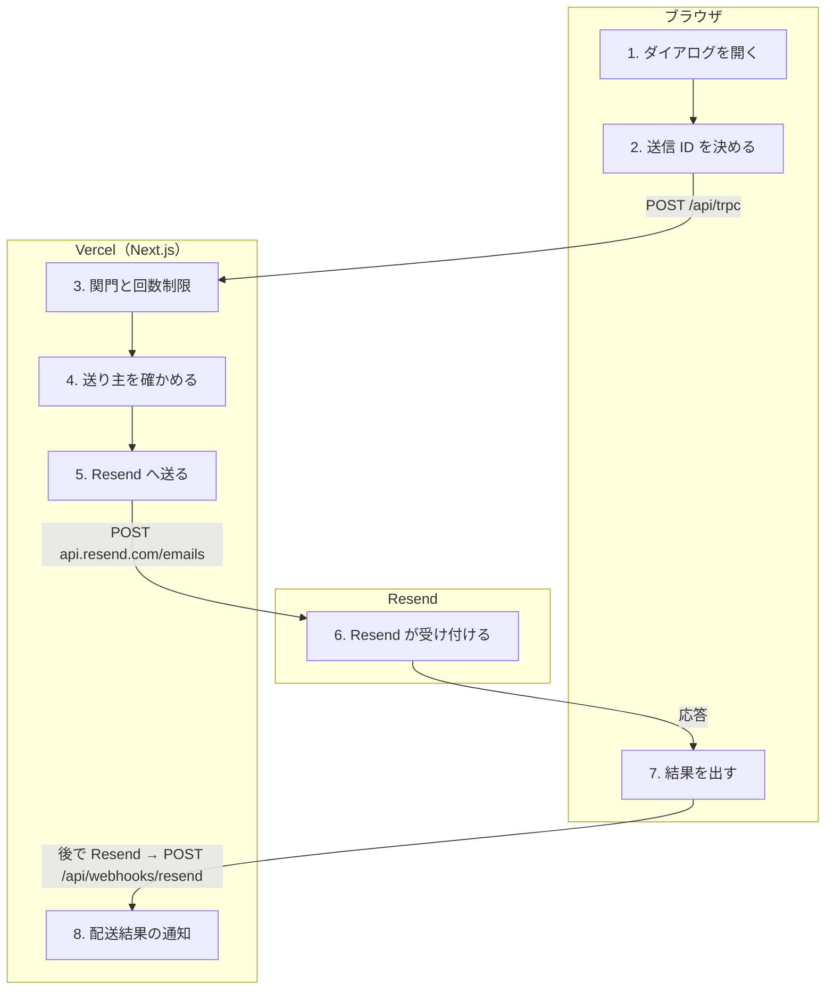

# 問い合わせを送る

<!-- learn:generated:start — 正本 このファイルの learn:journey の JSON / 再生成 pnpm learn:generate / 検証 pnpm docs:check。この範囲は手編集しない -->

ログイン中にメニューの「お問い合わせ」から送る。内容は DB に保存せず、Resend 経由で support@dayopt.app へメールとして届けるだけ。配送するのは Production だけで、Preview / 開発環境では必ず失敗する。LP（apps/web）のフォームは別の経路。



通るサービス: ブラウザ / Vercel（Next.js） / Resend。段 8・失敗 9 種。

#### この経路を守るテスト

- 経路全体を通しで守るテストは紐付いていない（段ごとのテストを見る）

### 1. メニューからお問い合わせダイアログを開く（ブラウザ）

サイドバーのユーザーメニュー（モバイルはアカウント画面）の「お問い合わせ」で、アプリ全体に 1 つあるダイアログを開く。カテゴリとメッセージを入れる。メッセージが 10 文字未満なら送らずにその場で知らせる。OS・ブラウザ・タイムゾーン・言語・アプリの版は自動で集めて添える。

- **なぜ必要か**: 再現に要る環境情報を、利用者に聞き直さずに受け取るため。
- **入力 → 出力**: カテゴリ、メッセージ → { category, message }（と自動収集した environment）
- **ここを変えると**: 入力の上限（10〜5000 文字、環境情報の各長さ）はサーバーの zod schema が正本で、画面の 10 文字検査はその写し。カテゴリを足す時は schema、件名の対応表、翻訳を揃える。
- **コード**:
  - [`apps/product/src/components/shell/sidebar/UserMenu.tsx`](../../../apps/product/src/components/shell/sidebar/UserMenu.tsx) で `openSheet({ type: 'contact' })` を探す
  - [`apps/product/src/features/contact/components/ContactDialogContent.tsx`](../../../apps/product/src/features/contact/components/ContactDialogContent.tsx) で `if (message.trim().length < 10) {` を探す
  - [`apps/product/src/features/contact/schemas.ts`](../../../apps/product/src/features/contact/schemas.ts) で `message: z.string().min(10).max(5000),` を探す

<details>
<summary>⚡ メッセージが 10 文字未満 — 画面: 押せない / データ: 変化なし / 再試行: 利用者がやり直す / 痕跡: 残らない</summary>

- 画面: 入力欄の下に「10文字以上で入力してください」。
- データ: 変化なし。サーバーへは何も送っていない。
- 再試行: 利用者が書き足す。
- 痕跡: 何も残らない（通信前）。
- **最初に見る場所**: 不要。
- 根拠:
  - [`apps/product/src/features/contact/components/ContactDialogContent.tsx`](../../../apps/product/src/features/contact/components/ContactDialogContent.tsx) で `setError(labels.messageMinLength);` を探す

</details>

### 2. 送信 ID（submissionId）を決めて送る（ブラウザ）

送るたびに内容（カテゴリ・本文・環境情報）を比べ、前回と同じなら前回の submissionId を使い回し、違えば新しい UUID を作る。ダイアログを閉じると ID を捨てる。contact.submit を呼ぶ。楽観的更新はしない（送信中はボタンが処理中になる）。

- **なぜ必要か**: 時間切れで失敗したように見えても実際には届いていることがある。同じ内容の再送は同じ ID にして、下の段の Idempotency-Key で二重配送を防ぐ。
- **入力 → 出力**: { category, message }、environment → contact.submit({ submissionId, category, message, environment })
- **ここを変えると**: ID を使い回す条件を広げると、別の問い合わせが前の送信と同じ扱いになって Resend に捨てられる。狭めると、再送で同じメールが 2 通届く。
- **コード**:
  - [`apps/product/src/features/contact/components/ContactDialog.tsx`](../../../apps/product/src/features/contact/components/ContactDialog.tsx) で `previousAttempt?.payloadKey === payloadKey` を探す
  - [`apps/product/src/features/contact/components/ContactDialog.tsx`](../../../apps/product/src/features/contact/components/ContactDialog.tsx) で `if (!open) submissionAttemptRef.current = null;` を探す
- **この段を守るテスト**:
  - [`apps/product/src/features/contact/components/ContactDialog.test.tsx`](../../../apps/product/src/features/contact/components/ContactDialog.test.tsx) で `it('reuses an ID only while the Product contact intent stays unchanged'` を探す

<details>
<summary>⚡ 時間切れの後、閉じて開き直して送る — 画面: 何も起きない / データ: 保存される / 再試行: 利用者がやり直す / 痕跡: 残らない</summary>

- 画面: 送信成功の toast。
- データ: 最初の送信が実は届いていた場合、新しい ID なので 2 通目も届く。
- 再試行: 利用者がやり直した結果。
- 痕跡: 何も残らない（support のメールボックスに重複が見えるだけ）。
- **最初に見る場所**: 仕様どおり。ID を持つのはダイアログを開いている間だけ。
- 根拠:
  - [`apps/product/src/features/contact/components/ContactDialog.tsx`](../../../apps/product/src/features/contact/components/ContactDialog.tsx) で `: crypto.randomUUID();` を探す

</details>

### 3. ログインと送信回数を確かめる（Vercel（Next.js））

protectedProcedure でログインを確かめる。contact.submit は利用権が切れていても通す管理操作の一覧に入っている（write fence は他の mutation と同じく止める）。続けて Upstash で本人 1 時間 5 回、全体 1 時間 60 回の回数制限を見る。

- **なぜ必要か**: 問い合わせは課金が切れた人にも必要な出口なので利用権では止めない。一方でメール送信は外部の費用とメールボックスを消費するので、本人単位と全体の両方で上限を置く。
- **入力 → 出力**: 送信内容と本人のセッション → 通過 / 429 / 503
- **ここを変えると**: Production のビルドは Upstash の env を必須にしているので、Production で回数制限が素通りになることはない。Preview では Upstash が無いと回数制限を飛ばすが、そもそも配送しない。
- **コード**:
  - [`apps/product/src/lib/billing/operation-access.ts`](../../../apps/product/src/lib/billing/operation-access.ts) で `'contact.submit',` を探す
  - [`apps/product/src/features/contact/server/router.ts`](../../../apps/product/src/features/contact/server/router.ts) で `await enforceContactRateLimit(contactGlobalRateLimit, 'global');` を探す
  - [`apps/product/src/lib/rate-limit/upstash.ts`](../../../apps/product/src/lib/rate-limit/upstash.ts) で `Ratelimit.slidingWindow(5, '1 h'),` を探す
- **この段を守るテスト**:
  - [`apps/product/src/features/contact/server/router.test.ts`](../../../apps/product/src/features/contact/server/router.test.ts) で `describe('contact router rate-limit availability'` を探す

<details>
<summary>⚡ 送信回数の上限を超える（429） — 画面: エラー表示 / データ: 変化なし / 再試行: 利用者がやり直す / 痕跡: 残らない</summary>

- 画面: 「送信回数が上限に達しました。しばらくしてからお試しください」の toast。入力は残る。
- データ: 送らない。
- 再試行: 時間を置いて利用者が送り直す。
- 痕跡: 想定内（TOO_MANY_REQUESTS）なので Sentry には出ない。
- **最初に見る場所**: 全体の 60 回に当たっているなら、誰かが大量に送っていないか。
- 根拠:
  - [`apps/product/src/features/contact/components/ContactDialog.tsx`](../../../apps/product/src/features/contact/components/ContactDialog.tsx) で `toast.error(t('contact.rateLimited'));` を探す

</details>

<details>
<summary>⚡ Upstash（Redis）に届かない — 画面: エラー表示 / データ: 変化なし / 再試行: 利用者がやり直す / 痕跡: Sentry</summary>

- 画面: 「メッセージを送信できませんでした。入力内容は残っています。もう一度お試しください」の toast。
- データ: 送らない（回数を確かめられない時は通さない）。
- 再試行: 利用者が送り直す。
- 痕跡: Sentry（SERVICE_UNAVAILABLE。write fence 以外の 503 は想定外として送る）。
- **最初に見る場所**: Upstash の状態。
- 根拠:
  - [`apps/product/src/features/contact/server/router.ts`](../../../apps/product/src/features/contact/server/router.ts) で `message: 'Contact rate-limit service is unavailable',` を探す

</details>

### 4. 送り主のメールと名前をサーバーで取る（Vercel（Next.js））

Supabase Auth から本人を取り直し、メールアドレスを返信先に使う。名前は user_metadata の full_name（無ければ Unknown、100 文字まで）。送り主の情報はブラウザからは受け取らない。

- **なぜ必要か**: 返信先をブラウザの入力に任せると、他人のアドレスを返信先にできてしまうため。
- **入力 → 出力**: 本人のセッション → userEmail、userName
- **ここを変えると**: 返信先のアドレスは service 側でも検査する（改行やカンマで宛先を増やせないように）。
- **コード**:
  - [`apps/product/src/features/contact/server/router.ts`](../../../apps/product/src/features/contact/server/router.ts) で `observeAuthOperation('contact_get_user', () => ctx.supabase.auth.getUser())` を探す
  - [`apps/product/src/features/contact/server/router.ts`](../../../apps/product/src/features/contact/server/router.ts) で `await deliverContactFeedback({` を探す

### 5. Resend の REST API へ 1 通送る（Vercel（Next.js））

VERCEL_ENV が production でなければ送らずに失敗する。RESEND_API_KEY と、dayopt.app ドメインの RESEND_FROM_EMAIL（Resend の見本アドレス onboarding@resend.dev は拒否）を確かめる。本文は環境情報とメッセージを並べた plain text。Idempotency-Key に contact-product-<submissionId> を付け、10 秒で打ち切る。応答に email の id が無ければ失敗とみなす。

- **なぜ必要か**: 問い合わせの個人情報は Resend の payload と運用のメールボックスにだけ置き、ログと Sentry には技術的な文脈だけを残す。打ち切りは、Resend が遅い時に利用者を待たせ続けず、同じ Idempotency-Key で送り直せるようにするため。
- **入力 → 出力**: userEmail、userName、送信内容 → Resend の email id（受け取るだけで保存しない）
- **ここを変えると**: 件名は [Dayopt Contact][Product][カテゴリ] の固定形、tags の source は contact-product。後段の Resend webhook はこの source と宛先で問い合わせの配送だと判定するので、変えると配送失敗が Sentry に出なくなる。LP（apps/web）のフォームは別実装で、Idempotency-Key の名前空間を contact-web- に分けてある。
- **コード**:
  - [`apps/product/src/features/contact/server/contact-service.ts`](../../../apps/product/src/features/contact/server/contact-service.ts) で ``'Idempotency-Key': `contact-product-${input.submissionId}`,`` を探す
  - [`apps/product/src/features/contact/server/contact-service.ts`](../../../apps/product/src/features/contact/server/contact-service.ts) で `const CONTACT_EMAIL_TIMEOUT_MS = 10_000;` を探す
  - [`apps/product/src/features/contact/server/contact-service.ts`](../../../apps/product/src/features/contact/server/contact-service.ts) で `'Contact email delivery is available only in Production',` を探す
  - [`apps/web/src/app/api/contact/contact-email.ts`](../../../apps/web/src/app/api/contact/contact-email.ts) で ``'Idempotency-Key': `contact-web-${input.submissionId}`,`` を探す（LP のフォーム（IP 単位の回数制限・Turnstile 付きの別経路））
- **この段を守るテスト**:
  - [`apps/product/src/features/contact/server/contact-service.test.ts`](../../../apps/product/src/features/contact/server/contact-service.test.ts) で `it('sends a fixed-header plain-text Product contact email'` を探す
  - [`apps/product/src/features/contact/server/contact-service.test.ts`](../../../apps/product/src/features/contact/server/contact-service.test.ts) で `it('stops waiting after ten seconds while retaining the idempotency key for retry'` を探す

<details>
<summary>⚡ Preview / 開発環境で送る — 画面: エラー表示 / データ: 変化なし / 再試行: しない / 痕跡: ログだけ</summary>

- 画面: 送信失敗の toast。
- データ: 送らない（仕様）。
- 再試行: しない。何度送っても同じ。
- 痕跡: 残らない（Function のログだけ）。サーバーの Sentry は VERCEL_ENV=production の時しか初期化されないので、CONTACT_DELIVERY_FAILED が「想定外」に分類されても Preview・開発環境では送られない。
- **最初に見る場所**: 仕様どおり。Preview で配送を試す手段は無い。env が揃っているかは運用手順の preflight で見る。
- 根拠:
  - [`docs/product/specs/contact.md`](../../product/specs/contact.md) で `credentialが存在してもProduction以外では配送しない` を探す
  - [`apps/product/sentry.server.config.ts`](../../../apps/product/sentry.server.config.ts) で `const IS_SENTRY_PRODUCTION = VERCEL_ENV === 'production';` を探す

</details>

<details>
<summary>⚡ Resend が 10 秒以内に応えない — 画面: エラー表示 / データ: どちらもありうる / 再試行: 利用者がやり直す / 痕跡: Sentry</summary>

- 画面: 送信失敗の toast。入力は残る。
- データ: どちらもありうる（Resend 側では受け付けている可能性がある）。
- 再試行: 利用者が送信を押し直す。内容が同じなら同じ Idempotency-Key なので二重には届かない。
- 痕跡: Sentry（tRPC adapter が 1 回だけ送る）。
- **最初に見る場所**: Resend の status と Sentry。Resend 側で Idempotency-Key をどれだけの期間覚えているかはこの教材では未確認。
- 根拠:
  - [`apps/product/src/features/contact/server/contact-service.ts`](../../../apps/product/src/features/contact/server/contact-service.ts) で `throw new Error('Contact email delivery timed out');` を探す

</details>

<details>
<summary>⚡ 送信元アドレスや API key が不正 — 画面: エラー表示 / データ: 変化なし / 再試行: しない / 痕跡: Sentry</summary>

- 画面: 送信失敗の toast。
- データ: 送らない。
- 再試行: env を直すまで何度送っても同じ。
- 痕跡: Sentry。
- **最初に見る場所**: Vercel Production の RESEND_API_KEY / RESEND_FROM_EMAIL。運用手順は contact-email.md。
- 根拠:
  - [`apps/product/src/features/contact/server/contact-service.ts`](../../../apps/product/src/features/contact/server/contact-service.ts) で `fromResult.data === 'onboarding@resend.dev'` を探す
  - [`docs/operations/contact-email.md`](../../operations/contact-email.md) で `## 3. Merge前のProduction preflight` を探す

</details>

### 6. Resend が受け付けて support@dayopt.app へ配送する（Resend）

宛先は support@dayopt.app、返信先は送り主のメール。メールボックスで返信すると本人へ届く。受け付けた時点で id を返し、実際の配送は非同期。

- **なぜ必要か**: 問い合わせを DB やチケット管理に持たず、運用のメールボックス 1 つに集めるため。
- **入力 → 出力**: email の payload と Idempotency-Key → { id }（受付）
- **ここを変えると**: 宛先は packages/config の supportEmail が正本。変えると Resend webhook の判定（宛先一致）も同時に変わる。
- **コード**:
  - [`packages/config/src/constants.ts`](../../../packages/config/src/constants.ts) で `supportEmail: 'support@dayopt.app',` を探す
  - [`apps/product/src/features/contact/server/contact-service.ts`](../../../apps/product/src/features/contact/server/contact-service.ts) で `reply_to: replyToResult.data,` を探す

<details>
<summary>⚡ Resend がエラーを返す — 画面: エラー表示 / データ: 変化なし / 再試行: 利用者がやり直す / 痕跡: Sentry</summary>

- 画面: 送信失敗の toast。入力は残る。
- データ: 送らない。
- 再試行: 利用者が送り直す。
- 痕跡: Sentry（応答の本文は残さない）。
- **最初に見る場所**: Resend の Dashboard と status。
- 根拠:
  - [`apps/product/src/features/contact/server/contact-service.ts`](../../../apps/product/src/features/contact/server/contact-service.ts) で `'Contact email provider returned an unsuccessful response',` を探す

</details>

### 7. 結果を toast で知らせる（ブラウザ）

成功なら「メッセージを送信しました」を出してダイアログを閉じ、ID を捨てる。失敗ならダイアログを開いたまま、429 だけ回数上限の文言、それ以外は「入力内容は残っています」の文言を出す。

- **なぜ必要か**: 失敗時に本文を消さず、そのまま送り直せるようにするため。
- **入力 → 出力**: { success: true } か tRPC エラー → toast、ダイアログの開閉
- **ここを変えると**: エラーの種類ごとに文言を増やす時は、error.data.code の分岐をここに足す。
- **コード**:
  - [`apps/product/src/features/contact/components/ContactDialog.tsx`](../../../apps/product/src/features/contact/components/ContactDialog.tsx) で `toast.success(t('contact.submitSuccess'));` を探す
  - [`apps/product/src/features/contact/components/ContactDialog.tsx`](../../../apps/product/src/features/contact/components/ContactDialog.tsx) で `toast.error(t('contact.submitError'));` を探す

### 8. （後で）配送できなかったら Resend webhook で知る（Vercel（Next.js））

Resend は配送の結果を webhook で送ってくる。宛先が support@dayopt.app で source が contact-product の bounced / complained / failed / suppressed は、問い合わせの配送失敗として Sentry へ送る（通常のメールのように送信停止リストには入れない）。LP 発（contact-web）の event は Web 側の webhook に任せる。

- **なぜ必要か**: 利用者には成功と出た後で届かなかったことを、運用側が気づけるようにするため。
- **入力 → 出力**: Resend の配送 event（署名付き） → Sentry の issue（operation: email_delivery_status）
- **ここを変えると**: tags の source や宛先を変えると、ここで問い合わせと判定できず、support 宛てのアドレスが送信停止リストに入りうる。
- **コード**:
  - [`apps/product/src/app/api/webhooks/resend/route.ts`](../../../apps/product/src/app/api/webhooks/resend/route.ts) で `function isContactDelivery(data: EmailEventData, source: string): boolean {` を探す
  - [`apps/product/src/app/api/webhooks/resend/route.ts`](../../../apps/product/src/app/api/webhooks/resend/route.ts) で `operation: 'email_delivery_status',` を探す
- **この段を守るテスト**:
  - [`apps/product/src/app/api/webhooks/resend/route.test.ts`](../../../apps/product/src/app/api/webhooks/resend/route.test.ts) で `it('leaves Web contact events to the Web-specific endpoint'` を探す

<details>
<summary>⚡ support のメールボックスへ届かない — 画面: 何も起きない / データ: 欠落する / 再試行: しない / 痕跡: Sentry</summary>

- 画面: 利用者には成功の toast が出たまま。
- データ: 問い合わせは失われる（DB に写しは無い）。
- 再試行: しない。
- 痕跡: Sentry（source: resend_webhook）。
- **最初に見る場所**: support@dayopt.app の受信設定（Cloudflare のメール転送など）。contact-email.md。
- 根拠:
  - [`docs/operations/contact-email.md`](../../operations/contact-email.md) で `` `support@dayopt.app`の受信、返信、フォーム配送 `` を探す

</details>

<!-- learn:generated:end -->

## データ（正本）

この JSON がこのページの正本。上の説明と図、`pnpm learn` の対話画面はここから生成する。参照（`path` + `find`）は `pnpm docs:check` が実在を検査する。

```json learn:journey
{
  "id": "contact",
  "title": "問い合わせを送る",
  "order": 120,
  "group": "integration",
  "intro": "ログイン中にメニューの「お問い合わせ」から送る。内容は DB に保存せず、Resend 経由で support@dayopt.app へメールとして届けるだけ。配送するのは Production だけで、Preview / 開発環境では必ず失敗する。LP（apps/web）のフォームは別の経路。",
  "play": "▶ 送信を押す",
  "lanes": ["browser", "vercel", "resend"],
  "hops": [
    {
      "id": "open-dialog",
      "svc": "browser",
      "short": "ダイアログを開く",
      "title": "メニューからお問い合わせダイアログを開く",
      "what": "サイドバーのユーザーメニュー（モバイルはアカウント画面）の「お問い合わせ」で、アプリ全体に 1 つあるダイアログを開く。カテゴリとメッセージを入れる。メッセージが 10 文字未満なら送らずにその場で知らせる。OS・ブラウザ・タイムゾーン・言語・アプリの版は自動で集めて添える。",
      "why": "再現に要る環境情報を、利用者に聞き直さずに受け取るため。",
      "io": {
        "in": "カテゴリ、メッセージ",
        "out": "{ category, message }（と自動収集した environment）"
      },
      "change": "入力の上限（10〜5000 文字、環境情報の各長さ）はサーバーの zod schema が正本で、画面の 10 文字検査はその写し。カテゴリを足す時は schema、件名の対応表、翻訳を揃える。",
      "screen": {
        "t": "form",
        "url": "/ja/calendar",
        "title": "お問い合わせ",
        "fields": [
          ["カテゴリ", "バグ報告"],
          ["メッセージ", "例: ダッシュボードの表示が崩れる"]
        ],
        "button": "送信",
        "alt": "キャンセル"
      },
      "refs": [
        {
          "path": "apps/product/src/components/shell/sidebar/UserMenu.tsx",
          "find": "openSheet({ type: 'contact' })"
        },
        {
          "path": "apps/product/src/features/contact/components/ContactDialogContent.tsx",
          "find": "if (message.trim().length < 10) {"
        },
        {
          "path": "apps/product/src/features/contact/schemas.ts",
          "find": "message: z.string().min(10).max(5000),"
        }
      ],
      "fails": [
        {
          "id": "too-short",
          "label": "メッセージが 10 文字未満",
          "screen": "入力欄の下に「10文字以上で入力してください」。",
          "data": "変化なし。サーバーへは何も送っていない。",
          "retry": "利用者が書き足す。",
          "trace": "何も残らない（通信前）。",
          "look": "不要。",
          "refs": [
            {
              "path": "apps/product/src/features/contact/components/ContactDialogContent.tsx",
              "find": "setError(labels.messageMinLength);"
            }
          ],
          "tags": {
            "screen": "blocked",
            "data": "unchanged",
            "retry": "user",
            "trace": "none"
          },
          "screenAfter": {
            "t": "form",
            "url": "/ja/calendar",
            "title": "お問い合わせ",
            "fields": [
              ["カテゴリ", "バグ報告"],
              ["メッセージ", "壊れた"]
            ],
            "button": "送信",
            "error": "10文字以上で入力してください"
          }
        }
      ]
    },
    {
      "id": "submission-id",
      "svc": "browser",
      "short": "送信 ID を決める",
      "title": "送信 ID（submissionId）を決めて送る",
      "what": "送るたびに内容（カテゴリ・本文・環境情報）を比べ、前回と同じなら前回の submissionId を使い回し、違えば新しい UUID を作る。ダイアログを閉じると ID を捨てる。contact.submit を呼ぶ。楽観的更新はしない（送信中はボタンが処理中になる）。",
      "why": "時間切れで失敗したように見えても実際には届いていることがある。同じ内容の再送は同じ ID にして、下の段の Idempotency-Key で二重配送を防ぐ。",
      "io": {
        "in": "{ category, message }、environment",
        "out": "contact.submit({ submissionId, category, message, environment })"
      },
      "change": "ID を使い回す条件を広げると、別の問い合わせが前の送信と同じ扱いになって Resend に捨てられる。狭めると、再送で同じメールが 2 通届く。",
      "refs": [
        {
          "path": "apps/product/src/features/contact/components/ContactDialog.tsx",
          "find": "previousAttempt?.payloadKey === payloadKey"
        },
        {
          "path": "apps/product/src/features/contact/components/ContactDialog.tsx",
          "find": "if (!open) submissionAttemptRef.current = null;"
        }
      ],
      "tests": [
        {
          "path": "apps/product/src/features/contact/components/ContactDialog.test.tsx",
          "find": "it('reuses an ID only while the Product contact intent stays unchanged'"
        }
      ],
      "fails": [
        {
          "id": "reopen-resend",
          "label": "時間切れの後、閉じて開き直して送る",
          "screen": "送信成功の toast。",
          "data": "最初の送信が実は届いていた場合、新しい ID なので 2 通目も届く。",
          "retry": "利用者がやり直した結果。",
          "trace": "何も残らない（support のメールボックスに重複が見えるだけ）。",
          "look": "仕様どおり。ID を持つのはダイアログを開いている間だけ。",
          "refs": [
            {
              "path": "apps/product/src/features/contact/components/ContactDialog.tsx",
              "find": ": crypto.randomUUID();"
            }
          ],
          "tags": {
            "screen": "none",
            "data": "saved",
            "retry": "user",
            "trace": "none"
          },
          "continues": true
        }
      ]
    },
    {
      "id": "gate",
      "svc": "vercel",
      "short": "関門と回数制限",
      "via": "POST /api/trpc",
      "title": "ログインと送信回数を確かめる",
      "what": "protectedProcedure でログインを確かめる。contact.submit は利用権が切れていても通す管理操作の一覧に入っている（write fence は他の mutation と同じく止める）。続けて Upstash で本人 1 時間 5 回、全体 1 時間 60 回の回数制限を見る。",
      "why": "問い合わせは課金が切れた人にも必要な出口なので利用権では止めない。一方でメール送信は外部の費用とメールボックスを消費するので、本人単位と全体の両方で上限を置く。",
      "io": {
        "in": "送信内容と本人のセッション",
        "out": "通過 / 429 / 503"
      },
      "change": "Production のビルドは Upstash の env を必須にしているので、Production で回数制限が素通りになることはない。Preview では Upstash が無いと回数制限を飛ばすが、そもそも配送しない。",
      "refs": [
        {
          "path": "apps/product/src/lib/billing/operation-access.ts",
          "find": "'contact.submit',"
        },
        {
          "path": "apps/product/src/features/contact/server/router.ts",
          "find": "await enforceContactRateLimit(contactGlobalRateLimit, 'global');"
        },
        {
          "path": "apps/product/src/lib/rate-limit/upstash.ts",
          "find": "Ratelimit.slidingWindow(5, '1 h'),"
        }
      ],
      "tests": [
        {
          "path": "apps/product/src/features/contact/server/router.test.ts",
          "find": "describe('contact router rate-limit availability'"
        }
      ],
      "fails": [
        {
          "id": "rate-limited",
          "label": "送信回数の上限を超える（429）",
          "screen": "「送信回数が上限に達しました。しばらくしてからお試しください」の toast。入力は残る。",
          "data": "送らない。",
          "retry": "時間を置いて利用者が送り直す。",
          "trace": "想定内（TOO_MANY_REQUESTS）なので Sentry には出ない。",
          "look": "全体の 60 回に当たっているなら、誰かが大量に送っていないか。",
          "refs": [
            {
              "path": "apps/product/src/features/contact/components/ContactDialog.tsx",
              "find": "toast.error(t('contact.rateLimited'));"
            }
          ],
          "tags": {
            "screen": "toast",
            "data": "unchanged",
            "retry": "user",
            "trace": "none"
          },
          "to": "result",
          "back": "上限の案内",
          "screenAfter": {
            "t": "form",
            "url": "/ja/calendar",
            "title": "お問い合わせ",
            "fields": [
              ["カテゴリ", "バグ報告"],
              ["メッセージ", "（入力した本文が残る）"]
            ],
            "button": "送信",
            "toast": "送信回数が上限に達しました。しばらくしてからお試しください",
            "toastTone": "bad"
          }
        },
        {
          "id": "upstash-down",
          "label": "Upstash（Redis）に届かない",
          "screen": "「メッセージを送信できませんでした。入力内容は残っています。もう一度お試しください」の toast。",
          "data": "送らない（回数を確かめられない時は通さない）。",
          "retry": "利用者が送り直す。",
          "trace": "Sentry（SERVICE_UNAVAILABLE。write fence 以外の 503 は想定外として送る）。",
          "look": "Upstash の状態。",
          "refs": [
            {
              "path": "apps/product/src/features/contact/server/router.ts",
              "find": "message: 'Contact rate-limit service is unavailable',"
            }
          ],
          "tags": {
            "screen": "toast",
            "data": "unchanged",
            "retry": "user",
            "trace": "sentry"
          },
          "to": "result",
          "back": "送信失敗の案内"
        }
      ]
    },
    {
      "id": "router",
      "svc": "vercel",
      "short": "送り主を確かめる",
      "title": "送り主のメールと名前をサーバーで取る",
      "what": "Supabase Auth から本人を取り直し、メールアドレスを返信先に使う。名前は user_metadata の full_name（無ければ Unknown、100 文字まで）。送り主の情報はブラウザからは受け取らない。",
      "why": "返信先をブラウザの入力に任せると、他人のアドレスを返信先にできてしまうため。",
      "io": {
        "in": "本人のセッション",
        "out": "userEmail、userName"
      },
      "change": "返信先のアドレスは service 側でも検査する（改行やカンマで宛先を増やせないように）。",
      "refs": [
        {
          "path": "apps/product/src/features/contact/server/router.ts",
          "find": "observeAuthOperation('contact_get_user', () => ctx.supabase.auth.getUser())"
        },
        {
          "path": "apps/product/src/features/contact/server/router.ts",
          "find": "await deliverContactFeedback({"
        }
      ],
      "fails": []
    },
    {
      "id": "send",
      "svc": "vercel",
      "short": "Resend へ送る",
      "title": "Resend の REST API へ 1 通送る",
      "what": "VERCEL_ENV が production でなければ送らずに失敗する。RESEND_API_KEY と、dayopt.app ドメインの RESEND_FROM_EMAIL（Resend の見本アドレス onboarding@resend.dev は拒否）を確かめる。本文は環境情報とメッセージを並べた plain text。Idempotency-Key に contact-product-<submissionId> を付け、10 秒で打ち切る。応答に email の id が無ければ失敗とみなす。",
      "why": "問い合わせの個人情報は Resend の payload と運用のメールボックスにだけ置き、ログと Sentry には技術的な文脈だけを残す。打ち切りは、Resend が遅い時に利用者を待たせ続けず、同じ Idempotency-Key で送り直せるようにするため。",
      "io": {
        "in": "userEmail、userName、送信内容",
        "out": "Resend の email id（受け取るだけで保存しない）"
      },
      "change": "件名は [Dayopt Contact][Product][カテゴリ] の固定形、tags の source は contact-product。後段の Resend webhook はこの source と宛先で問い合わせの配送だと判定するので、変えると配送失敗が Sentry に出なくなる。LP（apps/web）のフォームは別実装で、Idempotency-Key の名前空間を contact-web- に分けてある。",
      "refs": [
        {
          "path": "apps/product/src/features/contact/server/contact-service.ts",
          "find": "'Idempotency-Key': `contact-product-${input.submissionId}`,"
        },
        {
          "path": "apps/product/src/features/contact/server/contact-service.ts",
          "find": "const CONTACT_EMAIL_TIMEOUT_MS = 10_000;"
        },
        {
          "path": "apps/product/src/features/contact/server/contact-service.ts",
          "find": "'Contact email delivery is available only in Production',"
        },
        {
          "path": "apps/web/src/app/api/contact/contact-email.ts",
          "find": "'Idempotency-Key': `contact-web-${input.submissionId}`,",
          "why": "LP のフォーム（IP 単位の回数制限・Turnstile 付きの別経路）"
        }
      ],
      "tests": [
        {
          "path": "apps/product/src/features/contact/server/contact-service.test.ts",
          "find": "it('sends a fixed-header plain-text Product contact email'"
        },
        {
          "path": "apps/product/src/features/contact/server/contact-service.test.ts",
          "find": "it('stops waiting after ten seconds while retaining the idempotency key for retry'"
        }
      ],
      "fails": [
        {
          "id": "not-production",
          "label": "Preview / 開発環境で送る",
          "screen": "送信失敗の toast。",
          "data": "送らない（仕様）。",
          "retry": "しない。何度送っても同じ。",
          "trace": "残らない（Function のログだけ）。サーバーの Sentry は VERCEL_ENV=production の時しか初期化されないので、CONTACT_DELIVERY_FAILED が「想定外」に分類されても Preview・開発環境では送られない。",
          "look": "仕様どおり。Preview で配送を試す手段は無い。env が揃っているかは運用手順の preflight で見る。",
          "refs": [
            {
              "path": "docs/product/specs/contact.md",
              "find": "credentialが存在してもProduction以外では配送しない"
            },
            {
              "path": "apps/product/sentry.server.config.ts",
              "find": "const IS_SENTRY_PRODUCTION = VERCEL_ENV === 'production';"
            }
          ],
          "tags": {
            "screen": "toast",
            "data": "unchanged",
            "retry": "none",
            "trace": "log"
          },
          "to": "result",
          "back": "送信失敗の案内"
        },
        {
          "id": "timeout",
          "label": "Resend が 10 秒以内に応えない",
          "screen": "送信失敗の toast。入力は残る。",
          "data": "どちらもありうる（Resend 側では受け付けている可能性がある）。",
          "retry": "利用者が送信を押し直す。内容が同じなら同じ Idempotency-Key なので二重には届かない。",
          "trace": "Sentry（tRPC adapter が 1 回だけ送る）。",
          "look": "Resend の status と Sentry。Resend 側で Idempotency-Key をどれだけの期間覚えているかはこの教材では未確認。",
          "refs": [
            {
              "path": "apps/product/src/features/contact/server/contact-service.ts",
              "find": "throw new Error('Contact email delivery timed out');"
            }
          ],
          "tags": {
            "screen": "toast",
            "data": "unknown",
            "retry": "user",
            "trace": "sentry"
          },
          "to": "result",
          "back": "送信失敗の案内"
        },
        {
          "id": "bad-config",
          "label": "送信元アドレスや API key が不正",
          "screen": "送信失敗の toast。",
          "data": "送らない。",
          "retry": "env を直すまで何度送っても同じ。",
          "trace": "Sentry。",
          "look": "Vercel Production の RESEND_API_KEY / RESEND_FROM_EMAIL。運用手順は contact-email.md。",
          "refs": [
            {
              "path": "apps/product/src/features/contact/server/contact-service.ts",
              "find": "fromResult.data === 'onboarding@resend.dev'"
            },
            {
              "path": "docs/operations/contact-email.md",
              "find": "## 3. Merge前のProduction preflight"
            }
          ],
          "tags": {
            "screen": "toast",
            "data": "unchanged",
            "retry": "none",
            "trace": "sentry"
          },
          "to": "result",
          "back": "送信失敗の案内"
        }
      ]
    },
    {
      "id": "resend-accept",
      "svc": "resend",
      "short": "Resend が受け付ける",
      "via": "POST api.resend.com/emails",
      "title": "Resend が受け付けて support@dayopt.app へ配送する",
      "what": "宛先は support@dayopt.app、返信先は送り主のメール。メールボックスで返信すると本人へ届く。受け付けた時点で id を返し、実際の配送は非同期。",
      "why": "問い合わせを DB やチケット管理に持たず、運用のメールボックス 1 つに集めるため。",
      "io": {
        "in": "email の payload と Idempotency-Key",
        "out": "{ id }（受付）"
      },
      "change": "宛先は packages/config の supportEmail が正本。変えると Resend webhook の判定（宛先一致）も同時に変わる。",
      "refs": [
        {
          "path": "packages/config/src/constants.ts",
          "find": "supportEmail: 'support@dayopt.app',"
        },
        {
          "path": "apps/product/src/features/contact/server/contact-service.ts",
          "find": "reply_to: replyToResult.data,"
        }
      ],
      "fails": [
        {
          "id": "resend-error",
          "label": "Resend がエラーを返す",
          "screen": "送信失敗の toast。入力は残る。",
          "data": "送らない。",
          "retry": "利用者が送り直す。",
          "trace": "Sentry（応答の本文は残さない）。",
          "look": "Resend の Dashboard と status。",
          "refs": [
            {
              "path": "apps/product/src/features/contact/server/contact-service.ts",
              "find": "'Contact email provider returned an unsuccessful response',"
            }
          ],
          "tags": {
            "screen": "toast",
            "data": "unchanged",
            "retry": "user",
            "trace": "sentry"
          },
          "to": "result",
          "back": "送信失敗の案内"
        }
      ]
    },
    {
      "id": "result",
      "svc": "browser",
      "short": "結果を出す",
      "via": "応答",
      "title": "結果を toast で知らせる",
      "what": "成功なら「メッセージを送信しました」を出してダイアログを閉じ、ID を捨てる。失敗ならダイアログを開いたまま、429 だけ回数上限の文言、それ以外は「入力内容は残っています」の文言を出す。",
      "why": "失敗時に本文を消さず、そのまま送り直せるようにするため。",
      "io": {
        "in": "{ success: true } か tRPC エラー",
        "out": "toast、ダイアログの開閉"
      },
      "change": "エラーの種類ごとに文言を増やす時は、error.data.code の分岐をここに足す。",
      "screen": {
        "t": "calendar",
        "url": "/ja/calendar",
        "blocks": [],
        "toast": "メッセージを送信しました"
      },
      "refs": [
        {
          "path": "apps/product/src/features/contact/components/ContactDialog.tsx",
          "find": "toast.success(t('contact.submitSuccess'));"
        },
        {
          "path": "apps/product/src/features/contact/components/ContactDialog.tsx",
          "find": "toast.error(t('contact.submitError'));"
        }
      ],
      "fails": []
    },
    {
      "id": "delivery-status",
      "svc": "vercel",
      "short": "配送結果の通知",
      "via": "後で Resend → POST /api/webhooks/resend",
      "title": "（後で）配送できなかったら Resend webhook で知る",
      "what": "Resend は配送の結果を webhook で送ってくる。宛先が support@dayopt.app で source が contact-product の bounced / complained / failed / suppressed は、問い合わせの配送失敗として Sentry へ送る（通常のメールのように送信停止リストには入れない）。LP 発（contact-web）の event は Web 側の webhook に任せる。",
      "why": "利用者には成功と出た後で届かなかったことを、運用側が気づけるようにするため。",
      "io": {
        "in": "Resend の配送 event（署名付き）",
        "out": "Sentry の issue（operation: email_delivery_status）"
      },
      "change": "tags の source や宛先を変えると、ここで問い合わせと判定できず、support 宛てのアドレスが送信停止リストに入りうる。",
      "refs": [
        {
          "path": "apps/product/src/app/api/webhooks/resend/route.ts",
          "find": "function isContactDelivery(data: EmailEventData, source: string): boolean {"
        },
        {
          "path": "apps/product/src/app/api/webhooks/resend/route.ts",
          "find": "operation: 'email_delivery_status',"
        }
      ],
      "tests": [
        {
          "path": "apps/product/src/app/api/webhooks/resend/route.test.ts",
          "find": "it('leaves Web contact events to the Web-specific endpoint'"
        }
      ],
      "fails": [
        {
          "id": "bounced",
          "label": "support のメールボックスへ届かない",
          "screen": "利用者には成功の toast が出たまま。",
          "data": "問い合わせは失われる（DB に写しは無い）。",
          "retry": "しない。",
          "trace": "Sentry（source: resend_webhook）。",
          "look": "support@dayopt.app の受信設定（Cloudflare のメール転送など）。contact-email.md。",
          "refs": [
            {
              "path": "docs/operations/contact-email.md",
              "find": "`support@dayopt.app`の受信、返信、フォーム配送"
            }
          ],
          "tags": {
            "screen": "none",
            "data": "lost",
            "retry": "none",
            "trace": "sentry"
          },
          "continues": true
        }
      ]
    }
  ]
}
```
