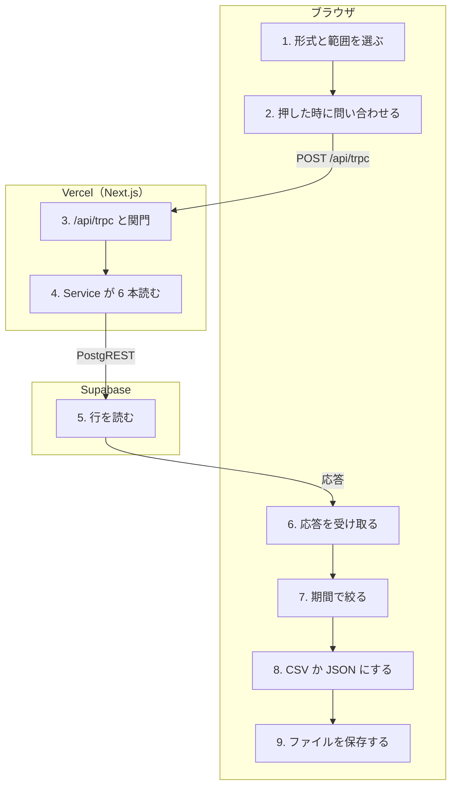

# データを書き出す

<!-- learn:generated:start — 正本 このファイルの learn:journey の JSON / 再生成 pnpm learn:generate / 検証 pnpm docs:check。この範囲は手編集しない -->

設定の「データ」でエクスポートを押すと、サーバーから自分のデータを 1 回で丸ごと受け取り、期間の絞り込みと CSV への変換はブラウザで行ってファイルとして保存する。サーバー側にファイルは作らない。



通るサービス: ブラウザ / Vercel（Next.js） / Supabase。段 9・失敗 6 種。

#### この経路を守るテスト

- [`apps/product/src/features/settings/components/DataSettings.csv-export.test.tsx`](../../../apps/product/src/features/settings/components/DataSettings.csv-export.test.tsx) で `it('exportData の plan / record を安全な CSV Blob としてダウンロードする'` を探す（component test。問い合わせの結果が CSV の Blob になって保存されるまで（期間指定は通っていない））

### 1. 設定の「データ」で形式と範囲を選ぶ（ブラウザ）

/settings/data を開く。PC ではホームへ移って設定のモーダルを開き、モバイルでは戻るボタン付きの画面で出す。形式（JSON / CSV、既定は JSON）と範囲（全期間 / 期間指定、既定は全期間）を選ぶ。この時点では何も取りに行かない。

- **なぜ必要か**: データの持ち出し（GDPR のデータポータビリティ）を、サポートを介さず利用者自身ができるようにするため。
- **入力 → 出力**: 利用者の選択 → 形式・範囲・開始日・終了日（画面の状態だけ）
- **ここを変えると**: 同じ画面の下に、全件削除（deleteBlocks / deleteAllData）がある。こちらは不可逆なので、エクスポートとは別の経路として扱い、ここを変える時に巻き込まない。
- **コード**:
  - [`apps/product/src/app/[locale]/(app)/settings/[category]/page.tsx`](<../../../apps/product/src/app/[locale]/(app)/settings/[category]/page.tsx>) で `PC: ホームにリダイレクトし、設定モーダルを開く` を探す
  - [`apps/product/src/features/settings/components/DataSettings.tsx`](../../../apps/product/src/features/settings/components/DataSettings.tsx) で `const [format, setFormat] = useState<ExportFormat>('json');` を探す
  - [`apps/product/src/features/settings/components/DataSettings.tsx`](../../../apps/product/src/features/settings/components/DataSettings.tsx) で `function DeletionSection` を探す（同じ画面の不可逆な削除（指すだけ））

### 2. 押した時だけ user.exportData を問い合わせる（ブラウザ）

exportData の query は enabled: false で作ってあり、ボタンを押した時に refetch で取りに行く。取り終わるまでボタンは押せず「エクスポート中...」になる。範囲の指定はサーバーへ送らない（input は無い）。

- **なぜ必要か**: 設定を開いただけで全データを運ばないため。範囲を送らないので、サーバーは常に全件を返す。
- **入力 → 出力**: ボタンの押下 → POST /api/trpc（user.exportData、入力なし）
- **ここを変えると**: refetch の結果は例外にならず、失敗しても前回成功した data を持ったまま返る。成否を data の有無だけで判定しているので、ここを触る時は result.isError も見る形にする。
- **コード**:
  - [`apps/product/src/features/settings/components/DataSettings.tsx`](../../../apps/product/src/features/settings/components/DataSettings.tsx) で `const exportDataQuery = api.user.exportData.useQuery(undefined, {` を探す
  - [`apps/product/src/features/settings/components/DataSettings.tsx`](../../../apps/product/src/features/settings/components/DataSettings.tsx) で `const result = await exportDataQuery.refetch();` を探す
  - [`apps/product/src/features/settings/components/DataSettings.tsx`](../../../apps/product/src/features/settings/components/DataSettings.tsx) で `if (!result.data) throw new Error('Export failed');` を探す

<details>
<summary>⚡ 前回成功した後で、今回の取得が失敗する — 画面: 何も起きない / データ: 欠落する / 再試行: 自動で再試行 / 痕跡: Sentry</summary>

- 画面: 「データをエクスポートしました」と出る。失敗は利用者に見えない。
- データ: DB は変化なし。保存されるファイルは前回取得した時点の内容で、その後の変更が入っていない。
- 再試行: query の既定で最大 3 回まで再試行したあと、前回の data のまま進む。
- 痕跡: サーバー側の失敗なら Sentry（feature: account_export）に残るが、画面の成功表示とは結び付かない。
- **最初に見る場所**: コードから読んだ挙動で、実機では未確認。同じ画面で 2 回目以降、またはブラウザに保存された前回の結果が復元された後に起きうる。handleExport の成否判定（result.data の有無）を見る。
- 根拠:
  - [`apps/product/src/features/settings/components/DataSettings.tsx`](../../../apps/product/src/features/settings/components/DataSettings.tsx) で `if (!result.data) throw new Error('Export failed');` を探す
  - [`apps/product/src/lib/trpc/query-client.ts`](../../../apps/product/src/lib/trpc/query-client.ts) で `return failureCount < 3;` を探す
  - [`apps/product/src/lib/tanstack-query/should-persist-query.ts`](../../../apps/product/src/lib/tanstack-query/should-persist-query.ts) で `query.state.status === 'success' &&` を探す

</details>

### 3. /api/trpc で受けて関門を通る（Vercel（Next.js））

context がセッションの cookie から利用者を決め、protectedProcedure がログイン・MFA・ユーザー単位の rate limit を見る。exportData は query なので利用権（課金）の検査は掛からず、利用期間が終わった後も書き出せる。

- **なぜ必要か**: 利用をやめた人も自分のデータを持ち出せるようにするため（mutation だけを課金で止める設計）。
- **入力 → 出力**: HTTP リクエスト（cookie） → ctx（userId と、利用者の権限で動く Supabase client）
- **ここを変えると**: requiresProductAccess を query にも掛けると、課金が切れた利用者がエクスポートできなくなる。operation-access.ts の一覧に user.exportData があるのは mutation 向けの例外表で、query のこの経路には効いていない。
- **コード**:
  - [`apps/product/src/lib/trpc/context.ts`](../../../apps/product/src/lib/trpc/context.ts) で `const { createServerClient } = await import` を探す
  - [`apps/product/src/lib/billing/operation-access.ts`](../../../apps/product/src/lib/billing/operation-access.ts) で `if (type !== 'mutation') return false;` を探す
  - [`apps/product/src/lib/billing/operation-access.ts`](../../../apps/product/src/lib/billing/operation-access.ts) で `'user.exportData',` を探す

<details>
<summary>⚡ セッションが切れている（401） — 画面: 別の画面へ / データ: 変化なし / 再試行: 利用者がやり直す / 痕跡: 残らない</summary>

- 画面: 画面ごとログインへ移動する。
- データ: 変化なし。ファイルは作られない。
- 再試行: しない。ログイン後に元のパスへ戻るので、もう一度押す。
- 痕跡: 残らない（想定内）。
- **最初に見る場所**: query-client.ts の handleAuthError。
- 根拠:
  - [`apps/product/src/lib/trpc/query-client.ts`](../../../apps/product/src/lib/trpc/query-client.ts) で `function handleAuthError` を探す
  - [`apps/product/src/lib/trpc/procedures.ts`](../../../apps/product/src/lib/trpc/procedures.ts) で `code: 'UNAUTHORIZED',` を探す

</details>

### 4. UserService.exportData が 6 種類を並行で読む（Vercel（Next.js））

profile・カテゴリ・アクティビティ・user_settings は利用者の権限の client（RLS が効く）で、Plan と Record は service role の client で読み、どれも ctx の userId で絞る。6 本を並行で投げ、どれか 1 本でも失敗すれば全体を失敗にする（profile と user_settings が未作成なのは失敗にしない）。

- **なぜ必要か**: Plan / Record の RLS は削除済み（deleted_at あり）の行を利用者から隠す。service role で読むので、削除済みの行も deleted_at 付きで書き出される。これが意図かどうかはコード上に説明が無く、未確認。
- **入力 → 出力**: ctx の userId → exportedAt・userId・data（profile / plans / records / categories / activities / userSettings）
- **ここを変えると**: service role は RLS を越えるので、Plan / Record では .eq('user_id', userId) だけが他人のデータとの境界になる（REVIEW-1）。userId は必ず ctx から取り、入力で受けない。列は public-projections の select に限っているので、列を足す時はそこを変える。
- **コード**:
  - [`apps/product/src/features/auth/server/router.ts`](../../../apps/product/src/features/auth/server/router.ts) で `exportData: protectedProcedure` を探す
  - [`apps/product/src/features/auth/server/user-service.ts`](../../../apps/product/src/features/auth/server/user-service.ts) で `const adminClient = createServiceRoleClient();` を探す
  - [`apps/product/src/lib/database/public-projections.ts`](../../../apps/product/src/lib/database/public-projections.ts) で `export const publicRecordSelect =` を探す
  - [`supabase/migrations/20260809015344_optimize_soft_delete_rls_initplan.sql`](../../../supabase/migrations/20260809015344_optimize_soft_delete_rls_initplan.sql) で `ALTER POLICY "Users can view own records" ON public.records` を探す（RLS 側は削除済みを隠す）
- **この段を守るテスト**:
  - [`apps/product/src/features/auth/server/user-service.test.ts`](../../../apps/product/src/features/auth/server/user-service.test.ts) で `it('plans / records / categories / activities / settings をexportする'` を探す
  - [`apps/product/src/features/auth/server/user-service.test.ts`](../../../apps/product/src/features/auth/server/user-service.test.ts) で `it('profileが未作成ならnullとしてexportする'` を探す

### 5. Supabase から各表を読む（Supabase）

各表を 1 回の select で読む。レポートの取得と違い、ページ分けして読み切る処理（collectQueryPages）を通していない。

- **なぜ必要か**: 件数が少ない前提の書き方になっている（理由の記録は見当たらない）。
- **入力 → 出力**: user_id で絞った select → 各表の行
- **ここを変えると**: PostgREST は 1 回の応答の行数に上限（max_rows）があり、超えた分は黙って切られる。local の設定は 1000。Plan / Record が多い利用者に効くので、直すなら collectQueryPages で読み切る。
- **コード**:
  - [`apps/product/src/features/auth/server/user-service.ts`](../../../apps/product/src/features/auth/server/user-service.ts) で `adminClient.from(databaseTables.records).select(publicRecordSelect).eq('user_id', userId),` を探す
  - [`supabase/config.toml`](../../../supabase/config.toml) で `max_rows = 1000` を探す
  - [`apps/product/src/lib/database/collect-query-pages.ts`](../../../apps/product/src/lib/database/collect-query-pages.ts) で `Exhaust a stably ordered query rather than silently accepting the Data API row cap.` を探す（レポート側はこれで読み切っている）

<details>
<summary>⚡ Plan か Record が行数の上限を超える — 画面: 何も起きない / データ: 欠落する / 再試行: しない / 痕跡: 残らない</summary>

- 画面: 成功のトーストが出る。欠けていることは画面に出ない。
- データ: DB は変化なし。ファイルには上限までの行しか入らない（並び順を指定していないので、どの行が落ちるかも決まらない）。
- 再試行: しない。何度押しても同じだけ欠ける。
- 痕跡: 残らない（エラーではない）。
- **最初に見る場所**: local は config.toml の max_rows = 1000。本番の値は未確認（Supabase の API 設定で見る）。書き出したファイルの行数と、DB の件数を比べる。
- 根拠:
  - [`supabase/config.toml`](../../../supabase/config.toml) で `max_rows = 1000` を探す
  - [`apps/product/src/features/auth/server/user-service.ts`](../../../apps/product/src/features/auth/server/user-service.ts) で `adminClient.from('plans').select(publicPlanSelect).eq('user_id', userId),` を探す

</details>

<details>
<summary>⚡ どれかの表の読み取りが失敗する — 画面: エラー表示 / データ: 変化なし / 再試行: 自動で再試行 / 痕跡: Sentry</summary>

- 画面: 数秒「エクスポート中...」のあと「エクスポートできませんでした。もう一度お試しください。」のトースト。
- データ: 変化なし。ファイルは作られない。
- 再試行: query の既定で最大 3 回まで自動で再試行する。それでも駄目なら利用者が押し直す。
- 痕跡: サーバーが Sentry へ送る（feature: account_export、operation: fetch_records 等）。応答は INTERNAL_SERVER_ERROR。
- **最初に見る場所**: Sentry で feature:account_export を探す。前回の成功がこの画面に残っていると、失敗でも成功表示になる（段 2 の失敗）。
- 根拠:
  - [`apps/product/src/features/auth/server/user-service.ts`](../../../apps/product/src/features/auth/server/user-service.ts) で `feature: 'account_export',` を探す
  - [`apps/product/src/lib/trpc/error-code-map.ts`](../../../apps/product/src/lib/trpc/error-code-map.ts) で `EXPORT_FAILED: 'INTERNAL_SERVER_ERROR',` を探す

</details>

### 6. 全データを 1 つの応答で受け取る（ブラウザ）

全データが 1 つの JSON 応答で届き、TanStack Query のキャッシュに入る。永続化の対象から外す指定（meta.persist: false）が無いので、成功した結果はブラウザの IndexedDB にも保存される（利用者単位、最長 2 時間。サインアウトで破棄）。

- **なぜ必要か**: キャッシュと永続化はアプリ全体の既定の動き。エクスポートを特別扱いする指定は置かれていない。
- **入力 → 出力**: exportData の応答 → キャッシュ上のエクスポート結果（IndexedDB にも保存）
- **ここを変えると**: 全データを端末に残したくないなら、useQuery に meta: { persist: false } を付ける。応答の大きさは件数に比例する。Vercel の応答サイズの上限に当たるかは未確認。
- **コード**:
  - [`apps/product/src/lib/tanstack-query/should-persist-query.ts`](../../../apps/product/src/lib/tanstack-query/should-persist-query.ts) で `query.meta?.persist !== false &&` を探す
  - [`apps/product/src/lib/trpc/query-client.ts`](../../../apps/product/src/lib/trpc/query-client.ts) で `gcTime: PERSIST_MAX_AGE_MS` を探す

### 7. 期間指定ならブラウザで絞る（ブラウザ）

範囲が「期間指定」で開始日と終了日の両方が入っている時だけ、Plan と Record を start_at で絞る。開始日は new Date('YYYY-MM-DD')、終了日はブラウザの timezone の 23:59:59.999。どちらかが空なら絞らず全期間になる。カテゴリ・アクティビティ・設定は絞らない。

- **なぜ必要か**: サーバーは範囲を受け取らないので、絞り込みはここだけで行う。
- **入力 → 出力**: キャッシュ上の全データと開始日・終了日 → 絞った Plan / Record（キャッシュの配列を置き換える）
- **ここを変えると**: 日付の境界をブラウザで組んでいて、利用者の timezone 設定を使っていない（timezone.md の禁止パターンに近い書き方）。開始日は UTC の 0 時として読まれ、終了日はブラウザの timezone で閉じるので、両端の扱いが揃っていない。直すなら toTZStartISO / toTZEndISO を利用者の timezone で使う。絞り込みは開始時刻だけで、期間を跨ぐ Plan / Record は開始側の期間にしか入らない。
- **コード**:
  - [`apps/product/src/features/settings/components/DataSettings.tsx`](../../../apps/product/src/features/settings/components/DataSettings.tsx) で `const start = new Date(startDate);` を探す
  - [`apps/product/src/features/settings/components/DataSettings.tsx`](../../../apps/product/src/features/settings/components/DataSettings.tsx) で `end.setHours(23, 59, 59, 999);` を探す
  - [`apps/product/src/features/settings/components/DataSettings.tsx`](../../../apps/product/src/features/settings/components/DataSettings.tsx) で `if (range === 'custom' && startDate && endDate) {` を探す
  - [`docs/engineering/timezone.md`](../../engineering/timezone.md) で `## 禁止パターン一覧` を探す

<details>
<summary>⚡ UTC より東の timezone で期間指定する — 画面: 何も起きない / データ: 欠落する / 再試行: 利用者がやり直す / 痕跡: 残らない</summary>

- 画面: 成功のトーストが出る。
- データ: DB は変化なし。JST なら開始日の 0:00〜8:59 に始まった Plan / Record がファイルから抜ける（開始日が UTC の 0 時 = JST 9 時として比べられるため）。
- 再試行: しない。利用者が開始日を 1 日前にすれば入る。
- 痕跡: 残らない。
- **最初に見る場所**: handleExport の new Date(startDate)。この絞り込みを通すテストは無い。
- 根拠:
  - [`apps/product/src/features/settings/components/DataSettings.tsx`](../../../apps/product/src/features/settings/components/DataSettings.tsx) で `const start = new Date(startDate);` を探す
  - [`apps/product/src/features/settings/components/DataSettings.tsx`](../../../apps/product/src/features/settings/components/DataSettings.tsx) で `return recordDate >= start && recordDate <= end;` を探す

</details>

<details>
<summary>⚡ 期間指定で日付を片方しか入れない — 画面: 何も起きない / データ: 変化なし / 再試行: 不要 / 痕跡: 残らない</summary>

- 画面: 成功のトーストが出る。
- データ: DB は変化なし。絞り込みが掛からず、全期間が書き出される。
- 再試行: 不要（多く出るだけ）。
- 痕跡: 残らない。
- **最初に見る場所**: 開始日と終了日の両方が入っている時だけ絞る条件。入力の検証は無い。
- 根拠:
  - [`apps/product/src/features/settings/components/DataSettings.tsx`](../../../apps/product/src/features/settings/components/DataSettings.tsx) で `if (range === 'custom' && startDate && endDate) {` を探す

</details>

### 8. CSV か JSON に変換する（ブラウザ）

CSV は Plan と Record だけを 1 つの表にし、kind 列で plan / record を分ける。列は固定（id・title・note・activity_id・start_at・end_at・source・fulfillment・created_at・updated_at・deleted_at）。先頭が = + - @ などの値は文字列として扱われるよう ' を前置する。JSON は profile・カテゴリ・アクティビティ・設定も含む全体をそのまま整形して書く。

- **なぜ必要か**: CSV はスプレッドシートで開く用途で、title や note が数式として実行されないようにする必要がある。JSON はバックアップ・復元用で全体を持つ。
- **入力 → 出力**: 絞った Plan / Record（CSV）または全データ（JSON） → Blob（text/csv または application/json）
- **ここを変えると**: CSV の列を足すと、既存のスプレッドシートの取り込み手順が壊れうる（外部に渡る形式）。列は TIMEBLOCK_CSV_COLUMNS 1 か所で決まる。CSV にはカテゴリとアクティビティの名前が入らず、activity_id だけになる。
- **コード**:
  - [`apps/product/src/features/settings/lib/timeblock-csv-export.ts`](../../../apps/product/src/features/settings/lib/timeblock-csv-export.ts) で `export const TIMEBLOCK_CSV_COLUMNS = [` を探す
  - [`apps/product/src/features/settings/lib/timeblock-csv-export.ts`](../../../apps/product/src/features/settings/lib/timeblock-csv-export.ts) で `const SPREADSHEET_FORMULA_PREFIX = /^[=+\-@\t\r]/;` を探す
  - [`apps/product/src/features/settings/components/DataSettings.tsx`](../../../apps/product/src/features/settings/components/DataSettings.tsx) で `const jsonString = JSON.stringify(exportData, null, 2);` を探す
- **この段を守るテスト**:
  - [`apps/product/src/features/settings/lib/timeblock-csv-export.test.ts`](../../../apps/product/src/features/settings/lib/timeblock-csv-export.test.ts) で `it('defined columns以外の内部値はexportしない'` を探す
  - [`apps/product/src/features/settings/lib/timeblock-csv-export.test.ts`](../../../apps/product/src/features/settings/lib/timeblock-csv-export.test.ts) で `describe('escapeTimeblockCsvField'` を探す

### 9. ブラウザがファイルとして保存する（ブラウザ）

Blob から一時 URL を作り、見えないリンクの download 属性に dayopt-export-<現在時刻のミリ秒>.<json|csv> を入れてクリックする。直後に一時 URL を捨て、「データをエクスポートしました」のトーストを出す。途中で例外が出れば「エクスポートできませんでした。もう一度お試しください。」を出す。

- **なぜ必要か**: サーバーにファイルを作らず、保存先の管理（期限・削除）を持たないため。
- **入力 → 出力**: Blob → 端末に保存されたファイルと成功のトースト
- **ここを変えると**: 成功のトーストは click を呼んだ時点で出していて、ブラウザが実際に保存したかは確かめていない。
- **コード**:
  - [`apps/product/src/features/settings/components/DataSettings.tsx`](../../../apps/product/src/features/settings/components/DataSettings.tsx) で ``a.download = `dayopt-export-${Date.now()}.${mimeType}`;`` を探す
  - [`apps/product/src/features/settings/components/DataSettings.tsx`](../../../apps/product/src/features/settings/components/DataSettings.tsx) で `toast.success(t('exportSuccess'));` を探す
  - [`apps/product/src/features/settings/components/DataSettings.tsx`](../../../apps/product/src/features/settings/components/DataSettings.tsx) で `toast.error(t('exportFailed'));` を探す
- **この段を守るテスト**:
  - [`apps/product/src/features/settings/components/DataSettings.csv-export.test.tsx`](../../../apps/product/src/features/settings/components/DataSettings.csv-export.test.tsx) で `it('exportData の plan / record を安全な CSV Blob としてダウンロードする'` を探す

<!-- learn:generated:end -->

## データ（正本）

この JSON がこのページの正本。上の説明と図、`pnpm learn` の対話画面はここから生成する。参照（`path` + `find`）は `pnpm docs:check` が実在を検査する。

```json learn:journey
{
  "id": "data-export",
  "title": "データを書き出す",
  "order": 130,
  "group": "account",
  "intro": "設定の「データ」でエクスポートを押すと、サーバーから自分のデータを 1 回で丸ごと受け取り、期間の絞り込みと CSV への変換はブラウザで行ってファイルとして保存する。サーバー側にファイルは作らない。",
  "play": "▶ エクスポートを押す",
  "lanes": ["browser", "vercel", "supabase"],
  "tests": [
    {
      "path": "apps/product/src/features/settings/components/DataSettings.csv-export.test.tsx",
      "find": "it('exportData の plan / record を安全な CSV Blob としてダウンロードする'",
      "why": "component test。問い合わせの結果が CSV の Blob になって保存されるまで（期間指定は通っていない）"
    }
  ],
  "hops": [
    {
      "id": "open",
      "svc": "browser",
      "short": "形式と範囲を選ぶ",
      "title": "設定の「データ」で形式と範囲を選ぶ",
      "what": "/settings/data を開く。PC ではホームへ移って設定のモーダルを開き、モバイルでは戻るボタン付きの画面で出す。形式（JSON / CSV、既定は JSON）と範囲（全期間 / 期間指定、既定は全期間）を選ぶ。この時点では何も取りに行かない。",
      "why": "データの持ち出し（GDPR のデータポータビリティ）を、サポートを介さず利用者自身ができるようにするため。",
      "io": {
        "in": "利用者の選択",
        "out": "形式・範囲・開始日・終了日（画面の状態だけ）"
      },
      "change": "同じ画面の下に、全件削除（deleteBlocks / deleteAllData）がある。こちらは不可逆なので、エクスポートとは別の経路として扱い、ここを変える時に巻き込まない。",
      "refs": [
        {
          "path": "apps/product/src/app/[locale]/(app)/settings/[category]/page.tsx",
          "find": "PC: ホームにリダイレクトし、設定モーダルを開く"
        },
        {
          "path": "apps/product/src/features/settings/components/DataSettings.tsx",
          "find": "const [format, setFormat] = useState<ExportFormat>('json');"
        },
        {
          "path": "apps/product/src/features/settings/components/DataSettings.tsx",
          "find": "function DeletionSection",
          "why": "同じ画面の不可逆な削除（指すだけ）"
        }
      ],
      "fails": [],
      "screen": {
        "t": "settings",
        "url": "/ja/settings/data",
        "title": "エクスポート",
        "rows": [
          ["形式", "JSON（バックアップ・復元用）", "neutral"],
          ["範囲", "全期間", "neutral"]
        ],
        "button": "エクスポート",
        "note": "PC では設定のモーダル、モバイルでは設定の画面として開く"
      }
    },
    {
      "id": "request",
      "svc": "browser",
      "short": "押した時に問い合わせる",
      "title": "押した時だけ user.exportData を問い合わせる",
      "what": "exportData の query は enabled: false で作ってあり、ボタンを押した時に refetch で取りに行く。取り終わるまでボタンは押せず「エクスポート中...」になる。範囲の指定はサーバーへ送らない（input は無い）。",
      "why": "設定を開いただけで全データを運ばないため。範囲を送らないので、サーバーは常に全件を返す。",
      "io": {
        "in": "ボタンの押下",
        "out": "POST /api/trpc（user.exportData、入力なし）"
      },
      "change": "refetch の結果は例外にならず、失敗しても前回成功した data を持ったまま返る。成否を data の有無だけで判定しているので、ここを触る時は result.isError も見る形にする。",
      "refs": [
        {
          "path": "apps/product/src/features/settings/components/DataSettings.tsx",
          "find": "const exportDataQuery = api.user.exportData.useQuery(undefined, {"
        },
        {
          "path": "apps/product/src/features/settings/components/DataSettings.tsx",
          "find": "const result = await exportDataQuery.refetch();"
        },
        {
          "path": "apps/product/src/features/settings/components/DataSettings.tsx",
          "find": "if (!result.data) throw new Error('Export failed');"
        }
      ],
      "fails": [
        {
          "id": "stale-success",
          "label": "前回成功した後で、今回の取得が失敗する",
          "screen": "「データをエクスポートしました」と出る。失敗は利用者に見えない。",
          "data": "DB は変化なし。保存されるファイルは前回取得した時点の内容で、その後の変更が入っていない。",
          "retry": "query の既定で最大 3 回まで再試行したあと、前回の data のまま進む。",
          "trace": "サーバー側の失敗なら Sentry（feature: account_export）に残るが、画面の成功表示とは結び付かない。",
          "look": "コードから読んだ挙動で、実機では未確認。同じ画面で 2 回目以降、またはブラウザに保存された前回の結果が復元された後に起きうる。handleExport の成否判定（result.data の有無）を見る。",
          "refs": [
            {
              "path": "apps/product/src/features/settings/components/DataSettings.tsx",
              "find": "if (!result.data) throw new Error('Export failed');"
            },
            {
              "path": "apps/product/src/lib/trpc/query-client.ts",
              "find": "return failureCount < 3;"
            },
            {
              "path": "apps/product/src/lib/tanstack-query/should-persist-query.ts",
              "find": "query.state.status === 'success' &&"
            }
          ],
          "tags": {
            "screen": "none",
            "data": "lost",
            "retry": "auto",
            "trace": "sentry"
          },
          "continues": true,
          "screenAfter": {
            "t": "settings",
            "url": "/ja/settings/data",
            "title": "エクスポート",
            "rows": [
              ["形式", "JSON（バックアップ・復元用）", "neutral"],
              ["範囲", "全期間", "neutral"]
            ],
            "button": "エクスポート",
            "toast": "データをエクスポートしました",
            "note": "ブラウザが dayopt-export-<数字>.json を保存する"
          }
        }
      ],
      "screen": {
        "t": "settings",
        "url": "/ja/settings/data",
        "title": "エクスポート",
        "rows": [
          ["形式", "JSON（バックアップ・復元用）", "neutral"],
          ["範囲", "全期間", "neutral"]
        ],
        "button": "エクスポート中...",
        "note": "応答が返るまでボタンは押せない"
      }
    },
    {
      "id": "gate",
      "svc": "vercel",
      "short": "/api/trpc と関門",
      "title": "/api/trpc で受けて関門を通る",
      "via": "POST /api/trpc",
      "what": "context がセッションの cookie から利用者を決め、protectedProcedure がログイン・MFA・ユーザー単位の rate limit を見る。exportData は query なので利用権（課金）の検査は掛からず、利用期間が終わった後も書き出せる。",
      "why": "利用をやめた人も自分のデータを持ち出せるようにするため（mutation だけを課金で止める設計）。",
      "io": {
        "in": "HTTP リクエスト（cookie）",
        "out": "ctx（userId と、利用者の権限で動く Supabase client）"
      },
      "change": "requiresProductAccess を query にも掛けると、課金が切れた利用者がエクスポートできなくなる。operation-access.ts の一覧に user.exportData があるのは mutation 向けの例外表で、query のこの経路には効いていない。",
      "refs": [
        {
          "path": "apps/product/src/lib/trpc/context.ts",
          "find": "const { createServerClient } = await import"
        },
        {
          "path": "apps/product/src/lib/billing/operation-access.ts",
          "find": "if (type !== 'mutation') return false;"
        },
        {
          "path": "apps/product/src/lib/billing/operation-access.ts",
          "find": "'user.exportData',"
        }
      ],
      "fails": [
        {
          "id": "session-expired",
          "label": "セッションが切れている（401）",
          "screen": "画面ごとログインへ移動する。",
          "data": "変化なし。ファイルは作られない。",
          "retry": "しない。ログイン後に元のパスへ戻るので、もう一度押す。",
          "trace": "残らない（想定内）。",
          "look": "query-client.ts の handleAuthError。",
          "refs": [
            {
              "path": "apps/product/src/lib/trpc/query-client.ts",
              "find": "function handleAuthError"
            },
            {
              "path": "apps/product/src/lib/trpc/procedures.ts",
              "find": "code: 'UNAUTHORIZED',"
            }
          ],
          "tags": {
            "screen": "redirect",
            "data": "unchanged",
            "retry": "user",
            "trace": "none"
          },
          "screenAfter": {
            "t": "form",
            "title": "サインイン",
            "url": "/ja/auth/login?redirect=/ja/settings/data",
            "fields": [
              ["メールアドレス", "m@example.com"],
              ["パスワード", "••••••••"]
            ],
            "button": "サインイン"
          }
        }
      ]
    },
    {
      "id": "service",
      "svc": "vercel",
      "short": "Service が 6 本読む",
      "title": "UserService.exportData が 6 種類を並行で読む",
      "what": "profile・カテゴリ・アクティビティ・user_settings は利用者の権限の client（RLS が効く）で、Plan と Record は service role の client で読み、どれも ctx の userId で絞る。6 本を並行で投げ、どれか 1 本でも失敗すれば全体を失敗にする（profile と user_settings が未作成なのは失敗にしない）。",
      "why": "Plan / Record の RLS は削除済み（deleted_at あり）の行を利用者から隠す。service role で読むので、削除済みの行も deleted_at 付きで書き出される。これが意図かどうかはコード上に説明が無く、未確認。",
      "io": {
        "in": "ctx の userId",
        "out": "exportedAt・userId・data（profile / plans / records / categories / activities / userSettings）"
      },
      "change": "service role は RLS を越えるので、Plan / Record では .eq('user_id', userId) だけが他人のデータとの境界になる（REVIEW-1）。userId は必ず ctx から取り、入力で受けない。列は public-projections の select に限っているので、列を足す時はそこを変える。",
      "refs": [
        {
          "path": "apps/product/src/features/auth/server/router.ts",
          "find": "exportData: protectedProcedure"
        },
        {
          "path": "apps/product/src/features/auth/server/user-service.ts",
          "find": "const adminClient = createServiceRoleClient();"
        },
        {
          "path": "apps/product/src/lib/database/public-projections.ts",
          "find": "export const publicRecordSelect ="
        },
        {
          "path": "supabase/migrations/20260809015344_optimize_soft_delete_rls_initplan.sql",
          "find": "ALTER POLICY \"Users can view own records\" ON public.records",
          "why": "RLS 側は削除済みを隠す"
        }
      ],
      "tests": [
        {
          "path": "apps/product/src/features/auth/server/user-service.test.ts",
          "find": "it('plans / records / categories / activities / settings をexportする'"
        },
        {
          "path": "apps/product/src/features/auth/server/user-service.test.ts",
          "find": "it('profileが未作成ならnullとしてexportする'"
        }
      ],
      "fails": []
    },
    {
      "id": "db",
      "svc": "supabase",
      "short": "行を読む",
      "title": "Supabase から各表を読む",
      "via": "PostgREST",
      "what": "各表を 1 回の select で読む。レポートの取得と違い、ページ分けして読み切る処理（collectQueryPages）を通していない。",
      "why": "件数が少ない前提の書き方になっている（理由の記録は見当たらない）。",
      "io": {
        "in": "user_id で絞った select",
        "out": "各表の行"
      },
      "change": "PostgREST は 1 回の応答の行数に上限（max_rows）があり、超えた分は黙って切られる。local の設定は 1000。Plan / Record が多い利用者に効くので、直すなら collectQueryPages で読み切る。",
      "refs": [
        {
          "path": "apps/product/src/features/auth/server/user-service.ts",
          "find": "adminClient.from(databaseTables.records).select(publicRecordSelect).eq('user_id', userId),"
        },
        {
          "path": "supabase/config.toml",
          "find": "max_rows = 1000"
        },
        {
          "path": "apps/product/src/lib/database/collect-query-pages.ts",
          "find": "Exhaust a stably ordered query rather than silently accepting the Data API row cap.",
          "why": "レポート側はこれで読み切っている"
        }
      ],
      "fails": [
        {
          "id": "row-cap",
          "label": "Plan か Record が行数の上限を超える",
          "screen": "成功のトーストが出る。欠けていることは画面に出ない。",
          "data": "DB は変化なし。ファイルには上限までの行しか入らない（並び順を指定していないので、どの行が落ちるかも決まらない）。",
          "retry": "しない。何度押しても同じだけ欠ける。",
          "trace": "残らない（エラーではない）。",
          "look": "local は config.toml の max_rows = 1000。本番の値は未確認（Supabase の API 設定で見る）。書き出したファイルの行数と、DB の件数を比べる。",
          "refs": [
            {
              "path": "supabase/config.toml",
              "find": "max_rows = 1000"
            },
            {
              "path": "apps/product/src/features/auth/server/user-service.ts",
              "find": "adminClient.from('plans').select(publicPlanSelect).eq('user_id', userId),"
            }
          ],
          "tags": {
            "screen": "none",
            "data": "lost",
            "retry": "none",
            "trace": "none"
          },
          "continues": true,
          "to": "download",
          "back": "欠けたまま保存",
          "screenAfter": {
            "t": "settings",
            "url": "/ja/settings/data",
            "title": "エクスポート",
            "rows": [
              ["形式", "JSON（バックアップ・復元用）", "neutral"],
              ["範囲", "全期間", "neutral"]
            ],
            "button": "エクスポート",
            "toast": "データをエクスポートしました",
            "note": "ブラウザが dayopt-export-<数字>.json を保存する"
          }
        },
        {
          "id": "db-error",
          "label": "どれかの表の読み取りが失敗する",
          "screen": "数秒「エクスポート中...」のあと「エクスポートできませんでした。もう一度お試しください。」のトースト。",
          "data": "変化なし。ファイルは作られない。",
          "retry": "query の既定で最大 3 回まで自動で再試行する。それでも駄目なら利用者が押し直す。",
          "trace": "サーバーが Sentry へ送る（feature: account_export、operation: fetch_records 等）。応答は INTERNAL_SERVER_ERROR。",
          "look": "Sentry で feature:account_export を探す。前回の成功がこの画面に残っていると、失敗でも成功表示になる（段 2 の失敗）。",
          "refs": [
            {
              "path": "apps/product/src/features/auth/server/user-service.ts",
              "find": "feature: 'account_export',"
            },
            {
              "path": "apps/product/src/lib/trpc/error-code-map.ts",
              "find": "EXPORT_FAILED: 'INTERNAL_SERVER_ERROR',"
            }
          ],
          "tags": {
            "screen": "toast",
            "data": "unchanged",
            "retry": "auto",
            "trace": "sentry"
          },
          "to": "request",
          "back": "失敗のトースト",
          "screenAfter": {
            "t": "settings",
            "url": "/ja/settings/data",
            "title": "エクスポート",
            "rows": [
              ["形式", "JSON（バックアップ・復元用）", "neutral"],
              ["範囲", "全期間", "neutral"]
            ],
            "button": "エクスポート",
            "toast": "エクスポートできませんでした。もう一度お試しください。",
            "toastTone": "bad"
          }
        }
      ]
    },
    {
      "id": "receive",
      "svc": "browser",
      "short": "応答を受け取る",
      "title": "全データを 1 つの応答で受け取る",
      "via": "応答",
      "what": "全データが 1 つの JSON 応答で届き、TanStack Query のキャッシュに入る。永続化の対象から外す指定（meta.persist: false）が無いので、成功した結果はブラウザの IndexedDB にも保存される（利用者単位、最長 2 時間。サインアウトで破棄）。",
      "why": "キャッシュと永続化はアプリ全体の既定の動き。エクスポートを特別扱いする指定は置かれていない。",
      "io": {
        "in": "exportData の応答",
        "out": "キャッシュ上のエクスポート結果（IndexedDB にも保存）"
      },
      "change": "全データを端末に残したくないなら、useQuery に meta: { persist: false } を付ける。応答の大きさは件数に比例する。Vercel の応答サイズの上限に当たるかは未確認。",
      "refs": [
        {
          "path": "apps/product/src/lib/tanstack-query/should-persist-query.ts",
          "find": "query.meta?.persist !== false &&"
        },
        {
          "path": "apps/product/src/lib/trpc/query-client.ts",
          "find": "gcTime: PERSIST_MAX_AGE_MS"
        }
      ],
      "fails": []
    },
    {
      "id": "filter",
      "svc": "browser",
      "short": "期間で絞る",
      "title": "期間指定ならブラウザで絞る",
      "what": "範囲が「期間指定」で開始日と終了日の両方が入っている時だけ、Plan と Record を start_at で絞る。開始日は new Date('YYYY-MM-DD')、終了日はブラウザの timezone の 23:59:59.999。どちらかが空なら絞らず全期間になる。カテゴリ・アクティビティ・設定は絞らない。",
      "why": "サーバーは範囲を受け取らないので、絞り込みはここだけで行う。",
      "io": {
        "in": "キャッシュ上の全データと開始日・終了日",
        "out": "絞った Plan / Record（キャッシュの配列を置き換える）"
      },
      "change": "日付の境界をブラウザで組んでいて、利用者の timezone 設定を使っていない（timezone.md の禁止パターンに近い書き方）。開始日は UTC の 0 時として読まれ、終了日はブラウザの timezone で閉じるので、両端の扱いが揃っていない。直すなら toTZStartISO / toTZEndISO を利用者の timezone で使う。絞り込みは開始時刻だけで、期間を跨ぐ Plan / Record は開始側の期間にしか入らない。",
      "refs": [
        {
          "path": "apps/product/src/features/settings/components/DataSettings.tsx",
          "find": "const start = new Date(startDate);"
        },
        {
          "path": "apps/product/src/features/settings/components/DataSettings.tsx",
          "find": "end.setHours(23, 59, 59, 999);"
        },
        {
          "path": "apps/product/src/features/settings/components/DataSettings.tsx",
          "find": "if (range === 'custom' && startDate && endDate) {"
        },
        {
          "path": "docs/engineering/timezone.md",
          "find": "## 禁止パターン一覧"
        }
      ],
      "fails": [
        {
          "id": "utc-start-day",
          "label": "UTC より東の timezone で期間指定する",
          "screen": "成功のトーストが出る。",
          "data": "DB は変化なし。JST なら開始日の 0:00〜8:59 に始まった Plan / Record がファイルから抜ける（開始日が UTC の 0 時 = JST 9 時として比べられるため）。",
          "retry": "しない。利用者が開始日を 1 日前にすれば入る。",
          "trace": "残らない。",
          "look": "handleExport の new Date(startDate)。この絞り込みを通すテストは無い。",
          "refs": [
            {
              "path": "apps/product/src/features/settings/components/DataSettings.tsx",
              "find": "const start = new Date(startDate);"
            },
            {
              "path": "apps/product/src/features/settings/components/DataSettings.tsx",
              "find": "return recordDate >= start && recordDate <= end;"
            }
          ],
          "tags": {
            "screen": "none",
            "data": "lost",
            "retry": "user",
            "trace": "none"
          },
          "continues": true,
          "screenAfter": {
            "t": "settings",
            "url": "/ja/settings/data",
            "title": "エクスポート",
            "rows": [
              ["形式", "JSON（バックアップ・復元用）", "neutral"],
              ["範囲", "全期間", "neutral"]
            ],
            "button": "エクスポート",
            "toast": "データをエクスポートしました",
            "note": "ブラウザが dayopt-export-<数字>.json を保存する"
          }
        },
        {
          "id": "empty-date",
          "label": "期間指定で日付を片方しか入れない",
          "screen": "成功のトーストが出る。",
          "data": "DB は変化なし。絞り込みが掛からず、全期間が書き出される。",
          "retry": "不要（多く出るだけ）。",
          "trace": "残らない。",
          "look": "開始日と終了日の両方が入っている時だけ絞る条件。入力の検証は無い。",
          "refs": [
            {
              "path": "apps/product/src/features/settings/components/DataSettings.tsx",
              "find": "if (range === 'custom' && startDate && endDate) {"
            }
          ],
          "tags": {
            "screen": "none",
            "data": "unchanged",
            "retry": "na",
            "trace": "none"
          },
          "continues": true
        }
      ],
      "screen": {
        "t": "settings",
        "url": "/ja/settings/data",
        "title": "エクスポート",
        "rows": [
          ["形式", "CSV（スプレッドシート用）", "neutral"],
          ["範囲", "期間指定", "neutral"],
          ["開始日", "2026/09/01", "neutral"],
          ["終了日", "2026/09/20", "neutral"]
        ],
        "button": "エクスポート"
      }
    },
    {
      "id": "format",
      "svc": "browser",
      "short": "CSV か JSON にする",
      "title": "CSV か JSON に変換する",
      "what": "CSV は Plan と Record だけを 1 つの表にし、kind 列で plan / record を分ける。列は固定（id・title・note・activity_id・start_at・end_at・source・fulfillment・created_at・updated_at・deleted_at）。先頭が = + - @ などの値は文字列として扱われるよう ' を前置する。JSON は profile・カテゴリ・アクティビティ・設定も含む全体をそのまま整形して書く。",
      "why": "CSV はスプレッドシートで開く用途で、title や note が数式として実行されないようにする必要がある。JSON はバックアップ・復元用で全体を持つ。",
      "io": {
        "in": "絞った Plan / Record（CSV）または全データ（JSON）",
        "out": "Blob（text/csv または application/json）"
      },
      "change": "CSV の列を足すと、既存のスプレッドシートの取り込み手順が壊れうる（外部に渡る形式）。列は TIMEBLOCK_CSV_COLUMNS 1 か所で決まる。CSV にはカテゴリとアクティビティの名前が入らず、activity_id だけになる。",
      "refs": [
        {
          "path": "apps/product/src/features/settings/lib/timeblock-csv-export.ts",
          "find": "export const TIMEBLOCK_CSV_COLUMNS = ["
        },
        {
          "path": "apps/product/src/features/settings/lib/timeblock-csv-export.ts",
          "find": "const SPREADSHEET_FORMULA_PREFIX = /^[=+\\-@\\t\\r]/;"
        },
        {
          "path": "apps/product/src/features/settings/components/DataSettings.tsx",
          "find": "const jsonString = JSON.stringify(exportData, null, 2);"
        }
      ],
      "tests": [
        {
          "path": "apps/product/src/features/settings/lib/timeblock-csv-export.test.ts",
          "find": "it('defined columns以外の内部値はexportしない'"
        },
        {
          "path": "apps/product/src/features/settings/lib/timeblock-csv-export.test.ts",
          "find": "describe('escapeTimeblockCsvField'"
        }
      ],
      "fails": []
    },
    {
      "id": "download",
      "svc": "browser",
      "short": "ファイルを保存する",
      "title": "ブラウザがファイルとして保存する",
      "what": "Blob から一時 URL を作り、見えないリンクの download 属性に dayopt-export-<現在時刻のミリ秒>.<json|csv> を入れてクリックする。直後に一時 URL を捨て、「データをエクスポートしました」のトーストを出す。途中で例外が出れば「エクスポートできませんでした。もう一度お試しください。」を出す。",
      "why": "サーバーにファイルを作らず、保存先の管理（期限・削除）を持たないため。",
      "io": {
        "in": "Blob",
        "out": "端末に保存されたファイルと成功のトースト"
      },
      "change": "成功のトーストは click を呼んだ時点で出していて、ブラウザが実際に保存したかは確かめていない。",
      "refs": [
        {
          "path": "apps/product/src/features/settings/components/DataSettings.tsx",
          "find": "a.download = `dayopt-export-${Date.now()}.${mimeType}`;"
        },
        {
          "path": "apps/product/src/features/settings/components/DataSettings.tsx",
          "find": "toast.success(t('exportSuccess'));"
        },
        {
          "path": "apps/product/src/features/settings/components/DataSettings.tsx",
          "find": "toast.error(t('exportFailed'));"
        }
      ],
      "tests": [
        {
          "path": "apps/product/src/features/settings/components/DataSettings.csv-export.test.tsx",
          "find": "it('exportData の plan / record を安全な CSV Blob としてダウンロードする'"
        }
      ],
      "fails": [],
      "screen": {
        "t": "settings",
        "url": "/ja/settings/data",
        "title": "エクスポート",
        "rows": [
          ["形式", "JSON（バックアップ・復元用）", "neutral"],
          ["範囲", "全期間", "neutral"]
        ],
        "button": "エクスポート",
        "toast": "データをエクスポートしました",
        "note": "ブラウザが dayopt-export-<数字>.json を保存する"
      }
    }
  ]
}
```
