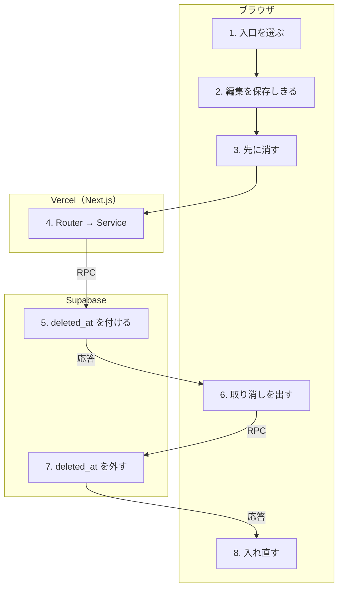

# 削除と取り消し

<!-- learn:generated:start — 正本 このファイルの learn:journey の JSON / 再生成 pnpm learn:generate / 検証 pnpm docs:check。この範囲は手編集しない -->

Plan / Record を消すと、確認ダイアログを挟まずに画面から消え、「元に戻す」付きのトーストが出る。DB では行を消さず deleted_at を付けるだけ（ソフト削除）なので、取り消しは deleted_at を外して戻す。



通るサービス: ブラウザ / Vercel（Next.js） / Supabase。段 8・失敗 6 種。

#### この経路を守るテスト

- [`apps/product/src/features/calendar/hooks/operations/useTimeblockOperations.test.tsx`](../../../apps/product/src/features/calendar/hooks/operations/useTimeblockOperations.test.tsx) で `it('削除したら取り消しを出し、押すと削除後の版で復元する'` を探す（hook の単体テスト。削除と取り消しを通しで守る E2E は見つからなかった）

### 1. 削除の入口は 3 つ（ブラウザ）

(1) Inspector のメニューの「削除」。(2) カレンダーの右クリックメニュー。(3) Inspector を開いた状態で、入力欄の外から Delete / Backspace キー。どれも確認ダイアログは出さない。移行された Record（auto_migrated）は、どの入口でも消さない。カレンダーの 2 つは一覧のキャッシュが持つ版をそのまま使う。

- **なぜ必要か**: 消すのは可逆なので速くする（ルール 4）。確認を挟まない代わりに、どの入口でも同じ取り消しトーストを出す。
- **入力 → 出力**: 消したい行の id（と版） → deletePlan / deleteRecord の呼び出し
- **ここを変えると**: 入口を足したら、useTimeblockDeleteUndo を通して同じ取り消しを出す。messages には「完全に削除されます。取り消せません」という確認文言が残っているが、Plan / Record の削除からは使われていない（未使用の文言）。
- **コード**:
  - [`apps/product/src/features/calendar/hooks/operations/useTimeblockOperations.ts`](../../../apps/product/src/features/calendar/hooks/operations/useTimeblockOperations.ts) で `const handleTimeblockDelete = useCallback(` を探す
  - [`apps/product/src/features/calendar/hooks/operations/useTimeblockContextActions.ts`](../../../apps/product/src/features/calendar/hooks/operations/useTimeblockContextActions.ts) で `const handleDeleteTimeblock = useCallback(` を探す
  - [`apps/product/src/features/calendar/hooks/keyboard/useCalendarTimeblockKeyboard.ts`](../../../apps/product/src/features/calendar/hooks/keyboard/useCalendarTimeblockKeyboard.ts) で `key: 'Backspace',` を探す
  - [`apps/product/src/features/timeblock/components/editor/TimeblockInspectorForm.tsx`](../../../apps/product/src/features/timeblock/components/editor/TimeblockInspectorForm.tsx) で `onDelete: isMigrated ? undefined : handleDelete,` を探す
- **この段を守るテスト**:
  - [`apps/product/src/features/calendar/hooks/operations/useTimeblockContextActions.test.tsx`](../../../apps/product/src/features/calendar/hooks/operations/useTimeblockContextActions.test.tsx) で `it('右クリックの削除も取り消しを出す（静かに消さない）'` を探す
  - [`apps/product/src/features/calendar/hooks/operations/useTimeblockContextActions.test.tsx`](../../../apps/product/src/features/calendar/hooks/operations/useTimeblockContextActions.test.tsx) で `it('移行済みの記録は削除しない（取り消しも出さない）'` を探す

<details>
<summary>⚡ キーボード削除で id がキャッシュに無い — 画面: 何も起きない / データ: 変化なし / 再試行: 利用者がやり直す / 痕跡: ログだけ</summary>

- 画面: 何も起きない。
- データ: 変化なし。送っていない。
- 再試行: なし。
- 痕跡: ブラウザの logger.error だけ。
- **最初に見る場所**: 一覧の取り直し中などで行が見えていない。再現するなら一覧の絞り込み条件を見る。
- 根拠:
  - [`apps/product/src/features/calendar/hooks/operations/useTimeblockOperations.ts`](../../../apps/product/src/features/calendar/hooks/operations/useTimeblockOperations.ts) で `logger.error('Timeblock の削除に失敗: id がキャッシュに見つかりません', {` を探す

</details>

### 2. Inspector からは、待っている編集を保存してから消す（ブラウザ）

Inspector の削除は、メモの保存待ちを止めて最新の入力を保存しきり、返ってきた版で削除する。利用期限が切れている時は編集を保存せず、手元の版で削除し、取り消しトーストを出さない。

- **なぜ必要か**: 保存待ちの編集が削除の後に届いて失敗したり、古い版で削除して DT002 に当たったりしないようにするため。
- **入力 → 出力**: Inspector の未保存の入力 → 削除に使う版と、取り消しを出せるか
- **ここを変えると**: カレンダー側の入口はこの準備をしない（キャッシュの版を使う）。Inspector を開いたままのキーボード削除は、保存が走っている最中だと版が古くなりうる（未確認・推測）。
- **コード**:
  - [`apps/product/src/features/timeblock/components/editor/TimeblockInspectorForm.tsx`](../../../apps/product/src/features/timeblock/components/editor/TimeblockInspectorForm.tsx) で `const prepareDelete = useCallback(async (): Promise<{` を探す
- **この段を守るテスト**:
  - [`apps/product/src/features/timeblock/components/editor/TimeblockInspectorForm.test.tsx`](../../../apps/product/src/features/timeblock/components/editor/TimeblockInspectorForm.test.tsx) で `it('利用終了後は編集をflushせず既存versionで削除する'` を探す
  - [`apps/product/src/features/timeblock/components/editor/TimeblockInspectorForm.test.tsx`](../../../apps/product/src/features/timeblock/components/editor/TimeblockInspectorForm.test.tsx) で `it('削除直前の保存で期限切れになっても既存versionで削除を続ける'` を探す

### 3. 先に画面から消す（楽観的更新）（ブラウザ）

一覧と詳細のキャッシュを snapshot してから、該当行を一覧から取り除き、詳細のキャッシュを空にする。失敗したら snapshot へ戻し「削除できませんでした。もう一度お試しください」を出す。失敗の理由（競合・消えていた等）で文言は分けない。retry: false。

- **なぜ必要か**: 押した瞬間に消えて見えるようにするため。失敗したら元の位置に戻す。
- **入力 → 出力**: id + 版 → 行を取り除いたキャッシュと snapshot
- **ここを変えると**: 削除の失敗文言は 1 種類だけ。競合を区別したくなったら reportDeleteError で code を見る。
- **コード**:
  - [`apps/product/src/features/timeblock/hooks/useTimeblockWriteMutations.ts`](../../../apps/product/src/features/timeblock/hooks/useTimeblockWriteMutations.ts) で `const deletePlan = api.planCommands.delete.useMutation({` を探す
  - [`apps/product/src/features/timeblock/hooks/useTimeblockWriteMutations.ts`](../../../apps/product/src/features/timeblock/hooks/useTimeblockWriteMutations.ts) で `const reportDeleteError = () => toast.error(t('toast.deleteFailed'));` を探す
- **この段を守るテスト**:
  - [`apps/product/src/features/timeblock/hooks/useTimeblockWriteMutations.inline-error.test.tsx`](../../../apps/product/src/features/timeblock/hooks/useTimeblockWriteMutations.inline-error.test.tsx) で `it('Plan deleteの失敗で楽観除去した行を操作前へ戻す'` を探す

<details>
<summary>⚡ 通信が途中で切れる — 画面: エラー表示 / データ: どちらもありうる / 再試行: しない / 痕跡: Sentry</summary>

- 画面: 消えた行が戻り「削除できませんでした。もう一度お試しください」。Inspector からなら操作を止めて「保存結果を確認できません」の案内も出る。
- データ: どちらもありうる（DB で確定した後に返事だけ失われた場合、削除済み）。
- 再試行: しない。一覧を取り直すので、削除が確定していれば再び消える。
- 痕跡: ブラウザから Sentry へ（source: trpc_client_transport、分析の同意がある時だけ）。
- **最初に見る場所**: Sentry と、同じ時刻の Vercel の /api/trpc ログ。
- 根拠:
  - [`apps/product/src/features/timeblock/hooks/useTimeblockWriteMutations.ts`](../../../apps/product/src/features/timeblock/hooks/useTimeblockWriteMutations.ts) で `onSettled: invalidate,` を探す

</details>

### 4. Router → Service（Vercel（Next.js））

入口と関門は「Plan を保存」と同じ。planCommands.delete / recordCommands.delete は id と expectedUpdatedAt だけを受け付け（.strict()）、Service はそのまま command へ渡す。削除では利用記録を送らない。

- **なぜ必要か**: userId を ctx からだけ取り、他人の行を消す経路を作らないため。
- **入力 → 出力**: id + expectedUpdatedAt → delete command の呼び出し
- **ここを変えると**: 入力に項目を足す時も userId は ctx から渡す（REVIEW-1）。
- **コード**:
  - [`apps/product/src/features/timeblock/server/plan-commands-router.ts`](../../../apps/product/src/features/timeblock/server/plan-commands-router.ts) で `delete: protectedProcedure` を探す
  - [`apps/product/src/features/timeblock/server/timeblock-command-service.ts`](../../../apps/product/src/features/timeblock/server/timeblock-command-service.ts) で `deletePlan(options: VersionedTargetOptions): Promise<PlanRow> {` を探す

### 5. DB が deleted_at を付ける（ソフト削除）（Supabase）

service role の client で delete_plan_command_v1 / delete_record_command_v1 を呼ぶ。行を FOR UPDATE で押さえ、既に削除済みなら DT001（STALE_TARGET に訳す）、版が違えば DT002、移行された Record なら DT009。通れば deleted_at = now() を付けて行を返す。この UPDATE で updated_at も進む。

- **なぜ必要か**: 行を残しておけば取り消せる。返した行の updated_at が、取り消しに使う次の版になる。
- **入力 → 出力**: userId + id + 版 → deleted_at が付いた行（新しい updated_at）
- **ここを変えると**: deleted_at の付いた行は一覧・重なりの判定（排他制約は deleted_at IS NULL だけが対象）から外れる。削除済みの行を自動で物理削除する仕組みは見つからなかった（未確認）。
- **コード**:
  - [`apps/product/src/features/timeblock/server/timeblock-command-client.ts`](../../../apps/product/src/features/timeblock/server/timeblock-command-client.ts) で `this.admin.rpc('delete_plan_command_v1', {` を探す
  - [`supabase/migrations/20260729062435_timeblock_atomic_commands.sql`](../../../supabase/migrations/20260729062435_timeblock_atomic_commands.sql) で `SET deleted_at = pg_catalog.now()` を探す
  - [`supabase/migrations/20260729073122_mcp_stage1_user_write_serialization.sql`](../../../supabase/migrations/20260729073122_mcp_stage1_user_write_serialization.sql) で `RENAME TO delete_plan_unserialized_v1;` を探す（中身の関数は private へ改名されて今も使われている）
- **この段を守るテスト**:
  - [`apps/product/src/lib/test/integration/timeblock-atomic-commands.integration.test.ts`](../../../apps/product/src/lib/test/integration/timeblock-atomic-commands.integration.test.ts) で `it('allows only one of a same-version Plan update and delete'` を探す（local Supabase が要る integration）
  - [`apps/product/src/lib/test/integration/timeblock-atomic-commands.integration.test.ts`](../../../apps/product/src/lib/test/integration/timeblock-atomic-commands.integration.test.ts) で `it('keeps auto-migrated Records immutable for service-role commands'` を探す

<details>
<summary>⚡ 別の場所で先に変わっていた・消されていた（DT002 / DT001） — 画面: エラー表示 / データ: 変化なし / 再試行: 利用者がやり直す / 痕跡: 残らない</summary>

- 画面: 消えた行が戻り「削除できませんでした。もう一度お試しください」。競合専用の文言にはならない。
- データ: 変化なし（別の場所の値が残る。消されていたなら一覧の取り直しで消える）。
- 再試行: しない。
- 痕跡: 想定内（STALE_VERSION / STALE_TARGET）なので Sentry には出ない。
- **最初に見る場所**: 別タブ・MCP で同じ行を触っていないか。
- 根拠:
  - [`apps/product/src/features/timeblock/server/timeblock-command-client.ts`](../../../apps/product/src/features/timeblock/server/timeblock-command-client.ts) で `DT002: 'STALE_VERSION',` を探す

</details>

### 6. 取り消しトーストを出す（ブラウザ）

成功すると「削除しました」のトースト（5 秒、「元に戻す」付き）を出す。押すと restorePlan / restoreRecord を、削除が返した updated_at を版にして呼ぶ。Inspector からの削除は Inspector を閉じ、復元に成功すると「復元しました」も出す（カレンダーからの削除では出さない）。復元の失敗は restore 側のトーストに任せ、ここでは握りつぶす。

- **なぜ必要か**: 削除前の版で復元すると、削除そのものが版を進めているので STALE_VERSION で弾かれる。削除が返した版を使うのはそのため。
- **入力 → 出力**: 削除が返した行（id + updated_at） → 取り消しトースト。押されたら restore の呼び出し
- **ここを変えると**: 取り消しの出し方はカレンダーと Inspector で 1 つにする意図（useTimeblockDeleteUndo）だが、Inspector は自前で同じトーストを組んでいる。変える時は両方を見る。「元に戻す」付きのトーストが出ている間、action の無い成功トーストは出さない（lib/toast）ので、「復元しました」が出ないこともある。
- **コード**:
  - [`apps/product/src/features/timeblock/hooks/useTimeblockDeleteUndo.ts`](../../../apps/product/src/features/timeblock/hooks/useTimeblockDeleteUndo.ts) で `export function useTimeblockDeleteUndo() {` を探す
  - [`apps/product/src/features/timeblock/components/editor/TimeblockInspectorForm.tsx`](../../../apps/product/src/features/timeblock/components/editor/TimeblockInspectorForm.tsx) で `const input = { id: targetId, expectedUpdatedAt: deleted.updated_at };` を探す
  - [`apps/product/src/lib/toast.ts`](../../../apps/product/src/lib/toast.ts) で `const wouldHideUndo = (data?: ExternalToast): boolean =>` を探す
- **この段を守るテスト**:
  - [`apps/product/src/features/timeblock/hooks/useTimeblockDeleteUndo.test.ts`](../../../apps/product/src/features/timeblock/hooks/useTimeblockDeleteUndo.test.ts) で `it('取り消しつきの削除トーストを出す'` を探す
  - [`apps/product/src/features/timeblock/hooks/useTimeblockDeleteUndo.test.ts`](../../../apps/product/src/features/timeblock/hooks/useTimeblockDeleteUndo.test.ts) で `it('予定は予定として、削除が返した版で戻す'` を探す
  - [`apps/product/src/features/timeblock/components/editor/TimeblockInspectorForm.test.tsx`](../../../apps/product/src/features/timeblock/components/editor/TimeblockInspectorForm.test.tsx) で `it('削除結果の新しいversionでUndo復元する'` を探す

<details>
<summary>⚡ トーストが消えてから戻したくなった — 画面: 何も起きない / データ: 変化なし / 再試行: 利用者がやり直す / 痕跡: 残らない</summary>

- 画面: 画面から戻す手段は無い（削除済みの一覧を見る画面は見つからなかった）。
- データ: DB には deleted_at 付きで残っている。
- 再試行: なし。MCP の plans.trash.list / records.trash.list で探し、plans.restore / records.restore で戻せる。
- 痕跡: 何も残らない。
- **最初に見る場所**: MCP の道具一覧（registry.ts）。
- 根拠:
  - [`apps/product/src/app/api/mcp/_tools/registry.ts`](../../../apps/product/src/app/api/mcp/_tools/registry.ts) で `name: 'plans.trash.list',` を探す
  - [`apps/product/src/app/api/mcp/_tools/registry.ts`](../../../apps/product/src/app/api/mcp/_tools/registry.ts) で `name: 'plans.restore',` を探す

</details>

### 7. DB が deleted_at を外す（Supabase）

restore_plan_command_v1 / restore_record_command_v1 を呼ぶ。削除済みの行を FOR UPDATE で押さえ、無ければ DT001、版が違えば DT002（移行された Record は DT009）。通れば deleted_at = NULL に戻す。戻した結果が今ある行と重なれば、排他制約（23P01）が弾く。

- **なぜ必要か**: 削除している間に同じ時間帯へ別の Plan / Record を作っていることがある。重なりを DB で弾くので、戻すか新しい方か、どちらか一方だけが残る。
- **入力 → 出力**: id + 削除が返した版 → deleted_at を外した行
- **ここを変えると**: Record の復元は DT005（未来に終われない）の対象外（時刻を変えないため trigger が見ない）。
- **コード**:
  - [`apps/product/src/features/timeblock/server/timeblock-command-client.ts`](../../../apps/product/src/features/timeblock/server/timeblock-command-client.ts) で `this.admin.rpc('restore_plan_command_v1', {` を探す
  - [`supabase/migrations/20260729062435_timeblock_atomic_commands.sql`](../../../supabase/migrations/20260729062435_timeblock_atomic_commands.sql) で `SET deleted_at = NULL` を探す
  - [`supabase/migrations/20260907081237_independent_plan_record_commands.sql`](../../../supabase/migrations/20260907081237_independent_plan_record_commands.sql) で `CREATE OR REPLACE FUNCTION private.restore_record_unserialized_v1(` を探す
- **この段を守るテスト**:
  - [`apps/product/src/lib/test/integration/timeblock-atomic-commands.integration.test.ts`](../../../apps/product/src/lib/test/integration/timeblock-atomic-commands.integration.test.ts) で `it('allows either Plan restore or an overlapping create, never both'` を探す（local Supabase が要る integration）
  - [`apps/product/src/lib/test/integration/timeblock-atomic-commands.integration.test.ts`](../../../apps/product/src/lib/test/integration/timeblock-atomic-commands.integration.test.ts) で `it('allows either Record restore or overlapping create, never both'` を探す

<details>
<summary>⚡ 戻す位置に別の Plan / Record ができていた（23P01） — 画面: エラー表示 / データ: 変化なし / 再試行: しない / 痕跡: 残らない</summary>

- 画面: 「復元できませんでした。もう一度お試しください」のトースト。重なりが理由だとは出ない。
- データ: 変化なし。削除済みのまま。
- 再試行: しない。もう一度押しても同じ。
- 痕跡: 想定内（TIME_OVERLAP）なので Sentry には出ない。
- **最初に見る場所**: 同じ時間帯の行。MCP の trash から探して、時間帯を空けてから戻す。
- 根拠:
  - [`apps/product/src/features/timeblock/hooks/useTimeblockWriteMutations.ts`](../../../apps/product/src/features/timeblock/hooks/useTimeblockWriteMutations.ts) で `const reportRestoreError = () => toast.error(t('toast.restoreFailed'));` を探す

</details>

<details>
<summary>⚡ 削除後に別の場所で戻されていた・版が違う（DT001 / DT002） — 画面: エラー表示 / データ: 変化なし / 再試行: しない / 痕跡: 残らない</summary>

- 画面: 「復元できませんでした。もう一度お試しください」のトースト。
- データ: 変化なし。
- 再試行: しない。
- 痕跡: 想定内なので Sentry には出ない。
- **最初に見る場所**: 一覧の取り直しで実際の状態に揃う。
- 根拠:
  - [`supabase/migrations/20260729062435_timeblock_atomic_commands.sql`](../../../supabase/migrations/20260729062435_timeblock_atomic_commands.sql) で `AND plan.deleted_at IS NOT NULL` を探す

</details>

### 8. 戻した行を画面へ入れ直す（ブラウザ）

restore は先に描かない（snapshot を取るだけ）。返ってきた行を、条件の合う一覧と詳細へ入れ直す。成功・失敗どちらでも plans / records / statistics / review を取り直す。

- **なぜ必要か**: 戻す行の中身（最新の値）は DB が返すので、返事を待ってから描く。
- **入力 → 出力**: deleted_at を外した行 → 元の位置に戻った画面
- **ここを変えると**: 集計画面を足したら取り直し対象に入れないと、削除・復元の前後で数字が揃わない。
- **コード**:
  - [`apps/product/src/features/timeblock/hooks/useTimeblockWriteMutations.ts`](../../../apps/product/src/features/timeblock/hooks/useTimeblockWriteMutations.ts) で `const restorePlan = api.planCommands.restore.useMutation({` を探す
  - [`apps/product/src/features/timeblock/hooks/useTimeblockWriteMutations.ts`](../../../apps/product/src/features/timeblock/hooks/useTimeblockWriteMutations.ts) で `insertIntoMatchingLists('plans', restored);` を探す
- **この段を守るテスト**:
  - [`apps/product/src/features/timeblock/hooks/useTimeblockWriteMutations.inline-error.test.tsx`](../../../apps/product/src/features/timeblock/hooks/useTimeblockWriteMutations.inline-error.test.tsx) で `it('restore commandの返却行を一致する一覧へ再挿入する'` を探す

<!-- learn:generated:end -->

## データ（正本）

この JSON がこのページの正本。上の説明と図、`pnpm learn` の対話画面はここから生成する。参照（`path` + `find`）は `pnpm docs:check` が実在を検査する。

```json learn:journey
{
  "id": "delete-undo",
  "title": "削除と取り消し",
  "order": 40,
  "group": "calendar",
  "intro": "Plan / Record を消すと、確認ダイアログを挟まずに画面から消え、「元に戻す」付きのトーストが出る。DB では行を消さず deleted_at を付けるだけ（ソフト削除）なので、取り消しは deleted_at を外して戻す。",
  "play": "▶ 削除する",
  "hops": [
    {
      "id": "entrances",
      "svc": "browser",
      "title": "削除の入口は 3 つ",
      "what": "(1) Inspector のメニューの「削除」。(2) カレンダーの右クリックメニュー。(3) Inspector を開いた状態で、入力欄の外から Delete / Backspace キー。どれも確認ダイアログは出さない。移行された Record（auto_migrated）は、どの入口でも消さない。カレンダーの 2 つは一覧のキャッシュが持つ版をそのまま使う。",
      "why": "消すのは可逆なので速くする（ルール 4）。確認を挟まない代わりに、どの入口でも同じ取り消しトーストを出す。",
      "io": {
        "in": "消したい行の id（と版）",
        "out": "deletePlan / deleteRecord の呼び出し"
      },
      "change": "入口を足したら、useTimeblockDeleteUndo を通して同じ取り消しを出す。messages には「完全に削除されます。取り消せません」という確認文言が残っているが、Plan / Record の削除からは使われていない（未使用の文言）。",
      "refs": [
        {
          "path": "apps/product/src/features/calendar/hooks/operations/useTimeblockOperations.ts",
          "find": "const handleTimeblockDelete = useCallback("
        },
        {
          "path": "apps/product/src/features/calendar/hooks/operations/useTimeblockContextActions.ts",
          "find": "const handleDeleteTimeblock = useCallback("
        },
        {
          "path": "apps/product/src/features/calendar/hooks/keyboard/useCalendarTimeblockKeyboard.ts",
          "find": "key: 'Backspace',"
        },
        {
          "path": "apps/product/src/features/timeblock/components/editor/TimeblockInspectorForm.tsx",
          "find": "onDelete: isMigrated ? undefined : handleDelete,"
        }
      ],
      "tests": [
        {
          "path": "apps/product/src/features/calendar/hooks/operations/useTimeblockContextActions.test.tsx",
          "find": "it('右クリックの削除も取り消しを出す（静かに消さない）'"
        },
        {
          "path": "apps/product/src/features/calendar/hooks/operations/useTimeblockContextActions.test.tsx",
          "find": "it('移行済みの記録は削除しない（取り消しも出さない）'"
        }
      ],
      "fails": [
        {
          "id": "not-in-cache",
          "label": "キーボード削除で id がキャッシュに無い",
          "screen": "何も起きない。",
          "data": "変化なし。送っていない。",
          "retry": "なし。",
          "trace": "ブラウザの logger.error だけ。",
          "look": "一覧の取り直し中などで行が見えていない。再現するなら一覧の絞り込み条件を見る。",
          "refs": [
            {
              "path": "apps/product/src/features/calendar/hooks/operations/useTimeblockOperations.ts",
              "find": "logger.error('Timeblock の削除に失敗: id がキャッシュに見つかりません', {"
            }
          ],
          "tags": {
            "screen": "none",
            "data": "unchanged",
            "retry": "user",
            "trace": "log"
          },
          "screenAfter": {
            "t": "calendar",
            "url": "/ja/calendar",
            "blocks": [
              {
                "state": "saved",
                "label": "仕事"
              }
            ]
          }
        }
      ],
      "short": "入口を選ぶ",
      "screen": {
        "t": "calendar",
        "url": "/ja/calendar",
        "blocks": [
          {
            "state": "saved",
            "label": "仕事"
          }
        ],
        "drawer": {
          "title": "メニュー",
          "items": ["複製", "削除"],
          "on": 1
        },
        "note": "右クリック・Inspector のメニュー・Delete キーのどれか"
      }
    },
    {
      "id": "inspector-prepare",
      "svc": "browser",
      "title": "Inspector からは、待っている編集を保存してから消す",
      "what": "Inspector の削除は、メモの保存待ちを止めて最新の入力を保存しきり、返ってきた版で削除する。利用期限が切れている時は編集を保存せず、手元の版で削除し、取り消しトーストを出さない。",
      "why": "保存待ちの編集が削除の後に届いて失敗したり、古い版で削除して DT002 に当たったりしないようにするため。",
      "io": {
        "in": "Inspector の未保存の入力",
        "out": "削除に使う版と、取り消しを出せるか"
      },
      "change": "カレンダー側の入口はこの準備をしない（キャッシュの版を使う）。Inspector を開いたままのキーボード削除は、保存が走っている最中だと版が古くなりうる（未確認・推測）。",
      "refs": [
        {
          "path": "apps/product/src/features/timeblock/components/editor/TimeblockInspectorForm.tsx",
          "find": "const prepareDelete = useCallback(async (): Promise<{"
        }
      ],
      "tests": [
        {
          "path": "apps/product/src/features/timeblock/components/editor/TimeblockInspectorForm.test.tsx",
          "find": "it('利用終了後は編集をflushせず既存versionで削除する'"
        },
        {
          "path": "apps/product/src/features/timeblock/components/editor/TimeblockInspectorForm.test.tsx",
          "find": "it('削除直前の保存で期限切れになっても既存versionで削除を続ける'"
        }
      ],
      "fails": [],
      "short": "編集を保存しきる"
    },
    {
      "id": "optimistic",
      "svc": "browser",
      "title": "先に画面から消す（楽観的更新）",
      "what": "一覧と詳細のキャッシュを snapshot してから、該当行を一覧から取り除き、詳細のキャッシュを空にする。失敗したら snapshot へ戻し「削除できませんでした。もう一度お試しください」を出す。失敗の理由（競合・消えていた等）で文言は分けない。retry: false。",
      "why": "押した瞬間に消えて見えるようにするため。失敗したら元の位置に戻す。",
      "io": {
        "in": "id + 版",
        "out": "行を取り除いたキャッシュと snapshot"
      },
      "change": "削除の失敗文言は 1 種類だけ。競合を区別したくなったら reportDeleteError で code を見る。",
      "refs": [
        {
          "path": "apps/product/src/features/timeblock/hooks/useTimeblockWriteMutations.ts",
          "find": "const deletePlan = api.planCommands.delete.useMutation({"
        },
        {
          "path": "apps/product/src/features/timeblock/hooks/useTimeblockWriteMutations.ts",
          "find": "const reportDeleteError = () => toast.error(t('toast.deleteFailed'));"
        }
      ],
      "tests": [
        {
          "path": "apps/product/src/features/timeblock/hooks/useTimeblockWriteMutations.inline-error.test.tsx",
          "find": "it('Plan deleteの失敗で楽観除去した行を操作前へ戻す'"
        }
      ],
      "fails": [
        {
          "id": "network-lost",
          "label": "通信が途中で切れる",
          "screen": "消えた行が戻り「削除できませんでした。もう一度お試しください」。Inspector からなら操作を止めて「保存結果を確認できません」の案内も出る。",
          "data": "どちらもありうる（DB で確定した後に返事だけ失われた場合、削除済み）。",
          "retry": "しない。一覧を取り直すので、削除が確定していれば再び消える。",
          "trace": "ブラウザから Sentry へ（source: trpc_client_transport、分析の同意がある時だけ）。",
          "look": "Sentry と、同じ時刻の Vercel の /api/trpc ログ。",
          "refs": [
            {
              "path": "apps/product/src/features/timeblock/hooks/useTimeblockWriteMutations.ts",
              "find": "onSettled: invalidate,"
            }
          ],
          "tags": {
            "screen": "toast",
            "data": "unknown",
            "retry": "none",
            "trace": "sentry"
          },
          "screenAfter": {
            "t": "calendar",
            "url": "/ja/calendar",
            "blocks": [
              {
                "state": "saved",
                "label": "仕事"
              }
            ],
            "toast": "削除できませんでした。もう一度お試しください",
            "toastTone": "bad",
            "note": "一覧の取り直しで、削除が確定していれば消える"
          }
        }
      ],
      "short": "先に消す",
      "screen": {
        "t": "calendar",
        "url": "/ja/calendar",
        "blocks": [
          {
            "state": "gone",
            "label": "仕事"
          }
        ],
        "note": "返事を待たずに画面から消す"
      }
    },
    {
      "id": "router-service",
      "svc": "vercel",
      "title": "Router → Service",
      "what": "入口と関門は「Plan を保存」と同じ。planCommands.delete / recordCommands.delete は id と expectedUpdatedAt だけを受け付け（.strict()）、Service はそのまま command へ渡す。削除では利用記録を送らない。",
      "why": "userId を ctx からだけ取り、他人の行を消す経路を作らないため。",
      "io": {
        "in": "id + expectedUpdatedAt",
        "out": "delete command の呼び出し"
      },
      "change": "入力に項目を足す時も userId は ctx から渡す（REVIEW-1）。",
      "refs": [
        {
          "path": "apps/product/src/features/timeblock/server/plan-commands-router.ts",
          "find": "delete: protectedProcedure"
        },
        {
          "path": "apps/product/src/features/timeblock/server/timeblock-command-service.ts",
          "find": "deletePlan(options: VersionedTargetOptions): Promise<PlanRow> {"
        }
      ],
      "fails": [],
      "short": "Router → Service"
    },
    {
      "id": "db-soft-delete",
      "svc": "supabase",
      "title": "DB が deleted_at を付ける（ソフト削除）",
      "what": "service role の client で delete_plan_command_v1 / delete_record_command_v1 を呼ぶ。行を FOR UPDATE で押さえ、既に削除済みなら DT001（STALE_TARGET に訳す）、版が違えば DT002、移行された Record なら DT009。通れば deleted_at = now() を付けて行を返す。この UPDATE で updated_at も進む。",
      "why": "行を残しておけば取り消せる。返した行の updated_at が、取り消しに使う次の版になる。",
      "io": {
        "in": "userId + id + 版",
        "out": "deleted_at が付いた行（新しい updated_at）"
      },
      "change": "deleted_at の付いた行は一覧・重なりの判定（排他制約は deleted_at IS NULL だけが対象）から外れる。削除済みの行を自動で物理削除する仕組みは見つからなかった（未確認）。",
      "refs": [
        {
          "path": "apps/product/src/features/timeblock/server/timeblock-command-client.ts",
          "find": "this.admin.rpc('delete_plan_command_v1', {"
        },
        {
          "path": "supabase/migrations/20260729062435_timeblock_atomic_commands.sql",
          "find": "SET deleted_at = pg_catalog.now()"
        },
        {
          "path": "supabase/migrations/20260729073122_mcp_stage1_user_write_serialization.sql",
          "find": "RENAME TO delete_plan_unserialized_v1;",
          "why": "中身の関数は private へ改名されて今も使われている"
        }
      ],
      "tests": [
        {
          "path": "apps/product/src/lib/test/integration/timeblock-atomic-commands.integration.test.ts",
          "find": "it('allows only one of a same-version Plan update and delete'",
          "why": "local Supabase が要る integration"
        },
        {
          "path": "apps/product/src/lib/test/integration/timeblock-atomic-commands.integration.test.ts",
          "find": "it('keeps auto-migrated Records immutable for service-role commands'"
        }
      ],
      "fails": [
        {
          "id": "stale",
          "label": "別の場所で先に変わっていた・消されていた（DT002 / DT001）",
          "screen": "消えた行が戻り「削除できませんでした。もう一度お試しください」。競合専用の文言にはならない。",
          "data": "変化なし（別の場所の値が残る。消されていたなら一覧の取り直しで消える）。",
          "retry": "しない。",
          "trace": "想定内（STALE_VERSION / STALE_TARGET）なので Sentry には出ない。",
          "look": "別タブ・MCP で同じ行を触っていないか。",
          "refs": [
            {
              "path": "apps/product/src/features/timeblock/server/timeblock-command-client.ts",
              "find": "DT002: 'STALE_VERSION',"
            }
          ],
          "tags": {
            "screen": "toast",
            "data": "unchanged",
            "retry": "user",
            "trace": "none"
          },
          "to": "optimistic",
          "back": "巻き戻し + トースト",
          "screenAfter": {
            "t": "calendar",
            "url": "/ja/calendar",
            "blocks": [
              {
                "state": "saved",
                "label": "仕事"
              }
            ],
            "toast": "削除できませんでした。もう一度お試しください",
            "toastTone": "bad"
          }
        }
      ],
      "short": "deleted_at を付ける",
      "via": "RPC"
    },
    {
      "id": "undo-toast",
      "svc": "browser",
      "title": "取り消しトーストを出す",
      "what": "成功すると「削除しました」のトースト（5 秒、「元に戻す」付き）を出す。押すと restorePlan / restoreRecord を、削除が返した updated_at を版にして呼ぶ。Inspector からの削除は Inspector を閉じ、復元に成功すると「復元しました」も出す（カレンダーからの削除では出さない）。復元の失敗は restore 側のトーストに任せ、ここでは握りつぶす。",
      "why": "削除前の版で復元すると、削除そのものが版を進めているので STALE_VERSION で弾かれる。削除が返した版を使うのはそのため。",
      "io": {
        "in": "削除が返した行（id + updated_at）",
        "out": "取り消しトースト。押されたら restore の呼び出し"
      },
      "change": "取り消しの出し方はカレンダーと Inspector で 1 つにする意図（useTimeblockDeleteUndo）だが、Inspector は自前で同じトーストを組んでいる。変える時は両方を見る。「元に戻す」付きのトーストが出ている間、action の無い成功トーストは出さない（lib/toast）ので、「復元しました」が出ないこともある。",
      "refs": [
        {
          "path": "apps/product/src/features/timeblock/hooks/useTimeblockDeleteUndo.ts",
          "find": "export function useTimeblockDeleteUndo() {"
        },
        {
          "path": "apps/product/src/features/timeblock/components/editor/TimeblockInspectorForm.tsx",
          "find": "const input = { id: targetId, expectedUpdatedAt: deleted.updated_at };"
        },
        {
          "path": "apps/product/src/lib/toast.ts",
          "find": "const wouldHideUndo = (data?: ExternalToast): boolean =>"
        }
      ],
      "tests": [
        {
          "path": "apps/product/src/features/timeblock/hooks/useTimeblockDeleteUndo.test.ts",
          "find": "it('取り消しつきの削除トーストを出す'"
        },
        {
          "path": "apps/product/src/features/timeblock/hooks/useTimeblockDeleteUndo.test.ts",
          "find": "it('予定は予定として、削除が返した版で戻す'"
        },
        {
          "path": "apps/product/src/features/timeblock/components/editor/TimeblockInspectorForm.test.tsx",
          "find": "it('削除結果の新しいversionでUndo復元する'"
        }
      ],
      "fails": [
        {
          "id": "toast-gone",
          "label": "トーストが消えてから戻したくなった",
          "screen": "画面から戻す手段は無い（削除済みの一覧を見る画面は見つからなかった）。",
          "data": "DB には deleted_at 付きで残っている。",
          "retry": "なし。MCP の plans.trash.list / records.trash.list で探し、plans.restore / records.restore で戻せる。",
          "trace": "何も残らない。",
          "look": "MCP の道具一覧（registry.ts）。",
          "refs": [
            {
              "path": "apps/product/src/app/api/mcp/_tools/registry.ts",
              "find": "name: 'plans.trash.list',"
            },
            {
              "path": "apps/product/src/app/api/mcp/_tools/registry.ts",
              "find": "name: 'plans.restore',"
            }
          ],
          "tags": {
            "screen": "none",
            "data": "unchanged",
            "retry": "user",
            "trace": "none"
          },
          "screenAfter": {
            "t": "calendar",
            "url": "/ja/calendar",
            "blocks": [
              {
                "state": "gone",
                "label": "仕事"
              }
            ],
            "note": "（トーストは 5 秒で消える）"
          }
        }
      ],
      "short": "取り消しを出す",
      "via": "応答",
      "screen": {
        "t": "calendar",
        "url": "/ja/calendar",
        "blocks": [
          {
            "state": "gone",
            "label": "仕事"
          }
        ],
        "toast": "削除しました",
        "toastAction": "元に戻す"
      }
    },
    {
      "id": "db-restore",
      "svc": "supabase",
      "title": "DB が deleted_at を外す",
      "what": "restore_plan_command_v1 / restore_record_command_v1 を呼ぶ。削除済みの行を FOR UPDATE で押さえ、無ければ DT001、版が違えば DT002（移行された Record は DT009）。通れば deleted_at = NULL に戻す。戻した結果が今ある行と重なれば、排他制約（23P01）が弾く。",
      "why": "削除している間に同じ時間帯へ別の Plan / Record を作っていることがある。重なりを DB で弾くので、戻すか新しい方か、どちらか一方だけが残る。",
      "io": {
        "in": "id + 削除が返した版",
        "out": "deleted_at を外した行"
      },
      "change": "Record の復元は DT005（未来に終われない）の対象外（時刻を変えないため trigger が見ない）。",
      "refs": [
        {
          "path": "apps/product/src/features/timeblock/server/timeblock-command-client.ts",
          "find": "this.admin.rpc('restore_plan_command_v1', {"
        },
        {
          "path": "supabase/migrations/20260729062435_timeblock_atomic_commands.sql",
          "find": "SET deleted_at = NULL"
        },
        {
          "path": "supabase/migrations/20260907081237_independent_plan_record_commands.sql",
          "find": "CREATE OR REPLACE FUNCTION private.restore_record_unserialized_v1("
        }
      ],
      "tests": [
        {
          "path": "apps/product/src/lib/test/integration/timeblock-atomic-commands.integration.test.ts",
          "find": "it('allows either Plan restore or an overlapping create, never both'",
          "why": "local Supabase が要る integration"
        },
        {
          "path": "apps/product/src/lib/test/integration/timeblock-atomic-commands.integration.test.ts",
          "find": "it('allows either Record restore or overlapping create, never both'"
        }
      ],
      "fails": [
        {
          "id": "restore-overlap",
          "label": "戻す位置に別の Plan / Record ができていた（23P01）",
          "screen": "「復元できませんでした。もう一度お試しください」のトースト。重なりが理由だとは出ない。",
          "data": "変化なし。削除済みのまま。",
          "retry": "しない。もう一度押しても同じ。",
          "trace": "想定内（TIME_OVERLAP）なので Sentry には出ない。",
          "look": "同じ時間帯の行。MCP の trash から探して、時間帯を空けてから戻す。",
          "refs": [
            {
              "path": "apps/product/src/features/timeblock/hooks/useTimeblockWriteMutations.ts",
              "find": "const reportRestoreError = () => toast.error(t('toast.restoreFailed'));"
            }
          ],
          "tags": {
            "screen": "toast",
            "data": "unchanged",
            "retry": "none",
            "trace": "none"
          },
          "screenAfter": {
            "t": "calendar",
            "url": "/ja/calendar",
            "blocks": [
              {
                "state": "saved",
                "label": "新しい予定"
              }
            ],
            "toast": "復元できませんでした。もう一度お試しください",
            "toastTone": "bad"
          }
        },
        {
          "id": "restore-stale",
          "label": "削除後に別の場所で戻されていた・版が違う（DT001 / DT002）",
          "screen": "「復元できませんでした。もう一度お試しください」のトースト。",
          "data": "変化なし。",
          "retry": "しない。",
          "trace": "想定内なので Sentry には出ない。",
          "look": "一覧の取り直しで実際の状態に揃う。",
          "refs": [
            {
              "path": "supabase/migrations/20260729062435_timeblock_atomic_commands.sql",
              "find": "AND plan.deleted_at IS NOT NULL"
            }
          ],
          "tags": {
            "screen": "toast",
            "data": "unchanged",
            "retry": "none",
            "trace": "none"
          },
          "screenAfter": {
            "t": "calendar",
            "url": "/ja/calendar",
            "blocks": [
              {
                "state": "saved",
                "label": "仕事"
              }
            ],
            "toast": "復元できませんでした。もう一度お試しください",
            "toastTone": "bad"
          }
        }
      ],
      "short": "deleted_at を外す",
      "via": "RPC"
    },
    {
      "id": "settle",
      "svc": "browser",
      "title": "戻した行を画面へ入れ直す",
      "what": "restore は先に描かない（snapshot を取るだけ）。返ってきた行を、条件の合う一覧と詳細へ入れ直す。成功・失敗どちらでも plans / records / statistics / review を取り直す。",
      "why": "戻す行の中身（最新の値）は DB が返すので、返事を待ってから描く。",
      "io": {
        "in": "deleted_at を外した行",
        "out": "元の位置に戻った画面"
      },
      "change": "集計画面を足したら取り直し対象に入れないと、削除・復元の前後で数字が揃わない。",
      "refs": [
        {
          "path": "apps/product/src/features/timeblock/hooks/useTimeblockWriteMutations.ts",
          "find": "const restorePlan = api.planCommands.restore.useMutation({"
        },
        {
          "path": "apps/product/src/features/timeblock/hooks/useTimeblockWriteMutations.ts",
          "find": "insertIntoMatchingLists('plans', restored);"
        }
      ],
      "tests": [
        {
          "path": "apps/product/src/features/timeblock/hooks/useTimeblockWriteMutations.inline-error.test.tsx",
          "find": "it('restore commandの返却行を一致する一覧へ再挿入する'"
        }
      ],
      "fails": [],
      "short": "入れ直す",
      "via": "応答",
      "screen": {
        "t": "calendar",
        "url": "/ja/calendar",
        "blocks": [
          {
            "state": "saved",
            "label": "仕事"
          }
        ],
        "toast": "復元しました",
        "note": "「復元しました」は Inspector から消した時だけ出る"
      }
    }
  ],
  "lanes": ["browser", "vercel", "supabase"],
  "tests": [
    {
      "path": "apps/product/src/features/calendar/hooks/operations/useTimeblockOperations.test.tsx",
      "find": "it('削除したら取り消しを出し、押すと削除後の版で復元する'",
      "why": "hook の単体テスト。削除と取り消しを通しで守る E2E は見つからなかった"
    }
  ]
}
```
