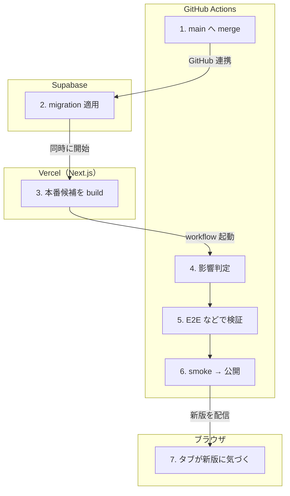

# merge → 本番公開

<!-- learn:generated:start — 正本 このファイルの learn:journey の JSON / 再生成 pnpm learn:generate / 検証 pnpm docs:check。この範囲は手編集しない -->

PR を main へ merge する。merge と本番公開は分かれていて、公開するのは Production Release workflow だけ。DB の migration は merge の時点で先に本番へ入る。



通るサービス: GitHub Actions / Supabase / Vercel（Next.js） / ブラウザ。段 7・失敗 4 種。

#### この経路を守るテスト

- 経路全体を通しで守るテストは紐付いていない（段ごとのテストを見る）

### 1. main へ merge する（GitHub Actions）

main の repository ruleset が required checks（Static / Unit / Integration / Vercel product / web）と review thread の解決を求める。merge commit だけ許可。

- **ここを変えると**: required check に paths filter 付きの check を入れると、満たせない PR が merge できなくなる。
- **コード**:
  - [`AGENTS.md`](../../../AGENTS.md) で `merge の遮断は main の repository ruleset 1 本で行う` を探す
  - [`docs/engineering/infra.md`](../../engineering/infra.md) で `### merge gate の required checks` を探す

### 2. migration が本番 DB に入る（Supabase）

Supabase の GitHub 連携が、merge の時点で production へ migration を適用する。この repo の workflow は適用しない。release job に反映の確認はあるが、今は warning を出すだけ（advisory）。

- **ここを変えると**: ここから promote が終わるまで、新しい schema の上で旧コードが動く時間がある（E2E が完走するまで）。migration は旧コードでも壊れない形で書く。
- **コード**:
  - [`docs/engineering/infra.md`](../../engineering/infra.md) で `main merge: Supabase integration が production に migration を適用する` を探す
  - [`.agents/skills/supabase/SKILL.md`](../../../.agents/skills/supabase/SKILL.md) で `migration` を探す

<details>
<summary>⚡ migration の適用が失敗 — 画面: 設定次第 / データ: 変化なし / 再試行: しない / 痕跡: ログだけ</summary>

- 画面: 利用者は新しい版を使う（promote は止まらない）。新しいコードが、まだ入っていない schema を読むと失敗しうる。
- データ: 本番 DB は適用前のまま。コードだけが新しくなりうる。
- 再試行: 自動ではしない。
- 痕跡: 自動では止まらない。release job の「Verify candidate migrations are applied in Production」は現在 advisory（promote.yml が確認用の token を渡していない）で、未確認の warning を出して promote を続ける。
- **最初に見る場所**: Supabase のダッシュボードの migration 履歴を直接見る → runbook の Playbook 1。Production Release の run に warning が出ていないかも見る。
- 根拠:
  - [`.github/workflows/promote.yml`](../../../.github/workflows/promote.yml) で `Verify candidate migrations are applied in Production` を探す
  - [`scripts/ci/production-migration-readiness.mjs`](../../../scripts/ci/production-migration-readiness.mjs) で `schema_migrations` を探す

</details>

### 3. Vercel が本番候補を build する（Vercel（Next.js））

merge ごとに Production build を作るが、domain は割り当てない（Auto-assign を OFF にしてある）。まだ誰も見ていない候補。

- **ここを変えると**: Ignored Build Step で production build を skip させてはいけない。候補が無いと release job が現れない build を待ち続ける。
- **コード**:
  - [`docs/engineering/infra.md`](../../engineering/infra.md) で `### merge と Production 公開の分離` を探す

<details>
<summary>⚡ build が失敗 — 画面: 旧版のまま / データ: 食い違いが残る / 再試行: しない / 痕跡: GitHub issue</summary>

- 画面: 利用者は旧版を使い続ける。
- データ: 変化なし（migration は先に入っている）。
- 再試行: しない。同じ SHA を作り直すなら deployment を名指しして redeploy。
- 痕跡: Vercel の build ログ。promote が失敗すると area:deployment の issue が立つ。
- **最初に見る場所**: runbook の Playbook 2。
- 根拠:
  - [`docs/operations/runbook.md`](../../operations/runbook.md) で `## Playbook 2: Vercelデプロイ失敗（P1）` を探す

</details>

### 4. 影響判定（impact）（GitHub Actions）

Production Release workflow が起動し、product / web / storybook それぞれの現在公開中の SHA との差分から、どれに影響があるかを決める。

- **ここを変えると**: 影響なしと判定された project の検証は走らない。docs だけの merge でも build は作られ、判定を通る。
- **コード**:
  - [`.github/workflows/promote.yml`](../../../.github/workflows/promote.yml) で `Resolve release impact` を探す
  - [`scripts/ci/release-impact.mjs`](../../../scripts/ci/release-impact.mjs) で `affected` を探す

### 5. 層 3 の検証（E2E / Web / Storybook）（GitHub Actions）

影響がある project だけ、同じ run の中で E2E（local Supabase を起動）、web の build と E2E、Storybook の検査を走らせる。

- **ここを変えると**: ここが merge 後の本番を守る唯一の実行検証。遅くすると、migration と旧コードが共存する時間も伸びる。
- **コード**:
  - [`.github/workflows/promote.yml`](../../../.github/workflows/promote.yml) で `Run E2E tests` を探す
  - [`docs/engineering/testing.md`](../../engineering/testing.md) で `E2E` を探す

<details>
<summary>⚡ E2E が失敗 — 画面: 旧版のまま / データ: 食い違いが残る / 再試行: しない / 痕跡: GitHub issue</summary>

- 画面: 利用者は旧版を使い続ける。
- データ: コードは旧版のまま。migration だけ新しい。
- 再試行: 自動ではしない。直して次の merge で走り直すか、workflow を手で起動する。
- 痕跡: area:deployment ラベルの issue が立つ（既にあれば更新）。E2E の report が artifact に残る。
- **最初に見る場所**: その issue → Actions の run → Upload report の artifact。
- 根拠:
  - [`.github/workflows/promote.yml`](../../../.github/workflows/promote.yml) で `File or update promote failure issue` を探す

</details>

### 6. smoke してから本番へ切り替える（GitHub Actions）

release job が migration の反映を確かめ（今は advisory で warning だけ）、候補を smoke してから Production domain へ promote する。

- **ここを変えると**: 緊急時の Force Promote は理由の入力が必須。層 3・smoke・Production Config Audit・migration の確認をすべて飛ばすので、使ったら記録を残す。
- **コード**:
  - [`.github/workflows/promote.yml`](../../../.github/workflows/promote.yml) で `Wait, smoke, and promote Production` を探す
  - [`scripts/ci/production-release.mjs`](../../../scripts/ci/production-release.mjs) で `promote` を探す

<details>
<summary>⚡ smoke が失敗 — 画面: 旧版のまま / データ: 食い違いが残る / 再試行: しない / 痕跡: GitHub issue</summary>

- 画面: 利用者は旧版を使い続ける。
- データ: 変化なし。
- 再試行: しない。
- 痕跡: Production Release の commit status と area:deployment の issue。
- **最初に見る場所**: runbook の Playbook 2。
- 根拠:
  - [`docs/operations/runbook.md`](../../operations/runbook.md) で `### 前提: mergeとProduction公開は分離されている` を探す

</details>

### 7. 開いているタブが新版に気づく（ブラウザ）

タブへ戻った時（前回の確認から 1 分以上たっている時だけ）に /api/health/version の SHA を比べ、古ければ新版があると判断する。通知は出さない。その時点で編集中でなければ（保存中の mutation、作成中の下書き、開いたダイアログ、入力欄のフォーカスが無ければ）黙って再読み込みする。編集中だった時は、ダイアログを閉じても追いかけて再読み込みはせず、次にタブへ戻った時に判定し直す。

- **ここを変えると**: API の入出力を変えた直後は、旧版の画面が新版のサーバーを呼ぶ時間がある。tRPC の入力を必須化する変更は、旧画面からの呼び出しを壊す。
- **コード**:
  - [`apps/product/src/lib/hooks/useServiceWorker.ts`](../../../apps/product/src/lib/hooks/useServiceWorker.ts) で `DEPLOYED_VERSION_ENDPOINT` を探す
  - [`docs/engineering/pwa.md`](../../engineering/pwa.md) で `/api/health/version` を探す
  - [`apps/product/src/app/[locale]/(app)/_providers/useApplyUpdateWhenSafe.ts`](<../../../apps/product/src/app/[locale]/(app)/_providers/useApplyUpdateWhenSafe.ts>) で `export function useApplyUpdateWhenSafe` を探す
  - [`apps/product/src/lib/hooks/useServiceWorker.ts`](../../../apps/product/src/lib/hooks/useServiceWorker.ts) で `DEPLOYED_VERSION_PROBE_INTERVAL_MS = 60_000` を探す

<!-- learn:generated:end -->

## データ（正本）

この JSON がこのページの正本。上の説明と図、`pnpm learn` の対話画面はここから生成する。参照（`path` + `find`）は `pnpm docs:check` が実在を検査する。

```json learn:journey
{
  "id": "deploy",
  "title": "merge → 本番公開",
  "order": 150,
  "group": "ops",
  "intro": "PR を main へ merge する。merge と本番公開は分かれていて、公開するのは Production Release workflow だけ。DB の migration は merge の時点で先に本番へ入る。",
  "play": "▶ merge する",
  "hops": [
    {
      "id": "merge",
      "svc": "github",
      "title": "main へ merge する",
      "what": "main の repository ruleset が required checks（Static / Unit / Integration / Vercel product / web）と review thread の解決を求める。merge commit だけ許可。",
      "change": "required check に paths filter 付きの check を入れると、満たせない PR が merge できなくなる。",
      "refs": [
        {
          "path": "AGENTS.md",
          "find": "merge の遮断は main の repository ruleset 1 本で行う"
        },
        {
          "path": "docs/engineering/infra.md",
          "find": "### merge gate の required checks"
        }
      ],
      "fails": [],
      "short": "main へ merge",
      "screen": {
        "t": "calendar",
        "url": "/ja/calendar",
        "blocks": [
          {
            "state": "saved",
            "label": "仕事"
          }
        ],
        "title": "カレンダー（旧版）",
        "note": "利用者は旧版を使い続ける。通知は出ない"
      }
    },
    {
      "id": "migration",
      "svc": "supabase",
      "title": "migration が本番 DB に入る",
      "what": "Supabase の GitHub 連携が、merge の時点で production へ migration を適用する。この repo の workflow は適用しない。release job に反映の確認はあるが、今は warning を出すだけ（advisory）。",
      "change": "ここから promote が終わるまで、新しい schema の上で旧コードが動く時間がある（E2E が完走するまで）。migration は旧コードでも壊れない形で書く。",
      "refs": [
        {
          "path": "docs/engineering/infra.md",
          "find": "main merge: Supabase integration が production に migration を適用する"
        },
        {
          "path": ".agents/skills/supabase/SKILL.md",
          "find": "migration"
        }
      ],
      "fails": [
        {
          "id": "migration-fail",
          "label": "migration の適用が失敗",
          "screen": "利用者は新しい版を使う（promote は止まらない）。新しいコードが、まだ入っていない schema を読むと失敗しうる。",
          "data": "本番 DB は適用前のまま。コードだけが新しくなりうる。",
          "retry": "自動ではしない。",
          "trace": "自動では止まらない。release job の「Verify candidate migrations are applied in Production」は現在 advisory（promote.yml が確認用の token を渡していない）で、未確認の warning を出して promote を続ける。",
          "look": "Supabase のダッシュボードの migration 履歴を直接見る → runbook の Playbook 1。Production Release の run に warning が出ていないかも見る。",
          "refs": [
            {
              "path": ".github/workflows/promote.yml",
              "find": "Verify candidate migrations are applied in Production"
            },
            {
              "path": "scripts/ci/production-migration-readiness.mjs",
              "find": "schema_migrations"
            }
          ],
          "tags": {
            "screen": "depends",
            "data": "unchanged",
            "retry": "none",
            "trace": "log"
          },
          "screenAfter": {
            "t": "calendar",
            "url": "/ja/calendar",
            "blocks": [
              {
                "state": "saved",
                "label": "仕事"
              }
            ],
            "title": "カレンダー（新版）",
            "note": "migration が入っていないまま新版が公開されうる"
          }
        }
      ],
      "short": "migration 適用",
      "via": "GitHub 連携"
    },
    {
      "id": "vercel-build",
      "svc": "vercel",
      "title": "Vercel が本番候補を build する",
      "what": "merge ごとに Production build を作るが、domain は割り当てない（Auto-assign を OFF にしてある）。まだ誰も見ていない候補。",
      "change": "Ignored Build Step で production build を skip させてはいけない。候補が無いと release job が現れない build を待ち続ける。",
      "refs": [
        {
          "path": "docs/engineering/infra.md",
          "find": "### merge と Production 公開の分離"
        }
      ],
      "fails": [
        {
          "id": "build-fail",
          "label": "build が失敗",
          "screen": "利用者は旧版を使い続ける。",
          "data": "変化なし（migration は先に入っている）。",
          "retry": "しない。同じ SHA を作り直すなら deployment を名指しして redeploy。",
          "trace": "Vercel の build ログ。promote が失敗すると area:deployment の issue が立つ。",
          "look": "runbook の Playbook 2。",
          "refs": [
            {
              "path": "docs/operations/runbook.md",
              "find": "## Playbook 2: Vercelデプロイ失敗（P1）"
            }
          ],
          "tags": {
            "screen": "old",
            "data": "mixed",
            "retry": "none",
            "trace": "issue"
          },
          "to": "tab-update",
          "back": "旧版のまま配信",
          "screenAfter": {
            "t": "calendar",
            "url": "/ja/calendar",
            "blocks": [
              {
                "state": "saved",
                "label": "仕事"
              }
            ],
            "title": "カレンダー（旧版）",
            "note": "利用者は旧版を使い続ける。通知は出ない"
          }
        }
      ],
      "short": "本番候補を build",
      "via": "同時に開始"
    },
    {
      "id": "impact",
      "svc": "github",
      "title": "影響判定（impact）",
      "what": "Production Release workflow が起動し、product / web / storybook それぞれの現在公開中の SHA との差分から、どれに影響があるかを決める。",
      "change": "影響なしと判定された project の検証は走らない。docs だけの merge でも build は作られ、判定を通る。",
      "refs": [
        {
          "path": ".github/workflows/promote.yml",
          "find": "Resolve release impact"
        },
        {
          "path": "scripts/ci/release-impact.mjs",
          "find": "affected"
        }
      ],
      "fails": [],
      "short": "影響判定",
      "via": "workflow 起動"
    },
    {
      "id": "layer3",
      "svc": "github",
      "title": "層 3 の検証（E2E / Web / Storybook）",
      "what": "影響がある project だけ、同じ run の中で E2E（local Supabase を起動）、web の build と E2E、Storybook の検査を走らせる。",
      "change": "ここが merge 後の本番を守る唯一の実行検証。遅くすると、migration と旧コードが共存する時間も伸びる。",
      "refs": [
        {
          "path": ".github/workflows/promote.yml",
          "find": "Run E2E tests"
        },
        {
          "path": "docs/engineering/testing.md",
          "find": "E2E"
        }
      ],
      "fails": [
        {
          "id": "e2e-fail",
          "label": "E2E が失敗",
          "screen": "利用者は旧版を使い続ける。",
          "data": "コードは旧版のまま。migration だけ新しい。",
          "retry": "自動ではしない。直して次の merge で走り直すか、workflow を手で起動する。",
          "trace": "area:deployment ラベルの issue が立つ（既にあれば更新）。E2E の report が artifact に残る。",
          "look": "その issue → Actions の run → Upload report の artifact。",
          "refs": [
            {
              "path": ".github/workflows/promote.yml",
              "find": "File or update promote failure issue"
            }
          ],
          "tags": {
            "screen": "old",
            "data": "mixed",
            "retry": "none",
            "trace": "issue"
          },
          "to": "tab-update",
          "back": "旧版のまま配信",
          "screenAfter": {
            "t": "calendar",
            "url": "/ja/calendar",
            "blocks": [
              {
                "state": "saved",
                "label": "仕事"
              }
            ],
            "title": "カレンダー（旧版）",
            "note": "利用者は旧版を使い続ける。通知は出ない"
          }
        }
      ],
      "short": "E2E などで検証"
    },
    {
      "id": "promote",
      "svc": "github",
      "title": "smoke してから本番へ切り替える",
      "what": "release job が migration の反映を確かめ（今は advisory で warning だけ）、候補を smoke してから Production domain へ promote する。",
      "change": "緊急時の Force Promote は理由の入力が必須。層 3・smoke・Production Config Audit・migration の確認をすべて飛ばすので、使ったら記録を残す。",
      "refs": [
        {
          "path": ".github/workflows/promote.yml",
          "find": "Wait, smoke, and promote Production"
        },
        {
          "path": "scripts/ci/production-release.mjs",
          "find": "promote"
        }
      ],
      "fails": [
        {
          "id": "smoke-fail",
          "label": "smoke が失敗",
          "screen": "利用者は旧版を使い続ける。",
          "data": "変化なし。",
          "retry": "しない。",
          "trace": "Production Release の commit status と area:deployment の issue。",
          "look": "runbook の Playbook 2。",
          "refs": [
            {
              "path": "docs/operations/runbook.md",
              "find": "### 前提: mergeとProduction公開は分離されている"
            }
          ],
          "tags": {
            "screen": "old",
            "data": "mixed",
            "retry": "none",
            "trace": "issue"
          },
          "to": "tab-update",
          "back": "旧版のまま配信",
          "screenAfter": {
            "t": "calendar",
            "url": "/ja/calendar",
            "blocks": [
              {
                "state": "saved",
                "label": "仕事"
              }
            ],
            "title": "カレンダー（旧版）",
            "note": "利用者は旧版を使い続ける。通知は出ない"
          }
        }
      ],
      "short": "smoke → 公開"
    },
    {
      "id": "tab-update",
      "svc": "browser",
      "title": "開いているタブが新版に気づく",
      "what": "タブへ戻った時（前回の確認から 1 分以上たっている時だけ）に /api/health/version の SHA を比べ、古ければ新版があると判断する。通知は出さない。その時点で編集中でなければ（保存中の mutation、作成中の下書き、開いたダイアログ、入力欄のフォーカスが無ければ）黙って再読み込みする。編集中だった時は、ダイアログを閉じても追いかけて再読み込みはせず、次にタブへ戻った時に判定し直す。",
      "change": "API の入出力を変えた直後は、旧版の画面が新版のサーバーを呼ぶ時間がある。tRPC の入力を必須化する変更は、旧画面からの呼び出しを壊す。",
      "refs": [
        {
          "path": "apps/product/src/lib/hooks/useServiceWorker.ts",
          "find": "DEPLOYED_VERSION_ENDPOINT"
        },
        {
          "path": "docs/engineering/pwa.md",
          "find": "/api/health/version"
        },
        {
          "path": "apps/product/src/app/[locale]/(app)/_providers/useApplyUpdateWhenSafe.ts",
          "find": "export function useApplyUpdateWhenSafe"
        },
        {
          "path": "apps/product/src/lib/hooks/useServiceWorker.ts",
          "find": "DEPLOYED_VERSION_PROBE_INTERVAL_MS = 60_000"
        }
      ],
      "fails": [],
      "short": "タブが新版に気づく",
      "via": "新版を配信",
      "screen": {
        "t": "calendar",
        "url": "/ja/calendar",
        "blocks": [
          {
            "state": "saved",
            "label": "仕事"
          }
        ],
        "title": "カレンダー（新版）",
        "note": "タブへ戻った時、編集中でなければ黙って再読み込みして新版になる"
      }
    }
  ],
  "lanes": ["github", "supabase", "vercel", "browser"]
}
```
