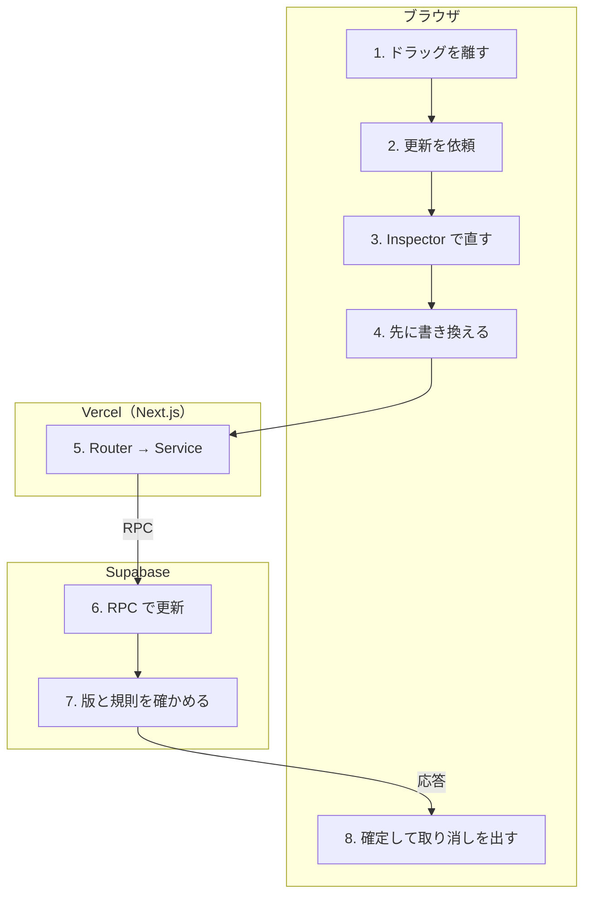

# Plan / Record を動かす・直す

<!-- learn:generated:start — 正本 このファイルの learn:journey の JSON / 再生成 pnpm learn:generate / 検証 pnpm docs:check。この範囲は手編集しない -->

カレンダー上でドラッグ・リサイズするか、Inspector で時刻・メモ・アクティビティを直す。どちらも同じ更新 command に行き着き、読み込んだ時の版（updated_at）と DB の版が一致した時だけ書き込む。過去の Plan も動かせる。



通るサービス: ブラウザ / Vercel（Next.js） / Supabase。段 8・失敗 9 種。

#### この経路を守るテスト

- [`apps/product/src/lib/test/e2e/timeblock-drag-move.spec.ts`](../../../apps/product/src/lib/test/e2e/timeblock-drag-move.spec.ts) で `test('過去 Plan をドラッグ移動すると新しい時刻が保存される'` を探す（E2E。過去 Plan を動かして DB に残ることまで見る）
- [`apps/product/src/lib/test/e2e/timeblock-conflict.spec.ts`](../../../apps/product/src/lib/test/e2e/timeblock-conflict.spec.ts) で `test('別 writer が同じ Plan を更新すると、UI は conflict として最新値を読み直す'` を探す（E2E。Inspector の古い入力が別の場所の値を潰さないこと）

### 1. ドラッグ・リサイズを離す（ブラウザ）

つかんだ瞬間に、その Plan / Record の版（updated_at）を控える。動かしている間は画面が持つデータで同じ種類同士の重なりを確かめ、重なる位置で離すと元の位置へ戻す（送らない）。重ならなければ新しい時刻と控えた版を更新処理へ渡す。Plan の過去・未来は区別しない。

- **なぜ必要か**: つかんだ時点の版を送ることで、動かしている間に別の場所で変わっていたら上書きせずに止められる。重なりを先に見るのは往復を減らすための写し。
- **入力 → 出力**: 離した位置の開始・終了時刻、つかんだ時の版 → id + 新しい時刻 + expectedUpdatedAt
- **ここを変えると**: Plan を Record の列へ落とした時だけは更新ではなく記録になる（「Record を作る・Plan を記録する」）。重なりの判定を変える時は、DB の排他制約（Plan 同士・Record 同士、半開区間 [start, end)）と揃っているかを見る。
- **コード**:
  - [`apps/product/src/features/calendar/interaction/interaction-effects.ts`](../../../apps/product/src/features/calendar/interaction/interaction-effects.ts) で `case 'RESIZE_COMPLETE': {` を探す
  - [`apps/product/src/features/calendar/interaction/useInteraction.ts`](../../../apps/product/src/features/calendar/interaction/useInteraction.ts) で `return checkClientSideOverlapByKind(` を探す
  - [`apps/product/src/features/calendar/interaction/GhostRenderer.tsx`](../../../apps/product/src/features/calendar/interaction/GhostRenderer.tsx) で `message={t('errors.timeOverlap')}` を探す

<details>
<summary>⚡ 離した位置が既存と重なる — 画面: 押せない / データ: 変化なし / 再試行: 利用者がやり直す / 痕跡: 残らない</summary>

- 画面: 動かしている間に重なりの案内が出て、離すと元の位置へ戻る。
- データ: 変化なし。サーバーへは何も送っていない。
- 再試行: なし。別の位置へ動かし直す。
- 痕跡: 何も残らない（通信前）。
- **最初に見る場所**: 仕様どおり。画面の一覧が古い（別タブで作った直後など）とすり抜け、DB の排他制約（23P01）で止まる。
- 根拠:
  - [`apps/product/src/features/calendar/interaction/interaction-effects.ts`](../../../apps/product/src/features/calendar/interaction/interaction-effects.ts) で `case 'DROP_REJECTED':` を探す

</details>

### 2. Plan か Record かを引いて更新を依頼する（ブラウザ）

一覧のキャッシュから id で行を探し、Plan か Record かを決める。移行された Record（auto_migrated）は何もせず終える。Record の終了を未来へ動かそうとした時は送らずに「記録は未来へ移動できません」を出す。それ以外は updatePlan / updateRecord を呼ぶ。

- **なぜ必要か**: カレンダーの操作は id しか持たないので、どちらの更新 command を使うかをここで決める。Record の未来移動を先に止めるのは DB 規則（DT005）の写し。
- **入力 → 出力**: id + 新しい時刻 + 版 → updatePlan / updateRecord の呼び出し（成功時に取り消しトーストを出す約束付き）
- **ここを変えると**: 時刻の規則の写し。規則を変える時は invariants.md §時刻 の写し表に沿ってここも消す。移行された Record を黙って無視する分岐は、UI 側で動かせないようにしている前提に立つ。
- **コード**:
  - [`apps/product/src/features/calendar/hooks/operations/useTimeblockOperations.ts`](../../../apps/product/src/features/calendar/hooks/operations/useTimeblockOperations.ts) で `const handleUpdateTimeblock = useCallback(` を探す
  - [`apps/product/src/features/calendar/hooks/operations/useTimeblockOperations.ts`](../../../apps/product/src/features/calendar/hooks/operations/useTimeblockOperations.ts) で `toast.error(t('timeblock.editor.timeLocked'));` を探す
  - [`docs/engineering/invariants.md`](../../engineering/invariants.md) で `### 規則の写しと、その分類` を探す
- **この段を守るテスト**:
  - [`apps/product/src/features/calendar/hooks/operations/useTimeblockOperations.test.tsx`](../../../apps/product/src/features/calendar/hooks/operations/useTimeblockOperations.test.tsx) で `it('過去の plan を過去の範囲内へ動かしても新しい時刻で mutate を呼ぶ'` を探す
  - [`apps/product/src/features/calendar/hooks/operations/useTimeblockOperations.test.tsx`](../../../apps/product/src/features/calendar/hooks/operations/useTimeblockOperations.test.tsx) で `it('record を未来へ動かす更新は timeLocked トーストを出し mutate を呼ばない'` を探す

<details>
<summary>⚡ Record の終了を未来へ動かした — 画面: エラー表示 / データ: 変化なし / 再試行: しない / 痕跡: 残らない</summary>

- 画面: 「記録は未来へ移動できません」のトーストが出て、元の位置に戻る。
- データ: 変化なし。サーバーへは何も送っていない。
- 再試行: なし。
- 痕跡: 何も残らない（通信前）。
- **最初に見る場所**: 仕様どおり（Record は未来に終われない）。
- 根拠:
  - [`apps/product/messages/ja/timeblock.json`](../../../apps/product/messages/ja/timeblock.json) で `"timeLocked": "記録は未来へ移動できません"` を探す

</details>

### 3. Inspector で直すと、保存を直列にまとめる（ブラウザ）

Inspector には保存ボタンが無く、時刻・アクティビティ・充実度は変えた瞬間に、メモは入力が 600ms 止まるか欄を離れた時に保存を積む。保存は 1 本ずつ順に送り、送っている間に積まれた変更は最新の値へまとめて次の 1 回で送る。時刻は送る前に画面のデータで同じ種類同士の重なりを確かめ、重なれば入力欄の下に案内を出して送らない。

- **なぜ必要か**: 速く続けて直しても、古い版を前提にした保存が追い越して新しい値を潰さないようにするため。成功するたびに返ってきた版を次の保存に使う。
- **入力 → 出力**: 入力欄の変更（差分） → 1 本ずつの updatePlan / updateRecord（expectedUpdatedAt は直前の成功が返した版）
- **ここを変えると**: まとめ方を変えると、競合時にどの変更を捨てるか（古い版の待ち行列は捨てる）と、結果が分からない時に止めるか（止めて自動再送しない）の 2 つが崩れる。Inspector は自前の取り消しトーストを出さない。
- **コード**:
  - [`apps/product/src/features/timeblock/hooks/useCoalescedTimeblockSave.ts`](../../../apps/product/src/features/timeblock/hooks/useCoalescedTimeblockSave.ts) で `class CoalescedTimeblockSaveQueue` を探す
  - [`apps/product/src/features/timeblock/components/editor/TimeblockInspectorForm.tsx`](../../../apps/product/src/features/timeblock/components/editor/TimeblockInspectorForm.tsx) で `const NOTE_SAVE_DELAY_MS = 600;` を探す
  - [`apps/product/src/features/timeblock/components/editor/TimeblockInspectorForm.tsx`](../../../apps/product/src/features/timeblock/components/editor/TimeblockInspectorForm.tsx) で `const handleDateTimeChange = useCallback(` を探す
- **この段を守るテスト**:
  - [`apps/product/src/features/timeblock/hooks/useCoalescedTimeblockSave.test.tsx`](../../../apps/product/src/features/timeblock/hooks/useCoalescedTimeblockSave.test.tsx) で `it('保存中の変更を最新の差分へまとめ、直列に保存する'` を探す
  - [`apps/product/src/features/timeblock/components/editor/TimeblockInspectorForm.test.tsx`](../../../apps/product/src/features/timeblock/components/editor/TimeblockInspectorForm.test.tsx) で `it('Planを別のPlanと重なる時間へ変更するとインライン表示し、保存しない'` を探す

<details>
<summary>⚡ 直した時刻が既存と重なる — 画面: エラー表示 / データ: 変化なし / 再試行: 利用者がやり直す / 痕跡: 残らない</summary>

- 画面: 日時の欄の下に重なりの案内が出る。トーストは出ない。
- データ: 変化なし。送っていない。
- 再試行: なし。空いた時刻へ直すと案内が消えて保存される。
- 痕跡: 何も残らない。
- **最初に見る場所**: 仕様どおり。Plan と Record の間の重なりは許す（別の列）。
- 根拠:
  - [`apps/product/src/features/timeblock/components/editor/TimeblockInspectorForm.tsx`](../../../apps/product/src/features/timeblock/components/editor/TimeblockInspectorForm.tsx) で `setHasTimeConflict(true);` を探す

</details>

### 4. 先に画面を書き換える（楽観的更新）（ブラウザ）

一覧と詳細のキャッシュを snapshot してから、該当行のタイトル・メモ・開始・終了を書き換える。失敗したら snapshot へ戻し、エラーの種類ごとの文言でトーストを出す。retry: false で自動では送り直さない。

- **なぜ必要か**: 離した瞬間に新しい位置へ描くため。失敗した時に操作前へ戻せるよう、書き換える前の状態を持っておく。
- **入力 → 出力**: 更新の入力 → 書き換えたキャッシュと snapshot
- **ここを変えると**: 書き換える項目はタイトル・メモ・開始・終了（Record は充実度も）だけ。アクティビティの変更はここでは一覧へ反映せず、返事で差し替わる。書き換える項目を足す時はここと onSuccess の差し替えを揃える。
- **コード**:
  - [`apps/product/src/features/timeblock/hooks/useTimeblockWriteMutations.ts`](../../../apps/product/src/features/timeblock/hooks/useTimeblockWriteMutations.ts) で `const updatePlan = api.planCommands.update.useMutation` を探す
  - [`apps/product/src/features/timeblock/hooks/useTimeblockWriteMutations.ts`](../../../apps/product/src/features/timeblock/hooks/useTimeblockWriteMutations.ts) で `const reportUpdateError = ` を探す
- **この段を守るテスト**:
  - [`apps/product/src/features/timeblock/hooks/useTimeblockWriteMutations.inline-error.test.tsx`](../../../apps/product/src/features/timeblock/hooks/useTimeblockWriteMutations.inline-error.test.tsx) で `it('Plan updateの失敗で楽観patchした時間を操作前へ戻す'` を探す

<details>
<summary>⚡ 通信が途中で切れる・結果が分からない — 画面: エラー表示 / データ: どちらもありうる / 再試行: しない / 痕跡: Sentry</summary>

- 画面: カレンダーのドラッグなら元の位置へ戻り「保存に失敗」のトースト。Inspector なら同じトーストに加え、入力を残したまま操作を止めて「保存結果を確認できません。…開き直してください」を出す。
- データ: どちらもありうる（DB で確定した後に返事だけ失われた場合）。
- 再試行: しない。Inspector は待っている変更も自動では送らず止める。一覧は成功・失敗どちらでも取り直す。
- 痕跡: サーバーの形をしていない通信エラーとしてブラウザから Sentry へ（分析の同意がある時だけ）。
- **最初に見る場所**: Sentry の source:trpc_client_transport と、同じ時刻の Vercel の /api/trpc ログ。
- 根拠:
  - [`apps/product/src/features/timeblock/hooks/useTimeblockWriteMutations.ts`](../../../apps/product/src/features/timeblock/hooks/useTimeblockWriteMutations.ts) で `export function isTimeblockUncertainError` を探す
  - [`apps/product/src/features/timeblock/components/editor/TimeblockInspectorForm.tsx`](../../../apps/product/src/features/timeblock/components/editor/TimeblockInspectorForm.tsx) で `{t('timeblock.editor.toast.writeUnresolved')}` を探す

</details>

### 5. Router → Service で足りない項目を埋める（Vercel（Next.js））

/api/trpc の入口と関門（ログイン・MFA・利用権・write fence・rate limit）は「Plan を保存」と同じ。planCommands.update / recordCommands.update は id・expectedUpdatedAt・data 以外の key を拒否する（.strict()）。Service は今の行を読み、送られなかった項目を今の値で埋め、アクティビティが変わる時だけ使えるかを確かめてから command へ渡す。

- **なぜ必要か**: command は全項目を受け取る形なので、差分だけ送る UI と MCP の両方をここで同じ形へ揃える。userId は ctx からしか来ないようにし、他人の行を書き換える経路を作らない。
- **入力 → 出力**: id + expectedUpdatedAt + 差分 → 全項目を埋めた更新 command の入力
- **ここを変えると**: schema に項目を足す時は、Service で埋める処理と command の引数を揃える。userId を input から受け取る形にしない（REVIEW-1）。
- **コード**:
  - [`apps/product/src/features/timeblock/server/plan-commands-router.ts`](../../../apps/product/src/features/timeblock/server/plan-commands-router.ts) で `const versionedPlanSchema = planIdSchema` を探す
  - [`apps/product/src/features/timeblock/server/timeblock-command-service.ts`](../../../apps/product/src/features/timeblock/server/timeblock-command-service.ts) で `async updatePlan(options: VersionedUpdateOptions<UpdatePlanInput>)` を探す
  - [`apps/product/src/features/timeblock/server/record-commands-router.ts`](../../../apps/product/src/features/timeblock/server/record-commands-router.ts) で `update: protectedProcedure` を探す

### 6. Supabase の RPC で更新する（Supabase）

service role の client で update_plan_command_v1 / update_record_command_v1 を呼ぶ。版は変換せずそのまま渡す。Postgres のエラーコードをアプリのコードへ訳す（DT002 → STALE_VERSION、23P01 → TIME_OVERLAP、DT003 → INVALID_TIME_RANGE、DT005 → RECORD_IN_FUTURE）。deadlock（40P01）だけ server 内で 1 回送り直す。

- **なぜ必要か**: 利用者のセッションからは plans / records へ直接書けないので、書き込みはこの adapter に閉じる。コードを訳すのは、UI が理由ごとの文言を出せるようにするため。
- **入力 → 出力**: 全項目 + expectedUpdatedAt + userId → 更新後の行（新しい updated_at）か、訳したエラーコード
- **ここを変えると**: 訳したコードは client-safe-service-code.ts の許可一覧に載っているものだけがブラウザへ届く。載っていないコードは「結果不明」として扱われ、Inspector が止まる側に倒れる。
- **コード**:
  - [`apps/product/src/features/timeblock/server/timeblock-command-client.ts`](../../../apps/product/src/features/timeblock/server/timeblock-command-client.ts) で `this.admin.rpc('update_plan_command_v1', {` を探す
  - [`apps/product/src/features/timeblock/server/timeblock-command-client.ts`](../../../apps/product/src/features/timeblock/server/timeblock-command-client.ts) で `DT002: 'STALE_VERSION',` を探す
  - [`apps/product/src/lib/trpc/client-safe-service-code.ts`](../../../apps/product/src/lib/trpc/client-safe-service-code.ts) で `const CLIENT_SAFE_SERVICE_CODES = new Set([` を探す
- **この段を守るテスト**:
  - [`apps/product/src/features/timeblock/server/timeblock-command-client.test.ts`](../../../apps/product/src/features/timeblock/server/timeblock-command-client.test.ts) で `it('raw microsecond CAS tokenを変換せずupdate commandへ渡す'` を探す
  - [`apps/product/src/features/timeblock/server/timeblock-command-client.test.ts`](../../../apps/product/src/features/timeblock/server/timeblock-command-client.test.ts) で `it('deadlock再発、lock待ち、timeoutはclient再送向けにせず分類する'` を探す

<details>
<summary>⚡ lock 待ち・timeout・deadlock の再発 — 画面: エラー表示 / データ: 変化なし / 再試行: しない / 痕跡: 残らない</summary>

- 画面: ドラッグなら元の位置へ戻り「保存に失敗」のトースト。Inspector なら操作を止めて「保存結果を確認できません」の案内。
- データ: 変化なし（RPC のトランザクションごと取り消される）。
- 再試行: しない。利用者が画面を開き直してから直す。
- 痕跡: 想定内のコード（RETRYABLE_CONTENTION / TEMPORARY_FAILURE）なので Sentry には出ない。
- **最初に見る場所**: 頻発するなら Supabase の Postgres ログで lock を見る（command は利用者単位の lock を取ってから書く）。
- 根拠:
  - [`apps/product/src/features/timeblock/server/timeblock-command-client.ts`](../../../apps/product/src/features/timeblock/server/timeblock-command-client.ts) で `throwExpectedCommandError('RETRYABLE_CONTENTION');` を探す

</details>

### 7. DB が版と規則を確かめて書き込む（Supabase）

行を FOR UPDATE で押さえ、削除済みなら DT001、版が違えば DT002 で止める。値が何も変わらないなら書き込まずに今の行を返す。書き込むと updated_at が進む（これが次の版）。時刻の規則（DT003 / DT005）は trigger が、重なりは排他制約（Plan 同士・Record 同士、[start, end)）が弾く。

- **なぜ必要か**: 「読んだ時の版と同じ時だけ書く」で、別のタブ・端末・MCP の変更を黙って上書きしないため。規則の正本はここで、UI の確認はすべて写し。
- **入力 → 出力**: 全項目 + expectedUpdatedAt → 更新後の行
- **ここを変えると**: 版の比較を緩めると、別の場所の変更を古い入力が潰す。規則を変える時は DB → service → UI の写しを 1 変更で全部変える。
- **コード**:
  - [`supabase/migrations/20260824090000_detach_tag_id_from_timeblock_write_path.sql`](../../../supabase/migrations/20260824090000_detach_tag_id_from_timeblock_write_path.sql) で `RAISE EXCEPTION 'Plan version conflict' USING ERRCODE = 'DT002';` を探す
  - [`supabase/migrations/20260729062435_timeblock_atomic_commands.sql`](../../../supabase/migrations/20260729062435_timeblock_atomic_commands.sql) で `RAISE EXCEPTION 'Records cannot end in the future' USING ERRCODE = 'DT005';` を探す
  - [`supabase/migrations/20260708232500_add_time_model_tables.sql`](../../../supabase/migrations/20260708232500_add_time_model_tables.sql) で `ADD CONSTRAINT plans_no_overlap` を探す
- **この段を守るテスト**:
  - [`apps/product/src/lib/test/integration/timeblock-atomic-commands.integration.test.ts`](../../../apps/product/src/lib/test/integration/timeblock-atomic-commands.integration.test.ts) で `it('serializes concurrent Plan updates with exact compare-and-swap'` を探す（local Supabase が要る integration）
  - [`apps/product/src/lib/test/integration/timeblock-atomic-commands.integration.test.ts`](../../../apps/product/src/lib/test/integration/timeblock-atomic-commands.integration.test.ts) で `it('places and moves Plans anywhere on the timeline, and rejects retired skip'` を探す（過去・未来を問わず Plan を動かせること）

<details>
<summary>⚡ 別の場所で先に変わっていた（DT002） — 画面: エラー表示 / データ: 変化なし / 再試行: 利用者がやり直す / 痕跡: 残らない</summary>

- 画面: 「別の場所で変更されたため、最新の内容を読み込みました」のトースト。ドラッグなら元の位置へ戻る。Inspector なら最新の行を読み直して入力欄を描き直し、待っていた古い変更は捨てる。
- データ: 変化なし。別の場所の値が残る。
- 再試行: しない。最新の値を見てから直し直す。
- 痕跡: 想定内なので Sentry には出ない。
- **最初に見る場所**: 別タブ・別端末・MCP で同じ行を触っていないか。
- 根拠:
  - [`apps/product/src/features/timeblock/hooks/useTimeblockWriteMutations.ts`](../../../apps/product/src/features/timeblock/hooks/useTimeblockWriteMutations.ts) で `export function isTimeblockStaleError` を探す
  - [`apps/product/src/features/timeblock/components/editor/TimeblockInspectorForm.tsx`](../../../apps/product/src/features/timeblock/components/editor/TimeblockInspectorForm.tsx) で `} else if (isTimeblockStaleError(error)) {` を探す

</details>

<details>
<summary>⚡ 既存と重なる（23P01） — 画面: エラー表示 / データ: 変化なし / 再試行: 利用者がやり直す / 痕跡: 残らない</summary>

- 画面: ドラッグなら元の位置へ戻り重なりのトースト。Inspector なら日時の欄の下に案内（今の入力と同じ時刻の拒否だった時だけ）。
- データ: 変化なし。
- 再試行: しない。
- 痕跡: 想定内なので Sentry には出ない。
- **最初に見る場所**: 画面の一覧が古かった可能性。取り直しで揃う。
- 根拠:
  - [`apps/product/src/features/timeblock/server/timeblock-command-client.ts`](../../../apps/product/src/features/timeblock/server/timeblock-command-client.ts) で `'23P01': 'TIME_OVERLAP',` を探す
  - [`apps/product/src/features/timeblock/components/editor/TimeblockInspectorForm.tsx`](../../../apps/product/src/features/timeblock/components/editor/TimeblockInspectorForm.tsx) で `const handleUpdateTimeOverlap = useCallback(` を探す

</details>

<details>
<summary>⚡ Inspector で Record の終了を未来にした（DT005） — 画面: エラー表示 / データ: 変化なし / 再試行: しない / 痕跡: 残らない</summary>

- 画面: 「記録は未来へ移動できません」のトースト。Inspector の時刻欄には送る前の確認が無いので、サーバーで初めて止まる。
- データ: 変化なし。
- 再試行: しない。
- 痕跡: 想定内（BAD_REQUEST）なので Sentry には出ない。
- **最初に見る場所**: 仕様どおり。Inspector の入力欄が拒否された値のまま残るかは未確認。
- 根拠:
  - [`apps/product/src/features/timeblock/hooks/useTimeblockWriteMutations.ts`](../../../apps/product/src/features/timeblock/hooks/useTimeblockWriteMutations.ts) で `case 'RECORD_IN_FUTURE':` を探す

</details>

### 8. 返事で確定し、取り消しを出す（ブラウザ）

返ってきた行で一覧と詳細を差し替える。ドラッグ・リサイズの時だけ「更新しました」のトースト（6 秒、「元に戻す」付き）を出し、押すと前の時刻を今返ってきた版で送り直す。Inspector は返ってきた版を次の保存に使い、トーストは出さない。成功・失敗どちらでも plans / records / statistics / review を取り直す。

- **なぜ必要か**: 確認ダイアログを挟まずに動かせる代わりに、すぐ戻せるようにする（可逆は速く）。取り消しに新しい版を使うのは、古い版だと自分の更新と競合して弾かれるため。
- **入力 → 出力**: 更新後の行 → 確定した画面 + 取り消しトースト
- **ここを変えると**: 取り消しも同じ更新 command を通るので、版の扱いを変えると取り消しも壊れる。集計画面を足したら取り直し対象に入れる。
- **コード**:
  - [`apps/product/src/features/calendar/hooks/operations/useTimeblockOperations.ts`](../../../apps/product/src/features/calendar/hooks/operations/useTimeblockOperations.ts) で `toast.success(t('timeblock.toast.updated'), {` を探す
  - [`apps/product/src/features/timeblock/hooks/useTimeblockWriteMutations.ts`](../../../apps/product/src/features/timeblock/hooks/useTimeblockWriteMutations.ts) で `replaceServerRow('plans', updated);` を探す
- **この段を守るテスト**:
  - [`apps/product/src/features/calendar/hooks/operations/useTimeblockOperations.test.tsx`](../../../apps/product/src/features/calendar/hooks/operations/useTimeblockOperations.test.tsx) で `it('onSuccess で showTimeChangeUndoToast が呼ばれ、Undo クリックで前の時間へ戻す'` を探す
  - [`apps/product/src/features/timeblock/hooks/useTimeblockWriteMutations.inline-error.test.tsx`](../../../apps/product/src/features/timeblock/hooks/useTimeblockWriteMutations.inline-error.test.tsx) で `it('update commandの返却行とraw versionを一覧・詳細cacheの正本にする'` を探す

<details>
<summary>⚡ 取り消す前に同じ行をもう一度動かした — 画面: エラー表示 / データ: 変化なし / 再試行: しない / 痕跡: 残らない</summary>

- 画面: 取り消しを押すと「別の場所で変更されたため、最新の内容を読み込みました」。
- データ: 変化なし。後から動かした位置が残る。
- 再試行: しない。
- 痕跡: 何も残らない。
- **最初に見る場所**: 仕様どおり。取り消しは直前の 1 回ぶんの版しか持たない。
- 根拠:
  - [`apps/product/src/features/calendar/hooks/operations/useTimeblockOperations.ts`](../../../apps/product/src/features/calendar/hooks/operations/useTimeblockOperations.ts) で `const showTimeChangeUndoToast = useCallback(` を探す

</details>

<!-- learn:generated:end -->

## データ（正本）

この JSON がこのページの正本。上の説明と図、`pnpm learn` の対話画面はここから生成する。参照（`path` + `find`）は `pnpm docs:check` が実在を検査する。

```json learn:journey
{
  "id": "edit-timeblock",
  "title": "Plan / Record を動かす・直す",
  "order": 20,
  "group": "calendar",
  "intro": "カレンダー上でドラッグ・リサイズするか、Inspector で時刻・メモ・アクティビティを直す。どちらも同じ更新 command に行き着き、読み込んだ時の版（updated_at）と DB の版が一致した時だけ書き込む。過去の Plan も動かせる。",
  "play": "▶ ドラッグして離す",
  "hops": [
    {
      "id": "drag",
      "svc": "browser",
      "title": "ドラッグ・リサイズを離す",
      "what": "つかんだ瞬間に、その Plan / Record の版（updated_at）を控える。動かしている間は画面が持つデータで同じ種類同士の重なりを確かめ、重なる位置で離すと元の位置へ戻す（送らない）。重ならなければ新しい時刻と控えた版を更新処理へ渡す。Plan の過去・未来は区別しない。",
      "why": "つかんだ時点の版を送ることで、動かしている間に別の場所で変わっていたら上書きせずに止められる。重なりを先に見るのは往復を減らすための写し。",
      "io": {
        "in": "離した位置の開始・終了時刻、つかんだ時の版",
        "out": "id + 新しい時刻 + expectedUpdatedAt"
      },
      "change": "Plan を Record の列へ落とした時だけは更新ではなく記録になる（「Record を作る・Plan を記録する」）。重なりの判定を変える時は、DB の排他制約（Plan 同士・Record 同士、半開区間 [start, end)）と揃っているかを見る。",
      "refs": [
        {
          "path": "apps/product/src/features/calendar/interaction/interaction-effects.ts",
          "find": "case 'RESIZE_COMPLETE': {"
        },
        {
          "path": "apps/product/src/features/calendar/interaction/useInteraction.ts",
          "find": "return checkClientSideOverlapByKind("
        },
        {
          "path": "apps/product/src/features/calendar/interaction/GhostRenderer.tsx",
          "find": "message={t('errors.timeOverlap')}"
        }
      ],
      "fails": [
        {
          "id": "drag-overlap",
          "label": "離した位置が既存と重なる",
          "screen": "動かしている間に重なりの案内が出て、離すと元の位置へ戻る。",
          "data": "変化なし。サーバーへは何も送っていない。",
          "retry": "なし。別の位置へ動かし直す。",
          "trace": "何も残らない（通信前）。",
          "look": "仕様どおり。画面の一覧が古い（別タブで作った直後など）とすり抜け、DB の排他制約（23P01）で止まる。",
          "refs": [
            {
              "path": "apps/product/src/features/calendar/interaction/interaction-effects.ts",
              "find": "case 'DROP_REJECTED':"
            }
          ],
          "tags": {
            "screen": "blocked",
            "data": "unchanged",
            "retry": "user",
            "trace": "none"
          },
          "screenAfter": {
            "t": "calendar",
            "url": "/ja/calendar",
            "blocks": [
              {
                "state": "saved",
                "label": "既存の予定",
                "from": 2
              },
              {
                "state": "saved",
                "label": "仕事",
                "from": 0
              }
            ],
            "note": "（元の位置へ戻る）。案内は「この時間帯には既に予定があります」"
          }
        }
      ],
      "short": "ドラッグを離す",
      "screen": {
        "t": "calendar",
        "url": "/ja/calendar",
        "blocks": [
          {
            "state": "select",
            "label": "仕事",
            "from": 1
          }
        ],
        "note": "Plan をつかんで 1 時間後ろへ動かしたところ"
      }
    },
    {
      "id": "handle-update",
      "svc": "browser",
      "title": "Plan か Record かを引いて更新を依頼する",
      "what": "一覧のキャッシュから id で行を探し、Plan か Record かを決める。移行された Record（auto_migrated）は何もせず終える。Record の終了を未来へ動かそうとした時は送らずに「記録は未来へ移動できません」を出す。それ以外は updatePlan / updateRecord を呼ぶ。",
      "why": "カレンダーの操作は id しか持たないので、どちらの更新 command を使うかをここで決める。Record の未来移動を先に止めるのは DB 規則（DT005）の写し。",
      "io": {
        "in": "id + 新しい時刻 + 版",
        "out": "updatePlan / updateRecord の呼び出し（成功時に取り消しトーストを出す約束付き）"
      },
      "change": "時刻の規則の写し。規則を変える時は invariants.md §時刻 の写し表に沿ってここも消す。移行された Record を黙って無視する分岐は、UI 側で動かせないようにしている前提に立つ。",
      "refs": [
        {
          "path": "apps/product/src/features/calendar/hooks/operations/useTimeblockOperations.ts",
          "find": "const handleUpdateTimeblock = useCallback("
        },
        {
          "path": "apps/product/src/features/calendar/hooks/operations/useTimeblockOperations.ts",
          "find": "toast.error(t('timeblock.editor.timeLocked'));"
        },
        {
          "path": "docs/engineering/invariants.md",
          "find": "### 規則の写しと、その分類"
        }
      ],
      "tests": [
        {
          "path": "apps/product/src/features/calendar/hooks/operations/useTimeblockOperations.test.tsx",
          "find": "it('過去の plan を過去の範囲内へ動かしても新しい時刻で mutate を呼ぶ'"
        },
        {
          "path": "apps/product/src/features/calendar/hooks/operations/useTimeblockOperations.test.tsx",
          "find": "it('record を未来へ動かす更新は timeLocked トーストを出し mutate を呼ばない'"
        }
      ],
      "fails": [
        {
          "id": "record-future-local",
          "label": "Record の終了を未来へ動かした",
          "screen": "「記録は未来へ移動できません」のトーストが出て、元の位置に戻る。",
          "data": "変化なし。サーバーへは何も送っていない。",
          "retry": "なし。",
          "trace": "何も残らない（通信前）。",
          "look": "仕様どおり（Record は未来に終われない）。",
          "refs": [
            {
              "path": "apps/product/messages/ja/timeblock.json",
              "find": "\"timeLocked\": \"記録は未来へ移動できません\""
            }
          ],
          "tags": {
            "screen": "toast",
            "data": "unchanged",
            "retry": "none",
            "trace": "none"
          },
          "screenAfter": {
            "t": "calendar",
            "url": "/ja/calendar",
            "blocks": [
              {
                "state": "record",
                "label": "読書"
              }
            ],
            "toast": "記録は未来へ移動できません",
            "toastTone": "bad"
          }
        }
      ],
      "short": "更新を依頼"
    },
    {
      "id": "inspector-edit",
      "svc": "browser",
      "title": "Inspector で直すと、保存を直列にまとめる",
      "what": "Inspector には保存ボタンが無く、時刻・アクティビティ・充実度は変えた瞬間に、メモは入力が 600ms 止まるか欄を離れた時に保存を積む。保存は 1 本ずつ順に送り、送っている間に積まれた変更は最新の値へまとめて次の 1 回で送る。時刻は送る前に画面のデータで同じ種類同士の重なりを確かめ、重なれば入力欄の下に案内を出して送らない。",
      "why": "速く続けて直しても、古い版を前提にした保存が追い越して新しい値を潰さないようにするため。成功するたびに返ってきた版を次の保存に使う。",
      "io": {
        "in": "入力欄の変更（差分）",
        "out": "1 本ずつの updatePlan / updateRecord（expectedUpdatedAt は直前の成功が返した版）"
      },
      "change": "まとめ方を変えると、競合時にどの変更を捨てるか（古い版の待ち行列は捨てる）と、結果が分からない時に止めるか（止めて自動再送しない）の 2 つが崩れる。Inspector は自前の取り消しトーストを出さない。",
      "refs": [
        {
          "path": "apps/product/src/features/timeblock/hooks/useCoalescedTimeblockSave.ts",
          "find": "class CoalescedTimeblockSaveQueue"
        },
        {
          "path": "apps/product/src/features/timeblock/components/editor/TimeblockInspectorForm.tsx",
          "find": "const NOTE_SAVE_DELAY_MS = 600;"
        },
        {
          "path": "apps/product/src/features/timeblock/components/editor/TimeblockInspectorForm.tsx",
          "find": "const handleDateTimeChange = useCallback("
        }
      ],
      "tests": [
        {
          "path": "apps/product/src/features/timeblock/hooks/useCoalescedTimeblockSave.test.tsx",
          "find": "it('保存中の変更を最新の差分へまとめ、直列に保存する'"
        },
        {
          "path": "apps/product/src/features/timeblock/components/editor/TimeblockInspectorForm.test.tsx",
          "find": "it('Planを別のPlanと重なる時間へ変更するとインライン表示し、保存しない'"
        }
      ],
      "fails": [
        {
          "id": "inspector-overlap",
          "label": "直した時刻が既存と重なる",
          "screen": "日時の欄の下に重なりの案内が出る。トーストは出ない。",
          "data": "変化なし。送っていない。",
          "retry": "なし。空いた時刻へ直すと案内が消えて保存される。",
          "trace": "何も残らない。",
          "look": "仕様どおり。Plan と Record の間の重なりは許す（別の列）。",
          "refs": [
            {
              "path": "apps/product/src/features/timeblock/components/editor/TimeblockInspectorForm.tsx",
              "find": "setHasTimeConflict(true);"
            }
          ],
          "tags": {
            "screen": "toast",
            "data": "unchanged",
            "retry": "user",
            "trace": "none"
          },
          "screenAfter": {
            "t": "form",
            "title": "仕事",
            "url": "/ja/calendar",
            "fields": [
              ["日付", "今日"],
              ["時間", "10:00 – 11:00"],
              ["メモ", ""]
            ],
            "error": "この時間帯には既に予定があります"
          }
        }
      ],
      "short": "Inspector で直す",
      "screen": {
        "t": "form",
        "title": "仕事",
        "url": "/ja/calendar",
        "fields": [
          ["日付", "今日"],
          ["時間", "10:00 – 11:30"],
          ["メモ", "例: 集中できた"]
        ],
        "extra": "（保存ボタンは無い。変えた瞬間に保存する）"
      }
    },
    {
      "id": "optimistic",
      "svc": "browser",
      "title": "先に画面を書き換える（楽観的更新）",
      "what": "一覧と詳細のキャッシュを snapshot してから、該当行のタイトル・メモ・開始・終了を書き換える。失敗したら snapshot へ戻し、エラーの種類ごとの文言でトーストを出す。retry: false で自動では送り直さない。",
      "why": "離した瞬間に新しい位置へ描くため。失敗した時に操作前へ戻せるよう、書き換える前の状態を持っておく。",
      "io": {
        "in": "更新の入力",
        "out": "書き換えたキャッシュと snapshot"
      },
      "change": "書き換える項目はタイトル・メモ・開始・終了（Record は充実度も）だけ。アクティビティの変更はここでは一覧へ反映せず、返事で差し替わる。書き換える項目を足す時はここと onSuccess の差し替えを揃える。",
      "refs": [
        {
          "path": "apps/product/src/features/timeblock/hooks/useTimeblockWriteMutations.ts",
          "find": "const updatePlan = api.planCommands.update.useMutation"
        },
        {
          "path": "apps/product/src/features/timeblock/hooks/useTimeblockWriteMutations.ts",
          "find": "const reportUpdateError = "
        }
      ],
      "tests": [
        {
          "path": "apps/product/src/features/timeblock/hooks/useTimeblockWriteMutations.inline-error.test.tsx",
          "find": "it('Plan updateの失敗で楽観patchした時間を操作前へ戻す'"
        }
      ],
      "fails": [
        {
          "id": "network-lost",
          "label": "通信が途中で切れる・結果が分からない",
          "screen": "カレンダーのドラッグなら元の位置へ戻り「保存に失敗」のトースト。Inspector なら同じトーストに加え、入力を残したまま操作を止めて「保存結果を確認できません。…開き直してください」を出す。",
          "data": "どちらもありうる（DB で確定した後に返事だけ失われた場合）。",
          "retry": "しない。Inspector は待っている変更も自動では送らず止める。一覧は成功・失敗どちらでも取り直す。",
          "trace": "サーバーの形をしていない通信エラーとしてブラウザから Sentry へ（分析の同意がある時だけ）。",
          "look": "Sentry の source:trpc_client_transport と、同じ時刻の Vercel の /api/trpc ログ。",
          "refs": [
            {
              "path": "apps/product/src/features/timeblock/hooks/useTimeblockWriteMutations.ts",
              "find": "export function isTimeblockUncertainError"
            },
            {
              "path": "apps/product/src/features/timeblock/components/editor/TimeblockInspectorForm.tsx",
              "find": "{t('timeblock.editor.toast.writeUnresolved')}"
            }
          ],
          "tags": {
            "screen": "toast",
            "data": "unknown",
            "retry": "none",
            "trace": "sentry"
          },
          "screenAfter": {
            "t": "calendar",
            "url": "/ja/calendar",
            "blocks": [
              {
                "state": "saved",
                "label": "仕事",
                "from": 0
              }
            ],
            "toast": "保存できませんでした。入力内容は保持されています。もう一度お試しください",
            "toastTone": "bad",
            "note": "一覧の取り直しで、DB が確定していれば新しい位置に戻る"
          }
        }
      ],
      "short": "先に書き換える",
      "screen": {
        "t": "calendar",
        "url": "/ja/calendar",
        "blocks": [
          {
            "state": "temp",
            "label": "仕事（保存中）",
            "from": 1
          }
        ],
        "note": "返事を待たずに新しい位置へ描く"
      }
    },
    {
      "id": "router-service",
      "svc": "vercel",
      "title": "Router → Service で足りない項目を埋める",
      "what": "/api/trpc の入口と関門（ログイン・MFA・利用権・write fence・rate limit）は「Plan を保存」と同じ。planCommands.update / recordCommands.update は id・expectedUpdatedAt・data 以外の key を拒否する（.strict()）。Service は今の行を読み、送られなかった項目を今の値で埋め、アクティビティが変わる時だけ使えるかを確かめてから command へ渡す。",
      "why": "command は全項目を受け取る形なので、差分だけ送る UI と MCP の両方をここで同じ形へ揃える。userId は ctx からしか来ないようにし、他人の行を書き換える経路を作らない。",
      "io": {
        "in": "id + expectedUpdatedAt + 差分",
        "out": "全項目を埋めた更新 command の入力"
      },
      "change": "schema に項目を足す時は、Service で埋める処理と command の引数を揃える。userId を input から受け取る形にしない（REVIEW-1）。",
      "refs": [
        {
          "path": "apps/product/src/features/timeblock/server/plan-commands-router.ts",
          "find": "const versionedPlanSchema = planIdSchema"
        },
        {
          "path": "apps/product/src/features/timeblock/server/timeblock-command-service.ts",
          "find": "async updatePlan(options: VersionedUpdateOptions<UpdatePlanInput>)"
        },
        {
          "path": "apps/product/src/features/timeblock/server/record-commands-router.ts",
          "find": "update: protectedProcedure"
        }
      ],
      "fails": [],
      "short": "Router → Service"
    },
    {
      "id": "command-client",
      "svc": "supabase",
      "title": "Supabase の RPC で更新する",
      "what": "service role の client で update_plan_command_v1 / update_record_command_v1 を呼ぶ。版は変換せずそのまま渡す。Postgres のエラーコードをアプリのコードへ訳す（DT002 → STALE_VERSION、23P01 → TIME_OVERLAP、DT003 → INVALID_TIME_RANGE、DT005 → RECORD_IN_FUTURE）。deadlock（40P01）だけ server 内で 1 回送り直す。",
      "why": "利用者のセッションからは plans / records へ直接書けないので、書き込みはこの adapter に閉じる。コードを訳すのは、UI が理由ごとの文言を出せるようにするため。",
      "io": {
        "in": "全項目 + expectedUpdatedAt + userId",
        "out": "更新後の行（新しい updated_at）か、訳したエラーコード"
      },
      "change": "訳したコードは client-safe-service-code.ts の許可一覧に載っているものだけがブラウザへ届く。載っていないコードは「結果不明」として扱われ、Inspector が止まる側に倒れる。",
      "refs": [
        {
          "path": "apps/product/src/features/timeblock/server/timeblock-command-client.ts",
          "find": "this.admin.rpc('update_plan_command_v1', {"
        },
        {
          "path": "apps/product/src/features/timeblock/server/timeblock-command-client.ts",
          "find": "DT002: 'STALE_VERSION',"
        },
        {
          "path": "apps/product/src/lib/trpc/client-safe-service-code.ts",
          "find": "const CLIENT_SAFE_SERVICE_CODES = new Set(["
        }
      ],
      "tests": [
        {
          "path": "apps/product/src/features/timeblock/server/timeblock-command-client.test.ts",
          "find": "it('raw microsecond CAS tokenを変換せずupdate commandへ渡す'"
        },
        {
          "path": "apps/product/src/features/timeblock/server/timeblock-command-client.test.ts",
          "find": "it('deadlock再発、lock待ち、timeoutはclient再送向けにせず分類する'"
        }
      ],
      "fails": [
        {
          "id": "contention",
          "label": "lock 待ち・timeout・deadlock の再発",
          "screen": "ドラッグなら元の位置へ戻り「保存に失敗」のトースト。Inspector なら操作を止めて「保存結果を確認できません」の案内。",
          "data": "変化なし（RPC のトランザクションごと取り消される）。",
          "retry": "しない。利用者が画面を開き直してから直す。",
          "trace": "想定内のコード（RETRYABLE_CONTENTION / TEMPORARY_FAILURE）なので Sentry には出ない。",
          "look": "頻発するなら Supabase の Postgres ログで lock を見る（command は利用者単位の lock を取ってから書く）。",
          "refs": [
            {
              "path": "apps/product/src/features/timeblock/server/timeblock-command-client.ts",
              "find": "throwExpectedCommandError('RETRYABLE_CONTENTION');"
            }
          ],
          "tags": {
            "screen": "toast",
            "data": "unchanged",
            "retry": "none",
            "trace": "none"
          },
          "to": "optimistic",
          "back": "巻き戻し + トースト",
          "screenAfter": {
            "t": "calendar",
            "url": "/ja/calendar",
            "blocks": [
              {
                "state": "saved",
                "label": "仕事",
                "from": 0
              }
            ],
            "toast": "保存できませんでした。入力内容は保持されています。もう一度お試しください",
            "toastTone": "bad"
          }
        }
      ],
      "short": "RPC で更新",
      "via": "RPC"
    },
    {
      "id": "db-version",
      "svc": "supabase",
      "title": "DB が版と規則を確かめて書き込む",
      "what": "行を FOR UPDATE で押さえ、削除済みなら DT001、版が違えば DT002 で止める。値が何も変わらないなら書き込まずに今の行を返す。書き込むと updated_at が進む（これが次の版）。時刻の規則（DT003 / DT005）は trigger が、重なりは排他制約（Plan 同士・Record 同士、[start, end)）が弾く。",
      "why": "「読んだ時の版と同じ時だけ書く」で、別のタブ・端末・MCP の変更を黙って上書きしないため。規則の正本はここで、UI の確認はすべて写し。",
      "io": {
        "in": "全項目 + expectedUpdatedAt",
        "out": "更新後の行"
      },
      "change": "版の比較を緩めると、別の場所の変更を古い入力が潰す。規則を変える時は DB → service → UI の写しを 1 変更で全部変える。",
      "refs": [
        {
          "path": "supabase/migrations/20260824090000_detach_tag_id_from_timeblock_write_path.sql",
          "find": "RAISE EXCEPTION 'Plan version conflict' USING ERRCODE = 'DT002';"
        },
        {
          "path": "supabase/migrations/20260729062435_timeblock_atomic_commands.sql",
          "find": "RAISE EXCEPTION 'Records cannot end in the future' USING ERRCODE = 'DT005';"
        },
        {
          "path": "supabase/migrations/20260708232500_add_time_model_tables.sql",
          "find": "ADD CONSTRAINT plans_no_overlap"
        }
      ],
      "tests": [
        {
          "path": "apps/product/src/lib/test/integration/timeblock-atomic-commands.integration.test.ts",
          "find": "it('serializes concurrent Plan updates with exact compare-and-swap'",
          "why": "local Supabase が要る integration"
        },
        {
          "path": "apps/product/src/lib/test/integration/timeblock-atomic-commands.integration.test.ts",
          "find": "it('places and moves Plans anywhere on the timeline, and rejects retired skip'",
          "why": "過去・未来を問わず Plan を動かせること"
        }
      ],
      "fails": [
        {
          "id": "stale-version",
          "label": "別の場所で先に変わっていた（DT002）",
          "screen": "「別の場所で変更されたため、最新の内容を読み込みました」のトースト。ドラッグなら元の位置へ戻る。Inspector なら最新の行を読み直して入力欄を描き直し、待っていた古い変更は捨てる。",
          "data": "変化なし。別の場所の値が残る。",
          "retry": "しない。最新の値を見てから直し直す。",
          "trace": "想定内なので Sentry には出ない。",
          "look": "別タブ・別端末・MCP で同じ行を触っていないか。",
          "refs": [
            {
              "path": "apps/product/src/features/timeblock/hooks/useTimeblockWriteMutations.ts",
              "find": "export function isTimeblockStaleError"
            },
            {
              "path": "apps/product/src/features/timeblock/components/editor/TimeblockInspectorForm.tsx",
              "find": "} else if (isTimeblockStaleError(error)) {"
            }
          ],
          "tags": {
            "screen": "toast",
            "data": "unchanged",
            "retry": "user",
            "trace": "none"
          },
          "to": "optimistic",
          "back": "巻き戻し + 読み直し",
          "screenAfter": {
            "t": "calendar",
            "url": "/ja/calendar",
            "blocks": [
              {
                "state": "saved",
                "label": "仕事",
                "from": 2
              }
            ],
            "toast": "別の場所で変更されたため、最新の内容を読み込みました",
            "toastTone": "bad",
            "note": "別の場所で動かされた位置で描き直す"
          }
        },
        {
          "id": "overlap",
          "label": "既存と重なる（23P01）",
          "screen": "ドラッグなら元の位置へ戻り重なりのトースト。Inspector なら日時の欄の下に案内（今の入力と同じ時刻の拒否だった時だけ）。",
          "data": "変化なし。",
          "retry": "しない。",
          "trace": "想定内なので Sentry には出ない。",
          "look": "画面の一覧が古かった可能性。取り直しで揃う。",
          "refs": [
            {
              "path": "apps/product/src/features/timeblock/server/timeblock-command-client.ts",
              "find": "'23P01': 'TIME_OVERLAP',"
            },
            {
              "path": "apps/product/src/features/timeblock/components/editor/TimeblockInspectorForm.tsx",
              "find": "const handleUpdateTimeOverlap = useCallback("
            }
          ],
          "tags": {
            "screen": "toast",
            "data": "unchanged",
            "retry": "user",
            "trace": "none"
          },
          "to": "optimistic",
          "back": "巻き戻し + 重なりの案内",
          "screenAfter": {
            "t": "calendar",
            "url": "/ja/calendar",
            "blocks": [
              {
                "state": "saved",
                "label": "仕事",
                "from": 0
              }
            ],
            "toast": "この時間帯には既に記録があります",
            "toastTone": "bad",
            "note": "（文言は Plan の更新でも「記録」になっている）"
          }
        },
        {
          "id": "record-future-db",
          "label": "Inspector で Record の終了を未来にした（DT005）",
          "screen": "「記録は未来へ移動できません」のトースト。Inspector の時刻欄には送る前の確認が無いので、サーバーで初めて止まる。",
          "data": "変化なし。",
          "retry": "しない。",
          "trace": "想定内（BAD_REQUEST）なので Sentry には出ない。",
          "look": "仕様どおり。Inspector の入力欄が拒否された値のまま残るかは未確認。",
          "refs": [
            {
              "path": "apps/product/src/features/timeblock/hooks/useTimeblockWriteMutations.ts",
              "find": "case 'RECORD_IN_FUTURE':"
            }
          ],
          "tags": {
            "screen": "toast",
            "data": "unchanged",
            "retry": "none",
            "trace": "none"
          },
          "to": "optimistic",
          "back": "規則ごとの文言",
          "screenAfter": {
            "t": "form",
            "title": "読書",
            "url": "/ja/calendar",
            "fields": [
              ["日付", "今日"],
              ["時間", "16:00 – 18:00"]
            ],
            "error": "記録は未来へ移動できません"
          }
        }
      ],
      "short": "版と規則を確かめる"
    },
    {
      "id": "settle",
      "svc": "browser",
      "title": "返事で確定し、取り消しを出す",
      "what": "返ってきた行で一覧と詳細を差し替える。ドラッグ・リサイズの時だけ「更新しました」のトースト（6 秒、「元に戻す」付き）を出し、押すと前の時刻を今返ってきた版で送り直す。Inspector は返ってきた版を次の保存に使い、トーストは出さない。成功・失敗どちらでも plans / records / statistics / review を取り直す。",
      "why": "確認ダイアログを挟まずに動かせる代わりに、すぐ戻せるようにする（可逆は速く）。取り消しに新しい版を使うのは、古い版だと自分の更新と競合して弾かれるため。",
      "io": {
        "in": "更新後の行",
        "out": "確定した画面 + 取り消しトースト"
      },
      "change": "取り消しも同じ更新 command を通るので、版の扱いを変えると取り消しも壊れる。集計画面を足したら取り直し対象に入れる。",
      "refs": [
        {
          "path": "apps/product/src/features/calendar/hooks/operations/useTimeblockOperations.ts",
          "find": "toast.success(t('timeblock.toast.updated'), {"
        },
        {
          "path": "apps/product/src/features/timeblock/hooks/useTimeblockWriteMutations.ts",
          "find": "replaceServerRow('plans', updated);"
        }
      ],
      "tests": [
        {
          "path": "apps/product/src/features/calendar/hooks/operations/useTimeblockOperations.test.tsx",
          "find": "it('onSuccess で showTimeChangeUndoToast が呼ばれ、Undo クリックで前の時間へ戻す'"
        },
        {
          "path": "apps/product/src/features/timeblock/hooks/useTimeblockWriteMutations.inline-error.test.tsx",
          "find": "it('update commandの返却行とraw versionを一覧・詳細cacheの正本にする'"
        }
      ],
      "fails": [
        {
          "id": "undo-stale",
          "label": "取り消す前に同じ行をもう一度動かした",
          "screen": "取り消しを押すと「別の場所で変更されたため、最新の内容を読み込みました」。",
          "data": "変化なし。後から動かした位置が残る。",
          "retry": "しない。",
          "trace": "何も残らない。",
          "look": "仕様どおり。取り消しは直前の 1 回ぶんの版しか持たない。",
          "refs": [
            {
              "path": "apps/product/src/features/calendar/hooks/operations/useTimeblockOperations.ts",
              "find": "const showTimeChangeUndoToast = useCallback("
            }
          ],
          "tags": {
            "screen": "toast",
            "data": "unchanged",
            "retry": "none",
            "trace": "none"
          },
          "screenAfter": {
            "t": "calendar",
            "url": "/ja/calendar",
            "blocks": [
              {
                "state": "saved",
                "label": "仕事",
                "from": 2
              }
            ],
            "toast": "別の場所で変更されたため、最新の内容を読み込みました",
            "toastTone": "bad"
          }
        }
      ],
      "short": "確定して取り消しを出す",
      "via": "応答",
      "screen": {
        "t": "calendar",
        "url": "/ja/calendar",
        "blocks": [
          {
            "state": "saved",
            "label": "仕事",
            "from": 1
          }
        ],
        "toast": "更新しました",
        "toastAction": "元に戻す"
      }
    }
  ],
  "lanes": ["browser", "vercel", "supabase"],
  "tests": [
    {
      "path": "apps/product/src/lib/test/e2e/timeblock-drag-move.spec.ts",
      "find": "test('過去 Plan をドラッグ移動すると新しい時刻が保存される'",
      "why": "E2E。過去 Plan を動かして DB に残ることまで見る"
    },
    {
      "path": "apps/product/src/lib/test/e2e/timeblock-conflict.spec.ts",
      "find": "test('別 writer が同じ Plan を更新すると、UI は conflict として最新値を読み直す'",
      "why": "E2E。Inspector の古い入力が別の場所の値を潰さないこと"
    }
  ]
}
```
