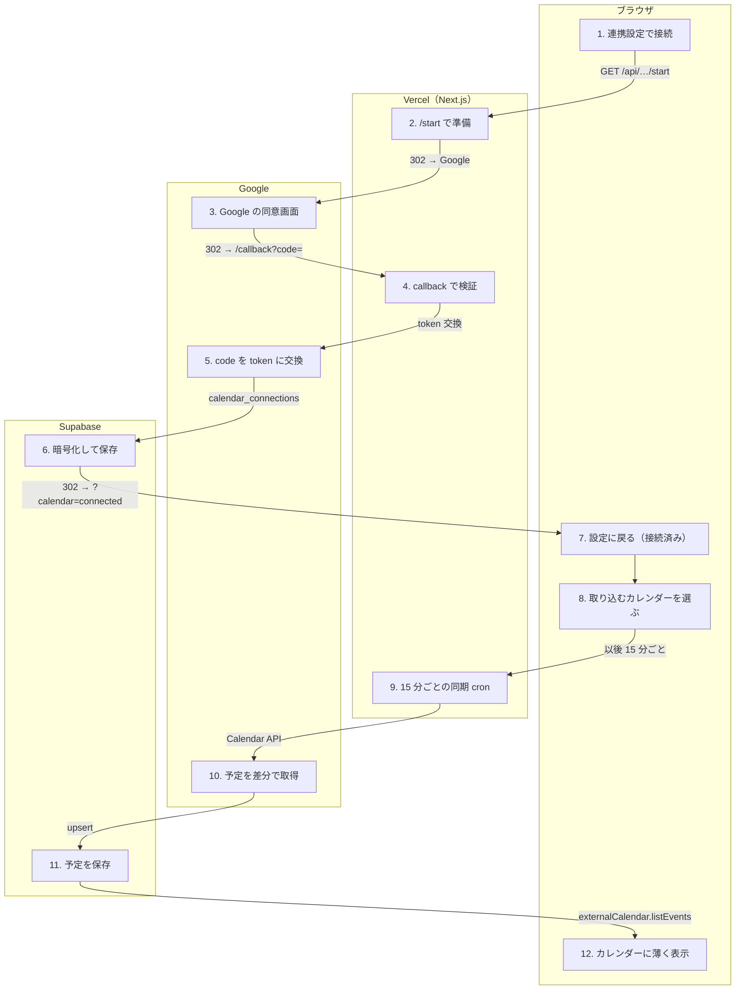

# Google Calendar 連携

<!-- learn:generated:start — 正本 このファイルの learn:journey の JSON / 再生成 pnpm learn:generate / 検証 pnpm docs:check。この範囲は手編集しない -->

設定の「連携」で Google アカウントを接続し、Google の予定を Dayopt のカレンダーに取り込む。接続（OAuth）と取り込みは別の経路で、接続した直後は取り込むカレンダーが未選択なので何も取り込まない。取り込むカレンダーを選んで「適用」を押した時に最初の同期が走り、以後は 15 分ごとの cron が差分を取る。



通るサービス: ブラウザ / Vercel（Next.js） / Google / Supabase。段 12・失敗 11 種。

#### この経路を守るテスト

- 経路全体を通しで守るテストは紐付いていない（段ごとのテストを見る）

### 1. 設定の「連携」で接続ボタンを押す（ブラウザ）

「Google アカウントを接続」を押すと、/api/integrations/google-calendar/start へ画面ごと移動する（SPA の遷移ではない）。ボタンは「この環境で接続できるか」（設定と redirect URI）だけで活性を決める。

- **ここを変えると**: ボタンは利用権（課金）を見ていない。利用権が切れた人が押すと /start が 403 の JSON を返し、ブラウザに JSON がそのまま出る。
- **コード**:
  - [`apps/product/src/features/external-calendar/components/GoogleCalendarSettings.tsx`](../../../apps/product/src/features/external-calendar/components/GoogleCalendarSettings.tsx) で ``window.location.assign(`/api/integrations/google-calendar/start`` を探す
  - [`apps/product/src/features/external-calendar/server/router.ts`](../../../apps/product/src/features/external-calendar/server/router.ts) で `getConnectionAvailability` を探す

<details>
<summary>⚡ この環境で接続できない — 画面: 押せない / データ: 変化なし / 再試行: しない / 痕跡: 残らない</summary>

- 画面: 「この環境ではGoogle カレンダーに接続できません。」ボタンは押せない。
- データ: 変化なし。
- 再試行: しない。
- 痕跡: 何も残らない。
- **最初に見る場所**: GOOGLE_CALENDAR_* と CALENDAR_TOKEN_ENCRYPTION_KEY の env、redirect URI の allowlist。
- 根拠:
  - [`apps/product/src/env.ts`](../../../apps/product/src/env.ts) で `CALENDAR_TOKEN_ENCRYPTION_KEY` を探す

</details>

### 2. /start が関門を通して Google へ送る（Vercel（Next.js））

ログイン → MFA → 利用権 → rate limit の順に確かめ、state と PKCE を作って cookie に入れ、Google の同意画面へ 302 する。求める権限は openid・email と、カレンダー一覧と予定の読み取りだけ（書き込みはしない）。

- **ここを変えると**: MFA を利用権や rate limit より先に見るのは、MFA 不足で断る時に DB 読み取りや枠を消費しないため。
- **コード**:
  - [`apps/product/src/app/api/integrations/google-calendar/start/route.ts`](../../../apps/product/src/app/api/integrations/google-calendar/start/route.ts) で `checkEntitlementForUser` を探す
  - [`apps/product/src/app/api/integrations/google-calendar/start/route.ts`](../../../apps/product/src/app/api/integrations/google-calendar/start/route.ts) で `generatePkcePair` を探す
  - [`apps/product/src/app/api/integrations/google-calendar/start/route.ts`](../../../apps/product/src/app/api/integrations/google-calendar/start/route.ts) で `calendarConnectRateLimit` を探す
  - [`apps/product/src/features/external-calendar/schemas/google.ts`](../../../apps/product/src/features/external-calendar/schemas/google.ts) で `GOOGLE_AUTHORIZATION_SCOPES` を探す

<details>
<summary>⚡ 利用権が切れている — 画面: 使えない / データ: 変化なし / 再試行: しない / 痕跡: 残らない</summary>

- 画面: ブラウザに {"error":"Pro plan required"} の JSON がそのまま出る。
- データ: 変化なし。
- 再試行: しない。
- 痕跡: 想定内の拒否。
- **最初に見る場所**: 利用者の課金状態。画面側でボタンを止めていないのが原因。
- 根拠:
  - [`apps/product/src/app/api/integrations/google-calendar/start/route.ts`](../../../apps/product/src/app/api/integrations/google-calendar/start/route.ts) で `{ error: 'Pro plan required' }` を探す

</details>

<details>
<summary>⚡ MFA がまだ — 画面: 別の画面へ / データ: 変化なし / 再試行: 利用者がやり直す / 痕跡: 残らない</summary>

- 画面: MFA 画面へ移動する。
- データ: 変化なし。
- 再試行: 認証後にもう一度押す。
- 痕跡: 何も残らない。
- **最初に見る場所**: 不要。
- 根拠:
  - [`apps/product/src/app/api/integrations/google-calendar/start/route.ts`](../../../apps/product/src/app/api/integrations/google-calendar/start/route.ts) で `calendar_connect` を探す

</details>

### 3. Google でアカウントを選び、許可する（Google）

アカウントの選択と同意画面が出る。オフラインでも使える refresh token を得るため access_type=offline で求める。

- **ここを変えると**: 求める権限（scope）を増やすと、既存の接続は再同意が要る。Google の審査（OAuth verification）にも関わる。
- **コード**:
  - [`apps/product/src/features/external-calendar/server/google-oauth.ts`](../../../apps/product/src/features/external-calendar/server/google-oauth.ts) で `access_type` を探す
  - [`docs/operations/google-oauth-verification.md`](../../operations/google-oauth-verification.md) で `Google` を探す

<details>
<summary>⚡ 利用者が許可しない — 画面: エラー表示 / データ: 変化なし / 再試行: 利用者がやり直す / 痕跡: 残らない</summary>

- 画面: 設定に戻り「Google カレンダーへのアクセスが許可されませんでした」。
- データ: 変化なし。
- 再試行: 利用者がもう一度接続する。
- 痕跡: 想定内。
- **最初に見る場所**: 不要。
- 根拠:
  - [`apps/product/src/app/api/integrations/google-calendar/callback/route.ts`](../../../apps/product/src/app/api/integrations/google-calendar/callback/route.ts) で `access_denied` を探す

</details>

### 4. callback が戻りを検証する（Vercel（Next.js））

ログイン・MFA・rate limit・write fence・利用権を確かめ直し、cookie の state と照合する。code を使う前に残り時間を確かめる（code は 1 回しか使えないので、交換後に時間切れになると取り返せない）。

- **ここを変えると**: 失敗の理由はすべて ?calendar=error&reason=… で設定画面へ返し、専用の文言を出す。理由を足したら文言も足す。
- **コード**:
  - [`apps/product/src/app/api/integrations/google-calendar/callback/route.ts`](../../../apps/product/src/app/api/integrations/google-calendar/callback/route.ts) で `isWriteFenceEnabled` を探す
  - [`apps/product/src/app/api/integrations/google-calendar/callback/route.ts`](../../../apps/product/src/app/api/integrations/google-calendar/callback/route.ts) で `PRE_CLAIM_BUDGET_MS` を探す
  - [`apps/product/src/features/external-calendar/lib/calendar-callback-result.ts`](../../../apps/product/src/features/external-calendar/lib/calendar-callback-result.ts) で `budget` を探す

<details>
<summary>⚡ state が合わない・cookie が切れた — 画面: エラー表示 / データ: 変化なし / 再試行: 利用者がやり直す / 痕跡: 残らない</summary>

- 画面: 設定に戻り「Google カレンダーに接続できませんでした」。state の不一致・cookie 切れは汎用の失敗文言にまとめられ、やり直しの案内は出ない。
- データ: 変化なし。
- 再試行: 利用者がもう一度接続する。
- 痕跡: 想定内。
- **最初に見る場所**: 不要（別タブで接続し直した等）。
- 根拠:
  - [`apps/product/src/app/api/integrations/google-calendar/callback/route.ts`](../../../apps/product/src/app/api/integrations/google-calendar/callback/route.ts) で `state_mismatch` を探す
  - [`apps/product/src/features/external-calendar/lib/calendar-callback-result.ts`](../../../apps/product/src/features/external-calendar/lib/calendar-callback-result.ts) で `?? 'generic'` を探す

</details>

<details>
<summary>⚡ write fence が ON — 画面: エラー表示 / データ: 変化なし / 再試行: しない / 痕跡: 残らない</summary>

- 画面: 設定に戻り、接続できなかった旨。
- データ: 変化なし。
- 再試行: fence を解くまで同じ。
- 痕跡: 運用が意図した停止。
- **最初に見る場所**: runbook の Write Fence。
- 根拠:
  - [`apps/product/src/app/api/integrations/google-calendar/callback/route.ts`](../../../apps/product/src/app/api/integrations/google-calendar/callback/route.ts) で `write_fenced` を探す

</details>

### 5. Google で code を token に交換する（Google）

code を access token と refresh token に交換し、許可された権限が揃っているかを確かめる。揃っていない、または別アカウントだった時は、得た許可を Google 側で取り消してから断る（孤児の許可を残さない）。

- **ここを変えると**: ここより後で失敗した時は必ず revokeOrphanedGrant を試す。新しい失敗理由を足す時もこの後始末を通す。
- **コード**:
  - [`apps/product/src/app/api/integrations/google-calendar/callback/route.ts`](../../../apps/product/src/app/api/integrations/google-calendar/callback/route.ts) で `hasRequiredCalendarScopes` を探す
  - [`apps/product/src/app/api/integrations/google-calendar/callback/route.ts`](../../../apps/product/src/app/api/integrations/google-calendar/callback/route.ts) で `revokeOrphanedGrant` を探す

<details>
<summary>⚡ 一部の権限だけ許可された — 画面: エラー表示 / データ: 変化なし / 再試行: 利用者がやり直す / 痕跡: 残らない</summary>

- 画面: 設定に戻り「必要な権限の一部が許可されませんでした。表示された権限をすべて許可して、もう一度お試しください。」
- データ: 得た許可は Google 側で取り消す。
- 再試行: 利用者がすべて許可してやり直す。
- 痕跡: 想定内。
- **最初に見る場所**: 不要。
- 根拠:
  - [`apps/product/src/app/api/integrations/google-calendar/callback/route.ts`](../../../apps/product/src/app/api/integrations/google-calendar/callback/route.ts) で `scope_not_granted` を探す

</details>

### 6. refresh token を暗号化して保存する（Supabase）

refresh token を AES-256-GCM で暗号化し、calendar_connections に保存する。利用者のセッションからは暗号化された列を読めない（列単位の GRANT）。

- **ここを変えると**: CALENDAR_TOKEN_ENCRYPTION_KEY を変えると、保存済みの token をすべて読めなくなる（全員が再接続になる）。
- **コード**:
  - [`apps/product/src/features/external-calendar/server/token-crypto.ts`](../../../apps/product/src/features/external-calendar/server/token-crypto.ts) で `AES-256-GCM` を探す
  - [`apps/product/src/features/external-calendar/server/connection-service.ts`](../../../apps/product/src/features/external-calendar/server/connection-service.ts) で `refresh_token_enc: encryptToken(` を探す

### 7. 設定画面に戻り、接続済みになる（ブラウザ）

/settings/integrations?calendar=connected へ戻り、トーストを出してから URL の印を消す。この時点では取り込むカレンダーがまだ選ばれていないので、予定は 1 件も取り込まれていない。

- **ここを変えると**: デスクトップでは設定はモーダルなので、戻ってきた後にカレンダーの上で開き直す。
- **コード**:
  - [`apps/product/src/app/[locale]/(app)/settings/[category]/page.tsx`](<../../../apps/product/src/app/[locale]/(app)/settings/[category]/page.tsx>) で `removeCalendarCallbackParams` を探す

### 8. 取り込むカレンダーを選んで「適用」を押す（ブラウザ）

接続した Google アカウントのカレンダー一覧から取り込むものを選び、「適用」を押す。updateSelectedCalendars が選択を保存し、その場で全件の同期を 1 回走らせる。ここで初めて予定が取り込まれる。

- **なぜ必要か**: 何を取り込むかは利用者が決める（仕事用だけ、など）。接続しただけで全部を流し込まない。
- **ここを変えると**: 選択を変えるたびに即時の全件同期が走る。選択の保存と同期は同じ procedure の中なので、同期が遅いと「適用中...」が長くなる。
- **コード**:
  - [`apps/product/src/features/external-calendar/server/router.ts`](../../../apps/product/src/features/external-calendar/server/router.ts) で `取り込むカレンダーの選択を差し替え、即時同期する` を探す
  - [`apps/product/src/features/external-calendar/server/sync-service.ts`](../../../apps/product/src/features/external-calendar/server/sync-service.ts) で `load_selected_calendars` を探す

### 9. Vercel Cron が 15 分ごとに同期を回す（Vercel（Next.js））

CRON_SECRET で呼び出し元を確かめ、write fence を見て、開始と完了を heartbeat に記録する。同期が必要な接続を順に、50 秒の持ち時間の中で処理する。取り込むカレンダーが選ばれていない接続では何も取らない。設定の「今すぐ同期」も同じ同期処理を呼ぶ。

- **ここを変えると**: 取りこぼした回を埋め直さない。止まったことは heartbeat の完了時刻が古くなることで気づく（production の監査が見る）。
- **コード**:
  - [`apps/product/src/app/api/cron/calendar-sync/route.ts`](../../../apps/product/src/app/api/cron/calendar-sync/route.ts) で `writeCronHeartbeat` を探す
  - [`apps/product/vercel.json`](../../../apps/product/vercel.json) で `*/15 * * * *` を探す
  - [`apps/product/src/features/external-calendar/server/sync-dispatcher.ts`](../../../apps/product/src/features/external-calendar/server/sync-dispatcher.ts) で `dispatchCalendarSync` を探す
  - [`scripts/ci/production-cron-heartbeat-audit.mjs`](../../../scripts/ci/production-cron-heartbeat-audit.mjs) で `heartbeat` を探す

<details>
<summary>⚡ cron が動いていない — 画面: 何も起きない / データ: 変化なし / 再試行: 次の機会に / 痕跡: 監視が拾う</summary>

- 画面: 何も起きない。予定が増えないだけ。
- データ: 取り込まれない。
- 再試行: 次に cron が動いた時に追いつく。「今すぐ同期」でも取れる。
- 痕跡: heartbeat の完了時刻が古くなり、本番の監査が拾う。
- **最初に見る場所**: monitoring.md の Cron heartbeat → Vercel の Cron 履歴 → CRON_SECRET。
- 根拠:
  - [`docs/operations/monitoring.md`](../../operations/monitoring.md) で `## Cron heartbeat と本番 schema・権限監査` を探す

</details>

### 10. Google から予定を差分で取る（Google）

保存した refresh token で access token を取り直し、前回の sync token から差分だけ取る。1 日 1 回は全件、Google が sync token を無効にした時（410）も全件で取り直す。1 回の API は 15 秒で打ち切る。

- **ここを変えると**: refresh token の回転（新しい token の保存）はこの同期の中で行う。別の cron ではない。
- **コード**:
  - [`apps/product/src/features/external-calendar/server/providers/google.ts`](../../../apps/product/src/features/external-calendar/server/providers/google.ts) で `GOOGLE_API_TIMEOUT_MS` を探す
  - [`apps/product/src/features/external-calendar/server/providers/google.ts`](../../../apps/product/src/features/external-calendar/server/providers/google.ts) で `requestWithRateLimitRetry` を探す
  - [`apps/product/src/features/external-calendar/server/token-rotation.ts`](../../../apps/product/src/features/external-calendar/server/token-rotation.ts) で `persistCalendarTokenRotation` を探す

<details>
<summary>⚡ Google 側で許可が取り消された — 画面: エラー表示 / データ: 変化なし / 再試行: 利用者がやり直す / 痕跡: ログだけ</summary>

- 画面: 設定の行が「再接続が必要」になり、再接続ボタンが出る。
- データ: status が reauth_required になり、以後は同期を飛ばす。
- 再試行: 利用者が再接続する。
- 痕跡: 利用者が直せる失敗なので Sentry には出さない（quota を焼かせないため）。接続の last_sync_error に残る。
- **最初に見る場所**: calendar_connections の status と last_sync_error。
- 根拠:
  - [`apps/product/src/features/external-calendar/server/sync-service.ts`](../../../apps/product/src/features/external-calendar/server/sync-service.ts) で `markCalendarConnectionReauth` を探す

</details>

<details>
<summary>⚡ Google が 429（rate limit） — 画面: 何も起きない / データ: どちらもありうる / 再試行: 自動で再試行 / 痕跡: ログだけ</summary>

- 画面: 設定の行が「確認が必要」になりうる。「Google カレンダーの利用が一時的に制限されています。時間をおいてお試しください。」カレンダーは前回までの予定のまま。
- データ: 一部だけ取り込まれることがある。
- 再試行: 1〜2 秒待って 1 回だけ再試行する（残り時間が足りなければしない）。それでも駄目なら次の cron で。
- 痕跡: 想定内として Sentry には送らない（quota を焼く増幅経路になるため）。logger.warn と、接続の last_sync_error = rate_limited に残る。
- **最初に見る場所**: Google Cloud の quota。calendar_connections の last_sync_error。
- 根拠:
  - [`apps/product/src/features/external-calendar/server/providers/google.ts`](../../../apps/product/src/features/external-calendar/server/providers/google.ts) で `requestWithRateLimitRetry` を探す
  - [`apps/product/src/features/external-calendar/server/sync-service.ts`](../../../apps/product/src/features/external-calendar/server/sync-service.ts) で `(error.kind === 'rate_limited' || error.kind === 'cursor_invalid')` を探す

</details>

<details>
<summary>⚡ Google が 5xx・時間切れ（15 秒） — 画面: 何も起きない / データ: どちらもありうる / 再試行: 次の機会に / 痕跡: Sentry</summary>

- 画面: 設定の行が「確認が必要」になりうる。「Google カレンダーを一時的に利用できません。時間をおいてお試しください。」カレンダーは前回までの予定のまま。
- データ: 一部だけ取り込まれることがある。
- 再試行: その場ではしない。次の cron で。
- 痕跡: Sentry に送る（feature: external_calendar、source: google_calendar_api）。接続の last_sync_error = provider_unavailable にも残る。
- **最初に見る場所**: Sentry の external_calendar → Google Cloud の status。
- 根拠:
  - [`apps/product/src/features/external-calendar/server/providers/google.ts`](../../../apps/product/src/features/external-calendar/server/providers/google.ts) で `GOOGLE_API_TIMEOUT_MS` を探す
  - [`apps/product/src/features/external-calendar/server/sync-service.ts`](../../../apps/product/src/features/external-calendar/server/sync-service.ts) で `source: 'google_calendar_api',` を探す

</details>

### 11. external_calendar_events に保存する（Supabase）

取った予定は plans ではなく external_calendar_events に upsert する。消えた予定は tombstone で消す。Google の予定はこの段階ではまだ Plan ではない。

- **ここを変えると**: Plan / Record と別テーブルなので、時刻の規則（DT003 / DT005）はここには掛からない。
- **コード**:
  - [`apps/product/src/features/external-calendar/server/sync-service.ts`](../../../apps/product/src/features/external-calendar/server/sync-service.ts) で `external_calendar_events` を探す
  - [`apps/product/src/features/external-calendar/server/fenced-sync-writer.ts`](../../../apps/product/src/features/external-calendar/server/fenced-sync-writer.ts) で `p_tombstone_event_ids` を探す
- **この段を守るテスト**:
  - [`apps/product/src/features/external-calendar/server/sync-service.test.ts`](../../../apps/product/src/features/external-calendar/server/sync-service.test.ts) で `it('connection_id と user_id を全行に載せる（複合 FK）'` を探す（保存先の列を守る。plans に入らないこと・tombstone は別のテスト）

### 12. カレンダーに Google の予定が薄く出る（ブラウザ）

カレンダーは Plan・Record と一緒に Google の予定も取り、薄い見た目で重ねて出す（読み取り専用）。タップすると Plan（または Record）に変換され、ここから「Plan を保存」と同じ経路に入る。

- **ここを変えると**: 変換した Plan には source: external_calendar と元の予定の ID が付く。Google の予定を消しても、変換済みの Plan は残る。
- **コード**:
  - [`apps/product/src/app/[locale]/(app)/(workspace)/_server/calendar-prefetch.ts`](<../../../apps/product/src/app/[locale]/(app)/(workspace)/_server/calendar-prefetch.ts>) で `helpers.externalCalendar.listEvents.prefetch` を探す
  - [`apps/product/src/features/calendar/hooks/operations/useConvertGhostEvent.ts`](../../../apps/product/src/features/calendar/hooks/operations/useConvertGhostEvent.ts) で `externalCalendarEventId` を探す

<!-- learn:generated:end -->

## データ（正本）

この JSON がこのページの正本。上の説明と図、`pnpm learn` の対話画面はここから生成する。参照（`path` + `find`）は `pnpm docs:check` が実在を検査する。

```json learn:journey
{
  "id": "google-calendar",
  "title": "Google Calendar 連携",
  "order": 90,
  "group": "integration",
  "intro": "設定の「連携」で Google アカウントを接続し、Google の予定を Dayopt のカレンダーに取り込む。接続（OAuth）と取り込みは別の経路で、接続した直後は取り込むカレンダーが未選択なので何も取り込まない。取り込むカレンダーを選んで「適用」を押した時に最初の同期が走り、以後は 15 分ごとの cron が差分を取る。",
  "play": "▶ 接続を押す",
  "lanes": ["browser", "vercel", "google", "supabase"],
  "hops": [
    {
      "id": "integrations-ui",
      "svc": "browser",
      "short": "連携設定で接続",
      "title": "設定の「連携」で接続ボタンを押す",
      "what": "「Google アカウントを接続」を押すと、/api/integrations/google-calendar/start へ画面ごと移動する（SPA の遷移ではない）。ボタンは「この環境で接続できるか」（設定と redirect URI）だけで活性を決める。",
      "change": "ボタンは利用権（課金）を見ていない。利用権が切れた人が押すと /start が 403 の JSON を返し、ブラウザに JSON がそのまま出る。",
      "screen": {
        "t": "settings",
        "url": "/ja/settings/integrations",
        "title": "連携 › Google カレンダー",
        "rows": [["Google アカウント", "（未接続）", "neutral"]],
        "button": "Google アカウントを接続"
      },
      "refs": [
        {
          "path": "apps/product/src/features/external-calendar/components/GoogleCalendarSettings.tsx",
          "find": "window.location.assign(`/api/integrations/google-calendar/start"
        },
        {
          "path": "apps/product/src/features/external-calendar/server/router.ts",
          "find": "getConnectionAvailability"
        }
      ],
      "fails": [
        {
          "id": "not-configured",
          "label": "この環境で接続できない",
          "screen": "「この環境ではGoogle カレンダーに接続できません。」ボタンは押せない。",
          "data": "変化なし。",
          "retry": "しない。",
          "trace": "何も残らない。",
          "look": "GOOGLE_CALENDAR_* と CALENDAR_TOKEN_ENCRYPTION_KEY の env、redirect URI の allowlist。",
          "refs": [
            {
              "path": "apps/product/src/env.ts",
              "find": "CALENDAR_TOKEN_ENCRYPTION_KEY"
            }
          ],
          "tags": {
            "screen": "blocked",
            "data": "unchanged",
            "retry": "none",
            "trace": "none"
          },
          "screenAfter": {
            "t": "settings",
            "url": "/ja/settings/integrations",
            "title": "連携 › Google カレンダー",
            "rows": [["Google アカウント", "（未接続）", "neutral"]],
            "banner": "この環境ではGoogle カレンダーに接続できません。",
            "bannerTone": "warn"
          }
        }
      ]
    },
    {
      "id": "start",
      "svc": "vercel",
      "short": "/start で準備",
      "via": "GET /api/…/start",
      "title": "/start が関門を通して Google へ送る",
      "what": "ログイン → MFA → 利用権 → rate limit の順に確かめ、state と PKCE を作って cookie に入れ、Google の同意画面へ 302 する。求める権限は openid・email と、カレンダー一覧と予定の読み取りだけ（書き込みはしない）。",
      "change": "MFA を利用権や rate limit より先に見るのは、MFA 不足で断る時に DB 読み取りや枠を消費しないため。",
      "screen": {
        "t": "blank",
        "url": "/api/integrations/google-calendar/start",
        "text": "Google へ移動中…"
      },
      "refs": [
        {
          "path": "apps/product/src/app/api/integrations/google-calendar/start/route.ts",
          "find": "checkEntitlementForUser"
        },
        {
          "path": "apps/product/src/app/api/integrations/google-calendar/start/route.ts",
          "find": "generatePkcePair"
        },
        {
          "path": "apps/product/src/app/api/integrations/google-calendar/start/route.ts",
          "find": "calendarConnectRateLimit"
        },
        {
          "path": "apps/product/src/features/external-calendar/schemas/google.ts",
          "find": "GOOGLE_AUTHORIZATION_SCOPES"
        }
      ],
      "fails": [
        {
          "id": "start-pro",
          "label": "利用権が切れている",
          "screen": "ブラウザに {\"error\":\"Pro plan required\"} の JSON がそのまま出る。",
          "data": "変化なし。",
          "retry": "しない。",
          "trace": "想定内の拒否。",
          "look": "利用者の課金状態。画面側でボタンを止めていないのが原因。",
          "refs": [
            {
              "path": "apps/product/src/app/api/integrations/google-calendar/start/route.ts",
              "find": "{ error: 'Pro plan required' }"
            }
          ],
          "tags": {
            "screen": "down",
            "data": "unchanged",
            "retry": "none",
            "trace": "none"
          },
          "screenAfter": {
            "t": "page",
            "url": "/api/integrations/google-calendar/start",
            "tone": "bad",
            "title": "{\"error\":\"Pro plan required\"}",
            "body": "JSON がそのまま表示される"
          }
        },
        {
          "id": "start-mfa",
          "label": "MFA がまだ",
          "screen": "MFA 画面へ移動する。",
          "data": "変化なし。",
          "retry": "認証後にもう一度押す。",
          "trace": "何も残らない。",
          "look": "不要。",
          "refs": [
            {
              "path": "apps/product/src/app/api/integrations/google-calendar/start/route.ts",
              "find": "calendar_connect"
            }
          ],
          "tags": {
            "screen": "redirect",
            "data": "unchanged",
            "retry": "user",
            "trace": "none"
          },
          "screenAfter": {
            "t": "form",
            "title": "多要素認証",
            "url": "/ja/auth/mfa-verify",
            "fields": [["認証コード", "– – – – – –"]],
            "button": "認証",
            "alt": "リカバリーコードを使用"
          }
        }
      ]
    },
    {
      "id": "consent",
      "svc": "google",
      "short": "Google の同意画面",
      "via": "302 → Google",
      "title": "Google でアカウントを選び、許可する",
      "what": "アカウントの選択と同意画面が出る。オフラインでも使える refresh token を得るため access_type=offline で求める。",
      "change": "求める権限（scope）を増やすと、既存の接続は再同意が要る。Google の審査（OAuth verification）にも関わる。",
      "screen": {
        "t": "consent",
        "host": "accounts.google.com",
        "url": "/o/oauth2/…",
        "title": "Dayopt が Google アカウントへのアクセスを求めています",
        "scopes": ["メールアドレスを見る", "カレンダーの一覧を見る", "予定を見る（読み取りのみ）"]
      },
      "refs": [
        {
          "path": "apps/product/src/features/external-calendar/server/google-oauth.ts",
          "find": "access_type"
        },
        {
          "path": "docs/operations/google-oauth-verification.md",
          "find": "Google"
        }
      ],
      "fails": [
        {
          "id": "access-denied",
          "label": "利用者が許可しない",
          "screen": "設定に戻り「Google カレンダーへのアクセスが許可されませんでした」。",
          "data": "変化なし。",
          "retry": "利用者がもう一度接続する。",
          "trace": "想定内。",
          "look": "不要。",
          "refs": [
            {
              "path": "apps/product/src/app/api/integrations/google-calendar/callback/route.ts",
              "find": "access_denied"
            }
          ],
          "tags": {
            "screen": "toast",
            "data": "unchanged",
            "retry": "user",
            "trace": "none"
          },
          "to": "back-settings",
          "back": "許可されなかった",
          "screenAfter": {
            "t": "settings",
            "url": "/ja/settings/integrations",
            "title": "連携 › Google カレンダー",
            "rows": [["Google アカウント", "（未接続）", "neutral"]],
            "toast": "Google カレンダーへのアクセスが許可されませんでした",
            "toastTone": "bad"
          }
        }
      ]
    },
    {
      "id": "callback",
      "svc": "vercel",
      "short": "callback で検証",
      "via": "302 → /callback?code=",
      "title": "callback が戻りを検証する",
      "what": "ログイン・MFA・rate limit・write fence・利用権を確かめ直し、cookie の state と照合する。code を使う前に残り時間を確かめる（code は 1 回しか使えないので、交換後に時間切れになると取り返せない）。",
      "change": "失敗の理由はすべて ?calendar=error&reason=… で設定画面へ返し、専用の文言を出す。理由を足したら文言も足す。",
      "screen": {
        "t": "blank",
        "url": "/api/integrations/google-calendar/callback",
        "text": "接続を確認中…"
      },
      "refs": [
        {
          "path": "apps/product/src/app/api/integrations/google-calendar/callback/route.ts",
          "find": "isWriteFenceEnabled"
        },
        {
          "path": "apps/product/src/app/api/integrations/google-calendar/callback/route.ts",
          "find": "PRE_CLAIM_BUDGET_MS"
        },
        {
          "path": "apps/product/src/features/external-calendar/lib/calendar-callback-result.ts",
          "find": "budget"
        }
      ],
      "fails": [
        {
          "id": "state-mismatch",
          "label": "state が合わない・cookie が切れた",
          "screen": "設定に戻り「Google カレンダーに接続できませんでした」。state の不一致・cookie 切れは汎用の失敗文言にまとめられ、やり直しの案内は出ない。",
          "data": "変化なし。",
          "retry": "利用者がもう一度接続する。",
          "trace": "想定内。",
          "look": "不要（別タブで接続し直した等）。",
          "refs": [
            {
              "path": "apps/product/src/app/api/integrations/google-calendar/callback/route.ts",
              "find": "state_mismatch"
            },
            {
              "path": "apps/product/src/features/external-calendar/lib/calendar-callback-result.ts",
              "find": "?? 'generic'"
            }
          ],
          "tags": {
            "screen": "toast",
            "data": "unchanged",
            "retry": "user",
            "trace": "none"
          },
          "to": "back-settings",
          "back": "やり直しの案内",
          "screenAfter": {
            "t": "settings",
            "url": "/ja/settings/integrations",
            "title": "連携 › Google カレンダー",
            "rows": [["Google アカウント", "（未接続）", "neutral"]],
            "toast": "Google カレンダーに接続できませんでした",
            "toastTone": "bad"
          }
        },
        {
          "id": "callback-fence",
          "label": "write fence が ON",
          "screen": "設定に戻り、接続できなかった旨。",
          "data": "変化なし。",
          "retry": "fence を解くまで同じ。",
          "trace": "運用が意図した停止。",
          "look": "runbook の Write Fence。",
          "refs": [
            {
              "path": "apps/product/src/app/api/integrations/google-calendar/callback/route.ts",
              "find": "write_fenced"
            }
          ],
          "tags": {
            "screen": "toast",
            "data": "unchanged",
            "retry": "none",
            "trace": "none"
          },
          "to": "back-settings",
          "back": "接続できない",
          "screenAfter": {
            "t": "settings",
            "url": "/ja/settings/integrations",
            "title": "連携 › Google カレンダー",
            "rows": [["Google アカウント", "（未接続）", "neutral"]],
            "toast": "Google カレンダーに接続できませんでした",
            "toastTone": "bad"
          }
        }
      ]
    },
    {
      "id": "exchange",
      "svc": "google",
      "short": "code を token に交換",
      "via": "token 交換",
      "title": "Google で code を token に交換する",
      "what": "code を access token と refresh token に交換し、許可された権限が揃っているかを確かめる。揃っていない、または別アカウントだった時は、得た許可を Google 側で取り消してから断る（孤児の許可を残さない）。",
      "change": "ここより後で失敗した時は必ず revokeOrphanedGrant を試す。新しい失敗理由を足す時もこの後始末を通す。",
      "refs": [
        {
          "path": "apps/product/src/app/api/integrations/google-calendar/callback/route.ts",
          "find": "hasRequiredCalendarScopes"
        },
        {
          "path": "apps/product/src/app/api/integrations/google-calendar/callback/route.ts",
          "find": "revokeOrphanedGrant"
        }
      ],
      "fails": [
        {
          "id": "scope-not-granted",
          "label": "一部の権限だけ許可された",
          "screen": "設定に戻り「必要な権限の一部が許可されませんでした。表示された権限をすべて許可して、もう一度お試しください。」",
          "data": "得た許可は Google 側で取り消す。",
          "retry": "利用者がすべて許可してやり直す。",
          "trace": "想定内。",
          "look": "不要。",
          "refs": [
            {
              "path": "apps/product/src/app/api/integrations/google-calendar/callback/route.ts",
              "find": "scope_not_granted"
            }
          ],
          "tags": {
            "screen": "toast",
            "data": "unchanged",
            "retry": "user",
            "trace": "none"
          },
          "to": "back-settings",
          "back": "権限が足りない",
          "screenAfter": {
            "t": "settings",
            "url": "/ja/settings/integrations",
            "title": "連携 › Google カレンダー",
            "rows": [["Google アカウント", "（未接続）", "neutral"]],
            "toast": "必要な権限の一部が許可されませんでした。表示された権限をすべて許可して、もう一度お試しください。",
            "toastTone": "bad"
          }
        }
      ]
    },
    {
      "id": "save-connection",
      "svc": "supabase",
      "short": "暗号化して保存",
      "via": "calendar_connections",
      "title": "refresh token を暗号化して保存する",
      "what": "refresh token を AES-256-GCM で暗号化し、calendar_connections に保存する。利用者のセッションからは暗号化された列を読めない（列単位の GRANT）。",
      "change": "CALENDAR_TOKEN_ENCRYPTION_KEY を変えると、保存済みの token をすべて読めなくなる（全員が再接続になる）。",
      "refs": [
        {
          "path": "apps/product/src/features/external-calendar/server/token-crypto.ts",
          "find": "AES-256-GCM"
        },
        {
          "path": "apps/product/src/features/external-calendar/server/connection-service.ts",
          "find": "refresh_token_enc: encryptToken("
        }
      ],
      "fails": []
    },
    {
      "id": "back-settings",
      "svc": "browser",
      "short": "設定に戻る（接続済み）",
      "via": "302 → ?calendar=connected",
      "title": "設定画面に戻り、接続済みになる",
      "what": "/settings/integrations?calendar=connected へ戻り、トーストを出してから URL の印を消す。この時点では取り込むカレンダーがまだ選ばれていないので、予定は 1 件も取り込まれていない。",
      "change": "デスクトップでは設定はモーダルなので、戻ってきた後にカレンダーの上で開き直す。",
      "screen": {
        "t": "settings",
        "url": "/ja/settings/integrations",
        "title": "連携 › Google カレンダー",
        "rows": [
          ["m@example.com", "接続済み", "ok"],
          ["最終同期", "未同期", "neutral"]
        ],
        "toast": "Google アカウントを接続しました"
      },
      "refs": [
        {
          "path": "apps/product/src/app/[locale]/(app)/settings/[category]/page.tsx",
          "find": "removeCalendarCallbackParams"
        }
      ],
      "fails": []
    },
    {
      "id": "select-calendars",
      "svc": "browser",
      "short": "取り込むカレンダーを選ぶ",
      "title": "取り込むカレンダーを選んで「適用」を押す",
      "what": "接続した Google アカウントのカレンダー一覧から取り込むものを選び、「適用」を押す。updateSelectedCalendars が選択を保存し、その場で全件の同期を 1 回走らせる。ここで初めて予定が取り込まれる。",
      "why": "何を取り込むかは利用者が決める（仕事用だけ、など）。接続しただけで全部を流し込まない。",
      "change": "選択を変えるたびに即時の全件同期が走る。選択の保存と同期は同じ procedure の中なので、同期が遅いと「適用中...」が長くなる。",
      "screen": {
        "t": "settings",
        "url": "/ja/settings/integrations",
        "title": "連携 › Google カレンダー",
        "rows": [
          ["m@example.com", "接続済み", "ok"],
          ["取り込むカレンダー", ""],
          ["☑ メイン", ""]
        ],
        "button": "適用"
      },
      "refs": [
        {
          "path": "apps/product/src/features/external-calendar/server/router.ts",
          "find": "取り込むカレンダーの選択を差し替え、即時同期する"
        },
        {
          "path": "apps/product/src/features/external-calendar/server/sync-service.ts",
          "find": "load_selected_calendars"
        }
      ],
      "fails": []
    },
    {
      "id": "cron-sync",
      "svc": "vercel",
      "short": "15 分ごとの同期 cron",
      "via": "以後 15 分ごと",
      "title": "Vercel Cron が 15 分ごとに同期を回す",
      "what": "CRON_SECRET で呼び出し元を確かめ、write fence を見て、開始と完了を heartbeat に記録する。同期が必要な接続を順に、50 秒の持ち時間の中で処理する。取り込むカレンダーが選ばれていない接続では何も取らない。設定の「今すぐ同期」も同じ同期処理を呼ぶ。",
      "change": "取りこぼした回を埋め直さない。止まったことは heartbeat の完了時刻が古くなることで気づく（production の監査が見る）。",
      "screen": {
        "t": "settings",
        "url": "/ja/settings/integrations",
        "title": "連携 › Google カレンダー",
        "rows": [
          ["m@example.com", "接続済み", "ok"],
          ["最終同期", "未同期", "neutral"]
        ],
        "note": "利用者は待っているだけ。「今すぐ同期」で前倒しもできる"
      },
      "refs": [
        {
          "path": "apps/product/src/app/api/cron/calendar-sync/route.ts",
          "find": "writeCronHeartbeat"
        },
        {
          "path": "apps/product/vercel.json",
          "find": "*/15 * * * *"
        },
        {
          "path": "apps/product/src/features/external-calendar/server/sync-dispatcher.ts",
          "find": "dispatchCalendarSync"
        },
        {
          "path": "scripts/ci/production-cron-heartbeat-audit.mjs",
          "find": "heartbeat"
        }
      ],
      "fails": [
        {
          "id": "cron-stopped",
          "label": "cron が動いていない",
          "screen": "何も起きない。予定が増えないだけ。",
          "data": "取り込まれない。",
          "retry": "次に cron が動いた時に追いつく。「今すぐ同期」でも取れる。",
          "trace": "heartbeat の完了時刻が古くなり、本番の監査が拾う。",
          "look": "monitoring.md の Cron heartbeat → Vercel の Cron 履歴 → CRON_SECRET。",
          "refs": [
            {
              "path": "docs/operations/monitoring.md",
              "find": "## Cron heartbeat と本番 schema・権限監査"
            }
          ],
          "tags": {
            "screen": "none",
            "data": "unchanged",
            "retry": "next",
            "trace": "monitor"
          }
        }
      ]
    },
    {
      "id": "fetch-events",
      "svc": "google",
      "short": "予定を差分で取得",
      "via": "Calendar API",
      "title": "Google から予定を差分で取る",
      "what": "保存した refresh token で access token を取り直し、前回の sync token から差分だけ取る。1 日 1 回は全件、Google が sync token を無効にした時（410）も全件で取り直す。1 回の API は 15 秒で打ち切る。",
      "change": "refresh token の回転（新しい token の保存）はこの同期の中で行う。別の cron ではない。",
      "refs": [
        {
          "path": "apps/product/src/features/external-calendar/server/providers/google.ts",
          "find": "GOOGLE_API_TIMEOUT_MS"
        },
        {
          "path": "apps/product/src/features/external-calendar/server/providers/google.ts",
          "find": "requestWithRateLimitRetry"
        },
        {
          "path": "apps/product/src/features/external-calendar/server/token-rotation.ts",
          "find": "persistCalendarTokenRotation"
        }
      ],
      "fails": [
        {
          "id": "reauth",
          "label": "Google 側で許可が取り消された",
          "screen": "設定の行が「再接続が必要」になり、再接続ボタンが出る。",
          "data": "status が reauth_required になり、以後は同期を飛ばす。",
          "retry": "利用者が再接続する。",
          "trace": "利用者が直せる失敗なので Sentry には出さない（quota を焼かせないため）。接続の last_sync_error に残る。",
          "look": "calendar_connections の status と last_sync_error。",
          "refs": [
            {
              "path": "apps/product/src/features/external-calendar/server/sync-service.ts",
              "find": "markCalendarConnectionReauth"
            }
          ],
          "tags": {
            "screen": "toast",
            "data": "unchanged",
            "retry": "user",
            "trace": "log"
          },
          "to": "back-settings",
          "back": "再接続が必要",
          "screenAfter": {
            "t": "settings",
            "url": "/ja/settings/integrations",
            "title": "連携 › Google カレンダー",
            "rows": [["m@example.com", "再接続が必要", "bad"]],
            "banner": "Googleへのアクセスが期限切れです。同じGoogle アカウントを再接続してください。",
            "bannerTone": "bad",
            "button": "再接続"
          }
        },
        {
          "id": "google-429",
          "label": "Google が 429（rate limit）",
          "screen": "設定の行が「確認が必要」になりうる。「Google カレンダーの利用が一時的に制限されています。時間をおいてお試しください。」カレンダーは前回までの予定のまま。",
          "data": "一部だけ取り込まれることがある。",
          "retry": "1〜2 秒待って 1 回だけ再試行する（残り時間が足りなければしない）。それでも駄目なら次の cron で。",
          "trace": "想定内として Sentry には送らない（quota を焼く増幅経路になるため）。logger.warn と、接続の last_sync_error = rate_limited に残る。",
          "look": "Google Cloud の quota。calendar_connections の last_sync_error。",
          "refs": [
            {
              "path": "apps/product/src/features/external-calendar/server/providers/google.ts",
              "find": "requestWithRateLimitRetry"
            },
            {
              "path": "apps/product/src/features/external-calendar/server/sync-service.ts",
              "find": "(error.kind === 'rate_limited' || error.kind === 'cursor_invalid')"
            }
          ],
          "tags": {
            "screen": "none",
            "data": "unknown",
            "retry": "auto",
            "trace": "log"
          },
          "screenAfter": {
            "t": "settings",
            "url": "/ja/settings/integrations",
            "title": "連携 › Google カレンダー",
            "rows": [["m@example.com", "確認が必要", "warn"]],
            "banner": "Google カレンダーの利用が一時的に制限されています。時間をおいてお試しください。",
            "bannerTone": "warn"
          }
        },
        {
          "id": "google-5xx",
          "label": "Google が 5xx・時間切れ（15 秒）",
          "screen": "設定の行が「確認が必要」になりうる。「Google カレンダーを一時的に利用できません。時間をおいてお試しください。」カレンダーは前回までの予定のまま。",
          "data": "一部だけ取り込まれることがある。",
          "retry": "その場ではしない。次の cron で。",
          "trace": "Sentry に送る（feature: external_calendar、source: google_calendar_api）。接続の last_sync_error = provider_unavailable にも残る。",
          "look": "Sentry の external_calendar → Google Cloud の status。",
          "refs": [
            {
              "path": "apps/product/src/features/external-calendar/server/providers/google.ts",
              "find": "GOOGLE_API_TIMEOUT_MS"
            },
            {
              "path": "apps/product/src/features/external-calendar/server/sync-service.ts",
              "find": "source: 'google_calendar_api',"
            }
          ],
          "tags": {
            "screen": "none",
            "data": "unknown",
            "retry": "next",
            "trace": "sentry"
          },
          "screenAfter": {
            "t": "settings",
            "url": "/ja/settings/integrations",
            "title": "連携 › Google カレンダー",
            "rows": [["m@example.com", "確認が必要", "warn"]],
            "banner": "Google カレンダーを一時的に利用できません。時間をおいてお試しください。",
            "bannerTone": "warn"
          }
        }
      ]
    },
    {
      "id": "store-events",
      "svc": "supabase",
      "short": "予定を保存",
      "via": "upsert",
      "title": "external_calendar_events に保存する",
      "what": "取った予定は plans ではなく external_calendar_events に upsert する。消えた予定は tombstone で消す。Google の予定はこの段階ではまだ Plan ではない。",
      "change": "Plan / Record と別テーブルなので、時刻の規則（DT003 / DT005）はここには掛からない。",
      "refs": [
        {
          "path": "apps/product/src/features/external-calendar/server/sync-service.ts",
          "find": "external_calendar_events"
        },
        {
          "path": "apps/product/src/features/external-calendar/server/fenced-sync-writer.ts",
          "find": "p_tombstone_event_ids"
        }
      ],
      "fails": [],
      "tests": [
        {
          "path": "apps/product/src/features/external-calendar/server/sync-service.test.ts",
          "find": "it('connection_id と user_id を全行に載せる（複合 FK）'",
          "why": "保存先の列を守る。plans に入らないこと・tombstone は別のテスト"
        }
      ]
    },
    {
      "id": "show-ghost",
      "svc": "browser",
      "short": "カレンダーに薄く表示",
      "via": "externalCalendar.listEvents",
      "title": "カレンダーに Google の予定が薄く出る",
      "what": "カレンダーは Plan・Record と一緒に Google の予定も取り、薄い見た目で重ねて出す（読み取り専用）。タップすると Plan（または Record）に変換され、ここから「Plan を保存」と同じ経路に入る。",
      "change": "変換した Plan には source: external_calendar と元の予定の ID が付く。Google の予定を消しても、変換済みの Plan は残る。",
      "screen": {
        "t": "calendar",
        "url": "/ja/calendar",
        "blocks": [
          {
            "state": "ext",
            "label": "Google の予定",
            "from": 1,
            "len": 1
          }
        ],
        "note": "薄い表示。タップで Plan に変換"
      },
      "refs": [
        {
          "path": "apps/product/src/app/[locale]/(app)/(workspace)/_server/calendar-prefetch.ts",
          "find": "helpers.externalCalendar.listEvents.prefetch"
        },
        {
          "path": "apps/product/src/features/calendar/hooks/operations/useConvertGhostEvent.ts",
          "find": "externalCalendarEventId"
        }
      ],
      "fails": []
    }
  ]
}
```
