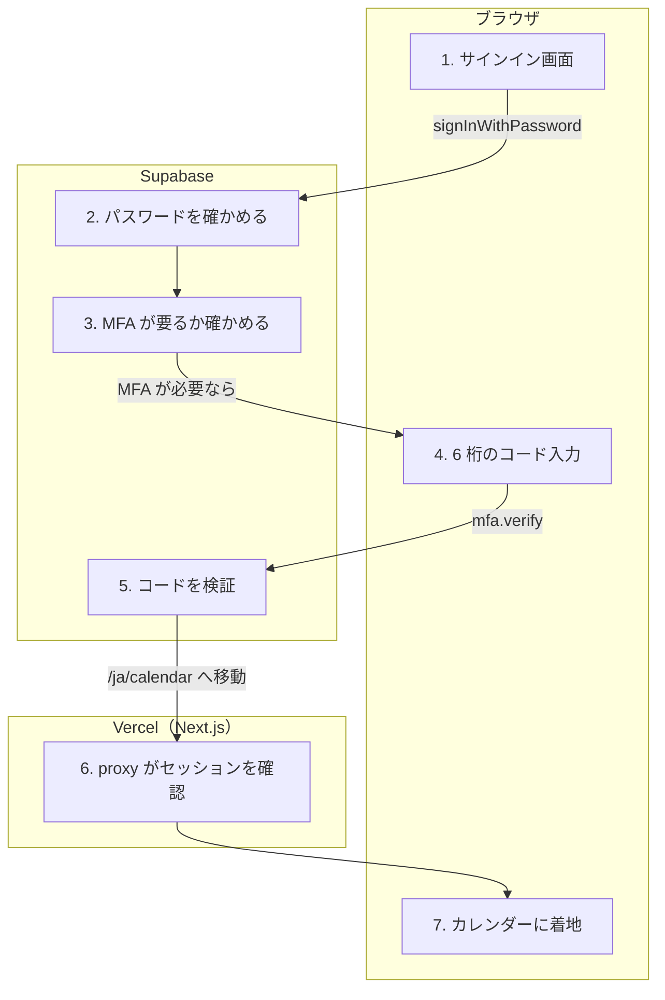

# ログイン（MFA 含む）

<!-- learn:generated:start — 正本 このファイルの learn:journey の JSON / 再生成 pnpm learn:generate / 検証 pnpm docs:check。この範囲は手編集しない -->

メールアドレスとパスワードでサインインする。多要素認証（MFA）を登録している人は、6 桁のコードを求められる。認証の通信はブラウザから Supabase Auth へ直接行き、tRPC を通らない。



通るサービス: ブラウザ / Vercel（Next.js） / Supabase。段 7・失敗 12 種。

#### この経路を守るテスト

- [`apps/product/src/lib/test/e2e/auth.spec.ts`](../../../apps/product/src/lib/test/e2e/auth.spec.ts) で `test('正しい認証情報でログインしカレンダーへ遷移する'` を探す

### 1. サインイン画面で入力する（ブラウザ）

メールアドレスとパスワードを入れ、Cloudflare Turnstile の確認が済むとボタンが押せる。Google で続けるボタンは別経路（Supabase の OAuth → /auth/callback）。

- **ここを変えると**: ボタンの活性は Turnstile の状態で決まる。Turnstile の設定を変える時はこの画面と登録画面の両方を見る。
- **コード**:
  - [`apps/product/src/features/auth/components/LoginForm.tsx`](../../../apps/product/src/features/auth/components/LoginForm.tsx) で `turnstile.blocksSubmit` を探す
  - [`apps/product/src/app/[locale]/(auth)/auth/callback/route.ts`](<../../../apps/product/src/app/[locale]/(auth)/auth/callback/route.ts>) で `exchangeCodeForSession` を探す（Google で続けた場合の着地）

<details>
<summary>⚡ Turnstile の確認が終わらない — 画面: 押せない / データ: 変化なし / 再試行: 利用者がやり直す / 痕跡: 残らない</summary>

- 画面: ボタンが押せないまま。
- データ: 変化なし。
- 再試行: 利用者が待つか、再読み込みする。
- 痕跡: 何も残らない（通信前）。
- **最初に見る場所**: Cloudflare の status。全員に起きているなら site key の設定。
- 根拠:
  - [`apps/product/src/features/auth/components/LoginForm.tsx`](../../../apps/product/src/features/auth/components/LoginForm.tsx) で `turnstile.blocksSubmit` を探す

</details>

### 2. Supabase Auth がパスワードを確かめる（Supabase）

ブラウザから supabase.auth.signInWithPassword を呼ぶ。エラーは生の文言を出さず、翻訳キーへ変換してフォームの下に出す。メールが無いのかパスワードが違うのかは区別しない。

- **ここを変えると**: 想定内の認証エラー（401 / 422 / 429 など）は Sentry に送らない。送る対象を変える時は isExpectedAuthError を見る。
- **コード**:
  - [`apps/product/src/features/auth/stores/useAuthStore.ts`](../../../apps/product/src/features/auth/stores/useAuthStore.ts) で `supabase.auth.signInWithPassword` を探す
  - [`apps/product/src/lib/sentry/integration.ts`](../../../apps/product/src/lib/sentry/integration.ts) で `export function isExpectedAuthError` を探す
- **この段を守るテスト**:
  - [`apps/product/src/lib/test/e2e/auth.spec.ts`](../../../apps/product/src/lib/test/e2e/auth.spec.ts) で `test('誤った認証情報でエラー表示'` を探す

<details>
<summary>⚡ パスワードが違う — 画面: エラー表示 / データ: 変化なし / 再試行: 利用者がやり直す / 痕跡: 残らない</summary>

- 画面: 「メールアドレスまたはパスワードが正しくありません」。
- データ: 変化なし。
- 再試行: すぐにやり直せる。
- 痕跡: 想定内なので Sentry には出ない。
- **最初に見る場所**: 利用者の入力ミス。多発するなら Supabase の Auth ログ。
- 根拠:
  - [`apps/product/src/lib/auth-error.ts`](../../../apps/product/src/lib/auth-error.ts) で `invalidCredentials` を探す

</details>

<details>
<summary>⚡ 試行が多すぎる（Supabase の制限） — 画面: エラー表示 / データ: 変化なし / 再試行: 利用者がやり直す / 痕跡: 残らない</summary>

- 画面: 「一時的にロックされています。…分後に再試行してください」。
- データ: 変化なし。
- 再試行: 時間を置くしかない。回数はアプリ側では数えていない。
- 痕跡: Sentry には出ない。
- **最初に見る場所**: Supabase の Auth ログ（アプリの DB には記録が無い）。
- 根拠:
  - [`apps/product/src/lib/auth-error.ts`](../../../apps/product/src/lib/auth-error.ts) で `auth.errors.accountLocked` を探す

</details>

<details>
<summary>⚡ Turnstile の token が拒否される — 画面: エラー表示 / データ: 変化なし / 再試行: 利用者がやり直す / 痕跡: Sentry</summary>

- 画面: 「確認に失敗しました」。Turnstile が作り直され、もう一度押せる。
- データ: 変化なし。
- 再試行: 利用者がやり直す。
- 痕跡: token 側の既知の問題なら Sentry に出ない。secret の設定ミスなど未知の理由なら Sentry に出る。
- **最初に見る場所**: Sentry で captcha_failed を探す → Supabase の Bot Protection の secret。
- 根拠:
  - [`apps/product/src/lib/sentry/integration.ts`](../../../apps/product/src/lib/sentry/integration.ts) で `EXPECTED_CAPTCHA_TOKEN_ISSUE_MESSAGES` を探す

</details>

### 3. 多要素認証が要るかを確かめる（Supabase）

パスワードが通ったら、認証の強さ（AAL）を問い合わせる。今が aal1 で次が aal2 なら MFA を登録している人なので、コード入力の画面へ進む。そうでなければそのままカレンダーへ。

- **ここを変えると**: 問い合わせに失敗した時は、安全側に倒して MFA 画面へ送る（fail-closed）。
- **コード**:
  - [`apps/product/src/features/auth/components/LoginForm.tsx`](../../../apps/product/src/features/auth/components/LoginForm.tsx) で `getAuthenticatorAssuranceLevel` を探す
  - [`apps/product/src/features/auth/components/LoginForm.tsx`](../../../apps/product/src/features/auth/components/LoginForm.tsx) で `router.push(buildMfaUrl())` を探す

<details>
<summary>⚡ AAL の問い合わせが失敗 — 画面: 別の画面へ / データ: 変化なし / 再試行: 不要 / 痕跡: ログだけ</summary>

- 画面: MFA を登録していなくても MFA 画面へ進む。
- データ: 変化なし。
- 再試行: 不要。MFA 画面が登録の有無を確かめ直し、未登録ならカレンダーへ送る。
- 痕跡: logger.warn だけ。
- **最初に見る場所**: Supabase の Auth ログ。
- 根拠:
  - [`apps/product/src/features/auth/components/LoginForm.tsx`](../../../apps/product/src/features/auth/components/LoginForm.tsx) で `MFA check failed, redirecting to MFA verify for safety` を探す

</details>

### 4. MFA 画面でコードを入れる（ブラウザ）

画面を開くと登録済みの TOTP を探し、challenge を発行する。6 桁を入れ終えると自動で送る。端末を失くした人はリカバリーコードでも通れる（その場合は MFA が解除され、解除の通知メールが届く）。

- **ここを変えると**: リカバリーコードの tRPC だけは、まだ aal1 のままでも protectedProcedure を通れるよう例外にしてある。MFA の関門を変える時はこの例外を壊さない。
- **コード**:
  - [`apps/product/src/app/[locale]/(auth)/auth/mfa-verify/page.tsx`](<../../../apps/product/src/app/[locale]/(auth)/auth/mfa-verify/page.tsx>) で `supabase.auth.mfa.challenge` を探す
  - [`apps/product/src/app/[locale]/(auth)/auth/mfa-verify/page.tsx`](<../../../apps/product/src/app/[locale]/(auth)/auth/mfa-verify/page.tsx>) で `vanillaTrpc.user.verifyRecoveryCode.mutate` を探す
  - [`apps/product/src/lib/trpc/procedures.ts`](../../../apps/product/src/lib/trpc/procedures.ts) で `MFA_CHALLENGE_TRPC_PATHS` を探す
  - [`apps/product/src/features/auth/server/recovery-service.ts`](../../../apps/product/src/features/auth/server/recovery-service.ts) で `sendMfaDisabledEmail` を探す
- **この段を守るテスト**:
  - [`apps/product/src/features/auth/components/MFAVerifyForm.test.tsx`](../../../apps/product/src/features/auth/components/MFAVerifyForm.test.tsx) で `it('6桁入力でonVerifyTotpが呼ばれる'` を探す

<details>
<summary>⚡ challenge を発行できない — 画面: エラー表示 / データ: 変化なし / 再試行: 利用者がやり直す / 痕跡: 残らない</summary>

- 画面: エラーと「もう一度試す」ボタンが出る。
- データ: 変化なし。
- 再試行: 利用者がボタンで発行し直す。
- 痕跡: 画面に出るだけ。
- **最初に見る場所**: Supabase の Auth ログ。
- 根拠:
  - [`apps/product/src/app/[locale]/(auth)/auth/mfa-verify/page.tsx`](<../../../apps/product/src/app/[locale]/(auth)/auth/mfa-verify/page.tsx>) で `checkMFARequired` を探す

</details>

<details>
<summary>⚡ リカバリーコードを使い切っている — 画面: エラー表示 / データ: 変化なし / 再試行: しない / 痕跡: 残らない</summary>

- 画面: 使い切った旨の表示。先へ進めない。
- データ: 変化なし。
- 再試行: できない。サポートへの連絡が要る。
- 痕跡: 想定内。
- **最初に見る場所**: サポート対応。
- 根拠:
  - [`apps/product/src/features/auth/server/recovery-service.ts`](../../../apps/product/src/features/auth/server/recovery-service.ts) で `RECOVERY_EXHAUSTED` を探す

</details>

### 5. Supabase がコードを検証する（Supabase）

mfa.verify で検証する。通ればセッションが aal2 に上がり、next パラメータ（安全な相対パスだけ）へ進む。

- **ここを変えると**: 遷移先は getSafeRedirectPath で必ず検査する。外部 URL を渡されるとオープンリダイレクトになる。
- **コード**:
  - [`apps/product/src/app/[locale]/(auth)/auth/mfa-verify/page.tsx`](<../../../apps/product/src/app/[locale]/(auth)/auth/mfa-verify/page.tsx>) で `isMfaChallengeExpired` を探す
  - [`apps/product/src/lib/safe-redirect.ts`](../../../apps/product/src/lib/safe-redirect.ts) で `getSafeRedirectPath` を探す

<details>
<summary>⚡ コードが違う — 画面: エラー表示 / データ: 変化なし / 再試行: 利用者がやり直す / 痕跡: 残らない</summary>

- 画面: 「コードが正しくありません。もう一度お試しください」。入力は消える。
- データ: 変化なし。
- 再試行: 同じ challenge でやり直せる。
- 痕跡: 想定内。
- **最初に見る場所**: 端末の時刻ずれを疑う。
- 根拠:
  - [`apps/product/src/app/[locale]/(auth)/auth/mfa-verify/page.tsx`](<../../../apps/product/src/app/[locale]/(auth)/auth/mfa-verify/page.tsx>) で `resolveMfaVerifyErrorKey` を探す

</details>

<details>
<summary>⚡ challenge の期限切れ — 画面: 何も起きない / データ: 変化なし / 再試行: 自動で再試行 / 痕跡: 残らない</summary>

- 画面: 入力が消えるだけ。
- データ: 変化なし。
- 再試行: 新しい challenge を自動で発行する。
- 痕跡: 何も残らない。
- **最初に見る場所**: 不要。
- 根拠:
  - [`apps/product/src/app/[locale]/(auth)/auth/mfa-verify/page.tsx`](<../../../apps/product/src/app/[locale]/(auth)/auth/mfa-verify/page.tsx>) で `isMfaChallengeExpired` を探す

</details>

### 6. proxy.ts がセッションと AAL を確かめる（Vercel（Next.js））

保護された画面へのリクエストはすべて proxy.ts を通る。cookie のセッションを更新し、未ログインなら元のパスを redirect に入れてサインインへ、aal2 が要るのに aal1 なら MFA 画面へ送る。

- **ここを変えると**: 保護する画面を足す時は access-policy の protectedProductPaths に入れる。入れ忘れると未ログインでも開ける。
- **コード**:
  - [`apps/product/src/proxy.ts`](../../../apps/product/src/proxy.ts) で `resolveMfaAssurance` を探す
  - [`apps/product/src/proxy.ts`](../../../apps/product/src/proxy.ts) で `loginUrl.searchParams.set('redirect'` を探す
  - [`apps/product/src/lib/auth/domain/access-policy.ts`](../../../apps/product/src/lib/auth/domain/access-policy.ts) で `protectedProductPaths` を探す
- **この段を守るテスト**:
  - [`apps/product/src/lib/test/integration/mfa-aal-cookie-tampering.integration.test.ts`](../../../apps/product/src/lib/test/integration/mfa-aal-cookie-tampering.integration.test.ts) で `it('resolveMfaAssuranceは改竄後もserver検証済みfactorsでnextLevel=aal2を要求する'` を探す（cookie を書き換えられても MFA を要求し続ける）

<details>
<summary>⚡ セッションが無い・切れた — 画面: 別の画面へ / データ: 変化なし / 再試行: 利用者がやり直す / 痕跡: 残らない</summary>

- 画面: サインイン画面へ。元のパスは redirect パラメータに残る。
- データ: 変化なし。
- 再試行: サインインし直すと元の画面へ戻る。
- 痕跡: 何も残らない。
- **最初に見る場所**: 頻発するなら cookie の更新（updateSession）と Supabase の Auth ログ。
- 根拠:
  - [`apps/product/src/proxy.ts`](../../../apps/product/src/proxy.ts) で `loginUrl.searchParams.set('redirect'` を探す

</details>

<details>
<summary>⚡ AAL の確認に失敗 — 画面: 別の画面へ / データ: 変化なし / 再試行: 利用者がやり直す / 痕跡: ログだけ</summary>

- 画面: 「セッションを確認できませんでした」の画面。もう一度試すかサインアウトできる。
- データ: 変化なし。
- 再試行: 利用者が「もう一度試す」を押す。/calendar と /auth/login の無限往復を避けるため専用画面にしている。
- 痕跡: logger.warn だけ。
- **最初に見る場所**: Vercel のログで「MFA assurance lookup failed」を探す → Supabase の Auth。
- 根拠:
  - [`apps/product/src/proxy.ts`](../../../apps/product/src/proxy.ts) で `MFA assurance lookup failed; redirecting to session error page` を探す

</details>

### 7. カレンダーに着地する（ブラウザ）

サインイン前に開こうとしていた画面（redirect）があればそこへ、無ければ /calendar へ。カレンダーは Plan・Record・Google の予定・統計を server で先に取ってから描く。

- **ここを変えると**: しばらく操作しないと自動でサインアウトし、/auth/login?reason=timeout へ戻る。
- **コード**:
  - [`apps/product/src/lib/safe-redirect.ts`](../../../apps/product/src/lib/safe-redirect.ts) で `getSafeRedirectPath` を探す
  - [`apps/product/src/lib/auth/session-config.ts`](../../../apps/product/src/lib/auth/session-config.ts) で `/auth/login?reason=timeout` を探す
  - [`apps/product/src/lib/hooks/useLogout.ts`](../../../apps/product/src/lib/hooks/useLogout.ts) で `supabase.auth.signOut()` を探す
- **この段を守るテスト**:
  - [`apps/product/src/lib/safe-redirect.test.ts`](../../../apps/product/src/lib/safe-redirect.test.ts) で `it('rejects absolute and protocol-relative URLs'` を探す

<details>
<summary>⚡ redirect に外部 URL が入っている — 画面: 何も起きない / データ: 変化なし / 再試行: 不要 / 痕跡: 残らない</summary>

- 画面: 何も起きない。/calendar へ着地する。
- データ: 変化なし。
- 再試行: 不要。
- 痕跡: 何も残らない。
- **最初に見る場所**: 不要（防御が効いている）。
- 根拠:
  - [`apps/product/src/lib/safe-redirect.ts`](../../../apps/product/src/lib/safe-redirect.ts) で `getSafeRedirectPath` を探す

</details>

<!-- learn:generated:end -->

## データ（正本）

この JSON がこのページの正本。上の説明と図、`pnpm learn` の対話画面はここから生成する。参照（`path` + `find`）は `pnpm docs:check` が実在を検査する。

```json learn:journey
{
  "id": "login",
  "title": "ログイン（MFA 含む）",
  "order": 60,
  "group": "account",
  "intro": "メールアドレスとパスワードでサインインする。多要素認証（MFA）を登録している人は、6 桁のコードを求められる。認証の通信はブラウザから Supabase Auth へ直接行き、tRPC を通らない。",
  "play": "▶ サインインを押す",
  "lanes": ["browser", "vercel", "supabase"],
  "hops": [
    {
      "id": "login-form",
      "svc": "browser",
      "short": "サインイン画面",
      "title": "サインイン画面で入力する",
      "what": "メールアドレスとパスワードを入れ、Cloudflare Turnstile の確認が済むとボタンが押せる。Google で続けるボタンは別経路（Supabase の OAuth → /auth/callback）。",
      "change": "ボタンの活性は Turnstile の状態で決まる。Turnstile の設定を変える時はこの画面と登録画面の両方を見る。",
      "screen": {
        "t": "form",
        "title": "サインイン",
        "url": "/ja/auth/login",
        "fields": [
          ["メールアドレス", "m@example.com"],
          ["パスワード", "••••••••"]
        ],
        "extra": "Cloudflare Turnstile ✓",
        "button": "サインイン",
        "alt": "Google で続ける"
      },
      "refs": [
        {
          "path": "apps/product/src/features/auth/components/LoginForm.tsx",
          "find": "turnstile.blocksSubmit"
        },
        {
          "path": "apps/product/src/app/[locale]/(auth)/auth/callback/route.ts",
          "find": "exchangeCodeForSession",
          "why": "Google で続けた場合の着地"
        }
      ],
      "fails": [
        {
          "id": "turnstile-block",
          "label": "Turnstile の確認が終わらない",
          "screen": "ボタンが押せないまま。",
          "data": "変化なし。",
          "retry": "利用者が待つか、再読み込みする。",
          "trace": "何も残らない（通信前）。",
          "look": "Cloudflare の status。全員に起きているなら site key の設定。",
          "refs": [
            {
              "path": "apps/product/src/features/auth/components/LoginForm.tsx",
              "find": "turnstile.blocksSubmit"
            }
          ],
          "tags": {
            "screen": "blocked",
            "data": "unchanged",
            "retry": "user",
            "trace": "none"
          },
          "screenAfter": {
            "t": "form",
            "title": "サインイン",
            "url": "/ja/auth/login",
            "fields": [
              ["メールアドレス", "m@example.com"],
              ["パスワード", "••••••••"]
            ],
            "extra": "Turnstile 確認中…",
            "button": "サインイン",
            "alt": "Google で続ける",
            "disabled": true
          }
        }
      ]
    },
    {
      "id": "sign-in",
      "svc": "supabase",
      "short": "パスワードを確かめる",
      "via": "signInWithPassword",
      "title": "Supabase Auth がパスワードを確かめる",
      "what": "ブラウザから supabase.auth.signInWithPassword を呼ぶ。エラーは生の文言を出さず、翻訳キーへ変換してフォームの下に出す。メールが無いのかパスワードが違うのかは区別しない。",
      "change": "想定内の認証エラー（401 / 422 / 429 など）は Sentry に送らない。送る対象を変える時は isExpectedAuthError を見る。",
      "screen": {
        "t": "form",
        "title": "サインイン",
        "url": "/ja/auth/login",
        "fields": [
          ["メールアドレス", "m@example.com"],
          ["パスワード", "••••••••"]
        ],
        "extra": "Cloudflare Turnstile ✓",
        "button": "サインイン",
        "alt": "Google で続ける",
        "busy": true
      },
      "refs": [
        {
          "path": "apps/product/src/features/auth/stores/useAuthStore.ts",
          "find": "supabase.auth.signInWithPassword"
        },
        {
          "path": "apps/product/src/lib/sentry/integration.ts",
          "find": "export function isExpectedAuthError"
        }
      ],
      "fails": [
        {
          "id": "wrong-password",
          "label": "パスワードが違う",
          "screen": "「メールアドレスまたはパスワードが正しくありません」。",
          "data": "変化なし。",
          "retry": "すぐにやり直せる。",
          "trace": "想定内なので Sentry には出ない。",
          "look": "利用者の入力ミス。多発するなら Supabase の Auth ログ。",
          "refs": [
            {
              "path": "apps/product/src/lib/auth-error.ts",
              "find": "invalidCredentials"
            }
          ],
          "tags": {
            "screen": "toast",
            "data": "unchanged",
            "retry": "user",
            "trace": "none"
          },
          "to": "login-form",
          "back": "フォームにエラー",
          "screenAfter": {
            "t": "form",
            "title": "サインイン",
            "url": "/ja/auth/login",
            "fields": [
              ["メールアドレス", "m@example.com"],
              ["パスワード", "••••••••"]
            ],
            "extra": "Cloudflare Turnstile ✓",
            "button": "サインイン",
            "alt": "Google で続ける",
            "error": "メールアドレスまたはパスワードが正しくありません"
          }
        },
        {
          "id": "auth-rate-limited",
          "label": "試行が多すぎる（Supabase の制限）",
          "screen": "「一時的にロックされています。…分後に再試行してください」。",
          "data": "変化なし。",
          "retry": "時間を置くしかない。回数はアプリ側では数えていない。",
          "trace": "Sentry には出ない。",
          "look": "Supabase の Auth ログ（アプリの DB には記録が無い）。",
          "refs": [
            {
              "path": "apps/product/src/lib/auth-error.ts",
              "find": "auth.errors.accountLocked"
            }
          ],
          "tags": {
            "screen": "toast",
            "data": "unchanged",
            "retry": "user",
            "trace": "none"
          },
          "to": "login-form",
          "back": "ロックの案内",
          "screenAfter": {
            "t": "form",
            "title": "サインイン",
            "url": "/ja/auth/login",
            "fields": [
              ["メールアドレス", "m@example.com"],
              ["パスワード", "••••••••"]
            ],
            "extra": "Cloudflare Turnstile ✓",
            "button": "サインイン",
            "alt": "Google で続ける",
            "error": "セキュリティのため、このアカウントは一時的にロックされています"
          }
        },
        {
          "id": "captcha-failed",
          "label": "Turnstile の token が拒否される",
          "screen": "「確認に失敗しました」。Turnstile が作り直され、もう一度押せる。",
          "data": "変化なし。",
          "retry": "利用者がやり直す。",
          "trace": "token 側の既知の問題なら Sentry に出ない。secret の設定ミスなど未知の理由なら Sentry に出る。",
          "look": "Sentry で captcha_failed を探す → Supabase の Bot Protection の secret。",
          "refs": [
            {
              "path": "apps/product/src/lib/sentry/integration.ts",
              "find": "EXPECTED_CAPTCHA_TOKEN_ISSUE_MESSAGES"
            }
          ],
          "tags": {
            "screen": "toast",
            "data": "unchanged",
            "retry": "user",
            "trace": "sentry"
          },
          "to": "login-form",
          "back": "確認に失敗",
          "screenAfter": {
            "t": "form",
            "title": "サインイン",
            "url": "/ja/auth/login",
            "fields": [
              ["メールアドレス", "m@example.com"],
              ["パスワード", "••••••••"]
            ],
            "extra": "Cloudflare Turnstile ✓",
            "button": "サインイン",
            "alt": "Google で続ける",
            "error": "確認に失敗しました。解決しない場合はサポートへ"
          }
        }
      ],
      "tests": [
        {
          "path": "apps/product/src/lib/test/e2e/auth.spec.ts",
          "find": "test('誤った認証情報でエラー表示'"
        }
      ]
    },
    {
      "id": "aal-check",
      "svc": "supabase",
      "short": "MFA が要るか確かめる",
      "title": "多要素認証が要るかを確かめる",
      "what": "パスワードが通ったら、認証の強さ（AAL）を問い合わせる。今が aal1 で次が aal2 なら MFA を登録している人なので、コード入力の画面へ進む。そうでなければそのままカレンダーへ。",
      "change": "問い合わせに失敗した時は、安全側に倒して MFA 画面へ送る（fail-closed）。",
      "refs": [
        {
          "path": "apps/product/src/features/auth/components/LoginForm.tsx",
          "find": "getAuthenticatorAssuranceLevel"
        },
        {
          "path": "apps/product/src/features/auth/components/LoginForm.tsx",
          "find": "router.push(buildMfaUrl())"
        }
      ],
      "fails": [
        {
          "id": "aal-lookup-fail",
          "label": "AAL の問い合わせが失敗",
          "screen": "MFA を登録していなくても MFA 画面へ進む。",
          "data": "変化なし。",
          "retry": "不要。MFA 画面が登録の有無を確かめ直し、未登録ならカレンダーへ送る。",
          "trace": "logger.warn だけ。",
          "look": "Supabase の Auth ログ。",
          "refs": [
            {
              "path": "apps/product/src/features/auth/components/LoginForm.tsx",
              "find": "MFA check failed, redirecting to MFA verify for safety"
            }
          ],
          "tags": {
            "screen": "redirect",
            "data": "unchanged",
            "retry": "na",
            "trace": "log"
          },
          "screenAfter": {
            "t": "form",
            "title": "多要素認証",
            "url": "/ja/auth/mfa-verify",
            "fields": [["認証アプリの6桁のコード", "– – – – – –"]],
            "button": "認証",
            "alt": "リカバリーコードを使用"
          },
          "continues": true
        }
      ]
    },
    {
      "id": "mfa-page",
      "svc": "browser",
      "short": "6 桁のコード入力",
      "via": "MFA が必要なら",
      "title": "MFA 画面でコードを入れる",
      "what": "画面を開くと登録済みの TOTP を探し、challenge を発行する。6 桁を入れ終えると自動で送る。端末を失くした人はリカバリーコードでも通れる（その場合は MFA が解除され、解除の通知メールが届く）。",
      "change": "リカバリーコードの tRPC だけは、まだ aal1 のままでも protectedProcedure を通れるよう例外にしてある。MFA の関門を変える時はこの例外を壊さない。",
      "screen": {
        "t": "form",
        "title": "多要素認証",
        "url": "/ja/auth/mfa-verify",
        "fields": [["認証アプリの6桁のコード", "– – – – – –"]],
        "button": "認証",
        "alt": "リカバリーコードを使用"
      },
      "refs": [
        {
          "path": "apps/product/src/app/[locale]/(auth)/auth/mfa-verify/page.tsx",
          "find": "supabase.auth.mfa.challenge"
        },
        {
          "path": "apps/product/src/app/[locale]/(auth)/auth/mfa-verify/page.tsx",
          "find": "vanillaTrpc.user.verifyRecoveryCode.mutate"
        },
        {
          "path": "apps/product/src/lib/trpc/procedures.ts",
          "find": "MFA_CHALLENGE_TRPC_PATHS"
        },
        {
          "path": "apps/product/src/features/auth/server/recovery-service.ts",
          "find": "sendMfaDisabledEmail"
        }
      ],
      "fails": [
        {
          "id": "challenge-fail",
          "label": "challenge を発行できない",
          "screen": "エラーと「もう一度試す」ボタンが出る。",
          "data": "変化なし。",
          "retry": "利用者がボタンで発行し直す。",
          "trace": "画面に出るだけ。",
          "look": "Supabase の Auth ログ。",
          "refs": [
            {
              "path": "apps/product/src/app/[locale]/(auth)/auth/mfa-verify/page.tsx",
              "find": "checkMFARequired"
            }
          ],
          "tags": {
            "screen": "toast",
            "data": "unchanged",
            "retry": "user",
            "trace": "none"
          },
          "screenAfter": {
            "t": "form",
            "title": "多要素認証",
            "url": "/ja/auth/mfa-verify",
            "fields": [["認証アプリの6桁のコード", "– – – – – –"]],
            "button": "もう一度試す",
            "alt": "リカバリーコードを使用",
            "error": "チャレンジエラー"
          }
        },
        {
          "id": "recovery-exhausted",
          "label": "リカバリーコードを使い切っている",
          "screen": "使い切った旨の表示。先へ進めない。",
          "data": "変化なし。",
          "retry": "できない。サポートへの連絡が要る。",
          "trace": "想定内。",
          "look": "サポート対応。",
          "refs": [
            {
              "path": "apps/product/src/features/auth/server/recovery-service.ts",
              "find": "RECOVERY_EXHAUSTED"
            }
          ],
          "tags": {
            "screen": "toast",
            "data": "unchanged",
            "retry": "none",
            "trace": "none"
          },
          "screenAfter": {
            "t": "form",
            "title": "多要素認証",
            "url": "/ja/auth/mfa-verify",
            "fields": [["認証アプリの6桁のコード", "– – – – – –"]],
            "button": "認証",
            "alt": "リカバリーコードを使用",
            "error": "リカバリーコードを使い切っています"
          }
        }
      ],
      "tests": [
        {
          "path": "apps/product/src/features/auth/components/MFAVerifyForm.test.tsx",
          "find": "it('6桁入力でonVerifyTotpが呼ばれる'"
        }
      ]
    },
    {
      "id": "mfa-verify",
      "svc": "supabase",
      "short": "コードを検証",
      "via": "mfa.verify",
      "title": "Supabase がコードを検証する",
      "what": "mfa.verify で検証する。通ればセッションが aal2 に上がり、next パラメータ（安全な相対パスだけ）へ進む。",
      "change": "遷移先は getSafeRedirectPath で必ず検査する。外部 URL を渡されるとオープンリダイレクトになる。",
      "screen": {
        "t": "form",
        "title": "多要素認証",
        "url": "/ja/auth/mfa-verify",
        "fields": [["認証アプリの6桁のコード", "1 2 3 4 5 6"]],
        "button": "認証",
        "alt": "リカバリーコードを使用",
        "busy": true
      },
      "refs": [
        {
          "path": "apps/product/src/app/[locale]/(auth)/auth/mfa-verify/page.tsx",
          "find": "isMfaChallengeExpired"
        },
        {
          "path": "apps/product/src/lib/safe-redirect.ts",
          "find": "getSafeRedirectPath"
        }
      ],
      "fails": [
        {
          "id": "wrong-code",
          "label": "コードが違う",
          "screen": "「コードが正しくありません。もう一度お試しください」。入力は消える。",
          "data": "変化なし。",
          "retry": "同じ challenge でやり直せる。",
          "trace": "想定内。",
          "look": "端末の時刻ずれを疑う。",
          "refs": [
            {
              "path": "apps/product/src/app/[locale]/(auth)/auth/mfa-verify/page.tsx",
              "find": "resolveMfaVerifyErrorKey"
            }
          ],
          "tags": {
            "screen": "toast",
            "data": "unchanged",
            "retry": "user",
            "trace": "none"
          },
          "to": "mfa-page",
          "back": "コードが違う",
          "screenAfter": {
            "t": "form",
            "title": "多要素認証",
            "url": "/ja/auth/mfa-verify",
            "fields": [["認証アプリの6桁のコード", "– – – – – –"]],
            "button": "認証",
            "alt": "リカバリーコードを使用",
            "error": "コードが正しくありません。もう一度お試しください"
          }
        },
        {
          "id": "challenge-expired",
          "label": "challenge の期限切れ",
          "screen": "入力が消えるだけ。",
          "data": "変化なし。",
          "retry": "新しい challenge を自動で発行する。",
          "trace": "何も残らない。",
          "look": "不要。",
          "refs": [
            {
              "path": "apps/product/src/app/[locale]/(auth)/auth/mfa-verify/page.tsx",
              "find": "isMfaChallengeExpired"
            }
          ],
          "tags": {
            "screen": "none",
            "data": "unchanged",
            "retry": "auto",
            "trace": "none"
          },
          "screenAfter": {
            "t": "form",
            "title": "多要素認証",
            "url": "/ja/auth/mfa-verify",
            "fields": [["認証アプリの6桁のコード", "– – – – – –"]],
            "button": "認証",
            "alt": "リカバリーコードを使用"
          }
        }
      ]
    },
    {
      "id": "proxy",
      "svc": "vercel",
      "short": "proxy がセッションを確認",
      "via": "/ja/calendar へ移動",
      "title": "proxy.ts がセッションと AAL を確かめる",
      "what": "保護された画面へのリクエストはすべて proxy.ts を通る。cookie のセッションを更新し、未ログインなら元のパスを redirect に入れてサインインへ、aal2 が要るのに aal1 なら MFA 画面へ送る。",
      "change": "保護する画面を足す時は access-policy の protectedProductPaths に入れる。入れ忘れると未ログインでも開ける。",
      "screen": {
        "t": "blank",
        "url": "/ja/calendar",
        "text": "読み込み中…"
      },
      "refs": [
        {
          "path": "apps/product/src/proxy.ts",
          "find": "resolveMfaAssurance"
        },
        {
          "path": "apps/product/src/proxy.ts",
          "find": "loginUrl.searchParams.set('redirect'"
        },
        {
          "path": "apps/product/src/lib/auth/domain/access-policy.ts",
          "find": "protectedProductPaths"
        }
      ],
      "fails": [
        {
          "id": "no-session",
          "label": "セッションが無い・切れた",
          "screen": "サインイン画面へ。元のパスは redirect パラメータに残る。",
          "data": "変化なし。",
          "retry": "サインインし直すと元の画面へ戻る。",
          "trace": "何も残らない。",
          "look": "頻発するなら cookie の更新（updateSession）と Supabase の Auth ログ。",
          "refs": [
            {
              "path": "apps/product/src/proxy.ts",
              "find": "loginUrl.searchParams.set('redirect'"
            }
          ],
          "tags": {
            "screen": "redirect",
            "data": "unchanged",
            "retry": "user",
            "trace": "none"
          },
          "to": "login-form",
          "back": "サインインへ",
          "screenAfter": {
            "t": "form",
            "title": "サインイン",
            "url": "/ja/auth/login?redirect=/calendar",
            "fields": [
              ["メールアドレス", "m@example.com"],
              ["パスワード", "••••••••"]
            ],
            "extra": "Cloudflare Turnstile ✓",
            "button": "サインイン",
            "alt": "Google で続ける"
          }
        },
        {
          "id": "proxy-aal-fail",
          "label": "AAL の確認に失敗",
          "screen": "「セッションを確認できませんでした」の画面。もう一度試すかサインアウトできる。",
          "data": "変化なし。",
          "retry": "利用者が「もう一度試す」を押す。/calendar と /auth/login の無限往復を避けるため専用画面にしている。",
          "trace": "logger.warn だけ。",
          "look": "Vercel のログで「MFA assurance lookup failed」を探す → Supabase の Auth。",
          "refs": [
            {
              "path": "apps/product/src/proxy.ts",
              "find": "MFA assurance lookup failed; redirecting to session error page"
            }
          ],
          "tags": {
            "screen": "redirect",
            "data": "unchanged",
            "retry": "user",
            "trace": "log"
          },
          "screenAfter": {
            "t": "page",
            "url": "/ja/auth/session-error",
            "tone": "warn",
            "title": "セッションを確認できませんでした",
            "body": "もう一度お試しください。解決しない場合はサインアウトしてください。",
            "button": "もう一度試す"
          }
        }
      ],
      "tests": [
        {
          "path": "apps/product/src/lib/test/integration/mfa-aal-cookie-tampering.integration.test.ts",
          "find": "it('resolveMfaAssuranceは改竄後もserver検証済みfactorsでnextLevel=aal2を要求する'",
          "why": "cookie を書き換えられても MFA を要求し続ける"
        }
      ]
    },
    {
      "id": "landing",
      "svc": "browser",
      "short": "カレンダーに着地",
      "title": "カレンダーに着地する",
      "what": "サインイン前に開こうとしていた画面（redirect）があればそこへ、無ければ /calendar へ。カレンダーは Plan・Record・Google の予定・統計を server で先に取ってから描く。",
      "change": "しばらく操作しないと自動でサインアウトし、/auth/login?reason=timeout へ戻る。",
      "screen": {
        "t": "calendar",
        "url": "/ja/calendar",
        "blocks": [
          {
            "state": "saved",
            "label": "仕事"
          },
          {
            "state": "ext",
            "label": "Google の予定",
            "from": 2.2,
            "len": 0.8
          }
        ]
      },
      "refs": [
        {
          "path": "apps/product/src/lib/safe-redirect.ts",
          "find": "getSafeRedirectPath"
        },
        {
          "path": "apps/product/src/lib/auth/session-config.ts",
          "find": "/auth/login?reason=timeout"
        },
        {
          "path": "apps/product/src/lib/hooks/useLogout.ts",
          "find": "supabase.auth.signOut()"
        }
      ],
      "fails": [
        {
          "id": "open-redirect",
          "label": "redirect に外部 URL が入っている",
          "screen": "何も起きない。/calendar へ着地する。",
          "data": "変化なし。",
          "retry": "不要。",
          "trace": "何も残らない。",
          "look": "不要（防御が効いている）。",
          "refs": [
            {
              "path": "apps/product/src/lib/safe-redirect.ts",
              "find": "getSafeRedirectPath"
            }
          ],
          "tags": {
            "screen": "none",
            "data": "unchanged",
            "retry": "na",
            "trace": "none"
          }
        }
      ],
      "tests": [
        {
          "path": "apps/product/src/lib/safe-redirect.test.ts",
          "find": "it('rejects absolute and protocol-relative URLs'"
        }
      ]
    }
  ],
  "tests": [
    {
      "path": "apps/product/src/lib/test/e2e/auth.spec.ts",
      "find": "test('正しい認証情報でログインしカレンダーへ遷移する'"
    }
  ]
}
```
