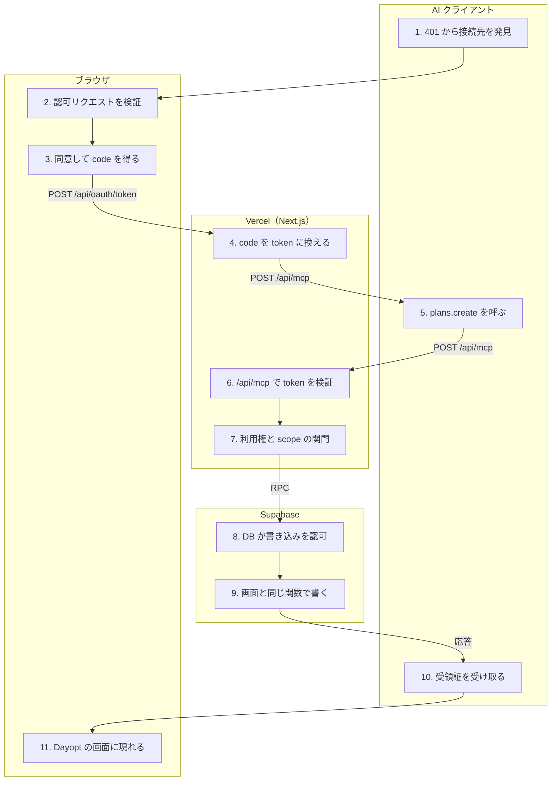

# AI クライアントから Plan を作る（MCP）

<!-- learn:generated:start — 正本 このファイルの learn:journey の JSON / 再生成 pnpm learn:generate / 検証 pnpm docs:check。この範囲は手編集しない -->

Claude などの AI クライアントに「明日 10 時から 1 時間、集中作業の Plan を入れて」と頼むと、MCP の plans.create が呼ばれる。最初の 1 回だけ OAuth で接続を許可し（段 1〜4）、以後は tool 呼び出しだけが走る（段 5〜11）。行き着く先は画面から保存する時（save-plan）と同じ DB 関数 create_plan_command_v1 で、時刻の規則（DT003）と重なりの排他制約もそのまま効く。違うのは入口。認証は session cookie ではなく 5 分寿命の OAuth bearer token。rate limit は IP 1 分 1,200 回・ユーザー 1 分 120 回で、Upstash が落ちると画面側はメモリへ退避して通すのに MCP は 503 で止める。書き込みには Write Fence とは別の MCP 専用の gate（mcp_mutation_control と private.authorize_mcp_mutation_v1）がある。書き込みは tRPC を通らず、専用の service role client が apply RPC を呼ぶ（読み取り tool は tRPC を service role で内部呼び出しするので RLS が効かず、分離は明示的な user filter が持つ）。利用権は route と DB の 2 か所で別々のスイッチで判定する。楽観的更新は無く、operationId による冪等な再送がある。



通るサービス: AI クライアント / ブラウザ / Vercel（Next.js） / Supabase。段 11・失敗 16 種。

同じ操作を別の入口から行う経路: [save-plan](save-plan.md)

#### この経路を守るテスト

- [`apps/product/src/app/api/mcp/_tools/list-tools.test.ts`](../../../apps/product/src/app/api/mcp/_tools/list-tools.test.ts) で `describe('MCP list tools public contract'` を探す（tool 名・scope・公開 field の外部契約）
- [`apps/product/src/lib/test/integration/mcp-plan-create-apply.integration.test.ts`](../../../apps/product/src/lib/test/integration/mcp-plan-create-apply.integration.test.ts) で `describe.skipIf(!RUN_LOCAL)('MCP Plan create apply integration'` を探す（apply RPC の作成・再送・gate 閉。ローカル Supabase が無いと skip）
- [`supabase/tests/single-plan-mcp-access.sql`](../../../supabase/tests/single-plan-mcp-access.sql) で `public.set_mcp_billing_enforcement_v1(boolean,bigint)` を探す（DB 側の利用権スイッチ）

### 1. token 無しの 401 から認可サーバーを見つける（AI クライアント）

AI クライアントに Dayopt を追加すると、まず token 無しで /api/mcp を叩いて 401 を受け取る。WWW-Authenticate の resource_metadata から /.well-known/oauth-protected-resource → /.well-known/oauth-authorization-server を辿り、認可・token の endpoint と scopes_supported（全 8 scope）を知る。client の動的登録（DCR）は無く、Claude / ChatGPT / Cursor の 3 つだけを静的な allowlist で受け付ける。

- **なぜ必要か**: 画面からの保存はログイン済みの cookie があれば始まるが、外部の AI クライアントは Dayopt のログインを持たない。だから最初に「誰の代理で、何をしてよいか」を OAuth で取り決める段が要る。write scope まで広告するのは、広告しないと client が write を一度も要求しないから（付与するかは段 3 が決める）。
- **入力 → 出力**: token 無しの MCP リクエスト → 401 + WWW-Authenticate（scope と resource_metadata）
- **ここを変えると**: scopes_supported・endpoint の URL・client の allowlist は外部契約。scope を改名・削除すると、既に接続済みのクライアントの token が解釈できなくなる（保存済み scope が未知だと token 不正扱い）。
- **コード**:
  - [`apps/product/src/app/api/mcp/route.ts`](../../../apps/product/src/app/api/mcp/route.ts) で `` `resource_metadata="${getResourceMetadataUrl()}"`, `` を探す
  - [`apps/product/src/lib/oauth-server/metadata.ts`](../../../apps/product/src/lib/oauth-server/metadata.ts) で `token_endpoint_auth_methods_supported: ['none'],` を探す
  - [`apps/product/src/lib/oauth-server/scopes.ts`](../../../apps/product/src/lib/oauth-server/scopes.ts) で `export const SUPPORTED_SCOPES = [` を探す
  - [`apps/product/src/lib/oauth-server/clients.ts`](../../../apps/product/src/lib/oauth-server/clients.ts) で `Phase 1 static client allowlist` を探す

### 2. /oauth/authorize でパラメータを検証する（ブラウザ）

ブラウザで /ja/oauth/authorize が開く。サインインしていなければ proxy がサインインへ送る。ここは検証だけで、client_id が allowlist にあるか、redirect_uri が登録済みか、PKCE（S256）の challenge があるか、scope と resource が対応しているかを見て、正しければ同意画面へ redirect する。write gate はここでは見ない。

- **なぜ必要か**: 検証と表示を分けるのは、同意画面を開く前に不正なリクエストを確実に落とすため。gate を見ないのは、見ると gate が閉じている client が読み取り専用の接続すら作れなくなるため。
- **入力 → 出力**: client_id / redirect_uri / code_challenge / scope / resource / state → /ja/oauth/consent への redirect、または エラー表示
- **ここを変えると**: redirect_uri の登録や PKCE の要件を緩めると、code が第三者のドメインへ渡る穴になる（clients.ts のコメント）。security skill の観点で読む。
- **コード**:
  - [`apps/product/src/app/[locale]/oauth/authorize/page.tsx`](../../../apps/product/src/app/[locale]/oauth/authorize/page.tsx) で `認証は middleware (proxy.ts) が enforce する` を探す
  - [`apps/product/src/app/[locale]/oauth/authorize/page.tsx`](../../../apps/product/src/app/[locale]/oauth/authorize/page.tsx) で ``return redirect({ href: `/oauth/consent?${consentQuery.toString()}`, locale });`` を探す
  - [`apps/product/src/lib/oauth-server/metadata.ts`](../../../apps/product/src/lib/oauth-server/metadata.ts) で `code_challenge_methods_supported: ['S256'],` を探す

<details>
<summary>⚡ パラメータが不正（未登録の client・redirect_uri・PKCE 無し） — 画面: エラー表示 / データ: 変化なし / 再試行: しない / 痕跡: 残らない</summary>

- 画面: ブラウザにエラーパネルが出て、同意画面へ進まない。
- データ: 変化なし。
- 再試行: しない。クライアント側の設定を直すまで同じ。
- 痕跡: 想定内の拒否なので Sentry には出ない（パネル表示だけ）。
- **最初に見る場所**: どのエラー文言が出たか（invalidClient / invalidRedirectUri / missingPkce など）。新しいクライアントなら allowlist と redirect_uri の env。
- 根拠:
  - [`apps/product/src/app/[locale]/oauth/authorize/page.tsx`](../../../apps/product/src/app/[locale]/oauth/authorize/page.tsx) で `return <OAuthErrorPanel message={t(ERROR_MESSAGE_KEY[validation.error])} />;` を探す

</details>

### 3. 同意画面で許可し、認可 code を受け取る（ブラウザ）

同意画面は、要求された scope のうち実際に付与するものだけを並べる。「接続を許可」で server action の processConsent が走り、付与する scope を server 側で計算し直してから、create_oauth_authorization_grant_v2 で code の hash を保存し、code を付けて AI クライアントの redirect_uri へ戻す。

- **なぜ必要か**: hidden field は改ざんされうるので scope は server で再計算する。write を付けるのは env の allowlist（MCP_WRITE_ENABLED_CLIENTS）と DB の mcp_mutation_control の両方が開いている時だけ。どちらかが閉じていれば write を落とした読み取り専用の接続として成立させる（同意自体は失敗させない）。
- **入力 → 出力**: 利用者の「接続を許可」 → redirect_uri?code=…&state=…（DB には code の hash だけ）
- **ここを変えると**: scope の表示名と付与判定は外部契約に直結する。付与判定（resolveGrantableScopes）は token 検証側（段 6）と規則を共有しているので、片方だけ変えると同意時と利用時で権限が食い違う。
- **コード**:
  - [`apps/product/src/app/[locale]/oauth/consent/actions.ts`](../../../apps/product/src/app/[locale]/oauth/consent/actions.ts) で `export async function processConsent(formData: FormData) {` を探す
  - [`apps/product/src/app/[locale]/oauth/consent/actions.ts`](../../../apps/product/src/app/[locale]/oauth/consent/actions.ts) で `const grantableScopes = resolveGrantableScopes(` を探す
  - [`apps/product/src/app/[locale]/oauth/consent/actions.ts`](../../../apps/product/src/app/[locale]/oauth/consent/actions.ts) で `dbClient.rpc('create_oauth_authorization_grant_v2', {` を探す
  - [`apps/product/src/lib/oauth-server/write-gate.ts`](../../../apps/product/src/lib/oauth-server/write-gate.ts) で `export async function isConsentWriteEnabled(` を探す
- **この段を守るテスト**:
  - [`apps/product/src/app/[locale]/oauth/consent/actions.test.ts`](../../../apps/product/src/app/[locale]/oauth/consent/actions.test.ts) で `describe('processConsent write gate downgrade'` を探す
  - [`apps/product/src/lib/oauth-server/scopes.test.ts`](../../../apps/product/src/lib/oauth-server/scopes.test.ts) で `describe('resolveGrantableScopes'` を探す

<details>
<summary>⚡ 利用者がキャンセルする — 画面: 別の画面へ / データ: 変化なし / 再試行: 利用者がやり直す / 痕跡: 残らない</summary>

- 画面: AI クライアントへ戻り、接続できなかった旨が出る。
- データ: 変化なし。code も接続も作られない。
- 再試行: 利用者がやり直す（接続をもう一度始める）。
- 痕跡: 何も残らない。
- **最初に見る場所**: 仕様どおり。redirect_uri に error=access_denied が付いて戻る。
- 根拠:
  - [`apps/product/src/app/[locale]/oauth/consent/actions.ts`](../../../apps/product/src/app/[locale]/oauth/consent/actions.ts) で `redirectUrl.searchParams.set('error', 'access_denied');` を探す

</details>

<details>
<summary>⚡ 書き込みの gate が閉じている — 画面: 設定次第 / データ: 保存される / 再試行: 不要 / 痕跡: 残らない</summary>

- 画面: 同意画面に「書き込みは現在この接続では有効になっていないため、読み取り権限のみを許可します」と出る。接続自体は成功する。
- データ: 読み取り専用の接続として保存される。
- 再試行: 不要。ただし後で gate を開けても、この接続に write は付かない。書き込むには接続し直す。
- 痕跡: 何も残らない（想定内の降格）。
- **最初に見る場所**: runbook の MCP write gate の節。env の allowlist と mcp_mutation_control の両方を見る。
- 根拠:
  - [`apps/product/src/lib/oauth-server/scopes.ts`](../../../apps/product/src/lib/oauth-server/scopes.ts) で `export function resolveGrantableScopes(` を探す
  - [`docs/operations/runbook.md`](../../operations/runbook.md) で ``### MCP write gate の開閉（`mcp_mutation_control`）`` を探す

</details>

### 4. /api/oauth/token で code を token に換える（Vercel（Next.js））

AI クライアントが code と PKCE の code_verifier を POST する。public client なので client secret は無い。検証に通ると不透明な access token（寿命 5 分）と refresh token を発行し、DB には SHA-256 の hash だけを保存する。以後の refresh は rotation で、古い refresh token は失効する。

- **なぜ必要か**: token を hash で持つのは、DB が漏れても token を再現できないようにするため。寿命を 5 分と短くし、接続の状態を毎回読むので、接続の解除や gate の閉鎖が token の期限切れを待たずに効く。
- **入力 → 出力**: grant_type=authorization_code / code / code_verifier / redirect_uri / resource → access_token・refresh_token・scope（付与された範囲）
- **ここを変えると**: token endpoint の応答形式・grant_type は外部契約。Write Fence が止めるのは authorization_code（新規接続）だけで、refresh は通す。fence 中も既存の接続は既存の token で書けるため、refresh を止めても防げるものが無い、という判断。
- **コード**:
  - [`apps/product/src/app/api/oauth/token/route.ts`](../../../apps/product/src/app/api/oauth/token/route.ts) で `grantType === 'authorization_code' &&` を探す
  - [`apps/product/src/lib/oauth-server/tokens.ts`](../../../apps/product/src/lib/oauth-server/tokens.ts) で `export function hashToken(token: string): string {` を探す
  - [`apps/product/src/lib/oauth-server/code-exchange.ts`](../../../apps/product/src/lib/oauth-server/code-exchange.ts) で `throw new OAuthServerError('invalid_grant', 'PKCE verification failed');` を探す

<details>
<summary>⚡ Write Fence が ON の間に新しく接続する — 画面: エラー表示 / データ: 変化なし / 再試行: 条件次第 / 痕跡: 残らない</summary>

- 画面: AI クライアント側で接続が失敗する（503 temporarily_unavailable、Retry-After 30 秒）。
- データ: 変化なし。code は消費されない。
- 再試行: クライアント次第。fence が解けるまで同じ結果。
- 痕跡: 運用が意図した停止なので Sentry には出さない。
- **最初に見る場所**: fence を ON にした経緯。runbook の Write Fence の節。
- 根拠:
  - [`apps/product/src/app/api/oauth/token/route.ts`](../../../apps/product/src/app/api/oauth/token/route.ts) で `error_description: 'Writes are temporarily paused for maintenance',` を探す
  - [`docs/operations/runbook.md`](../../operations/runbook.md) で `### Write Fence 有効化（API層の書き込み停止）` を探す

</details>

### 5. AI が plans.create を呼ぶ（AI クライアント）

AI は必要なら先に activities.list でアクティビティの ID を調べ、plans.create を JSON-RPC の tools/call として Bearer token 付きで POST する。入力は operationId（UUID）・title・startAt・endAt・note・activityId。operationId は冪等キーで、同じ依頼を送り直しても Plan は 1 つにしかならない。

- **なぜ必要か**: 画面からの保存には楽観的更新があり、サーバーの返事を待たずに一時 Plan を出す。MCP にはそれが無く、AI は返事（受領証）を待つ。代わりに operationId があるので、通信が切れても安全に送り直せる（画面の保存には冪等キーが無く、利用者が作り直すと二重になりうる）。読み取り tool（activities.list など）は tRPC を service role + oauthExecution 'mcp_internal' で内部呼び出しするので RLS が効かず、テナント分離は各 service の user filter だけが持つ。
- **入力 → 出力**: 利用者の自然文の依頼 → POST /api/mcp（tools/call plans.create、Authorization: Bearer）
- **ここを変えると**: tool 名（plans.create）・入力 schema・必要 scope（write:plans）は外部契約。改名・削除・必須項目の追加は、既存クライアントと、それを前提に書かれた利用者の指示を壊す。tool の説明文は「Create one future Plan」のままで、過去にも Plan を置ける現行の規則と食い違っている。
- **コード**:
  - [`apps/product/src/app/api/mcp/_tools/timeblock-mutations.ts`](../../../apps/product/src/app/api/mcp/_tools/timeblock-mutations.ts) で `export const MCP_PLAN_CREATE_INPUT_SCHEMA = z` を探す
  - [`apps/product/src/app/api/mcp/_tools/registry.ts`](../../../apps/product/src/app/api/mcp/_tools/registry.ts) で `name: 'plans.create',` を探す
  - [`apps/product/src/lib/mcp/trpc-bridge.ts`](../../../apps/product/src/lib/mcp/trpc-bridge.ts) で `oauthExecution: 'mcp_internal',` を探す
  - [`docs/engineering/invariants.md`](../../engineering/invariants.md) で `## MCP の DB 書き込み境界` を探す（読み取りは RLS が効かず user filter だけが分離を持つ）
- **この段を守るテスト**:
  - [`apps/product/src/app/api/mcp/_tools/list-tools.test.ts`](../../../apps/product/src/app/api/mcp/_tools/list-tools.test.ts) で `it('descriptor、scope preflight、実登録toolの集合が一致する'` を探す
  - [`apps/product/src/lib/test/integration/mcp-read-tenant-isolation.integration.test.ts`](../../../apps/product/src/lib/test/integration/mcp-read-tenant-isolation.integration.test.ts) で `describe.skipIf(!RUN_LOCAL)('MCP read tenant isolation'` を探す

### 6. /api/mcp で受けて token を検証する（Vercel（Next.js））

Vercel の Function（上限 120 秒）。順に、host の確認 → IP 単位の rate limit（1 分 1,200 回）→ body の大きさ（1MB）→ token の検証。検証では hash で oauth_tokens を引き、期限・失効を見て、接続（oauth_connections）が解除・再認可切れでないかを毎回読む。write scope は env の allowlist・接続の write_enabled_at・mcp_mutation_control の 3 つが揃う時だけ残し、どれかが閉じていれば token から落とす。

- **なぜ必要か**: 画面の保存は cookie の session を tRPC の context で読むが、ここは bearer token を自前で検証する。接続の状態と gate を毎回読むので、解除や停止が 5 分の token 期限を待たずに効く。上限が 120 秒なのは、認証だけで DB 問い合わせが最大 5 回直列に走るため。
- **入力 → 出力**: Authorization: Bearer <access token> → userId・clientId・有効な scope・利用権の判定結果
- **ここを変えると**: 401 / 403 の WWW-Authenticate の形は、クライアントが再認可するかを決める外部契約。5xx を 401 に丸めると、クライアントが再認可を繰り返して本当の障害が見えなくなる（route.ts のコメント）。
- **コード**:
  - [`apps/product/src/app/api/mcp/route.ts`](../../../apps/product/src/app/api/mcp/route.ts) で `const preAuthRateLimitState = await checkMcpPreAuthRateLimit(request);` を探す
  - [`apps/product/src/lib/mcp/auth.ts`](../../../apps/product/src/lib/mcp/auth.ts) で `export async function verifyAccessToken(token: string): Promise<VerifiedAccessToken> {` を探す
  - [`apps/product/src/lib/mcp/auth.ts`](../../../apps/product/src/lib/mcp/auth.ts) で `async function applyDurableWriteGate(` を探す
- **この段を守るテスト**:
  - [`apps/product/src/lib/mcp/auth.test.ts`](../../../apps/product/src/lib/mcp/auth.test.ts) で `describe('verifyAccessToken dependency failures'` を探す

<details>
<summary>⚡ access token の期限切れ（401 invalid_token） — 画面: 何も起きない / データ: 変化なし / 再試行: 相手が再送 / 痕跡: 残らない</summary>

- 画面: 利用者は気づかないことが多い。クライアントが refresh token で取り直して送り直す。
- データ: 変化なし（取り直した後の依頼で保存される）。
- 再試行: クライアントが refresh して再送する。寿命 5 分なので日常的に起きる。
- 痕跡: 想定内なので Sentry には出ない。
- **最初に見る場所**: 頻発して接続が切れるなら、refresh 側（/api/oauth/token）の失敗を見る。
- 根拠:
  - [`apps/product/src/lib/mcp/auth.ts`](../../../apps/product/src/lib/mcp/auth.ts) で `throw new OAuthServerError('invalid_token', 'Access token expired', 401);` を探す

</details>

<details>
<summary>⚡ 接続が解除済み・再認可の期限切れ（401） — 画面: 別の画面へ / データ: 変化なし / 再試行: 利用者がやり直す / 痕跡: 残らない</summary>

- 画面: AI クライアントが「再接続が必要」と出す。
- データ: 変化なし。
- 再試行: 利用者が接続し直す（段 1 から）。
- 痕跡: 想定内なので Sentry には出ない。
- **最初に見る場所**: 設定画面の接続一覧で解除されていないか。oauth_connections の revoked_at / reauth_required_at。
- 根拠:
  - [`apps/product/src/lib/mcp/auth.ts`](../../../apps/product/src/lib/mcp/auth.ts) で `'OAuth connection is no longer authorized', 401` を探す

</details>

<details>
<summary>⚡ Upstash（Redis）が落ちている — 画面: 使えない / データ: 変化なし / 再試行: 条件次第 / 痕跡: Sentry</summary>

- 画面: AI クライアントに失敗が返る（503、Retry-After 5 秒）。画面からの保存と違い、MCP は止まる。
- データ: 変化なし。
- 再試行: クライアント次第。Upstash が戻るまで同じ。
- 痕跡: Sentry（feature: mcp / operation: check_pre_auth_rate_limit など）。
- **最初に見る場所**: Upstash の status。画面側の tRPC はメモリの判定へ退避して通す（fail-open）が、本番の MCP は分散 rate limit を必須にしていて fail-closed。
- 根拠:
  - [`apps/product/src/lib/mcp/request-rate-limit.ts`](../../../apps/product/src/lib/mcp/request-rate-limit.ts) で `export function requiresDistributedMcpRateLimit(` を探す
  - [`apps/product/src/lib/mcp/request-rate-limit.ts`](../../../apps/product/src/lib/mcp/request-rate-limit.ts) で `logger.error('MCP rate limit check failed');` を探す

</details>

### 7. ユーザー rate limit・利用権・scope を確かめる（Vercel（Next.js））

順に、ユーザー単位の rate limit（1 分 120 回）→ 利用権（BILLING_ENFORCED が有効な時だけ、契約中か 45 日体験中か）→ 呼ばれた tool に必要な scope（plans.create なら write:plans）があるか。通ると request ごとに stateless な MCP server を立て、token が持つ scope の tool だけを登録して handler へ渡す。handler 内でも scope をもう一度確かめる。

- **なぜ必要か**: 画面の保存（protectedProcedure）は session・MFA・利用権・Write Fence・1 分 300 回の rate limit を見る。MCP の書き込みは tRPC を通らないので、MFA と Write Fence はこの経路には効かない。代わりに scope と MCP 専用の gate が守る。scope が足りない時に 403 insufficient_scope を返すのは、クライアントに追加の許可（step-up）を求めさせるため。
- **入力 → 出力**: 検証済みの token 情報 + tools/call → plans.create の handler 実行
- **ここを変えると**: tool と scope の対応（registry）は外部契約。scope を変えると、既に付与済みの接続でその tool が見えなくなる。tool の足し引きは list-tools.test.ts の集合一致テストが止める。
- **コード**:
  - [`apps/product/src/app/api/mcp/route.ts`](../../../apps/product/src/app/api/mcp/route.ts) で `if (!auth.proEntitled) return proEntitlementErrorResponse();` を探す
  - [`apps/product/src/app/api/mcp/route.ts`](../../../apps/product/src/app/api/mcp/route.ts) で `function collectMissingToolScopes(` を探す
  - [`apps/product/src/app/api/mcp/_server.ts`](../../../apps/product/src/app/api/mcp/_server.ts) で `if (ctx.scopes.includes(descriptor.requiredScope)) {` を探す
- **この段を守るテスト**:
  - [`apps/product/src/app/api/mcp/route.test.ts`](../../../apps/product/src/app/api/mcp/route.test.ts) で `describe('MCP route scope preflight'` を探す

<details>
<summary>⚡ write:plans が無い（403 insufficient_scope） — 画面: 別の画面へ / データ: 変化なし / 再試行: 利用者がやり直す / 痕跡: 残らない</summary>

- 画面: AI クライアントが追加の許可を求める。gate が閉じている間は同意しても読み取りのみの接続になり、plans.create は使えないまま。
- データ: 変化なし。
- 再試行: 利用者が許可し直す。gate が閉じていれば解決しない。
- 痕跡: 想定内なので Sentry には出ない。
- **最初に見る場所**: 接続が write 無しで作られていないか（段 3 の降格）、または token 検証で write が落とされていないか（段 6 の gate）。runbook の MCP write gate の節。
- 根拠:
  - [`apps/product/src/app/api/mcp/route.ts`](../../../apps/product/src/app/api/mcp/route.ts) で `` `Bearer error="insufficient_scope", scope="${required}", ` + `` を探す

</details>

<details>
<summary>⚡ 利用権が無い（403、BILLING_ENFORCED 有効時） — 画面: エラー表示 / データ: 変化なし / 再試行: しない / 痕跡: 残らない</summary>

- 画面: AI クライアントに「Dayopt アプリで体験を始めるか購読して再開」の JSON-RPC エラーが返る。
- データ: 変化なし。
- 再試行: しない。利用者がアプリで体験開始か購読をする。
- 痕跡: 想定内なので Sentry には出ない。拒否した呼び出しは接続の「最終利用」にも記録しない。
- **最初に見る場所**: profiles の契約・体験の状態。BILLING_ENFORCED が未設定（既定）ならこの判定自体が走らない。
- 根拠:
  - [`apps/product/src/lib/mcp/auth.ts`](../../../apps/product/src/lib/mcp/auth.ts) で `if (!isBillingEnforced()) return true;` を探す
  - [`apps/product/src/app/api/mcp/route.ts`](../../../apps/product/src/app/api/mcp/route.ts) で `message: 'Open the Dayopt app to start your trial or subscribe to resume access',` を探す

</details>

<details>
<summary>⚡ ユーザー単位の rate limit を超える（429） — 画面: エラー表示 / データ: 変化なし / 再試行: 条件次第 / 痕跡: 残らない</summary>

- 画面: AI クライアントに「Too many requests」が返る（Retry-After 60 秒）。
- データ: 変化なし。
- 再試行: クライアント次第。AI が連続で tool を呼ぶと届きやすい。
- 痕跡: 想定内なので Sentry には出ない。
- **最初に見る場所**: Upstash のダッシュボード。画面の tRPC（1 分 300 回）とは別の枠。
- 根拠:
  - [`apps/product/src/lib/mcp/request-rate-limit.ts`](../../../apps/product/src/lib/mcp/request-rate-limit.ts) で `const LOCAL_USER_LIMIT = 120;` を探す

</details>

### 8. apply RPC が DB の中で認可を取り直す（Supabase）

McpMutationClient が、apply RPC 8 本だけに絞った service role client で apply_mcp_plan_create_v1 を呼ぶ。user_id は渡さない。RPC の中で private.authorize_mcp_mutation_v1 が、gate（writes_enabled と enabled_client_ids）→ 接続と token の束縛・失効・scope → 利用権を 1 トランザクション内で確かめ、接続から user_id を決める。同じ operationId の受領証があれば、新しく作らずにそれを返す（replayed: true）。

- **なぜ必要か**: 画面の保存では、アプリが user_id を引数で渡し、テナント分離はそれを正しく渡すことに頼る。MCP は token 検証（段 6）から書き込みまでの間に接続が解除される競合があるので、DB の中で同じ条件をもう一度確かめる。利用権もここで別に判定し、スイッチは mcp_mutation_control.billing_enforced（段 7 の BILLING_ENFORCED とは別）。既定では契約中（active / trialing / past_due）だけが書ける。
- **入力 → 出力**: connection_id・access_token_id・operationId・title・startAt・endAt・activityId → 認可済みの user_id（または DM003 / DM004 / DM005）
- **ここを変えると**: gate の開閉は SQL を直接書かず pnpm mcp:gate（revision 付きの service role 限定 RPC）で行う。Write Fence はこの gate に効かないので、障害時に MCP の書き込みを止めるには gate を別に閉じる。認可の条件を変える時は REVIEW-1（ユーザー分離）の観点で読む。
- **コード**:
  - [`apps/product/src/features/timeblock/server/mcp-mutation-client.ts`](../../../apps/product/src/features/timeblock/server/mcp-mutation-client.ts) で `async createPlan(input: McpPlanCreateInput): Promise<McpPlanCreateReceipt> {` を探す
  - [`apps/product/src/features/timeblock/server/mcp-mutation-db.ts`](../../../apps/product/src/features/timeblock/server/mcp-mutation-db.ts) で `'apply_mcp_plan_create_v1'` を探す
  - [`supabase/migrations/20260908022927_add_mcp_billing_access_switch.sql`](../../../supabase/migrations/20260908022927_add_mcp_billing_access_switch.sql) で `CREATE OR REPLACE FUNCTION private.authorize_mcp_mutation_v1(` を探す
  - [`docs/operations/runbook.md`](../../operations/runbook.md) で `#### 利用権（billing）判定の切替` を探す
- **この段を守るテスト**:
  - [`apps/product/src/lib/test/integration/mcp-plan-create-apply.integration.test.ts`](../../../apps/product/src/lib/test/integration/mcp-plan-create-apply.integration.test.ts) で `it('serializes parallel retries into one Plan, one receipt, and one replay'` を探す
  - [`supabase/tests/single-plan-mcp-access.sql`](../../../supabase/tests/single-plan-mcp-access.sql) で `public.set_mcp_billing_enforcement_v1(boolean,bigint)` を探す

<details>
<summary>⚡ token 検証の後に gate が閉じた（DM003） — 画面: エラー表示 / データ: 変化なし / 再試行: 条件次第 / 痕跡: 残らない</summary>

- 画面: AI クライアントに WRITE_DISABLED（一時的に無効、再試行可）の tool エラーが返る。
- データ: 変化なし。
- 再試行: retryable: true として返す。gate が開くまで同じ結果。
- 痕跡: 想定内のコードなので Sentry には出ない。
- **最初に見る場所**: mcp_mutation_control の writes_enabled と enabled_client_ids。通常は段 6 で write scope が落ちて 403 になるので、これが出るのは閉鎖とほぼ同時の呼び出しだけ。
- 根拠:
  - [`supabase/migrations/20260908022927_add_mcp_billing_access_switch.sql`](../../../supabase/migrations/20260908022927_add_mcp_billing_access_switch.sql) で `RAISE EXCEPTION 'MCP writes are disabled'` を探す
  - [`apps/product/src/features/timeblock/server/mcp-mutation-client.ts`](../../../apps/product/src/features/timeblock/server/mcp-mutation-client.ts) で `DM003: 'WRITE_DISABLED',` を探す

</details>

<details>
<summary>⚡ DB 側の利用権が無い（DM005） — 画面: エラー表示 / データ: 変化なし / 再試行: しない / 痕跡: 残らない</summary>

- 画面: AI クライアントに PRO_REQUIRED の tool エラーが返る。読み取りは通るのに書き込みだけ失敗する。
- データ: 変化なし。
- 再試行: しない。
- 痕跡: 想定内のコードなので Sentry には出ない。
- **最初に見る場所**: 2 つのスイッチの食い違い。BILLING_ENFORCED だけ true にすると、体験中の利用者は読めるのに書けない。順序は runbook と billing-single-plan-rollout.md。
- 根拠:
  - [`apps/product/src/features/timeblock/server/mcp-mutation-client.ts`](../../../apps/product/src/features/timeblock/server/mcp-mutation-client.ts) で `DM005: 'PRO_REQUIRED',` を探す
  - [`docs/operations/runbook.md`](../../operations/runbook.md) で ``env だけ `true` にすると、体験中ユーザーは読めるのに書き込みだけ `DM005` で落ちる`` を探す

</details>

<details>
<summary>⚡ 同じ operationId で送り直す — 画面: 何も起きない / データ: 保存される / 再試行: 不要 / 痕跡: 残らない</summary>

- 画面: 何も変わらない。前回と同じ受領証が replayed: true で返る。
- データ: Plan は 1 つのまま（二重にならない）。
- 再試行: 不要。受領証の保持期限内なら何度送っても同じ。
- 痕跡: 何も残らない。
- **最初に見る場所**: 同じ operationId で中身が違うと IDEMPOTENCY_KEY_REUSED で拒否される。
- 根拠:
  - [`apps/product/src/features/timeblock/server/mcp-mutation-client.ts`](../../../apps/product/src/features/timeblock/server/mcp-mutation-client.ts) で `DM006: 'IDEMPOTENCY_KEY_REUSED',` を探す

</details>

### 9. 画面と同じ create_plan_command_v1 で書き込む（Supabase）

認可が通ると、apply RPC は画面からの保存と同じ create_plan_command_v1 を source 'api' で呼ぶ。時刻の規則（DT003: end_at > start_at）と重なりの排他制約（23P01）はここで同じように効く。成功すると同じトランザクションで受領証（mcp_mutation_receipts）を書く。deadlock（40P01）は adapter が 1 回だけ送り直す。

- **なぜ必要か**: 入口が違っても規則の正本は DB に 1 つだけ、というのがこの経路の要点。画面の保存と違うのは source（画面は manual、MCP は api）と、利用記録 plan_created を送らない点（Service 層を通らないため。意図かは未確認）。
- **入力 → 出力**: user_id（段 8 で決定）・title・start_at・end_at・activity_id → plans の行 + 受領証（resourceId・version・replayed: false）
- **ここを変えると**: create_plan_command_v1 の規則を変えると、画面と MCP の両方が同時に変わる。MCP のエラーコード対応表（EXPECTED_ERROR_CODES）は画面側の表とは別にあるので、新しい SQLSTATE を足したら両方に足さないと MCP だけ MUTATION_FAILED になる。
- **コード**:
  - [`supabase/migrations/20260914000000_version_mcp_create_digest.sql`](../../../supabase/migrations/20260914000000_version_mcp_create_digest.sql) で `FROM public.create_plan_command_v1(` を探す
  - [`supabase/migrations/20260904080216_simplify_timeblock_temporal_rules.sql`](../../../supabase/migrations/20260904080216_simplify_timeblock_temporal_rules.sql) で `DT003` を探す
  - [`apps/product/src/features/timeblock/server/mcp-mutation-client.ts`](../../../apps/product/src/features/timeblock/server/mcp-mutation-client.ts) で `const EXPECTED_ERROR_CODES: Readonly<Record<string, McpMutationErrorCode>> = {` を探す

<details>
<summary>⚡ 時刻の規則に反する（DT003） — 画面: エラー表示 / データ: 変化なし / 再試行: しない / 痕跡: 残らない</summary>

- 画面: AI クライアントに INVALID_TIME_RANGE の tool エラーが返る。AI が時刻を直して送り直すことが多い。
- データ: 変化なし。
- 再試行: しない（retryable: false）。AI が別の operationId で作り直す。
- 痕跡: 想定内のコードなので Sentry には出ない。
- **最初に見る場所**: AI が渡した startAt / endAt。invariants.md §時刻。
- 根拠:
  - [`apps/product/src/features/timeblock/server/mcp-mutation-client.ts`](../../../apps/product/src/features/timeblock/server/mcp-mutation-client.ts) で `DT003: 'INVALID_TIME_RANGE',` を探す

</details>

<details>
<summary>⚡ 既存と重なる（23P01） — 画面: エラー表示 / データ: 変化なし / 再試行: しない / 痕跡: 残らない</summary>

- 画面: AI クライアントに TIME_OVERLAP の tool エラーが返る。画面と違って事前の重なり確認は無く、DB で初めて分かる。
- データ: 変化なし。
- 再試行: しない。AI が constraints.get などで空きを調べて作り直す。
- 痕跡: 想定内のコードなので Sentry には出ない。
- **最初に見る場所**: その時間帯の既存の Plan / Record。
- 根拠:
  - [`apps/product/src/features/timeblock/server/mcp-mutation-client.ts`](../../../apps/product/src/features/timeblock/server/mcp-mutation-client.ts) で `'23P01': 'TIME_OVERLAP',` を探す

</details>

<details>
<summary>⚡ 想定外の DB エラー — 画面: エラー表示 / データ: 変化なし / 再試行: 条件次第 / 痕跡: Sentry</summary>

- 画面: AI クライアントに MUTATION_FAILED（再試行可）の tool エラーが返る。
- データ: トランザクションごと取り消されるので何も残らない。
- 再試行: retryable: true。同じ operationId で送り直せば、万一確定していても二重にならない。
- 痕跡: Sentry（feature: mcp、operation: apply_mcp_plan_create）。PostgREST のメッセージは載せず SQLSTATE だけ。
- **最初に見る場所**: Sentry の該当 issue → 同じ時刻の Supabase の Postgres ログ。
- 根拠:
  - [`apps/product/src/features/timeblock/server/mcp-mutation-client.ts`](../../../apps/product/src/features/timeblock/server/mcp-mutation-client.ts) で `new SanitizedMcpMutationDatabaseError(databaseCode ?? 'UNKNOWN'),` を探す

</details>

### 10. AI が受領証を受け取って利用者に伝える（AI クライアント）

tool の結果は受領証（schemaVersion・operationId・resourceType・resourceId・version・replayed）だけで、Plan の中身は返さない。AI はこれを見て「入れました」と答える。中身を確かめたい時は plans.get を別に呼ぶ。

- **なぜ必要か**: 受領証の形は DB に保存された値をそのまま返すので、読み取り tool の schemaVersion とは別に固定している（上げると replay の値と食い違う）。
- **入力 → 出力**: JSON-RPC の応答（structuredContent） → AI の返答
- **ここを変えると**: 受領証の field と schemaVersion は外部契約。変えると、保存済みの受領証を再送で返す時に outputSchema の検証が失敗し、全 mutation tool が壊れる（timeblock-mutations.ts のコメント）。
- **コード**:
  - [`apps/product/src/app/api/mcp/_tools/timeblock-mutations.ts`](../../../apps/product/src/app/api/mcp/_tools/timeblock-mutations.ts) で `schemaVersion: z.literal(MCP_MUTATION_RECEIPT_SCHEMA_VERSION),` を探す
  - [`apps/product/src/app/api/mcp/_tools/tool-result.ts`](../../../apps/product/src/app/api/mcp/_tools/tool-result.ts) で `export function createMcpToolSuccess(` を探す
- **この段を守るテスト**:
  - [`apps/product/src/lib/test/integration/mcp-plan-create-apply.integration.test.ts`](../../../apps/product/src/lib/test/integration/mcp-plan-create-apply.integration.test.ts) で `it('creates one API Plan and replays the exact receipt across timestamp representations'` を探す

### 11. 開いている Dayopt の画面には、次の取り直しで現れる（ブラウザ）

Realtime の購読は無いので、MCP で作った Plan はすぐには画面に出ない。カレンダーの一覧は既定の staleTime（5 分）で、フォーカス復帰の取り直しは古くなった一覧だけに走る。画面で何か書き込んで一覧を無効化した時、表示範囲を変えてまだ取得していない範囲を読んだ時、または最後の取得から 5 分以上経ってタブへ戻った時に現れる。

- **なぜ必要か**: 画面からの保存は自分で一覧を書き換えて取り直す（楽観的更新 + invalidate）が、MCP の書き込みはブラウザの外で起きるので、ブラウザは知らせを受け取らない。
- **入力 → 出力**: 次の plans.list の取り直し → カレンダーに Plan が表示される
- **ここを変えると**: すぐ反映したくなったら Realtime を足す判断になるが、infra.md は Realtime を現状の構成に含めていない。staleTime を短くすると全 query の取得回数が増える。
- **コード**:
  - [`apps/product/src/lib/trpc/query-client.ts`](../../../apps/product/src/lib/trpc/query-client.ts) で `refetchOnWindowFocus: true,` を探す
  - [`apps/product/src/features/calendar/components/controller/hooks/useCalendarData.ts`](../../../apps/product/src/features/calendar/components/controller/hooks/useCalendarData.ts) で `const plansQuery = api.plans.list.useQuery(listInput);` を探す
  - [`docs/engineering/infra.md`](../../engineering/infra.md) で `**Realtime は現状の浸透に含めない。**` を探す

<!-- learn:generated:end -->

## データ（正本）

この JSON がこのページの正本。上の説明と図、`pnpm learn` の対話画面はここから生成する。参照（`path` + `find`）は `pnpm docs:check` が実在を検査する。

```json learn:journey
{
  "id": "mcp",
  "title": "AI クライアントから Plan を作る（MCP）",
  "order": 140,
  "group": "integration",
  "twin": "save-plan",
  "intro": "Claude などの AI クライアントに「明日 10 時から 1 時間、集中作業の Plan を入れて」と頼むと、MCP の plans.create が呼ばれる。最初の 1 回だけ OAuth で接続を許可し（段 1〜4）、以後は tool 呼び出しだけが走る（段 5〜11）。行き着く先は画面から保存する時（save-plan）と同じ DB 関数 create_plan_command_v1 で、時刻の規則（DT003）と重なりの排他制約もそのまま効く。違うのは入口。認証は session cookie ではなく 5 分寿命の OAuth bearer token。rate limit は IP 1 分 1,200 回・ユーザー 1 分 120 回で、Upstash が落ちると画面側はメモリへ退避して通すのに MCP は 503 で止める。書き込みには Write Fence とは別の MCP 専用の gate（mcp_mutation_control と private.authorize_mcp_mutation_v1）がある。書き込みは tRPC を通らず、専用の service role client が apply RPC を呼ぶ（読み取り tool は tRPC を service role で内部呼び出しするので RLS が効かず、分離は明示的な user filter が持つ）。利用権は route と DB の 2 か所で別々のスイッチで判定する。楽観的更新は無く、operationId による冪等な再送がある。",
  "play": "▶ AI に頼む",
  "lanes": ["aiclient", "browser", "vercel", "supabase"],
  "tests": [
    {
      "path": "apps/product/src/app/api/mcp/_tools/list-tools.test.ts",
      "find": "describe('MCP list tools public contract'",
      "why": "tool 名・scope・公開 field の外部契約"
    },
    {
      "path": "apps/product/src/lib/test/integration/mcp-plan-create-apply.integration.test.ts",
      "find": "describe.skipIf(!RUN_LOCAL)('MCP Plan create apply integration'",
      "why": "apply RPC の作成・再送・gate 閉。ローカル Supabase が無いと skip"
    },
    {
      "path": "supabase/tests/single-plan-mcp-access.sql",
      "find": "public.set_mcp_billing_enforcement_v1(boolean,bigint)",
      "why": "DB 側の利用権スイッチ"
    }
  ],
  "hops": [
    {
      "id": "discover",
      "svc": "aiclient",
      "short": "401 から接続先を発見",
      "title": "token 無しの 401 から認可サーバーを見つける",
      "what": "AI クライアントに Dayopt を追加すると、まず token 無しで /api/mcp を叩いて 401 を受け取る。WWW-Authenticate の resource_metadata から /.well-known/oauth-protected-resource → /.well-known/oauth-authorization-server を辿り、認可・token の endpoint と scopes_supported（全 8 scope）を知る。client の動的登録（DCR）は無く、Claude / ChatGPT / Cursor の 3 つだけを静的な allowlist で受け付ける。",
      "why": "画面からの保存はログイン済みの cookie があれば始まるが、外部の AI クライアントは Dayopt のログインを持たない。だから最初に「誰の代理で、何をしてよいか」を OAuth で取り決める段が要る。write scope まで広告するのは、広告しないと client が write を一度も要求しないから（付与するかは段 3 が決める）。",
      "io": {
        "in": "token 無しの MCP リクエスト",
        "out": "401 + WWW-Authenticate（scope と resource_metadata）"
      },
      "change": "scopes_supported・endpoint の URL・client の allowlist は外部契約。scope を改名・削除すると、既に接続済みのクライアントの token が解釈できなくなる（保存済み scope が未知だと token 不正扱い）。",
      "refs": [
        {
          "path": "apps/product/src/app/api/mcp/route.ts",
          "find": "`resource_metadata=\"${getResourceMetadataUrl()}\"`,"
        },
        {
          "path": "apps/product/src/lib/oauth-server/metadata.ts",
          "find": "token_endpoint_auth_methods_supported: ['none'],"
        },
        {
          "path": "apps/product/src/lib/oauth-server/scopes.ts",
          "find": "export const SUPPORTED_SCOPES = ["
        },
        {
          "path": "apps/product/src/lib/oauth-server/clients.ts",
          "find": "Phase 1 static client allowlist"
        }
      ],
      "fails": [],
      "screen": {
        "t": "page",
        "host": "claude.ai",
        "url": "",
        "tone": "neutral",
        "title": "Dayopt に接続",
        "body": "コネクタを追加 → ブラウザで Dayopt の認可画面を開く",
        "button": "接続"
      }
    },
    {
      "id": "authorize",
      "svc": "browser",
      "short": "認可リクエストを検証",
      "title": "/oauth/authorize でパラメータを検証する",
      "what": "ブラウザで /ja/oauth/authorize が開く。サインインしていなければ proxy がサインインへ送る。ここは検証だけで、client_id が allowlist にあるか、redirect_uri が登録済みか、PKCE（S256）の challenge があるか、scope と resource が対応しているかを見て、正しければ同意画面へ redirect する。write gate はここでは見ない。",
      "why": "検証と表示を分けるのは、同意画面を開く前に不正なリクエストを確実に落とすため。gate を見ないのは、見ると gate が閉じている client が読み取り専用の接続すら作れなくなるため。",
      "io": {
        "in": "client_id / redirect_uri / code_challenge / scope / resource / state",
        "out": "/ja/oauth/consent への redirect、または エラー表示"
      },
      "change": "redirect_uri の登録や PKCE の要件を緩めると、code が第三者のドメインへ渡る穴になる（clients.ts のコメント）。security skill の観点で読む。",
      "refs": [
        {
          "path": "apps/product/src/app/[locale]/oauth/authorize/page.tsx",
          "find": "認証は middleware (proxy.ts) が enforce する"
        },
        {
          "path": "apps/product/src/app/[locale]/oauth/authorize/page.tsx",
          "find": "return redirect({ href: `/oauth/consent?${consentQuery.toString()}`, locale });"
        },
        {
          "path": "apps/product/src/lib/oauth-server/metadata.ts",
          "find": "code_challenge_methods_supported: ['S256'],"
        }
      ],
      "fails": [
        {
          "id": "invalid-authorize",
          "label": "パラメータが不正（未登録の client・redirect_uri・PKCE 無し）",
          "screen": "ブラウザにエラーパネルが出て、同意画面へ進まない。",
          "data": "変化なし。",
          "retry": "しない。クライアント側の設定を直すまで同じ。",
          "trace": "想定内の拒否なので Sentry には出ない（パネル表示だけ）。",
          "look": "どのエラー文言が出たか（invalidClient / invalidRedirectUri / missingPkce など）。新しいクライアントなら allowlist と redirect_uri の env。",
          "refs": [
            {
              "path": "apps/product/src/app/[locale]/oauth/authorize/page.tsx",
              "find": "return <OAuthErrorPanel message={t(ERROR_MESSAGE_KEY[validation.error])} />;"
            }
          ],
          "tags": {
            "screen": "toast",
            "data": "unchanged",
            "retry": "none",
            "trace": "none"
          },
          "screenAfter": {
            "t": "page",
            "url": "/ja/oauth/authorize",
            "tone": "bad",
            "title": "redirect_uri が許可されていません。"
          }
        }
      ],
      "screen": {
        "t": "blank",
        "url": "/ja/oauth/authorize",
        "text": "→ 同意画面へ"
      }
    },
    {
      "id": "consent",
      "svc": "browser",
      "short": "同意して code を得る",
      "title": "同意画面で許可し、認可 code を受け取る",
      "what": "同意画面は、要求された scope のうち実際に付与するものだけを並べる。「接続を許可」で server action の processConsent が走り、付与する scope を server 側で計算し直してから、create_oauth_authorization_grant_v2 で code の hash を保存し、code を付けて AI クライアントの redirect_uri へ戻す。",
      "why": "hidden field は改ざんされうるので scope は server で再計算する。write を付けるのは env の allowlist（MCP_WRITE_ENABLED_CLIENTS）と DB の mcp_mutation_control の両方が開いている時だけ。どちらかが閉じていれば write を落とした読み取り専用の接続として成立させる（同意自体は失敗させない）。",
      "io": {
        "in": "利用者の「接続を許可」",
        "out": "redirect_uri?code=…&state=…（DB には code の hash だけ）"
      },
      "change": "scope の表示名と付与判定は外部契約に直結する。付与判定（resolveGrantableScopes）は token 検証側（段 6）と規則を共有しているので、片方だけ変えると同意時と利用時で権限が食い違う。",
      "refs": [
        {
          "path": "apps/product/src/app/[locale]/oauth/consent/actions.ts",
          "find": "export async function processConsent(formData: FormData) {"
        },
        {
          "path": "apps/product/src/app/[locale]/oauth/consent/actions.ts",
          "find": "const grantableScopes = resolveGrantableScopes("
        },
        {
          "path": "apps/product/src/app/[locale]/oauth/consent/actions.ts",
          "find": "dbClient.rpc('create_oauth_authorization_grant_v2', {"
        },
        {
          "path": "apps/product/src/lib/oauth-server/write-gate.ts",
          "find": "export async function isConsentWriteEnabled("
        }
      ],
      "tests": [
        {
          "path": "apps/product/src/app/[locale]/oauth/consent/actions.test.ts",
          "find": "describe('processConsent write gate downgrade'"
        },
        {
          "path": "apps/product/src/lib/oauth-server/scopes.test.ts",
          "find": "describe('resolveGrantableScopes'"
        }
      ],
      "fails": [
        {
          "id": "consent-denied",
          "label": "利用者がキャンセルする",
          "screen": "AI クライアントへ戻り、接続できなかった旨が出る。",
          "data": "変化なし。code も接続も作られない。",
          "retry": "利用者がやり直す（接続をもう一度始める）。",
          "trace": "何も残らない。",
          "look": "仕様どおり。redirect_uri に error=access_denied が付いて戻る。",
          "refs": [
            {
              "path": "apps/product/src/app/[locale]/oauth/consent/actions.ts",
              "find": "redirectUrl.searchParams.set('error', 'access_denied');"
            }
          ],
          "tags": {
            "screen": "redirect",
            "data": "unchanged",
            "retry": "user",
            "trace": "none"
          },
          "to": "discover",
          "back": "error=access_denied",
          "screenAfter": {
            "t": "page",
            "host": "claude.ai",
            "url": "",
            "tone": "warn",
            "title": "Dayopt に接続できませんでした",
            "body": "access_denied"
          }
        },
        {
          "id": "write-gate-closed-at-consent",
          "label": "書き込みの gate が閉じている",
          "screen": "同意画面に「書き込みは現在この接続では有効になっていないため、読み取り権限のみを許可します」と出る。接続自体は成功する。",
          "data": "読み取り専用の接続として保存される。",
          "retry": "不要。ただし後で gate を開けても、この接続に write は付かない。書き込むには接続し直す。",
          "trace": "何も残らない（想定内の降格）。",
          "look": "runbook の MCP write gate の節。env の allowlist と mcp_mutation_control の両方を見る。",
          "refs": [
            {
              "path": "apps/product/src/lib/oauth-server/scopes.ts",
              "find": "export function resolveGrantableScopes("
            },
            {
              "path": "docs/operations/runbook.md",
              "find": "### MCP write gate の開閉（`mcp_mutation_control`）"
            }
          ],
          "tags": {
            "screen": "depends",
            "data": "saved",
            "retry": "na",
            "trace": "none"
          },
          "continues": true,
          "screenAfter": {
            "t": "settings",
            "url": "/ja/oauth/consent",
            "title": "Claude を Dayopt に接続",
            "rows": [
              ["予定と記録の閲覧", ""],
              ["書き込みは現在この接続では有効になっていません", "読み取りのみ", "warn"]
            ],
            "button": "接続を許可",
            "note": "plans.create は tool 一覧に出てこない（段 7）"
          }
        }
      ],
      "screen": {
        "t": "settings",
        "url": "/ja/oauth/consent",
        "title": "Claude を Dayopt に接続",
        "rows": [
          ["予定と記録の閲覧", ""],
          ["アクティビティとカテゴリーの閲覧", ""],
          ["予定の作成と更新", ""],
          ["予定の削除と復元", ""]
        ],
        "button": "接続を許可",
        "note": "付与するものだけが並ぶ。キャンセルもある"
      }
    },
    {
      "id": "token",
      "svc": "vercel",
      "short": "code を token に換える",
      "title": "/api/oauth/token で code を token に換える",
      "what": "AI クライアントが code と PKCE の code_verifier を POST する。public client なので client secret は無い。検証に通ると不透明な access token（寿命 5 分）と refresh token を発行し、DB には SHA-256 の hash だけを保存する。以後の refresh は rotation で、古い refresh token は失効する。",
      "why": "token を hash で持つのは、DB が漏れても token を再現できないようにするため。寿命を 5 分と短くし、接続の状態を毎回読むので、接続の解除や gate の閉鎖が token の期限切れを待たずに効く。",
      "io": {
        "in": "grant_type=authorization_code / code / code_verifier / redirect_uri / resource",
        "out": "access_token・refresh_token・scope（付与された範囲）"
      },
      "change": "token endpoint の応答形式・grant_type は外部契約。Write Fence が止めるのは authorization_code（新規接続）だけで、refresh は通す。fence 中も既存の接続は既存の token で書けるため、refresh を止めても防げるものが無い、という判断。",
      "refs": [
        {
          "path": "apps/product/src/app/api/oauth/token/route.ts",
          "find": "grantType === 'authorization_code' &&"
        },
        {
          "path": "apps/product/src/lib/oauth-server/tokens.ts",
          "find": "export function hashToken(token: string): string {"
        },
        {
          "path": "apps/product/src/lib/oauth-server/code-exchange.ts",
          "find": "throw new OAuthServerError('invalid_grant', 'PKCE verification failed');"
        }
      ],
      "fails": [
        {
          "id": "token-write-fence",
          "label": "Write Fence が ON の間に新しく接続する",
          "screen": "AI クライアント側で接続が失敗する（503 temporarily_unavailable、Retry-After 30 秒）。",
          "data": "変化なし。code は消費されない。",
          "retry": "クライアント次第。fence が解けるまで同じ結果。",
          "trace": "運用が意図した停止なので Sentry には出さない。",
          "look": "fence を ON にした経緯。runbook の Write Fence の節。",
          "refs": [
            {
              "path": "apps/product/src/app/api/oauth/token/route.ts",
              "find": "error_description: 'Writes are temporarily paused for maintenance',"
            },
            {
              "path": "docs/operations/runbook.md",
              "find": "### Write Fence 有効化（API層の書き込み停止）"
            }
          ],
          "tags": {
            "screen": "toast",
            "data": "unchanged",
            "retry": "depends",
            "trace": "none"
          },
          "to": "discover",
          "back": "503 で接続失敗",
          "screenAfter": {
            "t": "page",
            "host": "claude.ai",
            "url": "",
            "tone": "bad",
            "title": "Dayopt に接続できませんでした",
            "body": "temporarily_unavailable"
          }
        }
      ],
      "via": "POST /api/oauth/token"
    },
    {
      "id": "tool-call",
      "svc": "aiclient",
      "short": "plans.create を呼ぶ",
      "title": "AI が plans.create を呼ぶ",
      "what": "AI は必要なら先に activities.list でアクティビティの ID を調べ、plans.create を JSON-RPC の tools/call として Bearer token 付きで POST する。入力は operationId（UUID）・title・startAt・endAt・note・activityId。operationId は冪等キーで、同じ依頼を送り直しても Plan は 1 つにしかならない。",
      "why": "画面からの保存には楽観的更新があり、サーバーの返事を待たずに一時 Plan を出す。MCP にはそれが無く、AI は返事（受領証）を待つ。代わりに operationId があるので、通信が切れても安全に送り直せる（画面の保存には冪等キーが無く、利用者が作り直すと二重になりうる）。読み取り tool（activities.list など）は tRPC を service role + oauthExecution 'mcp_internal' で内部呼び出しするので RLS が効かず、テナント分離は各 service の user filter だけが持つ。",
      "io": {
        "in": "利用者の自然文の依頼",
        "out": "POST /api/mcp（tools/call plans.create、Authorization: Bearer）"
      },
      "change": "tool 名（plans.create）・入力 schema・必要 scope（write:plans）は外部契約。改名・削除・必須項目の追加は、既存クライアントと、それを前提に書かれた利用者の指示を壊す。tool の説明文は「Create one future Plan」のままで、過去にも Plan を置ける現行の規則と食い違っている。",
      "refs": [
        {
          "path": "apps/product/src/app/api/mcp/_tools/timeblock-mutations.ts",
          "find": "export const MCP_PLAN_CREATE_INPUT_SCHEMA = z"
        },
        {
          "path": "apps/product/src/app/api/mcp/_tools/registry.ts",
          "find": "name: 'plans.create',"
        },
        {
          "path": "apps/product/src/lib/mcp/trpc-bridge.ts",
          "find": "oauthExecution: 'mcp_internal',"
        },
        {
          "path": "docs/engineering/invariants.md",
          "find": "## MCP の DB 書き込み境界",
          "why": "読み取りは RLS が効かず user filter だけが分離を持つ"
        }
      ],
      "tests": [
        {
          "path": "apps/product/src/app/api/mcp/_tools/list-tools.test.ts",
          "find": "it('descriptor、scope preflight、実登録toolの集合が一致する'"
        },
        {
          "path": "apps/product/src/lib/test/integration/mcp-read-tenant-isolation.integration.test.ts",
          "find": "describe.skipIf(!RUN_LOCAL)('MCP read tenant isolation'"
        }
      ],
      "fails": [],
      "screen": {
        "t": "page",
        "host": "claude.ai",
        "url": "",
        "tone": "neutral",
        "title": "Dayopt: plans.create を実行中…",
        "body": "明日 10:00–11:00「集中作業」"
      },
      "via": "POST /api/mcp"
    },
    {
      "id": "mcp-route",
      "svc": "vercel",
      "short": "/api/mcp で token を検証",
      "title": "/api/mcp で受けて token を検証する",
      "what": "Vercel の Function（上限 120 秒）。順に、host の確認 → IP 単位の rate limit（1 分 1,200 回）→ body の大きさ（1MB）→ token の検証。検証では hash で oauth_tokens を引き、期限・失効を見て、接続（oauth_connections）が解除・再認可切れでないかを毎回読む。write scope は env の allowlist・接続の write_enabled_at・mcp_mutation_control の 3 つが揃う時だけ残し、どれかが閉じていれば token から落とす。",
      "why": "画面の保存は cookie の session を tRPC の context で読むが、ここは bearer token を自前で検証する。接続の状態と gate を毎回読むので、解除や停止が 5 分の token 期限を待たずに効く。上限が 120 秒なのは、認証だけで DB 問い合わせが最大 5 回直列に走るため。",
      "io": {
        "in": "Authorization: Bearer <access token>",
        "out": "userId・clientId・有効な scope・利用権の判定結果"
      },
      "change": "401 / 403 の WWW-Authenticate の形は、クライアントが再認可するかを決める外部契約。5xx を 401 に丸めると、クライアントが再認可を繰り返して本当の障害が見えなくなる（route.ts のコメント）。",
      "refs": [
        {
          "path": "apps/product/src/app/api/mcp/route.ts",
          "find": "const preAuthRateLimitState = await checkMcpPreAuthRateLimit(request);"
        },
        {
          "path": "apps/product/src/lib/mcp/auth.ts",
          "find": "export async function verifyAccessToken(token: string): Promise<VerifiedAccessToken> {"
        },
        {
          "path": "apps/product/src/lib/mcp/auth.ts",
          "find": "async function applyDurableWriteGate("
        }
      ],
      "tests": [
        {
          "path": "apps/product/src/lib/mcp/auth.test.ts",
          "find": "describe('verifyAccessToken dependency failures'"
        }
      ],
      "fails": [
        {
          "id": "token-expired",
          "label": "access token の期限切れ（401 invalid_token）",
          "screen": "利用者は気づかないことが多い。クライアントが refresh token で取り直して送り直す。",
          "data": "変化なし（取り直した後の依頼で保存される）。",
          "retry": "クライアントが refresh して再送する。寿命 5 分なので日常的に起きる。",
          "trace": "想定内なので Sentry には出ない。",
          "look": "頻発して接続が切れるなら、refresh 側（/api/oauth/token）の失敗を見る。",
          "refs": [
            {
              "path": "apps/product/src/lib/mcp/auth.ts",
              "find": "throw new OAuthServerError('invalid_token', 'Access token expired', 401);"
            }
          ],
          "tags": {
            "screen": "none",
            "data": "unchanged",
            "retry": "provider",
            "trace": "none"
          },
          "continues": true
        },
        {
          "id": "connection-revoked",
          "label": "接続が解除済み・再認可の期限切れ（401）",
          "screen": "AI クライアントが「再接続が必要」と出す。",
          "data": "変化なし。",
          "retry": "利用者が接続し直す（段 1 から）。",
          "trace": "想定内なので Sentry には出ない。",
          "look": "設定画面の接続一覧で解除されていないか。oauth_connections の revoked_at / reauth_required_at。",
          "refs": [
            {
              "path": "apps/product/src/lib/mcp/auth.ts",
              "find": "'OAuth connection is no longer authorized', 401"
            }
          ],
          "tags": {
            "screen": "redirect",
            "data": "unchanged",
            "retry": "user",
            "trace": "none"
          },
          "to": "tool-call",
          "back": "401 で再接続を促す",
          "screenAfter": {
            "t": "page",
            "host": "claude.ai",
            "url": "",
            "tone": "warn",
            "title": "Dayopt への再接続が必要です",
            "button": "再接続"
          }
        },
        {
          "id": "mcp-upstash-down",
          "label": "Upstash（Redis）が落ちている",
          "screen": "AI クライアントに失敗が返る（503、Retry-After 5 秒）。画面からの保存と違い、MCP は止まる。",
          "data": "変化なし。",
          "retry": "クライアント次第。Upstash が戻るまで同じ。",
          "trace": "Sentry（feature: mcp / operation: check_pre_auth_rate_limit など）。",
          "look": "Upstash の status。画面側の tRPC はメモリの判定へ退避して通す（fail-open）が、本番の MCP は分散 rate limit を必須にしていて fail-closed。",
          "refs": [
            {
              "path": "apps/product/src/lib/mcp/request-rate-limit.ts",
              "find": "export function requiresDistributedMcpRateLimit("
            },
            {
              "path": "apps/product/src/lib/mcp/request-rate-limit.ts",
              "find": "logger.error('MCP rate limit check failed');"
            }
          ],
          "tags": {
            "screen": "down",
            "data": "unchanged",
            "retry": "depends",
            "trace": "sentry"
          },
          "to": "tool-call",
          "back": "503 Rate limit service unavailable",
          "screenAfter": {
            "t": "page",
            "host": "claude.ai",
            "url": "",
            "tone": "bad",
            "title": "Dayopt のツール呼び出しに失敗しました",
            "body": "Rate limit service unavailable"
          }
        }
      ],
      "via": "POST /api/mcp"
    },
    {
      "id": "route-gates",
      "svc": "vercel",
      "short": "利用権と scope の関門",
      "title": "ユーザー rate limit・利用権・scope を確かめる",
      "what": "順に、ユーザー単位の rate limit（1 分 120 回）→ 利用権（BILLING_ENFORCED が有効な時だけ、契約中か 45 日体験中か）→ 呼ばれた tool に必要な scope（plans.create なら write:plans）があるか。通ると request ごとに stateless な MCP server を立て、token が持つ scope の tool だけを登録して handler へ渡す。handler 内でも scope をもう一度確かめる。",
      "why": "画面の保存（protectedProcedure）は session・MFA・利用権・Write Fence・1 分 300 回の rate limit を見る。MCP の書き込みは tRPC を通らないので、MFA と Write Fence はこの経路には効かない。代わりに scope と MCP 専用の gate が守る。scope が足りない時に 403 insufficient_scope を返すのは、クライアントに追加の許可（step-up）を求めさせるため。",
      "io": {
        "in": "検証済みの token 情報 + tools/call",
        "out": "plans.create の handler 実行"
      },
      "change": "tool と scope の対応（registry）は外部契約。scope を変えると、既に付与済みの接続でその tool が見えなくなる。tool の足し引きは list-tools.test.ts の集合一致テストが止める。",
      "refs": [
        {
          "path": "apps/product/src/app/api/mcp/route.ts",
          "find": "if (!auth.proEntitled) return proEntitlementErrorResponse();"
        },
        {
          "path": "apps/product/src/app/api/mcp/route.ts",
          "find": "function collectMissingToolScopes("
        },
        {
          "path": "apps/product/src/app/api/mcp/_server.ts",
          "find": "if (ctx.scopes.includes(descriptor.requiredScope)) {"
        }
      ],
      "tests": [
        {
          "path": "apps/product/src/app/api/mcp/route.test.ts",
          "find": "describe('MCP route scope preflight'"
        }
      ],
      "fails": [
        {
          "id": "insufficient-scope",
          "label": "write:plans が無い（403 insufficient_scope）",
          "screen": "AI クライアントが追加の許可を求める。gate が閉じている間は同意しても読み取りのみの接続になり、plans.create は使えないまま。",
          "data": "変化なし。",
          "retry": "利用者が許可し直す。gate が閉じていれば解決しない。",
          "trace": "想定内なので Sentry には出ない。",
          "look": "接続が write 無しで作られていないか（段 3 の降格）、または token 検証で write が落とされていないか（段 6 の gate）。runbook の MCP write gate の節。",
          "refs": [
            {
              "path": "apps/product/src/app/api/mcp/route.ts",
              "find": "`Bearer error=\"insufficient_scope\", scope=\"${required}\", ` +"
            }
          ],
          "tags": {
            "screen": "redirect",
            "data": "unchanged",
            "retry": "user",
            "trace": "none"
          },
          "to": "tool-call",
          "back": "403 で追加の許可を求める",
          "screenAfter": {
            "t": "page",
            "host": "claude.ai",
            "url": "",
            "tone": "warn",
            "title": "追加の許可が必要です",
            "body": "write:plans"
          }
        },
        {
          "id": "route-pro-required",
          "label": "利用権が無い（403、BILLING_ENFORCED 有効時）",
          "screen": "AI クライアントに「Dayopt アプリで体験を始めるか購読して再開」の JSON-RPC エラーが返る。",
          "data": "変化なし。",
          "retry": "しない。利用者がアプリで体験開始か購読をする。",
          "trace": "想定内なので Sentry には出ない。拒否した呼び出しは接続の「最終利用」にも記録しない。",
          "look": "profiles の契約・体験の状態。BILLING_ENFORCED が未設定（既定）ならこの判定自体が走らない。",
          "refs": [
            {
              "path": "apps/product/src/lib/mcp/auth.ts",
              "find": "if (!isBillingEnforced()) return true;"
            },
            {
              "path": "apps/product/src/app/api/mcp/route.ts",
              "find": "message: 'Open the Dayopt app to start your trial or subscribe to resume access',"
            }
          ],
          "tags": {
            "screen": "toast",
            "data": "unchanged",
            "retry": "none",
            "trace": "none"
          },
          "to": "tool-call",
          "back": "403 利用権なし",
          "screenAfter": {
            "t": "page",
            "host": "claude.ai",
            "url": "",
            "tone": "bad",
            "title": "Dayopt のツール呼び出しに失敗しました",
            "body": "Open the Dayopt app to start your trial or subscribe to resume access"
          }
        },
        {
          "id": "user-rate-limit",
          "label": "ユーザー単位の rate limit を超える（429）",
          "screen": "AI クライアントに「Too many requests」が返る（Retry-After 60 秒）。",
          "data": "変化なし。",
          "retry": "クライアント次第。AI が連続で tool を呼ぶと届きやすい。",
          "trace": "想定内なので Sentry には出ない。",
          "look": "Upstash のダッシュボード。画面の tRPC（1 分 300 回）とは別の枠。",
          "refs": [
            {
              "path": "apps/product/src/lib/mcp/request-rate-limit.ts",
              "find": "const LOCAL_USER_LIMIT = 120;"
            }
          ],
          "tags": {
            "screen": "toast",
            "data": "unchanged",
            "retry": "depends",
            "trace": "none"
          },
          "to": "tool-call",
          "back": "429 Too many requests",
          "screenAfter": {
            "t": "page",
            "host": "claude.ai",
            "url": "",
            "tone": "bad",
            "title": "Dayopt のツール呼び出しに失敗しました",
            "body": "Too many requests"
          }
        }
      ]
    },
    {
      "id": "apply-authorize",
      "svc": "supabase",
      "short": "DB が書き込みを認可",
      "title": "apply RPC が DB の中で認可を取り直す",
      "what": "McpMutationClient が、apply RPC 8 本だけに絞った service role client で apply_mcp_plan_create_v1 を呼ぶ。user_id は渡さない。RPC の中で private.authorize_mcp_mutation_v1 が、gate（writes_enabled と enabled_client_ids）→ 接続と token の束縛・失効・scope → 利用権を 1 トランザクション内で確かめ、接続から user_id を決める。同じ operationId の受領証があれば、新しく作らずにそれを返す（replayed: true）。",
      "why": "画面の保存では、アプリが user_id を引数で渡し、テナント分離はそれを正しく渡すことに頼る。MCP は token 検証（段 6）から書き込みまでの間に接続が解除される競合があるので、DB の中で同じ条件をもう一度確かめる。利用権もここで別に判定し、スイッチは mcp_mutation_control.billing_enforced（段 7 の BILLING_ENFORCED とは別）。既定では契約中（active / trialing / past_due）だけが書ける。",
      "io": {
        "in": "connection_id・access_token_id・operationId・title・startAt・endAt・activityId",
        "out": "認可済みの user_id（または DM003 / DM004 / DM005）"
      },
      "change": "gate の開閉は SQL を直接書かず pnpm mcp:gate（revision 付きの service role 限定 RPC）で行う。Write Fence はこの gate に効かないので、障害時に MCP の書き込みを止めるには gate を別に閉じる。認可の条件を変える時は REVIEW-1（ユーザー分離）の観点で読む。",
      "refs": [
        {
          "path": "apps/product/src/features/timeblock/server/mcp-mutation-client.ts",
          "find": "async createPlan(input: McpPlanCreateInput): Promise<McpPlanCreateReceipt> {"
        },
        {
          "path": "apps/product/src/features/timeblock/server/mcp-mutation-db.ts",
          "find": "'apply_mcp_plan_create_v1'"
        },
        {
          "path": "supabase/migrations/20260908022927_add_mcp_billing_access_switch.sql",
          "find": "CREATE OR REPLACE FUNCTION private.authorize_mcp_mutation_v1("
        },
        {
          "path": "docs/operations/runbook.md",
          "find": "#### 利用権（billing）判定の切替"
        }
      ],
      "tests": [
        {
          "path": "apps/product/src/lib/test/integration/mcp-plan-create-apply.integration.test.ts",
          "find": "it('serializes parallel retries into one Plan, one receipt, and one replay'"
        },
        {
          "path": "supabase/tests/single-plan-mcp-access.sql",
          "find": "public.set_mcp_billing_enforcement_v1(boolean,bigint)"
        }
      ],
      "fails": [
        {
          "id": "gate-closed-race",
          "label": "token 検証の後に gate が閉じた（DM003）",
          "screen": "AI クライアントに WRITE_DISABLED（一時的に無効、再試行可）の tool エラーが返る。",
          "data": "変化なし。",
          "retry": "retryable: true として返す。gate が開くまで同じ結果。",
          "trace": "想定内のコードなので Sentry には出ない。",
          "look": "mcp_mutation_control の writes_enabled と enabled_client_ids。通常は段 6 で write scope が落ちて 403 になるので、これが出るのは閉鎖とほぼ同時の呼び出しだけ。",
          "refs": [
            {
              "path": "supabase/migrations/20260908022927_add_mcp_billing_access_switch.sql",
              "find": "RAISE EXCEPTION 'MCP writes are disabled'"
            },
            {
              "path": "apps/product/src/features/timeblock/server/mcp-mutation-client.ts",
              "find": "DM003: 'WRITE_DISABLED',"
            }
          ],
          "tags": {
            "screen": "toast",
            "data": "unchanged",
            "retry": "depends",
            "trace": "none"
          },
          "to": "tool-call",
          "back": "WRITE_DISABLED",
          "screenAfter": {
            "t": "page",
            "host": "claude.ai",
            "url": "",
            "tone": "bad",
            "title": "Plan を作れませんでした",
            "body": "Dayopt MCP changes are temporarily disabled."
          }
        },
        {
          "id": "db-pro-required",
          "label": "DB 側の利用権が無い（DM005）",
          "screen": "AI クライアントに PRO_REQUIRED の tool エラーが返る。読み取りは通るのに書き込みだけ失敗する。",
          "data": "変化なし。",
          "retry": "しない。",
          "trace": "想定内のコードなので Sentry には出ない。",
          "look": "2 つのスイッチの食い違い。BILLING_ENFORCED だけ true にすると、体験中の利用者は読めるのに書けない。順序は runbook と billing-single-plan-rollout.md。",
          "refs": [
            {
              "path": "apps/product/src/features/timeblock/server/mcp-mutation-client.ts",
              "find": "DM005: 'PRO_REQUIRED',"
            },
            {
              "path": "docs/operations/runbook.md",
              "find": "env だけ `true` にすると、体験中ユーザーは読めるのに書き込みだけ `DM005` で落ちる"
            }
          ],
          "tags": {
            "screen": "toast",
            "data": "unchanged",
            "retry": "none",
            "trace": "none"
          },
          "to": "tool-call",
          "back": "PRO_REQUIRED",
          "screenAfter": {
            "t": "page",
            "host": "claude.ai",
            "url": "",
            "tone": "bad",
            "title": "Plan を作れませんでした",
            "body": "Dayopt Pro is required for MCP changes."
          }
        },
        {
          "id": "replay",
          "label": "同じ operationId で送り直す",
          "screen": "何も変わらない。前回と同じ受領証が replayed: true で返る。",
          "data": "Plan は 1 つのまま（二重にならない）。",
          "retry": "不要。受領証の保持期限内なら何度送っても同じ。",
          "trace": "何も残らない。",
          "look": "同じ operationId で中身が違うと IDEMPOTENCY_KEY_REUSED で拒否される。",
          "refs": [
            {
              "path": "apps/product/src/features/timeblock/server/mcp-mutation-client.ts",
              "find": "DM006: 'IDEMPOTENCY_KEY_REUSED',"
            }
          ],
          "tags": {
            "screen": "none",
            "data": "saved",
            "retry": "na",
            "trace": "none"
          },
          "continues": true
        }
      ],
      "via": "RPC"
    },
    {
      "id": "plan-command",
      "svc": "supabase",
      "short": "画面と同じ関数で書く",
      "title": "画面と同じ create_plan_command_v1 で書き込む",
      "what": "認可が通ると、apply RPC は画面からの保存と同じ create_plan_command_v1 を source 'api' で呼ぶ。時刻の規則（DT003: end_at > start_at）と重なりの排他制約（23P01）はここで同じように効く。成功すると同じトランザクションで受領証（mcp_mutation_receipts）を書く。deadlock（40P01）は adapter が 1 回だけ送り直す。",
      "why": "入口が違っても規則の正本は DB に 1 つだけ、というのがこの経路の要点。画面の保存と違うのは source（画面は manual、MCP は api）と、利用記録 plan_created を送らない点（Service 層を通らないため。意図かは未確認）。",
      "io": {
        "in": "user_id（段 8 で決定）・title・start_at・end_at・activity_id",
        "out": "plans の行 + 受領証（resourceId・version・replayed: false）"
      },
      "change": "create_plan_command_v1 の規則を変えると、画面と MCP の両方が同時に変わる。MCP のエラーコード対応表（EXPECTED_ERROR_CODES）は画面側の表とは別にあるので、新しい SQLSTATE を足したら両方に足さないと MCP だけ MUTATION_FAILED になる。",
      "refs": [
        {
          "path": "supabase/migrations/20260914000000_version_mcp_create_digest.sql",
          "find": "FROM public.create_plan_command_v1("
        },
        {
          "path": "supabase/migrations/20260904080216_simplify_timeblock_temporal_rules.sql",
          "find": "DT003"
        },
        {
          "path": "apps/product/src/features/timeblock/server/mcp-mutation-client.ts",
          "find": "const EXPECTED_ERROR_CODES: Readonly<Record<string, McpMutationErrorCode>> = {"
        }
      ],
      "fails": [
        {
          "id": "mcp-rule-violation",
          "label": "時刻の規則に反する（DT003）",
          "screen": "AI クライアントに INVALID_TIME_RANGE の tool エラーが返る。AI が時刻を直して送り直すことが多い。",
          "data": "変化なし。",
          "retry": "しない（retryable: false）。AI が別の operationId で作り直す。",
          "trace": "想定内のコードなので Sentry には出ない。",
          "look": "AI が渡した startAt / endAt。invariants.md §時刻。",
          "refs": [
            {
              "path": "apps/product/src/features/timeblock/server/mcp-mutation-client.ts",
              "find": "DT003: 'INVALID_TIME_RANGE',"
            }
          ],
          "tags": {
            "screen": "toast",
            "data": "unchanged",
            "retry": "none",
            "trace": "none"
          },
          "to": "tool-call",
          "back": "INVALID_TIME_RANGE",
          "screenAfter": {
            "t": "page",
            "host": "claude.ai",
            "url": "",
            "tone": "bad",
            "title": "Plan を作れませんでした",
            "body": "Time range end must be after start."
          }
        },
        {
          "id": "mcp-overlap",
          "label": "既存と重なる（23P01）",
          "screen": "AI クライアントに TIME_OVERLAP の tool エラーが返る。画面と違って事前の重なり確認は無く、DB で初めて分かる。",
          "data": "変化なし。",
          "retry": "しない。AI が constraints.get などで空きを調べて作り直す。",
          "trace": "想定内のコードなので Sentry には出ない。",
          "look": "その時間帯の既存の Plan / Record。",
          "refs": [
            {
              "path": "apps/product/src/features/timeblock/server/mcp-mutation-client.ts",
              "find": "'23P01': 'TIME_OVERLAP',"
            }
          ],
          "tags": {
            "screen": "toast",
            "data": "unchanged",
            "retry": "none",
            "trace": "none"
          },
          "to": "tool-call",
          "back": "TIME_OVERLAP",
          "screenAfter": {
            "t": "page",
            "host": "claude.ai",
            "url": "",
            "tone": "bad",
            "title": "Plan を作れませんでした",
            "body": "This time range overlaps with an existing item."
          }
        },
        {
          "id": "mcp-db-unexpected",
          "label": "想定外の DB エラー",
          "screen": "AI クライアントに MUTATION_FAILED（再試行可）の tool エラーが返る。",
          "data": "トランザクションごと取り消されるので何も残らない。",
          "retry": "retryable: true。同じ operationId で送り直せば、万一確定していても二重にならない。",
          "trace": "Sentry（feature: mcp、operation: apply_mcp_plan_create）。PostgREST のメッセージは載せず SQLSTATE だけ。",
          "look": "Sentry の該当 issue → 同じ時刻の Supabase の Postgres ログ。",
          "refs": [
            {
              "path": "apps/product/src/features/timeblock/server/mcp-mutation-client.ts",
              "find": "new SanitizedMcpMutationDatabaseError(databaseCode ?? 'UNKNOWN'),"
            }
          ],
          "tags": {
            "screen": "toast",
            "data": "unchanged",
            "retry": "depends",
            "trace": "sentry"
          },
          "to": "tool-call",
          "back": "MUTATION_FAILED",
          "screenAfter": {
            "t": "page",
            "host": "claude.ai",
            "url": "",
            "tone": "bad",
            "title": "Plan を作れませんでした",
            "body": "Dayopt could not apply the change."
          }
        }
      ]
    },
    {
      "id": "receipt",
      "svc": "aiclient",
      "short": "受領証を受け取る",
      "title": "AI が受領証を受け取って利用者に伝える",
      "what": "tool の結果は受領証（schemaVersion・operationId・resourceType・resourceId・version・replayed）だけで、Plan の中身は返さない。AI はこれを見て「入れました」と答える。中身を確かめたい時は plans.get を別に呼ぶ。",
      "why": "受領証の形は DB に保存された値をそのまま返すので、読み取り tool の schemaVersion とは別に固定している（上げると replay の値と食い違う）。",
      "io": {
        "in": "JSON-RPC の応答（structuredContent）",
        "out": "AI の返答"
      },
      "change": "受領証の field と schemaVersion は外部契約。変えると、保存済みの受領証を再送で返す時に outputSchema の検証が失敗し、全 mutation tool が壊れる（timeblock-mutations.ts のコメント）。",
      "refs": [
        {
          "path": "apps/product/src/app/api/mcp/_tools/timeblock-mutations.ts",
          "find": "schemaVersion: z.literal(MCP_MUTATION_RECEIPT_SCHEMA_VERSION),"
        },
        {
          "path": "apps/product/src/app/api/mcp/_tools/tool-result.ts",
          "find": "export function createMcpToolSuccess("
        }
      ],
      "tests": [
        {
          "path": "apps/product/src/lib/test/integration/mcp-plan-create-apply.integration.test.ts",
          "find": "it('creates one API Plan and replays the exact receipt across timestamp representations'"
        }
      ],
      "fails": [],
      "screen": {
        "t": "page",
        "host": "claude.ai",
        "url": "",
        "tone": "ok",
        "title": "明日 10:00–11:00 に「集中作業」を入れました",
        "body": "plans.create → replayed: false"
      },
      "via": "応答"
    },
    {
      "id": "calendar-refetch",
      "svc": "browser",
      "short": "Dayopt の画面に現れる",
      "title": "開いている Dayopt の画面には、次の取り直しで現れる",
      "what": "Realtime の購読は無いので、MCP で作った Plan はすぐには画面に出ない。カレンダーの一覧は既定の staleTime（5 分）で、フォーカス復帰の取り直しは古くなった一覧だけに走る。画面で何か書き込んで一覧を無効化した時、表示範囲を変えてまだ取得していない範囲を読んだ時、または最後の取得から 5 分以上経ってタブへ戻った時に現れる。",
      "why": "画面からの保存は自分で一覧を書き換えて取り直す（楽観的更新 + invalidate）が、MCP の書き込みはブラウザの外で起きるので、ブラウザは知らせを受け取らない。",
      "io": {
        "in": "次の plans.list の取り直し",
        "out": "カレンダーに Plan が表示される"
      },
      "change": "すぐ反映したくなったら Realtime を足す判断になるが、infra.md は Realtime を現状の構成に含めていない。staleTime を短くすると全 query の取得回数が増える。",
      "refs": [
        {
          "path": "apps/product/src/lib/trpc/query-client.ts",
          "find": "refetchOnWindowFocus: true,"
        },
        {
          "path": "apps/product/src/features/calendar/components/controller/hooks/useCalendarData.ts",
          "find": "const plansQuery = api.plans.list.useQuery(listInput);"
        },
        {
          "path": "docs/engineering/infra.md",
          "find": "**Realtime は現状の浸透に含めない。**"
        }
      ],
      "fails": [],
      "screen": {
        "t": "calendar",
        "url": "/ja/calendar",
        "blocks": [
          {
            "state": "saved",
            "label": "集中作業"
          }
        ],
        "note": "取り直した後の表示。それまでは古い一覧のまま"
      }
    }
  ]
}
```
