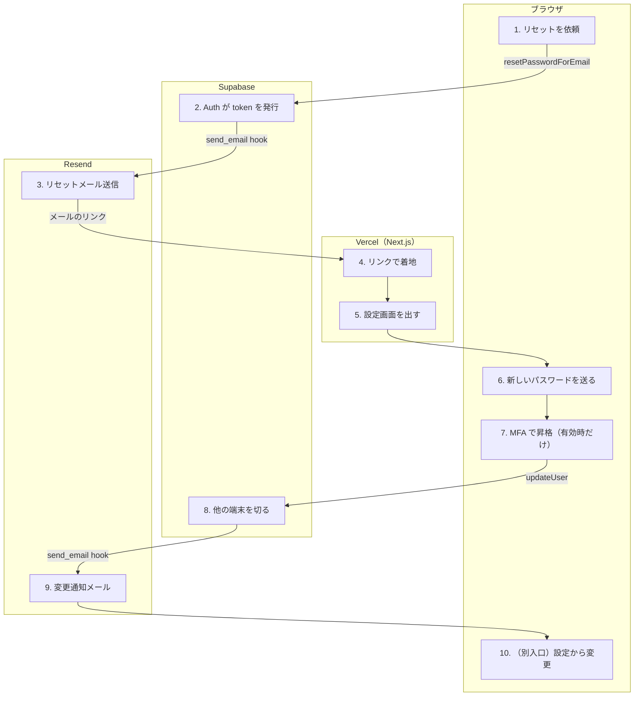

# パスワードを再設定する

<!-- learn:generated:start — 正本 このファイルの learn:journey の JSON / 再生成 pnpm learn:generate / 検証 pnpm docs:check。この範囲は手編集しない -->

サインインできない人が、メールのリンクから新しいパスワードを設定する。リンクを押した時点で一時的にサインインした状態になり、その session でパスワードを書き換える。変更が確定すると、Supabase Auth の変更通知が別のメールとして届く。サインイン中に設定画面から変える経路は最後の段で扱う。



通るサービス: ブラウザ / Vercel（Next.js） / Supabase / Resend。段 10・失敗 14 種。

#### この経路を守るテスト

- 経路全体を通しで守るテストは紐付いていない（段ごとのテストを見る）

### 1. メールアドレスを入れてリセットを依頼する（ブラウザ）

サインイン画面の「パスワードを忘れた？」から /auth/password へ進み、メールアドレスを送る。Turnstile の token を付けて、ブラウザから supabase.auth.resetPasswordForEmail を直接呼ぶ（tRPC は通らない）。戻り先には /auth/reset-password を渡す。captcha 失敗以外は、成功でも失敗でも同じ「メールを確認してください」画面を出す。

- **なぜ必要か**: 結果で画面を変えると「エラーが出た = 登録済み」と分かり、アカウントの有無を調べる道具になる（列挙防止）。captcha 失敗だけは本人が解き直せば直り、アカウントの有無とも無関係なので伝える。
- **入力 → 出力**: メールアドレス、Turnstile の token → Supabase Auth への /recover 依頼（redirectTo = /auth/reset-password）
- **ここを変えると**: 画面の出し分けを足すと列挙防止が崩れる。保証境界は docs/product/specs/auth.md のパスワードリセットの節。失敗の観測は画面ではなく store 側の Sentry が持つ。
- **コード**:
  - [`apps/product/src/features/auth/components/PasswordResetForm.tsx`](../../../apps/product/src/features/auth/components/PasswordResetForm.tsx) で `if (error?.code === 'captcha_failed') {` を探す
  - [`apps/product/src/features/auth/stores/useAuthStore.ts`](../../../apps/product/src/features/auth/stores/useAuthStore.ts) で `` redirectTo: `${window.location.origin}/auth/reset-password` `` を探す
  - [`docs/product/specs/auth.md`](../../product/specs/auth.md) で `## パスワードリセットのユーザー列挙防止` を探す
- **この段を守るテスト**:
  - [`apps/product/src/features/auth/components/PasswordResetForm.test.tsx`](../../../apps/product/src/features/auth/components/PasswordResetForm.test.tsx) で `再送間隔の 429 でも成功画面を出す（存在を漏らさない）` を探す
  - [`apps/product/src/features/auth/components/PasswordResetForm.test.tsx`](../../../apps/product/src/features/auth/components/PasswordResetForm.test.tsx) で `captcha 失敗なら token を捨てて widget を作り直し、理由を出す` を探す
  - [`apps/product/src/lib/test/e2e/auth.spec.ts`](../../../apps/product/src/lib/test/e2e/auth.spec.ts) で `パスワードリセットページがフォームと戻る導線を配信する` を探す

<details>
<summary>⚡ captcha の検証に失敗する — 画面: エラー表示 / データ: 変化なし / 再試行: 利用者がやり直す / 痕跡: Sentry</summary>

- 画面: フォームに理由が出る。Turnstile の widget を作り直す。
- データ: メールは送られない。
- 再試行: しない。token は 1 回限りなので、利用者が解き直して押し直す。
- 痕跡: token 側の既知の問題（期限切れ・重複・token 無し）なら Sentry に出ない。secret の設定ミスなど未知の理由なら Sentry に出る（captureUnexpectedAuthError）。
- **最初に見る場所**: Supabase の Bot Protection の secret と、NEXT_PUBLIC_TURNSTILE_SITE_KEY の組み合わせ。
- 根拠:
  - [`apps/product/src/features/auth/components/PasswordResetForm.tsx`](../../../apps/product/src/features/auth/components/PasswordResetForm.tsx) で `turnstile.reset();` を探す
  - [`apps/product/src/lib/sentry/integration.ts`](../../../apps/product/src/lib/sentry/integration.ts) で `EXPECTED_CAPTCHA_TOKEN_ISSUE_MESSAGES` を探す

</details>

<details>
<summary>⚡ 再送間隔の制限（429）に当たる — 画面: 何も起きない / データ: 変化なし / 再試行: 利用者がやり直す / 痕跡: 残らない</summary>

- 画面: 成功と同じ「メールを確認してください」画面が出る。
- データ: 新しいメールは送られない。
- 再試行: しない。利用者は届かないメールを待つことになる。少し待ってからやり直してもらう。
- 痕跡: rate limit の code は想定内として Sentry に出さない。
- **最初に見る場所**: Supabase の Auth ログ。画面は意図的に同じにしているので、画面からは区別できない。
- 根拠:
  - [`apps/product/src/features/auth/components/PasswordResetForm.tsx`](../../../apps/product/src/features/auth/components/PasswordResetForm.tsx) で `OWASP: 送信結果で画面を変えない。` を探す
  - [`apps/product/src/lib/sentry/integration.ts`](../../../apps/product/src/lib/sentry/integration.ts) で `'over_email_send_rate_limit',` を探す

</details>

### 2. Supabase Auth が recovery の token を発行する（Supabase）

登録済みのアドレスなら、Supabase Auth が 1 回限りの token_hash を作り、メールは自分で送らず send_email hook を呼ぶ。未登録のアドレスには何もせず 200 を返す。

- **なぜ必要か**: メールの見た目と送信経路を app 側で持つため、Auth 標準の SMTP ではなく hook を使う。サインアップの確認メールと同じ仕組み。
- **入力 → 出力**: メールアドレス、captcha token、redirect_to → send_email hook の呼び出し（email_action_type = recovery、token_hash、redirect_to）
- **ここを変えると**: リンクの有効時間（mailer_otp_exp）や再送間隔は repo ではなく Supabase の Auth 設定が正本。production の値は Auth config audit が監視している（mailer_otp_exp は 3600 秒で固定）。
- **コード**:
  - [`scripts/ci/production-auth-config-audit.mjs`](../../../scripts/ci/production-auth-config-audit.mjs) で `key: 'mailer_otp_exp',` を探す
  - [`supabase/config.toml`](../../../supabase/config.toml) で `otp_expiry = 300` を探す（ローカルの値。production とは別）

### 3. リセット用メールを組み立てて Resend で送る（Resend）

Edge Function send-auth-email が hook の署名を検証し、PasswordResetEmail を render して Resend で送る。リンクは /auth/confirm?token_hash=…&type=recovery で、redirect_to の origin は allowlist で確かめてから使う。webhook-id から idempotency key を作り、Auth が hook を呼び直しても 2 通目を出さない。

- **なぜ必要か**: token_hash を検証できるのは app の /auth/confirm だけなので、リンクは必ずそこを通す。origin を二重に確かめるのは、Supabase 側の Redirect URLs 設定がずれただけで token が第三者の origin へ載るのを防ぐため。
- **入力 → 出力**: hook payload（user、email_data） → 件名「Dayopt パスワードのリセット」のメール
- **ここを変えると**: この Function は Vercel ではなく Supabase にデプロイする（supabase functions deploy --use-api）。アプリの deploy では変わらない。メール本文の「24 時間」とリンクの実際の有効時間はここでは揃えていない（下の注意を参照）。
- **コード**:
  - [`supabase/functions/send-auth-email/index.ts`](../../../supabase/functions/send-auth-email/index.ts) で `element: React.createElement(PasswordResetEmail, {` を探す
  - [`supabase/functions/send-auth-email/confirm-url.ts`](../../../supabase/functions/send-auth-email/confirm-url.ts) で `export function resolveConfirmOrigin` を探す
  - [`supabase/functions/send-auth-email/subjects.ts`](../../../supabase/functions/send-auth-email/subjects.ts) で `recovery: 'Dayopt パスワードのリセット',` を探す
  - [`supabase/functions/send-auth-email/PasswordResetEmail.tsx`](../../../supabase/functions/send-auth-email/PasswordResetEmail.tsx) で `expiryNote: 'このリンクは24時間で有効期限が切れます。',` を探す（production のリンクは mailer_otp_exp = 3600 秒。文面と食い違う）
- **この段を守るテスト**:
  - [`scripts/__tests__/send-auth-email-confirm-url.test.ts`](../../../scripts/__tests__/send-auth-email-confirm-url.test.ts) で `攻撃者 origin の redirect_to でも token_hash は app origin にしか載らない` を探す
  - [`scripts/__tests__/send-auth-email-idempotency.test.ts`](../../../scripts/__tests__/send-auth-email-idempotency.test.ts) で `同じ webhook-id の再試行では同じ key になる（重複配送しない）` を探す

<details>
<summary>⚡ Resend がリセットメールを送れない — 画面: 何も起きない / データ: 欠落する / 再試行: 条件次第 / 痕跡: Sentry</summary>

- 画面: 何も変わらない。Auth は依頼にエラーを返すが、フォームは captcha 以外の失敗でも成功画面を出す（列挙防止）。
- データ: メールは届かない。
- 再試行: Function は再試行してよいかを status で Auth に伝え、Auth が hook を呼び直すことがある。それでも届かなければ利用者がやり直す。
- 痕跡: Edge Function から Sentry へ（send-auth-email failed: …）。画面側も useAuthStore の captureUnexpectedAuthError が拾う。宛先は記録しない。
- **最初に見る場所**: Resend のダッシュボード → Supabase の Edge Function ログ。
- 根拠:
  - [`supabase/functions/send-auth-email/index.ts`](../../../supabase/functions/send-auth-email/index.ts) で `resolveSendAuthEmailStatus` を探す
  - [`apps/product/src/features/auth/stores/useAuthStore.ts`](../../../apps/product/src/features/auth/stores/useAuthStore.ts) で `captureUnexpectedAuthError(result.error, { operation: 'reset_password' });` を探す

</details>

### 4. /auth/confirm で token を検証して session を作る（Vercel（Next.js））

verifyOtp で token_hash を検証する。access_token 付きの session が立てば、type が recovery の時だけ next を無視して /auth/reset-password へ固定で送る。session が立たなければ /auth/confirmed の結果ページへ送る。

- **なぜ必要か**: 以前、Supabase 側の Redirect URLs に /auth/reset-password が無く next が付かないまま /calendar へ落ちた（#1928）。recovery の行き先は 1 つしかないので固定にし、設定がずれても壊れない形にした。
- **入力 → 出力**: token_hash、type=recovery、next → recovery session の cookie と、/auth/reset-password への redirect
- **ここを変えると**: signup・email_change も同じ route を通る。分岐を変える時は type ごとの着地先をテストで確かめる。/auth/confirm と /auth/reset-password はサインイン中でも通れる path に登録してある（access-policy.ts）。
- **コード**:
  - [`apps/product/src/app/[locale]/(auth)/auth/confirm/route.ts`](<../../../apps/product/src/app/[locale]/(auth)/auth/confirm/route.ts>) で `const target = type === 'recovery' ? '/auth/reset-password' : next;` を探す
  - [`apps/product/src/lib/auth/domain/access-policy.ts`](../../../apps/product/src/lib/auth/domain/access-policy.ts) で `'/auth/reset-password',` を探す
- **この段を守るテスト**:
  - [`apps/product/src/app/[locale]/(auth)/auth/confirm/route.test.ts`](<../../../apps/product/src/app/[locale]/(auth)/auth/confirm/route.test.ts>) で `recovery は session が立てば next を無視して /auth/reset-password へ送る` を探す
  - [`apps/product/src/app/[locale]/(auth)/auth/confirm/route.test.ts`](<../../../apps/product/src/app/[locale]/(auth)/auth/confirm/route.test.ts>) で `検証に失敗したら failed を付けて結果ページへ送る` を探す

<details>
<summary>⚡ リンクの期限切れ・使用済み — 画面: 別の画面へ / データ: 変化なし / 再試行: 利用者がやり直す / 痕跡: 残らない</summary>

- 画面: /auth/confirmed?status=failed に着地し、やり直しを案内する。
- データ: 変化なし。
- 再試行: しない。利用者がリセットを依頼し直す。
- 痕跡: 想定内（otp_expired などは Sentry に出さない）。
- **最初に見る場所**: Supabase の Auth ログ。メールのリンクを 2 回押していないか、1 時間を過ぎていないか。
- 根拠:
  - [`apps/product/src/app/[locale]/(auth)/auth/confirm/route.ts`](<../../../apps/product/src/app/[locale]/(auth)/auth/confirm/route.ts>) で `return NextResponse.redirect(confirmedUrl('failed', request));` を探す

</details>

<details>
<summary>⚡ 検証は通ったが session が立たない — 画面: 別の画面へ / データ: 変化なし / 再試行: 利用者がやり直す / 痕跡: 残らない</summary>

- 画面: /auth/confirmed?status=email_confirmed に着地し、「メールアドレスを確認しました」と出る。recovery 専用の文言は無い。
- データ: パスワードは変わっていない。token は使われた。
- 再試行: しない。利用者がもう一度リセットを依頼する。
- 痕跡: 何も残らない。
- **最初に見る場所**: リンクをどのブラウザで開いたか。statusForType は email_change 以外をすべて email_confirmed に畳む。
- 根拠:
  - [`apps/product/src/app/[locale]/(auth)/auth/confirm/route.ts`](<../../../apps/product/src/app/[locale]/(auth)/auth/confirm/route.ts>) で `return type === 'email_change' ? 'email_change_confirmed' : 'email_confirmed';` を探す

</details>

### 5. /auth/reset-password で session を確かめる（Vercel（Next.js））

server component が getUser で session を確かめ、無ければ /auth（→ /auth/login）へ送る。あれば新しいパスワードの入力フォームを出す。

- **なぜ必要か**: このフォームは「今の session の本人のパスワードを書き換える」だけなので、session 無しで開いても何もできない。先にサーバー側で弾き、押しても失敗するだけのフォームを見せない。
- **入力 → 出力**: recovery session の cookie → ResetPasswordForm の画面
- **ここを変えると**: ここに来るのは recovery session とは限らない。通常のサインイン中に直接開いた場合も通り、その時は更新が GoTrue に拒否される（次の段）。
- **コード**:
  - [`apps/product/src/app/[locale]/(auth)/auth/reset-password/page.tsx`](<../../../apps/product/src/app/[locale]/(auth)/auth/reset-password/page.tsx>) で ``redirect(`/${locale}/auth`);`` を探す
  - [`apps/product/src/app/[locale]/(auth)/auth/page.tsx`](<../../../apps/product/src/app/[locale]/(auth)/auth/page.tsx>) で ``redirect(`/${locale}/auth/login`);`` を探す

<details>
<summary>⚡ session が無い（直接開いた・cookie が消えた） — 画面: 別の画面へ / データ: 変化なし / 再試行: 利用者がやり直す / 痕跡: 残らない</summary>

- 画面: サインイン画面へ移る。
- データ: 変化なし。
- 再試行: しない。リセットを依頼し直す。
- 痕跡: 何も残らない（想定内）。
- **最初に見る場所**: リンクを別のブラウザで開いていないか。
- 根拠:
  - [`apps/product/src/app/[locale]/(auth)/auth/reset-password/page.tsx`](<../../../apps/product/src/app/[locale]/(auth)/auth/reset-password/page.tsx>) で `if (!user) {` を探す

</details>

### 6. 新しいパスワードを検査して送る（ブラウザ）

2 つの入力が一致するか、signup と同じ規則（8〜64 文字）かを画面で確かめ、useAuthStore.updatePassword から supabase.auth.updateUser({ password }) を呼ぶ。現在のパスワードは送らない（recovery session なので要らない）。

- **なぜ必要か**: 漏洩パスワードの拒否はここではなく Supabase Auth 側の設定（password_hibp_enabled）に任せている。サインアップと設定画面は画面側でも Have I Been Pwned を引くが、この経路は引かない。
- **入力 → 出力**: 新しいパスワード（2 回） → updateUser の結果（成功 / insufficient_aal / その他の error code）
- **ここを変えると**: エラー code の読み分けは ResetPasswordForm の RECOVERY_UPDATE_BLOCKED_CODES と isMfaBlocked。message の文字列で判定しない方針。
- **コード**:
  - [`apps/product/src/features/auth/components/ResetPasswordForm.tsx`](../../../apps/product/src/features/auth/components/ResetPasswordForm.tsx) で `const parsed = passwordSchema.safeParse(password);` を探す
  - [`apps/product/src/features/auth/stores/useAuthStore.ts`](../../../apps/product/src/features/auth/stores/useAuthStore.ts) で `const result = await supabase.auth.updateUser({ password });` を探す
  - [`scripts/ci/production-auth-config-audit.mjs`](../../../scripts/ci/production-auth-config-audit.mjs) で `key: 'password_hibp_enabled',` を探す
- **この段を守るテスト**:
  - [`apps/product/src/features/auth/components/ResetPasswordForm.test.tsx`](../../../apps/product/src/features/auth/components/ResetPasswordForm.test.tsx) で `通常の recovery session からの更新は成功画面へ遷移する` を探す
  - [`apps/product/src/features/auth/components/ResetPasswordForm.test.tsx`](../../../apps/product/src/features/auth/components/ResetPasswordForm.test.tsx) で `未知の code は従来どおり汎用エラー判定にフォールバックする` を探す

<details>
<summary>⚡ recovery ではない session で開いている — 画面: エラー表示 / データ: 変化なし / 再試行: 利用者がやり直す / 痕跡: Sentry</summary>

- 画面: 「もう一度パスワードリセットのメールをリクエストしてください」と出る。
- データ: パスワードは変わらない。
- 再試行: しない。リセットを依頼し直す。
- 痕跡: store の captureUnexpectedAuthError（code によっては想定内として出ない）。
- **最初に見る場所**: 通常のサインイン中に /auth/reset-password を直接開いていないか。GoTrue は current_password を要求している。
- 根拠:
  - [`apps/product/src/features/auth/components/ResetPasswordForm.tsx`](../../../apps/product/src/features/auth/components/ResetPasswordForm.tsx) で `const RECOVERY_UPDATE_BLOCKED_CODES = new Set([` を探す

</details>

<details>
<summary>⚡ Supabase Auth が弱い・漏洩済みのパスワードとして拒否する — 画面: エラー表示 / データ: 変化なし / 再試行: 利用者がやり直す / 痕跡: 残らない</summary>

- 画面: message に weak / short を含むエラーは「パスワードは8文字以上にしてください」に変換される。8 文字以上でも漏洩済みで拒否された時に同じ文言になるかは未確認（GoTrue の message 次第）。
- データ: パスワードは変わらない。
- 再試行: しない。利用者が別のパスワードで押し直す。
- 痕跡: weak_password は想定内として Sentry に出さない。
- **最初に見る場所**: Supabase の Auth ログで拒否理由を見る。
- 根拠:
  - [`apps/product/src/lib/auth-error.ts`](../../../apps/product/src/lib/auth-error.ts) で `if (normalizedMessage.includes('weak') || normalizedMessage.includes('short')) {` を探す

</details>

### 7. MFA が有効なら、認証コードかリカバリーコードで通す（ブラウザ）

MFA が有効なアカウントでは、recovery session は aal1 止まりなので GoTrue が insufficient_aal で更新を拒否する。その時だけ MFAVerifyForm を出し、認証アプリのコードで aal2 へ上げるか、リカバリーコードで MFA 自体を外してから、入力済みのパスワードで updatePassword をやり直す。

- **なぜ必要か**: メールだけで MFA を越えられると、メールを奪われた時に MFA の意味が無くなる。一方で MFA 端末を失った人が詰まないよう、リカバリーコードの道を残した（#2013）。
- **入力 → 出力**: 6 桁の認証コード、またはリカバリーコード → aal2 の session（または MFA 解除済み）と、updatePassword の再実行
- **ここを変えると**: リカバリーコードで通すと MFA は無効になる（recovery-service.ts の既存の副作用）。成功画面に警告を出すのはそのため。MFA 画面の部品は dynamic import で、MFA の無い大多数の訪問者には読み込まない。
- **コード**:
  - [`apps/product/src/features/auth/components/ResetPasswordForm.tsx`](../../../apps/product/src/features/auth/components/ResetPasswordForm.tsx) で `return errorCode(error) === 'insufficient_aal';` を探す
  - [`apps/product/src/features/auth/components/ResetPasswordForm.tsx`](../../../apps/product/src/features/auth/components/ResetPasswordForm.tsx) で `await vanillaTrpc.user.verifyRecoveryCode.mutate({ code: trimmed });` を探す
  - [`apps/product/src/features/auth/components/MFAVerifyForm.tsx`](../../../apps/product/src/features/auth/components/MFAVerifyForm.tsx) で `t('auth.mfaVerify.recoveryCodeDescriptionPasswordReset')` を探す
- **この段を守るテスト**:
  - [`apps/product/src/features/auth/components/ResetPasswordForm.test.tsx`](../../../apps/product/src/features/auth/components/ResetPasswordForm.test.tsx) で `insufficient_aal では汎用エラーではなくMFA step-up画面へ遷移する` を探す
  - [`apps/product/src/features/auth/components/ResetPasswordForm.test.tsx`](../../../apps/product/src/features/auth/components/ResetPasswordForm.test.tsx) で `TOTP検証成功後にupdatePasswordが失敗したら、password入力画面へ戻り再送信で完了できる` を探す
  - [`apps/product/src/features/auth/components/ResetPasswordForm.test.tsx`](../../../apps/product/src/features/auth/components/ResetPasswordForm.test.tsx) で `リカバリーコード検証成功後、MFA無効化の警告つき成功画面へ遷移する` を探す

<details>
<summary>⚡ 昇格は通ったのに、直後の更新が失敗する — 画面: エラー表示 / データ: 変化なし / 再試行: 利用者がやり直す / 痕跡: Sentry</summary>

- 画面: MFA 画面に留めず、パスワード入力画面へ戻してエラーを出す。
- データ: パスワードは変わらない。session はすでに昇格済み（または MFA 解除済み）。
- 再試行: 利用者が押し直す。2 回目は MFA を経ずに updatePassword だけで通る。
- 痕跡: store の captureUnexpectedAuthError。
- **最初に見る場所**: Supabase の Auth ログ。
- 根拠:
  - [`apps/product/src/features/auth/components/ResetPasswordForm.tsx`](../../../apps/product/src/features/auth/components/ResetPasswordForm.tsx) で `const finishAfterStepUp = useCallback(async () => {` を探す

</details>

<details>
<summary>⚡ リカバリーコードを使い切っている — 画面: エラー表示 / データ: 変化なし / 再試行: しない / 痕跡: 残らない</summary>

- 画面: 「すべてのリカバリーコードが使用済みです」と出る。
- データ: 変化なし。
- 再試行: しない。認証アプリのコードで通すしかない。
- 痕跡: 想定内として送らない。
- **最初に見る場所**: 本人の端末が戻らないなら、手作業での復旧になる（手順は未確認）。
- 根拠:
  - [`apps/product/src/features/auth/components/ResetPasswordForm.tsx`](../../../apps/product/src/features/auth/components/ResetPasswordForm.tsx) で `setMfaError(t('auth.mfaVerify.recoveryExhausted'));` を探す

</details>

### 8. 更新が確定したら、他の端末の session を切る（Supabase）

updateUser が成功したら signOut({ scope: 'others' }) で、この端末以外の session を失効させる。失敗しても 1 回だけ再試行し、更新の成功は失敗に変えない。成功画面を出し、3 秒後に /auth/login へ移る。

- **なぜ必要か**: アカウントを乗っ取られた人が最初にやるのがパスワードの再設定。その操作で攻撃者の refresh token も道連れにする。
- **入力 → 出力**: updateUser の成功 → 他端末の session の失効と、成功画面
- **ここを変えると**: 今の端末の session は残る。そのため 3 秒後の /auth/login への移動は、proxy が「サインイン済みで auth 系 path へ来た」と見て /calendar へ送り直すはず（コードから読んだ挙動。ブラウザでは未確認）。文言は「まもなくサインインページに移動します」。
- **コード**:
  - [`apps/product/src/features/auth/stores/useAuthStore.ts`](../../../apps/product/src/features/auth/stores/useAuthStore.ts) で `() => supabase.auth.signOut({ scope: 'others' }),` を探す
  - [`apps/product/src/features/auth/components/ResetPasswordForm.tsx`](../../../apps/product/src/features/auth/components/ResetPasswordForm.tsx) で ``router.push(`/${locale}/auth/login`);`` を探す
  - [`apps/product/src/proxy.ts`](../../../apps/product/src/proxy.ts) で `if (user && isAuthPath && !isAllowedWhileAuthenticated) {` を探す
- **この段を守るテスト**:
  - [`apps/product/src/features/auth/stores/useAuthStore.updatePassword.test.ts`](../../../apps/product/src/features/auth/stores/useAuthStore.updatePassword.test.ts) で `更新成功時は他端末の session を signOut する` を探す
  - [`apps/product/src/features/auth/stores/useAuthStore.updatePassword.test.ts`](../../../apps/product/src/features/auth/stores/useAuthStore.updatePassword.test.ts) で `再試行後も失敗する場合は 2 回で諦め、更新成功の結果は失敗に変わらない` を探す

<details>
<summary>⚡ 他端末のサインアウトが 2 回とも失敗する — 画面: 何も起きない / データ: 保存される / 再試行: しない / 痕跡: Sentry</summary>

- 画面: 何も起きない。成功画面が出る（store は文言を持てないので警告を出さない）。
- データ: パスワードは新しくなる。他の端末の session は残る。
- 再試行: 2 回で諦める。
- 痕跡: Sentry（observeAuthOperation の sign_out_other_sessions）。
- **最初に見る場所**: Sentry で sign_out_other_sessions を探す。設定画面からの変更と違い、利用者には知らせていない。
- 根拠:
  - [`apps/product/src/features/auth/stores/useAuthStore.ts`](../../../apps/product/src/features/auth/stores/useAuthStore.ts) で `for (let attempt = 0; attempt < 2 && !signOutSucceeded; attempt++) {` を探す

</details>

### 9. Supabase Auth の変更通知を send-auth-email が配送する（Resend）

パスワードが変わると Supabase Auth が password_changed_notification を send_email hook で送ってくる。send-auth-email が email_suppressions を確かめ、止めていなければ PasswordChangedEmail を送る。アプリの側には通知を送る処理が無い。

- **なぜ必要か**: 通知の根拠を Auth のイベントだけにし、クライアントから任意に呼べる送信 endpoint を置かない。置くと他人のアドレスへ通知を繰り返し送る道具になる。
- **入力 → 出力**: hook payload（email_action_type = password_changed_notification） → 件名「Dayopt パスワードが変更されました」のメール
- **ここを変えると**: production で通知が有効かどうか（mailer_notifications_password_changed_enabled）は Auth config audit が監視する。リセットでも設定画面からの変更でも同じ通知が出る。
- **コード**:
  - [`supabase/functions/send-auth-email/password-changed-notification.ts`](../../../supabase/functions/send-auth-email/password-changed-notification.ts) で `export async function resolvePasswordChangedNotificationEmails({` を探す
  - [`supabase/config.toml`](../../../supabase/config.toml) で `[auth.email.notification.password_changed]` を探す
  - [`docs/engineering/invariants.md`](../../engineering/invariants.md) で `**パスワード変更通知は Auth event だけを根拠に送る。**` を探す
- **この段を守るテスト**:
  - [`scripts/__tests__/send-auth-email-password-changed.test.ts`](../../../scripts/__tests__/send-auth-email-password-changed.test.ts) で `suppression 済みなら Resend へ渡すメールを作らない` を探す
  - [`scripts/__tests__/send-auth-email-password-changed.test.ts`](../../../scripts/__tests__/send-auth-email-password-changed.test.ts) で `suppression を判定できなければ fail-closed でメールを作らない` を探す

<details>
<summary>⚡ 宛先が suppression 済み・判定できない — 画面: 何も起きない / データ: 変化なし / 再試行: しない / 痕跡: Sentry</summary>

- 画面: 利用者の画面には影響しない。
- データ: 通知は送らない。パスワードの変更は済んでいる。
- 再試行: しない。Auth には 200 を返す。
- 痕跡: Sentry に warning（Password changed notification skipped）。宛先は載せない。
- **最初に見る場所**: Sentry の send-auth-email → email_suppressions の該当行。
- 根拠:
  - [`supabase/functions/send-auth-email/index.ts`](../../../supabase/functions/send-auth-email/index.ts) で `message: 'Password changed notification skipped',` を探す

</details>

### 10. （別の入口）サインイン中に設定画面から変える（ブラウザ）

設定のアカウントで PasswordChangeDialog を開き、現在のパスワードと新しいパスワードを入れる。画面で Have I Been Pwned を引き（失敗しても通す fail-open）、updateUser({ password, current_password }) を呼ぶ。現在のパスワードが合っているかは GoTrue が確かめる。成功したら同じく他端末を切り、変更通知は前の段と同じ経路で届く。

- **なぜ必要か**: 設定画面から signInWithPassword で事前確認すると、Bot Protection の captcha を要求されて必ず失敗する（#1917）。確認をサーバー側（security_update_password_require_current_password）に任せたのはそのため。メール変更とアカウント削除の再認証は別の仕組み（password-reauthentication.ts）を使う。
- **入力 → 出力**: 現在のパスワード、新しいパスワード（2 回） → updateUser の結果と、他端末の失効
- **ここを変えると**: production の require_current_password が off になると、current_password は黙って無視され、現在のパスワードを知らなくても変えられる。Auth config audit がこの値を固定している。他端末のサインアウトに失敗した時は、こちらは画面に警告を出す（リセット経路とは違う）。
- **コード**:
  - [`apps/product/src/features/settings/components/PasswordChangeDialog.tsx`](../../../apps/product/src/features/settings/components/PasswordChangeDialog.tsx) で `current_password: currentPassword,` を探す
  - [`apps/product/src/features/settings/components/PasswordChangeDialog.tsx`](../../../apps/product/src/features/settings/components/PasswordChangeDialog.tsx) で `const isPwned = await checkPasswordPwned(newPassword);` を探す
  - [`scripts/ci/production-auth-config-audit.mjs`](../../../scripts/ci/production-auth-config-audit.mjs) で `key: 'security_update_password_require_current_password',` を探す
- **この段を守るテスト**:
  - [`apps/product/src/features/settings/components/PasswordChangeDialog.test.tsx`](../../../apps/product/src/features/settings/components/PasswordChangeDialog.test.tsx) で `passes current_password to the server and never calls signInWithPassword` を探す
  - [`apps/product/src/features/settings/components/PasswordChangeDialog.test.tsx`](../../../apps/product/src/features/settings/components/PasswordChangeDialog.test.tsx) で `does not mistake a captcha failure for a wrong current password` を探す
  - [`apps/product/src/lib/auth/pwned-password.test.ts`](../../../apps/product/src/lib/auth/pwned-password.test.ts) で `should time out and fail safe when the request never settles` を探す

<details>
<summary>⚡ 現在のパスワードが違う — 画面: エラー表示 / データ: 変化なし / 再試行: 利用者がやり直す / 痕跡: 残らない</summary>

- 画面: ダイアログに「現在のパスワードが正しくありません」と出る。
- データ: 変化なし。
- 再試行: しない。利用者が入れ直す。
- 痕跡: invalid_credentials は想定内として Sentry に出さない。
- **最初に見る場所**: 不要（仕様どおり）。
- 根拠:
  - [`apps/product/src/features/settings/components/PasswordChangeDialog.tsx`](../../../apps/product/src/features/settings/components/PasswordChangeDialog.tsx) で `throw new Error(t('settings.account.passwordIncorrect'));` を探す

</details>

<details>
<summary>⚡ 漏洩パスワード確認が応答しない — 画面: 何も起きない / データ: 保存される / 再試行: 不要 / 痕跡: ログだけ</summary>

- 画面: 何も起きない。3 秒で諦めて変更は続く。
- データ: 変更される（Supabase Auth 側の漏洩確認は別に効く）。
- 再試行: しない（fail-open）。
- 痕跡: logger.error だけ。
- **最初に見る場所**: 急ぎではない。
- 根拠:
  - [`apps/product/src/lib/auth/pwned-password.ts`](../../../apps/product/src/lib/auth/pwned-password.ts) で `export const PWNED_PASSWORD_TIMEOUT_MS = 3_000;` を探す

</details>

<!-- learn:generated:end -->

## データ（正本）

この JSON がこのページの正本。上の説明と図、`pnpm learn` の対話画面はここから生成する。参照（`path` + `find`）は `pnpm docs:check` が実在を検査する。

```json learn:journey
{
  "id": "password-reset",
  "title": "パスワードを再設定する",
  "order": 80,
  "group": "account",
  "intro": "サインインできない人が、メールのリンクから新しいパスワードを設定する。リンクを押した時点で一時的にサインインした状態になり、その session でパスワードを書き換える。変更が確定すると、Supabase Auth の変更通知が別のメールとして届く。サインイン中に設定画面から変える経路は最後の段で扱う。",
  "play": "▶ リセット用リンクを送る",
  "hops": [
    {
      "id": "forgot-form",
      "svc": "browser",
      "short": "リセットを依頼",
      "title": "メールアドレスを入れてリセットを依頼する",
      "what": "サインイン画面の「パスワードを忘れた？」から /auth/password へ進み、メールアドレスを送る。Turnstile の token を付けて、ブラウザから supabase.auth.resetPasswordForEmail を直接呼ぶ（tRPC は通らない）。戻り先には /auth/reset-password を渡す。captcha 失敗以外は、成功でも失敗でも同じ「メールを確認してください」画面を出す。",
      "why": "結果で画面を変えると「エラーが出た = 登録済み」と分かり、アカウントの有無を調べる道具になる（列挙防止）。captcha 失敗だけは本人が解き直せば直り、アカウントの有無とも無関係なので伝える。",
      "io": {
        "in": "メールアドレス、Turnstile の token",
        "out": "Supabase Auth への /recover 依頼（redirectTo = /auth/reset-password）"
      },
      "change": "画面の出し分けを足すと列挙防止が崩れる。保証境界は docs/product/specs/auth.md のパスワードリセットの節。失敗の観測は画面ではなく store 側の Sentry が持つ。",
      "refs": [
        {
          "path": "apps/product/src/features/auth/components/PasswordResetForm.tsx",
          "find": "if (error?.code === 'captcha_failed') {"
        },
        {
          "path": "apps/product/src/features/auth/stores/useAuthStore.ts",
          "find": "redirectTo: `${window.location.origin}/auth/reset-password`"
        },
        {
          "path": "docs/product/specs/auth.md",
          "find": "## パスワードリセットのユーザー列挙防止"
        }
      ],
      "tests": [
        {
          "path": "apps/product/src/features/auth/components/PasswordResetForm.test.tsx",
          "find": "再送間隔の 429 でも成功画面を出す（存在を漏らさない）"
        },
        {
          "path": "apps/product/src/features/auth/components/PasswordResetForm.test.tsx",
          "find": "captcha 失敗なら token を捨てて widget を作り直し、理由を出す"
        },
        {
          "path": "apps/product/src/lib/test/e2e/auth.spec.ts",
          "find": "パスワードリセットページがフォームと戻る導線を配信する"
        }
      ],
      "fails": [
        {
          "id": "captcha-failed",
          "label": "captcha の検証に失敗する",
          "screen": "フォームに理由が出る。Turnstile の widget を作り直す。",
          "data": "メールは送られない。",
          "retry": "しない。token は 1 回限りなので、利用者が解き直して押し直す。",
          "trace": "token 側の既知の問題（期限切れ・重複・token 無し）なら Sentry に出ない。secret の設定ミスなど未知の理由なら Sentry に出る（captureUnexpectedAuthError）。",
          "look": "Supabase の Bot Protection の secret と、NEXT_PUBLIC_TURNSTILE_SITE_KEY の組み合わせ。",
          "refs": [
            {
              "path": "apps/product/src/features/auth/components/PasswordResetForm.tsx",
              "find": "turnstile.reset();"
            },
            {
              "path": "apps/product/src/lib/sentry/integration.ts",
              "find": "EXPECTED_CAPTCHA_TOKEN_ISSUE_MESSAGES"
            }
          ],
          "tags": {
            "screen": "toast",
            "data": "unchanged",
            "retry": "user",
            "trace": "sentry"
          },
          "screenAfter": {
            "t": "form",
            "title": "パスワードをリセット",
            "url": "/ja/auth/password",
            "fields": [["メールアドレス", "m@example.com"]],
            "extra": "Cloudflare Turnstile（作り直し）",
            "button": "リセット用リンクを送信",
            "error": "確認に失敗しました。解決しない場合はサポート（support@dayopt.app）までご連絡ください"
          }
        },
        {
          "id": "resend-interval",
          "label": "再送間隔の制限（429）に当たる",
          "screen": "成功と同じ「メールを確認してください」画面が出る。",
          "data": "新しいメールは送られない。",
          "retry": "しない。利用者は届かないメールを待つことになる。少し待ってからやり直してもらう。",
          "trace": "rate limit の code は想定内として Sentry に出さない。",
          "look": "Supabase の Auth ログ。画面は意図的に同じにしているので、画面からは区別できない。",
          "refs": [
            {
              "path": "apps/product/src/features/auth/components/PasswordResetForm.tsx",
              "find": "OWASP: 送信結果で画面を変えない。"
            },
            {
              "path": "apps/product/src/lib/sentry/integration.ts",
              "find": "'over_email_send_rate_limit',"
            }
          ],
          "tags": {
            "screen": "none",
            "data": "unchanged",
            "retry": "user",
            "trace": "none"
          },
          "screenAfter": {
            "t": "page",
            "url": "/ja/auth/password",
            "tone": "neutral",
            "title": "メールを確認してください",
            "body": "パスワードリセット用のリンクを送信しました： m@example.com",
            "button": "サインインに戻る",
            "note": "画面は成功と同じ。メールは届かない"
          }
        }
      ],
      "screen": {
        "t": "form",
        "title": "パスワードをリセット",
        "url": "/ja/auth/password",
        "fields": [["メールアドレス", "m@example.com"]],
        "extra": "Cloudflare Turnstile ✓",
        "button": "リセット用リンクを送信",
        "alt": "Google で登録した場合は、Google でのサインインをお使いください。"
      }
    },
    {
      "id": "auth-recover",
      "svc": "supabase",
      "short": "Auth が token を発行",
      "via": "resetPasswordForEmail",
      "title": "Supabase Auth が recovery の token を発行する",
      "what": "登録済みのアドレスなら、Supabase Auth が 1 回限りの token_hash を作り、メールは自分で送らず send_email hook を呼ぶ。未登録のアドレスには何もせず 200 を返す。",
      "why": "メールの見た目と送信経路を app 側で持つため、Auth 標準の SMTP ではなく hook を使う。サインアップの確認メールと同じ仕組み。",
      "io": {
        "in": "メールアドレス、captcha token、redirect_to",
        "out": "send_email hook の呼び出し（email_action_type = recovery、token_hash、redirect_to）"
      },
      "change": "リンクの有効時間（mailer_otp_exp）や再送間隔は repo ではなく Supabase の Auth 設定が正本。production の値は Auth config audit が監視している（mailer_otp_exp は 3600 秒で固定）。",
      "refs": [
        {
          "path": "scripts/ci/production-auth-config-audit.mjs",
          "find": "key: 'mailer_otp_exp',"
        },
        {
          "path": "supabase/config.toml",
          "find": "otp_expiry = 300",
          "why": "ローカルの値。production とは別"
        }
      ],
      "fails": [],
      "screen": {
        "t": "page",
        "url": "/ja/auth/password",
        "tone": "neutral",
        "title": "メールを確認してください",
        "body": "パスワードリセット用のリンクを送信しました： m@example.com",
        "button": "サインインに戻る"
      }
    },
    {
      "id": "recovery-email",
      "svc": "resend",
      "short": "リセットメール送信",
      "via": "send_email hook",
      "title": "リセット用メールを組み立てて Resend で送る",
      "what": "Edge Function send-auth-email が hook の署名を検証し、PasswordResetEmail を render して Resend で送る。リンクは /auth/confirm?token_hash=…&type=recovery で、redirect_to の origin は allowlist で確かめてから使う。webhook-id から idempotency key を作り、Auth が hook を呼び直しても 2 通目を出さない。",
      "why": "token_hash を検証できるのは app の /auth/confirm だけなので、リンクは必ずそこを通す。origin を二重に確かめるのは、Supabase 側の Redirect URLs 設定がずれただけで token が第三者の origin へ載るのを防ぐため。",
      "io": {
        "in": "hook payload（user、email_data）",
        "out": "件名「Dayopt パスワードのリセット」のメール"
      },
      "change": "この Function は Vercel ではなく Supabase にデプロイする（supabase functions deploy --use-api）。アプリの deploy では変わらない。メール本文の「24 時間」とリンクの実際の有効時間はここでは揃えていない（下の注意を参照）。",
      "refs": [
        {
          "path": "supabase/functions/send-auth-email/index.ts",
          "find": "element: React.createElement(PasswordResetEmail, {"
        },
        {
          "path": "supabase/functions/send-auth-email/confirm-url.ts",
          "find": "export function resolveConfirmOrigin"
        },
        {
          "path": "supabase/functions/send-auth-email/subjects.ts",
          "find": "recovery: 'Dayopt パスワードのリセット',"
        },
        {
          "path": "supabase/functions/send-auth-email/PasswordResetEmail.tsx",
          "find": "expiryNote: 'このリンクは24時間で有効期限が切れます。',",
          "why": "production のリンクは mailer_otp_exp = 3600 秒。文面と食い違う"
        }
      ],
      "tests": [
        {
          "path": "scripts/__tests__/send-auth-email-confirm-url.test.ts",
          "find": "攻撃者 origin の redirect_to でも token_hash は app origin にしか載らない"
        },
        {
          "path": "scripts/__tests__/send-auth-email-idempotency.test.ts",
          "find": "同じ webhook-id の再試行では同じ key になる（重複配送しない）"
        }
      ],
      "fails": [
        {
          "id": "recovery-send-fail",
          "label": "Resend がリセットメールを送れない",
          "screen": "何も変わらない。Auth は依頼にエラーを返すが、フォームは captcha 以外の失敗でも成功画面を出す（列挙防止）。",
          "data": "メールは届かない。",
          "retry": "Function は再試行してよいかを status で Auth に伝え、Auth が hook を呼び直すことがある。それでも届かなければ利用者がやり直す。",
          "trace": "Edge Function から Sentry へ（send-auth-email failed: …）。画面側も useAuthStore の captureUnexpectedAuthError が拾う。宛先は記録しない。",
          "look": "Resend のダッシュボード → Supabase の Edge Function ログ。",
          "refs": [
            {
              "path": "supabase/functions/send-auth-email/index.ts",
              "find": "resolveSendAuthEmailStatus"
            },
            {
              "path": "apps/product/src/features/auth/stores/useAuthStore.ts",
              "find": "captureUnexpectedAuthError(result.error, { operation: 'reset_password' });"
            }
          ],
          "tags": {
            "screen": "none",
            "data": "lost",
            "retry": "depends",
            "trace": "sentry"
          },
          "to": "forgot-form",
          "back": "成功と同じ画面のまま",
          "screenAfter": {
            "t": "inbox",
            "host": "メール",
            "url": "",
            "mails": [
              {
                "subject": "Dayopt パスワードのリセット",
                "state": "missing"
              }
            ],
            "note": "画面は「メールを確認してください」のまま"
          }
        }
      ],
      "screen": {
        "t": "inbox",
        "host": "メール",
        "url": "",
        "mails": [
          {
            "subject": "Dayopt パスワードのリセット",
            "state": "new"
          }
        ],
        "note": "利用者がメールのリンクを押す → /auth/confirm?type=recovery"
      }
    },
    {
      "id": "confirm-recovery",
      "svc": "vercel",
      "short": "リンクで着地",
      "via": "メールのリンク",
      "title": "/auth/confirm で token を検証して session を作る",
      "what": "verifyOtp で token_hash を検証する。access_token 付きの session が立てば、type が recovery の時だけ next を無視して /auth/reset-password へ固定で送る。session が立たなければ /auth/confirmed の結果ページへ送る。",
      "why": "以前、Supabase 側の Redirect URLs に /auth/reset-password が無く next が付かないまま /calendar へ落ちた（#1928）。recovery の行き先は 1 つしかないので固定にし、設定がずれても壊れない形にした。",
      "io": {
        "in": "token_hash、type=recovery、next",
        "out": "recovery session の cookie と、/auth/reset-password への redirect"
      },
      "change": "signup・email_change も同じ route を通る。分岐を変える時は type ごとの着地先をテストで確かめる。/auth/confirm と /auth/reset-password はサインイン中でも通れる path に登録してある（access-policy.ts）。",
      "refs": [
        {
          "path": "apps/product/src/app/[locale]/(auth)/auth/confirm/route.ts",
          "find": "const target = type === 'recovery' ? '/auth/reset-password' : next;"
        },
        {
          "path": "apps/product/src/lib/auth/domain/access-policy.ts",
          "find": "'/auth/reset-password',"
        }
      ],
      "tests": [
        {
          "path": "apps/product/src/app/[locale]/(auth)/auth/confirm/route.test.ts",
          "find": "recovery は session が立てば next を無視して /auth/reset-password へ送る"
        },
        {
          "path": "apps/product/src/app/[locale]/(auth)/auth/confirm/route.test.ts",
          "find": "検証に失敗したら failed を付けて結果ページへ送る"
        }
      ],
      "fails": [
        {
          "id": "link-expired",
          "label": "リンクの期限切れ・使用済み",
          "screen": "/auth/confirmed?status=failed に着地し、やり直しを案内する。",
          "data": "変化なし。",
          "retry": "しない。利用者がリセットを依頼し直す。",
          "trace": "想定内（otp_expired などは Sentry に出さない）。",
          "look": "Supabase の Auth ログ。メールのリンクを 2 回押していないか、1 時間を過ぎていないか。",
          "refs": [
            {
              "path": "apps/product/src/app/[locale]/(auth)/auth/confirm/route.ts",
              "find": "return NextResponse.redirect(confirmedUrl('failed', request));"
            }
          ],
          "tags": {
            "screen": "redirect",
            "data": "unchanged",
            "retry": "user",
            "trace": "none"
          },
          "screenAfter": {
            "t": "page",
            "url": "/ja/auth/confirmed?status=failed",
            "tone": "bad",
            "title": "リンクを確認できませんでした",
            "body": "リンクの期限が切れているか、すでに使われた可能性があります。お手数ですが、もう一度やり直してください。",
            "button": "サインイン画面へ"
          }
        },
        {
          "id": "recovery-no-session",
          "label": "検証は通ったが session が立たない",
          "screen": "/auth/confirmed?status=email_confirmed に着地し、「メールアドレスを確認しました」と出る。recovery 専用の文言は無い。",
          "data": "パスワードは変わっていない。token は使われた。",
          "retry": "しない。利用者がもう一度リセットを依頼する。",
          "trace": "何も残らない。",
          "look": "リンクをどのブラウザで開いたか。statusForType は email_change 以外をすべて email_confirmed に畳む。",
          "refs": [
            {
              "path": "apps/product/src/app/[locale]/(auth)/auth/confirm/route.ts",
              "find": "return type === 'email_change' ? 'email_change_confirmed' : 'email_confirmed';"
            }
          ],
          "tags": {
            "screen": "redirect",
            "data": "unchanged",
            "retry": "user",
            "trace": "none"
          },
          "screenAfter": {
            "t": "page",
            "url": "/ja/auth/confirmed?status=email_confirmed",
            "tone": "warn",
            "title": "メールアドレスを確認しました",
            "body": "サインインしてご利用ください。",
            "button": "サインイン画面へ",
            "note": "パスワードの再設定には進まない"
          }
        }
      ],
      "screen": {
        "t": "blank",
        "url": "/ja/auth/confirm?token_hash=…&type=recovery",
        "text": "（検証して、すぐ /auth/reset-password へ移る）"
      }
    },
    {
      "id": "reset-page",
      "svc": "vercel",
      "short": "設定画面を出す",
      "title": "/auth/reset-password で session を確かめる",
      "what": "server component が getUser で session を確かめ、無ければ /auth（→ /auth/login）へ送る。あれば新しいパスワードの入力フォームを出す。",
      "why": "このフォームは「今の session の本人のパスワードを書き換える」だけなので、session 無しで開いても何もできない。先にサーバー側で弾き、押しても失敗するだけのフォームを見せない。",
      "io": {
        "in": "recovery session の cookie",
        "out": "ResetPasswordForm の画面"
      },
      "change": "ここに来るのは recovery session とは限らない。通常のサインイン中に直接開いた場合も通り、その時は更新が GoTrue に拒否される（次の段）。",
      "refs": [
        {
          "path": "apps/product/src/app/[locale]/(auth)/auth/reset-password/page.tsx",
          "find": "redirect(`/${locale}/auth`);"
        },
        {
          "path": "apps/product/src/app/[locale]/(auth)/auth/page.tsx",
          "find": "redirect(`/${locale}/auth/login`);"
        }
      ],
      "fails": [
        {
          "id": "no-session",
          "label": "session が無い（直接開いた・cookie が消えた）",
          "screen": "サインイン画面へ移る。",
          "data": "変化なし。",
          "retry": "しない。リセットを依頼し直す。",
          "trace": "何も残らない（想定内）。",
          "look": "リンクを別のブラウザで開いていないか。",
          "refs": [
            {
              "path": "apps/product/src/app/[locale]/(auth)/auth/reset-password/page.tsx",
              "find": "if (!user) {"
            }
          ],
          "tags": {
            "screen": "redirect",
            "data": "unchanged",
            "retry": "user",
            "trace": "none"
          },
          "screenAfter": {
            "t": "form",
            "title": "サインイン",
            "url": "/ja/auth/login",
            "fields": [
              ["メールアドレス", ""],
              ["パスワード", ""]
            ],
            "button": "サインイン"
          }
        }
      ],
      "screen": {
        "t": "form",
        "title": "新しいパスワードを設定",
        "url": "/ja/auth/reset-password",
        "fields": [
          ["新しいパスワード", "••••••••"],
          ["パスワード確認", "••••••••"]
        ],
        "button": "パスワードを更新",
        "alt": "サインインに戻る"
      }
    },
    {
      "id": "update-password",
      "svc": "browser",
      "short": "新しいパスワードを送る",
      "title": "新しいパスワードを検査して送る",
      "what": "2 つの入力が一致するか、signup と同じ規則（8〜64 文字）かを画面で確かめ、useAuthStore.updatePassword から supabase.auth.updateUser({ password }) を呼ぶ。現在のパスワードは送らない（recovery session なので要らない）。",
      "why": "漏洩パスワードの拒否はここではなく Supabase Auth 側の設定（password_hibp_enabled）に任せている。サインアップと設定画面は画面側でも Have I Been Pwned を引くが、この経路は引かない。",
      "io": {
        "in": "新しいパスワード（2 回）",
        "out": "updateUser の結果（成功 / insufficient_aal / その他の error code）"
      },
      "change": "エラー code の読み分けは ResetPasswordForm の RECOVERY_UPDATE_BLOCKED_CODES と isMfaBlocked。message の文字列で判定しない方針。",
      "refs": [
        {
          "path": "apps/product/src/features/auth/components/ResetPasswordForm.tsx",
          "find": "const parsed = passwordSchema.safeParse(password);"
        },
        {
          "path": "apps/product/src/features/auth/stores/useAuthStore.ts",
          "find": "const result = await supabase.auth.updateUser({ password });"
        },
        {
          "path": "scripts/ci/production-auth-config-audit.mjs",
          "find": "key: 'password_hibp_enabled',"
        }
      ],
      "tests": [
        {
          "path": "apps/product/src/features/auth/components/ResetPasswordForm.test.tsx",
          "find": "通常の recovery session からの更新は成功画面へ遷移する"
        },
        {
          "path": "apps/product/src/features/auth/components/ResetPasswordForm.test.tsx",
          "find": "未知の code は従来どおり汎用エラー判定にフォールバックする"
        }
      ],
      "fails": [
        {
          "id": "not-recovery-session",
          "label": "recovery ではない session で開いている",
          "screen": "「もう一度パスワードリセットのメールをリクエストしてください」と出る。",
          "data": "パスワードは変わらない。",
          "retry": "しない。リセットを依頼し直す。",
          "trace": "store の captureUnexpectedAuthError（code によっては想定内として出ない）。",
          "look": "通常のサインイン中に /auth/reset-password を直接開いていないか。GoTrue は current_password を要求している。",
          "refs": [
            {
              "path": "apps/product/src/features/auth/components/ResetPasswordForm.tsx",
              "find": "const RECOVERY_UPDATE_BLOCKED_CODES = new Set(["
            }
          ],
          "tags": {
            "screen": "toast",
            "data": "unchanged",
            "retry": "user",
            "trace": "sentry"
          },
          "screenAfter": {
            "t": "form",
            "title": "新しいパスワードを設定",
            "url": "/ja/auth/reset-password",
            "fields": [
              ["新しいパスワード", "••••••••"],
              ["パスワード確認", "••••••••"]
            ],
            "button": "パスワードを更新",
            "error": "この操作を完了できませんでした。もう一度パスワードリセットのメールをリクエストしてください"
          }
        },
        {
          "id": "weak-password",
          "label": "Supabase Auth が弱い・漏洩済みのパスワードとして拒否する",
          "screen": "message に weak / short を含むエラーは「パスワードは8文字以上にしてください」に変換される。8 文字以上でも漏洩済みで拒否された時に同じ文言になるかは未確認（GoTrue の message 次第）。",
          "data": "パスワードは変わらない。",
          "retry": "しない。利用者が別のパスワードで押し直す。",
          "trace": "weak_password は想定内として Sentry に出さない。",
          "look": "Supabase の Auth ログで拒否理由を見る。",
          "refs": [
            {
              "path": "apps/product/src/lib/auth-error.ts",
              "find": "if (normalizedMessage.includes('weak') || normalizedMessage.includes('short')) {"
            }
          ],
          "tags": {
            "screen": "toast",
            "data": "unchanged",
            "retry": "user",
            "trace": "none"
          },
          "screenAfter": {
            "t": "form",
            "title": "新しいパスワードを設定",
            "url": "/ja/auth/reset-password",
            "fields": [
              ["新しいパスワード", "••••••••"],
              ["パスワード確認", "••••••••"]
            ],
            "button": "パスワードを更新",
            "error": "パスワードは8文字以上にしてください"
          }
        }
      ],
      "screen": {
        "t": "form",
        "title": "新しいパスワードを設定",
        "url": "/ja/auth/reset-password",
        "fields": [
          ["新しいパスワード", "••••••••"],
          ["パスワード確認", "••••••••"]
        ],
        "button": "パスワードを更新",
        "busy": true
      }
    },
    {
      "id": "mfa-step-up",
      "svc": "browser",
      "short": "MFA で昇格（有効時だけ）",
      "title": "MFA が有効なら、認証コードかリカバリーコードで通す",
      "what": "MFA が有効なアカウントでは、recovery session は aal1 止まりなので GoTrue が insufficient_aal で更新を拒否する。その時だけ MFAVerifyForm を出し、認証アプリのコードで aal2 へ上げるか、リカバリーコードで MFA 自体を外してから、入力済みのパスワードで updatePassword をやり直す。",
      "why": "メールだけで MFA を越えられると、メールを奪われた時に MFA の意味が無くなる。一方で MFA 端末を失った人が詰まないよう、リカバリーコードの道を残した（#2013）。",
      "io": {
        "in": "6 桁の認証コード、またはリカバリーコード",
        "out": "aal2 の session（または MFA 解除済み）と、updatePassword の再実行"
      },
      "change": "リカバリーコードで通すと MFA は無効になる（recovery-service.ts の既存の副作用）。成功画面に警告を出すのはそのため。MFA 画面の部品は dynamic import で、MFA の無い大多数の訪問者には読み込まない。",
      "refs": [
        {
          "path": "apps/product/src/features/auth/components/ResetPasswordForm.tsx",
          "find": "return errorCode(error) === 'insufficient_aal';"
        },
        {
          "path": "apps/product/src/features/auth/components/ResetPasswordForm.tsx",
          "find": "await vanillaTrpc.user.verifyRecoveryCode.mutate({ code: trimmed });"
        },
        {
          "path": "apps/product/src/features/auth/components/MFAVerifyForm.tsx",
          "find": "t('auth.mfaVerify.recoveryCodeDescriptionPasswordReset')"
        }
      ],
      "tests": [
        {
          "path": "apps/product/src/features/auth/components/ResetPasswordForm.test.tsx",
          "find": "insufficient_aal では汎用エラーではなくMFA step-up画面へ遷移する"
        },
        {
          "path": "apps/product/src/features/auth/components/ResetPasswordForm.test.tsx",
          "find": "TOTP検証成功後にupdatePasswordが失敗したら、password入力画面へ戻り再送信で完了できる"
        },
        {
          "path": "apps/product/src/features/auth/components/ResetPasswordForm.test.tsx",
          "find": "リカバリーコード検証成功後、MFA無効化の警告つき成功画面へ遷移する"
        }
      ],
      "fails": [
        {
          "id": "update-after-stepup-fails",
          "label": "昇格は通ったのに、直後の更新が失敗する",
          "screen": "MFA 画面に留めず、パスワード入力画面へ戻してエラーを出す。",
          "data": "パスワードは変わらない。session はすでに昇格済み（または MFA 解除済み）。",
          "retry": "利用者が押し直す。2 回目は MFA を経ずに updatePassword だけで通る。",
          "trace": "store の captureUnexpectedAuthError。",
          "look": "Supabase の Auth ログ。",
          "refs": [
            {
              "path": "apps/product/src/features/auth/components/ResetPasswordForm.tsx",
              "find": "const finishAfterStepUp = useCallback(async () => {"
            }
          ],
          "tags": {
            "screen": "toast",
            "data": "unchanged",
            "retry": "user",
            "trace": "sentry"
          },
          "to": "update-password",
          "back": "入力画面へ戻す",
          "screenAfter": {
            "t": "form",
            "title": "新しいパスワードを設定",
            "url": "/ja/auth/reset-password",
            "fields": [
              ["新しいパスワード", "••••••••"],
              ["パスワード確認", "••••••••"]
            ],
            "button": "パスワードを更新",
            "error": "問題が発生しました。時間をおいて再度お試しください"
          }
        },
        {
          "id": "recovery-exhausted",
          "label": "リカバリーコードを使い切っている",
          "screen": "「すべてのリカバリーコードが使用済みです」と出る。",
          "data": "変化なし。",
          "retry": "しない。認証アプリのコードで通すしかない。",
          "trace": "想定内として送らない。",
          "look": "本人の端末が戻らないなら、手作業での復旧になる（手順は未確認）。",
          "refs": [
            {
              "path": "apps/product/src/features/auth/components/ResetPasswordForm.tsx",
              "find": "setMfaError(t('auth.mfaVerify.recoveryExhausted'));"
            }
          ],
          "tags": {
            "screen": "toast",
            "data": "unchanged",
            "retry": "none",
            "trace": "none"
          },
          "screenAfter": {
            "t": "form",
            "title": "多要素認証",
            "url": "/ja/auth/reset-password",
            "fields": [["リカバリーコード", "XXXX-XXXX"]],
            "button": "リカバリーコードで認証",
            "alt": "パスワードリセットに戻る",
            "error": "すべてのリカバリーコードが使用済みです"
          }
        }
      ],
      "screen": {
        "t": "form",
        "title": "多要素認証",
        "url": "/ja/auth/reset-password",
        "fields": [["認証コード", "123456"]],
        "extra": "デバイスにアクセスできない？ → リカバリーコードを使用",
        "button": "認証",
        "alt": "パスワードリセットに戻る"
      }
    },
    {
      "id": "sign-out-others",
      "svc": "supabase",
      "short": "他の端末を切る",
      "via": "updateUser",
      "title": "更新が確定したら、他の端末の session を切る",
      "what": "updateUser が成功したら signOut({ scope: 'others' }) で、この端末以外の session を失効させる。失敗しても 1 回だけ再試行し、更新の成功は失敗に変えない。成功画面を出し、3 秒後に /auth/login へ移る。",
      "why": "アカウントを乗っ取られた人が最初にやるのがパスワードの再設定。その操作で攻撃者の refresh token も道連れにする。",
      "io": {
        "in": "updateUser の成功",
        "out": "他端末の session の失効と、成功画面"
      },
      "change": "今の端末の session は残る。そのため 3 秒後の /auth/login への移動は、proxy が「サインイン済みで auth 系 path へ来た」と見て /calendar へ送り直すはず（コードから読んだ挙動。ブラウザでは未確認）。文言は「まもなくサインインページに移動します」。",
      "refs": [
        {
          "path": "apps/product/src/features/auth/stores/useAuthStore.ts",
          "find": "() => supabase.auth.signOut({ scope: 'others' }),"
        },
        {
          "path": "apps/product/src/features/auth/components/ResetPasswordForm.tsx",
          "find": "router.push(`/${locale}/auth/login`);"
        },
        {
          "path": "apps/product/src/proxy.ts",
          "find": "if (user && isAuthPath && !isAllowedWhileAuthenticated) {"
        }
      ],
      "tests": [
        {
          "path": "apps/product/src/features/auth/stores/useAuthStore.updatePassword.test.ts",
          "find": "更新成功時は他端末の session を signOut する"
        },
        {
          "path": "apps/product/src/features/auth/stores/useAuthStore.updatePassword.test.ts",
          "find": "再試行後も失敗する場合は 2 回で諦め、更新成功の結果は失敗に変わらない"
        }
      ],
      "fails": [
        {
          "id": "sign-out-others-fail",
          "label": "他端末のサインアウトが 2 回とも失敗する",
          "screen": "何も起きない。成功画面が出る（store は文言を持てないので警告を出さない）。",
          "data": "パスワードは新しくなる。他の端末の session は残る。",
          "retry": "2 回で諦める。",
          "trace": "Sentry（observeAuthOperation の sign_out_other_sessions）。",
          "look": "Sentry で sign_out_other_sessions を探す。設定画面からの変更と違い、利用者には知らせていない。",
          "refs": [
            {
              "path": "apps/product/src/features/auth/stores/useAuthStore.ts",
              "find": "for (let attempt = 0; attempt < 2 && !signOutSucceeded; attempt++) {"
            }
          ],
          "tags": {
            "screen": "none",
            "data": "saved",
            "retry": "none",
            "trace": "sentry"
          },
          "continues": true,
          "screenAfter": {
            "t": "page",
            "url": "/ja/auth/reset-password",
            "tone": "ok",
            "title": "パスワードを更新しました",
            "body": "パスワードを更新しました。まもなくサインインページに移動します",
            "note": "他の端末はサインインしたまま"
          }
        }
      ],
      "screen": {
        "t": "page",
        "url": "/ja/auth/reset-password",
        "tone": "ok",
        "title": "パスワードを更新しました",
        "body": "パスワードを更新しました。まもなくサインインページに移動します"
      }
    },
    {
      "id": "changed-notification",
      "svc": "resend",
      "short": "変更通知メール",
      "via": "send_email hook",
      "title": "Supabase Auth の変更通知を send-auth-email が配送する",
      "what": "パスワードが変わると Supabase Auth が password_changed_notification を send_email hook で送ってくる。send-auth-email が email_suppressions を確かめ、止めていなければ PasswordChangedEmail を送る。アプリの側には通知を送る処理が無い。",
      "why": "通知の根拠を Auth のイベントだけにし、クライアントから任意に呼べる送信 endpoint を置かない。置くと他人のアドレスへ通知を繰り返し送る道具になる。",
      "io": {
        "in": "hook payload（email_action_type = password_changed_notification）",
        "out": "件名「Dayopt パスワードが変更されました」のメール"
      },
      "change": "production で通知が有効かどうか（mailer_notifications_password_changed_enabled）は Auth config audit が監視する。リセットでも設定画面からの変更でも同じ通知が出る。",
      "refs": [
        {
          "path": "supabase/functions/send-auth-email/password-changed-notification.ts",
          "find": "export async function resolvePasswordChangedNotificationEmails({"
        },
        {
          "path": "supabase/config.toml",
          "find": "[auth.email.notification.password_changed]"
        },
        {
          "path": "docs/engineering/invariants.md",
          "find": "**パスワード変更通知は Auth event だけを根拠に送る。**"
        }
      ],
      "tests": [
        {
          "path": "scripts/__tests__/send-auth-email-password-changed.test.ts",
          "find": "suppression 済みなら Resend へ渡すメールを作らない"
        },
        {
          "path": "scripts/__tests__/send-auth-email-password-changed.test.ts",
          "find": "suppression を判定できなければ fail-closed でメールを作らない"
        }
      ],
      "fails": [
        {
          "id": "notification-suppressed",
          "label": "宛先が suppression 済み・判定できない",
          "screen": "利用者の画面には影響しない。",
          "data": "通知は送らない。パスワードの変更は済んでいる。",
          "retry": "しない。Auth には 200 を返す。",
          "trace": "Sentry に warning（Password changed notification skipped）。宛先は載せない。",
          "look": "Sentry の send-auth-email → email_suppressions の該当行。",
          "refs": [
            {
              "path": "supabase/functions/send-auth-email/index.ts",
              "find": "message: 'Password changed notification skipped',"
            }
          ],
          "tags": {
            "screen": "none",
            "data": "unchanged",
            "retry": "none",
            "trace": "sentry"
          },
          "continues": true,
          "screenAfter": {
            "t": "inbox",
            "host": "メール",
            "url": "",
            "mails": [
              {
                "subject": "Dayopt パスワードが変更されました",
                "state": "missing"
              },
              {
                "subject": "Dayopt パスワードのリセット",
                "state": "read"
              }
            ]
          }
        }
      ],
      "screen": {
        "t": "inbox",
        "host": "メール",
        "url": "",
        "mails": [
          {
            "subject": "Dayopt パスワードが変更されました",
            "state": "new"
          },
          {
            "subject": "Dayopt パスワードのリセット",
            "state": "read"
          }
        ]
      }
    },
    {
      "id": "settings-change",
      "svc": "browser",
      "short": "（別入口）設定から変更",
      "title": "（別の入口）サインイン中に設定画面から変える",
      "what": "設定のアカウントで PasswordChangeDialog を開き、現在のパスワードと新しいパスワードを入れる。画面で Have I Been Pwned を引き（失敗しても通す fail-open）、updateUser({ password, current_password }) を呼ぶ。現在のパスワードが合っているかは GoTrue が確かめる。成功したら同じく他端末を切り、変更通知は前の段と同じ経路で届く。",
      "why": "設定画面から signInWithPassword で事前確認すると、Bot Protection の captcha を要求されて必ず失敗する（#1917）。確認をサーバー側（security_update_password_require_current_password）に任せたのはそのため。メール変更とアカウント削除の再認証は別の仕組み（password-reauthentication.ts）を使う。",
      "io": {
        "in": "現在のパスワード、新しいパスワード（2 回）",
        "out": "updateUser の結果と、他端末の失効"
      },
      "change": "production の require_current_password が off になると、current_password は黙って無視され、現在のパスワードを知らなくても変えられる。Auth config audit がこの値を固定している。他端末のサインアウトに失敗した時は、こちらは画面に警告を出す（リセット経路とは違う）。",
      "refs": [
        {
          "path": "apps/product/src/features/settings/components/PasswordChangeDialog.tsx",
          "find": "current_password: currentPassword,"
        },
        {
          "path": "apps/product/src/features/settings/components/PasswordChangeDialog.tsx",
          "find": "const isPwned = await checkPasswordPwned(newPassword);"
        },
        {
          "path": "scripts/ci/production-auth-config-audit.mjs",
          "find": "key: 'security_update_password_require_current_password',"
        }
      ],
      "tests": [
        {
          "path": "apps/product/src/features/settings/components/PasswordChangeDialog.test.tsx",
          "find": "passes current_password to the server and never calls signInWithPassword"
        },
        {
          "path": "apps/product/src/features/settings/components/PasswordChangeDialog.test.tsx",
          "find": "does not mistake a captcha failure for a wrong current password"
        },
        {
          "path": "apps/product/src/lib/auth/pwned-password.test.ts",
          "find": "should time out and fail safe when the request never settles"
        }
      ],
      "fails": [
        {
          "id": "wrong-current",
          "label": "現在のパスワードが違う",
          "screen": "ダイアログに「現在のパスワードが正しくありません」と出る。",
          "data": "変化なし。",
          "retry": "しない。利用者が入れ直す。",
          "trace": "invalid_credentials は想定内として Sentry に出さない。",
          "look": "不要（仕様どおり）。",
          "refs": [
            {
              "path": "apps/product/src/features/settings/components/PasswordChangeDialog.tsx",
              "find": "throw new Error(t('settings.account.passwordIncorrect'));"
            }
          ],
          "tags": {
            "screen": "toast",
            "data": "unchanged",
            "retry": "user",
            "trace": "none"
          },
          "screenAfter": {
            "t": "form",
            "title": "パスワード",
            "url": "/ja/settings/account",
            "fields": [
              ["現在のパスワード", "••••••••"],
              ["新しいパスワード", "••••••••"],
              ["新しいパスワード（確認）", "••••••••"]
            ],
            "button": "パスワードを更新",
            "error": "現在のパスワードが正しくありません"
          }
        },
        {
          "id": "pwned-timeout",
          "label": "漏洩パスワード確認が応答しない",
          "screen": "何も起きない。3 秒で諦めて変更は続く。",
          "data": "変更される（Supabase Auth 側の漏洩確認は別に効く）。",
          "retry": "しない（fail-open）。",
          "trace": "logger.error だけ。",
          "look": "急ぎではない。",
          "refs": [
            {
              "path": "apps/product/src/lib/auth/pwned-password.ts",
              "find": "export const PWNED_PASSWORD_TIMEOUT_MS = 3_000;"
            }
          ],
          "tags": {
            "screen": "none",
            "data": "saved",
            "retry": "na",
            "trace": "log"
          },
          "continues": true
        }
      ],
      "screen": {
        "t": "form",
        "title": "パスワード",
        "url": "/ja/settings/account",
        "fields": [
          ["現在のパスワード", "••••••••"],
          ["新しいパスワード", "••••••••"],
          ["新しいパスワード（確認）", "••••••••"]
        ],
        "button": "パスワードを更新"
      }
    }
  ],
  "lanes": ["browser", "vercel", "supabase", "resend"]
}
```
