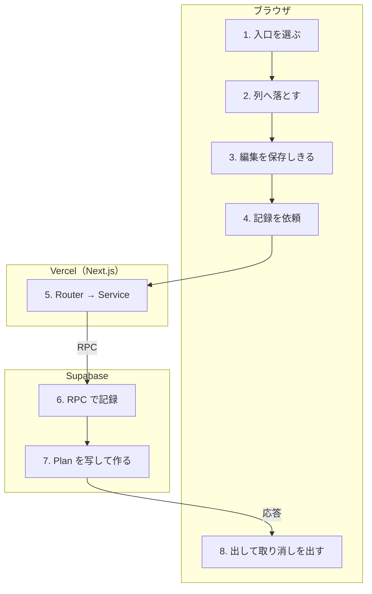

# Record を作る・Plan を記録する

<!-- learn:generated:start — 正本 このファイルの learn:journey の JSON / 再生成 pnpm learn:generate / 検証 pnpm docs:check。この範囲は手編集しない -->

終わった Plan を Inspector の「そのまま記録」で Record にする経路を中心に辿る。Plan は消えずに残り、同じ内容の Record が別に 1 件できる。Plan を Record の列へドラッグする入口と、過去の時間帯から直接 Record を作る入口（「Plan を保存」と同じ経路）もある。



通るサービス: ブラウザ / Vercel（Next.js） / Supabase。段 8・失敗 7 種。

壊して確かめる: [break-rules](../labs/break-rules.md)

#### この経路を守るテスト

- [`apps/product/src/lib/test/e2e/critical-path.spec.ts`](../../../apps/product/src/lib/test/e2e/critical-path.spec.ts) で `test('過去帯をドラッグして Record を記録し、リロード後も残る'` を探す（E2E。入口 (3) の過去の時間帯から作る経路。「そのまま記録」を通しで守る E2E は見つからなかった）

### 1. 記録の入口は 3 つ（ブラウザ）

(1) Inspector の「そのまま記録」: Plan で、終了が今以前の時だけ出る。(2) カレンダーで Plan を Record の列へドラッグ: 落とした位置の終了が今以前の時だけ記録になる。(3) 過去の時間帯をドラッグして作る: 既定が Record になる（「Plan を保存」の作成経路）。

- **なぜ必要か**: 計画と実績の距離を縮める手数を最小にするため。どの入口も、Record は未来に終われない（DT005）という DB 規則を先回りして、終わった時間帯でだけ記録を出す。
- **入力 → 出力**: Plan の終了時刻（または落とした位置）と現在時刻 → 記録の導線を出すか・呼ぶか
- **ここを変えると**: 出す条件は DB 規則の写し。規則を変える時は invariants.md §時刻 の写し表に沿って 3 つとも見る。日の単位でまとめて記録する ConfirmDayButton も部品としてはあるが、画面に置いている箇所は見つからなかった（未確認）。
- **コード**:
  - [`apps/product/src/features/timeblock/components/editor/TimeblockInspectorForm.tsx`](../../../apps/product/src/features/timeblock/components/editor/TimeblockInspectorForm.tsx) で `{!isDuplicateMode && kind === 'plan' && isPast && targetId ? (` を探す
  - [`apps/product/src/features/calendar/interaction/interaction-effects.ts`](../../../apps/product/src/features/calendar/interaction/interaction-effects.ts) で `const canCreateRecord = effect.time.end.getTime() <= Date.now();` を探す
  - [`apps/product/src/features/timeblock/domain/timeblock-destination.ts`](../../../apps/product/src/features/timeblock/domain/timeblock-destination.ts) で `export function resolveTimeblockKindChoice(` を探す
- **この段を守るテスト**:
  - [`apps/product/src/features/timeblock/components/editor/TimeblockInspectorForm.test.tsx`](../../../apps/product/src/features/timeblock/components/editor/TimeblockInspectorForm.test.tsx) で `it('時間帯の記録の有無で予定の記録操作を消さない'` を探す
  - [`apps/product/src/features/calendar/interaction/useInteraction.test.ts`](../../../apps/product/src/features/calendar/interaction/useInteraction.test.ts) で `it('drop previewの終了が未来なら過去Planでも記録callbackを呼ばない'` を探す

<details>
<summary>⚡ Record の列へ落とした位置の終了が未来 — 画面: 何も起きない / データ: 変化なし / 再試行: 利用者がやり直す / 痕跡: 残らない</summary>

- 画面: 何も起きない。案内も出ず、Plan は元の位置に残る。
- データ: 変化なし。送っていない。
- 再試行: なし。終わった時間帯へ落とし直す。
- 痕跡: 何も残らない。
- **最初に見る場所**: 仕様どおり（DT005 の写し）。利用者から見ると理由が出ない点に注意。
- 根拠:
  - [`apps/product/src/features/calendar/interaction/interaction-effects.ts`](../../../apps/product/src/features/calendar/interaction/interaction-effects.ts) で `if (canCreateRecord) {` を探す

</details>

### 2. Record の列へ落とすと、独立した Record を作る（ブラウザ）

Plan のタイトル・メモ・アクティビティと、落とした位置の時刻で createRecord を呼ぶ。更新ではなく新規作成なので Plan はそのまま残る。一時 ID の Record を先に描き、失敗したら消してトーストを出す。成功時のトーストは出さない（取り消しトーストも無い）。動かしている間の重なり確認は、落とす先の Record 同士で行う。

- **なぜ必要か**: 計画どおりでなかった時間帯へ、手で打ち直さずに実績を置くため。Plan を消さないのは、Plan と Record を別々の事実として比べられるようにするため。
- **入力 → 出力**: Plan の内容 + 落とした位置の時刻 → createRecord の呼び出し
- **ここを変えると**: 「そのまま記録」と違い、成功時に取り消しトーストが出ない。揃える時は useTimeblockRecordMutations の取り消しを流用する。
- **コード**:
  - [`apps/product/src/features/calendar/components/views/shared/components/CalendarGridContent.tsx`](../../../apps/product/src/features/calendar/components/views/shared/components/CalendarGridContent.tsx) で `createRecord.mutate(buildPlanRecordDropInput(plan, range));` を探す
  - [`apps/product/src/features/calendar/lib/plan-record-drop.ts`](../../../apps/product/src/features/calendar/lib/plan-record-drop.ts) で `export function buildPlanRecordDropInput(` を探す
  - [`apps/product/src/features/calendar/interaction/useInteraction.ts`](../../../apps/product/src/features/calendar/interaction/useInteraction.ts) で `// レーン間dropでkindが変わるのは Plan → Record だけ。` を探す
- **この段を守るテスト**:
  - [`apps/product/src/features/calendar/lib/plan-record-drop.test.ts`](../../../apps/product/src/features/calendar/lib/plan-record-drop.test.ts) で `it('Planの内容とdrop先のpreview rangeから独立Record入力を作る'` を探す
  - [`apps/product/src/features/calendar/interaction/useInteraction.test.ts`](../../../apps/product/src/features/calendar/interaction/useInteraction.test.ts) で `it('Recordレーンへのdropはplan更新ではなく記録mutationへ委譲する'` を探す

### 3. 記録の前に、待っている編集を保存しきる（ブラウザ）

「そのまま記録」を押すと、メモの保存待ち（600ms）を止め、最新のメモとアクティビティを保存の列に積んで、その保存が終わるのを待つ。返ってきた Plan の版（updated_at）を記録の依頼に使う。待っている間はボタンを押せない。

- **なぜ必要か**: Record は Plan の内容を DB 側で写して作る。直前に打ったメモが保存される前に記録すると、古い内容の Record ができてしまうため。
- **入力 → 出力**: Inspector の未保存の入力 → 最新の Plan の版
- **ここを変えると**: 記録を Plan の最新内容と揃える要。ここを飛ばすと版が古くなり、記録は DT002 で弾かれる。
- **コード**:
  - [`apps/product/src/features/timeblock/components/editor/TimeblockInspectorForm.tsx`](../../../apps/product/src/features/timeblock/components/editor/TimeblockInspectorForm.tsx) で `const flushPendingEdits = useCallback(async (): Promise<string> => {` を探す
  - [`apps/product/src/features/timeblock/components/editor/TimeblockRecordActions.tsx`](../../../apps/product/src/features/timeblock/components/editor/TimeblockRecordActions.tsx) で `void beforeRecord().then(` を探す
- **この段を守るテスト**:
  - [`apps/product/src/features/timeblock/components/editor/TimeblockRecordActions.test.ts`](../../../apps/product/src/features/timeblock/components/editor/TimeblockRecordActions.test.ts) で `it('最新編集の保存完了後にだけPlanを記録する'` を探す
  - [`apps/product/src/features/timeblock/components/editor/TimeblockInspectorForm.test.tsx`](../../../apps/product/src/features/timeblock/components/editor/TimeblockInspectorForm.test.tsx) で `it('記録前にdebounceを止め、最新のアクティビティとメモをsnapshot保存する'` を探す

<details>
<summary>⚡ 直前の編集を保存できない — 画面: エラー表示 / データ: 変化なし / 再試行: 利用者がやり直す / 痕跡: 残らない</summary>

- 画面: 記録しない。保存側のトーストが出る（競合なら「別の場所で変更されたため…」、結果不明なら Inspector が操作を止める）。
- データ: Record は作られない。Plan は保存できたところまで。
- 再試行: しない。利用者が状況を見てからもう一度押す。
- 痕跡: 保存側の失敗と同じ（「Plan / Record を動かす・直す」）。
- **最初に見る場所**: 「Plan / Record を動かす・直す」の失敗から辿る。
- 根拠:
  - [`apps/product/src/features/timeblock/components/editor/TimeblockRecordActions.test.ts`](../../../apps/product/src/features/timeblock/components/editor/TimeblockRecordActions.test.ts) で `it('最新編集を保存できなければPlanを記録しない'` を探す

</details>

### 4. 記録を依頼する（先に描かない）（ブラウザ）

planCommands.record を呼ぶ。作成や更新と違い、一時 ID の Record は描かない（一覧の読み込みを止めて snapshot を取るだけ）。送っている間はボタンが押せない。retry: false で自動では送り直さない。

- **なぜ必要か**: Record の中身は DB が Plan から写して決めるので、画面側で先に同じものを組み立てない。二重に押して Record が 2 件できるのを防ぐため、送っている間は止める。
- **入力 → 出力**: Plan の id + 版 → POST /api/trpc（planCommands.record）
- **ここを変えると**: 楽観的に描く形へ変えるなら、DB の写し方（タイトル・メモ・アクティビティ・時刻）と一致させる必要がある。
- **コード**:
  - [`apps/product/src/features/timeblock/hooks/useTimeblockRecordMutations.ts`](../../../apps/product/src/features/timeblock/hooks/useTimeblockRecordMutations.ts) で `const recordPlan = api.planCommands.record.useMutation({` を探す
  - [`apps/product/src/features/timeblock/components/editor/TimeblockRecordActions.tsx`](../../../apps/product/src/features/timeblock/components/editor/TimeblockRecordActions.tsx) で `disabled={disabled || isPending}` を探す
- **この段を守るテスト**:
  - [`apps/product/src/features/timeblock/hooks/useTimeblockRecordMutations.test.tsx`](../../../apps/product/src/features/timeblock/hooks/useTimeblockRecordMutations.test.tsx) で `it('記録commandも自動再送を無効にする'` を探す
  - [`apps/product/src/features/timeblock/components/editor/TimeblockRecordActions.test.ts`](../../../apps/product/src/features/timeblock/components/editor/TimeblockRecordActions.test.ts) で `it('Record作成中は二重実行を無効化する'` を探す

<details>
<summary>⚡ 通信が途中で切れる — 画面: エラー表示 / データ: どちらもありうる / 再試行: しない / 痕跡: Sentry</summary>

- 画面: 「記録できませんでした。もう一度お試しください」のトースト。Inspector は操作を止めて「保存結果を確認できません」の案内を出す。
- データ: どちらもありうる（DB で確定した後に返事だけ失われた場合、Record はある）。
- 再試行: しない。一覧を取り直すので、確定していれば Record が現れる。
- 痕跡: ブラウザから Sentry へ（source: trpc_client_transport、分析の同意がある時だけ）。
- **最初に見る場所**: Sentry と、同じ時刻の Vercel の /api/trpc ログ。
- 根拠:
  - [`apps/product/src/features/timeblock/hooks/useTimeblockRecordMutations.ts`](../../../apps/product/src/features/timeblock/hooks/useTimeblockRecordMutations.ts) で `t('toast.recordFailed')` を探す

</details>

### 5. Router → Service（Vercel（Next.js））

入口と関門は「Plan を保存」と同じ。planCommands.record は id と expectedUpdatedAt だけを受け付ける（.strict()）。Service は command を呼び、成功後に利用記録（record_created）を送る。

- **なぜ必要か**: userId を ctx からだけ取り、他人の Plan から Record を作る経路を作らないため。利用記録は best-effort。
- **入力 → 出力**: id + expectedUpdatedAt → record_plan command の呼び出し
- **ここを変えると**: 入力に項目を足す時も userId は ctx から渡す（REVIEW-1）。
- **コード**:
  - [`apps/product/src/features/timeblock/server/plan-commands-router.ts`](../../../apps/product/src/features/timeblock/server/plan-commands-router.ts) で `record: protectedProcedure` を探す
  - [`apps/product/src/features/timeblock/server/timeblock-command-service.ts`](../../../apps/product/src/features/timeblock/server/timeblock-command-service.ts) で `async recordPlan(options: VersionedTargetOptions): Promise<RecordRow> {` を探す

### 6. Supabase の RPC で記録する（Supabase）

service role の client で record_plan_command_v1 を呼ぶ。record_plan は「版付きで既存の行を指す操作」に入っているので、Plan が見つからない（DT001）時は STALE_TARGET に訳す。

- **なぜ必要か**: 「その Plan はもう無い」を、存在しない id への要求（NOT_FOUND）と区別して扱えるようにするため。
- **入力 → 出力**: userId + Plan の id + 版 → 作った Record の行か、訳したエラーコード
- **ここを変えると**: 版付きの操作を足したら VERSIONED_TARGET_OPERATIONS に入れる。
- **コード**:
  - [`apps/product/src/features/timeblock/server/timeblock-command-client.ts`](../../../apps/product/src/features/timeblock/server/timeblock-command-client.ts) で `this.admin.rpc('record_plan_command_v1', {` を探す
  - [`apps/product/src/features/timeblock/server/timeblock-command-client.ts`](../../../apps/product/src/features/timeblock/server/timeblock-command-client.ts) で `const VERSIONED_TARGET_OPERATIONS = new Set<CommandOperation>([` を探す
- **この段を守るテスト**:
  - [`apps/product/src/features/timeblock/server/timeblock-command-client.test.ts`](../../../apps/product/src/features/timeblock/server/timeblock-command-client.test.ts) で `it('stale versionと消えたversioned targetを別のstable codeへ変換する'` を探す

<details>
<summary>⚡ 記録する前に Plan が別の場所で消されていた — 画面: エラー表示 / データ: 変化なし / 再試行: しない / 痕跡: 残らない</summary>

- 画面: 「記録できませんでした。もう一度お試しください」のトースト（競合専用の文言にはならない）。
- データ: 変化なし。
- 再試行: しない。
- 痕跡: 想定内（STALE_TARGET）なので Sentry には出ない。
- **最初に見る場所**: 別タブ・MCP で同じ Plan を消していないか。一覧の取り直しで Plan が消える。
- 根拠:
  - [`apps/product/src/features/timeblock/server/timeblock-command-client.ts`](../../../apps/product/src/features/timeblock/server/timeblock-command-client.ts) で `VERSIONED_TARGET_OPERATIONS.has(operation) ? 'STALE_TARGET' : 'NOT_FOUND',` を探す

</details>

### 7. DB が Plan を写して Record を作る（Supabase）

Plan を FOR UPDATE で押さえ、削除済みなら DT001、版が違えば DT002。通れば Plan のタイトル・メモ・アクティビティ・開始・終了を写した Record を source = 'from_plan' で INSERT する。Plan は変えず、Plan への紐付けも保存しない。Record の trigger が「未来に終われない」（DT005）を、排他制約が Record 同士の重なり（23P01）を弾く。

- **なぜ必要か**: 写す内容を 1 トランザクションで決め、読んだ時の Plan と違う内容の Record を作らないため。Plan と Record は別の列なので、同じ時刻に両方あってよい。
- **入力 → 出力**: Plan の id + 版 → 新しい Record の行
- **ここを変えると**: Plan と Record を独立させた後（2026-09-07）の形。紐付けを戻す・写す項目を変える時は、MCP の records.create と日次確定（confirm_day）も同じ規則か確かめる。
- **コード**:
  - [`supabase/migrations/20260907081237_independent_plan_record_commands.sql`](../../../supabase/migrations/20260907081237_independent_plan_record_commands.sql) で `CREATE OR REPLACE FUNCTION private.record_plan_unserialized_v1(` を探す
  - [`supabase/migrations/20260907081237_independent_plan_record_commands.sql`](../../../supabase/migrations/20260907081237_independent_plan_record_commands.sql) で `'from_plan',` を探す
  - [`supabase/migrations/20260729062435_timeblock_atomic_commands.sql`](../../../supabase/migrations/20260729062435_timeblock_atomic_commands.sql) で `RAISE EXCEPTION 'Records cannot end in the future' USING ERRCODE = 'DT005';` を探す
- **この段を守るテスト**:
  - [`apps/product/src/lib/test/integration/timeblock-atomic-commands.integration.test.ts`](../../../apps/product/src/lib/test/integration/timeblock-atomic-commands.integration.test.ts) で `it('rejects future Records and ignores the drained legacy link argument'` を探す（local Supabase が要る integration）
  - [`apps/product/src/lib/test/integration/timeblock-atomic-commands.integration.test.ts`](../../../apps/product/src/lib/test/integration/timeblock-atomic-commands.integration.test.ts) で `it('allows a Plan and Record to occupy the same time across separate lanes'` を探す
  - [`apps/product/src/lib/test/integration/timeblock-atomic-commands.integration.test.ts`](../../../apps/product/src/lib/test/integration/timeblock-atomic-commands.integration.test.ts) で `it('serializes confirm-day against one-tap Plan recording'` を探す

<details>
<summary>⚡ その時間帯に Record が既にある（23P01） — 画面: エラー表示 / データ: 変化なし / 再試行: しない / 痕跡: 残らない</summary>

- 画面: 「この時間帯には既に記録があります」のトースト。同じ Plan を 2 回記録しようとした時もこれになる。
- データ: 変化なし。
- 再試行: しない。
- 痕跡: 想定内なので Sentry には出ない。
- **最初に見る場所**: 仕様どおり。既にある Record を開いて直す。
- 根拠:
  - [`apps/product/src/features/timeblock/hooks/useTimeblockRecordMutations.ts`](../../../apps/product/src/features/timeblock/hooks/useTimeblockRecordMutations.ts) で `toast.error(isTimeOverlapError(error) ? t('toast.overlap') : t('toast.recordFailed'));` を探す

</details>

<details>
<summary>⚡ 版が古い（DT002）・終了が未来（DT005） — 画面: エラー表示 / データ: 変化なし / 再試行: しない / 痕跡: 残らない</summary>

- 画面: 「記録できませんでした。もう一度お試しください」のトースト。記録では競合・規則ごとの文言に分けていない。
- データ: 変化なし。
- 再試行: しない。
- 痕跡: 想定内なので Sentry には出ない。
- **最初に見る場所**: DT002 なら別の場所で Plan が変わった。DT005 は、画面を開いた後に Plan の終了が未来へ動かされた時にだけ届く。
- 根拠:
  - [`apps/product/src/features/timeblock/server/timeblock-command-client.ts`](../../../apps/product/src/features/timeblock/server/timeblock-command-client.ts) で `DT005: 'RECORD_IN_FUTURE',` を探す

</details>

### 8. Record を出し、取り消しを出す（ブラウザ）

返ってきた Record を一覧と詳細へ入れ、「記録しました ✓」のトースト（5 秒、「元に戻す」付き）を出す。Inspector は作った Record の詳細へ切り替わる。取り消しは作った Record を削除するだけで Plan は残る（開いている詳細がその Record なら閉じる）。成功・失敗どちらでも plans / records / statistics / review を取り直す。

- **なぜ必要か**: 確認を挟まずに記録できる代わりに、すぐ戻せるようにする。取り消しに Plan を触らないのは、Plan と Record が独立しているため。
- **入力 → 出力**: 新しい Record の行 → Record が載った画面 + 取り消しトースト
- **ここを変えると**: 取り消しは recordCommands.delete（ソフト削除）を通るので、「削除と取り消し」の規則がそのまま効く。
- **コード**:
  - [`apps/product/src/features/timeblock/hooks/useTimeblockRecordMutations.ts`](../../../apps/product/src/features/timeblock/hooks/useTimeblockRecordMutations.ts) で `toast.success(t('toast.recorded'), {` を探す
  - [`apps/product/src/features/timeblock/hooks/useTimeblockRecordMutations.ts`](../../../apps/product/src/features/timeblock/hooks/useTimeblockRecordMutations.ts) で `const undoRecord = api.recordCommands.delete.useMutation({` を探す
- **この段を守るテスト**:
  - [`apps/product/src/features/timeblock/hooks/useTimeblockRecordMutations.test.tsx`](../../../apps/product/src/features/timeblock/hooks/useTimeblockRecordMutations.test.tsx) で `it('ワンタップ記録のトーストから作った Record を取り消せる'` を探す
  - [`apps/product/src/features/timeblock/components/editor/TimeblockInspectorForm.test.tsx`](../../../apps/product/src/features/timeblock/components/editor/TimeblockInspectorForm.test.tsx) で `it('記録成功後のRecord IDをInspector切替へ渡す'` を探す

<details>
<summary>⚡ 取り消しに失敗する — 画面: エラー表示 / データ: どちらもありうる / 再試行: しない / 痕跡: 残らない</summary>

- 画面: 消えた Record が戻り、「取り消せませんでした。もう一度お試しください」のトースト。
- データ: Record は残る（通信が切れた場合は、どちらもありうる）。
- 再試行: しない。Record を開いて削除し直す。
- 痕跡: 想定内のコードなら Sentry には出ない。
- **最初に見る場所**: 取り消す前に Record を直していれば版が変わっていて弾かれる。
- 根拠:
  - [`apps/product/src/features/timeblock/hooks/useTimeblockRecordMutations.ts`](../../../apps/product/src/features/timeblock/hooks/useTimeblockRecordMutations.ts) で `toast.error(t('toast.undoFailed'));` を探す

</details>

<!-- learn:generated:end -->

## データ（正本）

この JSON がこのページの正本。上の説明と図、`pnpm learn` の対話画面はここから生成する。参照（`path` + `find`）は `pnpm docs:check` が実在を検査する。

```json learn:journey
{
  "id": "record-plan",
  "title": "Record を作る・Plan を記録する",
  "order": 30,
  "group": "calendar",
  "intro": "終わった Plan を Inspector の「そのまま記録」で Record にする経路を中心に辿る。Plan は消えずに残り、同じ内容の Record が別に 1 件できる。Plan を Record の列へドラッグする入口と、過去の時間帯から直接 Record を作る入口（「Plan を保存」と同じ経路）もある。",
  "play": "▶ そのまま記録を押す",
  "hops": [
    {
      "id": "entrances",
      "svc": "browser",
      "title": "記録の入口は 3 つ",
      "what": "(1) Inspector の「そのまま記録」: Plan で、終了が今以前の時だけ出る。(2) カレンダーで Plan を Record の列へドラッグ: 落とした位置の終了が今以前の時だけ記録になる。(3) 過去の時間帯をドラッグして作る: 既定が Record になる（「Plan を保存」の作成経路）。",
      "why": "計画と実績の距離を縮める手数を最小にするため。どの入口も、Record は未来に終われない（DT005）という DB 規則を先回りして、終わった時間帯でだけ記録を出す。",
      "io": {
        "in": "Plan の終了時刻（または落とした位置）と現在時刻",
        "out": "記録の導線を出すか・呼ぶか"
      },
      "change": "出す条件は DB 規則の写し。規則を変える時は invariants.md §時刻 の写し表に沿って 3 つとも見る。日の単位でまとめて記録する ConfirmDayButton も部品としてはあるが、画面に置いている箇所は見つからなかった（未確認）。",
      "refs": [
        {
          "path": "apps/product/src/features/timeblock/components/editor/TimeblockInspectorForm.tsx",
          "find": "{!isDuplicateMode && kind === 'plan' && isPast && targetId ? ("
        },
        {
          "path": "apps/product/src/features/calendar/interaction/interaction-effects.ts",
          "find": "const canCreateRecord = effect.time.end.getTime() <= Date.now();"
        },
        {
          "path": "apps/product/src/features/timeblock/domain/timeblock-destination.ts",
          "find": "export function resolveTimeblockKindChoice("
        }
      ],
      "tests": [
        {
          "path": "apps/product/src/features/timeblock/components/editor/TimeblockInspectorForm.test.tsx",
          "find": "it('時間帯の記録の有無で予定の記録操作を消さない'"
        },
        {
          "path": "apps/product/src/features/calendar/interaction/useInteraction.test.ts",
          "find": "it('drop previewの終了が未来なら過去Planでも記録callbackを呼ばない'"
        }
      ],
      "fails": [
        {
          "id": "drop-future",
          "label": "Record の列へ落とした位置の終了が未来",
          "screen": "何も起きない。案内も出ず、Plan は元の位置に残る。",
          "data": "変化なし。送っていない。",
          "retry": "なし。終わった時間帯へ落とし直す。",
          "trace": "何も残らない。",
          "look": "仕様どおり（DT005 の写し）。利用者から見ると理由が出ない点に注意。",
          "refs": [
            {
              "path": "apps/product/src/features/calendar/interaction/interaction-effects.ts",
              "find": "if (canCreateRecord) {"
            }
          ],
          "tags": {
            "screen": "none",
            "data": "unchanged",
            "retry": "user",
            "trace": "none"
          },
          "screenAfter": {
            "t": "calendar",
            "url": "/ja/calendar",
            "blocks": [
              {
                "state": "saved",
                "label": "仕事",
                "from": 2
              }
            ],
            "note": "（何も起きず、Plan はそのまま）"
          }
        }
      ],
      "short": "入口を選ぶ",
      "screen": {
        "t": "form",
        "title": "仕事",
        "url": "/ja/calendar",
        "fields": [
          ["日付", "今日"],
          ["時間", "9:00 – 10:00"],
          ["メモ", "やったことをひとこと..."]
        ],
        "button": "そのまま記録"
      }
    },
    {
      "id": "lane-drop",
      "svc": "browser",
      "title": "Record の列へ落とすと、独立した Record を作る",
      "what": "Plan のタイトル・メモ・アクティビティと、落とした位置の時刻で createRecord を呼ぶ。更新ではなく新規作成なので Plan はそのまま残る。一時 ID の Record を先に描き、失敗したら消してトーストを出す。成功時のトーストは出さない（取り消しトーストも無い）。動かしている間の重なり確認は、落とす先の Record 同士で行う。",
      "why": "計画どおりでなかった時間帯へ、手で打ち直さずに実績を置くため。Plan を消さないのは、Plan と Record を別々の事実として比べられるようにするため。",
      "io": {
        "in": "Plan の内容 + 落とした位置の時刻",
        "out": "createRecord の呼び出し"
      },
      "change": "「そのまま記録」と違い、成功時に取り消しトーストが出ない。揃える時は useTimeblockRecordMutations の取り消しを流用する。",
      "refs": [
        {
          "path": "apps/product/src/features/calendar/components/views/shared/components/CalendarGridContent.tsx",
          "find": "createRecord.mutate(buildPlanRecordDropInput(plan, range));"
        },
        {
          "path": "apps/product/src/features/calendar/lib/plan-record-drop.ts",
          "find": "export function buildPlanRecordDropInput("
        },
        {
          "path": "apps/product/src/features/calendar/interaction/useInteraction.ts",
          "find": "// レーン間dropでkindが変わるのは Plan → Record だけ。"
        }
      ],
      "tests": [
        {
          "path": "apps/product/src/features/calendar/lib/plan-record-drop.test.ts",
          "find": "it('Planの内容とdrop先のpreview rangeから独立Record入力を作る'"
        },
        {
          "path": "apps/product/src/features/calendar/interaction/useInteraction.test.ts",
          "find": "it('Recordレーンへのdropはplan更新ではなく記録mutationへ委譲する'"
        }
      ],
      "fails": [],
      "short": "列へ落とす"
    },
    {
      "id": "flush",
      "svc": "browser",
      "title": "記録の前に、待っている編集を保存しきる",
      "what": "「そのまま記録」を押すと、メモの保存待ち（600ms）を止め、最新のメモとアクティビティを保存の列に積んで、その保存が終わるのを待つ。返ってきた Plan の版（updated_at）を記録の依頼に使う。待っている間はボタンを押せない。",
      "why": "Record は Plan の内容を DB 側で写して作る。直前に打ったメモが保存される前に記録すると、古い内容の Record ができてしまうため。",
      "io": {
        "in": "Inspector の未保存の入力",
        "out": "最新の Plan の版"
      },
      "change": "記録を Plan の最新内容と揃える要。ここを飛ばすと版が古くなり、記録は DT002 で弾かれる。",
      "refs": [
        {
          "path": "apps/product/src/features/timeblock/components/editor/TimeblockInspectorForm.tsx",
          "find": "const flushPendingEdits = useCallback(async (): Promise<string> => {"
        },
        {
          "path": "apps/product/src/features/timeblock/components/editor/TimeblockRecordActions.tsx",
          "find": "void beforeRecord().then("
        }
      ],
      "tests": [
        {
          "path": "apps/product/src/features/timeblock/components/editor/TimeblockRecordActions.test.ts",
          "find": "it('最新編集の保存完了後にだけPlanを記録する'"
        },
        {
          "path": "apps/product/src/features/timeblock/components/editor/TimeblockInspectorForm.test.tsx",
          "find": "it('記録前にdebounceを止め、最新のアクティビティとメモをsnapshot保存する'"
        }
      ],
      "fails": [
        {
          "id": "flush-failed",
          "label": "直前の編集を保存できない",
          "screen": "記録しない。保存側のトーストが出る（競合なら「別の場所で変更されたため…」、結果不明なら Inspector が操作を止める）。",
          "data": "Record は作られない。Plan は保存できたところまで。",
          "retry": "しない。利用者が状況を見てからもう一度押す。",
          "trace": "保存側の失敗と同じ（「Plan / Record を動かす・直す」）。",
          "look": "「Plan / Record を動かす・直す」の失敗から辿る。",
          "refs": [
            {
              "path": "apps/product/src/features/timeblock/components/editor/TimeblockRecordActions.test.ts",
              "find": "it('最新編集を保存できなければPlanを記録しない'"
            }
          ],
          "tags": {
            "screen": "toast",
            "data": "unchanged",
            "retry": "user",
            "trace": "none"
          },
          "screenAfter": {
            "t": "form",
            "title": "仕事",
            "url": "/ja/calendar",
            "fields": [
              ["日付", "今日"],
              ["時間", "9:00 – 10:00"]
            ],
            "button": "そのまま記録",
            "error": "保存結果を確認できません。内容を確認するため、この画面を開き直してください"
          }
        }
      ],
      "short": "編集を保存しきる"
    },
    {
      "id": "record-mutation",
      "svc": "browser",
      "title": "記録を依頼する（先に描かない）",
      "what": "planCommands.record を呼ぶ。作成や更新と違い、一時 ID の Record は描かない（一覧の読み込みを止めて snapshot を取るだけ）。送っている間はボタンが押せない。retry: false で自動では送り直さない。",
      "why": "Record の中身は DB が Plan から写して決めるので、画面側で先に同じものを組み立てない。二重に押して Record が 2 件できるのを防ぐため、送っている間は止める。",
      "io": {
        "in": "Plan の id + 版",
        "out": "POST /api/trpc（planCommands.record）"
      },
      "change": "楽観的に描く形へ変えるなら、DB の写し方（タイトル・メモ・アクティビティ・時刻）と一致させる必要がある。",
      "refs": [
        {
          "path": "apps/product/src/features/timeblock/hooks/useTimeblockRecordMutations.ts",
          "find": "const recordPlan = api.planCommands.record.useMutation({"
        },
        {
          "path": "apps/product/src/features/timeblock/components/editor/TimeblockRecordActions.tsx",
          "find": "disabled={disabled || isPending}"
        }
      ],
      "tests": [
        {
          "path": "apps/product/src/features/timeblock/hooks/useTimeblockRecordMutations.test.tsx",
          "find": "it('記録commandも自動再送を無効にする'"
        },
        {
          "path": "apps/product/src/features/timeblock/components/editor/TimeblockRecordActions.test.ts",
          "find": "it('Record作成中は二重実行を無効化する'"
        }
      ],
      "fails": [
        {
          "id": "network-lost",
          "label": "通信が途中で切れる",
          "screen": "「記録できませんでした。もう一度お試しください」のトースト。Inspector は操作を止めて「保存結果を確認できません」の案内を出す。",
          "data": "どちらもありうる（DB で確定した後に返事だけ失われた場合、Record はある）。",
          "retry": "しない。一覧を取り直すので、確定していれば Record が現れる。",
          "trace": "ブラウザから Sentry へ（source: trpc_client_transport、分析の同意がある時だけ）。",
          "look": "Sentry と、同じ時刻の Vercel の /api/trpc ログ。",
          "refs": [
            {
              "path": "apps/product/src/features/timeblock/hooks/useTimeblockRecordMutations.ts",
              "find": "t('toast.recordFailed')"
            }
          ],
          "tags": {
            "screen": "toast",
            "data": "unknown",
            "retry": "none",
            "trace": "sentry"
          },
          "screenAfter": {
            "t": "calendar",
            "url": "/ja/calendar",
            "blocks": [
              {
                "state": "saved",
                "label": "仕事"
              }
            ],
            "toast": "記録できませんでした。もう一度お試しください",
            "toastTone": "bad"
          }
        }
      ],
      "short": "記録を依頼"
    },
    {
      "id": "router-service",
      "svc": "vercel",
      "title": "Router → Service",
      "what": "入口と関門は「Plan を保存」と同じ。planCommands.record は id と expectedUpdatedAt だけを受け付ける（.strict()）。Service は command を呼び、成功後に利用記録（record_created）を送る。",
      "why": "userId を ctx からだけ取り、他人の Plan から Record を作る経路を作らないため。利用記録は best-effort。",
      "io": {
        "in": "id + expectedUpdatedAt",
        "out": "record_plan command の呼び出し"
      },
      "change": "入力に項目を足す時も userId は ctx から渡す（REVIEW-1）。",
      "refs": [
        {
          "path": "apps/product/src/features/timeblock/server/plan-commands-router.ts",
          "find": "record: protectedProcedure"
        },
        {
          "path": "apps/product/src/features/timeblock/server/timeblock-command-service.ts",
          "find": "async recordPlan(options: VersionedTargetOptions): Promise<RecordRow> {"
        }
      ],
      "fails": [],
      "short": "Router → Service"
    },
    {
      "id": "command-client",
      "svc": "supabase",
      "title": "Supabase の RPC で記録する",
      "what": "service role の client で record_plan_command_v1 を呼ぶ。record_plan は「版付きで既存の行を指す操作」に入っているので、Plan が見つからない（DT001）時は STALE_TARGET に訳す。",
      "why": "「その Plan はもう無い」を、存在しない id への要求（NOT_FOUND）と区別して扱えるようにするため。",
      "io": {
        "in": "userId + Plan の id + 版",
        "out": "作った Record の行か、訳したエラーコード"
      },
      "change": "版付きの操作を足したら VERSIONED_TARGET_OPERATIONS に入れる。",
      "refs": [
        {
          "path": "apps/product/src/features/timeblock/server/timeblock-command-client.ts",
          "find": "this.admin.rpc('record_plan_command_v1', {"
        },
        {
          "path": "apps/product/src/features/timeblock/server/timeblock-command-client.ts",
          "find": "const VERSIONED_TARGET_OPERATIONS = new Set<CommandOperation>(["
        }
      ],
      "tests": [
        {
          "path": "apps/product/src/features/timeblock/server/timeblock-command-client.test.ts",
          "find": "it('stale versionと消えたversioned targetを別のstable codeへ変換する'"
        }
      ],
      "fails": [
        {
          "id": "plan-gone",
          "label": "記録する前に Plan が別の場所で消されていた",
          "screen": "「記録できませんでした。もう一度お試しください」のトースト（競合専用の文言にはならない）。",
          "data": "変化なし。",
          "retry": "しない。",
          "trace": "想定内（STALE_TARGET）なので Sentry には出ない。",
          "look": "別タブ・MCP で同じ Plan を消していないか。一覧の取り直しで Plan が消える。",
          "refs": [
            {
              "path": "apps/product/src/features/timeblock/server/timeblock-command-client.ts",
              "find": "VERSIONED_TARGET_OPERATIONS.has(operation) ? 'STALE_TARGET' : 'NOT_FOUND',"
            }
          ],
          "tags": {
            "screen": "toast",
            "data": "unchanged",
            "retry": "none",
            "trace": "none"
          },
          "to": "record-mutation",
          "back": "記録失敗のトースト",
          "screenAfter": {
            "t": "calendar",
            "url": "/ja/calendar",
            "blocks": [
              {
                "state": "gone",
                "label": "消えた"
              }
            ],
            "toast": "記録できませんでした。もう一度お試しください",
            "toastTone": "bad"
          }
        }
      ],
      "short": "RPC で記録",
      "via": "RPC"
    },
    {
      "id": "db-insert",
      "svc": "supabase",
      "title": "DB が Plan を写して Record を作る",
      "what": "Plan を FOR UPDATE で押さえ、削除済みなら DT001、版が違えば DT002。通れば Plan のタイトル・メモ・アクティビティ・開始・終了を写した Record を source = 'from_plan' で INSERT する。Plan は変えず、Plan への紐付けも保存しない。Record の trigger が「未来に終われない」（DT005）を、排他制約が Record 同士の重なり（23P01）を弾く。",
      "why": "写す内容を 1 トランザクションで決め、読んだ時の Plan と違う内容の Record を作らないため。Plan と Record は別の列なので、同じ時刻に両方あってよい。",
      "io": {
        "in": "Plan の id + 版",
        "out": "新しい Record の行"
      },
      "change": "Plan と Record を独立させた後（2026-09-07）の形。紐付けを戻す・写す項目を変える時は、MCP の records.create と日次確定（confirm_day）も同じ規則か確かめる。",
      "refs": [
        {
          "path": "supabase/migrations/20260907081237_independent_plan_record_commands.sql",
          "find": "CREATE OR REPLACE FUNCTION private.record_plan_unserialized_v1("
        },
        {
          "path": "supabase/migrations/20260907081237_independent_plan_record_commands.sql",
          "find": "'from_plan',"
        },
        {
          "path": "supabase/migrations/20260729062435_timeblock_atomic_commands.sql",
          "find": "RAISE EXCEPTION 'Records cannot end in the future' USING ERRCODE = 'DT005';"
        }
      ],
      "tests": [
        {
          "path": "apps/product/src/lib/test/integration/timeblock-atomic-commands.integration.test.ts",
          "find": "it('rejects future Records and ignores the drained legacy link argument'",
          "why": "local Supabase が要る integration"
        },
        {
          "path": "apps/product/src/lib/test/integration/timeblock-atomic-commands.integration.test.ts",
          "find": "it('allows a Plan and Record to occupy the same time across separate lanes'"
        },
        {
          "path": "apps/product/src/lib/test/integration/timeblock-atomic-commands.integration.test.ts",
          "find": "it('serializes confirm-day against one-tap Plan recording'"
        }
      ],
      "fails": [
        {
          "id": "overlap",
          "label": "その時間帯に Record が既にある（23P01）",
          "screen": "「この時間帯には既に記録があります」のトースト。同じ Plan を 2 回記録しようとした時もこれになる。",
          "data": "変化なし。",
          "retry": "しない。",
          "trace": "想定内なので Sentry には出ない。",
          "look": "仕様どおり。既にある Record を開いて直す。",
          "refs": [
            {
              "path": "apps/product/src/features/timeblock/hooks/useTimeblockRecordMutations.ts",
              "find": "toast.error(isTimeOverlapError(error) ? t('toast.overlap') : t('toast.recordFailed'));"
            }
          ],
          "tags": {
            "screen": "toast",
            "data": "unchanged",
            "retry": "none",
            "trace": "none"
          },
          "to": "record-mutation",
          "back": "重なりのトースト",
          "screenAfter": {
            "t": "calendar",
            "url": "/ja/calendar",
            "blocks": [
              {
                "state": "saved",
                "label": "仕事"
              },
              {
                "state": "record",
                "label": "既存の記録"
              }
            ],
            "toast": "この時間帯には既に記録があります",
            "toastTone": "bad"
          }
        },
        {
          "id": "stale-or-future",
          "label": "版が古い（DT002）・終了が未来（DT005）",
          "screen": "「記録できませんでした。もう一度お試しください」のトースト。記録では競合・規則ごとの文言に分けていない。",
          "data": "変化なし。",
          "retry": "しない。",
          "trace": "想定内なので Sentry には出ない。",
          "look": "DT002 なら別の場所で Plan が変わった。DT005 は、画面を開いた後に Plan の終了が未来へ動かされた時にだけ届く。",
          "refs": [
            {
              "path": "apps/product/src/features/timeblock/server/timeblock-command-client.ts",
              "find": "DT005: 'RECORD_IN_FUTURE',"
            }
          ],
          "tags": {
            "screen": "toast",
            "data": "unchanged",
            "retry": "none",
            "trace": "none"
          },
          "to": "record-mutation",
          "back": "記録失敗のトースト",
          "screenAfter": {
            "t": "calendar",
            "url": "/ja/calendar",
            "blocks": [
              {
                "state": "saved",
                "label": "仕事"
              }
            ],
            "toast": "記録できませんでした。もう一度お試しください",
            "toastTone": "bad"
          }
        }
      ],
      "short": "Plan を写して作る"
    },
    {
      "id": "settle",
      "svc": "browser",
      "title": "Record を出し、取り消しを出す",
      "what": "返ってきた Record を一覧と詳細へ入れ、「記録しました ✓」のトースト（5 秒、「元に戻す」付き）を出す。Inspector は作った Record の詳細へ切り替わる。取り消しは作った Record を削除するだけで Plan は残る（開いている詳細がその Record なら閉じる）。成功・失敗どちらでも plans / records / statistics / review を取り直す。",
      "why": "確認を挟まずに記録できる代わりに、すぐ戻せるようにする。取り消しに Plan を触らないのは、Plan と Record が独立しているため。",
      "io": {
        "in": "新しい Record の行",
        "out": "Record が載った画面 + 取り消しトースト"
      },
      "change": "取り消しは recordCommands.delete（ソフト削除）を通るので、「削除と取り消し」の規則がそのまま効く。",
      "refs": [
        {
          "path": "apps/product/src/features/timeblock/hooks/useTimeblockRecordMutations.ts",
          "find": "toast.success(t('toast.recorded'), {"
        },
        {
          "path": "apps/product/src/features/timeblock/hooks/useTimeblockRecordMutations.ts",
          "find": "const undoRecord = api.recordCommands.delete.useMutation({"
        }
      ],
      "tests": [
        {
          "path": "apps/product/src/features/timeblock/hooks/useTimeblockRecordMutations.test.tsx",
          "find": "it('ワンタップ記録のトーストから作った Record を取り消せる'"
        },
        {
          "path": "apps/product/src/features/timeblock/components/editor/TimeblockInspectorForm.test.tsx",
          "find": "it('記録成功後のRecord IDをInspector切替へ渡す'"
        }
      ],
      "fails": [
        {
          "id": "undo-failed",
          "label": "取り消しに失敗する",
          "screen": "消えた Record が戻り、「取り消せませんでした。もう一度お試しください」のトースト。",
          "data": "Record は残る（通信が切れた場合は、どちらもありうる）。",
          "retry": "しない。Record を開いて削除し直す。",
          "trace": "想定内のコードなら Sentry には出ない。",
          "look": "取り消す前に Record を直していれば版が変わっていて弾かれる。",
          "refs": [
            {
              "path": "apps/product/src/features/timeblock/hooks/useTimeblockRecordMutations.ts",
              "find": "toast.error(t('toast.undoFailed'));"
            }
          ],
          "tags": {
            "screen": "toast",
            "data": "unknown",
            "retry": "none",
            "trace": "none"
          },
          "screenAfter": {
            "t": "calendar",
            "url": "/ja/calendar",
            "blocks": [
              {
                "state": "saved",
                "label": "仕事"
              },
              {
                "state": "record",
                "label": "仕事"
              }
            ],
            "toast": "取り消せませんでした。もう一度お試しください",
            "toastTone": "bad"
          }
        }
      ],
      "short": "出して取り消しを出す",
      "via": "応答",
      "screen": {
        "t": "calendar",
        "url": "/ja/calendar",
        "blocks": [
          {
            "state": "saved",
            "label": "仕事"
          },
          {
            "state": "record",
            "label": "仕事"
          }
        ],
        "toast": "記録しました ✓",
        "toastAction": "元に戻す",
        "note": "Plan は残り、同じ時刻の Record が右の列に並ぶ"
      }
    }
  ],
  "lanes": ["browser", "vercel", "supabase"],
  "lab": "break-rules",
  "tests": [
    {
      "path": "apps/product/src/lib/test/e2e/critical-path.spec.ts",
      "find": "test('過去帯をドラッグして Record を記録し、リロード後も残る'",
      "why": "E2E。入口 (3) の過去の時間帯から作る経路。「そのまま記録」を通しで守る E2E は見つからなかった"
    }
  ]
}
```
