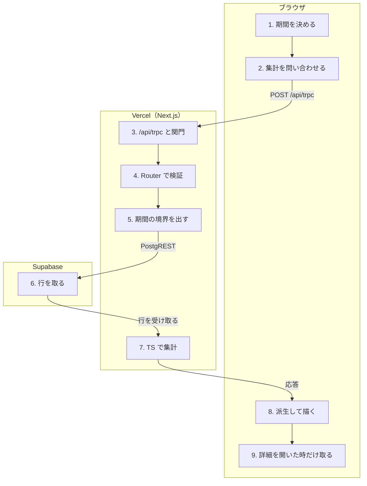

# レポートを開く（集計）

<!-- learn:generated:start — 正本 このファイルの learn:journey の JSON / 再生成 pnpm learn:generate / 検証 pnpm docs:check。この範囲は手編集しない -->

サイドバーからレポートを開くと、週 / 月 / 年の期間で Plan と Record をアクティビティ別に集計して見せる。集計はサーバーで 1 回だけ行い、タブの切替やフィルタはブラウザの純粋関数で派生させる。計画と実績の距離（予定比・見積もりの鏡）を読む面。



通るサービス: ブラウザ / Vercel（Next.js） / Supabase。段 9・失敗 8 種。

#### この経路を守るテスト

- [`apps/product/src/lib/test/e2e/critical-path.spec.ts`](../../../apps/product/src/lib/test/e2e/critical-path.spec.ts) で `test('記録した実績が /report の 1 章（配分）に反映される'` を探す（E2E。カレンダーで作った Record が週のレポートに出るところまで）
- [`apps/product/src/lib/test/e2e/derived-plan-record-flow.spec.ts`](../../../apps/product/src/lib/test/e2e/derived-plan-record-flow.spec.ts) で `test('記録の同一週内移動でInspectorの一覧だけが変わり予定比は変わらない'` を探す（E2E。差分タブの予定比が Plan と Record の対応付けに依らないこと）

### 1. 表示する期間と条件を決める（ブラウザ）

/report はサーバーで先読みしない。表示中の日付（URL の date）はカレンダーと共通のナビゲーションから、粒度（range）とタブ（tab）は URL から取る。timezone と週の開始曜日はユーザー設定から読み、URL には載せない。

- **なぜ必要か**: 週の境界は timezone と週の開始曜日で決まる。サーバー（UTC）で組むと、UTC 以外の利用者の週がずれるため、ブラウザで条件を揃えてから問い合わせる。
- **入力 → 出力**: URL（date / range / tab）+ ユーザー設定（timezone / 週の開始曜日） → anchorDate・granularity・timezone・weekStartsOn の 4 つ
- **ここを変えると**: date を server component の prop で受けると、期間の ‹ › 移動が画面に反映されなくなる（移動は history.replaceState で URL を書くだけで、server component は再描画されない）。page.tsx と ReportViewClient のコメントが理由を持つ。
- **コード**:
  - [`apps/product/src/app/[locale]/(app)/(workspace)/report/page.tsx`](<../../../apps/product/src/app/[locale]/(app)/(workspace)/report/page.tsx>) で `server prefetch はしない` を探す
  - [`apps/product/src/app/[locale]/(app)/(workspace)/_composition/ReportViewClient.tsx`](<../../../apps/product/src/app/[locale]/(app)/(workspace)/_composition/ReportViewClient.tsx>) で ``**表示中の日付の正本は `useCalendarNavigation().currentDate`**`` を探す
  - [`apps/product/src/features/review/hooks/useReportPeriod.ts`](../../../apps/product/src/features/review/hooks/useReportPeriod.ts) で `const timezone = useUserPreferences((s) => s.timezone);` を探す
- **この段を守るテスト**:
  - [`apps/product/src/features/review/lib/report-tab.test.ts`](../../../apps/product/src/features/review/lib/report-tab.test.ts) で `it('省略と不正値は時間の使い方へ丸める'` を探す

<details>
<summary>⚡ ユーザー設定がまだ読めていない — 画面: 何も起きない / データ: 変化なし / 再試行: 自動で再試行 / 痕跡: 残らない</summary>

- 画面: 一瞬、ブラウザの timezone・月曜始まりで数えた数字が出て、設定が届くと差し替わることがある。
- データ: 変化なし（読むだけ）。
- 再試行: 設定が届くと問い合わせの引数（timezone / weekStartsOn）が変わるので、別の問い合わせとして取り直す。
- 痕跡: 残らない。
- **最初に見る場所**: 設定の timezone とブラウザの timezone が違う利用者でだけ起きる。useUserPreferences の既定値（設定が無い時）を見る。
- 根拠:
  - [`apps/product/src/lib/hooks/useUserPreferences.ts`](../../../apps/product/src/lib/hooks/useUserPreferences.ts) で `timezone: getBrowserTimezone(),` を探す
  - [`apps/product/src/lib/hooks/useUserPreferences.ts`](../../../apps/product/src/lib/hooks/useUserPreferences.ts) で `weekStartsOn: 1,` を探す

</details>

### 2. 期間集計を 1 本だけ問い合わせる（ブラウザ）

review.getReportPeriod を tRPC の query で呼ぶ。3 つのタブはこの 1 本だけを読み、タブの切替やフィルタでは問い合わせ直さない。結果は 60 秒は新しいものとして扱い、ブラウザ（IndexedDB）にも保存される。

- **なぜ必要か**: タブやフィルタを触るたびにサーバーへ往復させないため。期間を行き来した時に前の数字をすぐ出すため。
- **入力 → 出力**: 4 つの条件 → POST /api/trpc（query も POST で送る）
- **ここを変えると**: 集計の項目を足す時は、保存済みの古い形が復元されても落ちないよう normalizeReportPeriodPayload に既定値を足す。タブごとに別の query を作ると、仕様（review.md §5）の「1 期間 1 往復」が崩れる。
- **コード**:
  - [`apps/product/src/features/review/hooks/useReportPeriod.ts`](../../../apps/product/src/features/review/hooks/useReportPeriod.ts) で `trpc.review.getReportPeriod.useQuery` を探す
  - [`apps/product/src/features/review/domain/report/report-view-model.ts`](../../../apps/product/src/features/review/domain/report/report-view-model.ts) で `**集計はブラウザに永続化される**` を探す
  - [`docs/product/specs/review.md`](../../product/specs/review.md) で `## 5. 集計の分割` を探す
- **この段を守るテスト**:
  - [`apps/product/src/features/review/components/report/ReportBody.test.tsx`](../../../apps/product/src/features/review/components/report/ReportBody.test.tsx) で `it('タブを切り替えても期間の query は同じ引数のまま（往復しない）'` を探す
  - [`apps/product/src/features/review/components/report/ReportBody.test.tsx`](../../../apps/product/src/features/review/components/report/ReportBody.test.tsx) で `it('項目が足りない古い形の集計が復元されても描ける'` を探す

<details>
<summary>⚡ 古い形の集計がブラウザから復元される — 画面: 何も起きない / データ: 変化なし / 再試行: 自動で再試行 / 痕跡: 残らない</summary>

- 画面: 足りない項目は「無い」として空で描く。取り直しが終わると正しい数字に変わる。
- データ: 変化なし。
- 再試行: 保存済みの値を出したあと、古ければ取り直す（staleTime 60 秒）。
- 痕跡: 残らない。
- **最初に見る場所**: リリースの間に項目を足した変更がデプロイされた直後に起きる。normalizeReportPeriodPayload に新しい項目の既定値があるか。
- 根拠:
  - [`apps/product/src/features/review/domain/report/report-view-model.ts`](../../../apps/product/src/features/review/domain/report/report-view-model.ts) で `export function normalizeReportPeriodPayload<` を探す

</details>

### 3. /api/trpc で受けて関門を通る（Vercel（Next.js））

context がセッションの cookie から利用者を決め、その利用者の権限で動く Supabase client を作る。protectedProcedure がログイン・MFA・ユーザー単位の rate limit を見る。利用権（課金）の検査は mutation にだけ掛かるので、読むだけのレポートは利用期間が終わっても開ける。

- **なぜ必要か**: どの procedure でも同じ順序で守りを通すため。読み取りを課金で止めないのは、利用が終わっても自分の記録を読めるようにするため（operation-access.ts の分岐）。
- **入力 → 出力**: HTTP リクエスト（cookie） → ctx（userId と、利用者の権限で動く Supabase client）
- **ここを変えると**: requiresProductAccess を変えると、レポートを含む全 query の見え方が課金状態で変わる。ここは全 tRPC 共通なので、変更の影響は保存経路（Plan を保存）と同じ範囲に及ぶ。
- **コード**:
  - [`apps/product/src/lib/trpc/context.ts`](../../../apps/product/src/lib/trpc/context.ts) で `const { createServerClient } = await import` を探す
  - [`apps/product/src/lib/trpc/procedures.ts`](../../../apps/product/src/lib/trpc/procedures.ts) で `if (requiresProductAccess(path, type, ctx.authMode === 'oauth')) {` を探す
  - [`apps/product/src/lib/billing/operation-access.ts`](../../../apps/product/src/lib/billing/operation-access.ts) で `if (type !== 'mutation') return false;` を探す
- **この段を守るテスト**:
  - [`apps/product/src/lib/trpc/query-client.test.ts`](../../../apps/product/src/lib/trpc/query-client.test.ts) で `it('does not retry a query rejected with TOO_MANY_REQUESTS'` を探す

<details>
<summary>⚡ セッションが切れている（401） — 画面: 別の画面へ / データ: 変化なし / 再試行: しない / 痕跡: 残らない</summary>

- 画面: 画面ごとログインへ移動する（再読み込みを伴う移動）。
- データ: 変化なし。
- 再試行: しない（認証エラーは再試行しない）。ログイン後に元のパスへ戻る。
- 痕跡: 残らない（想定内）。
- **最初に見る場所**: query-client.ts の handleAuthError。
- 根拠:
  - [`apps/product/src/lib/trpc/query-client.ts`](../../../apps/product/src/lib/trpc/query-client.ts) で `function handleAuthError` を探す
  - [`apps/product/src/lib/trpc/procedures.ts`](../../../apps/product/src/lib/trpc/procedures.ts) で `code: 'UNAUTHORIZED',` を探す

</details>

<details>
<summary>⚡ ユーザー単位の rate limit を超える（429） — 画面: エラー表示 / データ: 変化なし / 再試行: しない / 痕跡: 残らない</summary>

- 画面: レポートの面が「レポートを読み込めませんでした」になる。
- データ: 変化なし。
- 再試行: しない（429 は再試行すると同じ枠をさらに使うだけなので諦める）。開き直すか、タブへ戻った時の取り直しを待つ。
- 痕跡: 残らない。
- **最初に見る場所**: E2E のように短時間に多くの API を呼ぶと届く（#2669）。query-client.ts の isRateLimitedError と procedures.ts の isUserRateLimited。
- 根拠:
  - [`apps/product/src/lib/trpc/query-client.ts`](../../../apps/product/src/lib/trpc/query-client.ts) で `function isRateLimitedError` を探す
  - [`apps/product/src/lib/trpc/procedures.ts`](../../../apps/product/src/lib/trpc/procedures.ts) で `code: 'TOO_MANY_REQUESTS',` を探す

</details>

### 4. Router が入力を検証して Service を呼ぶ（Vercel（Next.js））

zod で anchorDate（YYYY-MM-DD）・粒度（week / month / year。day は無い）・timezone（1〜64 文字）・週の開始曜日（0 / 1 / 6）を検証し、ctx の userId で集計 Service を呼ぶ。userId はクライアントから受け取らない。

- **なぜ必要か**: 他人の集計を頼めないようにするため（利用者は必ず認証済みの ctx から取る）。粒度を input で受けているので、将来 月・年 を有料に限るならここ 1 か所で分けられる。
- **入力 → 出力**: 4 つの条件 → ReportAggregationService.getReportPeriod(userId, input)
- **ここを変えると**: timezone の正当性は長さしか見ておらず、実在しない名前は日付計算の側で失敗する（その時の挙動は未確認）。検証を足すなら ANCHOR_DATE / TIMEZONE の定義を変える。
- **コード**:
  - [`apps/product/src/features/review/server/router.ts`](../../../apps/product/src/features/review/server/router.ts) で `getReportPeriod: protectedProcedure` を探す
  - [`apps/product/src/features/review/server/router.ts`](../../../apps/product/src/features/review/server/router.ts) で `const GRANULARITY = z.enum(['week', 'month', 'year']);` を探す
- **この段を守るテスト**:
  - [`apps/product/src/features/review/server/router.test.ts`](../../../apps/product/src/features/review/server/router.test.ts) で `it('client 入力ではなく認証済み context の userId で集計する'` を探す
  - [`apps/product/src/features/review/server/router.test.ts`](../../../apps/product/src/features/review/server/router.test.ts) で ``it('不正な粒度を受け付けない（`day` は廃止した）'`` を探す

### 5. 利用者の timezone で期間の境界を出す（Vercel（Next.js））

期間の開始・終了を、利用者の timezone の 0 時として UTC の瞬間へ直す（半開区間 [開始, 終了)）。比較用に 1 つ前の期間と、日・週・月ごとの列も同じ規則で作る。期間の長さ（余白の分母）は DST を無視した公称値。

- **なぜ必要か**: 週の境界を利用者の壁時計で揃えるため。隣り合う期間を隙間なく接させ、境界ちょうどの時刻が二重にも漏れにも数えられないようにするため。
- **入力 → 出力**: anchorDate・粒度・timezone・週の開始曜日 → 期間と前期間の startAt / endAt（UTC）と列
- **ここを変えると**: 日付境界の組み方を変えるなら timezone.md の禁止パターン（ブラウザ TZ の 0 時を UTC 変換する等）を先に読む。ここの規則は詳細パネルの集計と共有している。
- **コード**:
  - [`apps/product/src/features/review/lib/report-period.ts`](../../../apps/product/src/features/review/lib/report-period.ts) で `export function resolveReportRange(` を探す
  - [`apps/product/src/features/review/lib/report-period.ts`](../../../apps/product/src/features/review/lib/report-period.ts) で `function zonedDayStart(dateKey: string, timezone: string): Date {` を探す
  - [`docs/engineering/timezone.md`](../../engineering/timezone.md) で `## 禁止パターン一覧` を探す
- **この段を守るテスト**:
  - [`apps/product/src/features/review/lib/report-period.test.ts`](../../../apps/product/src/features/review/lib/report-period.test.ts) で `it('timezone ごとに UTC の瞬間が変わる'` を探す
  - [`apps/product/src/features/review/lib/report-period.test.ts`](../../../apps/product/src/features/review/lib/report-period.test.ts) で `it('DST 開始週でも lengthMinutes は 10080 のまま（意図的に無視する）'` を探す
  - [`apps/product/src/features/review/lib/report-period.test.ts`](../../../apps/product/src/features/review/lib/report-period.test.ts) で `it('隣り合う週の間に隙間が無い（1ms の穴を作らない）'` を探す

### 6. Plan / Record / アクティビティ / カテゴリを並行で取る（Supabase）

今期間の Record と Plan、前期間の Record、アクティビティ全件、カテゴリ全件の 5 本を並行で取る。期間は開始ではなく重なりで選ぶ（start_at < 終了 かつ end_at > 開始）。削除済み（deleted_at あり）は除き、アーカイブ済みのアクティビティは除かない。行は 500 件ずつ全部読み切る。

- **なぜ必要か**: 開始だけで選ぶと、日曜 23 時〜月曜 7 時のような期間を跨ぐ Record が片側の期間に丸ごと入り、跨いだ先から消える。アーカイブは未来にだけ効く操作なので、過去の Record は数え続ける。
- **入力 → 出力**: userId と期間 → Plan / Record の行（id・activity_id・start_at・end_at 等）とアクティビティ・カテゴリの行
- **ここを変えると**: RLS（利用者の権限の client）に加えて user_id でも絞っている。PostgREST の 1 回あたりの行数上限に黙って切られないよう collectQueryPages で読み切るので、ここを単発の select に戻すと多い期間で数字が欠ける。
- **コード**:
  - [`apps/product/src/features/review/server/report-fetchers.ts`](../../../apps/product/src/features/review/server/report-fetchers.ts) で `**選択は半開区間の重なりで書く**` を探す
  - [`apps/product/src/features/review/server/report-fetchers.ts`](../../../apps/product/src/features/review/server/report-fetchers.ts) で `.lt('start_at', range.endAt)` を探す
  - [`apps/product/src/lib/database/collect-query-pages.ts`](../../../apps/product/src/lib/database/collect-query-pages.ts) で `const pageSize = 500;` を探す
- **この段を守るテスト**:
  - [`apps/product/src/features/review/server/report-aggregation-service.test.ts`](../../../apps/product/src/features/review/server/report-aggregation-service.test.ts) で `it('期間境界を跨ぐ記録が clip され、跨いだ先の期間にも計上される'` を探す
  - [`apps/product/src/features/review/server/report-aggregation-service.test.ts`](../../../apps/product/src/features/review/server/report-aggregation-service.test.ts) で `it('別ユーザーの記録・予定・アクティビティを混ぜない'` を探す
  - [`apps/product/src/features/review/server/report-aggregation-service.test.ts`](../../../apps/product/src/features/review/server/report-aggregation-service.test.ts) で `it('削除済み記録を除外し、残存する予定は計上する'` を探す

<details>
<summary>⚡ Supabase の読み取りが失敗する — 画面: エラー表示 / データ: 変化なし / 再試行: 自動で再試行 / 痕跡: Sentry</summary>

- 画面: 数秒待ったあと、レポートの面が「レポートを読み込めませんでした」になる。
- データ: 変化なし（読むだけ）。
- 再試行: query の既定で最大 3 回まで間隔を空けて自動で再試行し、それでも駄目なら表示を切り替える。
- 痕跡: サーバーが Sentry へ送る（feature: report、operation: fetch_report_records 等）。
- **最初に見る場所**: Sentry で feature:report を探す。同時刻の Supabase の status と API ログ。
- 根拠:
  - [`apps/product/src/features/review/server/report-fetchers.ts`](../../../apps/product/src/features/review/server/report-fetchers.ts) で `throw captureUnexpectedDatabaseError(error, { feature: 'report', operation });` を探す
  - [`apps/product/src/lib/trpc/query-client.ts`](../../../apps/product/src/lib/trpc/query-client.ts) で `return failureCount < 3;` を探す

</details>

### 7. アクティビティ別に Plan と Record を集計する（TypeScript）（Vercel（Next.js））

SQL ではなく TypeScript で集計する。アクティビティごとに、期間へ切り取った Record の分（記録時間）と Plan の分（予定時間）、そのうち今より前に始まった Plan の分（開始済みの予定）を出す。ほかに件数・充実の回答数・0〜23 時の分布・1 件の長さの度数・列ごとの記録時間を持つ。返すのはこのスカラーだけで、明細は載せない。

- **なぜ必要か**: Plan と Record は紐付けではなく、同じアクティビティ・同じ期間で比べる。まだ来ていない Plan を分母に入れると予定比が不当に下がるので、比べるのは開始済みの Plan だけ。明細を載せないのは、年の粒度で応答が Record 件数に比例して膨らむのを断つため。
- **入力 → 出力**: Plan / Record / アクティビティ / カテゴリの行と現在時刻 → 期間・前期間・nowAt・アクティビティ別の集計
- **ここを変えると**: 集計の数え方は lib/time の aggregate を詳細パネルと共有している。中央値の母集団（期間へ切り取った長さ、auto_migrated を除く）を片方だけ変えると、一覧と詳細パネルで同じアクティビティの中央値が食い違う。現在時刻（nowAt）はサーバーの値を返して、ブラウザの時計とのずれで数字が揺れないようにしている。
- **コード**:
  - [`apps/product/src/features/review/server/report-aggregation-service.ts`](../../../apps/product/src/features/review/server/report-aggregation-service.ts) で `class ReportAggregationService {` を探す
  - [`apps/product/src/features/review/server/report-aggregation-service.ts`](../../../apps/product/src/features/review/server/report-aggregation-service.ts) で `年粒度で payload が Record 件数に線形比例するのを構造的に断つ。` を探す
  - [`apps/product/src/lib/time/derived-model.ts`](../../../apps/product/src/lib/time/derived-model.ts) で `export function aggregate(` を探す
  - [`apps/product/src/features/review/server/report-aggregation-service.ts`](../../../apps/product/src/features/review/server/report-aggregation-service.ts) で `private collectMedianEligibleMinutes(` を探す
- **この段を守るテスト**:
  - [`apps/product/src/features/review/server/report-aggregation-service.test.ts`](../../../apps/product/src/features/review/server/report-aggregation-service.test.ts) で `describe('ReportAggregationService.getReportPeriod'` を探す
  - [`apps/product/src/features/review/server/report-aggregation-service.test.ts`](../../../apps/product/src/features/review/server/report-aggregation-service.test.ts) で `it('planPast は開始が now 以下の予定だけを数える'` を探す
  - [`apps/product/src/features/review/server/report-aggregation-service.test.ts`](../../../apps/product/src/features/review/server/report-aggregation-service.test.ts) で `it('アクティビティごとに 1 件の長さの度数を返し、自動移行の記録は数えない'` を探す

<details>
<summary>⚡ 年の粒度で行が非常に多い — 画面: 待ち状態 / データ: 変化なし / 再試行: 自動で再試行 / 痕跡: ログだけ</summary>

- 画面: 骨組みの表示が長く続く。
- データ: 変化なし。
- 再試行: 上限（Vercel の Function 時間）を超えて失敗すれば、query の既定で再試行し、最後は読み込めない表示になる。
- 痕跡: Vercel の Function ログ。時間切れになる件数の境目は未確認。
- **最初に見る場所**: Vercel の /api/trpc の実行時間。行は 500 件ずつ直列に読むので、件数に比例して往復が増える。
- 根拠:
  - [`apps/product/src/lib/database/collect-query-pages.ts`](../../../apps/product/src/lib/database/collect-query-pages.ts) で `for (let from = 0; ; from += pageSize) {` を探す

</details>

### 8. ブラウザで派生してタブを描く（ブラウザ）

応答を純粋関数で派生する。フィルタ（分母に入れるカテゴリ / アクティビティ）を掛けた集合から、時間の使い方（カード・日ごとの記録時間・配分・一覧・分布）、差分（記録バーと予定バー・予定比・見積もりの鏡）、振り返り（投下時間 × 充実）を作る。予定比は 記録時間 ÷ 開始済みの予定時間 で、開始済みの予定が 15 分未満なら出さない。

- **なぜ必要か**: フィルタやタブの切替のたびにサーバーへ往復させないため。余白（期間の長さ − 記録）はフィルタの前の全アクティビティで出し、フィルタで余白が動かないようにしている。
- **入力 → 出力**: 期間集計とフィルタの状態（端末ローカル） → タブごとの表示用の行
- **ここを変えると**: computeDenominators の allActivities にフィルタを掛けてはいけない（仕様の 13-2）。予定比や鏡の閾値（EXECUTION_MIN_PLAN_MINUTES 等）は report-view-model.ts の定数。モバイル専用の集計を作らない。
- **コード**:
  - [`apps/product/src/features/review/components/report/ReportBody.tsx`](../../../apps/product/src/features/review/components/report/ReportBody.tsx) で `const { data, isPending, isError } = useReportPeriod(anchorDate, granularity);` を探す
  - [`apps/product/src/features/review/domain/report/report-view-model.ts`](../../../apps/product/src/features/review/domain/report/report-view-model.ts) で `export const EXECUTION_MIN_PLAN_MINUTES = 15;` を探す
  - [`apps/product/src/features/review/components/report/ReportBody.tsx`](../../../apps/product/src/features/review/components/report/ReportBody.tsx) で `// ここにフィルタを掛けてはいけない。掛けると余白がフィルタで動く（仕様 §10 の 13-2）` を探す
- **この段を守るテスト**:
  - [`apps/product/src/features/review/components/report/ReportBody.test.tsx`](../../../apps/product/src/features/review/components/report/ReportBody.test.tsx) で `it('睡眠を隠すと V から睡眠分が抜け、余白の値は変わらない'` を探す
  - [`apps/product/src/features/review/components/report/ReportBody.test.tsx`](../../../apps/product/src/features/review/components/report/ReportBody.test.tsx) で `it('カードの前期間比を、見えているアクティビティだけで出す'` を探す

<details>
<summary>⚡ 描画中に例外が出る — 画面: 使えない / データ: 変化なし / 再試行: 利用者がやり直す / 痕跡: Sentry</summary>

- 画面: ページ単位のエラー境界に切り替わる。/report もカレンダーと共通の CalendarError を使うので、文言は「カレンダーを読み込めませんでした」になる。
- データ: 変化なし。
- 再試行: 利用者が開き直す。
- 痕跡: ブラウザから Sentry へ送る（feature: calendar、source: calendar_error_boundary）。report ではなく calendar として記録される点に注意。ブラウザの Sentry は分析の同意がある時だけ動く。
- **最初に見る場所**: Sentry で source:calendar_error_boundary を探し、route が /report かを見る。直前にデプロイした集計の形の変更と normalizeReportPeriodPayload。
- 根拠:
  - [`apps/product/src/app/[locale]/(app)/(workspace)/report/error.tsx`](<../../../apps/product/src/app/[locale]/(app)/(workspace)/report/error.tsx>) で `export { CalendarError as default } from '../_server/CalendarError';` を探す
  - [`apps/product/src/app/[locale]/(app)/(workspace)/_server/CalendarError.tsx`](<../../../apps/product/src/app/[locale]/(app)/(workspace)/_server/CalendarError.tsx>) で `source: 'calendar_error_boundary',` を探す

</details>

### 9. 行を押した時だけ明細を取る（ブラウザ）

一覧や差分の行を押すと詳細パネル（モバイルはボトムシート）が開き、その時だけ review.getReportActivityDetail で 1 アクティビティ分の明細・中央値・時間帯・直近 6 期間の推移を取る。明細は 200 件で切るが、中央値と長さの分布は切る前の全件からサーバーで確定させる。

- **なぜ必要か**: 明細はパネルを開いた時にしか要らないので、主の応答を軽く保つ。中央値をブラウザで明細から数え直すと、200 件で切られた明細とカードの数字が食い違う。
- **入力 → 出力**: activityId（null はアクティビティ未設定）と 4 つの条件 → 合計・予定との差・中央値・分布・推移・明細（最大 200 件）
- **ここを変えると**: 明細から代表値を計算し直さない。期間を移すとパネルは閉じ、タブの切替では閉じない。モバイルは推移を出さないので includeTrend: false で呼ぶ。
- **コード**:
  - [`apps/product/src/features/review/hooks/useReportActivityDetail.ts`](../../../apps/product/src/features/review/hooks/useReportActivityDetail.ts) で `**パネルが閉じている間は取りに行かない**` を探す
  - [`apps/product/src/features/review/server/report-detail-service.ts`](../../../apps/product/src/features/review/server/report-detail-service.ts) で ``**`records` からは作らせない。**`` を探す
  - [`apps/product/src/features/review/server/report-fetchers.ts`](../../../apps/product/src/features/review/server/report-fetchers.ts) で `export const REPORT_DETAIL_RECORD_LIMIT = 200;` を探す
- **この段を守るテスト**:
  - [`apps/product/src/features/review/server/report-detail-service.test.ts`](../../../apps/product/src/features/review/server/report-detail-service.test.ts) で `it('分布は明細の 200 件上限に切られず、全件から出す'` を探す
  - [`apps/product/src/features/review/server/report-detail-service.test.ts`](../../../apps/product/src/features/review/server/report-detail-service.test.ts) で `it('auto_migrated の記録は合計に入るが中央値からは除く'` を探す
  - [`apps/product/src/features/review/components/report/ReportBody.test.tsx`](../../../apps/product/src/features/review/components/report/ReportBody.test.tsx) で `it('期間を移すと詳細パネルは閉じる'` を探す

<details>
<summary>⚡ 明細の読み込みが失敗する — 画面: エラー表示 / データ: 変化なし / 再試行: 自動で再試行 / 痕跡: Sentry</summary>

- 画面: パネルの中だけ「明細を読み込めませんでした」になる。レポートの面はそのまま使える。
- データ: 変化なし。
- 再試行: query の既定で最大 3 回再試行する。
- 痕跡: サーバーが Sentry へ送る（feature: report、operation: fetch_report_detail_records 等）。
- **最初に見る場所**: Sentry で feature:report を探す。
- 根拠:
  - [`apps/product/src/features/review/components/detail/ReportDetailBody.tsx`](../../../apps/product/src/features/review/components/detail/ReportDetailBody.tsx) で `{t('error')}` を探す
  - [`apps/product/src/features/review/server/report-fetchers.ts`](../../../apps/product/src/features/review/server/report-fetchers.ts) で `throwDatabaseError(error, 'fetch_report_detail_records');` を探す

</details>

<!-- learn:generated:end -->

## データ（正本）

この JSON がこのページの正本。上の説明と図、`pnpm learn` の対話画面はここから生成する。参照（`path` + `find`）は `pnpm docs:check` が実在を検査する。

```json learn:journey
{
  "id": "report",
  "title": "レポートを開く（集計）",
  "order": 50,
  "group": "calendar",
  "intro": "サイドバーからレポートを開くと、週 / 月 / 年の期間で Plan と Record をアクティビティ別に集計して見せる。集計はサーバーで 1 回だけ行い、タブの切替やフィルタはブラウザの純粋関数で派生させる。計画と実績の距離（予定比・見積もりの鏡）を読む面。",
  "play": "▶ レポートを開く",
  "lanes": ["browser", "vercel", "supabase"],
  "tests": [
    {
      "path": "apps/product/src/lib/test/e2e/critical-path.spec.ts",
      "find": "test('記録した実績が /report の 1 章（配分）に反映される'",
      "why": "E2E。カレンダーで作った Record が週のレポートに出るところまで"
    },
    {
      "path": "apps/product/src/lib/test/e2e/derived-plan-record-flow.spec.ts",
      "find": "test('記録の同一週内移動でInspectorの一覧だけが変わり予定比は変わらない'",
      "why": "E2E。差分タブの予定比が Plan と Record の対応付けに依らないこと"
    }
  ],
  "hops": [
    {
      "id": "period",
      "svc": "browser",
      "short": "期間を決める",
      "title": "表示する期間と条件を決める",
      "what": "/report はサーバーで先読みしない。表示中の日付（URL の date）はカレンダーと共通のナビゲーションから、粒度（range）とタブ（tab）は URL から取る。timezone と週の開始曜日はユーザー設定から読み、URL には載せない。",
      "why": "週の境界は timezone と週の開始曜日で決まる。サーバー（UTC）で組むと、UTC 以外の利用者の週がずれるため、ブラウザで条件を揃えてから問い合わせる。",
      "io": {
        "in": "URL（date / range / tab）+ ユーザー設定（timezone / 週の開始曜日）",
        "out": "anchorDate・granularity・timezone・weekStartsOn の 4 つ"
      },
      "change": "date を server component の prop で受けると、期間の ‹ › 移動が画面に反映されなくなる（移動は history.replaceState で URL を書くだけで、server component は再描画されない）。page.tsx と ReportViewClient のコメントが理由を持つ。",
      "refs": [
        {
          "path": "apps/product/src/app/[locale]/(app)/(workspace)/report/page.tsx",
          "find": "server prefetch はしない"
        },
        {
          "path": "apps/product/src/app/[locale]/(app)/(workspace)/_composition/ReportViewClient.tsx",
          "find": "**表示中の日付の正本は `useCalendarNavigation().currentDate`**"
        },
        {
          "path": "apps/product/src/features/review/hooks/useReportPeriod.ts",
          "find": "const timezone = useUserPreferences((s) => s.timezone);"
        }
      ],
      "tests": [
        {
          "path": "apps/product/src/features/review/lib/report-tab.test.ts",
          "find": "it('省略と不正値は時間の使い方へ丸める'"
        }
      ],
      "fails": [
        {
          "id": "settings-not-loaded",
          "label": "ユーザー設定がまだ読めていない",
          "screen": "一瞬、ブラウザの timezone・月曜始まりで数えた数字が出て、設定が届くと差し替わることがある。",
          "data": "変化なし（読むだけ）。",
          "retry": "設定が届くと問い合わせの引数（timezone / weekStartsOn）が変わるので、別の問い合わせとして取り直す。",
          "trace": "残らない。",
          "look": "設定の timezone とブラウザの timezone が違う利用者でだけ起きる。useUserPreferences の既定値（設定が無い時）を見る。",
          "refs": [
            {
              "path": "apps/product/src/lib/hooks/useUserPreferences.ts",
              "find": "timezone: getBrowserTimezone(),"
            },
            {
              "path": "apps/product/src/lib/hooks/useUserPreferences.ts",
              "find": "weekStartsOn: 1,"
            }
          ],
          "tags": {
            "screen": "none",
            "data": "unchanged",
            "retry": "auto",
            "trace": "none"
          },
          "continues": true
        }
      ],
      "screen": {
        "t": "blank",
        "url": "/ja/report",
        "text": "（読み込み中の骨組みだけが出る）"
      }
    },
    {
      "id": "query",
      "svc": "browser",
      "short": "集計を問い合わせる",
      "title": "期間集計を 1 本だけ問い合わせる",
      "what": "review.getReportPeriod を tRPC の query で呼ぶ。3 つのタブはこの 1 本だけを読み、タブの切替やフィルタでは問い合わせ直さない。結果は 60 秒は新しいものとして扱い、ブラウザ（IndexedDB）にも保存される。",
      "why": "タブやフィルタを触るたびにサーバーへ往復させないため。期間を行き来した時に前の数字をすぐ出すため。",
      "io": {
        "in": "4 つの条件",
        "out": "POST /api/trpc（query も POST で送る）"
      },
      "change": "集計の項目を足す時は、保存済みの古い形が復元されても落ちないよう normalizeReportPeriodPayload に既定値を足す。タブごとに別の query を作ると、仕様（review.md §5）の「1 期間 1 往復」が崩れる。",
      "refs": [
        {
          "path": "apps/product/src/features/review/hooks/useReportPeriod.ts",
          "find": "trpc.review.getReportPeriod.useQuery"
        },
        {
          "path": "apps/product/src/features/review/domain/report/report-view-model.ts",
          "find": "**集計はブラウザに永続化される**"
        },
        {
          "path": "docs/product/specs/review.md",
          "find": "## 5. 集計の分割"
        }
      ],
      "tests": [
        {
          "path": "apps/product/src/features/review/components/report/ReportBody.test.tsx",
          "find": "it('タブを切り替えても期間の query は同じ引数のまま（往復しない）'"
        },
        {
          "path": "apps/product/src/features/review/components/report/ReportBody.test.tsx",
          "find": "it('項目が足りない古い形の集計が復元されても描ける'"
        }
      ],
      "fails": [
        {
          "id": "stale-shape",
          "label": "古い形の集計がブラウザから復元される",
          "screen": "足りない項目は「無い」として空で描く。取り直しが終わると正しい数字に変わる。",
          "data": "変化なし。",
          "retry": "保存済みの値を出したあと、古ければ取り直す（staleTime 60 秒）。",
          "trace": "残らない。",
          "look": "リリースの間に項目を足した変更がデプロイされた直後に起きる。normalizeReportPeriodPayload に新しい項目の既定値があるか。",
          "refs": [
            {
              "path": "apps/product/src/features/review/domain/report/report-view-model.ts",
              "find": "export function normalizeReportPeriodPayload<"
            }
          ],
          "tags": {
            "screen": "none",
            "data": "unchanged",
            "retry": "auto",
            "trace": "none"
          },
          "continues": true
        }
      ],
      "screen": {
        "t": "blank",
        "url": "/ja/report",
        "text": "（読み込み中の骨組みだけが出る）"
      }
    },
    {
      "id": "gate",
      "svc": "vercel",
      "short": "/api/trpc と関門",
      "title": "/api/trpc で受けて関門を通る",
      "via": "POST /api/trpc",
      "what": "context がセッションの cookie から利用者を決め、その利用者の権限で動く Supabase client を作る。protectedProcedure がログイン・MFA・ユーザー単位の rate limit を見る。利用権（課金）の検査は mutation にだけ掛かるので、読むだけのレポートは利用期間が終わっても開ける。",
      "why": "どの procedure でも同じ順序で守りを通すため。読み取りを課金で止めないのは、利用が終わっても自分の記録を読めるようにするため（operation-access.ts の分岐）。",
      "io": {
        "in": "HTTP リクエスト（cookie）",
        "out": "ctx（userId と、利用者の権限で動く Supabase client）"
      },
      "change": "requiresProductAccess を変えると、レポートを含む全 query の見え方が課金状態で変わる。ここは全 tRPC 共通なので、変更の影響は保存経路（Plan を保存）と同じ範囲に及ぶ。",
      "refs": [
        {
          "path": "apps/product/src/lib/trpc/context.ts",
          "find": "const { createServerClient } = await import"
        },
        {
          "path": "apps/product/src/lib/trpc/procedures.ts",
          "find": "if (requiresProductAccess(path, type, ctx.authMode === 'oauth')) {"
        },
        {
          "path": "apps/product/src/lib/billing/operation-access.ts",
          "find": "if (type !== 'mutation') return false;"
        }
      ],
      "fails": [
        {
          "id": "session-expired",
          "label": "セッションが切れている（401）",
          "screen": "画面ごとログインへ移動する（再読み込みを伴う移動）。",
          "data": "変化なし。",
          "retry": "しない（認証エラーは再試行しない）。ログイン後に元のパスへ戻る。",
          "trace": "残らない（想定内）。",
          "look": "query-client.ts の handleAuthError。",
          "refs": [
            {
              "path": "apps/product/src/lib/trpc/query-client.ts",
              "find": "function handleAuthError"
            },
            {
              "path": "apps/product/src/lib/trpc/procedures.ts",
              "find": "code: 'UNAUTHORIZED',"
            }
          ],
          "tags": {
            "screen": "redirect",
            "data": "unchanged",
            "retry": "none",
            "trace": "none"
          },
          "to": "query",
          "back": "ログイン画面へ",
          "screenAfter": {
            "t": "form",
            "title": "サインイン",
            "url": "/ja/auth/login?redirect=/ja/report",
            "fields": [
              ["メールアドレス", "m@example.com"],
              ["パスワード", "••••••••"]
            ],
            "button": "サインイン"
          }
        },
        {
          "id": "user-rate-limit",
          "label": "ユーザー単位の rate limit を超える（429）",
          "screen": "レポートの面が「レポートを読み込めませんでした」になる。",
          "data": "変化なし。",
          "retry": "しない（429 は再試行すると同じ枠をさらに使うだけなので諦める）。開き直すか、タブへ戻った時の取り直しを待つ。",
          "trace": "残らない。",
          "look": "E2E のように短時間に多くの API を呼ぶと届く（#2669）。query-client.ts の isRateLimitedError と procedures.ts の isUserRateLimited。",
          "refs": [
            {
              "path": "apps/product/src/lib/trpc/query-client.ts",
              "find": "function isRateLimitedError"
            },
            {
              "path": "apps/product/src/lib/trpc/procedures.ts",
              "find": "code: 'TOO_MANY_REQUESTS',"
            }
          ],
          "tags": {
            "screen": "toast",
            "data": "unchanged",
            "retry": "none",
            "trace": "none"
          },
          "to": "derive",
          "back": "読み込めない表示",
          "screenAfter": {
            "t": "page",
            "url": "/ja/report",
            "tone": "bad",
            "title": "レポートを読み込めませんでした",
            "body": "時間をおいて開き直してください"
          }
        }
      ],
      "tests": [
        {
          "path": "apps/product/src/lib/trpc/query-client.test.ts",
          "find": "it('does not retry a query rejected with TOO_MANY_REQUESTS'"
        }
      ]
    },
    {
      "id": "router",
      "svc": "vercel",
      "short": "Router で検証",
      "title": "Router が入力を検証して Service を呼ぶ",
      "what": "zod で anchorDate（YYYY-MM-DD）・粒度（week / month / year。day は無い）・timezone（1〜64 文字）・週の開始曜日（0 / 1 / 6）を検証し、ctx の userId で集計 Service を呼ぶ。userId はクライアントから受け取らない。",
      "why": "他人の集計を頼めないようにするため（利用者は必ず認証済みの ctx から取る）。粒度を input で受けているので、将来 月・年 を有料に限るならここ 1 か所で分けられる。",
      "io": {
        "in": "4 つの条件",
        "out": "ReportAggregationService.getReportPeriod(userId, input)"
      },
      "change": "timezone の正当性は長さしか見ておらず、実在しない名前は日付計算の側で失敗する（その時の挙動は未確認）。検証を足すなら ANCHOR_DATE / TIMEZONE の定義を変える。",
      "refs": [
        {
          "path": "apps/product/src/features/review/server/router.ts",
          "find": "getReportPeriod: protectedProcedure"
        },
        {
          "path": "apps/product/src/features/review/server/router.ts",
          "find": "const GRANULARITY = z.enum(['week', 'month', 'year']);"
        }
      ],
      "tests": [
        {
          "path": "apps/product/src/features/review/server/router.test.ts",
          "find": "it('client 入力ではなく認証済み context の userId で集計する'"
        },
        {
          "path": "apps/product/src/features/review/server/router.test.ts",
          "find": "it('不正な粒度を受け付けない（`day` は廃止した）'"
        }
      ],
      "fails": []
    },
    {
      "id": "range",
      "svc": "vercel",
      "short": "期間の境界を出す",
      "title": "利用者の timezone で期間の境界を出す",
      "what": "期間の開始・終了を、利用者の timezone の 0 時として UTC の瞬間へ直す（半開区間 [開始, 終了)）。比較用に 1 つ前の期間と、日・週・月ごとの列も同じ規則で作る。期間の長さ（余白の分母）は DST を無視した公称値。",
      "why": "週の境界を利用者の壁時計で揃えるため。隣り合う期間を隙間なく接させ、境界ちょうどの時刻が二重にも漏れにも数えられないようにするため。",
      "io": {
        "in": "anchorDate・粒度・timezone・週の開始曜日",
        "out": "期間と前期間の startAt / endAt（UTC）と列"
      },
      "change": "日付境界の組み方を変えるなら timezone.md の禁止パターン（ブラウザ TZ の 0 時を UTC 変換する等）を先に読む。ここの規則は詳細パネルの集計と共有している。",
      "refs": [
        {
          "path": "apps/product/src/features/review/lib/report-period.ts",
          "find": "export function resolveReportRange("
        },
        {
          "path": "apps/product/src/features/review/lib/report-period.ts",
          "find": "function zonedDayStart(dateKey: string, timezone: string): Date {"
        },
        {
          "path": "docs/engineering/timezone.md",
          "find": "## 禁止パターン一覧"
        }
      ],
      "tests": [
        {
          "path": "apps/product/src/features/review/lib/report-period.test.ts",
          "find": "it('timezone ごとに UTC の瞬間が変わる'"
        },
        {
          "path": "apps/product/src/features/review/lib/report-period.test.ts",
          "find": "it('DST 開始週でも lengthMinutes は 10080 のまま（意図的に無視する）'"
        },
        {
          "path": "apps/product/src/features/review/lib/report-period.test.ts",
          "find": "it('隣り合う週の間に隙間が無い（1ms の穴を作らない）'"
        }
      ],
      "fails": []
    },
    {
      "id": "fetch",
      "svc": "supabase",
      "short": "行を取る",
      "title": "Plan / Record / アクティビティ / カテゴリを並行で取る",
      "via": "PostgREST",
      "what": "今期間の Record と Plan、前期間の Record、アクティビティ全件、カテゴリ全件の 5 本を並行で取る。期間は開始ではなく重なりで選ぶ（start_at < 終了 かつ end_at > 開始）。削除済み（deleted_at あり）は除き、アーカイブ済みのアクティビティは除かない。行は 500 件ずつ全部読み切る。",
      "why": "開始だけで選ぶと、日曜 23 時〜月曜 7 時のような期間を跨ぐ Record が片側の期間に丸ごと入り、跨いだ先から消える。アーカイブは未来にだけ効く操作なので、過去の Record は数え続ける。",
      "io": {
        "in": "userId と期間",
        "out": "Plan / Record の行（id・activity_id・start_at・end_at 等）とアクティビティ・カテゴリの行"
      },
      "change": "RLS（利用者の権限の client）に加えて user_id でも絞っている。PostgREST の 1 回あたりの行数上限に黙って切られないよう collectQueryPages で読み切るので、ここを単発の select に戻すと多い期間で数字が欠ける。",
      "refs": [
        {
          "path": "apps/product/src/features/review/server/report-fetchers.ts",
          "find": "**選択は半開区間の重なりで書く**"
        },
        {
          "path": "apps/product/src/features/review/server/report-fetchers.ts",
          "find": ".lt('start_at', range.endAt)"
        },
        {
          "path": "apps/product/src/lib/database/collect-query-pages.ts",
          "find": "const pageSize = 500;"
        }
      ],
      "tests": [
        {
          "path": "apps/product/src/features/review/server/report-aggregation-service.test.ts",
          "find": "it('期間境界を跨ぐ記録が clip され、跨いだ先の期間にも計上される'"
        },
        {
          "path": "apps/product/src/features/review/server/report-aggregation-service.test.ts",
          "find": "it('別ユーザーの記録・予定・アクティビティを混ぜない'"
        },
        {
          "path": "apps/product/src/features/review/server/report-aggregation-service.test.ts",
          "find": "it('削除済み記録を除外し、残存する予定は計上する'"
        }
      ],
      "fails": [
        {
          "id": "db-error",
          "label": "Supabase の読み取りが失敗する",
          "screen": "数秒待ったあと、レポートの面が「レポートを読み込めませんでした」になる。",
          "data": "変化なし（読むだけ）。",
          "retry": "query の既定で最大 3 回まで間隔を空けて自動で再試行し、それでも駄目なら表示を切り替える。",
          "trace": "サーバーが Sentry へ送る（feature: report、operation: fetch_report_records 等）。",
          "look": "Sentry で feature:report を探す。同時刻の Supabase の status と API ログ。",
          "refs": [
            {
              "path": "apps/product/src/features/review/server/report-fetchers.ts",
              "find": "throw captureUnexpectedDatabaseError(error, { feature: 'report', operation });"
            },
            {
              "path": "apps/product/src/lib/trpc/query-client.ts",
              "find": "return failureCount < 3;"
            }
          ],
          "tags": {
            "screen": "toast",
            "data": "unchanged",
            "retry": "auto",
            "trace": "sentry"
          },
          "to": "derive",
          "back": "読み込めない表示",
          "screenAfter": {
            "t": "page",
            "url": "/ja/report",
            "tone": "bad",
            "title": "レポートを読み込めませんでした",
            "body": "時間をおいて開き直してください"
          }
        }
      ]
    },
    {
      "id": "aggregate",
      "svc": "vercel",
      "short": "TS で集計",
      "title": "アクティビティ別に Plan と Record を集計する（TypeScript）",
      "via": "行を受け取る",
      "what": "SQL ではなく TypeScript で集計する。アクティビティごとに、期間へ切り取った Record の分（記録時間）と Plan の分（予定時間）、そのうち今より前に始まった Plan の分（開始済みの予定）を出す。ほかに件数・充実の回答数・0〜23 時の分布・1 件の長さの度数・列ごとの記録時間を持つ。返すのはこのスカラーだけで、明細は載せない。",
      "why": "Plan と Record は紐付けではなく、同じアクティビティ・同じ期間で比べる。まだ来ていない Plan を分母に入れると予定比が不当に下がるので、比べるのは開始済みの Plan だけ。明細を載せないのは、年の粒度で応答が Record 件数に比例して膨らむのを断つため。",
      "io": {
        "in": "Plan / Record / アクティビティ / カテゴリの行と現在時刻",
        "out": "期間・前期間・nowAt・アクティビティ別の集計"
      },
      "change": "集計の数え方は lib/time の aggregate を詳細パネルと共有している。中央値の母集団（期間へ切り取った長さ、auto_migrated を除く）を片方だけ変えると、一覧と詳細パネルで同じアクティビティの中央値が食い違う。現在時刻（nowAt）はサーバーの値を返して、ブラウザの時計とのずれで数字が揺れないようにしている。",
      "refs": [
        {
          "path": "apps/product/src/features/review/server/report-aggregation-service.ts",
          "find": "class ReportAggregationService {"
        },
        {
          "path": "apps/product/src/features/review/server/report-aggregation-service.ts",
          "find": "年粒度で payload が Record 件数に線形比例するのを構造的に断つ。"
        },
        {
          "path": "apps/product/src/lib/time/derived-model.ts",
          "find": "export function aggregate("
        },
        {
          "path": "apps/product/src/features/review/server/report-aggregation-service.ts",
          "find": "private collectMedianEligibleMinutes("
        }
      ],
      "tests": [
        {
          "path": "apps/product/src/features/review/server/report-aggregation-service.test.ts",
          "find": "describe('ReportAggregationService.getReportPeriod'"
        },
        {
          "path": "apps/product/src/features/review/server/report-aggregation-service.test.ts",
          "find": "it('planPast は開始が now 以下の予定だけを数える'"
        },
        {
          "path": "apps/product/src/features/review/server/report-aggregation-service.test.ts",
          "find": "it('アクティビティごとに 1 件の長さの度数を返し、自動移行の記録は数えない'"
        }
      ],
      "fails": [
        {
          "id": "long-period",
          "label": "年の粒度で行が非常に多い",
          "screen": "骨組みの表示が長く続く。",
          "data": "変化なし。",
          "retry": "上限（Vercel の Function 時間）を超えて失敗すれば、query の既定で再試行し、最後は読み込めない表示になる。",
          "trace": "Vercel の Function ログ。時間切れになる件数の境目は未確認。",
          "look": "Vercel の /api/trpc の実行時間。行は 500 件ずつ直列に読むので、件数に比例して往復が増える。",
          "refs": [
            {
              "path": "apps/product/src/lib/database/collect-query-pages.ts",
              "find": "for (let from = 0; ; from += pageSize) {"
            }
          ],
          "tags": {
            "screen": "wait",
            "data": "unchanged",
            "retry": "auto",
            "trace": "log"
          }
        }
      ]
    },
    {
      "id": "derive",
      "svc": "browser",
      "short": "派生して描く",
      "title": "ブラウザで派生してタブを描く",
      "via": "応答",
      "what": "応答を純粋関数で派生する。フィルタ（分母に入れるカテゴリ / アクティビティ）を掛けた集合から、時間の使い方（カード・日ごとの記録時間・配分・一覧・分布）、差分（記録バーと予定バー・予定比・見積もりの鏡）、振り返り（投下時間 × 充実）を作る。予定比は 記録時間 ÷ 開始済みの予定時間 で、開始済みの予定が 15 分未満なら出さない。",
      "why": "フィルタやタブの切替のたびにサーバーへ往復させないため。余白（期間の長さ − 記録）はフィルタの前の全アクティビティで出し、フィルタで余白が動かないようにしている。",
      "io": {
        "in": "期間集計とフィルタの状態（端末ローカル）",
        "out": "タブごとの表示用の行"
      },
      "change": "computeDenominators の allActivities にフィルタを掛けてはいけない（仕様の 13-2）。予定比や鏡の閾値（EXECUTION_MIN_PLAN_MINUTES 等）は report-view-model.ts の定数。モバイル専用の集計を作らない。",
      "refs": [
        {
          "path": "apps/product/src/features/review/components/report/ReportBody.tsx",
          "find": "const { data, isPending, isError } = useReportPeriod(anchorDate, granularity);"
        },
        {
          "path": "apps/product/src/features/review/domain/report/report-view-model.ts",
          "find": "export const EXECUTION_MIN_PLAN_MINUTES = 15;"
        },
        {
          "path": "apps/product/src/features/review/components/report/ReportBody.tsx",
          "find": "// ここにフィルタを掛けてはいけない。掛けると余白がフィルタで動く（仕様 §10 の 13-2）"
        }
      ],
      "tests": [
        {
          "path": "apps/product/src/features/review/components/report/ReportBody.test.tsx",
          "find": "it('睡眠を隠すと V から睡眠分が抜け、余白の値は変わらない'"
        },
        {
          "path": "apps/product/src/features/review/components/report/ReportBody.test.tsx",
          "find": "it('カードの前期間比を、見えているアクティビティだけで出す'"
        }
      ],
      "fails": [
        {
          "id": "render-crash",
          "label": "描画中に例外が出る",
          "screen": "ページ単位のエラー境界に切り替わる。/report もカレンダーと共通の CalendarError を使うので、文言は「カレンダーを読み込めませんでした」になる。",
          "data": "変化なし。",
          "retry": "利用者が開き直す。",
          "trace": "ブラウザから Sentry へ送る（feature: calendar、source: calendar_error_boundary）。report ではなく calendar として記録される点に注意。ブラウザの Sentry は分析の同意がある時だけ動く。",
          "look": "Sentry で source:calendar_error_boundary を探し、route が /report かを見る。直前にデプロイした集計の形の変更と normalizeReportPeriodPayload。",
          "refs": [
            {
              "path": "apps/product/src/app/[locale]/(app)/(workspace)/report/error.tsx",
              "find": "export { CalendarError as default } from '../_server/CalendarError';"
            },
            {
              "path": "apps/product/src/app/[locale]/(app)/(workspace)/_server/CalendarError.tsx",
              "find": "source: 'calendar_error_boundary',"
            }
          ],
          "tags": {
            "screen": "down",
            "data": "unchanged",
            "retry": "user",
            "trace": "sentry"
          },
          "screenAfter": {
            "t": "page",
            "url": "/ja/report",
            "tone": "bad",
            "title": "カレンダーを読み込めませんでした",
            "body": "ネットワーク接続を確認してもう一度お試しください",
            "button": "再読み込み"
          }
        }
      ],
      "screen": {
        "t": "settings",
        "url": "/ja/report?range=week&tab=diff",
        "title": "予定と記録 — 計画どおりだったか",
        "rows": [
          ["仕事", "予定比 150%", "warn"],
          ["読書", "予定比 80%", "neutral"],
          ["運動", "—", "neutral"]
        ],
        "note": "「差分」タブ。予定比は、開始済みの Plan の時間に対する Record の時間。値は例"
      }
    },
    {
      "id": "detail",
      "svc": "browser",
      "short": "詳細を開いた時だけ取る",
      "title": "行を押した時だけ明細を取る",
      "what": "一覧や差分の行を押すと詳細パネル（モバイルはボトムシート）が開き、その時だけ review.getReportActivityDetail で 1 アクティビティ分の明細・中央値・時間帯・直近 6 期間の推移を取る。明細は 200 件で切るが、中央値と長さの分布は切る前の全件からサーバーで確定させる。",
      "why": "明細はパネルを開いた時にしか要らないので、主の応答を軽く保つ。中央値をブラウザで明細から数え直すと、200 件で切られた明細とカードの数字が食い違う。",
      "io": {
        "in": "activityId（null はアクティビティ未設定）と 4 つの条件",
        "out": "合計・予定との差・中央値・分布・推移・明細（最大 200 件）"
      },
      "change": "明細から代表値を計算し直さない。期間を移すとパネルは閉じ、タブの切替では閉じない。モバイルは推移を出さないので includeTrend: false で呼ぶ。",
      "refs": [
        {
          "path": "apps/product/src/features/review/hooks/useReportActivityDetail.ts",
          "find": "**パネルが閉じている間は取りに行かない**"
        },
        {
          "path": "apps/product/src/features/review/server/report-detail-service.ts",
          "find": "**`records` からは作らせない。**"
        },
        {
          "path": "apps/product/src/features/review/server/report-fetchers.ts",
          "find": "export const REPORT_DETAIL_RECORD_LIMIT = 200;"
        }
      ],
      "tests": [
        {
          "path": "apps/product/src/features/review/server/report-detail-service.test.ts",
          "find": "it('分布は明細の 200 件上限に切られず、全件から出す'"
        },
        {
          "path": "apps/product/src/features/review/server/report-detail-service.test.ts",
          "find": "it('auto_migrated の記録は合計に入るが中央値からは除く'"
        },
        {
          "path": "apps/product/src/features/review/components/report/ReportBody.test.tsx",
          "find": "it('期間を移すと詳細パネルは閉じる'"
        }
      ],
      "fails": [
        {
          "id": "detail-error",
          "label": "明細の読み込みが失敗する",
          "screen": "パネルの中だけ「明細を読み込めませんでした」になる。レポートの面はそのまま使える。",
          "data": "変化なし。",
          "retry": "query の既定で最大 3 回再試行する。",
          "trace": "サーバーが Sentry へ送る（feature: report、operation: fetch_report_detail_records 等）。",
          "look": "Sentry で feature:report を探す。",
          "refs": [
            {
              "path": "apps/product/src/features/review/components/detail/ReportDetailBody.tsx",
              "find": "{t('error')}"
            },
            {
              "path": "apps/product/src/features/review/server/report-fetchers.ts",
              "find": "throwDatabaseError(error, 'fetch_report_detail_records');"
            }
          ],
          "tags": {
            "screen": "toast",
            "data": "unchanged",
            "retry": "auto",
            "trace": "sentry"
          },
          "continues": true,
          "screenAfter": {
            "t": "settings",
            "url": "/ja/report",
            "title": "仕事",
            "rows": [["明細を読み込めませんでした", "", "bad"]]
          }
        }
      ],
      "screen": {
        "t": "settings",
        "url": "/ja/report",
        "title": "仕事",
        "rows": [
          ["記録合計", "12時間", "neutral"],
          ["予定との差", "予定比 120%", "neutral"],
          ["1 件あたりの中央値", "45分", "neutral"],
          ["記録（16件）", "", "neutral"]
        ],
        "note": "詳細パネル。アクティビティ名と数字は例"
      }
    }
  ]
}
```
