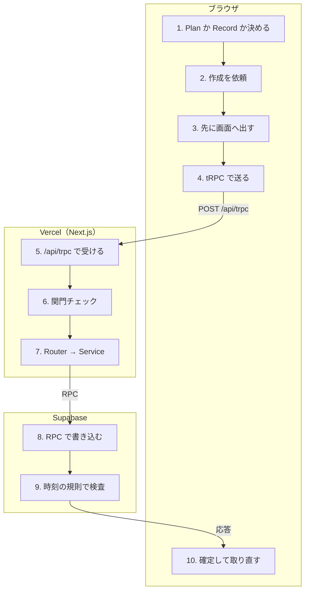

# Plan を保存

<!-- learn:generated:start — 正本 このファイルの learn:journey の JSON / 再生成 pnpm learn:generate / 検証 pnpm docs:check。この範囲は手編集しない -->

カレンダーで時間帯をドラッグし、作成パネルでアクティビティを選ぶ。選んだ瞬間に保存が走る。



通るサービス: ブラウザ / Vercel（Next.js） / Supabase。段 10・失敗 13 種。

同じ操作を別の入口から行う経路: [mcp](mcp.md)

壊して確かめる: [break-network](../labs/break-network.md)

#### この経路を守るテスト

- [`apps/product/src/lib/test/e2e/critical-path.spec.ts`](../../../apps/product/src/lib/test/e2e/critical-path.spec.ts) で `test('ドラッグ選択とアクティビティ選択で明日の Plan を作成し、リロード後も残る'` を探す（E2E。保存して再読み込みしても残ることまで見る）

### 1. Plan か Record かを決める（ブラウザ）

終了時刻が今より未来なら Plan、過去なら Record が既定になる。過去の時間帯でだけ Plan へ切り替えられる。通信のない純粋な関数。

- **なぜ必要か**: 作成画面の既定を正しくし、手数を増やさないため。規則そのものは DB が持つので、ここは先回りの写し。
- **入力 → 出力**: 選んだ時間帯の end_at と現在時刻 → 'plan' か 'record'
- **ここを変えると**: 時刻の規則を強制しているのは DB trigger で、ここはその写し。ここだけ変えても保存できるかどうかは変わらない。規則を撤去・変更する時は invariants.md §時刻 の写し表を全部たどる。
- **コード**:
  - [`apps/product/src/features/timeblock/domain/timeblock-destination.ts`](../../../apps/product/src/features/timeblock/domain/timeblock-destination.ts) で `resolveTimeblockDestination` を探す
  - [`apps/product/src/features/timeblock/domain/timeblock-destination.ts`](../../../apps/product/src/features/timeblock/domain/timeblock-destination.ts) で `resolveTimeblockKindChoice` を探す
  - [`docs/engineering/invariants.md`](../../engineering/invariants.md) で `### 規則の写しと、その分類` を探す（写しの一覧（契約変換 / UX 先回り））
- **この段を守るテスト**:
  - [`apps/product/src/features/timeblock/domain/timeblock-destination.test.ts`](../../../apps/product/src/features/timeblock/domain/timeblock-destination.test.ts) で `it('終了が現在より未来なら Plan を返す'` を探す
  - [`apps/product/src/features/calendar/components/create/InlineCreatePanel.test.tsx`](../../../apps/product/src/features/calendar/components/create/InlineCreatePanel.test.tsx) で `it('未来スロットでは記録タブが選べず、選択すると Plan を作る'` を探す

### 2. アクティビティを選ぶと作成を依頼する（ブラウザ）

作成パネルでアクティビティを選んだ瞬間に mutation を呼ぶ。送る前に、画面が持っているデータで重なりを先に確かめる（往復を減らすための写し）。成功すると「取り消し」付きのトーストを出し、取り消しは作ったものを削除する。

- **なぜ必要か**: 保存ボタンを置かず、選んだ瞬間に作ることで Google Calendar / Toggl より一手少なくする。間違えてもトーストから戻せる。
- **入力 → 出力**: 時間帯 + アクティビティ → createPlan の呼び出し
- **ここを変えると**: 作成の入口はここと、サイドバーのアクティビティタップの 2 つ。手数を変える時は両方を見る。
- **コード**:
  - [`apps/product/src/features/calendar/components/create/useInlineCreate.ts`](../../../apps/product/src/features/calendar/components/create/useInlineCreate.ts) で `mutation.mutate(` を探す
  - [`apps/product/src/features/calendar/components/create/InlineCreatePanel.tsx`](../../../apps/product/src/features/calendar/components/create/InlineCreatePanel.tsx) で `InlineCreatePanel` を探す

<details>
<summary>⚡ 画面上で重なりが見つかる — 画面: エラー表示 / データ: 変化なし / 再試行: 利用者がやり直す / 痕跡: 残らない</summary>

- 画面: 重なりのトーストが出て、作成しない。
- データ: 変化なし。サーバーへは何も送っていない。
- 再試行: なし。時間帯を変えて選び直す。
- 痕跡: 何も残らない（通信前）。
- **最初に見る場所**: 仕様どおりの挙動。サーバー側の判定（DB の排他制約）と食い違うなら、写しがずれている。
- 根拠:
  - [`apps/product/src/features/calendar/components/create/useInlineCreate.ts`](../../../apps/product/src/features/calendar/components/create/useInlineCreate.ts) で `errors.timeOverlap` を探す

</details>

### 3. 先に画面へ出す（楽観的更新）（ブラウザ）

サーバーの返事を待たず、一時 ID（temp-…）の Plan を一覧のキャッシュへ差し込む。その直前に一覧の snapshot を取っておき、失敗したらそこへ戻す。

- **なぜ必要か**: 通信を待つ間も画面を止めないため。失敗した時に元へ戻せるよう、差し込む前の状態を持っておく。
- **入力 → 出力**: 作成の入力 → 一時 ID の行が入ったキャッシュと snapshot
- **ここを変えると**: キャッシュのキーや一覧の絞り込み条件を変えると、差し込み先と巻き戻し対象がずれる。書き込み mutation を足す時は optimistic-update skill の手順に従う。
- **コード**:
  - [`apps/product/src/features/timeblock/hooks/useTimeblockWriteMutations.ts`](../../../apps/product/src/features/timeblock/hooks/useTimeblockWriteMutations.ts) で `const createPlan = api.planCommands.create.useMutation` を探す
  - [`apps/product/src/features/timeblock/hooks/useTimeblockWriteMutations.ts`](../../../apps/product/src/features/timeblock/hooks/useTimeblockWriteMutations.ts) で `snapshotTimeblockLists` を探す
  - [`docs/engineering/architecture.md`](../../engineering/architecture.md) で `### 楽観的更新のフロー` を探す
- **この段を守るテスト**:
  - [`apps/product/src/features/timeblock/hooks/useTimeblockWriteMutations.test.ts`](../../../apps/product/src/features/timeblock/hooks/useTimeblockWriteMutations.test.ts) で `it('表示期間と重なる行だけを対象にする（offset付きcreateは除外）'` を探す

<details>
<summary>⚡ ブラウザがオフライン — 画面: 待ち状態 / データ: 変化なし / 再試行: 自動で再試行 / 痕跡: 残らない</summary>

- 画面: 一時 ID の Plan が表示されたまま、応答待ちで止まる。
- データ: サーバーへは何も届いていない。
- 再試行: 失敗ではなく一時停止になる（TanStack Query の既定。mutation の networkMode は上書きしていない）。回線が戻ると自動で送り直す。ただし一時停止中の依頼は保存しない設定なので、その間にタブを閉じると消える。
- 痕跡: 何も残らない。
- **最初に見る場所**: DevTools の Network タブと navigator.onLine。ブラウザがオフラインと判定した時だけこの挙動で、回線が不安定なだけなら下の「通信が途中で切れる」になる。
- 根拠:
  - [`apps/product/src/app/[locale]/(app)/_providers/_composition/ProvidersComposition.tsx`](<../../../apps/product/src/app/[locale]/(app)/_providers/_composition/ProvidersComposition.tsx>) で `shouldDehydrateMutation: () => false` を探す
  - [`apps/product/src/lib/trpc/query-client.ts`](../../../apps/product/src/lib/trpc/query-client.ts) で `networkMode: 'offlineFirst'` を探す（query 側だけの設定。mutation には効かない）

</details>

### 4. tRPC で /api/trpc へ送る（ブラウザ）

1 本の httpBatchLink で /api/trpc へ POST する（query も POST。入力を URL やログに残さないため）。送り直し用の link は無く、timeblock の mutation は retry: false。

- **なぜ必要か**: 型の付いた 1 本の通路にまとめ、認証切れの扱い・エラー表示・Sentry を全 API で共通にするため。
- **入力 → 出力**: procedure 名と入力 → POST /api/trpc（まとめて送る）
- **ここを変えると**: link を足す・変える影響は全 API に及ぶ。エラーを受ける共通処理（401 で画面ごとログインへ移動、Sentry 送信）は QueryClient 側にある。
- **コード**:
  - [`apps/product/src/lib/trpc/browser-client.ts`](../../../apps/product/src/lib/trpc/browser-client.ts) で `httpBatchLink` を探す
  - [`apps/product/src/features/timeblock/hooks/useTimeblockWriteMutations.ts`](../../../apps/product/src/features/timeblock/hooks/useTimeblockWriteMutations.ts) で `retry: false` を探す
  - [`apps/product/src/lib/trpc/query-client.ts`](../../../apps/product/src/lib/trpc/query-client.ts) で `function handleAuthError` を探す

<details>
<summary>⚡ 通信が途中で切れる — 画面: エラー表示 / データ: どちらもありうる / 再試行: しない / 痕跡: Sentry</summary>

- 画面: 一時 ID の Plan が消え（snapshot へ戻す）、「保存に失敗」のトーストが出る。
- データ: 2 通りある。届く前に切れたなら DB は変わらない。DB で確定した後に返事だけ失われたなら、DB には Plan がある。
- 再試行: 自動では送り直さない（retry: false）。代わりに成功・失敗どちらでも一覧を取り直す（onSettled）。DB で確定していたなら取り直しで Plan が再び現れる。この時に利用者がもう一度作ると、同じ時間帯なら排他制約（23P01）で弾かれるが、サイドバーからの作成は次の空き時間に置くので、時間をずらした 2 つ目ができる。
- 痕跡: サーバーの形をしていない通信エラーとして、ブラウザから Sentry へ送る（source: trpc_client_transport）。ブラウザの Sentry は本番（VERCEL_ENV=production）で、かつ分析の同意がある時だけ動くので、無いこともある。
- **最初に見る場所**: Sentry で source:trpc_client_transport を探し、同じ時刻の Vercel の /api/trpc ログで、サーバーまで届いていたかを見る。
- 根拠:
  - [`apps/product/src/lib/trpc/client-errors.ts`](../../../apps/product/src/lib/trpc/client-errors.ts) で `trpc_client_transport` を探す
  - [`apps/product/src/features/timeblock/hooks/useTimeblockWriteMutations.ts`](../../../apps/product/src/features/timeblock/hooks/useTimeblockWriteMutations.ts) で `onSettled: invalidate` を探す
  - [`apps/product/instrumentation-client.ts`](../../../apps/product/instrumentation-client.ts) で `hasAnalyticsConsent` を探す

</details>

### 5. /api/trpc で受ける（Vercel（Next.js））

Vercel の Function（Node.js、上限 60 秒）。context を作って認証方式（session / oauth / service role）を判定し、認証前に IP 単位の rate limit を見る。

- **なぜ必要か**: 全 tRPC の共通の入口で、認証方式の判定と認証前の乱用対策を 1 か所で行うため。
- **入力 → 出力**: HTTP リクエスト（cookie） → ctx（userId・認証方式・Supabase client）
- **ここを変えると**: ここは全 tRPC 共通の入口。context に項目を足すと全 procedure の実行前コストが増える。
- **コード**:
  - [`apps/product/src/app/api/trpc/[trpc]/route.ts`](../../../apps/product/src/app/api/trpc/[trpc]/route.ts) で `createFetchTRPCContext` を探す
  - [`apps/product/src/lib/trpc/context.ts`](../../../apps/product/src/lib/trpc/context.ts) で `isPreAuthRateLimited` を探す

<details>
<summary>⚡ IP 単位の rate limit を超える（429） — 画面: エラー表示 / データ: 変化なし / 再試行: しない / 痕跡: 残らない</summary>

- 画面: 「保存に失敗」のトースト。一時 Plan は消える。
- データ: 変化なし。
- 再試行: しない。超過中に送り直すと同じ枠をさらに食い、復旧が遅れるだけなので。
- 痕跡: 想定内（TOO_MANY_REQUESTS）として Sentry には出さない。
- **最初に見る場所**: Upstash のダッシュボード。E2E が 429 に当たる時は手続きの数を数える。
- 根拠:
  - [`apps/product/src/lib/trpc/query-client.ts`](../../../apps/product/src/lib/trpc/query-client.ts) で `function isRateLimitedError` を探す
  - [`apps/product/src/lib/trpc/errors.ts`](../../../apps/product/src/lib/trpc/errors.ts) で `'TOO_MANY_REQUESTS'` を探す

</details>

<details>
<summary>⚡ Function が落ちる・時間切れ — 画面: エラー表示 / データ: どちらもありうる / 再試行: しない / 痕跡: Sentry</summary>

- 画面: 「保存に失敗」のトースト。一時 Plan は消える。
- データ: どこまで進んだかは分からない（「通信が途中で切れる」と同じ 2 通り）。
- 再試行: 自動ではしない。一覧の取り直しで実際の状態に揃う。
- 痕跡: Vercel の Function ログ。例外なら server 側の Sentry。応答が tRPC の形でない（504 や HTML）ので、ブラウザからも Sentry へ送る（本番で、かつ分析の同意がある時だけ。source: trpc_client_transport）。
- **最初に見る場所**: Vercel の status、Function ログ、直近の deploy。直近に promote があったなら runbook の Playbook 2。
- 根拠:
  - [`docs/operations/monitoring.md`](../../operations/monitoring.md) で `## Incident triage` を探す

</details>

### 6. protectedProcedure の関門を通る（Vercel（Next.js））

順に、ログインしているか → MFA の要件 → 利用権（課金）→ write fence（運用で書き込みを止めるスイッチ。mutation だけ）→ ユーザー単位の rate limit（1 分 300 回）を見る。その前に、context が認証前の IP 単位の rate limit（cookie がある時だけ）を見ている。

- **なぜ必要か**: どの procedure でも同じ順序で守りを通すため。個々の router に書くと、どこかで抜ける。
- **入力 → 出力**: ctx と procedure 名 → 通過、または TRPCError
- **ここを変えると**: 順序に理由がある。write fence を rate limit より先に見るのは、止めている間の依頼で自分の枠を使い切り、復旧直後に締め出されるのを避けるため。
- **コード**:
  - [`apps/product/src/lib/trpc/procedures.ts`](../../../apps/product/src/lib/trpc/procedures.ts) で `isWriteFenceEnabled` を探す
  - [`apps/product/src/lib/trpc/procedures.ts`](../../../apps/product/src/lib/trpc/procedures.ts) で `async function isUserRateLimited` を探す
- **この段を守るテスト**:
  - [`apps/product/src/lib/test/integration/mfa-aal-cookie-tampering.integration.test.ts`](../../../apps/product/src/lib/test/integration/mfa-aal-cookie-tampering.integration.test.ts) で `it('protectedProcedure経由でも改竄クライアントはFORBIDDEN(MFA verification required)になる'` を探す（MFA の関門だけを守る。関門の順序を通しで守るテストは紐付いていない）

<details>
<summary>⚡ セッションが切れている（401） — 画面: 別の画面へ / データ: 変化なし / 再試行: しない / 痕跡: 残らない</summary>

- 画面: /auth/login へ画面ごと移動する（キャッシュも捨てるため、意図的にハードリロード）。
- データ: 変化なし。
- 再試行: しない。ログイン後に元のパスへ戻る。
- 痕跡: 想定内の拒否なので Sentry には出ない。
- **最初に見る場所**: 頻発するなら Supabase Auth のログと、cookie を更新する middleware。
- 根拠:
  - [`apps/product/src/lib/trpc/procedures.ts`](../../../apps/product/src/lib/trpc/procedures.ts) で `code: 'UNAUTHORIZED'` を探す
  - [`apps/product/src/lib/trpc/query-client.ts`](../../../apps/product/src/lib/trpc/query-client.ts) で `function isAuthError` を探す

</details>

<details>
<summary>⚡ write fence が ON — 画面: エラー表示 / データ: 変化なし / 再試行: しない / 痕跡: 残らない</summary>

- 画面: 「保存に失敗」のトースト。すべての書き込みが同じになる。
- データ: 変化なし。読み取りは動く。
- 再試行: しない。fence を解くまで同じ結果。
- 痕跡: 運用が意図した停止なので Sentry には出さない（障害観測中に Sentry を埋めないため）。
- **最初に見る場所**: fence を ON にした経緯。解除手順は runbook。
- 根拠:
  - [`apps/product/src/lib/trpc/errors.ts`](../../../apps/product/src/lib/trpc/errors.ts) で `isWriteFencedError` を探す
  - [`docs/operations/runbook.md`](../../operations/runbook.md) で `### Write Fence 有効化（API層の書き込み停止）` を探す

</details>

<details>
<summary>⚡ Upstash（Redis）が落ちている — 画面: 何も起きない / データ: 保存される / 再試行: 不要 / 痕跡: Sentry</summary>

- 画面: 何も起きない。保存は通る。
- データ: 正常に保存される。
- 再試行: 不要。rate limit は Function のメモリ上の判定へ退避する（インスタンスごとなので制限は緩くなる）。
- 痕跡: Sentry に 2 種（認証前の IP 単位の trpc_pre_auth_rate_limit_check と、利用者単位の trpc_user_rate_limit_check）が出る。加えて本番の /api/health は Redis の失敗を error として 503 を返すので、UptimeRobot が DOWN を通知する。
- **最初に見る場所**: Upstash の status。DOWN 通知が来ても、アプリ本体が動いているかを先に確かめる。可用性を優先して通す設計なので、保存は止まっていない。
- 根拠:
  - [`apps/product/src/lib/trpc/procedures.ts`](../../../apps/product/src/lib/trpc/procedures.ts) で `trpc_user_rate_limit_check` を探す

</details>

### 7. Router → Service（Vercel（Next.js））

Router が zod で入力を検証して Service を呼ぶ。Service は command client で書き込み、成功後に利用記録（plan_created）を product_events へ送る。

- **なぜ必要か**: 入力の検証（Router）と業務の処理（Service）を分け、MCP など別の入口からも同じ Service を使えるようにするため。
- **入力 → 出力**: 検証前の入力 → command client への呼び出しと利用記録
- **ここを変えると**: 業務ロジックは Service に置き、Router に書かない（trpc-router-creating skill）。利用記録は best-effort で、失敗しても保存は取り消さない。
- **コード**:
  - [`apps/product/src/features/timeblock/server/plan-commands-router.ts`](../../../apps/product/src/features/timeblock/server/plan-commands-router.ts) で `handleServiceError` を探す
  - [`apps/product/src/features/timeblock/server/timeblock-command-service.ts`](../../../apps/product/src/features/timeblock/server/timeblock-command-service.ts) で `plan_created` を探す
  - [`docs/operations/product-analytics.md`](../../operations/product-analytics.md) で `product_events` を探す

### 8. Supabase の RPC で書き込む（Supabase）

service role の client で create_plan_command_v1 を呼び、user_id を引数で渡す。利用者のセッションからは plans / records へ直接書き込めない（authenticated には SELECT だけ許可）。Postgres のエラーコードをアプリのコードへ訳す。

- **なぜ必要か**: 書き込みを 1 つの DB 関数（1 トランザクション）にまとめ、途中で壊れた状態を残さないため。強い権限（service role）はこの adapter の中に閉じ込める。
- **入力 → 出力**: userId と Plan の値 → 作られた行、またはアプリのエラーコード
- **ここを変えると**: service role は RLS を越える。テナント分離は「この adapter が必ず user_id を渡す」ことで守っている。ここへ command を足す時は REVIEW-1（ユーザー分離）の観点で読む。
- **コード**:
  - [`apps/product/src/features/timeblock/server/timeblock-command-client.ts`](../../../apps/product/src/features/timeblock/server/timeblock-command-client.ts) で `create_plan_command_v1` を探す
  - [`apps/product/src/features/timeblock/server/timeblock-command-client.ts`](../../../apps/product/src/features/timeblock/server/timeblock-command-client.ts) で `EXPECTED_COMMAND_ERRORS` を探す
  - [`supabase/migrations/20260730090300_revoke_authenticated_timeblock_dml.sql`](../../../supabase/migrations/20260730090300_revoke_authenticated_timeblock_dml.sql) で `GRANT SELECT` を探す
- **この段を守るテスト**:
  - [`apps/product/src/features/timeblock/server/timeblock-command-client.test.ts`](../../../apps/product/src/features/timeblock/server/timeblock-command-client.test.ts) で `it('tenantとnullable fieldを原子的create commandへ閉じ込める'` を探す
  - [`apps/product/src/features/timeblock/server/timeblock-command-client.test.ts`](../../../apps/product/src/features/timeblock/server/timeblock-command-client.test.ts) で `it('deadlockだけをserver内で一度再試行する'` を探す

<details>
<summary>⚡ deadlock（40P01） — 画面: 何も起きない / データ: 保存される / 再試行: 自動で再試行 / 痕跡: 残らない</summary>

- 画面: 何も起きない。利用者は気づかない。
- データ: 正常に保存される。
- 再試行: server の adapter 内で 1 回だけ送り直す。PostgreSQL が失敗したトランザクションを中断済みなので安全、という理由でこのコードだけ。
- 痕跡: 何も残らない（2 回目も失敗すると「競合」として返る）。
- **最初に見る場所**: 不要。頻発するなら Postgres のログで lock を見る。
- 根拠:
  - [`apps/product/src/features/timeblock/server/timeblock-command-client.ts`](../../../apps/product/src/features/timeblock/server/timeblock-command-client.ts) で `if (result.error?.code === '40P01') result = await request();` を探す

</details>

<details>
<summary>⚡ 想定外の DB エラー — 画面: エラー表示 / データ: 変化なし / 再試行: しない / 痕跡: Sentry</summary>

- 画面: 「保存に失敗」のトースト。一時 Plan は消える。
- データ: RPC のトランザクションごと取り消されるので、何も残らない。
- 再試行: しない。
- 痕跡: COMMAND_FAILED として Sentry へ（feature: timeblock、operation: create_plan）。
- **最初に見る場所**: Sentry の該当 issue → 同じ時刻の Supabase の Postgres ログ。
- 根拠:
  - [`apps/product/src/features/timeblock/server/timeblock-command-client.ts`](../../../apps/product/src/features/timeblock/server/timeblock-command-client.ts) で `captureUnexpectedDatabaseError` を探す
  - [`docs/operations/runbook.md`](../../operations/runbook.md) で `## Playbook 4: Sentryエラー急増（P2）` を探す

</details>

<details>
<summary>⚡ Supabase が落ちている — 画面: 使えない / データ: 変化なし / 再試行: しない / 痕跡: 監視が拾う</summary>

- 画面: Auth まで落ちていると、サーバーが利用者を確かめられず UNAUTHORIZED になり、ログイン画面へ画面ごと移動する。DB（PostgREST）だけが落ちた時は「保存できませんでした…」のトーストになり、取り直しも失敗するので、前に取れていた表示が残る。
- データ: 変化なし。
- 再試行: 書き込みはしない。読み取りは最大 3 回、間隔を広げて送り直す。
- 痕跡: Sentry に大量に出る。UptimeRobot が /api/health の 503 で DOWN を通知する。
- **最初に見る場所**: Supabase の status page → runbook の Playbook 1。
- 根拠:
  - [`docs/operations/runbook.md`](../../operations/runbook.md) で `## Playbook 1: Supabase障害（P0）` を探す
  - [`apps/product/src/lib/trpc/session-auth-context.ts`](../../../apps/product/src/lib/trpc/session-auth-context.ts) で `if (userError || !user) return {};` を探す

</details>

### 9. DB が時刻の規則を強制する（Supabase）

規則は 2 本だけ。end_at > start_at（DT003）と、Record は未来に終われない（DT005）。重なりは排他制約（23P01）で弾く。

- **なぜ必要か**: UI・MCP・将来の入口のどこから来ても、同じ規則を必ず通すため。アプリ側の確認は往復を減らす写しにすぎない。
- **入力 → 出力**: INSERT される行 → 通過、または DT003 / DT005 / 23P01
- **ここを変えると**: 規則の正本はここ。変える時は DB → service → UI の写しを 1 変更で全部変える。DB だけ緩めて UI の写しが残ると「操作はできるのに保存されない」になる。
- **コード**:
  - [`supabase/migrations/20260904080216_simplify_timeblock_temporal_rules.sql`](../../../supabase/migrations/20260904080216_simplify_timeblock_temporal_rules.sql) で `DT003` を探す
  - [`docs/engineering/invariants.md`](../../engineering/invariants.md) で `## 時刻` を探す
- **この段を守るテスト**:
  - [`apps/product/src/lib/test/integration/timeblock-atomic-commands.integration.test.ts`](../../../apps/product/src/lib/test/integration/timeblock-atomic-commands.integration.test.ts) で `it('rejects future Records and ignores the drained legacy link argument'` を探す（DT005 を DB で確かめる）

<details>
<summary>⚡ 時刻の規則に反する（DT003 / DT005） — 画面: エラー表示 / データ: 変化なし / 再試行: しない / 痕跡: 残らない</summary>

- 画面: 規則ごとの専用文言でトーストを出す（汎用の「保存に失敗」にはしない）。
- データ: 変化なし。
- 再試行: しない。
- 痕跡: 想定内（BAD_REQUEST）なので Sentry には出ない。
- **最初に見る場所**: UI の写しがこの規則を先回りできていない可能性。invariants.md §時刻。
- 根拠:
  - [`apps/product/src/features/timeblock/hooks/useTimeblockWriteMutations.ts`](../../../apps/product/src/features/timeblock/hooks/useTimeblockWriteMutations.ts) で `const temporalRuleMessage` を探す
  - [`apps/product/src/lib/trpc/client-safe-service-code.ts`](../../../apps/product/src/lib/trpc/client-safe-service-code.ts) で `RECORD_IN_FUTURE` を探す

</details>

<details>
<summary>⚡ 既存と重なる（23P01） — 画面: エラー表示 / データ: 変化なし / 再試行: しない / 痕跡: 残らない</summary>

- 画面: 重なりの案内を出す（画面側の重なり確認をすり抜けた時。別タブで作った直後など）。
- データ: 変化なし。
- 再試行: しない。
- 痕跡: 想定内なので Sentry には出ない。
- **最初に見る場所**: 画面の一覧が古かった可能性。取り直しで揃う。
- 根拠:
  - [`apps/product/src/features/timeblock/server/timeblock-command-client.ts`](../../../apps/product/src/features/timeblock/server/timeblock-command-client.ts) で `'23P01': 'TIME_OVERLAP'` を探す

</details>

### 10. 返事で画面を確定し、関連を取り直す（ブラウザ）

一時 ID の行をサーバーの行へ差し替える。成功・失敗どちらでも statistics / review / plans / records を取り直す。Realtime の購読は無いので、別のタブや端末には次の取り直し（フォーカス復帰など）で反映される。手動で作った Plan を Google Calendar へ書き出す処理はこの経路に無い。

- **なぜ必要か**: 先に出した表示を、サーバーが確定させた事実に揃えるため。
- **入力 → 出力**: サーバーの行、またはエラー → 確定した一覧と、取り直した集計
- **ここを変えると**: 新しい集計画面を足したら、ここの取り直し対象に入れないと保存後も古い数字が残る。
- **コード**:
  - [`apps/product/src/features/timeblock/hooks/useTimeblockWriteMutations.ts`](../../../apps/product/src/features/timeblock/hooks/useTimeblockWriteMutations.ts) で `insertIntoMatchingLists('plans', created, context?.tempId)` を探す
  - [`apps/product/src/features/timeblock/hooks/useTimeblockWriteMutations.ts`](../../../apps/product/src/features/timeblock/hooks/useTimeblockWriteMutations.ts) で `void utils.plans.invalidate();` を探す
  - [`docs/engineering/infra.md`](../../engineering/infra.md) で `**Realtime は現状の浸透に含めない。**` を探す

<!-- learn:generated:end -->

## データ（正本）

この JSON がこのページの正本。上の説明と図、`pnpm learn` の対話画面はここから生成する。参照（`path` + `find`）は `pnpm docs:check` が実在を検査する。

```json learn:journey
{
  "id": "save-plan",
  "title": "Plan を保存",
  "order": 10,
  "group": "calendar",
  "intro": "カレンダーで時間帯をドラッグし、作成パネルでアクティビティを選ぶ。選んだ瞬間に保存が走る。",
  "play": "▶ 保存を押す",
  "hops": [
    {
      "id": "destination",
      "svc": "browser",
      "title": "Plan か Record かを決める",
      "what": "終了時刻が今より未来なら Plan、過去なら Record が既定になる。過去の時間帯でだけ Plan へ切り替えられる。通信のない純粋な関数。",
      "why": "作成画面の既定を正しくし、手数を増やさないため。規則そのものは DB が持つので、ここは先回りの写し。",
      "io": {
        "in": "選んだ時間帯の end_at と現在時刻",
        "out": "'plan' か 'record'"
      },
      "change": "時刻の規則を強制しているのは DB trigger で、ここはその写し。ここだけ変えても保存できるかどうかは変わらない。規則を撤去・変更する時は invariants.md §時刻 の写し表を全部たどる。",
      "refs": [
        {
          "path": "apps/product/src/features/timeblock/domain/timeblock-destination.ts",
          "find": "resolveTimeblockDestination"
        },
        {
          "path": "apps/product/src/features/timeblock/domain/timeblock-destination.ts",
          "find": "resolveTimeblockKindChoice"
        },
        {
          "path": "docs/engineering/invariants.md",
          "find": "### 規則の写しと、その分類",
          "why": "写しの一覧（契約変換 / UX 先回り）"
        }
      ],
      "fails": [],
      "short": "Plan か Record か決める",
      "screen": {
        "t": "calendar",
        "url": "/ja/calendar",
        "blocks": [
          {
            "state": "select",
            "label": "10:00–11:00"
          }
        ],
        "note": "ドラッグで時間帯を選んだところ"
      },
      "tests": [
        {
          "path": "apps/product/src/features/timeblock/domain/timeblock-destination.test.ts",
          "find": "it('終了が現在より未来なら Plan を返す'"
        },
        {
          "path": "apps/product/src/features/calendar/components/create/InlineCreatePanel.test.tsx",
          "find": "it('未来スロットでは記録タブが選べず、選択すると Plan を作る'"
        }
      ]
    },
    {
      "id": "inline-create",
      "svc": "browser",
      "title": "アクティビティを選ぶと作成を依頼する",
      "what": "作成パネルでアクティビティを選んだ瞬間に mutation を呼ぶ。送る前に、画面が持っているデータで重なりを先に確かめる（往復を減らすための写し）。成功すると「取り消し」付きのトーストを出し、取り消しは作ったものを削除する。",
      "why": "保存ボタンを置かず、選んだ瞬間に作ることで Google Calendar / Toggl より一手少なくする。間違えてもトーストから戻せる。",
      "io": {
        "in": "時間帯 + アクティビティ",
        "out": "createPlan の呼び出し"
      },
      "change": "作成の入口はここと、サイドバーのアクティビティタップの 2 つ。手数を変える時は両方を見る。",
      "refs": [
        {
          "path": "apps/product/src/features/calendar/components/create/useInlineCreate.ts",
          "find": "mutation.mutate("
        },
        {
          "path": "apps/product/src/features/calendar/components/create/InlineCreatePanel.tsx",
          "find": "InlineCreatePanel"
        }
      ],
      "fails": [
        {
          "id": "client-overlap",
          "label": "画面上で重なりが見つかる",
          "screen": "重なりのトーストが出て、作成しない。",
          "data": "変化なし。サーバーへは何も送っていない。",
          "retry": "なし。時間帯を変えて選び直す。",
          "trace": "何も残らない（通信前）。",
          "look": "仕様どおりの挙動。サーバー側の判定（DB の排他制約）と食い違うなら、写しがずれている。",
          "refs": [
            {
              "path": "apps/product/src/features/calendar/components/create/useInlineCreate.ts",
              "find": "errors.timeOverlap"
            }
          ],
          "tags": {
            "screen": "toast",
            "data": "unchanged",
            "retry": "user",
            "trace": "none"
          },
          "screenAfter": {
            "t": "calendar",
            "url": "/ja/calendar",
            "blocks": [
              {
                "state": "saved",
                "label": "既存の予定"
              }
            ],
            "toast": "この時間帯には既に予定があります",
            "toastTone": "bad"
          }
        }
      ],
      "short": "作成を依頼",
      "screen": {
        "t": "calendar",
        "url": "/ja/calendar",
        "blocks": [
          {
            "state": "select",
            "label": ""
          }
        ],
        "drawer": {
          "title": "アクティビティ",
          "items": ["仕事", "読書", "運動"],
          "on": 0
        },
        "note": "右のパネルでアクティビティを選ぶ"
      }
    },
    {
      "id": "optimistic",
      "svc": "browser",
      "title": "先に画面へ出す（楽観的更新）",
      "what": "サーバーの返事を待たず、一時 ID（temp-…）の Plan を一覧のキャッシュへ差し込む。その直前に一覧の snapshot を取っておき、失敗したらそこへ戻す。",
      "why": "通信を待つ間も画面を止めないため。失敗した時に元へ戻せるよう、差し込む前の状態を持っておく。",
      "io": {
        "in": "作成の入力",
        "out": "一時 ID の行が入ったキャッシュと snapshot"
      },
      "change": "キャッシュのキーや一覧の絞り込み条件を変えると、差し込み先と巻き戻し対象がずれる。書き込み mutation を足す時は optimistic-update skill の手順に従う。",
      "refs": [
        {
          "path": "apps/product/src/features/timeblock/hooks/useTimeblockWriteMutations.ts",
          "find": "const createPlan = api.planCommands.create.useMutation"
        },
        {
          "path": "apps/product/src/features/timeblock/hooks/useTimeblockWriteMutations.ts",
          "find": "snapshotTimeblockLists"
        },
        {
          "path": "docs/engineering/architecture.md",
          "find": "### 楽観的更新のフロー"
        }
      ],
      "fails": [
        {
          "id": "offline",
          "label": "ブラウザがオフライン",
          "screen": "一時 ID の Plan が表示されたまま、応答待ちで止まる。",
          "data": "サーバーへは何も届いていない。",
          "retry": "失敗ではなく一時停止になる（TanStack Query の既定。mutation の networkMode は上書きしていない）。回線が戻ると自動で送り直す。ただし一時停止中の依頼は保存しない設定なので、その間にタブを閉じると消える。",
          "trace": "何も残らない。",
          "look": "DevTools の Network タブと navigator.onLine。ブラウザがオフラインと判定した時だけこの挙動で、回線が不安定なだけなら下の「通信が途中で切れる」になる。",
          "refs": [
            {
              "path": "apps/product/src/app/[locale]/(app)/_providers/_composition/ProvidersComposition.tsx",
              "find": "shouldDehydrateMutation: () => false"
            },
            {
              "path": "apps/product/src/lib/trpc/query-client.ts",
              "find": "networkMode: 'offlineFirst'",
              "why": "query 側だけの設定。mutation には効かない"
            }
          ],
          "tags": {
            "screen": "wait",
            "data": "unchanged",
            "retry": "auto",
            "trace": "none"
          },
          "screenAfter": {
            "t": "calendar",
            "url": "/ja/calendar",
            "blocks": [
              {
                "state": "temp",
                "label": "仕事（保存中）"
              }
            ],
            "note": "回線が戻るまでこのまま。タブを閉じるとこの保存は消える"
          }
        }
      ],
      "short": "先に画面へ出す",
      "screen": {
        "t": "calendar",
        "url": "/ja/calendar",
        "blocks": [
          {
            "state": "temp",
            "label": "仕事（保存中）"
          }
        ],
        "note": "サーバーの返事を待たずに出す。以降の段の間、利用者はこの表示のまま操作を続けられる"
      },
      "tests": [
        {
          "path": "apps/product/src/features/timeblock/hooks/useTimeblockWriteMutations.test.ts",
          "find": "it('表示期間と重なる行だけを対象にする（offset付きcreateは除外）'"
        }
      ]
    },
    {
      "id": "trpc-client",
      "svc": "browser",
      "title": "tRPC で /api/trpc へ送る",
      "what": "1 本の httpBatchLink で /api/trpc へ POST する（query も POST。入力を URL やログに残さないため）。送り直し用の link は無く、timeblock の mutation は retry: false。",
      "why": "型の付いた 1 本の通路にまとめ、認証切れの扱い・エラー表示・Sentry を全 API で共通にするため。",
      "io": {
        "in": "procedure 名と入力",
        "out": "POST /api/trpc（まとめて送る）"
      },
      "change": "link を足す・変える影響は全 API に及ぶ。エラーを受ける共通処理（401 で画面ごとログインへ移動、Sentry 送信）は QueryClient 側にある。",
      "refs": [
        {
          "path": "apps/product/src/lib/trpc/browser-client.ts",
          "find": "httpBatchLink"
        },
        {
          "path": "apps/product/src/features/timeblock/hooks/useTimeblockWriteMutations.ts",
          "find": "retry: false"
        },
        {
          "path": "apps/product/src/lib/trpc/query-client.ts",
          "find": "function handleAuthError"
        }
      ],
      "fails": [
        {
          "id": "network-lost",
          "label": "通信が途中で切れる",
          "screen": "一時 ID の Plan が消え（snapshot へ戻す）、「保存に失敗」のトーストが出る。",
          "data": "2 通りある。届く前に切れたなら DB は変わらない。DB で確定した後に返事だけ失われたなら、DB には Plan がある。",
          "retry": "自動では送り直さない（retry: false）。代わりに成功・失敗どちらでも一覧を取り直す（onSettled）。DB で確定していたなら取り直しで Plan が再び現れる。この時に利用者がもう一度作ると、同じ時間帯なら排他制約（23P01）で弾かれるが、サイドバーからの作成は次の空き時間に置くので、時間をずらした 2 つ目ができる。",
          "trace": "サーバーの形をしていない通信エラーとして、ブラウザから Sentry へ送る（source: trpc_client_transport）。ブラウザの Sentry は本番（VERCEL_ENV=production）で、かつ分析の同意がある時だけ動くので、無いこともある。",
          "look": "Sentry で source:trpc_client_transport を探し、同じ時刻の Vercel の /api/trpc ログで、サーバーまで届いていたかを見る。",
          "refs": [
            {
              "path": "apps/product/src/lib/trpc/client-errors.ts",
              "find": "trpc_client_transport"
            },
            {
              "path": "apps/product/src/features/timeblock/hooks/useTimeblockWriteMutations.ts",
              "find": "onSettled: invalidate"
            },
            {
              "path": "apps/product/instrumentation-client.ts",
              "find": "hasAnalyticsConsent"
            }
          ],
          "tags": {
            "screen": "toast",
            "data": "unknown",
            "retry": "none",
            "trace": "sentry"
          },
          "to": "optimistic",
          "back": "巻き戻し + トースト",
          "screenAfter": {
            "t": "calendar",
            "url": "/ja/calendar",
            "blocks": [
              {
                "state": "gone",
                "label": "消えた"
              }
            ],
            "toast": "保存できませんでした。入力内容は保持されています。もう一度お試しください",
            "toastTone": "bad",
            "note": "一覧を取り直した時、DB で確定していたなら Plan が再び現れる"
          }
        }
      ],
      "short": "tRPC で送る"
    },
    {
      "id": "route",
      "svc": "vercel",
      "title": "/api/trpc で受ける",
      "what": "Vercel の Function（Node.js、上限 60 秒）。context を作って認証方式（session / oauth / service role）を判定し、認証前に IP 単位の rate limit を見る。",
      "why": "全 tRPC の共通の入口で、認証方式の判定と認証前の乱用対策を 1 か所で行うため。",
      "io": {
        "in": "HTTP リクエスト（cookie）",
        "out": "ctx（userId・認証方式・Supabase client）"
      },
      "change": "ここは全 tRPC 共通の入口。context に項目を足すと全 procedure の実行前コストが増える。",
      "refs": [
        {
          "path": "apps/product/src/app/api/trpc/[trpc]/route.ts",
          "find": "createFetchTRPCContext"
        },
        {
          "path": "apps/product/src/lib/trpc/context.ts",
          "find": "isPreAuthRateLimited"
        }
      ],
      "fails": [
        {
          "id": "ip-rate-limit",
          "label": "IP 単位の rate limit を超える（429）",
          "screen": "「保存に失敗」のトースト。一時 Plan は消える。",
          "data": "変化なし。",
          "retry": "しない。超過中に送り直すと同じ枠をさらに食い、復旧が遅れるだけなので。",
          "trace": "想定内（TOO_MANY_REQUESTS）として Sentry には出さない。",
          "look": "Upstash のダッシュボード。E2E が 429 に当たる時は手続きの数を数える。",
          "refs": [
            {
              "path": "apps/product/src/lib/trpc/query-client.ts",
              "find": "function isRateLimitedError"
            },
            {
              "path": "apps/product/src/lib/trpc/errors.ts",
              "find": "'TOO_MANY_REQUESTS'"
            }
          ],
          "tags": {
            "screen": "toast",
            "data": "unchanged",
            "retry": "none",
            "trace": "none"
          },
          "to": "optimistic",
          "back": "巻き戻し + トースト",
          "screenAfter": {
            "t": "calendar",
            "url": "/ja/calendar",
            "blocks": [
              {
                "state": "gone",
                "label": "消えた"
              }
            ],
            "toast": "保存できませんでした。入力内容は保持されています。もう一度お試しください",
            "toastTone": "bad"
          }
        },
        {
          "id": "function-down",
          "label": "Function が落ちる・時間切れ",
          "screen": "「保存に失敗」のトースト。一時 Plan は消える。",
          "data": "どこまで進んだかは分からない（「通信が途中で切れる」と同じ 2 通り）。",
          "retry": "自動ではしない。一覧の取り直しで実際の状態に揃う。",
          "trace": "Vercel の Function ログ。例外なら server 側の Sentry。応答が tRPC の形でない（504 や HTML）ので、ブラウザからも Sentry へ送る（本番で、かつ分析の同意がある時だけ。source: trpc_client_transport）。",
          "look": "Vercel の status、Function ログ、直近の deploy。直近に promote があったなら runbook の Playbook 2。",
          "refs": [
            {
              "path": "docs/operations/monitoring.md",
              "find": "## Incident triage"
            }
          ],
          "tags": {
            "screen": "toast",
            "data": "unknown",
            "retry": "none",
            "trace": "sentry"
          },
          "to": "optimistic",
          "back": "巻き戻し + トースト",
          "screenAfter": {
            "t": "calendar",
            "url": "/ja/calendar",
            "blocks": [
              {
                "state": "gone",
                "label": "消えた"
              }
            ],
            "toast": "保存できませんでした。入力内容は保持されています。もう一度お試しください",
            "toastTone": "bad"
          }
        }
      ],
      "short": "/api/trpc で受ける",
      "via": "POST /api/trpc"
    },
    {
      "id": "procedure",
      "svc": "vercel",
      "title": "protectedProcedure の関門を通る",
      "what": "順に、ログインしているか → MFA の要件 → 利用権（課金）→ write fence（運用で書き込みを止めるスイッチ。mutation だけ）→ ユーザー単位の rate limit（1 分 300 回）を見る。その前に、context が認証前の IP 単位の rate limit（cookie がある時だけ）を見ている。",
      "why": "どの procedure でも同じ順序で守りを通すため。個々の router に書くと、どこかで抜ける。",
      "io": {
        "in": "ctx と procedure 名",
        "out": "通過、または TRPCError"
      },
      "change": "順序に理由がある。write fence を rate limit より先に見るのは、止めている間の依頼で自分の枠を使い切り、復旧直後に締め出されるのを避けるため。",
      "refs": [
        {
          "path": "apps/product/src/lib/trpc/procedures.ts",
          "find": "isWriteFenceEnabled"
        },
        {
          "path": "apps/product/src/lib/trpc/procedures.ts",
          "find": "async function isUserRateLimited"
        }
      ],
      "fails": [
        {
          "id": "session-expired",
          "label": "セッションが切れている（401）",
          "screen": "/auth/login へ画面ごと移動する（キャッシュも捨てるため、意図的にハードリロード）。",
          "data": "変化なし。",
          "retry": "しない。ログイン後に元のパスへ戻る。",
          "trace": "想定内の拒否なので Sentry には出ない。",
          "look": "頻発するなら Supabase Auth のログと、cookie を更新する middleware。",
          "refs": [
            {
              "path": "apps/product/src/lib/trpc/procedures.ts",
              "find": "code: 'UNAUTHORIZED'"
            },
            {
              "path": "apps/product/src/lib/trpc/query-client.ts",
              "find": "function isAuthError"
            }
          ],
          "tags": {
            "screen": "redirect",
            "data": "unchanged",
            "retry": "none",
            "trace": "none"
          },
          "to": "optimistic",
          "back": "ログイン画面へ",
          "screenAfter": {
            "t": "form",
            "title": "サインイン",
            "url": "/ja/auth/login?redirect=%2Fja%2Fcalendar",
            "fields": [
              ["メールアドレス", "m@example.com"],
              ["パスワード", "••••••••"]
            ],
            "extra": "Cloudflare Turnstile ✓",
            "button": "サインイン",
            "alt": "Google でサインイン"
          }
        },
        {
          "id": "write-fence",
          "label": "write fence が ON",
          "screen": "「保存に失敗」のトースト。すべての書き込みが同じになる。",
          "data": "変化なし。読み取りは動く。",
          "retry": "しない。fence を解くまで同じ結果。",
          "trace": "運用が意図した停止なので Sentry には出さない（障害観測中に Sentry を埋めないため）。",
          "look": "fence を ON にした経緯。解除手順は runbook。",
          "refs": [
            {
              "path": "apps/product/src/lib/trpc/errors.ts",
              "find": "isWriteFencedError"
            },
            {
              "path": "docs/operations/runbook.md",
              "find": "### Write Fence 有効化（API層の書き込み停止）"
            }
          ],
          "tags": {
            "screen": "toast",
            "data": "unchanged",
            "retry": "none",
            "trace": "none"
          },
          "to": "optimistic",
          "back": "巻き戻し + トースト",
          "screenAfter": {
            "t": "calendar",
            "url": "/ja/calendar",
            "blocks": [
              {
                "state": "gone",
                "label": "消えた"
              }
            ],
            "toast": "保存できませんでした。入力内容は保持されています。もう一度お試しください",
            "toastTone": "bad"
          }
        },
        {
          "id": "upstash-down",
          "label": "Upstash（Redis）が落ちている",
          "screen": "何も起きない。保存は通る。",
          "data": "正常に保存される。",
          "retry": "不要。rate limit は Function のメモリ上の判定へ退避する（インスタンスごとなので制限は緩くなる）。",
          "trace": "Sentry に 2 種（認証前の IP 単位の trpc_pre_auth_rate_limit_check と、利用者単位の trpc_user_rate_limit_check）が出る。加えて本番の /api/health は Redis の失敗を error として 503 を返すので、UptimeRobot が DOWN を通知する。",
          "look": "Upstash の status。DOWN 通知が来ても、アプリ本体が動いているかを先に確かめる。可用性を優先して通す設計なので、保存は止まっていない。",
          "refs": [
            {
              "path": "apps/product/src/lib/trpc/procedures.ts",
              "find": "trpc_user_rate_limit_check"
            }
          ],
          "tags": {
            "screen": "none",
            "data": "saved",
            "retry": "na",
            "trace": "sentry"
          },
          "continues": true,
          "screenAfter": {
            "t": "calendar",
            "url": "/ja/calendar",
            "blocks": [
              {
                "state": "saved",
                "label": "仕事"
              }
            ],
            "toast": "予定を追加しました ✓",
            "toastAction": "元に戻す"
          }
        }
      ],
      "short": "関門チェック",
      "tests": [
        {
          "path": "apps/product/src/lib/test/integration/mfa-aal-cookie-tampering.integration.test.ts",
          "find": "it('protectedProcedure経由でも改竄クライアントはFORBIDDEN(MFA verification required)になる'",
          "why": "MFA の関門だけを守る。関門の順序を通しで守るテストは紐付いていない"
        }
      ]
    },
    {
      "id": "router-service",
      "svc": "vercel",
      "title": "Router → Service",
      "what": "Router が zod で入力を検証して Service を呼ぶ。Service は command client で書き込み、成功後に利用記録（plan_created）を product_events へ送る。",
      "why": "入力の検証（Router）と業務の処理（Service）を分け、MCP など別の入口からも同じ Service を使えるようにするため。",
      "io": {
        "in": "検証前の入力",
        "out": "command client への呼び出しと利用記録"
      },
      "change": "業務ロジックは Service に置き、Router に書かない（trpc-router-creating skill）。利用記録は best-effort で、失敗しても保存は取り消さない。",
      "refs": [
        {
          "path": "apps/product/src/features/timeblock/server/plan-commands-router.ts",
          "find": "handleServiceError"
        },
        {
          "path": "apps/product/src/features/timeblock/server/timeblock-command-service.ts",
          "find": "plan_created"
        },
        {
          "path": "docs/operations/product-analytics.md",
          "find": "product_events"
        }
      ],
      "fails": [],
      "short": "Router → Service"
    },
    {
      "id": "command-client",
      "svc": "supabase",
      "title": "Supabase の RPC で書き込む",
      "what": "service role の client で create_plan_command_v1 を呼び、user_id を引数で渡す。利用者のセッションからは plans / records へ直接書き込めない（authenticated には SELECT だけ許可）。Postgres のエラーコードをアプリのコードへ訳す。",
      "why": "書き込みを 1 つの DB 関数（1 トランザクション）にまとめ、途中で壊れた状態を残さないため。強い権限（service role）はこの adapter の中に閉じ込める。",
      "io": {
        "in": "userId と Plan の値",
        "out": "作られた行、またはアプリのエラーコード"
      },
      "change": "service role は RLS を越える。テナント分離は「この adapter が必ず user_id を渡す」ことで守っている。ここへ command を足す時は REVIEW-1（ユーザー分離）の観点で読む。",
      "refs": [
        {
          "path": "apps/product/src/features/timeblock/server/timeblock-command-client.ts",
          "find": "create_plan_command_v1"
        },
        {
          "path": "apps/product/src/features/timeblock/server/timeblock-command-client.ts",
          "find": "EXPECTED_COMMAND_ERRORS"
        },
        {
          "path": "supabase/migrations/20260730090300_revoke_authenticated_timeblock_dml.sql",
          "find": "GRANT SELECT"
        }
      ],
      "fails": [
        {
          "id": "deadlock",
          "label": "deadlock（40P01）",
          "screen": "何も起きない。利用者は気づかない。",
          "data": "正常に保存される。",
          "retry": "server の adapter 内で 1 回だけ送り直す。PostgreSQL が失敗したトランザクションを中断済みなので安全、という理由でこのコードだけ。",
          "trace": "何も残らない（2 回目も失敗すると「競合」として返る）。",
          "look": "不要。頻発するなら Postgres のログで lock を見る。",
          "refs": [
            {
              "path": "apps/product/src/features/timeblock/server/timeblock-command-client.ts",
              "find": "if (result.error?.code === '40P01') result = await request();"
            }
          ],
          "tags": {
            "screen": "none",
            "data": "saved",
            "retry": "auto",
            "trace": "none"
          },
          "continues": true,
          "screenAfter": {
            "t": "calendar",
            "url": "/ja/calendar",
            "blocks": [
              {
                "state": "saved",
                "label": "仕事"
              }
            ],
            "toast": "予定を追加しました ✓",
            "toastAction": "元に戻す"
          }
        },
        {
          "id": "db-unexpected",
          "label": "想定外の DB エラー",
          "screen": "「保存に失敗」のトースト。一時 Plan は消える。",
          "data": "RPC のトランザクションごと取り消されるので、何も残らない。",
          "retry": "しない。",
          "trace": "COMMAND_FAILED として Sentry へ（feature: timeblock、operation: create_plan）。",
          "look": "Sentry の該当 issue → 同じ時刻の Supabase の Postgres ログ。",
          "refs": [
            {
              "path": "apps/product/src/features/timeblock/server/timeblock-command-client.ts",
              "find": "captureUnexpectedDatabaseError"
            },
            {
              "path": "docs/operations/runbook.md",
              "find": "## Playbook 4: Sentryエラー急増（P2）"
            }
          ],
          "tags": {
            "screen": "toast",
            "data": "unchanged",
            "retry": "none",
            "trace": "sentry"
          },
          "to": "optimistic",
          "back": "巻き戻し + トースト",
          "screenAfter": {
            "t": "calendar",
            "url": "/ja/calendar",
            "blocks": [
              {
                "state": "gone",
                "label": "消えた"
              }
            ],
            "toast": "保存できませんでした。入力内容は保持されています。もう一度お試しください",
            "toastTone": "bad"
          }
        },
        {
          "id": "supabase-down",
          "label": "Supabase が落ちている",
          "screen": "Auth まで落ちていると、サーバーが利用者を確かめられず UNAUTHORIZED になり、ログイン画面へ画面ごと移動する。DB（PostgREST）だけが落ちた時は「保存できませんでした…」のトーストになり、取り直しも失敗するので、前に取れていた表示が残る。",
          "data": "変化なし。",
          "retry": "書き込みはしない。読み取りは最大 3 回、間隔を広げて送り直す。",
          "trace": "Sentry に大量に出る。UptimeRobot が /api/health の 503 で DOWN を通知する。",
          "look": "Supabase の status page → runbook の Playbook 1。",
          "refs": [
            {
              "path": "docs/operations/runbook.md",
              "find": "## Playbook 1: Supabase障害（P0）"
            },
            {
              "path": "apps/product/src/lib/trpc/session-auth-context.ts",
              "find": "if (userError || !user) return {};"
            }
          ],
          "tags": {
            "screen": "down",
            "data": "unchanged",
            "retry": "none",
            "trace": "monitor"
          },
          "to": "optimistic",
          "back": "ログイン画面へ / 保存失敗",
          "screenAfter": {
            "t": "form",
            "title": "サインイン",
            "url": "/ja/auth/login?redirect=%2Fja%2Fcalendar",
            "fields": [
              ["メールアドレス", ""],
              ["パスワード", ""]
            ],
            "button": "サインイン",
            "alt": "Google でサインイン",
            "note": "Auth まで落ちた時。DB だけなら保存失敗のトースト"
          }
        }
      ],
      "short": "RPC で書き込む",
      "via": "RPC",
      "tests": [
        {
          "path": "apps/product/src/features/timeblock/server/timeblock-command-client.test.ts",
          "find": "it('tenantとnullable fieldを原子的create commandへ閉じ込める'"
        },
        {
          "path": "apps/product/src/features/timeblock/server/timeblock-command-client.test.ts",
          "find": "it('deadlockだけをserver内で一度再試行する'"
        }
      ]
    },
    {
      "id": "db-trigger",
      "svc": "supabase",
      "title": "DB が時刻の規則を強制する",
      "what": "規則は 2 本だけ。end_at > start_at（DT003）と、Record は未来に終われない（DT005）。重なりは排他制約（23P01）で弾く。",
      "why": "UI・MCP・将来の入口のどこから来ても、同じ規則を必ず通すため。アプリ側の確認は往復を減らす写しにすぎない。",
      "io": {
        "in": "INSERT される行",
        "out": "通過、または DT003 / DT005 / 23P01"
      },
      "change": "規則の正本はここ。変える時は DB → service → UI の写しを 1 変更で全部変える。DB だけ緩めて UI の写しが残ると「操作はできるのに保存されない」になる。",
      "refs": [
        {
          "path": "supabase/migrations/20260904080216_simplify_timeblock_temporal_rules.sql",
          "find": "DT003"
        },
        {
          "path": "docs/engineering/invariants.md",
          "find": "## 時刻"
        }
      ],
      "fails": [
        {
          "id": "rule-violation",
          "label": "時刻の規則に反する（DT003 / DT005）",
          "screen": "規則ごとの専用文言でトーストを出す（汎用の「保存に失敗」にはしない）。",
          "data": "変化なし。",
          "retry": "しない。",
          "trace": "想定内（BAD_REQUEST）なので Sentry には出ない。",
          "look": "UI の写しがこの規則を先回りできていない可能性。invariants.md §時刻。",
          "refs": [
            {
              "path": "apps/product/src/features/timeblock/hooks/useTimeblockWriteMutations.ts",
              "find": "const temporalRuleMessage"
            },
            {
              "path": "apps/product/src/lib/trpc/client-safe-service-code.ts",
              "find": "RECORD_IN_FUTURE"
            }
          ],
          "tags": {
            "screen": "toast",
            "data": "unchanged",
            "retry": "none",
            "trace": "none"
          },
          "to": "optimistic",
          "back": "規則ごとの文言",
          "screenAfter": {
            "t": "calendar",
            "url": "/ja/calendar",
            "blocks": [
              {
                "state": "gone",
                "label": "消えた"
              }
            ],
            "toast": "終了時刻は開始時刻より後にしてください",
            "toastTone": "bad"
          }
        },
        {
          "id": "overlap",
          "label": "既存と重なる（23P01）",
          "screen": "重なりの案内を出す（画面側の重なり確認をすり抜けた時。別タブで作った直後など）。",
          "data": "変化なし。",
          "retry": "しない。",
          "trace": "想定内なので Sentry には出ない。",
          "look": "画面の一覧が古かった可能性。取り直しで揃う。",
          "refs": [
            {
              "path": "apps/product/src/features/timeblock/server/timeblock-command-client.ts",
              "find": "'23P01': 'TIME_OVERLAP'"
            }
          ],
          "tags": {
            "screen": "toast",
            "data": "unchanged",
            "retry": "none",
            "trace": "none"
          },
          "to": "optimistic",
          "back": "重なりの案内",
          "screenAfter": {
            "t": "calendar",
            "url": "/ja/calendar",
            "blocks": [
              {
                "state": "gone",
                "label": "消えた"
              }
            ],
            "toast": "この時間帯には既に記録があります",
            "toastTone": "bad"
          }
        }
      ],
      "short": "時刻の規則で検査",
      "tests": [
        {
          "path": "apps/product/src/lib/test/integration/timeblock-atomic-commands.integration.test.ts",
          "find": "it('rejects future Records and ignores the drained legacy link argument'",
          "why": "DT005 を DB で確かめる"
        }
      ]
    },
    {
      "id": "settle",
      "svc": "browser",
      "title": "返事で画面を確定し、関連を取り直す",
      "what": "一時 ID の行をサーバーの行へ差し替える。成功・失敗どちらでも statistics / review / plans / records を取り直す。Realtime の購読は無いので、別のタブや端末には次の取り直し（フォーカス復帰など）で反映される。手動で作った Plan を Google Calendar へ書き出す処理はこの経路に無い。",
      "why": "先に出した表示を、サーバーが確定させた事実に揃えるため。",
      "io": {
        "in": "サーバーの行、またはエラー",
        "out": "確定した一覧と、取り直した集計"
      },
      "change": "新しい集計画面を足したら、ここの取り直し対象に入れないと保存後も古い数字が残る。",
      "refs": [
        {
          "path": "apps/product/src/features/timeblock/hooks/useTimeblockWriteMutations.ts",
          "find": "insertIntoMatchingLists('plans', created, context?.tempId)"
        },
        {
          "path": "apps/product/src/features/timeblock/hooks/useTimeblockWriteMutations.ts",
          "find": "void utils.plans.invalidate();"
        },
        {
          "path": "docs/engineering/infra.md",
          "find": "**Realtime は現状の浸透に含めない。**"
        }
      ],
      "fails": [],
      "short": "確定して取り直す",
      "via": "応答",
      "screen": {
        "t": "calendar",
        "url": "/ja/calendar",
        "blocks": [
          {
            "state": "saved",
            "label": "仕事"
          }
        ],
        "toast": "予定を追加しました ✓",
        "toastAction": "元に戻す"
      }
    }
  ],
  "lanes": ["browser", "vercel", "supabase"],
  "lab": "break-network",
  "twin": "mcp",
  "tests": [
    {
      "path": "apps/product/src/lib/test/e2e/critical-path.spec.ts",
      "find": "test('ドラッグ選択とアクティビティ選択で明日の Plan を作成し、リロード後も残る'",
      "why": "E2E。保存して再読み込みしても残ることまで見る"
    }
  ]
}
```
