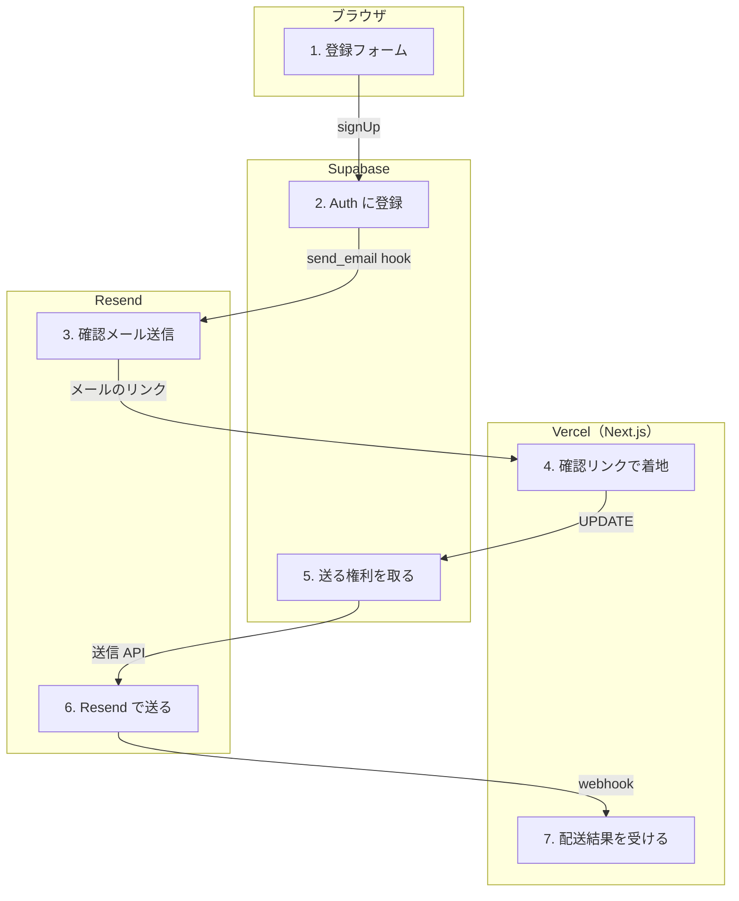

# サインアップ → ウェルカムメール

<!-- learn:generated:start — 正本 このファイルの learn:journey の JSON / 再生成 pnpm learn:generate / 検証 pnpm docs:check。この範囲は手編集しない -->

メールアドレスで登録し、確認メールのリンクを押す。確認が済むと、1 回だけウェルカムメールが届く。メールは 2 つの別経路で送られる。



通るサービス: ブラウザ / Vercel（Next.js） / Supabase / Resend。段 7・失敗 12 種。

#### この経路を守るテスト

- [`apps/product/src/lib/test/e2e/auth.spec.ts`](../../../apps/product/src/lib/test/e2e/auth.spec.ts) で `test('サインアップページがフォームと規約・ログイン導線を配信する'` を探す（画面が出るところまで。登録からメールまでを通しで守る E2E は無い）

### 1. 登録フォーム（Turnstile と漏洩パスワード確認）（ブラウザ）

Cloudflare Turnstile の token を取り、パスワードが既知の漏洩に含まれないかを Have I Been Pwned で確かめる。

- **ここを変えると**: Turnstile の secret は app の env ではなく Supabase Auth の Bot Protection にある。site key と secret は別の場所で管理している。
- **コード**:
  - [`apps/product/src/features/auth/components/SignupForm.tsx`](../../../apps/product/src/features/auth/components/SignupForm.tsx) で `safeCheckPasswordPwned` を探す
  - [`apps/product/src/lib/turnstile/config.ts`](../../../apps/product/src/lib/turnstile/config.ts) で `isTurnstileEnabled` を探す
  - [`docs/engineering/infra.md`](../../engineering/infra.md) で `## Bot 対策（Cloudflare Turnstile）` を探す

<details>
<summary>⚡ 漏洩パスワード確認が失敗する — 画面: 何も起きない / データ: 保存される / 再試行: 不要 / 痕跡: ログだけ</summary>

- 画面: 何も起きない。登録は続く。
- データ: 登録される。
- 再試行: しない。確認を諦めて通す（fail-open）。
- 痕跡: logger（通信失敗・時間切れは error、応答が正常でない時は warn）のログだけ。Sentry の issue にはならない。
- **最初に見る場所**: 急ぎではない。
- 根拠:
  - [`apps/product/src/features/auth/components/SignupForm.tsx`](../../../apps/product/src/features/auth/components/SignupForm.tsx) で `safeCheckPasswordPwned` を探す

</details>

<details>
<summary>⚡ Turnstile の site key が未設定 — 画面: 設定次第 / データ: どちらもありうる / 再試行: しない / 痕跡: 残らない</summary>

- 画面: 画面側の確認が黙って無効になる。Supabase Auth 側の Bot Protection が有効なら、token が無いので登録は拒否されエラーが出る。
- データ: Supabase 側の設定次第。
- 再試行: しない。
- 痕跡: 画面側には何も残らない。
- **最初に見る場所**: NEXT_PUBLIC_TURNSTILE_SITE_KEY の有無と、Supabase の Bot Protection 設定。
- 根拠:
  - [`apps/product/src/env.ts`](../../../apps/product/src/env.ts) で `NEXT_PUBLIC_TURNSTILE_SITE_KEY` を探す

</details>

### 2. Supabase Auth に登録を依頼する（Supabase）

ブラウザから supabase.auth.signUp を呼ぶ（Turnstile の token も渡す）。ここは tRPC を通らない。

- **ここを変えると**: 認証は Supabase に最も深く依存している部分。乗り換えの重さは出口コスト台帳。
- **コード**:
  - [`apps/product/src/features/auth/stores/useAuthStore.ts`](../../../apps/product/src/features/auth/stores/useAuthStore.ts) で `supabase.auth.signUp` を探す
  - [`docs/engineering/infra.md`](../../engineering/infra.md) で `## 出口コスト台帳` を探す

<details>
<summary>⚡ Supabase Auth がエラーを返す — 画面: エラー表示 / データ: 変化なし / 再試行: 利用者がやり直す / 痕跡: Sentry</summary>

- 画面: フォームにエラー文言が出る（生の文言ではなく、安全な翻訳キーへ変換したもの）。
- データ: 登録されない。
- 再試行: しない。利用者が押し直す。
- 痕跡: 想定外のエラーなら Sentry（captureUnexpectedAuthError）。
- **最初に見る場所**: Supabase の Auth ログ。
- 根拠:
  - [`apps/product/src/features/auth/stores/useAuthStore.ts`](../../../apps/product/src/features/auth/stores/useAuthStore.ts) で `captureUnexpectedAuthError` を探す

</details>

### 3. 確認メールを送る（Edge Function → Resend）（Resend）

Supabase Auth の send_email hook が Edge Function send-auth-email を呼び、React Email で組み立てて Resend で送る。hook の署名を検証し、idempotency key を付けて重複配送を防ぐ。

- **ここを変えると**: この Function は Vercel ではなく Supabase にデプロイされる（supabase functions deploy --use-api）。アプリの deploy とは別に動く。
- **コード**:
  - [`supabase/functions/send-auth-email/index.ts`](../../../supabase/functions/send-auth-email/index.ts) で `buildAuthEmailIdempotencyKey` を探す
  - [`supabase/functions/send-auth-email/index.ts`](../../../supabase/functions/send-auth-email/index.ts) で `captureEdgeFunctionEvent` を探す

<details>
<summary>⚡ Resend が確認メールを送れない — 画面: エラー表示 / データ: どちらもありうる / 再試行: 条件次第 / 痕跡: Sentry</summary>

- 画面: Supabase Auth は signUp にエラーを返すので、登録エラーとして見える。
- データ: ユーザー行が残るかどうかは Supabase Auth 側の挙動で、この repo では確かめていない。
- 再試行: Function は再試行可能かどうかを status で Supabase に伝える。すでに一部送れていて idempotency key も無い時は、重複を避けて再試行不可として返す。
- 痕跡: Edge Function から Sentry へ（send-auth-email failed: …）。宛先は記録しない。
- **最初に見る場所**: Resend のダッシュボード → Supabase の Edge Function ログ。
- 根拠:
  - [`supabase/functions/send-auth-email/index.ts`](../../../supabase/functions/send-auth-email/index.ts) で `resolveSendAuthEmailStatus` を探す

</details>

### 4. 確認リンクで着地する（Vercel（Next.js））

/auth/confirm が verifyOtp で確かめる。成否は verifyOtp の error で分ける。成功した時、session があれば next（既定は /calendar）へ、無ければ /auth/confirmed?status=email_confirmed へ送る。失敗（無効・期限切れ・使用済み）は素のエラーではなく /auth/confirmed?status=failed に着地させる。新規登録の確認が成功した時だけウェルカムメールを依頼する。

- **ここを変えると**: email_change / recovery も同じ route を通る。ウェルカムメールは type が signup の時だけ。
- **コード**:
  - [`apps/product/src/app/[locale]/(auth)/auth/confirm/route.ts`](<../../../apps/product/src/app/[locale]/(auth)/auth/confirm/route.ts>) で `deliverWelcomeEmailOnce(signupUserId)` を探す
  - [`apps/product/src/app/[locale]/(auth)/auth/callback/route.ts`](<../../../apps/product/src/app/[locale]/(auth)/auth/callback/route.ts>) で `deliverWelcomeEmailOnce` を探す（Google ログインで登録した場合の入口）

<details>
<summary>⚡ リンクが無効・期限切れ — 画面: 別の画面へ / データ: 変化なし / 再試行: 利用者がやり直す / 痕跡: 残らない</summary>

- 画面: /auth/confirmed に状態付きで着地する。
- データ: 確認されない。
- 再試行: しない。確認メールを送り直してもらう。
- 痕跡: 想定内。
- **最初に見る場所**: Supabase の Auth ログ。Redirect URLs の allowlist がずれていないか。
- 根拠:
  - [`apps/product/src/app/[locale]/(auth)/auth/confirm/route.ts`](<../../../apps/product/src/app/[locale]/(auth)/auth/confirm/route.ts>) で `confirmedUrl` を探す

</details>

### 5. ウェルカムメールの「送る権利」を先に取る（Supabase）

profiles.welcome_email_sent_at が空の行だけを更新し、更新できた 1 回だけが送る。送ってから記録するのではなく、記録してから送る。途中で落ちたら重複ではなく欠落に倒す設計。

- **ここを変えると**: 1 回限りの通知を足す時の手本。列を足すだけだと既存ユーザー全員へ次のサインインで飛ぶので、migration 時点の既存行を送信済みで埋める。
- **コード**:
  - [`apps/product/src/features/auth/server/welcome-email.ts`](../../../apps/product/src/features/auth/server/welcome-email.ts) で `.is('welcome_email_sent_at', null)` を探す
  - [`docs/engineering/invariants.md`](../../engineering/invariants.md) で `## メール通知` を探す
- **この段を守るテスト**:
  - [`apps/product/src/features/auth/server/welcome-email.test.ts`](../../../apps/product/src/features/auth/server/welcome-email.test.ts) で `it('掴めなければ送らない（2 通目を出さないことがこの関数の存在理由）'` を探す
  - [`apps/product/src/features/auth/server/welcome-email.test.ts`](../../../apps/product/src/features/auth/server/welcome-email.test.ts) で `it('claim が失敗したら送らず Sentry へ残す'` を探す

<details>
<summary>⚡ 送信記録の更新が失敗する — 画面: 何も起きない / データ: 変化なし / 再試行: 次の機会に / 痕跡: Sentry</summary>

- 画面: 何も起きない。ログインは完了する。
- データ: 記録されず、メールも送らない。
- 再試行: しない。確認リンクは 1 回しか使えないので、次に新しく発行した確認リンクか Google の callback を通った時だけ、まだ空なら送る。パスワードだけの利用者には、実質やり直しの機会が無い。
- 痕跡: Sentry（feature: auth / operation: claim_welcome_email）。
- **最初に見る場所**: Sentry → Supabase の Postgres ログ。
- 根拠:
  - [`apps/product/src/features/auth/server/welcome-email.ts`](../../../apps/product/src/features/auth/server/welcome-email.ts) で `claim_welcome_email` を探す

</details>

<details>
<summary>⚡ 確認リンクを 2 回押す — 画面: 別の画面へ / データ: 変化なし / 再試行: 不要 / 痕跡: 残らない</summary>

- 画面: 2 回目はリンクが使用済みなので「リンクを確認できませんでした」の画面に着地する。1 回目でサインインは済んでいる。
- データ: 変化なし。2 回目は verifyOtp で失敗するので、ウェルカムメールの処理には届かない。
- 再試行: 不要。
- 痕跡: 何も残らない（想定内）。
- **最初に見る場所**: 不要。サインインできない時は /auth/login から入る。

</details>

### 6. 送信の共通窓口から Resend へ（Resend）

アプリが送るメールはすべて sendTransactionalEmail を通る。まず email_suppressions（bounce / 苦情で止めた宛先）を確かめ、止めていなければ Resend で送る。

- **ここを変えると**: メール送信を足す時はここを通す。Resend を直接呼ぶと suppression を素通りする（問い合わせフォームは例外で、自前で idempotency key を付けて Resend の API を呼ぶ）。
- **コード**:
  - [`apps/product/src/lib/email/send.ts`](../../../apps/product/src/lib/email/send.ts) で `export async function sendTransactionalEmail` を探す
  - [`apps/product/src/lib/email/send.ts`](../../../apps/product/src/lib/email/send.ts) で `isEmailSuppressed` を探す
- **この段を守るテスト**:
  - [`apps/product/src/lib/email/send.test.ts`](../../../apps/product/src/lib/email/send.test.ts) で `it('suppression に載っているアドレスへは Resend を呼ばず suppressed を返す'` を探す
  - [`apps/product/src/lib/email/send.test.ts`](../../../apps/product/src/lib/email/send.test.ts) で `it('Resend が error を返しても throw せず failed(provider) を返す'` を探す

<details>
<summary>⚡ Resend が送れない — 画面: 何も起きない / データ: 欠落する / 再試行: しない / 痕跡: Sentry</summary>

- 画面: 何も起きない。ログインは完了する。
- データ: 送信記録は付いたまま、メールは届かない。
- 再試行: しない。記録済みなので二度と送らない（重複より欠落を選んだ結果）。
- 痕跡: Sentry（feature: auth / operation: send_welcome_email）。
- **最初に見る場所**: Resend のダッシュボードと status。env の RESEND_API_KEY / RESEND_FROM_EMAIL。
- 根拠:
  - [`apps/product/src/features/auth/server/welcome-email.ts`](../../../apps/product/src/features/auth/server/welcome-email.ts) で `send_welcome_email` を探す
  - [`apps/product/src/env.ts`](../../../apps/product/src/env.ts) で `RESEND_API_KEY` を探す

</details>

<details>
<summary>⚡ suppression の確認が失敗する — 画面: 何も起きない / データ: 欠落する / 再試行: しない / 痕跡: Sentry</summary>

- 画面: 何も起きない。
- データ: 送らない（確かめられない時は送らない側へ倒す fail-closed）。
- 再試行: しない。
- 痕跡: Sentry（DB エラー）。
- **最初に見る場所**: Supabase の Postgres ログ。
- 根拠:
  - [`apps/product/src/lib/email/send.ts`](../../../apps/product/src/lib/email/send.ts) で `suppression_lookup` を探す

</details>

<details>
<summary>⚡ 宛先が suppression 済み — 画面: 何も起きない / データ: 変化なし / 再試行: しない / 痕跡: ログだけ</summary>

- 画面: 何も起きない。
- データ: 送らない。
- 再試行: しない。
- 痕跡: logger.warn だけ。MFA やパスワード変更などのセキュリティ通知の時だけ Sentry へ上げる。
- **最初に見る場所**: email_suppressions の該当行。
- 根拠:
  - [`apps/product/src/lib/email/send.ts`](../../../apps/product/src/lib/email/send.ts) で `securityNotification` を探す

</details>

### 7. 配送結果が webhook で戻る（Vercel（Next.js））

Resend が /api/webhooks/resend へ bounce / 苦情を送る。svix の署名を検証し、Upstash の lease で 1 回だけ処理して email_suppressions へ書く。一時的な bounce（受信トレイの容量超過など）は止めない。

- **ここを変えると**: ここが止まると、新しい bounce が記録されず、届かない宛先へ送り続ける。
- **コード**:
  - [`apps/product/src/app/api/webhooks/resend/route.ts`](../../../apps/product/src/app/api/webhooks/resend/route.ts) で `claimResendWebhookEvent` を探す
  - [`apps/product/src/app/api/webhooks/resend/route.ts`](../../../apps/product/src/app/api/webhooks/resend/route.ts) で `isSuppressibleBounce` を探す
- **この段を守るテスト**:
  - [`apps/product/src/app/api/webhooks/resend/route.test.ts`](../../../apps/product/src/app/api/webhooks/resend/route.test.ts) で `it('transient bounce（mailbox full 等）では suppression を書かない'` を探す

<details>
<summary>⚡ 署名が一致しない — 画面: 何も起きない / データ: 変化なし / 再試行: 相手が再送 / 痕跡: 監視が拾う</summary>

- 画面: 利用者には見えない。
- データ: 書かない。401 を返す。
- 再試行: Resend 側の再送に任せる。
- 痕跡: 署名失敗の監視へ記録する。
- **最初に見る場所**: RESEND_WEBHOOK_SECRET が Resend 側の設定と一致しているか。
- 根拠:
  - [`apps/product/src/app/api/webhooks/resend/route.ts`](../../../apps/product/src/app/api/webhooks/resend/route.ts) で `captureWebhookSignatureFailure` を探す

</details>

<details>
<summary>⚡ suppression の書き込みが失敗 — 画面: 何も起きない / データ: 変化なし / 再試行: 相手が再送 / 痕跡: Sentry</summary>

- 画面: 利用者には見えない。
- データ: 書かれない。lease を返して 500 を返す。
- 再試行: Resend が再送する（lease を返したので次は処理できる）。
- 痕跡: Sentry（DB エラー）。
- **最初に見る場所**: Supabase の Postgres ログ。
- 根拠:
  - [`apps/product/src/app/api/webhooks/resend/route.ts`](../../../apps/product/src/app/api/webhooks/resend/route.ts) で `releaseResendWebhookEvent` を探す

</details>

<!-- learn:generated:end -->

## データ（正本）

この JSON がこのページの正本。上の説明と図、`pnpm learn` の対話画面はここから生成する。参照（`path` + `find`）は `pnpm docs:check` が実在を検査する。

```json learn:journey
{
  "id": "signup",
  "title": "サインアップ → ウェルカムメール",
  "order": 70,
  "group": "account",
  "intro": "メールアドレスで登録し、確認メールのリンクを押す。確認が済むと、1 回だけウェルカムメールが届く。メールは 2 つの別経路で送られる。",
  "play": "▶ 登録する",
  "hops": [
    {
      "id": "signup-form",
      "svc": "browser",
      "title": "登録フォーム（Turnstile と漏洩パスワード確認）",
      "what": "Cloudflare Turnstile の token を取り、パスワードが既知の漏洩に含まれないかを Have I Been Pwned で確かめる。",
      "change": "Turnstile の secret は app の env ではなく Supabase Auth の Bot Protection にある。site key と secret は別の場所で管理している。",
      "refs": [
        {
          "path": "apps/product/src/features/auth/components/SignupForm.tsx",
          "find": "safeCheckPasswordPwned"
        },
        {
          "path": "apps/product/src/lib/turnstile/config.ts",
          "find": "isTurnstileEnabled"
        },
        {
          "path": "docs/engineering/infra.md",
          "find": "## Bot 対策（Cloudflare Turnstile）"
        }
      ],
      "fails": [
        {
          "id": "pwned-down",
          "label": "漏洩パスワード確認が失敗する",
          "screen": "何も起きない。登録は続く。",
          "data": "登録される。",
          "retry": "しない。確認を諦めて通す（fail-open）。",
          "trace": "logger（通信失敗・時間切れは error、応答が正常でない時は warn）のログだけ。Sentry の issue にはならない。",
          "look": "急ぎではない。",
          "refs": [
            {
              "path": "apps/product/src/features/auth/components/SignupForm.tsx",
              "find": "safeCheckPasswordPwned"
            }
          ],
          "tags": {
            "screen": "none",
            "data": "saved",
            "retry": "na",
            "trace": "log"
          },
          "continues": true,
          "screenAfter": {
            "t": "page",
            "url": "/ja/auth/signup",
            "tone": "neutral",
            "title": "メールを確認してください",
            "body": "m@example.com に確認リンクを送信しました。"
          }
        },
        {
          "id": "turnstile-missing",
          "label": "Turnstile の site key が未設定",
          "screen": "画面側の確認が黙って無効になる。Supabase Auth 側の Bot Protection が有効なら、token が無いので登録は拒否されエラーが出る。",
          "data": "Supabase 側の設定次第。",
          "retry": "しない。",
          "trace": "画面側には何も残らない。",
          "look": "NEXT_PUBLIC_TURNSTILE_SITE_KEY の有無と、Supabase の Bot Protection 設定。",
          "refs": [
            {
              "path": "apps/product/src/env.ts",
              "find": "NEXT_PUBLIC_TURNSTILE_SITE_KEY"
            }
          ],
          "tags": {
            "screen": "depends",
            "data": "unknown",
            "retry": "none",
            "trace": "none"
          },
          "screenAfter": {
            "t": "form",
            "title": "アカウントを作成",
            "url": "/ja/auth/signup",
            "fields": [
              ["メールアドレス", "m@example.com"],
              ["パスワード", "••••••••"]
            ],
            "extra": "（Turnstile が出ない）",
            "button": "アカウント作成",
            "error": "確認に失敗しました（Bot Protection が有効な場合）"
          }
        }
      ],
      "short": "登録フォーム",
      "screen": {
        "t": "form",
        "title": "アカウントを作成",
        "url": "/ja/auth/signup",
        "fields": [
          ["メールアドレス", "m@example.com"],
          ["パスワード", "••••••••"]
        ],
        "extra": "Cloudflare Turnstile ✓",
        "button": "アカウント作成"
      }
    },
    {
      "id": "supabase-signup",
      "svc": "supabase",
      "title": "Supabase Auth に登録を依頼する",
      "what": "ブラウザから supabase.auth.signUp を呼ぶ（Turnstile の token も渡す）。ここは tRPC を通らない。",
      "change": "認証は Supabase に最も深く依存している部分。乗り換えの重さは出口コスト台帳。",
      "refs": [
        {
          "path": "apps/product/src/features/auth/stores/useAuthStore.ts",
          "find": "supabase.auth.signUp"
        },
        {
          "path": "docs/engineering/infra.md",
          "find": "## 出口コスト台帳"
        }
      ],
      "fails": [
        {
          "id": "auth-error",
          "label": "Supabase Auth がエラーを返す",
          "screen": "フォームにエラー文言が出る（生の文言ではなく、安全な翻訳キーへ変換したもの）。",
          "data": "登録されない。",
          "retry": "しない。利用者が押し直す。",
          "trace": "想定外のエラーなら Sentry（captureUnexpectedAuthError）。",
          "look": "Supabase の Auth ログ。",
          "refs": [
            {
              "path": "apps/product/src/features/auth/stores/useAuthStore.ts",
              "find": "captureUnexpectedAuthError"
            }
          ],
          "tags": {
            "screen": "toast",
            "data": "unchanged",
            "retry": "user",
            "trace": "sentry"
          },
          "to": "signup-form",
          "back": "フォームにエラー",
          "screenAfter": {
            "t": "form",
            "title": "アカウントを作成",
            "url": "/ja/auth/signup",
            "fields": [
              ["メールアドレス", "m@example.com"],
              ["パスワード", "••••••••"]
            ],
            "extra": "Cloudflare Turnstile ✓",
            "button": "アカウント作成",
            "error": "（エラーの種類に応じた文言）"
          }
        }
      ],
      "short": "Auth に登録",
      "via": "signUp",
      "screen": {
        "t": "form",
        "title": "アカウントを作成",
        "url": "/ja/auth/signup",
        "fields": [
          ["メールアドレス", "m@example.com"],
          ["パスワード", "••••••••"]
        ],
        "extra": "Cloudflare Turnstile ✓",
        "button": "アカウント作成",
        "busy": true
      }
    },
    {
      "id": "auth-email-hook",
      "svc": "resend",
      "title": "確認メールを送る（Edge Function → Resend）",
      "what": "Supabase Auth の send_email hook が Edge Function send-auth-email を呼び、React Email で組み立てて Resend で送る。hook の署名を検証し、idempotency key を付けて重複配送を防ぐ。",
      "change": "この Function は Vercel ではなく Supabase にデプロイされる（supabase functions deploy --use-api）。アプリの deploy とは別に動く。",
      "refs": [
        {
          "path": "supabase/functions/send-auth-email/index.ts",
          "find": "buildAuthEmailIdempotencyKey"
        },
        {
          "path": "supabase/functions/send-auth-email/index.ts",
          "find": "captureEdgeFunctionEvent"
        }
      ],
      "fails": [
        {
          "id": "auth-email-fail",
          "label": "Resend が確認メールを送れない",
          "screen": "Supabase Auth は signUp にエラーを返すので、登録エラーとして見える。",
          "data": "ユーザー行が残るかどうかは Supabase Auth 側の挙動で、この repo では確かめていない。",
          "retry": "Function は再試行可能かどうかを status で Supabase に伝える。すでに一部送れていて idempotency key も無い時は、重複を避けて再試行不可として返す。",
          "trace": "Edge Function から Sentry へ（send-auth-email failed: …）。宛先は記録しない。",
          "look": "Resend のダッシュボード → Supabase の Edge Function ログ。",
          "refs": [
            {
              "path": "supabase/functions/send-auth-email/index.ts",
              "find": "resolveSendAuthEmailStatus"
            }
          ],
          "tags": {
            "screen": "toast",
            "data": "unknown",
            "retry": "depends",
            "trace": "sentry"
          },
          "to": "signup-form",
          "back": "登録エラー",
          "screenAfter": {
            "t": "form",
            "title": "アカウントを作成",
            "url": "/ja/auth/signup",
            "fields": [
              ["メールアドレス", "m@example.com"],
              ["パスワード", "••••••••"]
            ],
            "extra": "Cloudflare Turnstile ✓",
            "button": "アカウント作成",
            "error": "（登録エラーとして表示）"
          }
        }
      ],
      "short": "確認メール送信",
      "via": "send_email hook",
      "screen": {
        "t": "page",
        "url": "/ja/auth/signup",
        "tone": "neutral",
        "title": "メールを確認してください",
        "body": "m@example.com に確認リンクを送信しました。"
      }
    },
    {
      "id": "confirm-route",
      "svc": "vercel",
      "title": "確認リンクで着地する",
      "what": "/auth/confirm が verifyOtp で確かめる。成否は verifyOtp の error で分ける。成功した時、session があれば next（既定は /calendar）へ、無ければ /auth/confirmed?status=email_confirmed へ送る。失敗（無効・期限切れ・使用済み）は素のエラーではなく /auth/confirmed?status=failed に着地させる。新規登録の確認が成功した時だけウェルカムメールを依頼する。",
      "change": "email_change / recovery も同じ route を通る。ウェルカムメールは type が signup の時だけ。",
      "refs": [
        {
          "path": "apps/product/src/app/[locale]/(auth)/auth/confirm/route.ts",
          "find": "deliverWelcomeEmailOnce(signupUserId)"
        },
        {
          "path": "apps/product/src/app/[locale]/(auth)/auth/callback/route.ts",
          "find": "deliverWelcomeEmailOnce",
          "why": "Google ログインで登録した場合の入口"
        }
      ],
      "fails": [
        {
          "id": "otp-invalid",
          "label": "リンクが無効・期限切れ",
          "screen": "/auth/confirmed に状態付きで着地する。",
          "data": "確認されない。",
          "retry": "しない。確認メールを送り直してもらう。",
          "trace": "想定内。",
          "look": "Supabase の Auth ログ。Redirect URLs の allowlist がずれていないか。",
          "refs": [
            {
              "path": "apps/product/src/app/[locale]/(auth)/auth/confirm/route.ts",
              "find": "confirmedUrl"
            }
          ],
          "tags": {
            "screen": "redirect",
            "data": "unchanged",
            "retry": "user",
            "trace": "none"
          },
          "screenAfter": {
            "t": "page",
            "url": "/ja/auth/confirmed?status=failed",
            "tone": "warn",
            "title": "リンクを確認できませんでした",
            "body": "（リンクが無効・期限切れ・使用済みである旨）",
            "button": "サインイン画面へ"
          }
        }
      ],
      "short": "確認リンクで着地",
      "via": "メールのリンク",
      "screen": {
        "t": "inbox",
        "host": "メール",
        "url": "",
        "mails": [
          {
            "subject": "メールアドレスの確認",
            "state": "new"
          }
        ],
        "note": "利用者がメールのリンクを押す → /auth/confirm"
      }
    },
    {
      "id": "welcome-claim",
      "svc": "supabase",
      "title": "ウェルカムメールの「送る権利」を先に取る",
      "what": "profiles.welcome_email_sent_at が空の行だけを更新し、更新できた 1 回だけが送る。送ってから記録するのではなく、記録してから送る。途中で落ちたら重複ではなく欠落に倒す設計。",
      "change": "1 回限りの通知を足す時の手本。列を足すだけだと既存ユーザー全員へ次のサインインで飛ぶので、migration 時点の既存行を送信済みで埋める。",
      "refs": [
        {
          "path": "apps/product/src/features/auth/server/welcome-email.ts",
          "find": ".is('welcome_email_sent_at', null)"
        },
        {
          "path": "docs/engineering/invariants.md",
          "find": "## メール通知"
        }
      ],
      "fails": [
        {
          "id": "claim-fail",
          "label": "送信記録の更新が失敗する",
          "screen": "何も起きない。ログインは完了する。",
          "data": "記録されず、メールも送らない。",
          "retry": "しない。確認リンクは 1 回しか使えないので、次に新しく発行した確認リンクか Google の callback を通った時だけ、まだ空なら送る。パスワードだけの利用者には、実質やり直しの機会が無い。",
          "trace": "Sentry（feature: auth / operation: claim_welcome_email）。",
          "look": "Sentry → Supabase の Postgres ログ。",
          "refs": [
            {
              "path": "apps/product/src/features/auth/server/welcome-email.ts",
              "find": "claim_welcome_email"
            }
          ],
          "tags": {
            "screen": "none",
            "data": "unchanged",
            "retry": "next",
            "trace": "sentry"
          },
          "screenAfter": {
            "t": "inbox",
            "host": "メール",
            "url": "",
            "mails": [
              {
                "subject": "Dayopt へようこそ",
                "state": "missing"
              },
              {
                "subject": "メールアドレスの確認",
                "state": "read"
              }
            ],
            "note": "次に確認リンクを通った時、まだ空なら送る"
          }
        },
        {
          "id": "double-click",
          "label": "確認リンクを 2 回押す",
          "screen": "2 回目はリンクが使用済みなので「リンクを確認できませんでした」の画面に着地する。1 回目でサインインは済んでいる。",
          "data": "変化なし。2 回目は verifyOtp で失敗するので、ウェルカムメールの処理には届かない。",
          "retry": "不要。",
          "trace": "何も残らない（想定内）。",
          "look": "不要。サインインできない時は /auth/login から入る。",
          "refs": [],
          "tags": {
            "screen": "redirect",
            "data": "unchanged",
            "retry": "na",
            "trace": "none"
          },
          "screenAfter": {
            "t": "page",
            "url": "/ja/auth/confirmed?status=failed",
            "tone": "warn",
            "title": "リンクを確認できませんでした",
            "body": "（リンクが無効・期限切れ・使用済みである旨）",
            "button": "サインイン画面へ"
          }
        }
      ],
      "short": "送る権利を取る",
      "via": "UPDATE",
      "screen": {
        "t": "calendar",
        "url": "/ja/calendar",
        "blocks": [],
        "note": "サインインした状態でカレンダーに着地"
      },
      "tests": [
        {
          "path": "apps/product/src/features/auth/server/welcome-email.test.ts",
          "find": "it('掴めなければ送らない（2 通目を出さないことがこの関数の存在理由）'"
        },
        {
          "path": "apps/product/src/features/auth/server/welcome-email.test.ts",
          "find": "it('claim が失敗したら送らず Sentry へ残す'"
        }
      ]
    },
    {
      "id": "transactional-send",
      "svc": "resend",
      "title": "送信の共通窓口から Resend へ",
      "what": "アプリが送るメールはすべて sendTransactionalEmail を通る。まず email_suppressions（bounce / 苦情で止めた宛先）を確かめ、止めていなければ Resend で送る。",
      "change": "メール送信を足す時はここを通す。Resend を直接呼ぶと suppression を素通りする（問い合わせフォームは例外で、自前で idempotency key を付けて Resend の API を呼ぶ）。",
      "refs": [
        {
          "path": "apps/product/src/lib/email/send.ts",
          "find": "export async function sendTransactionalEmail"
        },
        {
          "path": "apps/product/src/lib/email/send.ts",
          "find": "isEmailSuppressed"
        }
      ],
      "fails": [
        {
          "id": "resend-fail",
          "label": "Resend が送れない",
          "screen": "何も起きない。ログインは完了する。",
          "data": "送信記録は付いたまま、メールは届かない。",
          "retry": "しない。記録済みなので二度と送らない（重複より欠落を選んだ結果）。",
          "trace": "Sentry（feature: auth / operation: send_welcome_email）。",
          "look": "Resend のダッシュボードと status。env の RESEND_API_KEY / RESEND_FROM_EMAIL。",
          "refs": [
            {
              "path": "apps/product/src/features/auth/server/welcome-email.ts",
              "find": "send_welcome_email"
            },
            {
              "path": "apps/product/src/env.ts",
              "find": "RESEND_API_KEY"
            }
          ],
          "tags": {
            "screen": "none",
            "data": "lost",
            "retry": "none",
            "trace": "sentry"
          },
          "screenAfter": {
            "t": "inbox",
            "host": "メール",
            "url": "",
            "mails": [
              {
                "subject": "Dayopt へようこそ",
                "state": "missing"
              },
              {
                "subject": "メールアドレスの確認",
                "state": "read"
              }
            ]
          }
        },
        {
          "id": "suppression-lookup-fail",
          "label": "suppression の確認が失敗する",
          "screen": "何も起きない。",
          "data": "送らない（確かめられない時は送らない側へ倒す fail-closed）。",
          "retry": "しない。",
          "trace": "Sentry（DB エラー）。",
          "look": "Supabase の Postgres ログ。",
          "refs": [
            {
              "path": "apps/product/src/lib/email/send.ts",
              "find": "suppression_lookup"
            }
          ],
          "tags": {
            "screen": "none",
            "data": "lost",
            "retry": "none",
            "trace": "sentry"
          },
          "screenAfter": {
            "t": "inbox",
            "host": "メール",
            "url": "",
            "mails": [
              {
                "subject": "Dayopt へようこそ",
                "state": "missing"
              },
              {
                "subject": "メールアドレスの確認",
                "state": "read"
              }
            ]
          }
        },
        {
          "id": "suppressed",
          "label": "宛先が suppression 済み",
          "screen": "何も起きない。",
          "data": "送らない。",
          "retry": "しない。",
          "trace": "logger.warn だけ。MFA やパスワード変更などのセキュリティ通知の時だけ Sentry へ上げる。",
          "look": "email_suppressions の該当行。",
          "refs": [
            {
              "path": "apps/product/src/lib/email/send.ts",
              "find": "securityNotification"
            }
          ],
          "tags": {
            "screen": "none",
            "data": "unchanged",
            "retry": "none",
            "trace": "log"
          },
          "screenAfter": {
            "t": "inbox",
            "host": "メール",
            "url": "",
            "mails": [
              {
                "subject": "Dayopt へようこそ",
                "state": "missing"
              },
              {
                "subject": "メールアドレスの確認",
                "state": "read"
              }
            ]
          }
        }
      ],
      "short": "Resend で送る",
      "via": "送信 API",
      "screen": {
        "t": "inbox",
        "host": "メール",
        "url": "",
        "mails": [
          {
            "subject": "Dayopt へようこそ",
            "state": "new"
          },
          {
            "subject": "メールアドレスの確認",
            "state": "read"
          }
        ]
      },
      "tests": [
        {
          "path": "apps/product/src/lib/email/send.test.ts",
          "find": "it('suppression に載っているアドレスへは Resend を呼ばず suppressed を返す'"
        },
        {
          "path": "apps/product/src/lib/email/send.test.ts",
          "find": "it('Resend が error を返しても throw せず failed(provider) を返す'"
        }
      ]
    },
    {
      "id": "resend-webhook",
      "svc": "vercel",
      "title": "配送結果が webhook で戻る",
      "what": "Resend が /api/webhooks/resend へ bounce / 苦情を送る。svix の署名を検証し、Upstash の lease で 1 回だけ処理して email_suppressions へ書く。一時的な bounce（受信トレイの容量超過など）は止めない。",
      "change": "ここが止まると、新しい bounce が記録されず、届かない宛先へ送り続ける。",
      "refs": [
        {
          "path": "apps/product/src/app/api/webhooks/resend/route.ts",
          "find": "claimResendWebhookEvent"
        },
        {
          "path": "apps/product/src/app/api/webhooks/resend/route.ts",
          "find": "isSuppressibleBounce"
        }
      ],
      "fails": [
        {
          "id": "webhook-signature",
          "label": "署名が一致しない",
          "screen": "利用者には見えない。",
          "data": "書かない。401 を返す。",
          "retry": "Resend 側の再送に任せる。",
          "trace": "署名失敗の監視へ記録する。",
          "look": "RESEND_WEBHOOK_SECRET が Resend 側の設定と一致しているか。",
          "refs": [
            {
              "path": "apps/product/src/app/api/webhooks/resend/route.ts",
              "find": "captureWebhookSignatureFailure"
            }
          ],
          "tags": {
            "screen": "none",
            "data": "unchanged",
            "retry": "provider",
            "trace": "monitor"
          }
        },
        {
          "id": "webhook-write-fail",
          "label": "suppression の書き込みが失敗",
          "screen": "利用者には見えない。",
          "data": "書かれない。lease を返して 500 を返す。",
          "retry": "Resend が再送する（lease を返したので次は処理できる）。",
          "trace": "Sentry（DB エラー）。",
          "look": "Supabase の Postgres ログ。",
          "refs": [
            {
              "path": "apps/product/src/app/api/webhooks/resend/route.ts",
              "find": "releaseResendWebhookEvent"
            }
          ],
          "tags": {
            "screen": "none",
            "data": "unchanged",
            "retry": "provider",
            "trace": "sentry"
          }
        }
      ],
      "short": "配送結果を受ける",
      "via": "webhook",
      "tests": [
        {
          "path": "apps/product/src/app/api/webhooks/resend/route.test.ts",
          "find": "it('transient bounce（mailbox full 等）では suppression を書かない'"
        }
      ]
    }
  ],
  "lanes": ["browser", "vercel", "supabase", "resend"],
  "tests": [
    {
      "path": "apps/product/src/lib/test/e2e/auth.spec.ts",
      "find": "test('サインアップページがフォームと規約・ログイン導線を配信する'",
      "why": "画面が出るところまで。登録からメールまでを通しで守る E2E は無い"
    }
  ]
}
```
