# AI まわりの仕組みの地図

Dayopt の開発を手伝う AI（Claude Code / Codex）に向けた作り物は、4 種類に分かれて置かれている。**指示書**（何を守るか）、**skill**（特定の作業の手順）、**guard / hook**（間違えても機械が止める）、**memory**（Claude だけの覚え書き。repo の外）。このページは、それぞれがどこに在り、いつ読まれ、何を決めているかを 1 枚で見渡すための地図。中身の正本は各ファイルで、ここは要約とリンクだけを持つ。考え方（AI・機械・人の線引き）は [11 章](../11-agents-jev.md)。

## 1 回の作業で、どこで何が効くか

```mermaid
flowchart LR
  subgraph S1["セッション開始"]
    A1["指示書を読む<br/>AGENTS.md（Claude は CLAUDE.md 経由）"]
    A2["状態の注入<br/>session-start.sh / agent-preflight.mjs"]
    A3["memory の索引<br/>Claude Code だけ"]
  end
  subgraph S2["作業中"]
    B1["該当する skill を読む"]
    B2["入れ子の指示書<br/>その配下を触る時だけ"]
    B3["ツール実行の前<br/>pre-tool-guard が止める"]
    B4["書いた後<br/>prettier で整形"]
  end
  subgraph S3["commit"]
    C1["pre-commit<br/>gitleaks と lint-staged"]
    C2["commit-msg<br/>commitlint"]
  end
  subgraph S4["push"]
    D1["pre-push<br/>main 直 push 禁止と DO-CONFIRM"]
  end
  subgraph S5["PR"]
    E1["CI の required checks"]
    E2["protected-path-gate<br/>重点範囲を示すだけ"]
    E3["@codex review"]
    E4["main の ruleset<br/>merge を止める"]
  end
  S1 --> S2 --> S3 --> S4 --> S5
```



右へ行くほど、止める力の効く範囲が広い。セッションの中の guard は AI のツール実行にしか効かないが、git hook は人の操作にも効き、ruleset はどの経路からの merge にも効く。

## 指示書

| ファイル                                                                    | 誰が読むか                    | いつ読まれるか                         | 何を決めているか                                                                                                                                           |
| --------------------------------------------------------------------------- | ----------------------------- | -------------------------------------- | ---------------------------------------------------------------------------------------------------------------------------------------------------------- |
| [AGENTS.md](../../../AGENTS.md)                                             | Claude Code・Codex            | 毎セッションの最初                     | 正本。レビュー規則、シンプルルール 5 箇条と 3 段階のテンポ、時間の不変条件、アーキテクチャ、Non-Negotiables、PR / git 運用、委任・報告の作法、skill の索引 |
| [CLAUDE.md](../../../CLAUDE.md)                                             | Claude Code                   | 毎セッションの最初                     | `@AGENTS.md` を読み込むだけの adapter。中身は書かない                                                                                                      |
| [apps/product/src/AGENTS.md](../../../apps/product/src/AGENTS.md)           | Codex（主に `@codex review`） | `apps/product/src/` 配下の変更を見る時 | レビューで追加確認する 3 規則: 認証・所有権・secret の境界（AUTH-1）、外部状態・webhook・課金（EXT-1）、時刻・日付境界（TIME-1）                           |
| [supabase/AGENTS.md](../../../supabase/AGENTS.md)                           | Codex（主に `@codex review`） | `supabase/` 配下の変更を見る時         | 同じく 3 規則: RLS・policy・GRANT（DB-1）、SECURITY DEFINER（DB-2）、破壊的 migration（DB-3）                                                              |
| [apps/product/messages/CLAUDE.md](../../../apps/product/messages/CLAUDE.md) | Claude Code                   | 翻訳ファイルを触る時                   | 先に `i18n` skill を読む。キー名にも旧語彙を使わない                                                                                                       |
| [supabase/migrations/CLAUDE.md](../../../supabase/migrations/CLAUDE.md)     | Claude Code                   | migration を触る時                     | 先に `supabase` skill を読む                                                                                                                               |

`.claude/skills` は `.agents/skills` への symlink で、skill の正本は `.agents/skills/` の 1 か所だけ。Next.js の `next dev` が app 直下に書き出す `AGENTS.md` / `CLAUDE.md` は指示の正本ではない（生成は止めてある。[infra.md](../../engineering/infra.md)）。

## skill（24 個）

各 `.agents/skills/<名前>/SKILL.md`。先頭の `description` が「いつ読むか」の条件で、AI はそれを見て、該当する作業の時にだけ本文を読む。★ は User が明示的に頼んだ時だけ使うもの。

| 群             | skill                  | 何を決めているか                                              |
| -------------- | ---------------------- | ------------------------------------------------------------- |
| 進め方         | `routing`              | 成功条件・実行方法・委譲するかの判断。単独完遂が既定          |
|                | `dispatch`             | issue の起票、worker へ渡す準備、状態ラベル                   |
|                | `decision` ★           | `docs/decisions.md` への意思決定の 1 行追記                   |
|                | `gardening` ★          | 月次の改善ループ（実測 → 月に 1 つだけ変える → 結果を回収）   |
| 実装の型       | `supabase`             | migration・RLS・Storage・Realtime の書き方と必須チェック      |
|                | `trpc-router-creating` | router → service → Supabase の 3 層                           |
|                | `store-creating`       | Zustand store の新設                                          |
|                | `optimistic-update`    | mutation の楽観的更新（`onMutate` / `onError` / `onSettled`） |
|                | `error-handling`       | try/catch・`onError`・ErrorBoundary・Sentry                   |
|                | `i18n`                 | UI 文言と翻訳ファイル、用語集                                 |
|                | `storybook`            | Story の追加と design token の選び方                          |
|                | `react-performance`    | 取得の waterfall・bundle・RSC 境界                            |
| 品質           | `test`                 | バグ修正前の失敗テスト、新機能後のテスト                      |
|                | `diagnosing-bugs`      | 原因不明・複数層に跨る不具合の再現と切り分け                  |
|                | `security`             | 認証・認可・RLS・外部入力                                     |
|                | `ui-audit` ★           | 指定した UI の操作性とアクセシビリティのコード監査            |
|                | `pr-cross-review`      | 独立レビューは `@codex review`。追加の reviewer は停止中      |
| 文書           | `docs-writing`         | 利用者向け docs とリリースノート                              |
|                | `docs-audit`           | 公開 docs と実機能の突き合わせ                                |
|                | `blog-ideas`           | ブログのネタ出しと起票                                        |
| 運用と AI 設定 | `releasing` ★          | リリース作業の end-to-end                                     |
|                | `mcp-usage`            | Sentry / Supabase などの MCP と CLI をいつ使うか              |
|                | `skill-design`         | skill の新設と description の書き方                           |
|                | `audit-ai-config`      | AI 設定（指示書・skill・hook・MCP）の棚卸し                   |

## guard / hook

| 名前                                | 発火するタイミング                                                           | 何をするか                                                                                                                                                 | 止めるか                 | 設定の場所                                                                        |
| ----------------------------------- | ---------------------------------------------------------------------------- | ---------------------------------------------------------------------------------------------------------------------------------------------------------- | ------------------------ | --------------------------------------------------------------------------------- |
| `pre-tool-guard`                    | Claude Code がツールを使う前（Write / Edit / Bash / Read / Agent など 8 種） | 危険な操作を止める（下の一覧）                                                                                                                             | 止める                   | `.claude/settings.json` の `hooks.PreToolUse` → `scripts/hooks/pre-tool-guard.sh` |
| `codex-pre-tool-guard`              | Codex がツールを使う前（全ツール）                                           | 同じ判定。**規則の本体 `pre-tool-guard-rules.mjs` を Claude 側と共有**し、Codex の入出力形式へ写すだけ                                                     | 止める                   | `.codex/hooks.json`（`.codex/config.toml` で hooks を有効化）                     |
| permissions                         | Claude Code がツールを使う前                                                 | allow 121 件は確認なしで通す。ask 4 件（`git pull` / `git reset` / `curl` / `wget`）は確認を求める。deny 16 件（`.env` 系・`~/.ssh` などの読み取り）は拒否 | 止める                   | `.claude/settings.json` の `permissions`                                          |
| `session-start` / `agent-preflight` | セッション開始時                                                             | branch・変更・環境・gh の権限などを最初に見せる                                                                                                            | 止めない                 | Claude は `session-start.sh` 経由、Codex は `agent-preflight.mjs` を直接          |
| `post-tool-format`                  | Claude Code が Write / Edit した後                                           | prettier で整形する                                                                                                                                        | 止めない                 | `.claude/settings.json` の `hooks.PostToolUse`                                    |
| `notification` / `stop-failure`     | 許可待ち・作業完了の時                                                       | macOS の通知を出す。エラーを記録する                                                                                                                       | 止めない                 | `.claude/settings.json`                                                           |
| `.husky/pre-commit`                 | `git commit`（人・AI とも）                                                  | staged 差分の secret を gitleaks で探し、lint-staged で整形する                                                                                            | 止める                   | `.husky/pre-commit`                                                               |
| `.husky/commit-msg`                 | `git commit`                                                                 | 日本語の Conventional Commits かを commitlint で確かめる                                                                                                   | 止める                   | `.husky/commit-msg`                                                               |
| `.husky/pre-push`                   | `git push`                                                                   | main への直接 push を止める。commit のまとまりごとに、最初の 1 回は DO-CONFIRM の 4 点に答えるまで止める                                                   | 止める                   | `.husky/pre-push`                                                                 |
| `protected-path-gate`               | PR の CI                                                                     | 外部契約・不可逆の path に触ったかを示し、レビューで重点的に読む範囲の目安にする                                                                           | **止めない**（示すだけ） | `scripts/ci/protected-path-gate.mjs`                                              |
| main の ruleset                     | merge                                                                        | required checks の成功と review thread の全解決を求める。bypass できる人はいない                                                                           | 止める                   | GitHub の repository ruleset（[infra.md](../../engineering/infra.md)）            |

`pre-tool-guard` が止めるもの（`scripts/hooks/pre-tool-guard-rules.mjs` の `BLOCKED:` の要約）:

- **secret**: `.env` 系の読み書き、1Password の実値を出す使い方（`op read`、`op item get --reveal`、人用の `.op-env.human` を渡すこと）、許可外 vault の参照
- **取り返しのつかない git 操作**: 強制 push（`--force-with-lease` は可）、作業ツリーを捨てる reset、`--no-verify` で hook を飛ばすこと
- **共有の状態**: local Supabase の reset の直接実行（local Supabase は全 worktree で共有）、origin/main に載った migration ファイルの編集
- **worktree の越境**: 自分の worktree の外への書き込みと `rm -r`、別件のチップ起票（main checkout の session だけが可）
- **外部サービス**: vercel CLI の書き込み系と `--token`、Supabase の credential を含む出力
- **コスト**: 大きなファイルを範囲指定なしで Read すること

guard はコマンドの文字列で判定するので、禁止されたコマンドを**説明する文章をコマンドに含めただけ**でも止まる。commit message や PR 本文に書く時は、ファイルに書いてから `-F` / `--body-file` で渡す。

## memory（Claude Code の覚え書き）

- **場所**: repo の外（`~/.claude/projects/<repo のパス>/memory/`）。`MEMORY.md` が索引で、1 件 1 ファイル。2026-09-21 時点で 108 件
- **誰が読むか**: Claude Code だけ。毎セッションの最初に索引が読み込まれ、関係しそうなものだけ本文を読む。**Codex は読まない**。repo に入っていないので、`pnpm docs:check` も他の人も見ない
- **中身**: 過去に踏んだ罠と、User から受けた作業のしかたの指摘。索引は 12 の見出しで分けてある（User と働き方 / 判断の前に測る / 検証と報告の罠 / レビューと PR 運用 / git・worktree / CI・gate・release / guard・hook・scripts / Supabase・DB / secrets・外部サービス / ローカル環境・Browser・E2E / プロダクト実装の罠 / AI 評価）
- **使い分け**: どの AI にも効かせたい規則は、memory ではなく `AGENTS.md` か skill に書く。memory に置くのは、Claude が繰り返し踏む罠の回避と、repo に書くまでもない作業の癖だけ

## AI にこうさせたい時、どこを触るか

| したいこと                       | 触る場所                                   | 注意                                                       |
| -------------------------------- | ------------------------------------------ | ---------------------------------------------------------- |
| どの作業でも常に守らせる         | `AGENTS.md`                                | 約 200 行の予算。足す時は削れるものが無いか先に見る        |
| 特定の作業の時だけ手順を守らせる | skill（`skill-design` skill に沿って作る） | `description` の条件が合わないと読まれない                 |
| 特定のディレクトリを触る時だけ   | 入れ子の `AGENTS.md` / `CLAUDE.md`         | Claude Code は `CLAUDE.md`、Codex は `AGENTS.md` を読む    |
| AI が間違えても必ず止めたい      | guard / git hook / CI / ruleset            | 文章で頼むより強い。git hook と ruleset は人の操作にも効く |
| Claude の癖だけ直したい          | memory                                     | Codex には効かない                                         |

全体の重複や置き場所の見直しは、`audit-ai-config` skill の棚卸しで行う。

## 自分で確かめる問い

<details>
<summary>1. 「migration を書く時は必ず〇〇を確認する」と AI に守らせたい。どこに書くか</summary>

`supabase` skill の必須チェックリスト。`supabase/migrations/CLAUDE.md` が、その skill を先に読ませる。確認を忘れると壊れる類の規則なら、文章ではなく guard か CI の検査にする。

</details>

<details>
<summary>2. Codex のレビューだけが、ある観点を毎回見落とす。どこを直すか</summary>

`AGENTS.md` のレビュー規則か、該当ディレクトリの入れ子の `AGENTS.md`（`apps/product/src/` / `supabase/`）。memory に書いても Codex は読まない。

</details>

<details>
<summary>3. pre-tool-guard が効いていない気がする。何を見るか</summary>

`.claude/settings.json` の `hooks.PreToolUse` の matcher に、そのツールが入っているか。guard が止める合図は `exit 2` だけで、node が見つからない時などに止める側へ倒すのが launcher（`pre-tool-guard.sh`）の役目。Codex なら `.codex/hooks.json` と、`.codex/config.toml` で hooks が有効になっているか。

</details>

## 参照（検査用）

このページの本文が名指ししているコード。`pnpm docs:check` が、ファイルが在り `find` の文字列を含むことを検査する。本文を書き換えたらここも直す。

```json learn:refs
[
  {
    "path": ".agents/skills/audit-ai-config/SKILL.md",
    "find": "name: audit-ai-config"
  },
  {
    "path": ".agents/skills/blog-ideas/SKILL.md",
    "find": "name: blog-ideas"
  },
  {
    "path": ".agents/skills/decision/SKILL.md",
    "find": "name: decision"
  },
  {
    "path": ".agents/skills/diagnosing-bugs/SKILL.md",
    "find": "name: diagnosing-bugs"
  },
  {
    "path": ".agents/skills/dispatch/SKILL.md",
    "find": "name: dispatch"
  },
  {
    "path": ".agents/skills/docs-audit/SKILL.md",
    "find": "name: docs-audit"
  },
  {
    "path": ".agents/skills/docs-writing/SKILL.md",
    "find": "name: docs-writing"
  },
  {
    "path": ".agents/skills/error-handling/SKILL.md",
    "find": "name: error-handling"
  },
  {
    "path": ".agents/skills/gardening/SKILL.md",
    "find": "name: gardening"
  },
  {
    "path": ".agents/skills/i18n/SKILL.md",
    "find": "name: i18n"
  },
  {
    "path": ".agents/skills/mcp-usage/SKILL.md",
    "find": "name: mcp-usage"
  },
  {
    "path": ".agents/skills/optimistic-update/SKILL.md",
    "find": "name: optimistic-update"
  },
  {
    "path": ".agents/skills/pr-cross-review/SKILL.md",
    "find": "name: pr-cross-review"
  },
  {
    "path": ".agents/skills/react-performance/SKILL.md",
    "find": "name: react-performance"
  },
  {
    "path": ".agents/skills/releasing/SKILL.md",
    "find": "name: releasing"
  },
  {
    "path": ".agents/skills/routing/SKILL.md",
    "find": "name: routing"
  },
  {
    "path": ".agents/skills/security/SKILL.md",
    "find": "name: security"
  },
  {
    "path": ".agents/skills/skill-design/SKILL.md",
    "find": "name: skill-design"
  },
  {
    "path": ".agents/skills/store-creating/SKILL.md",
    "find": "name: store-creating"
  },
  {
    "path": ".agents/skills/storybook/SKILL.md",
    "find": "name: storybook"
  },
  {
    "path": ".agents/skills/supabase/SKILL.md",
    "find": "name: supabase"
  },
  {
    "path": ".agents/skills/test/SKILL.md",
    "find": "name: test"
  },
  {
    "path": ".agents/skills/trpc-router-creating/SKILL.md",
    "find": "name: trpc-router-creating"
  },
  {
    "path": ".agents/skills/ui-audit/SKILL.md",
    "find": "name: ui-audit"
  },
  {
    "path": "CLAUDE.md",
    "find": "@AGENTS.md"
  },
  {
    "path": "apps/product/src/AGENTS.md",
    "find": "## AUTH-1: 認証・所有権・secret の境界"
  },
  {
    "path": "supabase/AGENTS.md",
    "find": "## DB-3: 破壊的migration"
  },
  {
    "path": "apps/product/messages/CLAUDE.md",
    "find": ".agents/skills/i18n/SKILL.md"
  },
  {
    "path": "supabase/migrations/CLAUDE.md",
    "find": ".claude/skills/supabase/SKILL.md"
  },
  {
    "path": ".claude/settings.json",
    "find": "\"command\": \"scripts/hooks/pre-tool-guard.sh\""
  },
  {
    "path": ".claude/settings.json",
    "find": "\"command\": \"scripts/hooks/post-tool-format.sh\""
  },
  {
    "path": ".codex/hooks.json",
    "find": "codex-pre-tool-guard.sh"
  },
  {
    "path": ".codex/hooks.json",
    "find": "scripts/tasks/agent-preflight.mjs"
  },
  {
    "path": ".codex/config.toml",
    "find": "hooks = true"
  },
  {
    "path": "scripts/hooks/codex-pre-tool-guard.mjs",
    "find": "Policy remains in pre-tool-guard-rules.mjs."
  },
  {
    "path": "scripts/hooks/pre-tool-guard-rules.mjs",
    "find": "BLOCKED: git push --force は禁止です"
  },
  {
    "path": "scripts/hooks/pre-tool-guard-rules.mjs",
    "find": "BLOCKED: supabase db reset の直接呼び出しは禁止です"
  },
  {
    "path": "scripts/hooks/pre-tool-guard.sh",
    "find": "Claude Code は PreToolUse hook の **exit 2 だけ**を block と解釈し"
  },
  {
    "path": ".husky/pre-commit",
    "find": "gitleaks protect --staged --source . --redact"
  },
  {
    "path": ".husky/commit-msg",
    "find": "commitlint --edit"
  },
  {
    "path": ".husky/pre-push",
    "find": "# main への直接 push を禁止する。"
  },
  {
    "path": "scripts/ci/protected-path-gate.mjs",
    "find": "export const PROTECTED_PATH_GLOBS = ["
  }
]
```
