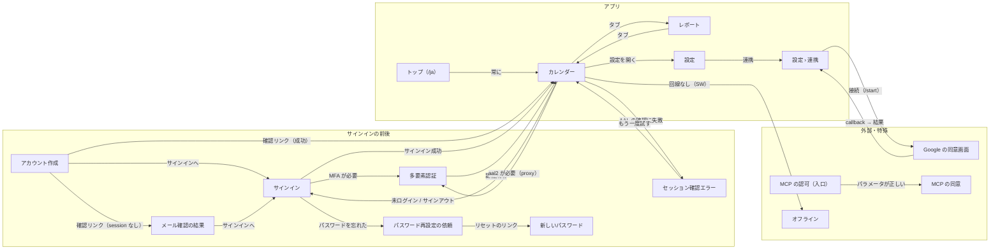

# 画面マップ

<!-- learn:generated:start — 正本 このファイルの learn:screens の JSON / 再生成 pnpm learn:generate / 検証 pnpm docs:check。この範囲は手編集しない -->

Dayopt の画面と、画面どうしの移り方。画面を押すと、そこへ来る条件・読み込むデータ・触るサービス・壊れた時の見え方と、その画面を通る経路が出る。URL は日本語の場合（英語は /ja が付かない）。



### サインイン（`/ja/auth/login`）

メールとパスワード、または Google でサインインする。

- **ここへ来る条件**: サインインしていない人が保護された画面を開くと、proxy.ts がここへ送る（元のパスは redirect に残る）。サインイン済みの人が開くと /calendar へ戻される。
- **読み込むデータ**: なし（Supabase Auth を直接呼ぶ）
- **触るサービス**: ブラウザ、Supabase、その他の外部
- **壊れた時**: 認証エラーはフォームの下に文言で出る。想定内のエラーは Sentry に出ない。
- **移る先**: 多要素認証（MFA が必要）、カレンダー（サインイン成功）、パスワード再設定の依頼（パスワードを忘れた）
- **この画面を通る経路**: [ログイン（MFA 含む）](../journeys/login.md)、[パスワードを再設定する](../journeys/password-reset.md)
- **コードと文書**:
  - [`apps/product/src/app/[locale]/(auth)/auth/login/page.tsx`](<../../../apps/product/src/app/[locale]/(auth)/auth/login/page.tsx>) で `LoginForm` を探す
  - [`apps/product/src/proxy.ts`](../../../apps/product/src/proxy.ts) で `loginUrl.searchParams.set('redirect'` を探す

### アカウント作成（`/ja/auth/signup`）

メールとパスワードで登録する。登録後は確認メールを待つ画面になる。

- **ここへ来る条件**: サインイン画面のリンクから。
- **読み込むデータ**: なし
- **触るサービス**: ブラウザ、Supabase、Resend
- **壊れた時**: 確認メールを送れないと登録エラーになる。
- **移る先**: サインイン（サインインへ）、カレンダー（確認リンク（成功））、メール確認の結果（確認リンク（session なし））
- **この画面を通る経路**: [サインアップ → ウェルカムメール](../journeys/signup.md)
- **コードと文書**:
  - [`apps/product/src/features/auth/components/SignupForm.tsx`](../../../apps/product/src/features/auth/components/SignupForm.tsx) で `safeCheckPasswordPwned` を探す

### メール確認の結果（`/ja/auth/confirmed`）

確認リンクでセッションを作れなかった時の着地点。状態ごとの案内とサインインへのボタン。

- **ここへ来る条件**: /auth/confirm が失敗・期限切れ・メール変更の途中の時。
- **読み込むデータ**: なし
- **触るサービス**: Vercel（Next.js）
- **壊れた時**: 素のエラーではなく案内を出すための画面そのもの。
- **移る先**: サインイン（サインインへ）
- **この画面を通る経路**: [サインアップ → ウェルカムメール](../journeys/signup.md)
- **コードと文書**:
  - [`apps/product/src/app/[locale]/(auth)/auth/confirmed/page.tsx`](<../../../apps/product/src/app/[locale]/(auth)/auth/confirmed/page.tsx>) で `toConfirmStatus` を探す

### パスワード再設定の依頼（`/ja/auth/password`）

メールアドレスを入れ、リセット用のリンクを受け取る。

- **ここへ来る条件**: サインイン画面の「パスワードを忘れた」から。
- **読み込むデータ**: なし
- **触るサービス**: ブラウザ、Supabase、Resend
- **壊れた時**: リンクのメールは確認メールと同じく Edge Function から Resend で送る。
- **移る先**: 新しいパスワード（リセットのリンク）
- **この画面を通る経路**: [パスワードを再設定する](../journeys/password-reset.md)
- **コードと文書**:
  - [`apps/product/src/app/[locale]/(auth)/auth/password/page.tsx`](<../../../apps/product/src/app/[locale]/(auth)/auth/password/page.tsx>) で `PasswordResetForm` を探す

### 新しいパスワード（`/ja/auth/reset-password`）

リセットのリンクから来て、新しいパスワードを決める。

- **ここへ来る条件**: リセット用リンク → /auth/confirm（recovery）。セッションが無いと /auth へ戻される。
- **読み込むデータ**: なし
- **触るサービス**: ブラウザ、Supabase
- **壊れた時**: セッションが無ければ /auth（→ /auth/login）へ。
- **この画面を通る経路**: [パスワードを再設定する](../journeys/password-reset.md)
- **コードと文書**:
  - [`apps/product/src/app/[locale]/(auth)/auth/reset-password/page.tsx`](<../../../apps/product/src/app/[locale]/(auth)/auth/reset-password/page.tsx>) で ``redirect(`/${locale}/auth`)`` を探す

### 多要素認証（`/ja/auth/mfa-verify`）

6 桁のコード、またはリカバリーコードで本人確認を終える。

- **ここへ来る条件**: パスワードが通って aal2 が必要な時。保護された画面を aal1 のまま開いた時も proxy.ts がここへ送る。
- **読み込むデータ**: Supabase Auth（listFactors / challenge / verify）。リカバリーコードだけ tRPC。
- **触るサービス**: ブラウザ、Supabase、Vercel（Next.js）
- **壊れた時**: challenge の失敗は「もう一度試す」ボタン付きで出る。
- **移る先**: カレンダー（認証成功）
- **この画面を通る経路**: [ログイン（MFA 含む）](../journeys/login.md)、[パスワードを再設定する](../journeys/password-reset.md)
- **コードと文書**:
  - [`apps/product/src/app/[locale]/(auth)/auth/mfa-verify/page.tsx`](<../../../apps/product/src/app/[locale]/(auth)/auth/mfa-verify/page.tsx>) で `supabase.auth.mfa.challenge` を探す

### セッション確認エラー（`/ja/auth/session-error`）

セッションの確認そのものが失敗した時の逃げ場。もう一度試すか、サインアウトする。

- **ここへ来る条件**: proxy.ts で AAL の確認に失敗した時。/calendar と /auth/login の無限往復を防ぐための画面。
- **読み込むデータ**: なし
- **触るサービス**: Vercel（Next.js）
- **壊れた時**: ここに来ること自体が障害の兆候。
- **移る先**: カレンダー（もう一度試す）
- **この画面を通る経路**: [ログイン（MFA 含む）](../journeys/login.md)
- **コードと文書**:
  - [`apps/product/src/proxy.ts`](../../../apps/product/src/proxy.ts) で `MFA assurance lookup failed; redirecting to session error page` を探す

### トップ（/ja）（`/ja`）

入口。必ずカレンダーへ送る。

- **ここへ来る条件**: URL を直接開いた時。
- **読み込むデータ**: なし
- **触るサービス**: Vercel（Next.js）
- **壊れた時**: なし。
- **移る先**: カレンダー（常に）
- **コードと文書**:
  - [`apps/product/src/app/[locale]/page.tsx`](../../../apps/product/src/app/[locale]/page.tsx) で ``redirect(`/${locale}/calendar`)`` を探す

### カレンダー（`/ja/calendar`）

主画面。Plan・Record・Google の予定を時間軸に並べ、作成・編集は右の Inspector で行う。

- **ここへ来る条件**: サインイン・MFA の後の既定の着地点。トップからも。
- **読み込むデータ**: server で先に取る: plans.list / records.list / externalCalendar.listEvents / statistics.getActivityStats
- **触るサービス**: ブラウザ、Vercel（Next.js）、Supabase
- **壊れた時**: セグメント単位の error.tsx（CalendarError）が受ける。回線が無ければ Service Worker が /offline を出す。
- **移る先**: サインイン（未ログイン / サインアウト）、多要素認証（aal2 が必要（proxy））、セッション確認エラー（AAL の確認に失敗）、レポート（タブ）、設定（設定を開く）、オフライン（回線なし（SW））
- **この画面を通る経路**: [Plan を保存](../journeys/save-plan.md)、[Plan / Record を動かす・直す](../journeys/edit-timeblock.md)、[Record を作る・Plan を記録する](../journeys/record-plan.md)、[削除と取り消し](../journeys/delete-undo.md)、[AI クライアントから Plan を作る（MCP）](../journeys/mcp.md)、[ログイン（MFA 含む）](../journeys/login.md)、[Google Calendar 連携](../journeys/google-calendar.md)、[merge → 本番公開](../journeys/deploy.md)
- **コードと文書**:
  - [`apps/product/src/app/[locale]/(app)/(workspace)/_server/calendar-prefetch.ts`](<../../../apps/product/src/app/[locale]/(app)/(workspace)/_server/calendar-prefetch.ts>) で `helpers.plans.list.prefetch` を探す
  - [`apps/product/src/app/[locale]/(app)/(workspace)/calendar/error.tsx`](<../../../apps/product/src/app/[locale]/(app)/(workspace)/calendar/error.tsx>) で `CalendarError` を探す

### レポート（`/ja/report`）

計画と実績の差をふり返る。

- **ここへ来る条件**: ワークスペースのタブで切り替える。
- **読み込むデータ**: client で取る: review.getReportPeriod / review.getReportActivityDetail（server で先に取らない）
- **触るサービス**: ブラウザ、Vercel（Next.js）、Supabase
- **壊れた時**: カレンダーと同じ CalendarError。読み込み中は loading.tsx。
- **移る先**: カレンダー（タブ）
- **この画面を通る経路**: [レポートを開く（集計）](../journeys/report.md)
- **コードと文書**:
  - [`apps/product/src/features/review/hooks/useReportPeriod.ts`](../../../apps/product/src/features/review/hooks/useReportPeriod.ts) で `review.getReportPeriod.useQuery` を探す
  - [`apps/product/src/app/[locale]/(app)/_shell/WorkspaceTabs.tsx`](<../../../apps/product/src/app/[locale]/(app)/_shell/WorkspaceTabs.tsx>) で `/report` を探す

### 設定（`/ja/settings`）

アカウント・表示・データ・連携・課金の 5 分類。デスクトップではカレンダーの上にモーダルで開き、URL は /calendar に戻す。スマホでは画面として開く。

- **ここへ来る条件**: サイドバーやメニューから。
- **読み込むデータ**: 分類ごとに異なる（連携なら externalCalendar.listConnections、課金なら billing.getOverview）
- **触るサービス**: ブラウザ、Vercel（Next.js）、Supabase
- **壊れた時**: 専用の error.tsx は無く、(app) 全体の error.tsx が受ける。
- **移る先**: 設定 › 連携（連携）
- **この画面を通る経路**: [Pro を契約する（課金）](../journeys/billing.md)、[データを書き出す](../journeys/data-export.md)、[アカウントを削除する（不可逆）](../journeys/account-deletion.md)、[問い合わせを送る](../journeys/contact.md)
- **コードと文書**:
  - [`apps/product/src/features/settings/constants.ts`](../../../apps/product/src/features/settings/constants.ts) で `SETTINGS_CATEGORIES` を探す
  - [`apps/product/src/app/[locale]/(app)/settings/_composition/settings-route.tsx`](<../../../apps/product/src/app/[locale]/(app)/settings/_composition/settings-route.tsx>) で `router.replace(DESKTOP_SETTINGS_EXIT_PATH)` を探す

### 設定 › 連携（`/ja/settings/integrations`）

Google アカウントの接続・再接続・解除、取り込むカレンダーの選択、今すぐ同期。

- **ここへ来る条件**: 設定の「連携」。Google の OAuth から ?calendar=connected / error で戻ってくる。
- **読み込むデータ**: externalCalendar.listConnections / getConnectionAvailability
- **触るサービス**: ブラウザ、Vercel（Next.js）、Supabase、Google
- **壊れた時**: 接続の失敗は理由ごとのトースト。同期の問題は行のバッジ（再接続が必要 / 確認が必要）。
- **移る先**: Google の同意画面（接続（/start））
- **この画面を通る経路**: [Google Calendar 連携](../journeys/google-calendar.md)
- **コードと文書**:
  - [`apps/product/src/app/[locale]/(app)/settings/[category]/page.tsx`](<../../../apps/product/src/app/[locale]/(app)/settings/[category]/page.tsx>) で `removeCalendarCallbackParams` を探す

### Google の同意画面（`accounts.google.com`）

Google 側の画面。アカウントを選び、カレンダーの読み取りを許可する。

- **ここへ来る条件**: 連携の「接続」→ /api/integrations/google-calendar/start → 302。
- **読み込むデータ**: なし（Google 側）
- **触るサービス**: Google
- **壊れた時**: 許可しなければ ?calendar=error&reason=access_denied で戻る。
- **移る先**: 設定 › 連携（callback → 結果）
- **この画面を通る経路**: [Google Calendar 連携](../journeys/google-calendar.md)
- **コードと文書**:
  - [`apps/product/src/features/external-calendar/server/../schemas/google.ts`](../../../apps/product/src/features/external-calendar/schemas/google.ts) で `GOOGLE_AUTHORIZATION_SCOPES` を探す

### MCP の認可（入口）（`/ja/oauth/authorize`）

外部の AI クライアントが MCP で Dayopt を使う時の OAuth 認可。パラメータを検証して同意画面へ送る。

- **ここへ来る条件**: MCP クライアントから。サインインしていなければ proxy.ts がサインインへ送る。
- **読み込むデータ**: なし（検証のみ）
- **触るサービス**: Vercel（Next.js）、Supabase
- **壊れた時**: パラメータが不正ならエラーパネル。
- **移る先**: MCP の同意（パラメータが正しい）
- **この画面を通る経路**: [AI クライアントから Plan を作る（MCP）](../journeys/mcp.md)
- **コードと文書**:
  - [`apps/product/src/app/[locale]/oauth/authorize/page.tsx`](../../../apps/product/src/app/[locale]/oauth/authorize/page.tsx) で `OAuthErrorPanel` を探す

### MCP の同意（`/ja/oauth/consent`）

MCP クライアントに渡す権限（scope）を利用者が承認する。

- **ここへ来る条件**: /oauth/authorize から。
- **読み込むデータ**: OAuth 用 DB（許可できる scope）
- **触るサービス**: Vercel（Next.js）、Supabase
- **壊れた時**: 外部契約（MCP / OAuth scope）なので、変更は既存クライアントを壊さないか確かめる。
- **この画面を通る経路**: [AI クライアントから Plan を作る（MCP）](../journeys/mcp.md)
- **コードと文書**:
  - [`apps/product/src/app/[locale]/oauth/consent/page.tsx`](../../../apps/product/src/app/[locale]/oauth/consent/page.tsx) で `processConsent` を探す

### オフライン（`/offline`）

回線が無く、キャッシュにもページが無い時に Service Worker が出す画面。言語はブラウザの設定で決める。

- **ここへ来る条件**: ページの移動で回線が無い時（Network First → cache → /offline）。
- **読み込むデータ**: なし
- **触るサービス**: ブラウザ
- **壊れた時**: この画面が出る時点で、サーバーには何も届いていない。
- **コードと文書**:
  - [`apps/product/public/sw.js`](../../../apps/product/public/sw.js) で `caches.match('/offline')` を探す
  - [`docs/engineering/pwa.md`](../../engineering/pwa.md) で `Network First` を探す

<!-- learn:generated:end -->

## データ（正本）

この JSON がこのページの正本。上の説明と図、`pnpm learn` の対話画面はここから生成する。参照（`path` + `find`）は `pnpm docs:check` が実在を検査する。

```json learn:screens
{
  "title": "画面マップ",
  "intro": "Dayopt の画面と、画面どうしの移り方。画面を押すと、そこへ来る条件・読み込むデータ・触るサービス・壊れた時の見え方と、その画面を通る経路が出る。URL は日本語の場合（英語は /ja が付かない）。",
  "columns": ["サインインの前後", "アプリ", "外部・特殊"],
  "nodes": [
    {
      "id": "login",
      "label": "サインイン",
      "url": "/ja/auth/login",
      "col": 1,
      "row": 2,
      "group": "auth",
      "what": "メールとパスワード、または Google でサインインする。",
      "arrive": "サインインしていない人が保護された画面を開くと、proxy.ts がここへ送る（元のパスは redirect に残る）。サインイン済みの人が開くと /calendar へ戻される。",
      "loads": "なし（Supabase Auth を直接呼ぶ）",
      "svcs": ["browser", "supabase", "external"],
      "fails": "認証エラーはフォームの下に文言で出る。想定内のエラーは Sentry に出ない。",
      "screen": {
        "t": "form",
        "title": "サインイン",
        "url": "/ja/auth/login",
        "fields": [
          ["メールアドレス", "m@example.com"],
          ["パスワード", "••••••••"]
        ],
        "extra": "Cloudflare Turnstile ✓",
        "button": "サインイン",
        "alt": "Google で続ける"
      },
      "refs": [
        {
          "path": "apps/product/src/app/[locale]/(auth)/auth/login/page.tsx",
          "find": "LoginForm"
        },
        {
          "path": "apps/product/src/proxy.ts",
          "find": "loginUrl.searchParams.set('redirect'"
        }
      ],
      "flows": ["login", "password-reset"]
    },
    {
      "id": "signup",
      "label": "アカウント作成",
      "url": "/ja/auth/signup",
      "col": 1,
      "row": 1,
      "group": "auth",
      "what": "メールとパスワードで登録する。登録後は確認メールを待つ画面になる。",
      "arrive": "サインイン画面のリンクから。",
      "loads": "なし",
      "svcs": ["browser", "supabase", "resend"],
      "fails": "確認メールを送れないと登録エラーになる。",
      "screen": {
        "t": "form",
        "title": "アカウントを作成",
        "url": "/ja/auth/signup",
        "fields": [
          ["メールアドレス", "m@example.com"],
          ["パスワード", "••••••••"]
        ],
        "extra": "Cloudflare Turnstile ✓",
        "button": "アカウント作成"
      },
      "refs": [
        {
          "path": "apps/product/src/features/auth/components/SignupForm.tsx",
          "find": "safeCheckPasswordPwned"
        }
      ],
      "flows": ["signup"]
    },
    {
      "id": "confirmed",
      "label": "メール確認の結果",
      "url": "/ja/auth/confirmed",
      "col": 1,
      "row": 3,
      "group": "auth",
      "what": "確認リンクでセッションを作れなかった時の着地点。状態ごとの案内とサインインへのボタン。",
      "arrive": "/auth/confirm が失敗・期限切れ・メール変更の途中の時。",
      "loads": "なし",
      "svcs": ["vercel"],
      "fails": "素のエラーではなく案内を出すための画面そのもの。",
      "screen": {
        "t": "page",
        "url": "/ja/auth/confirmed?status=…",
        "tone": "warn",
        "title": "メールアドレスの確認",
        "body": "状態に応じた案内とサインインへのボタン",
        "button": "サインインへ"
      },
      "refs": [
        {
          "path": "apps/product/src/app/[locale]/(auth)/auth/confirmed/page.tsx",
          "find": "toConfirmStatus"
        }
      ],
      "flows": ["signup"]
    },
    {
      "id": "password",
      "label": "パスワード再設定の依頼",
      "url": "/ja/auth/password",
      "col": 1,
      "row": 4,
      "group": "auth",
      "what": "メールアドレスを入れ、リセット用のリンクを受け取る。",
      "arrive": "サインイン画面の「パスワードを忘れた」から。",
      "loads": "なし",
      "svcs": ["browser", "supabase", "resend"],
      "fails": "リンクのメールは確認メールと同じく Edge Function から Resend で送る。",
      "screen": {
        "t": "form",
        "title": "パスワードをリセット",
        "url": "/ja/auth/password",
        "fields": [["メールアドレス", "m@example.com"]],
        "button": "リセット用リンクを送信"
      },
      "refs": [
        {
          "path": "apps/product/src/app/[locale]/(auth)/auth/password/page.tsx",
          "find": "PasswordResetForm"
        }
      ],
      "flows": ["password-reset"]
    },
    {
      "id": "reset-password",
      "label": "新しいパスワード",
      "url": "/ja/auth/reset-password",
      "col": 1,
      "row": 5,
      "group": "auth",
      "what": "リセットのリンクから来て、新しいパスワードを決める。",
      "arrive": "リセット用リンク → /auth/confirm（recovery）。セッションが無いと /auth へ戻される。",
      "loads": "なし",
      "svcs": ["browser", "supabase"],
      "fails": "セッションが無ければ /auth（→ /auth/login）へ。",
      "screen": {
        "t": "form",
        "title": "新しいパスワード",
        "url": "/ja/auth/reset-password",
        "fields": [["新しいパスワード", "••••••••"]],
        "button": "更新"
      },
      "refs": [
        {
          "path": "apps/product/src/app/[locale]/(auth)/auth/reset-password/page.tsx",
          "find": "redirect(`/${locale}/auth`)"
        }
      ],
      "flows": ["password-reset"]
    },
    {
      "id": "mfa-verify",
      "label": "多要素認証",
      "url": "/ja/auth/mfa-verify",
      "col": 1,
      "row": 6,
      "group": "auth",
      "what": "6 桁のコード、またはリカバリーコードで本人確認を終える。",
      "arrive": "パスワードが通って aal2 が必要な時。保護された画面を aal1 のまま開いた時も proxy.ts がここへ送る。",
      "loads": "Supabase Auth（listFactors / challenge / verify）。リカバリーコードだけ tRPC。",
      "svcs": ["browser", "supabase", "vercel"],
      "fails": "challenge の失敗は「もう一度試す」ボタン付きで出る。",
      "screen": {
        "t": "form",
        "title": "多要素認証",
        "url": "/ja/auth/mfa-verify",
        "fields": [["認証アプリの6桁のコード", "– – – – – –"]],
        "button": "認証",
        "alt": "リカバリーコードを使用"
      },
      "refs": [
        {
          "path": "apps/product/src/app/[locale]/(auth)/auth/mfa-verify/page.tsx",
          "find": "supabase.auth.mfa.challenge"
        }
      ],
      "flows": ["login", "password-reset"]
    },
    {
      "id": "session-error",
      "label": "セッション確認エラー",
      "url": "/ja/auth/session-error",
      "col": 1,
      "row": 7,
      "group": "auth",
      "what": "セッションの確認そのものが失敗した時の逃げ場。もう一度試すか、サインアウトする。",
      "arrive": "proxy.ts で AAL の確認に失敗した時。/calendar と /auth/login の無限往復を防ぐための画面。",
      "loads": "なし",
      "svcs": ["vercel"],
      "fails": "ここに来ること自体が障害の兆候。",
      "screen": {
        "t": "page",
        "url": "/ja/auth/session-error",
        "tone": "warn",
        "title": "セッションを確認できませんでした",
        "body": "もう一度お試しください。解決しない場合はサインアウトしてください。",
        "button": "もう一度試す"
      },
      "refs": [
        {
          "path": "apps/product/src/proxy.ts",
          "find": "MFA assurance lookup failed; redirecting to session error page"
        }
      ],
      "flows": ["login"]
    },
    {
      "id": "root",
      "label": "トップ（/ja）",
      "url": "/ja",
      "col": 2,
      "row": 1,
      "group": "app",
      "what": "入口。必ずカレンダーへ送る。",
      "arrive": "URL を直接開いた時。",
      "loads": "なし",
      "svcs": ["vercel"],
      "fails": "なし。",
      "screen": {
        "t": "blank",
        "url": "/ja",
        "text": "→ /ja/calendar"
      },
      "refs": [
        {
          "path": "apps/product/src/app/[locale]/page.tsx",
          "find": "redirect(`/${locale}/calendar`)"
        }
      ],
      "flows": []
    },
    {
      "id": "calendar",
      "label": "カレンダー",
      "url": "/ja/calendar",
      "col": 2,
      "row": 2,
      "group": "app",
      "what": "主画面。Plan・Record・Google の予定を時間軸に並べ、作成・編集は右の Inspector で行う。",
      "arrive": "サインイン・MFA の後の既定の着地点。トップからも。",
      "loads": "server で先に取る: plans.list / records.list / externalCalendar.listEvents / statistics.getActivityStats",
      "svcs": ["browser", "vercel", "supabase"],
      "fails": "セグメント単位の error.tsx（CalendarError）が受ける。回線が無ければ Service Worker が /offline を出す。",
      "screen": {
        "t": "calendar",
        "url": "/ja/calendar",
        "blocks": [
          {
            "state": "saved",
            "label": "仕事"
          },
          {
            "state": "ext",
            "label": "Google の予定",
            "from": 2.2,
            "len": 0.8
          }
        ]
      },
      "refs": [
        {
          "path": "apps/product/src/app/[locale]/(app)/(workspace)/_server/calendar-prefetch.ts",
          "find": "helpers.plans.list.prefetch"
        },
        {
          "path": "apps/product/src/app/[locale]/(app)/(workspace)/calendar/error.tsx",
          "find": "CalendarError"
        }
      ],
      "flows": [
        "save-plan",
        "edit-timeblock",
        "record-plan",
        "delete-undo",
        "mcp",
        "login",
        "google-calendar",
        "deploy"
      ]
    },
    {
      "id": "report",
      "label": "レポート",
      "url": "/ja/report",
      "col": 2,
      "row": 3,
      "group": "app",
      "what": "計画と実績の差をふり返る。",
      "arrive": "ワークスペースのタブで切り替える。",
      "loads": "client で取る: review.getReportPeriod / review.getReportActivityDetail（server で先に取らない）",
      "svcs": ["browser", "vercel", "supabase"],
      "fails": "カレンダーと同じ CalendarError。読み込み中は loading.tsx。",
      "screen": {
        "t": "page",
        "url": "/ja/report",
        "tone": "neutral",
        "title": "レポート",
        "body": "計画と実績の差"
      },
      "refs": [
        {
          "path": "apps/product/src/features/review/hooks/useReportPeriod.ts",
          "find": "review.getReportPeriod.useQuery"
        },
        {
          "path": "apps/product/src/app/[locale]/(app)/_shell/WorkspaceTabs.tsx",
          "find": "/report"
        }
      ],
      "flows": ["report"]
    },
    {
      "id": "settings",
      "label": "設定",
      "url": "/ja/settings",
      "col": 2,
      "row": 4,
      "group": "app",
      "what": "アカウント・表示・データ・連携・課金の 5 分類。デスクトップではカレンダーの上にモーダルで開き、URL は /calendar に戻す。スマホでは画面として開く。",
      "arrive": "サイドバーやメニューから。",
      "loads": "分類ごとに異なる（連携なら externalCalendar.listConnections、課金なら billing.getOverview）",
      "svcs": ["browser", "vercel", "supabase"],
      "fails": "専用の error.tsx は無く、(app) 全体の error.tsx が受ける。",
      "screen": {
        "t": "settings",
        "url": "/ja/settings",
        "rows": [
          ["アカウント", ""],
          ["表示", ""],
          ["データ", ""],
          ["連携", ""],
          ["課金", ""]
        ]
      },
      "refs": [
        {
          "path": "apps/product/src/features/settings/constants.ts",
          "find": "SETTINGS_CATEGORIES"
        },
        {
          "path": "apps/product/src/app/[locale]/(app)/settings/_composition/settings-route.tsx",
          "find": "router.replace(DESKTOP_SETTINGS_EXIT_PATH)"
        }
      ],
      "flows": ["billing", "data-export", "account-deletion", "contact"]
    },
    {
      "id": "integrations",
      "label": "設定 › 連携",
      "url": "/ja/settings/integrations",
      "col": 2,
      "row": 5,
      "group": "app",
      "what": "Google アカウントの接続・再接続・解除、取り込むカレンダーの選択、今すぐ同期。",
      "arrive": "設定の「連携」。Google の OAuth から ?calendar=connected / error で戻ってくる。",
      "loads": "externalCalendar.listConnections / getConnectionAvailability",
      "svcs": ["browser", "vercel", "supabase", "google"],
      "fails": "接続の失敗は理由ごとのトースト。同期の問題は行のバッジ（再接続が必要 / 確認が必要）。",
      "screen": {
        "t": "settings",
        "url": "/ja/settings/integrations",
        "title": "連携 › Google カレンダー",
        "rows": [
          ["m@example.com", "接続済み", "ok"],
          ["最終同期", "未同期", "neutral"]
        ]
      },
      "refs": [
        {
          "path": "apps/product/src/app/[locale]/(app)/settings/[category]/page.tsx",
          "find": "removeCalendarCallbackParams"
        }
      ],
      "flows": ["google-calendar"]
    },
    {
      "id": "google",
      "label": "Google の同意画面",
      "url": "accounts.google.com",
      "col": 3,
      "row": 5,
      "group": "ext",
      "what": "Google 側の画面。アカウントを選び、カレンダーの読み取りを許可する。",
      "arrive": "連携の「接続」→ /api/integrations/google-calendar/start → 302。",
      "loads": "なし（Google 側）",
      "svcs": ["google"],
      "fails": "許可しなければ ?calendar=error&reason=access_denied で戻る。",
      "screen": {
        "t": "consent",
        "host": "accounts.google.com",
        "url": "/o/oauth2/…",
        "title": "Dayopt が Google アカウントへのアクセスを求めています",
        "scopes": ["カレンダーの一覧を見る", "予定を見る（読み取りのみ）"]
      },
      "refs": [
        {
          "path": "apps/product/src/features/external-calendar/server/../schemas/google.ts",
          "find": "GOOGLE_AUTHORIZATION_SCOPES"
        }
      ],
      "flows": ["google-calendar"]
    },
    {
      "id": "oauth-authorize",
      "label": "MCP の認可（入口）",
      "url": "/ja/oauth/authorize",
      "col": 3,
      "row": 1,
      "group": "ext",
      "what": "外部の AI クライアントが MCP で Dayopt を使う時の OAuth 認可。パラメータを検証して同意画面へ送る。",
      "arrive": "MCP クライアントから。サインインしていなければ proxy.ts がサインインへ送る。",
      "loads": "なし（検証のみ）",
      "svcs": ["vercel", "supabase"],
      "fails": "パラメータが不正ならエラーパネル。",
      "screen": {
        "t": "blank",
        "url": "/ja/oauth/authorize",
        "text": "→ 同意画面へ"
      },
      "refs": [
        {
          "path": "apps/product/src/app/[locale]/oauth/authorize/page.tsx",
          "find": "OAuthErrorPanel"
        }
      ],
      "flows": ["mcp"]
    },
    {
      "id": "oauth-consent",
      "label": "MCP の同意",
      "url": "/ja/oauth/consent",
      "col": 3,
      "row": 2,
      "group": "ext",
      "what": "MCP クライアントに渡す権限（scope）を利用者が承認する。",
      "arrive": "/oauth/authorize から。",
      "loads": "OAuth 用 DB（許可できる scope）",
      "svcs": ["vercel", "supabase"],
      "fails": "外部契約（MCP / OAuth scope）なので、変更は既存クライアントを壊さないか確かめる。",
      "screen": {
        "t": "settings",
        "url": "/ja/oauth/consent",
        "title": "アクセスを許可しますか？",
        "rows": [
          ["予定を読む", ""],
          ["予定を作る", ""]
        ],
        "button": "許可"
      },
      "refs": [
        {
          "path": "apps/product/src/app/[locale]/oauth/consent/page.tsx",
          "find": "processConsent"
        }
      ],
      "flows": ["mcp"]
    },
    {
      "id": "offline",
      "label": "オフライン",
      "url": "/offline",
      "col": 3,
      "row": 3,
      "group": "ext",
      "what": "回線が無く、キャッシュにもページが無い時に Service Worker が出す画面。言語はブラウザの設定で決める。",
      "arrive": "ページの移動で回線が無い時（Network First → cache → /offline）。",
      "loads": "なし",
      "svcs": ["browser"],
      "fails": "この画面が出る時点で、サーバーには何も届いていない。",
      "screen": {
        "t": "page",
        "url": "/offline",
        "tone": "neutral",
        "title": "オフラインです",
        "body": "接続が戻ったら再読み込み"
      },
      "refs": [
        {
          "path": "apps/product/public/sw.js",
          "find": "caches.match('/offline')"
        },
        {
          "path": "docs/engineering/pwa.md",
          "find": "Network First"
        }
      ],
      "flows": []
    }
  ],
  "edges": [
    ["root", "calendar", "常に"],
    ["signup", "login", "サインインへ"],
    ["signup", "calendar", "確認リンク（成功）"],
    ["signup", "confirmed", "確認リンク（session なし）"],
    ["confirmed", "login", "サインインへ"],
    ["login", "mfa-verify", "MFA が必要"],
    ["login", "calendar", "サインイン成功"],
    ["login", "password", "パスワードを忘れた"],
    ["password", "reset-password", "リセットのリンク"],
    ["mfa-verify", "calendar", "認証成功"],
    ["calendar", "login", "未ログイン / サインアウト"],
    ["calendar", "mfa-verify", "aal2 が必要（proxy）"],
    ["calendar", "session-error", "AAL の確認に失敗"],
    ["session-error", "calendar", "もう一度試す"],
    ["calendar", "report", "タブ"],
    ["report", "calendar", "タブ"],
    ["calendar", "settings", "設定を開く"],
    ["settings", "integrations", "連携"],
    ["integrations", "google", "接続（/start）"],
    ["google", "integrations", "callback → 結果"],
    ["oauth-authorize", "oauth-consent", "パラメータが正しい"],
    ["calendar", "offline", "回線なし（SW）"]
  ]
}
```
