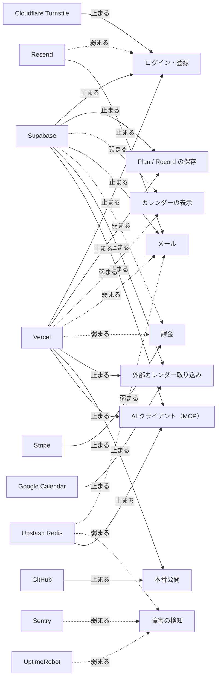

# 外部サービスと停止マップ

<!-- learn:generated:start — 正本 このファイルの learn:services の JSON / 再生成 pnpm learn:generate / 検証 pnpm docs:check。この範囲は手編集しない -->

外部サービスが 1 つ止まったら、何が壊れ、何は動き続け、どこから見るか。乗り換えの重さ（出口コスト）は infra.md の台帳が正本。

| サービス             | 役割                                                                  |
| -------------------- | --------------------------------------------------------------------- |
| Supabase             | Auth・DB・Storage・Edge Functions                                     |
| Vercel               | product / web の配信・Function・Cron                                  |
| GitHub               | merge・Actions・deploy の起点                                         |
| Upstash Redis        | rate limit・Resend webhook の 1 回処理                                |
| Resend               | 認証メール・通知メール・bounce webhook                                |
| Sentry               | エラー監視・production build の gate                                  |
| Cloudflare Turnstile | 登録・ログインのボット対策                                            |
| Stripe               | Pro 課金・アカウント削除時の解約                                      |
| Google Calendar      | 外部カレンダーの取り込み（Supabase の Google ログインとは別の OAuth） |
| UptimeRobot          | 外形監視（/api/health を 5 分ごと）                                   |

実線は「止まる」、点線は「弱まる（一部・遅れて追いつく）」。



### Supabase が止まったら

- **影響する機能**: ログイン・登録（止まる）、Plan / Record の保存（止まる）、カレンダーの表示（弱まる）、メール（止まる）、課金（弱まる）、外部カレンダー取り込み（止まる）、AI クライアント（MCP）（止まる）
- **壊れる**: ログイン、全データの読み書き、認証メール（Edge Function）、/api/health（503）。
- **動き続ける**: キャッシュ済みの表示（query は offlineFirst、IndexedDB に最大 2 時間）。公開サイト（apps/web）。
- **コードの挙動**: 必須の env が欠けると起動時に throw。実行時の失敗は各経路で Sentry。
- **関係する env**: `NEXT_PUBLIC_SUPABASE_URL`, `NEXT_PUBLIC_SUPABASE_PUBLISHABLE_KEY`, `SUPABASE_SECRET_KEY`
- **最初に見る場所**: Supabase の status page → runbook Playbook 1。
- **コードと文書**:
  - [`apps/product/src/env.ts`](../../../apps/product/src/env.ts) で `SUPABASE_SECRET_KEY` を探す
  - [`docs/operations/runbook.md`](../../operations/runbook.md) で `## Playbook 1: Supabase障害（P0）` を探す

### Vercel が止まったら

- **影響する機能**: ログイン・登録（止まる）、Plan / Record の保存（止まる）、カレンダーの表示（弱まる）、メール（弱まる）、課金（弱まる）、外部カレンダー取り込み（止まる）、本番公開（止まる）、AI クライアント（MCP）（止まる）
- **壊れる**: アプリ全体、tRPC、webhook の受信、Cron（calendar-sync など）。
- **動き続ける**: DB のデータ。通信そのものが失敗した時だけ、一度開いたページとデータをキャッシュから出す（書き込みはできない）。Vercel が 5xx のエラーページを返す停止では、そのエラーがそのまま表示される。Stripe / Resend は webhook を再送するので、復旧後に追いつく。
- **コードの挙動**: Cron は次の予定時刻に走るだけで、取りこぼした回を埋め直さない。完了記録（heartbeat）が古くなることで気づく。
- **関係する env**: `CRON_SECRET`
- **最初に見る場所**: Vercel の status → runbook Playbook 2 → monitoring.md の Cron heartbeat。
- **コードと文書**:
  - [`apps/product/vercel.json`](../../../apps/product/vercel.json) で `crons` を探す
  - [`docs/operations/monitoring.md`](../../operations/monitoring.md) で `## Cron heartbeat と本番 schema・権限監査` を探す
  - [`docs/engineering/pwa.md`](../../engineering/pwa.md) で `Network First` を探す（ページは network → cache の順）

### GitHub が止まったら

- **影響する機能**: 本番公開（止まる）
- **壊れる**: merge、CI、本番公開（Vercel の build も Supabase の migration 適用も GitHub 連携から始まる）。
- **動き続ける**: 本番で動いているアプリとデータ。
- **コードの挙動**: アプリの実行時には使わない。止まっている間は何も公開されない。
- **関係する env**: なし
- **最初に見る場所**: GitHub の status。復旧後に Production Release が走ったかを Actions で確かめる。
- **コードと文書**:
  - [`docs/engineering/infra.md`](../../engineering/infra.md) で ``Vercel の正規 deployment source は `Dayopt/dayopt` の GitHub 連携だけとする`` を探す
  - [`.github/workflows/promote.yml`](../../../.github/workflows/promote.yml) で `Resolve release impact` を探す

### Upstash Redis が止まったら

- **影響する機能**: メール（弱まる）、障害の検知（弱まる）、AI クライアント（MCP）（止まる）
- **壊れる**: MCP（本番では 503 で止める）、AI クライアントの接続（OAuth の token 発行）、アカウント削除とメール変更の本人確認、問い合わせの送信。Resend webhook の処理。本番の /api/health も 503 を返し、UptimeRobot が DOWN を通知する。
- **動き続ける**: 保存・表示など通常の画面の操作。tRPC の利用者単位の rate limit はメモリ上の判定へ退避して通す（緩くなる）。
- **コードの挙動**: 経路で違う。通常の tRPC は fail-open（利用者単位はメモリへ退避、認証前の IP 単位は通す）。MCP・OAuth token・本人確認・問い合わせは fail-closed（503 / SERVICE_UNAVAILABLE）。どちらも Sentry に記録。
- **関係する env**: `UPSTASH_REDIS_REST_URL`, `UPSTASH_REDIS_REST_TOKEN`
- **最初に見る場所**: Upstash の status。
- **コードと文書**:
  - [`apps/product/src/lib/rate-limit/upstash.ts`](../../../apps/product/src/lib/rate-limit/upstash.ts) で `isUpstashEnabled` を探す
  - [`apps/product/src/app/api/health/route.ts`](../../../apps/product/src/app/api/health/route.ts) で `checkRedis` を探す
  - [`apps/product/src/lib/mcp/request-rate-limit.ts`](../../../apps/product/src/lib/mcp/request-rate-limit.ts) で `return 'unavailable';` を探す（MCP は fail-closed）
  - [`apps/product/src/features/contact/server/router.ts`](../../../apps/product/src/features/contact/server/router.ts) で `Contact rate-limit service is unavailable` を探す

### Resend が止まったら

- **影響する機能**: ログイン・登録（弱まる）、メール（止まる）
- **壊れる**: 確認メール（登録が失敗する）、ウェルカム・通知メール（黙って欠落）、bounce の記録。
- **動き続ける**: ログイン済みの利用、保存。
- **コードの挙動**: アプリ側の送信は throw せず失敗を返し、呼び出し側が扱う。ウェルカムメールは再送しない。
- **関係する env**: `RESEND_API_KEY`, `RESEND_FROM_EMAIL`, `RESEND_WEBHOOK_SECRET`
- **最初に見る場所**: Resend のダッシュボード → Supabase の Edge Function ログ（確認メール）→ Sentry。
- **コードと文書**:
  - [`apps/product/src/lib/email/send.ts`](../../../apps/product/src/lib/email/send.ts) で `sendTransactionalEmail` を探す
  - [`supabase/functions/send-auth-email/index.ts`](../../../supabase/functions/send-auth-email/index.ts) で `RESEND_API_KEY` を探す

### Sentry が止まったら

- **影響する機能**: 障害の検知（弱まる）
- **壊れる**: 障害の痕跡が見えなくなる。資格情報が欠けると production build が失敗する。
- **動き続ける**: アプリの動作（送信は fire-and-forget）。
- **コードの挙動**: 本番の build は DSN などが無いと失敗する（build gate）。Preview と local では DSN が無ければ黙って初期化しない。/api/health の transaction は inbound filter で捨てるので、Sentry が無音でも health が無事とは限らない。
- **関係する env**: `NEXT_PUBLIC_SENTRY_DSN`, `SENTRY_DSN`, `SENTRY_ORG`, `SENTRY_PROJECT`, `SENTRY_AUTH_TOKEN`, `VERCEL_GIT_COMMIT_SHA`
- **最初に見る場所**: Sentry の status。痕跡が無い時は Vercel の Function ログへ。
- **コードと文書**:
  - [`apps/product/sentry.server.config.ts`](../../../apps/product/sentry.server.config.ts) で `Sentry.init` を探す
  - [`docs/operations/monitoring.md`](../../operations/monitoring.md) で `## Sentry runtime contract` を探す
  - [`packages/observability/build-gate.mjs`](../../../packages/observability/build-gate.mjs) で `'SENTRY_AUTH_TOKEN',` を探す

### Cloudflare Turnstile が止まったら

- **影響する機能**: ログイン・登録（止まる）
- **壊れる**: Supabase の Bot Protection が有効なら、token が取れず登録・ログインが止まる。
- **動き続ける**: ログイン済みの利用。
- **コードの挙動**: site key が空なら画面側の確認は黙って無効。
- **関係する env**: `NEXT_PUBLIC_TURNSTILE_SITE_KEY`
- **最初に見る場所**: Cloudflare の status → infra.md の Turnstile 節。
- **コードと文書**:
  - [`apps/product/src/lib/turnstile/config.ts`](../../../apps/product/src/lib/turnstile/config.ts) で `isTurnstileEnabled` を探す
  - [`docs/engineering/infra.md`](../../engineering/infra.md) で `## Bot 対策（Cloudflare Turnstile）` を探す

### Stripe が止まったら

- **影響する機能**: 課金（止まる）
- **壊れる**: checkout、webhook による課金状態の同期。
- **動き続ける**: 課金を強制していない間（BILLING_ENFORCED 未設定）は全員が無料で使えるので、通常の利用。
- **コードの挙動**: 鍵が無ければ getStripe() が null。webhook は署名・冪等 claim を経て、失敗時は 500 で Stripe に再送させる。毎晩の突き合わせ Cron が差分を検出する（検出だけで直さない）。
- **関係する env**: `STRIPE_SECRET_KEY`, `STRIPE_WEBHOOK_SECRET`
- **最初に見る場所**: Stripe の status → runbook Playbook 3。
- **コードと文書**:
  - [`apps/product/src/lib/stripe/client.ts`](../../../apps/product/src/lib/stripe/client.ts) で `getStripe` を探す
  - [`docs/operations/runbook.md`](../../operations/runbook.md) で `## Playbook 3: Stripe Webhook停止（P1）` を探す

### Google Calendar が止まったら

- **影響する機能**: 外部カレンダー取り込み（止まる）
- **壊れる**: 外部カレンダーの予定の取り込み・連携の開始。
- **動き続ける**: Dayopt 内の Plan / Record。手動で作った Plan は Google へ書き出さないので影響しない。
- **コードの挙動**: 15 分ごとの calendar-sync Cron が取り込む（取り込むカレンダーを選んだ接続だけ）。API は 15 秒で打ち切る。痕跡は失敗の種類で違う: 5xx・時間切れは Sentry（feature: external_calendar）、429 と sync token の失効はログだけ、許可の取り消し（reauth_required）は接続の状態に残して Sentry には送らない。
- **関係する env**: `GOOGLE_CALENDAR_CLIENT_ID`, `GOOGLE_CALENDAR_CLIENT_SECRET`, `GOOGLE_CALENDAR_PROJECT_NUMBER`, `GOOGLE_CALENDAR_REDIRECT_URIS`, `CALENDAR_TOKEN_ENCRYPTION_KEY`
- **最初に見る場所**: Google Cloud の status → Sentry（feature: external_calendar）→ calendar_connections の status / last_sync_error → Cron heartbeat。
- **コードと文書**:
  - [`apps/product/src/features/external-calendar/server/providers/google.ts`](../../../apps/product/src/features/external-calendar/server/providers/google.ts) で `GOOGLE_API_TIMEOUT_MS` を探す
  - [`apps/product/src/app/api/cron/calendar-sync/route.ts`](../../../apps/product/src/app/api/cron/calendar-sync/route.ts) で `writeCronHeartbeat` を探す
  - [`apps/product/src/features/external-calendar/server/sync-service.ts`](../../../apps/product/src/features/external-calendar/server/sync-service.ts) で `(error.kind === 'rate_limited' || error.kind === 'cursor_invalid')` を探す

### UptimeRobot が止まったら

- **影響する機能**: 障害の検知（弱まる）
- **壊れる**: 全体停止の通知だけが届かなくなる。
- **動き続ける**: アプリの動作すべて。
- **コードの挙動**: アプリのコードには登場しない。503 / 504 を DOWN としてメールで通知する。
- **関係する env**: なし
- **最初に見る場所**: monitoring.md の Monitoring surfaces。
- **コードと文書**:
  - [`docs/operations/monitoring.md`](../../operations/monitoring.md) で `## Monitoring surfaces` を探す

<!-- learn:generated:end -->

## データ（正本）

この JSON がこのページの正本。上の説明と図、`pnpm learn` の対話画面はここから生成する。参照（`path` + `find`）は `pnpm docs:check` が実在を検査する。

```json learn:services
{
  "services": {
    "browser": {
      "label": "ブラウザ",
      "var": "--svc-browser",
      "sub": "React / TanStack Query"
    },
    "vercel": {
      "label": "Vercel（Next.js）",
      "var": "--svc-vercel",
      "sub": "Next.js の Function"
    },
    "supabase": {
      "label": "Supabase",
      "var": "--svc-supabase",
      "sub": "Postgres / Auth / Edge Function"
    },
    "resend": {
      "label": "Resend",
      "var": "--svc-resend",
      "sub": "メール送信"
    },
    "github": {
      "label": "GitHub Actions",
      "var": "--svc-github",
      "sub": "Actions / ruleset"
    },
    "external": {
      "label": "その他の外部",
      "var": "--svc-external",
      "sub": ""
    },
    "google": {
      "label": "Google",
      "var": "--svc-google",
      "sub": "OAuth / Calendar API"
    },
    "stripe": {
      "label": "Stripe",
      "var": "--svc-stripe",
      "sub": "Checkout / Billing / Webhook"
    },
    "aiclient": {
      "label": "AI クライアント",
      "var": "--svc-external",
      "sub": "Claude / ChatGPT / Cursor（MCP）"
    }
  },
  "outages": {
    "title": "サービス停止マップ",
    "intro": "外部サービスが 1 つ止まったら、何が壊れ、何は動き続け、どこから見るか。乗り換えの重さ（出口コスト）は infra.md の台帳が正本。",
    "items": [
      {
        "id": "supabase",
        "svc": "supabase",
        "name": "Supabase",
        "role": "Auth・DB・Storage・Edge Functions",
        "breaks": "ログイン、全データの読み書き、認証メール（Edge Function）、/api/health（503）。",
        "keeps": "キャッシュ済みの表示（query は offlineFirst、IndexedDB に最大 2 時間）。公開サイト（apps/web）。",
        "behavior": "必須の env が欠けると起動時に throw。実行時の失敗は各経路で Sentry。",
        "env": [
          "NEXT_PUBLIC_SUPABASE_URL",
          "NEXT_PUBLIC_SUPABASE_PUBLISHABLE_KEY",
          "SUPABASE_SECRET_KEY"
        ],
        "look": "Supabase の status page → runbook Playbook 1。",
        "refs": [
          {
            "path": "apps/product/src/env.ts",
            "find": "SUPABASE_SECRET_KEY"
          },
          {
            "path": "docs/operations/runbook.md",
            "find": "## Playbook 1: Supabase障害（P0）"
          }
        ],
        "impacts": {
          "login": "down",
          "save": "down",
          "view": "degraded",
          "email": "down",
          "billing": "degraded",
          "calendar": "down",
          "ai": "down"
        }
      },
      {
        "id": "vercel",
        "svc": "vercel",
        "name": "Vercel",
        "role": "product / web の配信・Function・Cron",
        "breaks": "アプリ全体、tRPC、webhook の受信、Cron（calendar-sync など）。",
        "keeps": "DB のデータ。通信そのものが失敗した時だけ、一度開いたページとデータをキャッシュから出す（書き込みはできない）。Vercel が 5xx のエラーページを返す停止では、そのエラーがそのまま表示される。Stripe / Resend は webhook を再送するので、復旧後に追いつく。",
        "behavior": "Cron は次の予定時刻に走るだけで、取りこぼした回を埋め直さない。完了記録（heartbeat）が古くなることで気づく。",
        "env": ["CRON_SECRET"],
        "look": "Vercel の status → runbook Playbook 2 → monitoring.md の Cron heartbeat。",
        "refs": [
          {
            "path": "apps/product/vercel.json",
            "find": "crons"
          },
          {
            "path": "docs/operations/monitoring.md",
            "find": "## Cron heartbeat と本番 schema・権限監査"
          },
          {
            "path": "docs/engineering/pwa.md",
            "find": "Network First",
            "why": "ページは network → cache の順"
          }
        ],
        "impacts": {
          "login": "down",
          "save": "down",
          "view": "degraded",
          "email": "degraded",
          "billing": "degraded",
          "calendar": "down",
          "deploy": "down",
          "ai": "down"
        }
      },
      {
        "id": "github",
        "svc": "github",
        "name": "GitHub",
        "role": "merge・Actions・deploy の起点",
        "breaks": "merge、CI、本番公開（Vercel の build も Supabase の migration 適用も GitHub 連携から始まる）。",
        "keeps": "本番で動いているアプリとデータ。",
        "behavior": "アプリの実行時には使わない。止まっている間は何も公開されない。",
        "env": [],
        "look": "GitHub の status。復旧後に Production Release が走ったかを Actions で確かめる。",
        "refs": [
          {
            "path": "docs/engineering/infra.md",
            "find": "Vercel の正規 deployment source は `Dayopt/dayopt` の GitHub 連携だけとする"
          },
          {
            "path": ".github/workflows/promote.yml",
            "find": "Resolve release impact"
          }
        ],
        "impacts": {
          "deploy": "down"
        }
      },
      {
        "id": "upstash",
        "svc": "external",
        "name": "Upstash Redis",
        "role": "rate limit・Resend webhook の 1 回処理",
        "breaks": "MCP（本番では 503 で止める）、AI クライアントの接続（OAuth の token 発行）、アカウント削除とメール変更の本人確認、問い合わせの送信。Resend webhook の処理。本番の /api/health も 503 を返し、UptimeRobot が DOWN を通知する。",
        "keeps": "保存・表示など通常の画面の操作。tRPC の利用者単位の rate limit はメモリ上の判定へ退避して通す（緩くなる）。",
        "behavior": "経路で違う。通常の tRPC は fail-open（利用者単位はメモリへ退避、認証前の IP 単位は通す）。MCP・OAuth token・本人確認・問い合わせは fail-closed（503 / SERVICE_UNAVAILABLE）。どちらも Sentry に記録。",
        "env": ["UPSTASH_REDIS_REST_URL", "UPSTASH_REDIS_REST_TOKEN"],
        "look": "Upstash の status。",
        "refs": [
          {
            "path": "apps/product/src/lib/rate-limit/upstash.ts",
            "find": "isUpstashEnabled"
          },
          {
            "path": "apps/product/src/app/api/health/route.ts",
            "find": "checkRedis"
          },
          {
            "path": "apps/product/src/lib/mcp/request-rate-limit.ts",
            "find": "return 'unavailable';",
            "why": "MCP は fail-closed"
          },
          {
            "path": "apps/product/src/features/contact/server/router.ts",
            "find": "Contact rate-limit service is unavailable"
          }
        ],
        "impacts": {
          "email": "degraded",
          "monitor": "degraded",
          "ai": "down"
        }
      },
      {
        "id": "resend",
        "svc": "resend",
        "name": "Resend",
        "role": "認証メール・通知メール・bounce webhook",
        "breaks": "確認メール（登録が失敗する）、ウェルカム・通知メール（黙って欠落）、bounce の記録。",
        "keeps": "ログイン済みの利用、保存。",
        "behavior": "アプリ側の送信は throw せず失敗を返し、呼び出し側が扱う。ウェルカムメールは再送しない。",
        "env": ["RESEND_API_KEY", "RESEND_FROM_EMAIL", "RESEND_WEBHOOK_SECRET"],
        "look": "Resend のダッシュボード → Supabase の Edge Function ログ（確認メール）→ Sentry。",
        "refs": [
          {
            "path": "apps/product/src/lib/email/send.ts",
            "find": "sendTransactionalEmail"
          },
          {
            "path": "supabase/functions/send-auth-email/index.ts",
            "find": "RESEND_API_KEY"
          }
        ],
        "impacts": {
          "login": "degraded",
          "email": "down"
        }
      },
      {
        "id": "sentry",
        "svc": "external",
        "name": "Sentry",
        "role": "エラー監視・production build の gate",
        "breaks": "障害の痕跡が見えなくなる。資格情報が欠けると production build が失敗する。",
        "keeps": "アプリの動作（送信は fire-and-forget）。",
        "behavior": "本番の build は DSN などが無いと失敗する（build gate）。Preview と local では DSN が無ければ黙って初期化しない。/api/health の transaction は inbound filter で捨てるので、Sentry が無音でも health が無事とは限らない。",
        "env": [
          "NEXT_PUBLIC_SENTRY_DSN",
          "SENTRY_DSN",
          "SENTRY_ORG",
          "SENTRY_PROJECT",
          "SENTRY_AUTH_TOKEN",
          "VERCEL_GIT_COMMIT_SHA"
        ],
        "look": "Sentry の status。痕跡が無い時は Vercel の Function ログへ。",
        "refs": [
          {
            "path": "apps/product/sentry.server.config.ts",
            "find": "Sentry.init"
          },
          {
            "path": "docs/operations/monitoring.md",
            "find": "## Sentry runtime contract"
          },
          {
            "path": "packages/observability/build-gate.mjs",
            "find": "'SENTRY_AUTH_TOKEN',"
          }
        ],
        "impacts": {
          "monitor": "degraded"
        }
      },
      {
        "id": "turnstile",
        "svc": "external",
        "name": "Cloudflare Turnstile",
        "role": "登録・ログインのボット対策",
        "breaks": "Supabase の Bot Protection が有効なら、token が取れず登録・ログインが止まる。",
        "keeps": "ログイン済みの利用。",
        "behavior": "site key が空なら画面側の確認は黙って無効。",
        "env": ["NEXT_PUBLIC_TURNSTILE_SITE_KEY"],
        "look": "Cloudflare の status → infra.md の Turnstile 節。",
        "refs": [
          {
            "path": "apps/product/src/lib/turnstile/config.ts",
            "find": "isTurnstileEnabled"
          },
          {
            "path": "docs/engineering/infra.md",
            "find": "## Bot 対策（Cloudflare Turnstile）"
          }
        ],
        "impacts": {
          "login": "down"
        }
      },
      {
        "id": "stripe",
        "svc": "external",
        "name": "Stripe",
        "role": "Pro 課金・アカウント削除時の解約",
        "breaks": "checkout、webhook による課金状態の同期。",
        "keeps": "課金を強制していない間（BILLING_ENFORCED 未設定）は全員が無料で使えるので、通常の利用。",
        "behavior": "鍵が無ければ getStripe() が null。webhook は署名・冪等 claim を経て、失敗時は 500 で Stripe に再送させる。毎晩の突き合わせ Cron が差分を検出する（検出だけで直さない）。",
        "env": ["STRIPE_SECRET_KEY", "STRIPE_WEBHOOK_SECRET"],
        "look": "Stripe の status → runbook Playbook 3。",
        "refs": [
          {
            "path": "apps/product/src/lib/stripe/client.ts",
            "find": "getStripe"
          },
          {
            "path": "docs/operations/runbook.md",
            "find": "## Playbook 3: Stripe Webhook停止（P1）"
          }
        ],
        "impacts": {
          "billing": "down"
        }
      },
      {
        "id": "google",
        "svc": "external",
        "name": "Google Calendar",
        "role": "外部カレンダーの取り込み（Supabase の Google ログインとは別の OAuth）",
        "breaks": "外部カレンダーの予定の取り込み・連携の開始。",
        "keeps": "Dayopt 内の Plan / Record。手動で作った Plan は Google へ書き出さないので影響しない。",
        "behavior": "15 分ごとの calendar-sync Cron が取り込む（取り込むカレンダーを選んだ接続だけ）。API は 15 秒で打ち切る。痕跡は失敗の種類で違う: 5xx・時間切れは Sentry（feature: external_calendar）、429 と sync token の失効はログだけ、許可の取り消し（reauth_required）は接続の状態に残して Sentry には送らない。",
        "env": [
          "GOOGLE_CALENDAR_CLIENT_ID",
          "GOOGLE_CALENDAR_CLIENT_SECRET",
          "GOOGLE_CALENDAR_PROJECT_NUMBER",
          "GOOGLE_CALENDAR_REDIRECT_URIS",
          "CALENDAR_TOKEN_ENCRYPTION_KEY"
        ],
        "look": "Google Cloud の status → Sentry（feature: external_calendar）→ calendar_connections の status / last_sync_error → Cron heartbeat。",
        "refs": [
          {
            "path": "apps/product/src/features/external-calendar/server/providers/google.ts",
            "find": "GOOGLE_API_TIMEOUT_MS"
          },
          {
            "path": "apps/product/src/app/api/cron/calendar-sync/route.ts",
            "find": "writeCronHeartbeat"
          },
          {
            "path": "apps/product/src/features/external-calendar/server/sync-service.ts",
            "find": "(error.kind === 'rate_limited' || error.kind === 'cursor_invalid')"
          }
        ],
        "impacts": {
          "calendar": "down"
        }
      },
      {
        "id": "uptimerobot",
        "svc": "external",
        "name": "UptimeRobot",
        "role": "外形監視（/api/health を 5 分ごと）",
        "breaks": "全体停止の通知だけが届かなくなる。",
        "keeps": "アプリの動作すべて。",
        "behavior": "アプリのコードには登場しない。503 / 504 を DOWN としてメールで通知する。",
        "env": [],
        "look": "monitoring.md の Monitoring surfaces。",
        "refs": [
          {
            "path": "docs/operations/monitoring.md",
            "find": "## Monitoring surfaces"
          }
        ],
        "impacts": {
          "monitor": "degraded"
        }
      }
    ],
    "features": [
      {
        "id": "login",
        "label": "ログイン・登録"
      },
      {
        "id": "save",
        "label": "Plan / Record の保存"
      },
      {
        "id": "view",
        "label": "カレンダーの表示"
      },
      {
        "id": "email",
        "label": "メール"
      },
      {
        "id": "billing",
        "label": "課金"
      },
      {
        "id": "calendar",
        "label": "外部カレンダー取り込み"
      },
      {
        "id": "monitor",
        "label": "障害の検知"
      },
      {
        "id": "deploy",
        "label": "本番公開"
      },
      {
        "id": "ai",
        "label": "AI クライアント（MCP）"
      }
    ]
  }
}
```
